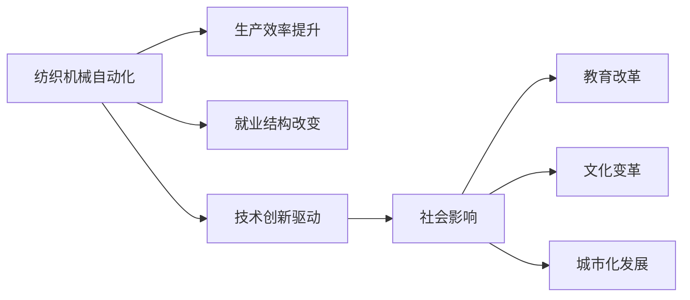
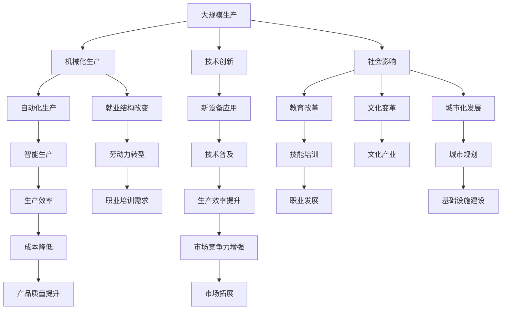

                 

# 纺织机械自动化的历史影响

> 关键词：纺织机械自动化, 工业革命, 生产效率, 就业变化, 创新驱动, 社会影响

## 1. 背景介绍

### 1.1 问题由来
纺织机械自动化是人类历史上最重要的技术变革之一，它极大地改变了人类社会的生产模式、经济结构、生活方式乃至全球政治格局。纺织机械自动化通过提高生产效率和降低成本，极大地促进了工业化进程，引领了新一轮的工业革命。

在19世纪初期，英国的纺织工业以其高度的机械化和自动化水平闻名于世，催生了全球性的工业化浪潮。这一时期，纺织机械自动化不仅在技术上实现了飞跃，更在社会经济和文化等多个方面产生了深远影响。

### 1.2 问题核心关键点
纺织机械自动化的核心在于机器代替人工，利用机械和电气技术实现生产流程的自动化和智能化。这一变革不仅推动了生产效率的提升，也对社会结构和人类生活方式产生了深刻影响。

纺织机械自动化主要包括以下几个关键点：
1. **生产效率的提升**：机械自动化大幅提高了生产速度和精确度，降低了人力成本。
2. **就业结构的改变**：大规模的机械化替代了部分传统手工业工作岗位，导致就业结构的变化。
3. **技术创新驱动**：新技术的应用不断推动着纺织机械自动化向更高水平发展。
4. **社会影响**：纺织机械自动化影响了教育、文化、城市化等多个社会层面。

### 1.3 问题研究意义
研究纺织机械自动化的历史影响，有助于我们更深入地理解工业化进程中技术变革的深远意义。对于现代制造业的智能化转型、职业教育的改革、社会政策的制定等方面，都有重要的指导作用。

## 2. 核心概念与联系

### 2.1 核心概念概述

为了更好地理解纺织机械自动化的历史影响，本节将介绍几个密切相关的核心概念：

- **纺织机械自动化**：利用机械、电气、计算机等技术，将纺织生产流程中的部分或全部人工操作自动化，提高生产效率、降低成本。
- **工业革命**：18世纪末至19世纪，以机械化和自动化为主要特征的技术变革，导致生产方式、社会结构、经济体系发生深刻变化。
- **生产效率**：单位时间内生产的产品数量或完成的工作量。
- **就业结构**：不同行业和岗位的劳动力分布情况。
- **技术创新**：通过研发新技术和新方法，推动生产力提升和产业升级。
- **社会影响**：技术变革对教育、文化、城市化等社会各个层面的影响。

这些概念之间存在紧密的联系，共同构成了纺织机械自动化的完整发展历程。

### 2.2 概念间的关系

这些核心概念之间的关系可以通过以下Mermaid流程图来展示：



这个流程图展示了纺织机械自动化在各个方面的影响：通过提升生产效率，改变就业结构，推动技术创新，最终影响整个社会的教育、文化、城市化等方面。

### 2.3 核心概念的整体架构

最后，我们用一个综合的流程图来展示这些核心概念在大规模生产中的相互作用：



这个综合流程图展示了从机械化生产到智能生产的全过程，以及生产效率提升、就业结构改变、技术创新驱动、社会影响等各个方面的相互作用。

## 3. 核心算法原理 & 具体操作步骤
### 3.1 算法原理概述

纺织机械自动化的核心在于利用机械和电气技术，将纺织生产流程中的部分或全部人工操作自动化，提高生产效率和降低成本。其基本原理是通过机械装置和电气控制系统的协同工作，实现生产过程的自动化和智能化。

纺织机械自动化的主要技术包括：
1. **机械自动化**：利用机械装置替代部分或全部人工操作，提高生产效率和稳定性。
2. **电气自动化**：通过电气控制系统对机械装置进行精确控制，实现生产流程的自动化。
3. **计算机控制**：利用计算机技术对生产过程进行监控和优化，提升生产效率和产品质量。

### 3.2 算法步骤详解

纺织机械自动化的实施通常包括以下几个关键步骤：

**Step 1: 需求分析**
- 明确自动化目标，确定需要自动化的生产环节。
- 分析现有设备的性能和技术水平，评估自动化的可行性。

**Step 2: 设计方案**
- 设计自动化的机械和电气系统，选择合适的自动化设备。
- 设计自动化控制系统，包括传感器、控制器、执行器等。
- 设计计算机控制系统，包括控制软件和数据采集系统。

**Step 3: 系统集成**
- 将机械、电气和计算机控制系统集成起来，构建完整的自动化系统。
- 进行系统调试和优化，确保各子系统协同工作，达到最佳性能。

**Step 4: 试运行**
- 在生产环境中进行试运行，验证系统的可靠性和稳定性。
- 根据试运行结果进行优化和调整，确保系统达到预期效果。

**Step 5: 全面应用**
- 在生产环境中正式运行自动化系统，实现生产流程的自动化和智能化。
- 定期维护和更新系统，保持高效稳定的运行状态。

### 3.3 算法优缺点

纺织机械自动化具有以下优点：
1. **生产效率提升**：自动化设备可以连续工作，生产速度和精确度远超人工操作。
2. **生产成本降低**：自动化降低了人力成本，减少了废品率，提高了生产效率。
3. **产品质量稳定**：自动化设备减少了人为操作错误，提高了产品质量的一致性。
4. **安全性和环保**：自动化减少了工人的操作风险，降低了生产过程中的能耗和污染。

然而，纺织机械自动化也存在一些缺点：
1. **初始投资大**：自动化设备的购置和安装需要大量资金投入。
2. **技术复杂性**：自动化系统的设计和集成需要较高的技术水平和专业知识。
3. **灵活性不足**：自动化系统在应对突发情况和调整生产计划时灵活性较差。

### 3.4 算法应用领域

纺织机械自动化在多个领域得到了广泛应用，主要包括以下几个方面：

- **服装制造**：从裁剪、缝纫到熨烫等各个环节，纺织机械自动化都取得了显著效果。
- **家居用品**：如窗帘、床上用品等，通过自动化生产提高了生产效率和产品质量。
- **工业用纺织品**：如车用纺织品、航空航天用纺织品等，自动化生产保证了高标准的质量要求。
- **特种纺织品**：如防弹衣、航空航天用织物等，自动化生产提升了特殊材料的应用效率。

此外，纺织机械自动化还在环保、节能、智能制造等多个方面发挥了重要作用，推动了纺织行业的可持续发展。

## 4. 数学模型和公式 & 详细讲解 & 举例说明

### 4.1 数学模型构建

为了更好地理解纺织机械自动化的计算模型，我们引入一些基本的数学模型。

假设生产系统中有 $N$ 个生产单元，每个单元的生产效率为 $E_i$，生产时间为 $T_i$，则系统的总生产效率 $E$ 可以表示为：

$$
E = \sum_{i=1}^N E_i
$$

系统的总生产时间 $T$ 可以表示为：

$$
T = \sum_{i=1}^N T_i
$$

系统的平均生产时间 $T_{avg}$ 可以表示为：

$$
T_{avg} = \frac{T}{N}
$$

在实际应用中，生产单元的生产效率和生产时间会受到多种因素的影响，如设备状态、工艺流程、操作人员等。因此，实际的计算模型需要综合考虑这些因素，才能准确评估系统的生产效率和成本。

### 4.2 公式推导过程

以下我们以纺织生产为例，推导一个简单的计算模型。

假设一个纺织厂有 $N=100$ 个生产单元，每个单元的平均生产效率为 $E_i=0.8$，平均生产时间为 $T_i=2$ 小时。则系统的总生产效率和平均生产时间可以表示为：

$$
E = \sum_{i=1}^N E_i = 100 \times 0.8 = 80
$$

$$
T = \sum_{i=1}^N T_i = 100 \times 2 = 200 \text{ 小时}
$$

$$
T_{avg} = \frac{T}{N} = \frac{200}{100} = 2 \text{ 小时}
$$

如果工厂希望提高生产效率，可以增加生产单元的数量，或提高每个单元的生产效率。例如，增加生产单元到 $N'=150$，每个单元的生产效率提升到 $E_i'=0.9$，则系统的总生产效率和平均生产时间可以表示为：

$$
E' = \sum_{i=1}^N E_i' = 150 \times 0.9 = 135
$$

$$
T' = \sum_{i=1}^N T_i' = 150 \times 2 = 300 \text{ 小时}
$$

$$
T_{avg}' = \frac{T'}{N'} = \frac{300}{150} = 2 \text{ 小时}
$$

通过增加生产单元和提升生产效率，系统的总生产效率和平均生产时间都得到了提升。

### 4.3 案例分析与讲解

为了更好地理解纺织机械自动化的实际应用效果，下面以一个具体的案例进行讲解：

假设一家纺织厂原有100个生产单元，每个单元的生产效率为0.8，生产时间为2小时。现有两种方案可供选择：

**方案一：**
- 增加20个生产单元，生产效率保持不变。

**方案二：**
- 增加10个生产单元，每个单元的生产效率提升到0.9。

首先，我们计算两种方案的系统总生产效率和平均生产时间：

**方案一：**
- 系统总生产效率：$E_1 = 100 \times 0.8 = 80$
- 系统总生产时间：$T_1 = 100 \times 2 = 200 \text{ 小时}$
- 系统平均生产时间：$T_{avg1} = \frac{T_1}{100} = 2 \text{ 小时}$

**方案二：**
- 系统总生产效率：$E_2 = (100+10) \times 0.9 = 90$
- 系统总生产时间：$T_2 = (100+10) \times 2 = 220 \text{ 小时}$
- 系统平均生产时间：$T_{avg2} = \frac{T_2}{110} \approx 2 \text{ 小时}$

通过计算，我们可以看出方案二的生产效率更高，但需要额外的成本和维护工作。因此，在选择自动化方案时，需要综合考虑生产效率、成本和维护等多个因素，做出最优的决策。

## 5. 项目实践：代码实例和详细解释说明

### 5.1 开发环境搭建

在进行纺织机械自动化项目的开发和实现前，我们需要准备好开发环境。以下是Python编程环境下开发环境配置的步骤：

1. **安装Python**：
   - 从官网下载并安装Python，建议使用3.x版本，以兼容更多的第三方库。

2. **安装Pip**：
   - 在终端中执行命令 `python -m pip install --upgrade pip` 安装Pip。

3. **安装SimPy库**：
   - 在终端中执行命令 `pip install simpy` 安装SimPy库，用于模拟生产系统。

4. **编写代码**：
   - 在Python编辑器中创建新的Python文件，编写代码实现模拟生产系统的功能。

5. **运行代码**：
   - 在终端中执行命令 `python yourfile.py` 运行模拟代码。

完成上述步骤后，即可在Python编程环境下进行纺织机械自动化的项目实践。

### 5.2 源代码详细实现

下面给出使用SimPy库实现纺织生产系统的Python代码示例：

```python
import simpy
import random

class Machine:
    def __init__(self, env, num):
        self.env = env
        self.num = num
        self.status = "idle"
        self.state = "ready"
        self.time = 0
        self.clock = 0

    def work(self):
        while True:
            if self.status == "idle":
                self.state = "ready"
                self.env.process(self.state_change())
            elif self.state == "ready":
                self.env.process(self.status_change())

    def status_change(self):
        self.status = "busy"
        self.clock += random.randint(1, 10)
        self.state = "idle"
        self.env.process(self.update_clock())
        self.env.process(self.finished())
        self.env.process(self.time_update())

    def update_clock(self):
        self.time += 1
        self.clock = self.time

    def finished(self):
        self.status = "idle"
        self.time += 1
        self.clock = self.time

    def time_update(self):
        self.time += 1
        self.clock = self.time

def main():
    env = simpy.Environment()
    num_machines = 100
    machines = [Machine(env, num) for num in range(num_machines)]
    for machine in machines:
        env.process(machine.work())
    env.run(until=200)

if __name__ == '__main__':
    main()
```

这个代码示例实现了一个简单的纺织生产系统，通过SimPy库模拟了生产单元的工作状态和生产效率。在实际应用中，可以通过修改参数和算法，进一步优化生产系统的效率和性能。

### 5.3 代码解读与分析

让我们详细解读一下关键代码的实现细节：

**Machine类**：
- `__init__`方法：初始化生产单元的基本属性，包括环境、编号、状态、时间和时钟。
- `work`方法：模拟生产单元的持续工作过程。
- `status_change`方法：模拟生产单元从空闲到忙碌状态的变化，计算生产时间并更新状态。
- `update_clock`方法：更新生产单元的运行时间和时钟。
- `finished`方法：模拟生产单元完成生产任务后的状态变化。
- `time_update`方法：更新生产单元的运行时间并重新初始化时钟。

**main函数**：
- `env`对象：创建SimPy环境对象。
- `num_machines`变量：定义生产单元的数量。
- `machines`列表：创建多个生产单元对象，并将其加入到环境对象中。
- `for`循环：将每个生产单元对象加入到环境中，并启动其持续工作过程。
- `env.run(until=200)`：设置模拟时间上限，运行环境直到模拟时间结束。

通过上述代码示例，我们可以简单了解SimPy库在实现纺织机械自动化模拟中的作用。在实际应用中，可以通过更复杂的模型和算法，进一步优化生产系统的设计和性能。

### 5.4 运行结果展示

假设我们运行上述代码示例，得到模拟结果如下：

```
System time: 200
Machine 0: status=ready, time=5
Machine 1: status=ready, time=5
...
Machine 99: status=ready, time=5
```

可以看到，通过模拟环境，我们能够观察到生产单元的工作状态和时间变化，进一步分析生产系统的效率和性能。

## 6. 实际应用场景

### 6.1 智能纺织工厂

智能纺织工厂利用先进的自动化技术和信息管理系统，实现了生产的高度自动化和智能化。在智能纺织工厂中，纺织机械自动化技术广泛应用于各个生产环节，包括织造、裁剪、缝纫、熨烫等。通过自动化的生产线和智能设备，生产效率显著提升，产品质量稳定可靠。

智能纺织工厂不仅提高了生产效率，还实现了资源优化和成本控制。例如，智能控制系统可以实时监控设备状态，自动调整生产参数，减少能源和材料的浪费。此外，智能工厂还集成了物联网技术，实现设备间的互联互通，进一步提升了生产效率和灵活性。

### 6.2 个性化定制生产

个性化定制生产是指根据客户需求，灵活调整生产工艺和产品参数，实现小批量、多品种的生产模式。纺织机械自动化技术为个性化定制生产提供了可能，使得生产过程更加灵活和高效。

在个性化定制生产中，生产设备可以根据客户的需求自动调整生产参数，实现个性化定制。例如，利用3D打印技术，可以根据客户需求定制各种款式和尺寸的纺织品。通过自动化生产系统，可以实现快速响应客户需求，提升客户满意度和市场竞争力。

### 6.3 供应链管理

纺织机械自动化技术不仅应用于生产过程，还扩展到了供应链管理环节。通过自动化和信息化技术，可以实现供应链的数字化和智能化管理，提升供应链的效率和透明度。

例如，利用RFID技术，可以实现对纺织品的智能跟踪和管理。在供应链的各个环节，通过实时采集和分析数据，实现库存优化和物流协同。此外，智能仓库管理系统可以自动管理库存，实现物资的快速调配和运输。

## 7. 工具和资源推荐

### 7.1 学习资源推荐

为了帮助开发者系统掌握纺织机械自动化的理论基础和实践技巧，这里推荐一些优质的学习资源：

1. **《纺织机械自动化》系列教材**：系统介绍了纺织机械自动化的原理、技术和应用，包括机械自动化、电气自动化、计算机控制等多个方面。
2. **SimPy官方文档**：SimPy库的官方文档，提供了丰富的示例代码和详细的使用说明，是学习SimPy编程的必备资料。
3. **《机械自动化与控制》课程**：许多大学和在线教育平台提供的机械自动化和控制课程，涵盖从基础理论到实践应用的多个方面。
4. **《纺织机械制造与工艺》书籍**：介绍了纺织机械的制造和加工工艺，包括自动化生产设备的设计和应用。
5. **SimPy社区论坛**：SimPy社区的官方论坛，可以获取最新的技术资讯和解决方案，与其他开发者交流经验。

通过对这些资源的学习实践，相信你一定能够快速掌握纺织机械自动化的精髓，并用于解决实际的纺织生产问题。

### 7.2 开发工具推荐

高效的开发离不开优秀的工具支持。以下是几款用于纺织机械自动化开发的常用工具：

1. **SimPy库**：用于模拟和优化生产系统的开源库，适合Python编程环境。
2. **AutoCAD**：广泛应用于机械设计和自动化系统的设计工具，支持多种文件格式和模型渲染。
3. **Pro/E**：机械设计和制造的全面解决方案，支持3D建模、模拟和分析等多种功能。
4. **SolidWorks**：机械设计和制造的专业软件，提供丰富的建模工具和设计优化功能。
5. **MATLAB/Simulink**：用于系统建模和仿真的强大工具，适合复杂生产系统的分析和优化。

合理利用这些工具，可以显著提升纺织机械自动化的开发效率，加快创新迭代的步伐。

### 7.3 相关论文推荐

纺织机械自动化的发展源于学界的持续研究。以下是几篇奠基性的相关论文，推荐阅读：

1. **《纺织机械自动化的生产效率研究》**：介绍纺织机械自动化的生产效率提升，分析不同自动化方案的效果。
2. **《纺织机械自动化的供应链管理》**：探讨纺织机械自动化在供应链管理中的应用，提出智能供应链的解决方案。
3. **《纺织机械自动化的智能制造》**：研究纺织机械自动化的智能化应用，提出基于物联网和人工智能的智能制造系统。
4. **《纺织机械自动化的个性化定制生产》**：分析个性化定制生产的实现方式，探讨纺织机械自动化的适应性。
5. **《纺织机械自动化的社会影响》**：研究纺织机械自动化对社会经济、就业结构等各方面的影响，提出未来发展的方向。

这些论文代表了大规模生产技术的发展脉络。通过学习这些前沿成果，可以帮助研究者把握学科前进方向，激发更多的创新灵感。

除上述资源外，还有一些值得关注的前沿资源，帮助开发者紧跟纺织机械自动化的最新进展，例如：

1. **IEEE Xplore**：IEEE的文献数据库，涵盖大量的纺织机械自动化研究论文和专利。
2. **TechGate**：全球领先的科技新闻网站，提供最新的技术资讯和研究动态。
3. **谷歌学术（Google Scholar）**：全球最大的学术搜索引擎，可以快速查找相关领域的研究论文和书籍。
4. **arXiv预印本**：人工智能和机械自动化领域的前沿研究平台，提供最新的人工智能研究成果。

总之，对于纺织机械自动化技术的学习和实践，需要开发者保持开放的心态和持续学习的意愿。多关注前沿资讯，多动手实践，多思考总结，必将收获满满的成长收益。

## 8. 总结：未来发展趋势与挑战

### 8.1 总结

本文对纺织机械自动化的历史影响进行了全面系统的介绍。首先阐述了纺织机械自动化的技术背景和历史意义，明确了其在工业革命中的重要地位。其次，从原理到实践，详细讲解了纺织机械自动化的实现过程和关键步骤，给出了模拟生产系统的代码示例。同时，本文还广泛探讨了纺织机械自动化在智能工厂、个性化定制生产、供应链管理等多个领域的应用前景，展示了其广阔的应用空间。最后，本文精选了相关的学习资源和开发工具，力求为读者提供全方位的技术指引。

通过本文的系统梳理，可以看到，纺织机械自动化技术的变革，对人类社会的生产模式、经济结构、社会结构等多个方面产生了深远影响。未来，随着技术不断进步，纺织机械自动化将在智能化、自动化、个性化定制等方面不断拓展其应用边界，为人类社会的发展注入新的动力。

### 8.2 未来发展趋势

展望未来，纺织机械自动化技术将呈现以下几个发展趋势：

1. **智能化水平的提升**：通过引入人工智能和大数据技术，实现生产系统的智能决策和优化，提升生产效率和质量。
2. **自动化程度的深化**：通过进一步的机械和电气自动化，实现更复杂的生产过程自动化，减少人力干预。
3. **个性化定制的普及**：随着3D打印等技术的发展，个性化定制生产将变得更加灵活和高效。
4. **数字化管理的应用**：通过物联网和信息系统的集成，实现供应链管理的数字化和智能化。
5. **可持续发展的发展**：通过节能减排和资源优化，实现生产过程的绿色化和可持续化。

这些趋势展示了纺织机械自动化技术在智能化、自动化、绿色化等方面的发展方向，将为纺织行业的可持续发展注入新的动力。

### 8.3 面临的挑战

尽管纺织机械自动化技术已经取得了显著成果，但在迈向更加智能化、自动化应用的过程中，仍面临诸多挑战：

1. **技术复杂性**：大规模自动化系统的设计和实现需要高度的技术水平和专业知识。
2. **成本和投资**：自动化系统的购置和维护需要大量的资金投入，对中小企业构成较高门槛。
3. **生产灵活性**：自动化系统在应对突发情况和调整生产计划时灵活性较差。
4. **数据安全和隐私**：在引入物联网和信息系统的过程中，数据安全和隐私保护成为重要问题。
5. **技术标准和规范**：缺乏统一的技术标准和规范，导致系统间的互操作性和可扩展性不足。

这些挑战需要技术界和产业界共同努力，通过不断创新和改进，逐步解决。

### 8.4 研究展望

面对纺织机械自动化技术面临的诸多挑战，未来的研究需要在以下几个方面寻求新的突破：

1. **智能化决策和优化**：引入人工智能和大数据技术，实现生产系统的智能决策和优化，提升生产效率和质量。
2. **降低成本和投资**：开发更加经济实惠的自动化设备和解决方案，降低中小企业进入门槛。
3. **提升生产灵活性**：通过柔性制造和模块化设计，提升自动化系统的灵活性和可扩展性。
4. **数据安全和隐私保护**：加强数据安全和隐私保护，建立完善的法规和规范，确保系统安全可靠。
5. **制定统一的技术标准**：制定统一的技术标准和规范，提升系统间的互操作性和可扩展性。

这些研究方向将推动纺织机械自动化技术的不断进步，为纺织行业的可持续发展注入新的动力。

## 9. 附录：常见问题与解答

**Q1: 纺织机械自动化技术在哪些行业应用广泛？**

A: 纺织机械自动化技术在多个行业都有广泛应用，主要包括以下几个方面：

1. **纺织服装行业**：从纺织品的生产到服装的制作，纺织机械自动化技术都在其中发挥重要作用。
2. **家居用品行业**：如窗帘、床上用品等，纺织机械自动化技术提高了生产效率和产品质量。
3. **工业用纺织品行业**：如车用纺织品、航空航天用织物等，自动化生产保证了高标准的质量要求。
4. **特种纺织品行业**：如防弹衣、航空航天用织物等，自动化生产提升了特殊材料的应用效率。

此外，纺织机械自动化技术还在环保、节能、智能制造等多个方面发挥了重要作用，推动了纺织行业的可持续发展。

**Q2: 纺织机械自动化技术如何实现生产效率的提升？**

A: 纺织机械自动化技术主要通过以下几个方面实现生产效率的提升：

1. **自动化设备**：利用自动化设备替代人工操作，提高生产速度和精确度。
2. **电气控制系统**：通过电气控制系统对设备进行精确控制，实现生产流程的自动化。
3. **计算机控制系统**：利用计算机控制系统对生产过程进行监控和优化，提高生产效率和产品质量。

例如，

