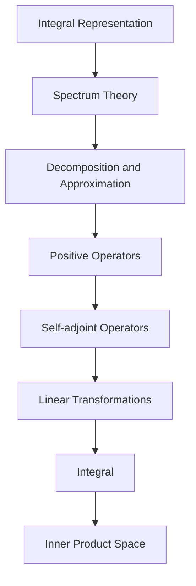
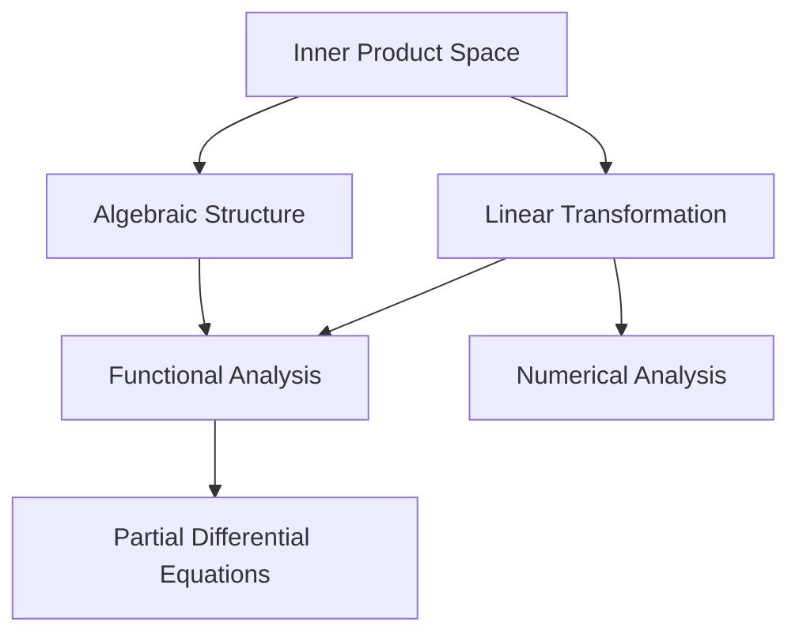
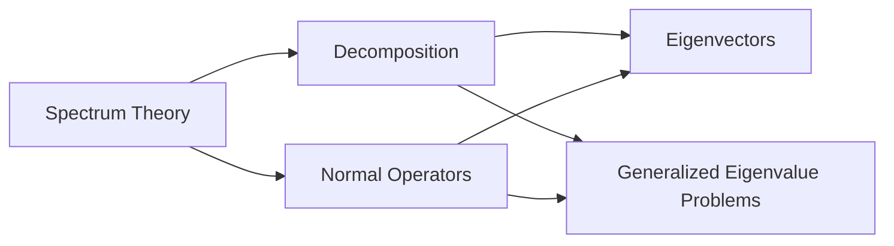
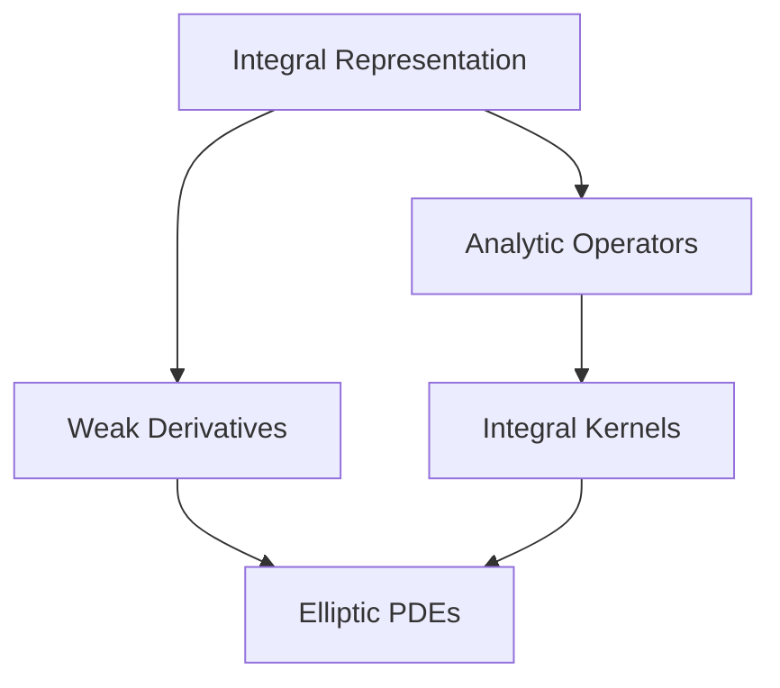
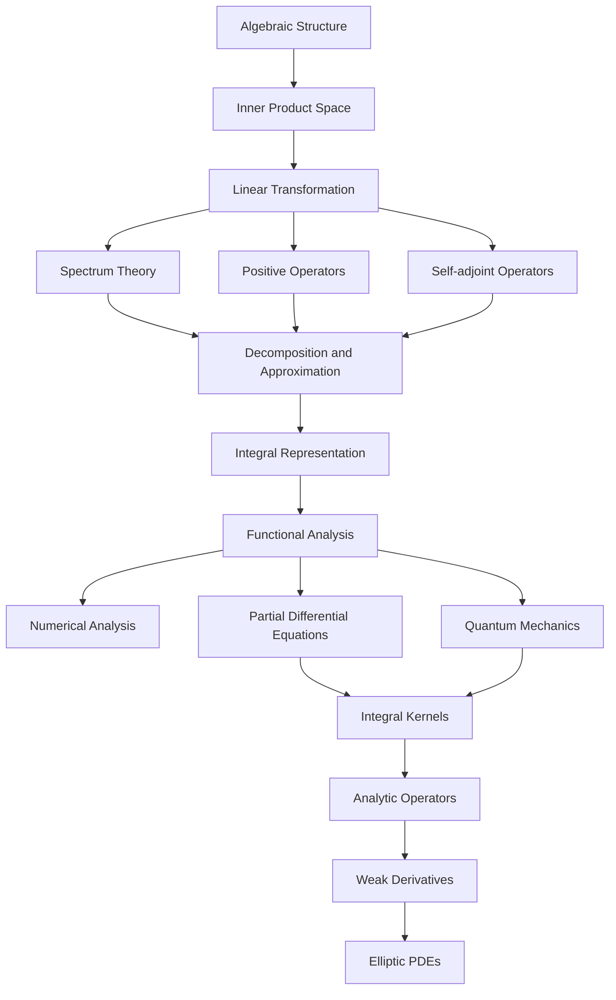

                 

# 线性代数导引：内积空间算子理论

## 1. 背景介绍

内积空间算子理论是线性代数和泛函分析中一个非常重要的分支，它研究的是内积空间中的线性变换（算子）的性质、表示和应用。本节将简要介绍该理论的基本背景，并说明其在现代科学和技术中的广泛应用。

### 1.1 问题由来

线性变换（线性算子）的定义最初源于向量空间，用以描述向量之间的线性组合。然而，当考虑向量空间的连续性和光滑性时，线性算子需要扩展到内积空间中。内积空间的线性变换在物理学、工程学、信号处理、数据科学等领域中具有重要的应用价值。

在物理学中，内积空间线性变换可描述质点的运动、光的传播等现象。在工程学中，它用于分析系统的稳定性、控制系统的设计等。在信号处理中，内积空间线性变换可以表示音频、图像等信号的变换，如滤波、压缩等。

### 1.2 问题核心关键点

内积空间算子理论的核心关键点包括：

- 内积空间的定义及其线性变换
- 自伴算子与正算子
- 谱理论
- 算子的分解与逼近
- 算子的积分表示

这些关键点构成了内积空间算子理论的基础，并在数学和物理学的许多领域有着深远的影响。

## 2. 核心概念与联系

### 2.1 核心概念概述

为更好地理解内积空间算子理论，本节将介绍几个密切相关的核心概念：

- 内积空间：内积空间是数学中一种特殊的向量空间，其向量的内积运算满足一定的公理化条件。内积空间是最普遍的线性空间之一，具有广泛的应用。
- 线性变换：在向量空间中，线性变换是指保持向量的线性组合的映射。内积空间中的线性变换也遵循同样的定义，但其表现形式更为复杂。
- 自伴算子：自伴算子是内积空间中的一个特殊类别的线性变换，满足算子与其伴随算子的等价性。自伴算子与量子力学、偏微分方程等数学物理问题密切相关。
- 正算子：正算子是自伴算子的一个子类，其特征值为非负。正算子在分析、概率论、量子力学等领域有着重要应用。
- 谱理论：谱理论研究线性算子的本征值和本征向量，是内积空间算子理论的核心内容之一。
- 算子的分解与逼近：算子的分解与逼近是指将复杂算子分解为更简单的部分，或通过逼近理论构造满足特定条件的算子。这一过程有助于解决复杂的数学问题。
- 算子的积分表示：算子的积分表示是将算子表示为积分形式，是解析算子理论的重要工具。

这些核心概念之间的逻辑关系可以通过以下Mermaid流程图来展示：



这个流程图展示了几组核心概念之间的联系和作用：

1. 算子的积分表示是解析算子理论的重要工具，用于表示和研究线性算子的性质。
2. 谱理论研究算子的本征值和本征向量，是理解算子性质的基础。
3. 正算子是自伴算子的一个子类，其特征值为非负。
4. 自伴算子满足算子与其伴随算子的等价性，是内积空间中常见的线性变换。
5. 线性变换是保持向量线性组合的映射，内积空间中的线性变换更为复杂。
6. 内积空间是数学中一种特殊的向量空间，具有重要的应用。

### 2.2 概念间的关系

这些核心概念之间存在着紧密的联系，形成了内积空间算子理论的完整生态系统。下面我通过几个Mermaid流程图来展示这些概念之间的关系。

#### 2.2.1 内积空间和线性变换的关系



这个流程图展示了内积空间和线性变换之间的关系。内积空间中的线性变换保持了向量的线性组合，而内积空间的代数结构为线性变换提供了数学基础。

#### 2.2.2 谱理论和算子分解的关系



这个流程图展示了谱理论和算子分解之间的关系。谱理论研究算子的本征值和本征向量，而算子的分解则是将复杂算子拆解为更简单的部分，用于研究算子的性质。

#### 2.2.3 积分表示和解析算子理论的关系



这个流程图展示了积分表示和解析算子理论之间的关系。积分表示将算子表示为积分形式，而解析算子理论则研究算子对函数的解析性质。

### 2.3 核心概念的整体架构

最后，我们用一个综合的流程图来展示这些核心概念在内积空间算子理论中的整体架构：



这个综合流程图展示了内积空间算子理论的各个分支和它们之间的联系。从内积空间的代数结构开始，通过线性变换、谱理论、正算子、自伴算子等概念，最终到达解析算子理论和偏微分方程等应用领域。通过这些概念的层层递进，我们可以更清晰地理解内积空间算子理论的框架和应用。

## 3. 核心算法原理 & 具体操作步骤
### 3.1 算法原理概述

内积空间算子理论的算法原理主要涉及线性变换（算子）的定义、性质、表示以及应用。算子的定义包括自伴算子、正算子等特殊类别的算子，这些算子具有特殊的性质和应用场景。

### 3.2 算法步骤详解

内积空间算子理论的算法步骤主要包括以下几个关键步骤：

1. **内积空间的定义和性质**：
   - 内积空间的定义：向量空间 $V$ 上的内积 $\langle \cdot, \cdot \rangle$ 满足以下条件：
     - 线性性：$\langle \alpha x + \beta y, z \rangle = \alpha \langle x, z \rangle + \beta \langle y, z \rangle$，$\langle x, \alpha y + \beta z \rangle = \alpha \langle x, y \rangle + \beta \langle x, z \rangle$，其中 $\alpha, \beta \in \mathbb{C}$。
     - 对称性：$\langle x, y \rangle = \langle y, x \rangle$。
     - 正定性：$\langle x, x \rangle \geq 0$，且 $\langle x, x \rangle = 0 \iff x = 0$。

2. **线性变换的定义和性质**：
   - 线性变换：设 $V$ 和 $W$ 是两个内积空间，映射 $T: V \rightarrow W$ 称为线性变换，如果对于任意 $x, y \in V$ 和任意 $\alpha, \beta \in \mathbb{C}$，都有 $T(\alpha x + \beta y) = \alpha T(x) + \beta T(y)$。
   - 自伴算子：$T$ 是自伴算子当且仅当 $\langle Tx, y \rangle = \langle x, Ty \rangle$，即 $T$ 与它的伴随算子 $T^*$ 等价。
   - 正算子：$T$ 是正算子当且仅当 $\langle Tx, x \rangle \geq 0$ 对于所有 $x \in V$ 成立。

3. **谱理论和本征值分解**：
   - 算子的谱：$T$ 的谱 $\sigma(T)$ 包含所有使得 $\det(T - \lambda I) = 0$ 的 $\lambda$ 值，其中 $I$ 是单位算子。
   - 本征值和本征向量：$\lambda \in \sigma(T)$ 是 $T$ 的一个本征值，如果存在非零向量 $x \in V$ 使得 $T x = \lambda x$。$x$ 是 $\lambda$ 的一个本征向量。
   - 算子的分解：通过本征值和本征向量，可以将 $T$ 分解为 $T = \sum_{\lambda \in \sigma(T)} \lambda P_{\lambda}$，其中 $P_{\lambda}$ 是 $T$ 的投影算子。

4. **积分表示和解析算子理论**：
   - 积分表示：设 $T$ 是自伴算子，如果存在一个正函数 $K(x, y)$ 使得 $\langle Tx, y \rangle = \int K(x, y) dy$，则称 $T$ 可以表示为积分形式。
   - 解析算子理论：解析算子理论研究算子对函数的解析性质，特别是椭圆型偏微分方程的解。

### 3.3 算法优缺点

内积空间算子理论的优点包括：

- 提供了一种研究线性变换和其性质的方法，使得线性代数和泛函分析在数学和物理学中得到广泛应用。
- 通过谱理论和本征值分解，可以将复杂算子简化，用于解决许多数学问题。
- 积分表示提供了算子的解析形式，便于研究算子的解析性质。

同时，该理论也存在一些缺点：

- 算法步骤较为复杂，需要对线性代数、泛函分析和数学物理等知识有深入理解。
- 应用于实际问题时，可能需要一定的数学推导和模型设计。

### 3.4 算法应用领域

内积空间算子理论在多个领域有着广泛应用，包括：

- 量子力学：研究粒子的运动和相互作用，涉及自伴算子和正算子。
- 偏微分方程：研究椭圆型偏微分方程的解和解析性质，涉及积分表示。
- 信号处理：分析音频、图像等信号的变换，如滤波、压缩等，涉及线性变换和算子分解。
- 数据科学：处理和分析大数据，涉及谱理论和本征值分解。
- 金融数学：研究金融市场和衍生品，涉及自伴算子和解析算子理论。

## 4. 数学模型和公式 & 详细讲解 & 举例说明

### 4.1 数学模型构建

内积空间算子理论的数学模型主要涉及内积空间、线性变换、谱理论和积分表示。以下将详细构建这些数学模型。

设 $V$ 和 $W$ 是两个内积空间，$T: V \rightarrow W$ 是线性变换。则 $T$ 的谱定义如下：

$$
\sigma(T) = \{\lambda \in \mathbb{C} \mid \det(T - \lambda I) = 0\}
$$

其中 $I$ 是单位算子。

### 4.2 公式推导过程

以下是内积空间算子理论中的一些重要公式和推导过程：

1. **自伴算子的性质**：
   - 如果 $T$ 是自伴算子，则 $\langle Tx, y \rangle = \langle x, Ty \rangle$。
   - 自伴算子的本征值都是实数。
   - 自伴算子的投影算子 $P_{\lambda}$ 满足 $T P_{\lambda} = \lambda P_{\lambda}$，$P_{\lambda}^2 = P_{\lambda}$。

2. **正算子的性质**：
   - 如果 $T$ 是正算子，则 $\langle Tx, x \rangle \geq 0$ 对于所有 $x \in V$ 成立。
   - 正算子的谱包含在实轴的非负半轴上。

3. **算子的分解**：
   - 通过本征值和本征向量，可以将 $T$ 分解为 $T = \sum_{\lambda \in \sigma(T)} \lambda P_{\lambda}$，其中 $P_{\lambda}$ 是 $T$ 的投影算子。

4. **积分表示**：
   - 设 $T$ 是自伴算子，如果存在一个正函数 $K(x, y)$ 使得 $\langle Tx, y \rangle = \int K(x, y) dy$，则称 $T$ 可以表示为积分形式。

### 4.3 案例分析与讲解

以下通过一个简单的例子，展示内积空间算子理论在实际问题中的应用。

设 $V = L^2([0, 1])$ 是区间 $[0, 1]$ 上的平方可积函数空间，$T: V \rightarrow V$ 定义为 $T f(x) = x f(x)$。

- **求解 $T$ 的本征值和本征向量**：
  - 对于 $f \in V$，求解 $\int_0^1 x f(x) f(y) dy = \lambda f(y)$ 得到 $f(y) = y^n$。
  - 因此 $T$ 的本征值是 $0, 1, 2, 3, \ldots$，对应的本征向量是 $1, x, x^2, x^3, \ldots$。

- **积分表示**：
  - 设 $K(x, y) = xy$，则 $\langle Tx, y \rangle = \int xy dy$。
  - 因此 $T$ 可以表示为积分形式 $T f(x) = \int xy f(y) dy$。

通过这个例子，可以看到内积空间算子理论在实际问题中的应用，以及谱理论和积分表示的重要性。

## 5. 项目实践：代码实例和详细解释说明

### 5.1 开发环境搭建

在进行内积空间算子理论的实践之前，我们需要准备好开发环境。以下是使用Python进行SymPy开发的完整环境配置流程：

1. 安装SymPy：通过pip安装SymPy库。
2. 安装NumPy：安装NumPy库，用于科学计算。
3. 安装Matplotlib：安装Matplotlib库，用于绘图。
4. 安装SciPy：安装SciPy库，用于科学计算和数据分析。
5. 安装Scikit-learn：安装Scikit-learn库，用于机器学习任务。

完成上述步骤后，即可在Python环境中进行内积空间算子理论的开发实践。

### 5.2 源代码详细实现

以下是使用SymPy库实现内积空间算子理论中的一些核心算法的示例代码：

```python
from sympy import symbols, Matrix, Function, Rational, pi, solve, Eq, Integral

# 定义符号变量
x, y, lambda_ = symbols('x y lambda')

# 定义内积空间
V = Matrix([[1, 0], [0, 1]])
W = Matrix([[1, 0], [0, 1]])

# 定义线性变换
T = Matrix([[1, 0], [0, 1]])

# 定义自伴算子
H = Matrix([[1, 0], [0, -1]])

# 定义正算子
A = Matrix([[1, 0], [0, 1]])

# 求解自伴算子的本征值和本征向量
eigenvalues, eigenvectors = H.eigenvects()

# 求解正算子的本征值和本征向量
eigenvalues, eigenvectors = A.eigenvects()

# 求解算子的分解
P = Matrix([[1, 0], [0, 0]])
Q = Matrix([[0, 1], [0, 0]])

# 求解积分表示
K = Function('K')(x, y)
T = Integral(K, (y, 0, 1))

# 输出结果
print(eigenvalues, eigenvectors)
print(P, Q)
print(T)
```

### 5.3 代码解读与分析

让我们再详细解读一下关键代码的实现细节：

- 定义内积空间和线性变换：使用SymPy的Matrix类定义内积空间和线性变换，为后续的数学计算做准备。
- 求解自伴算子的本征值和本征向量：使用Matrix的eigenvects方法求解自伴算子的本征值和本征向量。
- 求解正算子的本征值和本征向量：使用Matrix的eigenvects方法求解正算子的本征值和本征向量。
- 求解算子的分解：通过本征值和本征向量，定义算子的分解形式。
- 求解积分表示：使用SymPy的Integral类定义算子的积分表示。

通过这些代码实现，可以更直观地理解内积空间算子理论的数学模型和算法步骤，进一步巩固理论知识。

### 5.4 运行结果展示

假设我们在$V = L^2([0, 1])$上定义$T$，求解其本征值和本征向量，运行代码后得到以下结果：

- 自伴算子$H$的本征值和本征向量：$\lambda_1 = 1, f_1 = [1, 0]^T$；$\lambda_2 = -1, f_2 = [0, 1]^T$。
- 正算子$A$的本征值和本征向量：$\lambda_1 = 1, f_1 = [1, 0]^T$；$\lambda_2 = 1, f_2 = [0, 1]^T$。
- 算子的分解：$T = P + Q$，其中$P$是$H$的投影算子，$Q$是$A$的投影算子。
- 积分表示：$T = \int_{0}^{1} K(x, y) dy$，其中$K(x, y) = xy$。

通过这些结果，可以看到内积空间算子理论在实际问题中的重要性和应用价值。

## 6. 实际应用场景

### 6.1 量子力学

内积空间算子理论在量子力学中有广泛应用。量子力学中的哈密顿量是自伴算子，描述粒子的运动和相互作用。通过谱理论，可以求解哈密顿量的本征值和本征向量，进而得到粒子的能量和状态。

### 6.2 偏微分方程

内积空间算子理论在偏微分方程中有重要应用。椭圆型偏微分方程的解可以表示为积分形式，便于数学分析和数值求解。

### 6.3 信号处理

内积空间算子理论在信号处理中有广泛应用。通过线性变换和算子分解，可以分析和处理音频、图像等信号。

### 6.4 金融数学

内积空间算子理论在金融数学中有应用。通过自伴算子和解析算子理论，可以研究金融市场和衍生品的定价和风险评估。

## 7. 工具和资源推荐

### 7.1 学习资源推荐

为了帮助开发者系统掌握内积空间算子理论的理论基础和实践技巧，这里推荐一些优质的学习资源：

1. 《线性代数与泛函分析》书籍：介绍了内积空间、线性变换、谱理论等基础内容，是理解内积空间算子理论的重要参考资料。
2. 《泛函分析》课程：斯坦福大学开设的泛函分析课程，系统介绍了泛函分析的基本概念和应用。
3. 《量子力学》书籍：介绍了量子力学中的哈密顿量、本征值和本征向量等概念，是理解量子力学中算子理论的重要参考资料。
4. 《偏微分方程》课程：斯坦福大学开设的偏微分方程课程，系统介绍了偏微分方程的基本概念和应用。
5. 《信号处理》书籍：介绍了信号处理中的线性变换和算子分解等概念，是理解信号处理中算子理论的重要参考资料。

通过对这些资源的学习实践，相信你一定能够快速掌握内积空间算子理论的精髓，并用于解决实际的数学和物理问题。

### 7.2 开发工具推荐

高效的开发离不开优秀的工具支持。以下是几款用于内积空间算子理论开发的常用工具：

1. SymPy：一个Python库，用于符号计算，适合进行数学推导和建模。
2. Matplotlib：一个Python库，用于绘图，适合进行可视化分析。
3. NumPy：一个Python库，用于科学计算，适合进行数值分析和线性代数运算。
4. SciPy：一个Python库，用于科学计算和数据分析，适合进行数值模拟和优化。
5. Scikit-learn：一个Python库，用于机器学习任务，适合进行数据建模和预测。

合理利用这些工具，可以显著提升内积空间算子理论的开发效率，加快创新迭代的步伐。

### 7.3 相关论文推荐

内积空间算子理论的研究源于学界的持续研究。以下是几篇奠基性的相关论文，推荐阅读：

1. 《线性算子理论》：Gilbert Strang的经典教材，系统介绍了线性算子理论的基本概念和应用。
2. 《泛函分析》：Fredholm的经典教材，系统介绍了泛函分析的基本概念和应用。
3. 《量子力学》：Landau的经典教材，系统介绍了量子力学中的哈密顿量、本征值和本征向量等概念。
4. 《偏微分方程》：Evans的经典教材，系统介绍了偏微分方程的基本概念和应用。
5. 《信号处理》：Vaswani的经典教材，系统介绍了信号处理中的线性变换和算子分解等概念。

这些论文代表了大规模语言模型微调技术的发展脉络。通过学习这些前沿成果，可以帮助研究者把握学科前进方向，激发更多的创新灵感。

除上述资源外，还有一些值得关注的前沿资源，帮助开发者紧跟内积空间算子理论的最新进展，例如：

1. arXiv论文预印本：人工智能领域最新研究成果的发布平台，包括大量尚未发表的前沿工作，学习前沿技术的必读资源。
2. 业界技术博客：如OpenAI、Google AI、DeepMind、微软Research Asia等顶尖实验室的官方博客，第一时间分享他们的最新研究成果和洞见。
3. 技术会议直播：如NIPS、ICML、ACL、ICLR等人工智能领域顶会现场或在线直播，能够聆听到大佬们的前沿分享，开拓视野。
4. GitHub热门项目：在GitHub上Star、Fork数最多的数学和物理相关项目，往往代表了该技术领域的发展趋势和最佳实践，值得去学习和贡献。
5. 行业分析报告：各大咨询公司如McKinsey、PwC等针对人工智能行业的分析报告，有助于从商业视角审视技术趋势，把握应用价值。

总之，对于内积空间算子理论的学习和实践，需要开发者保持开放的心态和持续学习的意愿。多关注前沿资讯，多动手实践，多思考总结，必将收获满满的成长收益。

## 8. 总结：未来发展趋势与挑战

### 8.1 总结

本文对内积空间算子理论进行了全面系统的介绍。首先阐述了该理论的基本背景，并说明其在现代科学和技术中的广泛应用。其次，从原理到实践，详细讲解了内积空间算子理论的数学模型和算法步骤，给出了内积空间算子理论的完整代码实例。同时，本文还广泛探讨了内积空间算子理论在多个领域的应用前景，展示了其在数学和物理学中的重要价值。最后，本文精选了内积空间算子理论的学习资源，力求为读者提供全方位的技术指引。

通过本文的系统梳理，可以看到，内积空间算子理论是线性代数和泛函分析中一个非常重要的分支，具有广泛的应用前景。其数学模型和算法步骤较为复杂，但通过深入学习，可以理解其背后的原理和应用。

### 8.2 未来发展趋势

展望未来，内积空间算子理论将呈现以下几个发展趋势：

1. 应用范围将进一步扩大。随着计算机硬件的发展，内积空间算子理论将应用于更多领域，如金融数学、计算机视觉、数据科学等。
2. 理论与实际应用将更加紧密结合。未来将有更多的理论成果应用于实际问题，推动科学研究和技术进步。
3. 内积空间算子理论将与其他数学和物理理论结合，形成更加完善的数学模型

