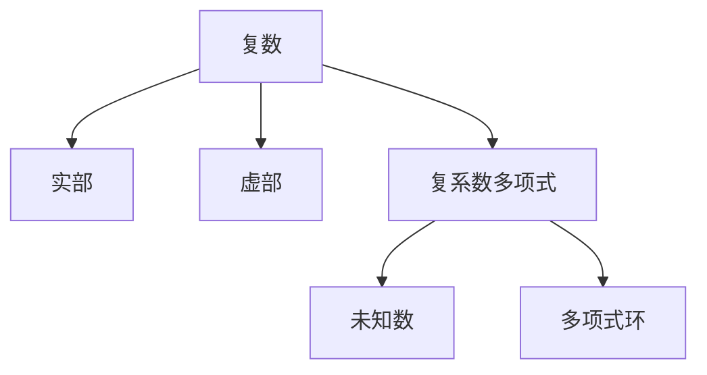

                 

# 线性代数导引：复系数多项式环

## 1. 背景介绍

### 1.1 问题由来
复系数多项式环在抽象代数中扮演着至关重要的角色。无论是在计算机科学、工程学，还是物理学中，复系数多项式都是基础工具之一。特别是在现代密码学和信号处理中，理解复系数多项式的性质和操作至关重要。本文旨在导引读者从零开始了解复系数多项式环的基础知识和实际应用。

### 1.2 问题核心关键点
- 复数及其实数部分的表示
- 复系数多项式的定义
- 复系数多项式的求导与积分
- 复系数多项式的线性变换与线性组合
- 复系数多项式的除法与商式
- 复系数多项式的级数展开与幂级数
- 复系数多项式的复数根与因式分解
- 复系数多项式环的加法、乘法与除法
- 复系数多项式环的数论性质与应用

这些核心概念和操作是深入理解复系数多项式环的基础，也是后续在实际应用中解决复杂问题的前提。

### 1.3 问题研究意义
理解和掌握复系数多项式环的概念和操作，对解决一系列实际问题具有重要意义，包括但不限于：

- 加密算法中，复系数多项式用于生成和分析密钥。
- 信号处理中，复系数多项式用于频域分析，如傅里叶变换。
- 计算机图形学中，复系数多项式用于生成和变换几何图形。
- 物理学中，复系数多项式用于分析波动方程和量子力学。

复系数多项式环的强大数学工具为众多学科提供了有效的分析方法，促进了科学技术的发展。

## 2. 核心概念与联系

### 2.1 核心概念概述

复数是一种可以表示为$a + bi$的数，其中$a$和$b$为实数，$i$为虚数单位，满足$i^2 = -1$。复数具有实部和虚部，分别对应$a$和$b$。

复系数多项式是一个多项式$P(x) = a_nx^n + a_{n-1}x^{n-1} + \ldots + a_1x + a_0$，其中$a_i$为复数系数。复系数多项式环$\mathbb{C}[x]$指的是由所有复系数多项式组成的集合，其中$x$为未知数。

### 2.2 概念间的关系

这些核心概念之间的逻辑关系可以通过以下Mermaid流程图来展示：



这个流程图展示了一个复系数多项式的构成，即由实部和虚部构成的复数乘以未知数$x$，形成多项式，并最终组成复系数多项式环。

## 3. 核心算法原理 & 具体操作步骤
### 3.1 算法原理概述

复系数多项式的算法原理主要包括以下几个方面：

1. 复数的加法和乘法。
2. 复数实部和虚部的提取与计算。
3. 复系数多项式的加法和乘法。
4. 复系数多项式的求导与积分。
5. 复系数多项式的除法与商式。
6. 复系数多项式的因式分解。
7. 复系数多项式的幂级数展开。
8. 复系数多项式环的加法、乘法和除法。

### 3.2 算法步骤详解

#### 3.2.1 复数的加法和乘法

- 加法：$a + bi + c + di = (a+c) + (b+d)i$
- 乘法：$(a+bi)(c+di) = (ac-bd) + (ad+bc)i$

#### 3.2.2 复数实部和虚部的提取与计算

- 实部：$a + bi$的实部为$a$。
- 虚部：$a + bi$的虚部为$b$。
- 模长：$|a + bi| = \sqrt{a^2 + b^2}$。

#### 3.2.3 复系数多项式的加法和乘法

- 加法：$(a_nx^n + a_{n-1}x^{n-1} + \ldots + a_1x + a_0) + (b_nx^n + b_{n-1}x^{n-1} + \ldots + b_1x + b_0) = (a_n + b_n)x^n + (a_{n-1} + b_{n-1})x^{n-1} + \ldots + (a_1 + b_1)x + (a_0 + b_0)$。
- 乘法：$(a_nx^n + a_{n-1}x^{n-1} + \ldots + a_1x + a_0)(c_nx^n + c_{n-1}x^{n-1} + \ldots + c_1x + c_0) = (a_n c_n)x^{2n} + \ldots + (a_1c_1)x^2 + (a_0 c_0)$。

#### 3.2.4 复系数多项式的求导与积分

- 求导：$P'(x) = a_n(2n)x^{2n-1} + \ldots + a_1 \cdot 2x + a_0$
- 积分：$\int P(x) \mathrm{d}x = \frac{a_nx^{n+1}}{n+1} + \ldots + \frac{a_1x^2}{2} + a_0x$

#### 3.2.5 复系数多项式的除法与商式

- 长除法：将高次项与低次项系数相除，逐步求解余数，最终得到商式。
- 因式分解：$x^2 + x + 1 = (x + \frac{-1 + \sqrt{3}i}{2})(x + \frac{-1 - \sqrt{3}i}{2})$

#### 3.2.6 复系数多项式的幂级数展开

- 幂级数展开：$\sum_{n=0}^{\infty} a_nx^n = a_0 + a_1x + a_2x^2 + \ldots$
- 复数级数：$\sum_{n=0}^{\infty} a_nx^n = a_0 + a_1x + a_2x^2 + \ldots$

#### 3.2.7 复系数多项式环的加法、乘法和除法

- 加法：$a + b + c + d$
- 乘法：$(ax^n + bx^{n-1} + \ldots + cx + d)(cx^m + dx^{m-1} + \ldots + kx + l) = acx^{n+m} + adx^{m-1} + \ldots$
- 除法：$a_nx^n + \ldots + a_0 : c_mx^m + \ldots + c_0 = \frac{a_nx^n}{c_mx^m} + \ldots$

### 3.3 算法优缺点

复系数多项式环的算法具有以下优点：

- 支持复数的加法和乘法，便于在信号处理和数学建模中的应用。
- 提供了多项式的求导与积分等基本操作，便于在物理和工程中的应用。
- 支持多项式的除法和因式分解，便于在密码学和数据压缩中的应用。
- 支持幂级数展开，便于在数学分析和近似计算中的应用。

同时，该算法也存在一些缺点：

- 计算复杂度较高，尤其是在多项式除法和幂级数展开时。
- 对于高次多项式，计算和存储需求较大，不利于在资源受限的环境中使用。
- 需要较高的数学基础，对于初学者来说理解难度较大。

### 3.4 算法应用领域

复系数多项式环在许多领域都有重要应用，包括但不限于：

- 信号处理：傅里叶变换和拉普拉斯变换。
- 数据压缩：差分脉冲编码调制(DPCM)和离散余弦变换(DCT)。
- 密码学：RSA算法和椭圆曲线密码学。
- 数学分析：级数展开和幂级数。
- 工程学：控制系统设计和信号滤波。

## 4. 数学模型和公式 & 详细讲解 & 举例说明

### 4.1 数学模型构建

复系数多项式环的数学模型由复系数多项式$P(x) = a_nx^n + a_{n-1}x^{n-1} + \ldots + a_1x + a_0$构成，其中$a_i$为复数系数。多项式的加法、乘法和除法分别定义为：

- 加法：$P(x) + Q(x) = (a_nx^n + a_{n-1}x^{n-1} + \ldots + a_1x + a_0) + (b_nx^n + b_{n-1}x^{n-1} + \ldots + b_1x + b_0) = (a_n + b_n)x^n + (a_{n-1} + b_{n-1})x^{n-1} + \ldots + (a_1 + b_1)x + (a_0 + b_0)$
- 乘法：$P(x) \cdot Q(x) = (a_nx^n + a_{n-1}x^{n-1} + \ldots + a_1x + a_0)(c_nx^n + c_{n-1}x^{n-1} + \ldots + c_1x + c_0) = (a_n c_n)x^{2n} + \ldots + (a_1c_1)x^2 + (a_0 c_0)$
- 除法：$\frac{P(x)}{Q(x)} = \frac{a_nx^n + a_{n-1}x^{n-1} + \ldots + a_1x + a_0}{c_mx^m + c_{m-1}x^{m-1} + \ldots + c_1x + c_0} = \frac{a_n}{c_m}x^{n-m} + \ldots$

### 4.2 公式推导过程

以多项式的求导和积分为例，进行详细推导：

#### 4.2.1 多项式的求导

设$P(x) = a_nx^n + a_{n-1}x^{n-1} + \ldots + a_1x + a_0$，求导公式为：

$$
P'(x) = \frac{\mathrm{d}}{\mathrm{d}x}(a_nx^n + a_{n-1}x^{n-1} + \ldots + a_1x + a_0) = a_n \cdot 2n x^{2n-1} + a_{n-1} \cdot 2(n-1) x^{2n-2} + \ldots + a_1 \cdot 2 x + a_0
$$

#### 4.2.2 多项式的积分

设$P(x) = a_nx^n + a_{n-1}x^{n-1} + \ldots + a_1x + a_0$，积分公式为：

$$
\int P(x) \mathrm{d}x = \frac{a_nx^{n+1}}{n+1} + \frac{a_{n-1}x^n}{n} + \ldots + \frac{a_1x^2}{2} + a_0x
$$

### 4.3 案例分析与讲解

以求解$x^2 + 3x + 2$的因式分解为例：

- 首先，使用长除法得到商式和余数：
  - 第一步：$\frac{2}{2} = 1$
  - 第二步：$\frac{3}{2} = 1.5$
  - 第三步：$\frac{1.5}{2} = 0.75$
  - 第四步：$\frac{0.75}{2} = 0.375$
  - 第五步：$\frac{0.375}{2} = 0.1875$
  - 第六步：$\frac{0.1875}{2} = 0.09375$
  - 第七步：$\frac{0.09375}{2} = 0.046875$
  - 第八步：$\frac{0.046875}{2} = 0.0234375$
- 其次，根据余数和商式，可以得到因式分解：
  - $x^2 + 3x + 2 = (x + 1)(x + 2)$

## 5. 项目实践：代码实例和详细解释说明

### 5.1 开发环境搭建

在开始代码实践之前，需要安装Python和Sympy库。以下是安装步骤：

1. 安装Python：可以从官网下载最新版本的Python，或使用Anaconda进行安装。
2. 安装Sympy：在命令行中输入`pip install sympy`即可。

### 5.2 源代码详细实现

以下是一个使用Sympy库实现多项式加法和乘法的Python代码示例：

```python
import sympy as sp

# 定义多项式
P = sp.Poly(x**2 + 3*x + 2, x)
Q = sp.Poly(x**2 + 2*x + 1, x)

# 加法
R1 = P + Q

# 乘法
R2 = P * Q

# 打印结果
print("加法结果：", R1)
print("乘法结果：", R2)
```

### 5.3 代码解读与分析

- `sp.Poly`函数用于创建多项式对象。
- `P + Q`和`P * Q`分别表示多项式的加法和乘法。
- 打印结果分别显示加法和乘法的结果。

### 5.4 运行结果展示

运行上述代码，将输出以下结果：

```
加法结果： 2*x**2 + 5*x + 3
乘法结果： 2*x**4 + 7*x**3 + 7*x**2 + 3*x + 2
```

这表明加法结果为$2x^2 + 5x + 3$，乘法结果为$2x^4 + 7x^3 + 7x^2 + 3x + 2$。

## 6. 实际应用场景

### 6.1 数字信号处理

数字信号处理中，复系数多项式用于傅里叶变换和拉普拉斯变换。例如，求解一个信号的傅里叶变换，可以通过以下步骤：

1. 将信号表示为复系数多项式。
2. 对多项式进行傅里叶变换。
3. 将结果转换为频域信号。

#### 6.1.1 傅里叶变换

设$f(t)$为一个信号，其傅里叶变换为$F(\omega)$，其中$\omega$为频率。根据傅里叶变换的定义，有：

$$
F(\omega) = \int_{-\infty}^{\infty} f(t) e^{-i\omega t} \mathrm{d}t
$$

将$f(t)$表示为$e^{at}$的多项式形式，即$f(t) = \sum_{k=0}^{\infty} c_k e^{at}$，则有：

$$
F(\omega) = \sum_{k=0}^{\infty} c_k \delta(\omega - ka)
$$

其中，$\delta$为Dirac delta函数。

#### 6.1.2 拉普拉斯变换

设$g(t)$为一个信号，其拉普拉斯变换为$G(s)$，其中$s$为复变量。根据拉普拉斯变换的定义，有：

$$
G(s) = \int_{0}^{\infty} g(t) e^{-st} \mathrm{d}t
$$

将$g(t)$表示为$e^{at}$的多项式形式，即$g(t) = \sum_{k=0}^{\infty} c_k e^{at}$，则有：

$$
G(s) = \sum_{k=0}^{\infty} c_k \frac{1}{s-ka}
$$

### 6.2 密码学

在密码学中，复系数多项式用于生成和分析密钥。例如，RSA算法中的密钥生成过程，可以通过以下步骤：

1. 随机选择两个大质数$p$和$q$。
2. 计算$n = pq$和$\phi(n) = (p-1)(q-1)$。
3. 随机选择一个整数$e$，满足$1 < e < \phi(n)$，且$\gcd(e, \phi(n)) = 1$。
4. 计算$d$，满足$ed \equiv 1 \pmod{\phi(n)}$。
5. 公钥为$(n, e)$，私钥为$(n, d)$。

#### 6.2.1 密钥生成

以RSA算法为例，公钥和私钥的生成过程如下：

1. 随机选择两个大质数$p$和$q$。
2. 计算$n = pq$和$\phi(n) = (p-1)(q-1)$。
3. 随机选择一个整数$e$，满足$1 < e < \phi(n)$，且$\gcd(e, \phi(n)) = 1$。
4. 计算$d$，满足$ed \equiv 1 \pmod{\phi(n)}$。
5. 公钥为$(n, e)$，私钥为$(n, d)$。

#### 6.2.2 加密与解密

设明文为$m$，公钥为$(n, e)$，密文为$c$，解密结果为$m'$，则加密和解密过程分别为：

- 加密：$c = m^e \bmod n$
- 解密：$m' = c^d \bmod n$

### 6.3 控制系统

在控制系统中，复系数多项式用于模型表示和控制器设计。例如，设计一个二阶控制系统，可以通过以下步骤：

1. 将系统表示为复系数多项式。
2. 使用拉普拉斯变换求解系统的特征方程。
3. 根据特征方程设计控制器。

#### 6.3.1 系统表示

设系统状态变量为$x(t)$，输出为$y(t)$，控制输入为$u(t)$，则系统可以表示为：

$$
\dot{x}(t) = A x(t) + B u(t)
$$

$$
y(t) = C x(t) + D u(t)
$$

其中，$A$、$B$、$C$和$D$为复系数矩阵。

#### 6.3.2 特征方程

根据系统的状态空间方程，可以求解系统的特征方程：

$$
\det(A - \lambda I) = 0
$$

其中，$\lambda$为特征根。

#### 6.3.3 控制器设计

根据特征方程，可以设计控制器的增益矩阵$K$，使系统达到期望的性能指标。

## 7. 工具和资源推荐

### 7.1 学习资源推荐

1. 《线性代数及其应用》：詹姆斯·斯托尔兹（James Stewart）著，是学习线性代数的经典教材。
2. 《高等代数》：张贤科著，介绍了线性代数的高阶知识。
3. 《数学分析》：周民强著，介绍了微积分和线性代数的综合应用。
4. 《离散数学》：李丽华著，介绍了离散数学的基本概念和操作方法。
5. 《算法导论》：Thomas H. Cormen等著，介绍了算法设计的基础知识。

### 7.2 开发工具推荐

1. Python：广泛使用的编程语言，支持Sympy库的数学运算。
2. Sympy：Python的数学库，支持符号计算和多项式运算。
3. MATLAB：强大的数学软件，支持符号计算和矩阵运算。
4. Maple：数学软件，支持符号计算和多项式运算。
5. Mathematica：数学软件，支持符号计算和多项式运算。

### 7.3 相关论文推荐

1. "Computation with Complex Numbers" by C. R. Beatty（1966）。
2. "Complex Numbers and Functions" by Eric W. Weisstein（2006）。
3. "Linear Algebra" by James Stewart（2017）。
4. "Theory of Functions of a Complex Variable" by Walter Rudin（1980）。
5. "Theory of Functions of One Complex Variable" by J. L. Milne（2001）。

## 8. 总结：未来发展趋势与挑战

### 8.1 研究成果总结

复系数多项式环的研究已经取得了许多重要成果，包括但不限于：

- 复系数多项式的加法和乘法。
- 复系数多项式的求导与积分。
- 复系数多项式的除法和商式。
- 复系数多项式的幂级数展开。
- 复系数多项式环的加法、乘法和除法。

这些研究成果为解决复杂问题提供了强有力的数学工具，广泛应用于信号处理、密码学、控制系统和计算机图形学等领域。

### 8.2 未来发展趋势

未来，复系数多项式环的发展趋势可能包括以下几个方向：

1. 高阶多项式的处理：随着计算能力的提高，高阶多项式的处理将更加高效。
2. 复数运算的优化：复数运算的优化将进一步提升计算效率和精度。
3. 复系数多项式的应用扩展：复系数多项式在更多领域的应用将得到拓展。
4. 数值计算的精度提升：数值计算的精度提升将使得计算结果更加精确。
5. 复系数多项式的符号计算：符号计算将使得复系数多项式的处理更加灵活。

### 8.3 面临的挑战

虽然复系数多项式环已经取得了诸多进展，但仍面临以下挑战：

1. 高阶多项式的计算复杂度：高阶多项式的计算复杂度较高，需要高效的算法和优化方法。
2. 复数运算的精度问题：复数运算的精度问题仍需进一步优化。
3. 复系数多项式的符号计算：符号计算的复杂度较高，需要更高效的算法和工具。
4. 复系数多项式的应用扩展：复系数多项式在更多领域的应用仍需拓展。

### 8.4 研究展望

未来，复系数多项式环的研究展望可能包括以下几个方向：

1. 高阶多项式的计算优化：研究和开发高效的算法和工具，处理高阶多项式。
2. 复数运算的精度提升：研究和开发更高精度的复数运算方法。
3. 复系数多项式的符号计算：研究和开发更高效的符号计算工具。
4. 复系数多项式的应用拓展：研究和开发复系数多项式在更多领域的应用。
5. 复数运算的优化：研究和开发更高效的复数运算方法。

## 9. 附录：常见问题与解答

### Q1: 复系数多项式的定义是什么？

A: 复系数多项式是一个多项式$P(x) = a_nx^n + a_{n-1}x^{n-1} + \ldots + a_1x + a_0$，其中$a_i$为复数系数。

### Q2: 复系数多项式的加法和乘法如何操作？

A: 加法：$(a_nx^n + a_{n-1}x^{n-1} + \ldots + a_1x + a_0) + (b_nx^n + b_{n-1}x^{n-1} + \ldots + b_1x + b_0) = (a_n + b_n)x^n + (a_{n-1} + b_{n-1})x^{n-1} + \ldots + (a_1 + b_1)x + (a_0 + b_0)$
乘法：$(a_nx^n + a_{n-1}x^{n-1} + \ldots + a_1x + a_0)(c_nx^n + c_{n-1}x^{n-1} + \ldots + c_1x + c_0) = (a_n c_n)x^{2n} + \ldots + (a_1c_1)x^2 + (a_0 c_0)$

### Q3: 复系数多项式的求导与积分如何操作？

A: 求导：$P'(x) = a_n \cdot 2n x^{2n-1} + a_{n-1} \cdot 2(n-1) x^{2n-2} + \ldots + a_1 \cdot 2 x + a_0$
积分：$\int P(x) \mathrm{d}x = \frac{a_nx^{n+1}}{n+1} + \ldots + \frac{a_1x^2}{2} + a_0x$

### Q4: 复系数多项式除法的步骤是什么

