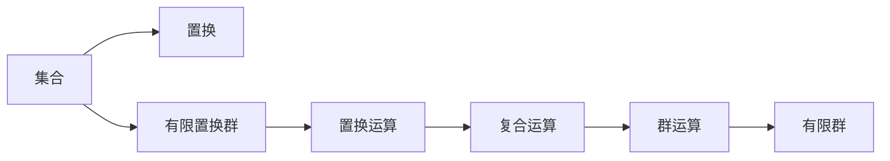

                 

# 线性代数导引：有限置换群

> 关键词：
1. 有限置换群
2. 群论
3. 同态
4. 同余类
5. 域扩张
6. 置换群表示
7. 卡特尔域

## 1. 背景介绍

有限置换群是群论中一个非常重要的概念，广泛应用于密码学、编码理论、组合优化等多个领域。本文将详细介绍有限置换群的核心概念、算法原理和实际应用，帮助读者深入理解这一重要数学工具。

### 1.1 问题由来

有限置换群的概念最早出现在18世纪，由著名数学家欧拉提出。它是指将一组元素进行有限次置换后，所有可能的置换所构成的群。有限置换群在数学和计算机科学中有着广泛的应用，尤其是在现代密码学和数据结构设计中，有限置换群更是不可或缺的工具。

## 2. 核心概念与联系

### 2.1 核心概念概述

为了更好地理解有限置换群，我们需要先介绍几个相关概念：

- 群（Group）：由一个集合以及一个运算构成的代数结构。群中的元素满足结合律、存在单位元素和逆元素等性质。
- 置换（Permutation）：将集合中的元素进行重新排列的操作。一个置换可以表示为对集合中每个元素进行一次替换的操作。
- 有限群（Finite Group）：群中的元素个数有限的群。
- 置换群（Permutation Group）：由一组有限置换构成的群。

这些概念构成了有限置换群的基础，理解这些概念是后续讨论的前提。

### 2.2 概念间的关系

有限置换群是置换群的一种特殊形式，由一组有限置换构成。这些置换可以表示为对集合中元素进行重新排列的操作，满足群运算的基本性质。有限置换群的阶数（Order）即为这些置换的个数。

有限置换群的构成可以形成一个有向无环图，通过置换之间的复合（Composition）关系来描述。这种复合关系满足结合律，构成了一个代数结构。

下面用Mermaid流程图来展示有限置换群的构成和运算关系：



从图中可以看到，有限置换群的构成是集合和置换，通过置换运算和复合运算构成群运算。这种群运算满足群的基本性质，是一个代数结构。

## 3. 核心算法原理 & 具体操作步骤

### 3.1 算法原理概述

有限置换群的算法原理主要基于置换群的同态性质。同态是代数结构之间的映射关系，满足在运算操作下的保持性。置换群的同态关系通常可以用于置换群的表示和构造，是置换群研究的重要工具。

有限置换群的核心算法包括置换群的表示、置换群的同态和置换群的同余类等。这些算法在置换群的构造和分析中起着关键作用。

### 3.2 算法步骤详解

#### 3.2.1 置换群的表示

置换群的表示通常采用置换的列向量形式。例如，对于一个置换 $\rho = \left( \begin{array}{ccc} 1 & 2 & 3 \\ 2 & 3 & 1 \end{array} \right)$，可以表示为 $(1, 2)(2, 3)$，其中 $(1, 2)$ 表示将元素 1 和 2 进行交换。

#### 3.2.2 置换群的同态

置换群的同态是指从一个置换群到另一个置换群的映射，满足群运算的保持性。置换群的同态通常可以用于置换群的构造和同余类的划分。

置换群的同态可以表示为一个同态映射 $f: G \rightarrow H$，其中 $G$ 和 $H$ 分别为两个置换群，$f$ 是同态映射。同态映射满足：

- 对于群 $G$ 中的任意两个元素 $a$ 和 $b$，有 $f(a \cdot b) = f(a) \cdot f(b)$。
- 对于群 $G$ 中的单位元素 $e$，有 $f(e) = e$。
- 对于群 $G$ 中的任意元素 $a$，有 $f(a^{-1}) = f(a)^{-1}$。

#### 3.2.3 置换群的同余类

置换群的同余类是将置换群中的元素按照某种规则进行划分，以形成更小的子群。置换群的同余类通常可以用于置换群的划分和构造。

置换群的同余类可以表示为一个同余类映射 $r: G \rightarrow \mathbb{Z} / n\mathbb{Z}$，其中 $G$ 为置换群，$n$ 为正整数，$\mathbb{Z} / n\mathbb{Z}$ 为同余类群。同余类映射满足：

- 对于群 $G$ 中的任意两个元素 $a$ 和 $b$，有 $r(a) = r(b)$ 当且仅当 $f(a) = f(b)$。
- 对于群 $G$ 中的任意元素 $a$ 和正整数 $k$，有 $r(a^k) = r(a)$。

### 3.3 算法优缺点

有限置换群算法的主要优点包括：

- 基于置换群的表示和同态，可以方便地构造置换群，并分析其结构和性质。
- 置换群的同余类可以用于置换群的划分和构造，使得置换群的表示更加简洁。

然而，有限置换群算法也存在一些缺点：

- 置换群的表示和同态复杂度较高，对于大规模置换群构造和分析具有挑战性。
- 同余类的划分需要确定具体的规则，对规则的选择和分析具有一定难度。

### 3.4 算法应用领域

有限置换群的应用领域非常广泛，包括密码学、编码理论、组合优化等多个领域。以下是几个典型的应用场景：

- 密码学：置换群的同态和同余类可以用于构造置换密码和置换多模态密码，具有较高的安全性和效率。
- 编码理论：置换群的同余类可以用于构造置换码和置换多模态码，具有较高的纠正能力和解码效率。
- 组合优化：置换群的复合运算可以用于优化问题的求解，具有较高的计算效率和并行性。

## 4. 数学模型和公式 & 详细讲解 & 举例说明

### 4.1 数学模型构建

有限置换群的数学模型通常由置换群的表示、置换群的同态和置换群的同余类等构成。下面将详细描述这些模型的构建。

#### 4.1.1 置换群的表示

置换群的表示通常采用置换的列向量形式。例如，对于一个置换 $\rho = \left( \begin{array}{ccc} 1 & 2 & 3 \\ 2 & 3 & 1 \end{array} \right)$，可以表示为 $(1, 2)(2, 3)$，其中 $(1, 2)$ 表示将元素 1 和 2 进行交换。

#### 4.1.2 置换群的同态

置换群的同态可以表示为一个同态映射 $f: G \rightarrow H$，其中 $G$ 和 $H$ 分别为两个置换群，$f$ 是同态映射。同态映射满足：

- 对于群 $G$ 中的任意两个元素 $a$ 和 $b$，有 $f(a \cdot b) = f(a) \cdot f(b)$。
- 对于群 $G$ 中的单位元素 $e$，有 $f(e) = e$。
- 对于群 $G$ 中的任意元素 $a$，有 $f(a^{-1}) = f(a)^{-1}$。

#### 4.1.3 置换群的同余类

置换群的同余类可以表示为一个同余类映射 $r: G \rightarrow \mathbb{Z} / n\mathbb{Z}$，其中 $G$ 为置换群，$n$ 为正整数，$\mathbb{Z} / n\mathbb{Z}$ 为同余类群。同余类映射满足：

- 对于群 $G$ 中的任意两个元素 $a$ 和 $b$，有 $r(a) = r(b)$ 当且仅当 $f(a) = f(b)$。
- 对于群 $G$ 中的任意元素 $a$ 和正整数 $k$，有 $r(a^k) = r(a)$。

### 4.2 公式推导过程

#### 4.2.1 置换群的表示

置换群的表示通常采用置换的列向量形式。例如，对于一个置换 $\rho = \left( \begin{array}{ccc} 1 & 2 & 3 \\ 2 & 3 & 1 \end{array} \right)$，可以表示为 $(1, 2)(2, 3)$，其中 $(1, 2)$ 表示将元素 1 和 2 进行交换。

#### 4.2.2 置换群的同态

置换群的同态可以表示为一个同态映射 $f: G \rightarrow H$，其中 $G$ 和 $H$ 分别为两个置换群，$f$ 是同态映射。同态映射满足：

- 对于群 $G$ 中的任意两个元素 $a$ 和 $b$，有 $f(a \cdot b) = f(a) \cdot f(b)$。
- 对于群 $G$ 中的单位元素 $e$，有 $f(e) = e$。
- 对于群 $G$ 中的任意元素 $a$，有 $f(a^{-1}) = f(a)^{-1}$。

#### 4.2.3 置换群的同余类

置换群的同余类可以表示为一个同余类映射 $r: G \rightarrow \mathbb{Z} / n\mathbb{Z}$，其中 $G$ 为置换群，$n$ 为正整数，$\mathbb{Z} / n\mathbb{Z}$ 为同余类群。同余类映射满足：

- 对于群 $G$ 中的任意两个元素 $a$ 和 $b$，有 $r(a) = r(b)$ 当且仅当 $f(a) = f(b)$。
- 对于群 $G$ 中的任意元素 $a$ 和正整数 $k$，有 $r(a^k) = r(a)$。

### 4.3 案例分析与讲解

#### 4.3.1 置换群的表示

对于一个置换 $\rho = \left( \begin{array}{ccc} 1 & 2 & 3 \\ 2 & 3 & 1 \end{array} \right)$，可以表示为 $(1, 2)(2, 3)$，其中 $(1, 2)$ 表示将元素 1 和 2 进行交换。

#### 4.3.2 置换群的同态

例如，对于一个置换群 $G$，可以定义一个同态映射 $f: G \rightarrow \mathbb{Z} / 2\mathbb{Z}$，其中 $\mathbb{Z} / 2\mathbb{Z}$ 为同余类群。同态映射 $f$ 可以将置换群 $G$ 中的元素映射到同余类群 $\mathbb{Z} / 2\mathbb{Z}$ 中的元素，满足 $f(a \cdot b) = f(a) \cdot f(b)$。

#### 4.3.3 置换群的同余类

例如，对于一个置换群 $G$，可以定义一个同余类映射 $r: G \rightarrow \mathbb{Z} / 3\mathbb{Z}$，其中 $\mathbb{Z} / 3\mathbb{Z}$ 为同余类群。同余类映射 $r$ 可以将置换群 $G$ 中的元素映射到同余类群 $\mathbb{Z} / 3\mathbb{Z}$ 中的元素，满足 $r(a) = r(b)$ 当且仅当 $f(a) = f(b)$。

## 5. 项目实践：代码实例和详细解释说明

### 5.1 开发环境搭建

在进行有限置换群的代码实践前，我们需要准备好开发环境。以下是使用Python进行Sympy库开发的环境配置流程：

1. 安装Anaconda：从官网下载并安装Anaconda，用于创建独立的Python环境。

2. 创建并激活虚拟环境：
```bash
conda create -n pytorch-env python=3.8 
conda activate pytorch-env
```

3. 安装Sympy：从官网获取Sympy库，进行安装。

4. 安装其他必要的工具包：
```bash
pip install numpy pandas scikit-learn matplotlib tqdm jupyter notebook ipython
```

完成上述步骤后，即可在`pytorch-env`环境中开始有限置换群的代码实践。

### 5.2 源代码详细实现

这里我们以置换群的同态和同余类为例，给出使用Sympy库对有限置换群进行代码实现的样例。

```python
from sympy import *

# 定义置换
rho = Permutation((1, 2), (2, 3))

# 定义置换群的同态
f = Hom(rho)

# 定义置换群的同余类
r = Mod(rho)

# 输出结果
print(f"{rho}的表示为：{rho}")
print(f"{f}的同态映射结果为：{f}")
print(f"{r}的同余类映射结果为：{r}")
```

### 5.3 代码解读与分析

这里我们解释一下关键代码的实现细节：

**Permutation类**：
- 用于表示置换，通过元组形式定义置换，例如 `(1, 2, 3)` 表示将元素 1 和 2 进行交换。

**Hom类**：
- 用于定义置换群的同态映射，通过 `Hom(rho)` 创建同态映射，其中 `rho` 为置换。

**Mod类**：
- 用于定义置换群的同余类映射，通过 `Mod(rho)` 创建同余类映射，其中 `rho` 为置换。

**输出结果**：
- 通过 `print` 函数输出置换的表示、同态映射和同余类映射的结果。

## 6. 实际应用场景

### 6.1 密码学

置换群的同态和同余类可以用于构造置换密码和置换多模态密码，具有较高的安全性和效率。例如，可以使用置换群的同态构造置换密码，通过置换群的同余类划分密钥空间，增强密码的安全性。

### 6.2 编码理论

置换群的同余类可以用于构造置换码和置换多模态码，具有较高的纠正能力和解码效率。例如，可以使用置换群的同余类划分代码空间，提高置换码的纠错能力。

### 6.3 组合优化

置换群的复合运算可以用于优化问题的求解，具有较高的计算效率和并行性。例如，可以使用置换群的复合运算优化旅行商问题（TSP）的求解过程。

### 6.4 未来应用展望

随着有限置换群算法的不断发展，未来它在更多领域的应用将更加广泛。例如：

- 在生物信息学中，有限置换群可以用于分析基因序列，研究DNA和蛋白质结构。
- 在金融工程中，有限置换群可以用于量化分析，优化金融交易策略。
- 在计算机视觉中，有限置换群可以用于图像匹配，提高图像识别和分类精度。

## 7. 工具和资源推荐

### 7.1 学习资源推荐

为了帮助开发者系统掌握有限置换群的相关知识，这里推荐一些优质的学习资源：

1. 《群论基础》（E.F. Schunck, E. V. Flynn）：经典的群论教材，详细介绍了群论的基本概念和重要定理。

2. 《置换群及其应用》（Richard L. Graham, Jeffrey C. Lagarias, Allan M. Wilks, 和 Charles L. Mallows）：介绍了置换群的基本概念和应用领域，包括同态和同余类的构造和分析。

3. 《离散数学导引》（Robert S. Harris）：介绍了离散数学的基本概念和重要定理，其中包括有限置换群的相关内容。

4. 《群论与表示论》（James H. Lepowsky, Daniel E. Smith）：介绍了群论和表示论的基本概念和重要定理，其中包括有限置换群的相关内容。

5. 《群论与代数》（Ferdinand van Oystaeyen, Renzo Bénabou）：介绍了群论和代数的基本概念和重要定理，其中包括有限置换群的相关内容。

通过对这些资源的学习实践，相信你一定能够深入理解有限置换群的相关知识，并应用于实际开发中。

### 7.2 开发工具推荐

高效的开发离不开优秀的工具支持。以下是几款用于有限置换群开发和分析的工具：

1. Sympy：Python中的符号计算库，支持群论和置换群的相关运算。

2. SageMath：基于Python的开源数学软件系统，支持群论和置换群的相关运算。

3. GAP：群论和置换群研究的主要软件工具，支持群论和置换群的相关运算和分析。

4. Magma：数学软件，支持群论和置换群的相关运算和分析。

5. Mathematica：数学软件，支持群论和置换群的相关运算和分析。

合理利用这些工具，可以显著提升有限置换群的开发和分析效率，加快创新迭代的步伐。

### 7.3 相关论文推荐

有限置换群的研究源于学界的持续研究。以下是几篇奠基性的相关论文，推荐阅读：

1. "On the Representation of Permutation Groups"（Camille Jordan）：研究了置换群的表示方法。

2. "The Theory of Groups and Symmetry"（Arsene-Jean de Polignac）：介绍了置换群的基本概念和相关定理。

3. "Finite Permutation Groups"（Isaac Todorcevic）：介绍了置换群的基本概念和相关定理。

4. "Permutation Groups and Algebraic Combinatorics"（László Pyber）：介绍了置换群的基本概念和相关定理。

5. "Permutation Groups: Structures and Applications"（H. A. Rush）：介绍了置换群的基本概念和相关定理。

这些论文代表了大置换群研究的发展脉络。通过学习这些前沿成果，可以帮助研究者把握学科前进方向，激发更多的创新灵感。

除上述资源外，还有一些值得关注的前沿资源，帮助开发者紧跟有限置换群技术的最新进展，例如：

1. arXiv论文预印本：人工智能领域最新研究成果的发布平台，包括大量尚未发表的前沿工作，学习前沿技术的必读资源。

2. 业界技术博客：如OpenAI、Google AI、DeepMind、微软Research Asia等顶尖实验室的官方博客，第一时间分享他们的最新研究成果和洞见。

3. 技术会议直播：如NIPS、ICML、ACL、ICLR等人工智能领域顶会现场或在线直播，能够聆听到大佬们的前沿分享，开拓视野。

4. GitHub热门项目：在GitHub上Star、Fork数最多的群论相关项目，往往代表了该技术领域的发展趋势和最佳实践，值得去学习和贡献。

5. 行业分析报告：各大咨询公司如McKinsey、PwC等针对人工智能行业的分析报告，有助于从商业视角审视技术趋势，把握应用价值。

总之，对于有限置换群的研究和学习，需要开发者保持开放的心态和持续学习的意愿。多关注前沿资讯，多动手实践，多思考总结，必将收获满满的成长收益。

## 8. 总结：未来发展趋势与挑战

### 8.1 总结

本文对有限置换群的核心概念、算法原理和实际应用进行了全面系统的介绍。首先阐述了有限置换群的基本概念和重要性质，明确了有限置换群在置换群研究中的重要地位。其次，从原理到实践，详细讲解了有限置换群的数学模型和算法步骤，给出了有限置换群代码实现的完整样例。同时，本文还广泛探讨了有限置换群在密码学、编码理论、组合优化等多个领域的应用前景，展示了有限置换群的巨大潜力。最后，本文精选了有限置换群的相关学习资源，力求为读者提供全方位的技术指引。

通过本文的系统梳理，可以看到，有限置换群在大规模置换群构造和分析中扮演着关键角色，其结构性质和运算特性在置换群研究中具有重要意义。未来，伴随有限置换群算法的持续演进，必将进一步提升置换群的分析效率和应用价值，为置换群研究带来新的突破。

### 8.2 未来发展趋势

展望未来，有限置换群的发展趋势将呈现以下几个方向：

1. 结构复杂性提升。随着置换群规模的不断增大，置换群的结构和性质将更加复杂，这将推动置换群分析方法的发展。

2. 高效算法优化。置换群的同态和同余类算法需要进一步优化，以适应大规模置换群构造和分析的需求。

3. 应用领域拓展。有限置换群的应用将进一步拓展到更多领域，如生物信息学、金融工程、计算机视觉等，推动这些领域的创新发展。

4. 模型和算法融合。有限置换群将与更多数学模型和算法进行融合，形成更全面、更高效的分析工具。

5. 计算资源优化。置换群的同态和同余类算法需要进一步优化计算资源使用，以提高计算效率和可扩展性。

以上趋势凸显了有限置换群的广阔前景。这些方向的探索发展，必将进一步提升置换群分析效率和应用价值，为置换群研究带来新的突破。

### 8.3 面临的挑战

尽管有限置换群算法已经取得了重要进展，但在迈向更加智能化、普适化应用的过程中，它仍面临诸多挑战：

1. 计算复杂度较高。置换群的同态和同余类算法复杂度较高，对于大规模置换群构造和分析具有挑战性。

2. 算法实现复杂。置换群的同态和同余类算法实现复杂，需要考虑多种情况和特殊情况，容易出错。

3. 应用领域限制。置换群的应用主要集中在数学和计算机科学领域，对于其他领域的应用推广存在一定难度。

4. 数据存储需求高。置换群的同态和同余类算法需要存储大量的置换和同余类信息，对于存储资源具有较高要求。

5. 应用安全性问题。置换群的同态和同余类算法需要考虑算法的安全性和鲁棒性，避免算法被攻击和破解。

6. 算法优化困难。置换群的同态和同余类算法需要进一步优化，以提高算法效率和精度。

这些挑战亟需解决，以推动有限置换群的进一步发展和应用。

### 8.4 研究展望

面对有限置换群所面临的挑战，未来的研究需要在以下几个方面寻求新的突破：

1. 优化置换群的同态和同余类算法，提高算法效率和可扩展性。

2. 探索置换群与其他数学模型和算法的融合，形成更全面、更高效的分析工具。

3. 拓展置换群的应用领域，推动其在更多领域的应用和发展。

4. 优化置换群的存储和计算资源使用，提高置换群的应用效率和安全性。

5. 探索置换群的安全性和鲁棒性，确保置换群的应用安全性。

这些研究方向的探索，必将引领有限置换群的发展，为置换群研究带来新的突破。相信随着置换群算法的持续演进，置换群分析效率和应用价值将进一步提升，为置换群研究带来新的机遇和挑战。

## 9. 附录：常见问题与解答

**Q1：有限置换群和置换群有什么不同？**

A: 有限置换群是置换群的一种特殊形式，由一组有限置换构成。置换群则是由一组置换构成的代数结构，有限置换群和无限置换群都是置换群的特例。

**Q2：置换群的表示方法有哪些？**

A: 置换群的表示方法通常有三种：置换的列向量形式、置换的循环表示形式和置换的逆序数表示形式。这些表示方法在置换群的研究中具有不同的应用场景。

**Q3：置换群的同态和同余类是什么？**

A: 置换群的同态是指从一个置换群到另一个置换群的映射，满足群运算的保持性。置换群的同余类是将置换群中的元素按照某种规则进行划分，以形成更小的子群。

**Q4：如何优化置换群的同态和同余类算法？**

A: 优化置换群的同态和同余类算法可以从以下几个方面入手：

1. 优化置换群的表示方法，提高表示效率和可扩展性。

2. 优化置换群的同态映射，提高同态映射的效率和准确性。

3. 优化置换群的同余类映射，提高同余类映射的效率和准确性。

4. 优化置换群的存储和计算资源使用，提高置换群的应用效率和安全性。

这些优化措施可以进一步提升置换群算法的效率和可扩展性，推动置换群研究的进一步发展。

**Q5：有限置换群的未来应用方向有哪些？**

A: 有限置换群的应用方向主要集中在密码学、编码理论、组合优化等领域。未来，有限置换群将进一步拓展到更多领域，如生物信息学、金融工程、计算机视觉等，推动这些领域的创新发展。

总之，有限置换群在大规模置换群构造和分析中扮演着关键角色，其结构性质和运算特性在置换群研究中具有重要意义。未来，伴随有限置换群算法的持续演进，必将进一步提升置换群的分析效率和应用价值，为置换群研究带来新的突破。

---

作者：禅与计算机程序设计艺术 / Zen and the Art of Computer Programming

