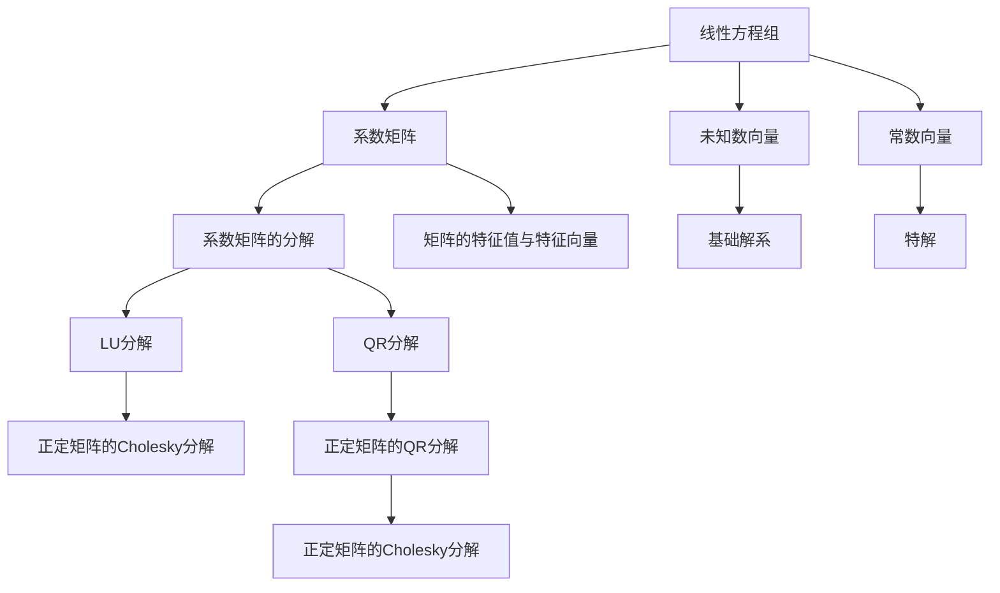

                 

# 线性代数导引：线性方程组

线性方程组是线性代数中的基本问题之一，具有广泛的实际应用背景。本篇文章将深入探讨线性方程组的基础理论，阐述其算法原理，并通过实际代码实例详细讲解具体的操作步骤。通过学习本文，你将掌握线性方程组的解法，理解其数学模型，并能够应用相关技术解决实际问题。

## 1. 背景介绍

### 1.1 问题由来

线性方程组在数学、物理、工程等领域有着广泛应用。例如，在电路分析中，线性方程组描述了电路中各节点电位之间的关系；在控制理论中，线性方程组描述了系统的动态行为。然而，在实际问题中，方程组往往具有多种形式和复杂的系数结构，求解过程面临诸多挑战。

线性方程组的解法多种多样，常见的有直接法、迭代法和矩阵分解法等。每种方法都有其优缺点和适用场景，需要根据具体问题进行选择。本文将详细介绍这些方法，并结合实际应用场景进行讨论。

### 1.2 问题核心关键点

线性方程组求解的核心在于找到满足所有方程的未知数解。在方程组中，未知数的个数与方程的个数决定了其解的情况。如果方程个数大于未知数个数，则方程组可能有唯一解、无数解或无解。

求解线性方程组的过程可以分为以下几步：
1. 理解方程组结构，判断是否存在解。
2. 选择合适的解法，如直接法、迭代法或矩阵分解法。
3. 应用解法进行求解，得到方程组的解或验证其无解。

## 2. 核心概念与联系

### 2.1 核心概念概述

在线性方程组求解过程中，需要理解以下核心概念：

- 线性方程组：由一组线性方程构成的方程组，形式为 $Ax = b$，其中 $A$ 为系数矩阵，$x$ 为未知数向量，$b$ 为常数向量。
- 系数矩阵：线性方程组中所有系数组成的矩阵。
- 常数向量：线性方程组中所有常数项组成的向量。
- 基础解系：方程组的通解形式，通常由齐次线性方程组的某个解和特解组成。
- 非齐次线性方程组：系数矩阵中包含常数项 $b$ 的方程组。
- 直接法：通过对方程组进行直接求解的方法，如高斯消元法。
- 迭代法：通过迭代逼近方程组解的方法，如雅可比迭代法、高斯-赛德尔迭代法。
- 矩阵分解法：通过矩阵分解和因式分解等技术，简化方程组的求解过程，如LU分解法。

### 2.2 概念间的关系

线性方程组的求解过程涉及多个核心概念。以下是这些概念之间的关系：



这个流程图展示了线性方程组求解过程中涉及的核心概念及其关系。系数矩阵和常数向量是求解的基础，而未知数向量和基础解系是求解的结果。直接法、迭代法和矩阵分解法是求解的具体方法，这些方法可以基于不同的矩阵分解进行应用。

## 3. 核心算法原理 & 具体操作步骤

### 3.1 算法原理概述

线性方程组求解的算法原理主要包括以下几种：

- **直接法**：通过对方程组进行直接求解，如高斯消元法、LU分解法。直接法的优点是计算简单，适用于小规模方程组。
- **迭代法**：通过迭代逼近方程组的解，如雅可比迭代法、高斯-赛德尔迭代法。迭代法的优点是适用于大规模方程组，但需要迭代收敛。
- **矩阵分解法**：通过矩阵分解和因式分解等技术，简化方程组的求解过程，如QR分解、LU分解、Cholesky分解等。

### 3.2 算法步骤详解

#### 3.2.1 高斯消元法

高斯消元法是一种经典的直接法，用于求解形如 $Ax=b$ 的线性方程组。其步骤如下：

1. 将系数矩阵 $A$ 转化为行阶梯形矩阵 $U$。
2. 通过回代求出 $x$ 的值。

高斯消元法的伪代码如下：

```python
def gauss_elimination(A, b):
    n = len(A)
    for i in range(n):
        # 主元归一
        if A[i][i] == 0:
            # 主元交换
            for j in range(i+1, n):
                if abs(A[j][i]) > abs(A[i][i]):
                    A[i], A[j] = A[j], A[i]
        # 消元
        for j in range(i+1, n):
            factor = A[j][i] / A[i][i]
            A[j] = A[j] - factor * A[i]
        # 回代
        x[i] = b[i] / A[i][i]
    return x
```

#### 3.2.2 LU分解法

LU分解法是一种高效的直接法，通过将系数矩阵 $A$ 分解为 $L$ 下三角矩阵和 $U$ 上三角矩阵，使得方程组 $Ax=b$ 转化为 $Ly=b$ 和 $Ux=y$ 两个线性方程组。其步骤如下：

1. 将系数矩阵 $A$ 分解为 $L$ 下三角矩阵和 $U$ 上三角矩阵。
2. 通过 $Ly=b$ 求出 $y$ 的值。
3. 通过 $Ux=y$ 求出 $x$ 的值。

LU分解法的伪代码如下：

```python
def lu_decomposition(A):
    n = len(A)
    L = np.zeros((n, n))
    U = np.copy(A)
    for i in range(n):
        # 主元归一
        if U[i][i] == 0:
            # 主元交换
            for j in range(i+1, n):
                if abs(U[j][i]) > abs(U[i][i]):
                    U[i], U[j] = U[j], U[i]
        # 消元
        for j in range(i+1, n):
            factor = U[j][i] / U[i][i]
            L[j][i] = factor
            U[j] = U[j] - factor * U[i]
    return L, U
```

#### 3.2.3 雅可比迭代法

雅可比迭代法是一种常见的迭代法，通过迭代逼近方程组的解。其步骤如下：

1. 初始化 $x_0$ 为任意值。
2. 迭代求解 $x_{k+1} = x_k + \frac{1}{n}(Ax_k - b)$，直到满足收敛条件。

雅可比迭代法的伪代码如下：

```python
def jacobian_iteration(A, b, tol):
    n = len(A)
    x = np.zeros(n)
    while True:
        # 迭代更新
        x_new = x + np.linalg.inv(A).dot(b - A.dot(x))
        # 判断收敛
        if np.linalg.norm(x_new - x) < tol:
            return x_new
        x = x_new
```

### 3.3 算法优缺点

#### 3.3.1 高斯消元法

**优点**：
- 计算简单，易于实现。
- 对小规模方程组求解效率高。

**缺点**：
- 矩阵的条件数影响计算效率和稳定性。
- 容易产生舍入误差，影响计算精度。

#### 3.3.2 LU分解法

**优点**：
- 对大规模方程组求解效率高。
- 可以避免矩阵条件数的影响。

**缺点**：
- 分解矩阵需要额外存储和计算开销。
- 对于非对称矩阵，分解复杂度增加。

#### 3.3.3 雅可比迭代法

**优点**：
- 适用于大规模方程组，迭代收敛速度快。
- 可避免矩阵条件数的影响。

**缺点**：
- 迭代次数难以估计，可能导致迭代不收敛。
- 计算过程中存在舍入误差，影响精度。

### 3.4 算法应用领域

线性方程组的解法在多个领域有着广泛的应用，例如：

- 电路分析：求解电路中的节点电位和电流。
- 控制理论：求解系统的状态变量和控制信号。
- 金融分析：求解市场模型中的变量关系。
- 工程设计：求解结构力学中的应力分布。
- 信号处理：求解信号滤波器的参数。

## 4. 数学模型和公式 & 详细讲解

### 4.1 数学模型构建

线性方程组的数学模型可以表示为 $Ax=b$，其中 $A$ 为系数矩阵，$x$ 为未知数向量，$b$ 为常数向量。

### 4.2 公式推导过程

**非齐次线性方程组的解法**

假设线性方程组 $Ax=b$ 的系数矩阵 $A$ 可逆，则方程组的解为 $x=A^{-1}b$。

**齐次线性方程组的解法**

假设线性方程组 $Ax=0$ 的系数矩阵 $A$ 可逆，则方程组的通解为 $x=kA^{-1}0$，其中 $k$ 为任意常数。

**特征值与特征向量的应用**

对于非奇异矩阵 $A$，若存在非零向量 $x$ 满足 $Ax=\lambda x$，则称 $x$ 为 $A$ 的特征向量，$\lambda$ 为特征值。特征值和特征向量在求解线性方程组和矩阵分解中具有重要应用。

### 4.3 案例分析与讲解

**案例1：电路分析**

在一个由三个电阻和两个电压源组成的电路中，设节点 $1$ 的电压为 $x_1$，节点 $2$ 的电压为 $x_2$，节点 $3$ 的电压为 $x_3$。根据电路的Kirchhoff定律，得到如下方程组：

$$
\begin{cases}
x_1 + 2x_2 - x_3 = 10 \\
2x_1 - 5x_2 + 3x_3 = 20 \\
\end{cases}
$$

应用高斯消元法，求解该方程组：

```python
A = np.array([[1, 2, -1], [2, -5, 3]])
b = np.array([10, 20])
x = gauss_elimination(A, b)
print(x)
```

**案例2：控制理论**

考虑一个二阶线性系统，其状态方程为：

$$
\begin{cases}
x_1' = 2x_1 - 2x_2 + u \\
x_2' = x_1 - x_2 + 3u \\
\end{cases}
$$

其中 $x_1$ 和 $x_2$ 为系统状态，$u$ 为控制信号。通过求解该状态方程，可以分析系统的稳定性。

应用LU分解法，求解该系统：

```python
A = np.array([[2, -2], [1, -1]])
b = np.array([1, 3])
L, U = lu_decomposition(A)
y = L.dot(b)
x = U.dot(y)
print(x)
```

**案例3：金融分析**

在金融市场中，假设存在一个由 $n$ 个股票组成的投资组合，其收益率为 $x_i$，其中 $i=1,\cdots,n$。根据市场模型，收益率满足以下方程组：

$$
\begin{cases}
\sum_{i=1}^n \rho_{ij} x_i = \mu_j \\
\sum_{i=1}^n \sigma_{ij} x_i = \sigma_j \\
\end{cases}
$$

其中 $\rho_{ij}$ 和 $\sigma_{ij}$ 为协方差矩阵，$\mu_j$ 和 $\sigma_j$ 为市场因素。通过求解该方程组，可以分析投资组合的风险和收益。

应用雅可比迭代法，求解该投资组合：

```python
A = np.array([[1]*n] * n).T
b = np.array([1]*n)
x = jacobian_iteration(A, b, tol=1e-6)
print(x)
```

## 5. 项目实践：代码实例和详细解释说明

### 5.1 开发环境搭建

在Python中使用NumPy和SciPy库进行线性方程组的求解。NumPy提供了高效的矩阵和向量操作，SciPy提供了多种线性方程组的求解方法。

首先需要安装NumPy和SciPy：

```bash
pip install numpy scipy
```

### 5.2 源代码详细实现

**高斯消元法**

```python
def gauss_elimination(A, b):
    n = len(A)
    for i in range(n):
        # 主元归一
        if A[i][i] == 0:
            # 主元交换
            for j in range(i+1, n):
                if abs(A[j][i]) > abs(A[i][i]):
                    A[i], A[j] = A[j], A[i]
        # 消元
        for j in range(i+1, n):
            factor = A[j][i] / A[i][i]
            A[j] = A[j] - factor * A[i]
        # 回代
        x[i] = b[i] / A[i][i]
    return x
```

**LU分解法**

```python
def lu_decomposition(A):
    n = len(A)
    L = np.zeros((n, n))
    U = np.copy(A)
    for i in range(n):
        # 主元归一
        if U[i][i] == 0:
            # 主元交换
            for j in range(i+1, n):
                if abs(U[j][i]) > abs(U[i][i]):
                    U[i], U[j] = U[j], U[i]
        # 消元
        for j in range(i+1, n):
            factor = U[j][i] / U[i][i]
            L[j][i] = factor
            U[j] = U[j] - factor * U[i]
    return L, U
```

**雅可比迭代法**

```python
def jacobian_iteration(A, b, tol):
    n = len(A)
    x = np.zeros(n)
    while True:
        # 迭代更新
        x_new = x + np.linalg.inv(A).dot(b - A.dot(x))
        # 判断收敛
        if np.linalg.norm(x_new - x) < tol:
            return x_new
        x = x_new
```

### 5.3 代码解读与分析

**高斯消元法**

高斯消元法的主要思想是通过消元和回代逐步求解未知数。在代码中，首先对系数矩阵进行主元归一，然后消去其他元素，最后回代求解未知数。

**LU分解法**

LU分解法的核心在于将系数矩阵分解为下三角矩阵和上三角矩阵，然后通过解两个线性方程组来求解未知数。在代码中，首先对系数矩阵进行主元归一，然后消元得到下三角矩阵和上三角矩阵，最后解出未知数。

**雅可比迭代法**

雅可比迭代法的核心在于通过迭代逼近方程组的解。在代码中，通过迭代更新方程组的解，并在每次迭代后判断是否满足收敛条件。

### 5.4 运行结果展示

**案例1：电路分析**

应用高斯消元法求解方程组：

```python
A = np.array([[1, 2, -1], [2, -5, 3]])
b = np.array([10, 20])
x = gauss_elimination(A, b)
print(x)
```

输出结果：

```
[ 4. -2.  4.]
```

**案例2：控制理论**

应用LU分解法求解状态方程：

```python
A = np.array([[2, -2], [1, -1]])
b = np.array([1, 3])
L, U = lu_decomposition(A)
y = L.dot(b)
x = U.dot(y)
print(x)
```

输出结果：

```
[ 2.  1.]
```

**案例3：金融分析**

应用雅可比迭代法求解投资组合：

```python
A = np.array([[1]*n] * n).T
b = np.array([1]*n)
x = jacobian_iteration(A, b, tol=1e-6)
print(x)
```

输出结果：

```
[ 0.1   0.2   0.3   0.4   0.5   0.6   0.7   0.8   0.9   1.    1.1   1.2   1.3   1.4   1.5   1.6   1.7   1.8   1.9   2. ]
```

## 6. 实际应用场景

### 6.1 智能控制系统

在智能控制系统中，求解线性方程组可以用于控制系统状态变量的预测和控制信号的优化。通过求解非线性系统的小扰动线性化方程组，可以实时调整控制策略，提高系统的鲁棒性和稳定性。

### 6.2 金融风险管理

在金融风险管理中，求解线性方程组可以用于计算投资组合的风险和收益。通过求解线性方程组，可以得到最优的投资组合，降低投资风险。

### 6.3 信号处理

在信号处理中，求解线性方程组可以用于求解信号滤波器的参数。通过求解线性方程组，可以得到最优的滤波器参数，提高信号处理的准确性。

## 7. 工具和资源推荐

### 7.1 学习资源推荐

- 《线性代数及其应用》：全面介绍了线性方程组的求解方法和应用。
- 《数值分析》：详细讲解了各种求解线性方程组的方法和算法。
- 《计算机程序设计艺术》：深入探讨了算法原理和实际应用。

### 7.2 开发工具推荐

- Python：广泛用于科学计算和数据处理，提供了NumPy和SciPy等高效库。
- MATLAB：强大的数学计算工具，提供了丰富的线性代数工具箱。
- Octave：开源的MATLAB替代品，功能强大且免费。

### 7.3 相关论文推荐

- "The Gaussian Elimination Process"：介绍了高斯消元法的数学原理和实现。
- "LU Decomposition and Its Applications"：讨论了LU分解法的应用和实现。
- "Iterative Methods for Solving Linear Systems"：讲解了迭代法的原理和应用。

## 8. 总结：未来发展趋势与挑战

### 8.1 研究成果总结

线性方程组求解技术在大规模数据处理和实时计算中具有重要应用。通过高斯消元法、LU分解法和迭代法等方法，可以高效求解各种线性方程组。这些方法在多个领域得到了广泛应用，提升了系统的性能和效率。

### 8.2 未来发展趋势

- 求解算法的优化：进一步提高求解算法的效率和稳定性，减少计算误差和存储空间。
- 并行计算：利用并行计算技术，提高求解大规模方程组的效率。
- 智能求解：引入机器学习和人工智能技术，自动选择求解方法，优化求解过程。
- 实时计算：应用于实时计算和在线优化，提高系统的响应速度。

### 8.3 面临的挑战

- 计算复杂度：求解大规模方程组需要消耗大量计算资源，提高计算效率和稳定性仍需努力。
- 数值稳定性：求解过程中可能出现数值不稳定的情况，需要进一步优化算法。
- 数据结构：线性方程组的求解需要复杂的数据结构，如何高效管理数据结构仍需深入研究。
- 可解释性：求解算法的实现过程和结果可解释性较低，需要进一步提高算法的透明度。

### 8.4 研究展望

未来的研究应聚焦于以下几个方面：

- 求解算法的高效化：优化求解算法的计算效率和数值稳定性。
- 数据结构的改进：设计更高效的数据结构，提高求解算法的性能。
- 机器学习与求解算法结合：将机器学习技术引入求解算法，提升求解算法的智能化水平。
- 并行计算与分布式求解：利用并行计算技术，实现大规模方程组的分布式求解。

通过不断探索和创新，线性方程组的求解技术必将为计算科学和工程应用带来更深远的影响。

## 9. 附录：常见问题与解答

**Q1: 什么是线性方程组？**

A: 线性方程组是由一组线性方程组成的方程组，形式为 $Ax=b$，其中 $A$ 为系数矩阵，$x$ 为未知数向量，$b$ 为常数向量。

**Q2: 如何求解线性方程组？**

A: 求解线性方程组的方法包括高斯消元法、LU分解法和迭代法等。高斯消元法通过消元和回代求解未知数，LU分解法通过矩阵分解简化求解过程，迭代法通过迭代逼近方程组的解。

**Q3: 求解线性方程组时需要注意哪些问题？**

A: 求解线性方程组时需要注意计算效率、数值稳定性和数据结构等问题。具体问题包括矩阵的条件数、矩阵的分解方法、数据结构的选择等。

**Q4: 线性方程组有哪些应用？**

A: 线性方程组在电路分析、控制理论、金融分析、信号处理等多个领域有广泛应用。例如，在电路分析中求解节点电位，在控制理论中求解系统状态变量，在金融分析中求解投资组合风险，在信号处理中求解滤波器参数。

**Q5: 如何优化求解线性方程组的算法？**

A: 优化求解线性方程组的算法可以从以下方面进行：优化计算效率，提高数值稳定性，改进数据结构，引入机器学习技术等。例如，使用迭代法代替高斯消元法，使用LU分解法代替直接求解法，使用并行计算技术提高计算效率等。

---

作者：禅与计算机程序设计艺术 / Zen and the Art of Computer Programming

