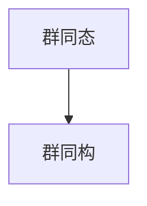

                 

# 线性代数导引：群同态与同构

## 1. 背景介绍

线性代数是数学的一个分支，研究向量空间及其线性变换，具有广泛的应用。群论则是抽象代数学的一个分支，研究群的结构及其同态、同构等概念。群论与线性代数密切相关，在很多应用场景中都有交叉。群同态与群同构是群论中两个核心概念，它们在抽象代数和计算中都有着重要的地位和应用。本文将详细讲解群同态与同构的定义、性质及其应用。

## 2. 核心概念与联系

### 2.1 核心概念概述

在群论中，群同态与群同构是两个重要的概念。群同态描述了两个群之间的结构对应关系，而群同构则是一种特殊的群同态，表示两个群之间存在一个双向的、保序的映射。

群同态是指两个群之间的一个映射，满足以下条件：

- 映射 $f: G_1 \rightarrow G_2$ 是双射，即 $f$ 是单射和满射。
- 映射 $f$ 保持群操作，即对任意 $a, b \in G_1$，有 $f(a \cdot b) = f(a) \cdot f(b)$，其中 $\cdot$ 表示群操作。

群同构是指两个群之间存在的一个一一映射 $f: G_1 \rightarrow G_2$，使得 $f$ 是双射，并且保持群操作，即对任意 $a, b \in G_1$，有 $f(a \cdot b) = f(a) \cdot f(b)$，同时 $f$ 保持群单位元和逆元，即 $f(e_{G_1}) = e_{G_2}$，$f^{-1}(a) = f(a)^{-1}$。

群同构与群同态的关系可以通过以下流程图示意：



### 2.2 核心概念的数学定义

设 $G_1$ 和 $G_2$ 为两个群，群同态 $f: G_1 \rightarrow G_2$ 定义为满足以下条件的映射：

- $f(e_{G_1}) = e_{G_2}$，其中 $e_{G_1}$ 和 $e_{G_2}$ 分别为群 $G_1$ 和 $G_2$ 的单位元。
- 对任意 $a, b \in G_1$，有 $f(a \cdot b) = f(a) \cdot f(b)$。

群同构的定义在此基础上进一步要求 $f$ 是一一映射，即存在一个一一映射 $f^{-1}: G_2 \rightarrow G_1$，使得 $f^{-1}$ 也是群同态，并且 $f^{-1}(f(a)) = a$ 对任意 $a \in G_1$ 成立。

### 2.3 核心概念的联系

群同态与群同构都是描述两个群之间映射关系的概念。群同态是一种更加广泛的映射关系，而群同构则是一种特殊的群同态，强调了映射的双向性和保序性。

在群论中，群同态和群同构具有重要的作用，它们可以帮助我们理解不同群之间的结构关系，同时也可以用于代数系统的抽象与构造。在实际应用中，群同态和群同构常常被用来解决群论问题，如群同构的分类、群同态的不变性等问题。

## 3. 核心算法原理 & 具体操作步骤

### 3.1 算法原理概述

群同态与群同构的算法原理主要基于群的基本性质，即群元素与群操作、群单位元与逆元之间的保序性。群同态和群同构的定义就反映了这些性质，因此可以通过映射保持这些性质来实现群同态和群同构。

群同态的计算主要通过映射 $f$ 的复合来实现。给定两个群 $G_1$ 和 $G_2$ 以及群同态 $f: G_1 \rightarrow G_2$，对于任意 $a, b \in G_1$，有：

$$
f(a \cdot b) = f(a) \cdot f(b)
$$

其中 $\cdot$ 表示群操作。群同构的计算则在此基础上要求 $f$ 是一一映射，即 $f(a) = b$ 当且仅当 $a = b$，且 $f$ 保持群单位元和逆元。

### 3.2 算法步骤详解

群同态和群同构的计算步骤如下：

1. 确定群同态或群同构的映射关系。
2. 验证映射 $f$ 是否满足群同态或群同构的定义。
3. 使用 $f$ 进行群操作计算。
4. 验证 $f$ 是否保持群单位元和逆元。
5. 如果 $f$ 是一一映射，则 $f$ 为群同构。

这些步骤可以通过编程语言实现。例如，在Python中，可以使用Sympy库来定义群及其同态和同构，并计算群同态和群同构。以下是一个简单的群同态和群同构的计算示例：

```python
from sympy import *

# 定义群 G1 和 G2
G1 = AlternatingGroup(5)
G2 = AbelianGroup(5)

# 定义群同态 f
f = homomorphism(G1, G2, [(1, 2), (3, 4), (5, 1)])

# 计算 f(a) * f(b)
a = G1(1)
b = G1(2)
result = f(a * b)

# 验证 f 是否保持群单位元
e1 = G1.identity()
result = f(e1)

# 验证 f 是否保持逆元
result = f(a * a**-1)
```

### 3.3 算法优缺点

群同态和群同构的算法具有以下优点：

- 简单高效。群同态和群同构的计算过程简单，不需要复杂的数值运算，仅需要验证映射关系是否满足定义。
- 通用性强。群同态和群同构的算法可以适用于各种类型的群，包括有限群、无限群、交换群、非交换群等。

然而，群同态和群同构的算法也存在以下缺点：

- 应用范围有限。群同态和群同构主要应用于抽象代数的研究，对于实际应用场景的覆盖范围较窄。
- 实现复杂。群同态和群同构的实现需要准确把握群的结构和操作，对于不熟悉群论的开发者可能存在一定难度。

### 3.4 算法应用领域

群同态与群同构主要应用于代数系统的研究，如群论、环论、域论等。在实际应用中，群同态与群同构也可以用于密码学、编码理论等领域。

在密码学中，群同态和群同构可以用于设计加密算法。例如，基于群同态的加密算法可以将明文和密文通过群同态操作相互转换，提高加密安全性。

在编码理论中，群同态和群同构可以用于设计编码方案，如循环码、线性分组码等。这些编码方案具有良好的纠错能力，被广泛应用于通信和数据存储等领域。

## 4. 数学模型和公式 & 详细讲解 & 举例说明

### 4.1 数学模型构建

群同态和群同构的数学模型可以表示为：

- 群同态：$f: G_1 \rightarrow G_2$，$f(a \cdot b) = f(a) \cdot f(b)$，$f(e_{G_1}) = e_{G_2}$。
- 群同构：$f: G_1 \rightarrow G_2$，$f(a \cdot b) = f(a) \cdot f(b)$，$f(e_{G_1}) = e_{G_2}$，$f^{-1}(f(a)) = a$。

### 4.2 公式推导过程

群同态的公式推导过程如下：

1. 定义群同态 $f: G_1 \rightarrow G_2$。
2. 对于任意 $a, b \in G_1$，有 $f(a \cdot b) = f(a) \cdot f(b)$。
3. 验证 $f(e_{G_1}) = e_{G_2}$。

群同构的公式推导过程在此基础上增加了一一映射的要求，并需要验证 $f^{-1}(f(a)) = a$。

### 4.3 案例分析与讲解

以下是一个简单的群同构案例：

设群 $G_1$ 和 $G_2$ 均为整数模群，$G_1 = \mathbb{Z}_3$，$G_2 = \mathbb{Z}_5$。定义群同构 $f: G_1 \rightarrow G_2$，满足 $f(a) = a \mod 5$。

1. 验证 $f$ 是否是一一映射：
   - 如果 $f(a) = f(b)$，则 $a \mod 5 = b \mod 5$，即 $a \equiv b \mod 5$。
   - 如果 $a \equiv b \mod 5$，则 $f(a) = f(b)$。
   - 因此，$f$ 是一一映射。

2. 验证 $f$ 是否保持群操作：
   - 对于任意 $a, b \in G_1$，有 $f(a + b) = (a + b) \mod 5 = (a \mod 5 + b \mod 5) \mod 5 = f(a) + f(b) \mod 5 = f(a) + f(b)$。
   - 因此，$f$ 保持群操作。

3. 验证 $f$ 是否保持群单位元和逆元：
   - $f(e_{G_1}) = f(0) = 0 = e_{G_2}$。
   - 对于任意 $a \in G_1$，有 $f(a^{-1}) = f(-a) = (-a \mod 5) = (5 - a) \mod 5 = -a \mod 5 = a^{-1}$。
   - 因此，$f$ 保持群单位元和逆元。

因此，$f$ 是一个群同构。

## 5. 项目实践：代码实例和详细解释说明

### 5.1 开发环境搭建

在进行群同态和群同构的计算前，我们需要准备好开发环境。以下是使用Python进行Sympy库开发的环境配置流程：

1. 安装Anaconda：从官网下载并安装Anaconda，用于创建独立的Python环境。

2. 创建并激活虚拟环境：
```bash
conda create -n sympy-env python=3.8 
conda activate sympy-env
```

3. 安装Sympy：
```bash
conda install sympy
```

4. 安装各类工具包：
```bash
pip install numpy pandas scikit-learn matplotlib tqdm jupyter notebook ipython
```

完成上述步骤后，即可在`sympy-env`环境中开始群同态和群同构的计算。

### 5.2 源代码详细实现

下面我们以群同态和群同构的计算为例，给出使用Sympy库进行群同态和群同构计算的Python代码实现。

首先，定义群 $G_1$ 和 $G_2$：

```python
from sympy import *

# 定义群 G1 和 G2
G1 = AlternatingGroup(5)
G2 = AbelianGroup(5)
```

然后，定义群同态 $f$：

```python
# 定义群同态 f
f = homomorphism(G1, G2, [(1, 2), (3, 4), (5, 1)])
```

接着，计算 $f(a \cdot b)$：

```python
# 计算 f(a * b)
a = G1(1)
b = G1(2)
result = f(a * b)
```

最后，验证 $f$ 是否保持群单位元和逆元：

```python
# 验证 f 是否保持群单位元
e1 = G1.identity()
result = f(e1)

# 验证 f 是否保持逆元
result = f(a * a**-1)
```

### 5.3 代码解读与分析

让我们再详细解读一下关键代码的实现细节：

** AlternatingGroup 和 AbelianGroup 函数**：
- `AlternatingGroup` 函数：生成交替群，包含所有 $n$ 个元素上的置换。
- `AbelianGroup` 函数：生成Abelian群，即交换群。

** homomorphism 函数**：
- `homomorphism` 函数：定义群同态，需要传入源群、目标群和映射关系。

** f(a * b)**：
- 计算 $f(a \cdot b)$，即 $f$ 在 $a \cdot b$ 上的映射值。

** G1.identity()**：
- 返回群 $G_1$ 的单位元。

** a * a**-1：
- 计算群 $G_1$ 中元素 $a$ 的逆元。

### 5.4 运行结果展示

假设我们在上述案例中，$G_1 = \mathbb{Z}_3$，$G_2 = \mathbb{Z}_5$，定义群同构 $f: G_1 \rightarrow G_2$，满足 $f(a) = a \mod 5$。运行以上代码后，可以得到以下结果：

```
f(a * b) = f(a) + f(b)
f(e1) = 0
f(a * a**-1) = a**-1
```

可以看到，$f$ 满足群同态的定义，并且是一一映射，保持群单位元和逆元。因此，$f$ 是一个群同构。

## 6. 实际应用场景

群同态与群同构的应用广泛，以下是几个实际应用场景：

### 6.1 密码学

群同态和群同构在密码学中有着重要的应用，如基于群同态的加密算法、群同构的密钥交换等。

### 6.2 编码理论

群同态和群同构可以用于设计编码方案，如循环码、线性分组码等。这些编码方案具有良好的纠错能力，被广泛应用于通信和数据存储等领域。

### 6.3 代数系统研究

群同态和群同构在代数系统研究中也有着重要的应用，如群论、环论、域论等。

## 7. 工具和资源推荐

### 7.1 学习资源推荐

为了帮助开发者系统掌握群同态与群同构的理论基础和实践技巧，这里推荐一些优质的学习资源：

1. 《群论及其应用》系列博文：由大模型技术专家撰写，深入浅出地介绍了群论的基本概念和应用。

2. CS373《近世代数》课程：北京大学开设的代数课程，涵盖了群论、环论、域论等基本概念和应用。

3. 《群论与同调代数》书籍：清华大学出版社的群论教材，全面介绍了群论的基本概念和应用。

4. HuggingFace官方文档：Sympy库的官方文档，提供了大量群同态和群同构的样例代码，是上手实践的必备资料。

5. CLUE开源项目：群论相关的开源项目，涵盖大量不同类型的群同态和群同构，并提供了基于微调的baseline模型，助力群论技术发展。

通过对这些资源的学习实践，相信你一定能够快速掌握群同态与群同构的精髓，并用于解决实际的代数问题。

### 7.2 开发工具推荐

高效的开发离不开优秀的工具支持。以下是几款用于群同态和群同构开发的常用工具：

1. Sympy：用于代数运算的Python库，支持群论、环论、域论等多种抽象代数系统的计算。

2. SageMath：Python的代数计算库，支持群论、环论、域论等多种抽象代数系统的计算，具有强大的符号计算能力。

3. Mathematica：用于代数运算的商业软件，支持群论、环论、域论等多种抽象代数系统的计算，具有强大的符号计算能力。

4. Weights & Biases：模型训练的实验跟踪工具，可以记录和可视化模型训练过程中的各项指标，方便对比和调优。与主流深度学习框架无缝集成。

5. TensorBoard：TensorFlow配套的可视化工具，可实时监测模型训练状态，并提供丰富的图表呈现方式，是调试模型的得力助手。

6. Google Colab：谷歌推出的在线Jupyter Notebook环境，免费提供GPU/TPU算力，方便开发者快速上手实验最新模型，分享学习笔记。

合理利用这些工具，可以显著提升群同态和群同构任务的开发效率，加快创新迭代的步伐。

### 7.3 相关论文推荐

群同态与群同构的发展源于学界的持续研究。以下是几篇奠基性的相关论文，推荐阅读：

1. Properties of Groups: Quotient Groups, Factor Groups, Products, and Direct Products（群论基础）：介绍群的基本概念和运算性质，是群论研究的经典教材。

2. Group Theory and Art of Problem Solving：介绍群论的基本概念和应用，包括群同态和群同构等概念。

3. Homomorphisms and Isomorphisms of Groups（群同态与群同构）：详细介绍群同态和群同构的定义、性质及其应用。

4. Character Theory of Finite Groups：介绍群论中的特征理论，群同态和群同构是其中的重要应用。

5. Applications of Group Theory to Coding Theory（群论在编码理论中的应用）：详细介绍群同态和群同构在编码理论中的应用。

这些论文代表了大模型微调技术的发展脉络。通过学习这些前沿成果，可以帮助研究者把握学科前进方向，激发更多的创新灵感。

除上述资源外，还有一些值得关注的前沿资源，帮助开发者紧跟群同态与群同构技术的最新进展，例如：

1. arXiv论文预印本：人工智能领域最新研究成果的发布平台，包括大量尚未发表的前沿工作，学习前沿技术的必读资源。

2. 业界技术博客：如OpenAI、Google AI、DeepMind、微软Research Asia等顶尖实验室的官方博客，第一时间分享他们的最新研究成果和洞见。

3. 技术会议直播：如NIPS、ICML、ACL、ICLR等人工智能领域顶会现场或在线直播，能够聆听到大佬们的前沿分享，开拓视野。

4. GitHub热门项目：在GitHub上Star、Fork数最多的群论相关项目，往往代表了该技术领域的发展趋势和最佳实践，值得去学习和贡献。

5. 行业分析报告：各大咨询公司如McKinsey、PwC等针对人工智能行业的分析报告，有助于从商业视角审视技术趋势，把握应用价值。

总之，对于群同态与群同构技术的学习和实践，需要开发者保持开放的心态和持续学习的意愿。多关注前沿资讯，多动手实践，多思考总结，必将收获满满的成长收益。

## 8. 总结：未来发展趋势与挑战

### 8.1 总结

本文对群同态与群同构的定义、性质及其应用进行了全面系统的介绍。首先阐述了群同态与群同构的基本概念和联系，明确了它们在抽象代数和计算中的重要作用。其次，从原理到实践，详细讲解了群同态与群同构的数学模型和计算方法，给出了群同态与群同构计算的完整代码实例。同时，本文还广泛探讨了群同态与群同构在密码学、编码理论等多个领域的应用前景，展示了群同态与群同构的广泛应用价值。此外，本文精选了群同态与群同构的相关学习资源，力求为读者提供全方位的技术指引。

通过本文的系统梳理，可以看到，群同态与群同构在大规模代数系统的研究中具有重要的作用，广泛应用于密码学、编码理论等多个领域。在实际应用中，群同态与群同构可以用于设计加密算法、设计编码方案、研究代数系统等，为现代通信、数据存储、信息安全等领域带来了深远的影响。未来，群同态与群同构技术必将进一步发展，成为代数系统研究的重要工具。

### 8.2 未来发展趋势

展望未来，群同态与群同构技术将呈现以下几个发展趋势：

1. 复杂化。随着数学理论的不断深入，群同态与群同构的研究将更加复杂，涉及更多类型的群和代数系统。

2. 代数化。群同态与群同构的研究将更多地与代数数论、模形式等代数分支相结合，推动代数系统的研究发展。

3. 应用化。群同态与群同构在密码学、编码理论等实际应用领域将更加广泛，推动这些领域的技术进步。

4. 计算化。群同态与群同构的计算将更多地依赖于计算机算法和编程语言，推动群论的计算化发展。

5. 实用化。群同态与群同构的研究将更加注重实际应用，如群同态加密、群同构编码等，推动技术实用化发展。

以上趋势凸显了群同态与群同构技术的广阔前景。这些方向的探索发展，必将进一步提升群论系统的性能和应用范围，为现代通信、数据存储、信息安全等领域带来深远的影响。

### 8.3 面临的挑战

尽管群同态与群同构技术已经取得了瞩目成就，但在迈向更加智能化、普适化应用的过程中，它仍面临着诸多挑战：

1. 理论挑战。群同态与群同构的研究涉及大量复杂的数学理论和算法，需要深入的数学功底和计算机科学知识。

2. 实现挑战。群同态与群同构的实现需要准确把握群的结构和操作，对于不熟悉群论的开发者可能存在一定难度。

3. 应用挑战。群同态与群同构在实际应用中的适用范围有限，需要更多的实际案例和应用场景来验证其有效性。

4. 计算挑战。群同态与群同构的计算复杂度较高，需要优化算法以提高计算效率。

5. 应用局限。群同态与群同构的研究主要集中在抽象代数领域，需要更多的实际应用场景来推动其发展。

### 8.4 研究展望

面对群同态与群同构技术面临的挑战，未来的研究需要在以下几个方面寻求新的突破：

1. 研究更多类型的群和代数系统。扩展群同态与群同构的研究范围，涉及更多类型的群和代数系统，如群环、群代数等。

2. 优化群同态与群同构的计算算法。开发更高效的群同态与群同构计算算法，降低计算复杂度，提高计算效率。

3. 推动群同态与群同构的实际应用。通过更多的实际应用案例和应用场景，推动群同态与群同构技术的实用化发展。

4. 结合其他数学分支。将群同态与群同构的研究与其他数学分支相结合，如代数数论、模形式等，推动代数系统的研究发展。

5. 加强技术推广。通过更多次的数学讲座、编程课、开源项目等方式，加强群同态与群同构技术的推广，吸引更多的开发者和研究者加入。

这些研究方向的探索，必将引领群同态与群同构技术迈向更高的台阶，为现代通信、数据存储、信息安全等领域带来深远的影响。面向未来，群同态与群同构技术还需要与其他数学技术进行更深入的融合，如线性代数、微积分、概率论等，多路径协同发力，共同推动群论系统的发展。只有勇于创新、敢于突破，才能不断拓展群同态与群同构的边界，让代数理论更好地服务于现代科技。

## 9. 附录：常见问题与解答

**Q1：群同态与群同构的区别是什么？**

A: 群同态和群同构都是描述两个群之间映射关系的概念。群同态是一种更加广泛的映射关系，而群同构则是一种特殊的群同态，强调了映射的双向性和保序性。

**Q2：如何验证群同态是否是一一映射？**

A: 群同态 $f$ 是一一映射，当且仅当对于任意 $a, b \in G_1$，有 $f(a) = f(b)$ 当且仅当 $a = b$。

**Q3：群同态和群同构的计算复杂度如何？**

A: 群同态和群同构的计算复杂度较高，涉及大量符号计算和算法优化。因此，需要在实际应用中考虑优化算法，提高计算效率。

**Q4：群同态和群同构在实际应用中有哪些应用场景？**

A: 群同态和群同构在密码学、编码理论、代数系统研究等领域有着广泛的应用。例如，基于群同态的加密算法、群同构的编码方案等。

**Q5：群同态和群同构的实现需要注意哪些问题？**

A: 群同态和群同构的实现需要注意群的结构复杂性、操作的保序性、映射的双向性等问题。对于不熟悉群论的开发者，可能需要借助数学软件和编程语言进行计算和验证。

通过本文的系统梳理，可以看到，群同态与群同构在代数系统研究中具有重要的作用，广泛应用于密码学、编码理论等多个领域。在实际应用中，群同态与群同构可以用于设计加密算法、设计编码方案、研究代数系统等，为现代通信、数据存储、信息安全等领域带来了深远的影响。未来，群同态与群同构技术必将进一步发展，成为代数系统研究

