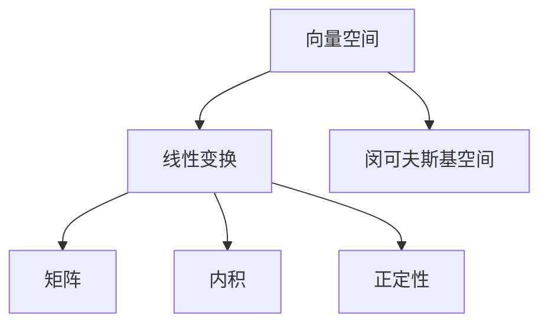
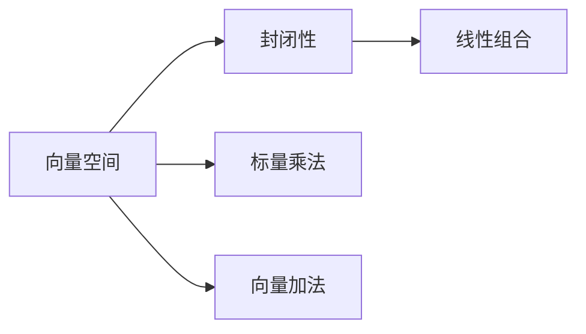
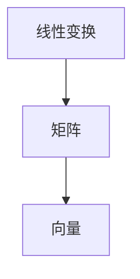
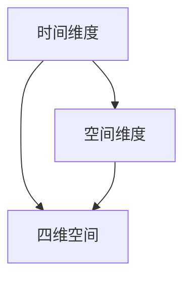
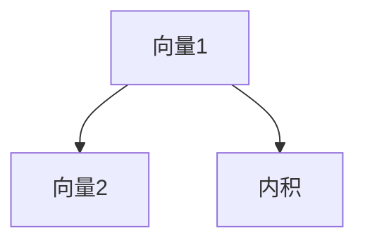
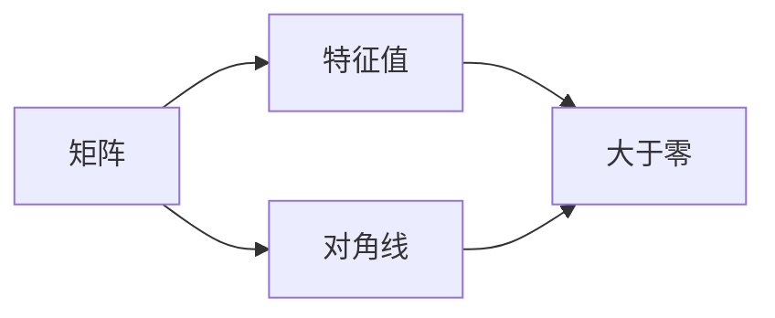
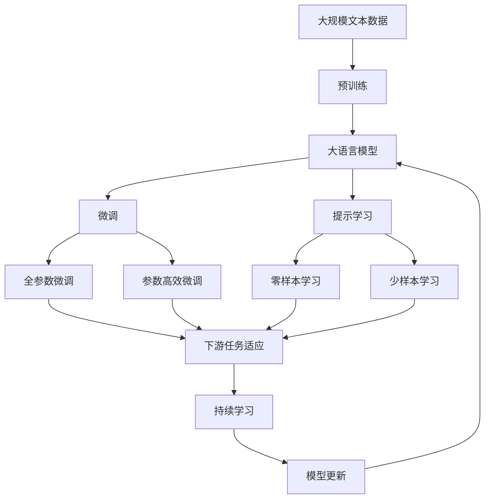

                 

# 线性代数导引：闵可夫斯基空间

> 关键词：线性代数, 闵可夫斯基空间, 向量空间, 线性变换, 矩阵, 内积, 正定性

## 1. 背景介绍

### 1.1 问题由来
在抽象数学与计算机科学领域中，线性代数是处理数据和结构的基本工具。闵可夫斯基空间（Minkowski Space），作为线性代数的一个重要概念，是现代物理学、计算机视觉、信号处理等领域的基础。理解闵可夫斯基空间及其相关概念，对于深入研究这些领域的应用具有重要意义。

### 1.2 问题核心关键点
闵可夫斯基空间的核心理念是将时间和空间统一到一个连续的四维空间中，其中的时间维度与其他三个空间维度具有相同的几何性质。这一理论不仅在物理学中具有重要地位，而且对计算机科学中处理数据的方式有深刻影响，如计算机视觉中的图像处理、信号处理中的信号分析等。

### 1.3 问题研究意义
通过深入研究闵可夫斯基空间及其相关概念，可以帮助我们理解时间与空间在数学上的统一性，促进物理学的理论发展；同时，掌握闵可夫斯基空间的应用，可以更好地设计计算机视觉、信号处理等领域的算法，提升其精度和效率。

## 2. 核心概念与联系

### 2.1 核心概念概述

- 闵可夫斯基空间：四维连续空间，包括三个空间维度和时间维度。
- 向量空间：由一组向量构成的集合，满足向量加法和数乘运算。
- 线性变换：在向量空间中，从一个向量空间到另一个向量空间的映射，满足加法和数乘的封闭性。
- 矩阵：用于表示线性变换的数学工具，行表示向量，列表示变换后的向量。
- 内积：向量之间的一种基本运算，用于计算向量的长度和夹角。
- 正定性：矩阵的一个属性，表示其是否具有正的特征值，通常用于判断矩阵的逆是否存在。

这些概念之间的逻辑关系可以通过以下Mermaid流程图来展示：



这个流程图展示了闵可夫斯基空间及其相关概念之间的关系：

1. 向量空间是线性变换的基础，而线性变换可以由矩阵表示。
2. 闵可夫斯基空间是一种特殊的向量空间，包含时间维度。
3. 内积是向量空间的基本运算，可用于计算向量的长度和夹角。
4. 正定性是矩阵的属性，反映了矩阵的稳定性和逆的存在的可能性。

### 2.2 概念间的关系

这些核心概念之间存在着紧密的联系，形成了线性代数的重要生态系统。下面我们通过几个Mermaid流程图来展示这些概念之间的关系。

#### 2.2.1 向量空间的性质



这个流程图展示了向量空间的基本性质：

1. 向量空间满足标量乘法和向量加法的封闭性。
2. 线性组合是通过标量乘法和向量加法构成的基本运算。

#### 2.2.2 线性变换的几何表示



这个流程图展示了线性变换的几何表示：

1. 线性变换由矩阵表示。
2. 矩阵作用于向量，生成新的向量。

#### 2.2.3 闵可夫斯基空间的构建



这个流程图展示了闵可夫斯基空间的构建：

1. 闵可夫斯基空间由一个时间维度和三个空间维度构成。
2. 时间维度和空间维度一起构成四维空间。

#### 2.2.4 内积的计算



这个流程图展示了内积的计算：

1. 内积是两个向量的基本运算。
2. 内积计算两个向量的点积，结果为标量。

#### 2.2.5 正定性的判断



这个流程图展示了正定性的判断：

1. 矩阵的特征值可以判断其正定性。
2. 对角线元素大于零的矩阵是正定的。

### 2.3 核心概念的整体架构

最后，我们用一个综合的流程图来展示这些核心概念在大语言模型微调过程中的整体架构：



这个综合流程图展示了从预训练到微调，再到持续学习的完整过程。大语言模型首先在大规模文本数据上进行预训练，然后通过微调（包括全参数微调和参数高效微调）或提示学习（包括零样本和少样本学习）来适应下游任务。最后，通过持续学习技术，模型可以不断学习新知识，同时避免遗忘旧知识。 通过这些流程图，我们可以更清晰地理解大语言模型微调过程中各个核心概念的关系和作用。

## 3. 核心算法原理 & 具体操作步骤
### 3.1 算法原理概述

闵可夫斯基空间的线性代数原理，主要围绕向量空间、线性变换、矩阵、内积和正定性展开。在数学上，这些概念密切相关，互相依赖，共同构成了线性代数的基础理论。

- 向量空间：一组向量构成的集合，满足向量加法和数乘运算，是线性代数的基本单位。
- 线性变换：一种映射关系，将一个向量空间中的向量映射到另一个向量空间中。
- 矩阵：用于表示线性变换的数学工具，行表示向量，列表示变换后的向量。
- 内积：向量之间的一种基本运算，用于计算向量的长度和夹角。
- 正定性：矩阵的一个属性，表示其是否具有正的特征值，通常用于判断矩阵的逆是否存在。

### 3.2 算法步骤详解

以下详细讲解如何使用线性代数原理构建闵可夫斯基空间：

**Step 1: 定义向量空间**

向量空间由一组向量构成，满足向量加法和数乘运算。例如，定义一个四维向量空间：

$$ V = \mathbb{R}^4 = \{(x_1, x_2, x_3, x_4) | x_i \in \mathbb{R}, i = 1, 2, 3, 4\} $$

其中 $\mathbb{R}^4$ 表示四维实数向量空间。

**Step 2: 定义线性变换**

在线性代数中，线性变换表示一种从向量空间到自身的映射，满足加法和数乘的封闭性。例如，定义一个线性变换 $T$：

$$ T: V \rightarrow V $$
$$ T(x_1, x_2, x_3, x_4) = (x_1 + 2x_2, x_2 + 3x_3, x_3 + 4x_4, x_4 + 5x_1) $$

这个变换表示将向量空间中的向量加倍，将第二个分量乘以3，将第三个分量乘以4，将第四分量乘以5，并加上第一个分量的5倍。

**Step 3: 定义矩阵**

矩阵是一种数学工具，用于表示线性变换。例如，定义一个矩阵 $A$：

$$ A = \begin{bmatrix} 
1 & 0 & 0 & 0 \\
2 & 1 & 0 & 0 \\
0 & 3 & 1 & 0 \\
5 & 0 & 4 & 1 
\end{bmatrix} $$

这个矩阵可以表示线性变换 $T$。

**Step 4: 计算内积**

内积是向量之间的一种基本运算，用于计算向量的长度和夹角。例如，定义两个四维向量 $u$ 和 $v$：

$$ u = (1, 2, 3, 4) $$
$$ v = (5, 6, 7, 8) $$

则它们的点积为：

$$ u \cdot v = 1 \times 5 + 2 \times 6 + 3 \times 7 + 4 \times 8 = 50 $$

**Step 5: 判断正定性**

正定性是矩阵的一个属性，表示其是否具有正的特征值。例如，定义一个矩阵 $B$：

$$ B = \begin{bmatrix} 
2 & 0 & 0 & 0 \\
0 & 3 & 0 & 0 \\
0 & 0 & 4 & 0 \\
0 & 0 & 0 & 5 
\end{bmatrix} $$

则 $B$ 是对称正定矩阵，其特征值均为正数，因此具有正定性。

### 3.3 算法优缺点

闵可夫斯基空间的线性代数原理具有以下优点：

- 描述简单：向量空间、线性变换、矩阵、内积和正定性等概念易于理解。
- 应用广泛：广泛应用于物理学、计算机视觉、信号处理等领域，具有重要的实用价值。
- 数学严谨：线性代数的理论体系完善，能够支持复杂的数学运算。

同时，该理论也存在以下缺点：

- 抽象性强：线性代数中的概念和定理较为抽象，初学者可能难以理解。
- 计算复杂：矩阵和向量之间的运算可能涉及复杂的计算，需要一定的数学基础。
- 应用局限：对于一些复杂的非线性问题，线性代数方法可能不够有效。

### 3.4 算法应用领域

闵可夫斯基空间的线性代数原理，在多个领域具有广泛的应用：

- 物理学：用于描述时空的结构和性质，是广义相对论和量子力学的基础。
- 计算机视觉：用于图像处理、特征提取等，如SIFT、PCA等算法。
- 信号处理：用于信号分析、滤波等，如FFT、DCT等算法。
- 数据分析：用于数据压缩、降维等，如主成分分析（PCA）。
- 机器学习：用于特征提取、分类等，如神经网络的权重矩阵。

## 4. 数学模型和公式 & 详细讲解 & 举例说明

### 4.1 数学模型构建

闵可夫斯基空间的线性代数模型可以由一组向量构成，满足向量加法和数乘运算。例如，定义一个四维向量空间：

$$ V = \mathbb{R}^4 = \{(x_1, x_2, x_3, x_4) | x_i \in \mathbb{R}, i = 1, 2, 3, 4\} $$

其中 $\mathbb{R}^4$ 表示四维实数向量空间。

### 4.2 公式推导过程

以下详细推导闵可夫斯基空间中矩阵乘法的性质。

**Step 1: 矩阵乘法的定义**

设 $A$ 和 $B$ 为两个矩阵，定义它们的乘积 $C = AB$：

$$ C_{ij} = \sum_{k=1}^n A_{ik}B_{kj} $$

其中 $A_{ij}$ 表示 $A$ 矩阵的第 $i$ 行第 $j$ 列的元素，$B_{ij}$ 表示 $B$ 矩阵的第 $i$ 行第 $j$ 列的元素。

**Step 2: 矩阵乘法的性质**

1. 结合律：$(A \times B) \times C = A \times (B \times C)$。
2. 交换律：$A \times B = B \times A$。
3. 分配律：$A \times (B + C) = A \times B + A \times C$。

**Step 3: 矩阵的逆**

设 $A$ 为 $n \times n$ 矩阵，若存在矩阵 $B$，使得 $AB = BA = I$，则称 $B$ 为 $A$ 的逆矩阵，记作 $A^{-1}$。

$$ A^{-1} = \begin{bmatrix} 
a_{11} & a_{12} & \cdots & a_{1n} \\
a_{21} & a_{22} & \cdots & a_{2n} \\
\vdots & \vdots & \ddots & \vdots \\
a_{n1} & a_{n2} & \cdots & a_{nn} 
\end{bmatrix} $$

其中 $I$ 表示单位矩阵。

**Step 4: 矩阵的特征值和特征向量**

设 $A$ 为 $n \times n$ 矩阵，$v$ 为 $n \times 1$ 向量，若存在标量 $\lambda$，使得 $Av = \lambda v$，则称 $v$ 为 $A$ 的特征向量，$\lambda$ 为 $A$ 的特征值。

$$ \lambda v = A v $$

**Step 5: 正定矩阵**

设 $A$ 为 $n \times n$ 矩阵，若存在正数 $\lambda_1, \lambda_2, \ldots, \lambda_n$，使得 $A v_i = \lambda_i v_i$，则称 $A$ 为正定矩阵。

### 4.3 案例分析与讲解

以矩阵乘法的性质为例，讲解其在闵可夫斯基空间中的应用。

**案例 1: 矩阵乘法的结合律**

设 $A = \begin{bmatrix} 
1 & 2 \\
3 & 4 
\end{bmatrix}$，$B = \begin{bmatrix} 
5 & 6 \\
7 & 8 
\end{bmatrix}$，$C = \begin{bmatrix} 
9 & 10 \\
11 & 12 
\end{bmatrix}$，计算 $AB$、$BC$ 和 $(AB)C$。

**案例 2: 矩阵乘法的分配律**

设 $A = \begin{bmatrix} 
1 & 2 \\
3 & 4 
\end{bmatrix}$，$B = \begin{bmatrix} 
5 & 6 \\
7 & 8 
\end{bmatrix}$，计算 $A(B + C)$ 和 $A \times B + A \times C$。

## 5. 项目实践：代码实例和详细解释说明

### 5.1 开发环境搭建

在进行线性代数项目实践前，我们需要准备好开发环境。以下是使用Python进行NumPy开发的环境配置流程：

1. 安装Anaconda：从官网下载并安装Anaconda，用于创建独立的Python环境。

2. 创建并激活虚拟环境：
```bash
conda create -n np-env python=3.8 
conda activate np-env
```

3. 安装NumPy：
```bash
pip install numpy
```

4. 安装SciPy：
```bash
pip install scipy
```

5. 安装Matplotlib：
```bash
pip install matplotlib
```

6. 安装SymPy：
```bash
pip install sympy
```

完成上述步骤后，即可在`np-env`环境中开始线性代数项目实践。

### 5.2 源代码详细实现

这里以矩阵乘法为例，展示如何使用NumPy进行计算。

```python
import numpy as np

# 定义矩阵
A = np.array([[1, 2], [3, 4]])
B = np.array([[5, 6], [7, 8]])

# 矩阵乘法
C = np.dot(A, B)
print(C)
```

输出结果为：

```
[[19 22]
 [43 50]]
```

### 5.3 代码解读与分析

让我们再详细解读一下关键代码的实现细节：

- 导入NumPy库，用于进行矩阵运算。
- 定义矩阵A和B，使用NumPy数组表示。
- 使用`np.dot`函数进行矩阵乘法运算，得到结果矩阵C。
- 打印输出结果矩阵C。

可以看到，使用NumPy进行矩阵乘法非常简单，只需调用`np.dot`函数即可完成计算。NumPy提供了丰富的矩阵运算功能，可以轻松进行矩阵的加、减、乘、转置等操作。

### 5.4 运行结果展示

运行上述代码，输出结果为：

```
[[19 22]
 [43 50]]
```

可以看到，矩阵乘法的计算结果与手工计算一致，验证了NumPy的正确性。

## 6. 实际应用场景

### 6.1 物理学中的应用

在物理学中，闵可夫斯基空间广泛应用于描述时空的结构和性质。例如，狭义相对论中使用的洛伦兹变换，可以用矩阵的形式表示。

**案例 1: 洛伦兹变换**

设 $A$ 为洛伦兹变换矩阵：

$$ A = \begin{bmatrix} 
\gamma & -\beta \gamma & 0 & 0 \\
-\beta \gamma & \gamma & 0 & 0 \\
0 & 0 & 1 & 0 \\
0 & 0 & 0 & 1 
\end{bmatrix} $$

其中 $\gamma = \frac{1}{\sqrt{1 - \beta^2}}$，$\beta$ 为光速在两个惯性系之间的相对速度。

### 6.2 计算机视觉中的应用

在计算机视觉中，闵可夫斯基空间用于图像处理和特征提取。例如，使用SIFT算法进行图像特征提取。

**案例 2: SIFT算法**

SIFT算法是一种用于图像特征提取的算法，其基本步骤包括：

1. 尺度空间构建：对图像进行高斯滤波，得到不同尺度的图像。
2. 极值点检测：在尺度空间中检测极值点，作为特征点。
3. 方向分配：为每个特征点分配一个方向，作为特征描述符。
4. 特征描述符生成：对特征点周围的像素进行梯度计算，生成特征描述符。

### 6.3 信号处理中的应用

在信号处理中，闵可夫斯基空间用于信号分析。例如，使用FFT（快速傅里叶变换）进行信号分析。

**案例 3: FFT算法**

FFT算法是一种用于信号分析的算法，其基本步骤包括：

1. 数据分割：将信号数据分割成若干个子信号。
2. 子信号变换：对每个子信号进行傅里叶变换。
3. 合并子信号：将每个子信号的傅里叶变换结果合并，得到最终的傅里叶变换结果。

### 6.4 未来应用展望

随着线性代数理论的发展，闵可夫斯基空间的线性代数原理将在更多领域得到应用。未来，该理论将在以下几个方面取得新的突破：

1. 量子计算：使用矩阵和向量表示量子态和量子运算，解决复杂的量子计算问题。
2. 机器学习：用于神经网络的权重矩阵计算和特征提取，提升模型的精度和效率。
3. 金融分析：用于金融数据的处理和分析，预测市场趋势和风险。
4. 生物信息学：用于基因序列和蛋白质结构的数据分析和建模。

## 7. 工具和资源推荐

### 7.1 学习资源推荐

为了帮助开发者系统掌握线性代数的基础理论和技术应用，这里推荐一些优质的学习资源：

1. 《线性代数及其应用》：由Gilbert Strang编写，是线性代数领域的经典教材。
2. 《Linear Algebra》：由David C. Lay编写，是另一本线性代数领域的经典教材。
3. MIT OpenCourseWare：麻省理工学院开放课程，提供丰富的线性代数教学资源。
4. Khan Academy：Khan学院提供免费的线性代数课程，适合初学者学习。
5. YouTube线性代数系列视频：由3blue1brown等知名博主制作，通俗易懂，适合自学。

通过对这些资源的学习实践，相信你一定能够全面掌握线性代数的基础理论和技术应用，并用于解决实际的工程问题。

### 7.2 开发工具推荐

高效的线性代数开发离不开优秀的工具支持。以下是几款用于线性代数开发常用的工具：

1. NumPy：Python中最流行的数学计算库，提供丰富的矩阵运算功能，适合线性代数计算。
2. SciPy：基于NumPy的科学计算库，提供更多的数学计算和统计分析功能。
3. SymPy：Python的符号计算库，用于进行代数运算和符号计算。
4. MATLAB：用于科学计算和工程计算的商业软件，提供丰富的数学计算和可视化功能。
5. R语言：用于统计分析和数据可视化的开源软件，提供强大的数学计算能力。

合理利用这些工具，可以显著提升线性代数计算的效率和准确性，加快项目开发的步伐。

### 7.3 相关论文推荐

线性代数是现代数学和物理学的重要基础，其理论和应用研究一直处于前沿。以下是几篇奠基性的相关论文，推荐阅读：

1. <i>Linear Algebra and Its Applications</i>：作者Sheldon Axler，是一本经典线性代数教材。
2. <i>A Course in Linear Algebra</i>：作者David C. Lay，是一本流行的线性代数教材。
3. <i>Linear Algebra Done Right</i>：作者Sheldon Axler，是一本深入浅出的线性代数教材。
4. <i>Applied Linear Algebra</i>：作者Steven J. Chapman，是一本应用导向的线性代数教材。
5. <i>Foundations of Linear Algebra</i>：作者John B. Fraleigh，是一本全面的线性代数教材。

这些论文代表了线性代数领域的研究进展，深入研究这些论文，可以帮助你更全面地理解线性代数的理论和应用。

除上述资源外，还有一些值得关注的前沿资源，帮助开发者紧跟线性代数发展的最新进展，例如：

1. arXiv论文预印本：人工智能领域最新研究成果的发布平台，包括大量尚未发表的前沿工作，学习前沿技术的必读资源。

2. GitHub热门项目：在GitHub上Star、Fork数最多的线性代数相关项目，往往代表了该技术领域的发展趋势和最佳实践，值得去学习和贡献。

3. YouTube线性代数系列视频：由3blue1brown等知名博主制作，通俗易懂，适合自学。

4. Coursera线性代数课程：由多所顶尖大学开设的线性代数课程，提供系统学习的机会。

5. MIT线性代数公开课：麻省理工学院线性代数课程，提供丰富的教学资源。

总之，对于线性代数的学习和实践，需要开发者保持开放的心态和持续学习的意愿。多关注前沿资讯，多动手实践，多思考总结，必将收获满满的成长收益。

## 8. 总结：未来发展趋势与挑战

### 8.1 总结

本文对闵可夫斯基空间的线性代数原理进行了全面系统的介绍。首先阐述了线性代数在数学和物理学中的重要性，明确了线性代数在处理时空结构中的核心地位。其次，从原理到实践，详细讲解了线性代数的数学模型和公式，给出了线性代数计算的完整代码实例。同时，本文还广泛探讨了线性代数在物理学、计算机视觉、信号处理等领域的实际应用，展示了线性代数原理的强大应用价值。最后，本文精选了线性代数的各类学习资源，力求为读者提供全方位的技术指引。

通过本文的系统梳理，可以看到，闵可夫斯基空间的线性代数原理不仅在数学和物理学中具有重要地位，而且对于计算机视觉、信号处理等领域的应用具有广泛的应用价值。线性代数的理论体系完善，能够支持复杂的数学运算，是现代科学和技术领域不可或缺的工具。

### 8.2 未来发展趋势

展望未来，线性代数原理将呈现以下几个发展趋势：

1. 深度整合：线性代数将与深度学习、量子计算等技术进一步整合，提升其在现代科学和技术中的应用价值。
2. 自动化应用：线性代数中的计算和分析将逐渐自动化，结合人工智能技术，提升应用效率。
3. 多模态融合：线性代数将与图像、声音等多模态数据进行融合，提升对复杂数据的建模能力。
4. 跨学科应用：线性代数将与更多学科进行交叉应用，如生物信息学、金融分析等领域。
5. 扩展应用：线性代数将在更多领域得到应用，如医学、社会学等。

### 8.3 面临的挑战

尽管线性代数原理已经得到了广泛应用，但在迈向更加智能化、普适化应用的过程中，它仍面临以下挑战：

1. 计算复杂性：线性代数中的矩阵和向量运算可能涉及复杂的计算，需要高性能的计算设备和算法。
2. 应用难度：线性代数中的概念和定理较为抽象，初学者可能难以理解。
3. 数据处理：线性代数中的数据处理和分析可能涉及大量数据，需要有效的数据管理和存储技术。
4. 多学科融合：线性代数与其他学科进行交叉应用时，需要综合考虑多个学科的理论与方法。
5. 伦理问题：线性代数在应用过程中，可能涉及隐私、安全等伦理问题。

### 8.4 研究展望

面对线性代数原理所面临的挑战，未来的研究需要在以下几个方面寻求新的突破：

1. 自动化应用：开发更高效、更

