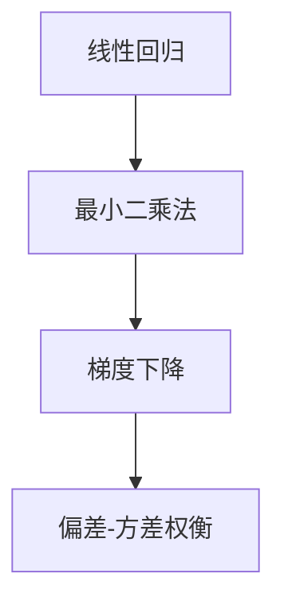
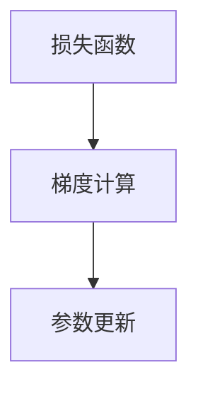
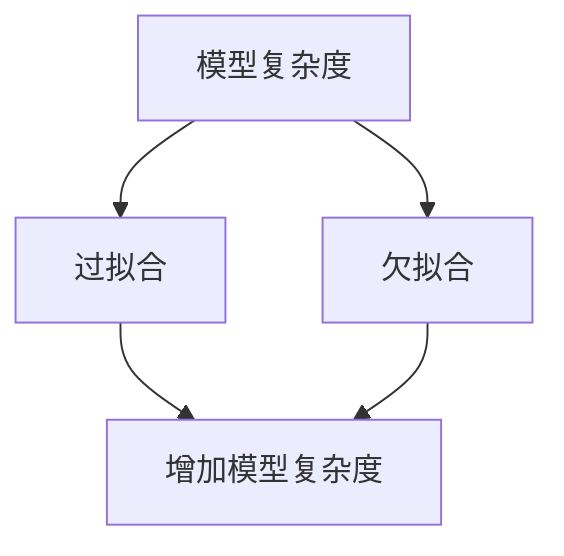
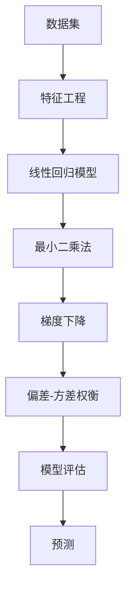

                 

# 线性回归(Linear Regression) - 原理与代码实例讲解

> 关键词：线性回归,最小二乘法,梯度下降,损失函数,偏差-方差权衡

## 1. 背景介绍

### 1.1 问题由来
线性回归是一种基本的统计学和机器学习模型，用于对变量之间的关系进行建模和预测。它是监督学习中最简单、应用最广泛的算法之一，广泛应用于经济、金融、工程、生物等多个领域。线性回归的目标是通过拟合数据集的趋势线，来预测变量的未来值。

### 1.2 问题核心关键点
线性回归的核心思想是通过最小化实际值与预测值之间的误差（也称为损失函数），来找到最优的模型参数。常见的损失函数包括均方误差（Mean Squared Error, MSE）和平均绝对误差（Mean Absolute Error, MAE）。在实际应用中，通常使用梯度下降等优化算法来求解模型参数。

线性回归的数学模型为：

$$y_i = \beta_0 + \beta_1 x_{1i} + \beta_2 x_{2i} + ... + \beta_n x_{ni} + \epsilon_i$$

其中，$y_i$ 表示第 $i$ 个样本的真实值，$\beta_0, \beta_1, ..., \beta_n$ 是模型的参数，$x_{1i}, x_{2i}, ..., x_{ni}$ 是特征变量，$\epsilon_i$ 是随机误差。

### 1.3 问题研究意义
线性回归在机器学习和统计学中具有重要的地位，其研究意义主要体现在：

1. 简单易用：线性回归模型简单易懂，易于实现和解释。
2. 通用性强：线性回归模型可以应用于各种类型的线性预测问题，包括连续变量、分类变量等。
3. 理论基础坚实：线性回归的理论基础扎实，包括最小二乘法、梯度下降等算法均有严格的数学推导。
4. 适用范围广泛：线性回归可以用于经济预测、金融分析、工程控制、医学诊断等领域。
5. 作为其他模型基础：许多高级的机器学习模型（如多项式回归、决策树、随机森林等）都是基于线性回归的扩展。

## 2. 核心概念与联系

### 2.1 核心概念概述

为更好地理解线性回归的基本原理，本节将介绍几个关键概念：

- 线性回归(Linear Regression)：一种用于建模和预测的统计学和机器学习模型，通过拟合数据集中的线性关系，来预测变量的值。
- 最小二乘法(Minimum Squared Error, MSE)：线性回归中最常用的损失函数，通过最小化预测值与真实值之间的平方误差，来优化模型参数。
- 梯度下降(Gradient Descent)：一种常用的优化算法，通过迭代调整模型参数，来最小化损失函数。
- 偏差-方差权衡(Bias-Variance Trade-off)：在模型复杂度和拟合能力之间寻求平衡，避免过拟合或欠拟合。

这些核心概念之间的逻辑关系可以通过以下Mermaid流程图来展示：



这个流程图展示了几者之间的关系：

1. 线性回归模型使用最小二乘法来优化模型参数。
2. 梯度下降算法用于求解最小二乘法中的损失函数最小化问题。
3. 偏差-方差权衡用于评估模型的复杂度和拟合能力，避免过拟合或欠拟合。

### 2.2 概念间的关系

这些核心概念之间存在着紧密的联系，形成了线性回归的基本生态系统。下面我们通过几个Mermaid流程图来展示这些概念之间的关系。

#### 2.2.1 线性回归的流程


这个流程图展示了线性回归的基本流程：

1. 数据预处理：将原始数据进行清洗、归一化等处理。
2. 特征工程：从原始数据中提取有意义的特征变量。
3. 模型训练：使用梯度下降等优化算法，训练线性回归模型。
4. 模型评估：使用测试集数据评估模型性能，调整模型参数。
5. 预测：使用训练好的模型，对新数据进行预测。

#### 2.2.2 梯度下降的计算



这个流程图展示了梯度下降的基本过程：

1. 计算损失函数对模型参数的梯度。
2. 根据梯度方向，更新模型参数。
3. 重复上述过程，直到损失函数收敛。

#### 2.2.3 偏差-方差权衡的优化



这个流程图展示了模型复杂度和偏差-方差权衡之间的关系：

1. 增加模型复杂度可以降低过拟合，但也会引入新的欠拟合风险。
2. 通过调整模型复杂度，可以在偏差和方差之间找到最优平衡。

### 2.3 核心概念的整体架构

最后，我们用一个综合的流程图来展示这些核心概念在大模型微调过程中的整体架构：



这个综合流程图展示了从数据预处理到模型预测的完整过程。在线性回归中，通过特征工程提取有意义的特征变量，训练线性回归模型，使用梯度下降等优化算法求解最小二乘法中的损失函数最小化问题，并在偏差-方差权衡中调整模型复杂度，最终对新数据进行预测。

## 3. 核心算法原理 & 具体操作步骤
### 3.1 算法原理概述

线性回归的核心算法原理是通过最小化预测值与真实值之间的误差（也称为损失函数），来找到最优的模型参数。常用的损失函数包括均方误差（Mean Squared Error, MSE）和平均绝对误差（Mean Absolute Error, MAE）。

以均方误差为例，其数学表达式为：

$$\text{MSE} = \frac{1}{N} \sum_{i=1}^{N}(y_i - \hat{y_i})^2$$

其中，$y_i$ 是第 $i$ 个样本的真实值，$\hat{y_i}$ 是第 $i$ 个样本的预测值，$N$ 是样本数。

### 3.2 算法步骤详解

线性回归的算法步骤主要包括数据预处理、特征工程、模型训练、模型评估和预测五个步骤。以下详细介绍各个步骤的详细操作：

**Step 1: 数据预处理**

1. 数据清洗：去除缺失值、异常值等噪声数据。
2. 数据归一化：将数据按比例缩放，使其落在 $[0,1]$ 或 $[-1,1]$ 范围内。
3. 数据标准化：将数据转换为标准正态分布，均值为0，方差为1。

**Step 2: 特征工程**

1. 特征选择：从原始数据中提取有用的特征变量。
2. 特征提取：对原始数据进行变换或组合，得到新的特征变量。
3. 特征编码：将特征变量进行编码，如独热编码、标签编码等。

**Step 3: 模型训练**

1. 损失函数定义：根据均方误差、平均绝对误差等定义损失函数。
2. 梯度计算：计算损失函数对模型参数的梯度。
3. 参数更新：使用梯度下降算法更新模型参数。
4. 迭代优化：重复上述步骤，直到损失函数收敛。

**Step 4: 模型评估**

1. 划分数据集：将数据集划分为训练集、验证集和测试集。
2. 交叉验证：使用交叉验证方法，评估模型在未见过的数据上的性能。
3. 评估指标：计算模型的误差、精度、召回率等评估指标。

**Step 5: 预测**

1. 数据预处理：将新数据进行归一化、标准化等预处理。
2. 特征提取：对新数据进行特征编码。
3. 模型预测：使用训练好的模型，对新数据进行预测。
4. 结果展示：将预测结果输出或绘制图表展示。

### 3.3 算法优缺点

线性回归具有以下优点：

1. 简单易用：线性回归模型结构简单，易于实现和解释。
2. 通用性强：线性回归模型可以应用于各种类型的线性预测问题，包括连续变量、分类变量等。
3. 理论基础坚实：线性回归的理论基础扎实，包括最小二乘法、梯度下降等算法均有严格的数学推导。
4. 应用广泛：线性回归可以用于经济预测、金融分析、工程控制、医学诊断等领域。

同时，线性回归也存在以下缺点：

1. 假设条件苛刻：线性回归假设数据服从正态分布，特征之间线性无关，这些假设在实际应用中可能不成立。
2. 欠拟合或过拟合风险：线性回归模型可能会欠拟合或过拟合，导致预测精度较低。
3. 对异常值敏感：线性回归对异常值较为敏感，可能受到异常值的影响。
4. 解释性较差：线性回归模型输出的是一个线性表达式，难以解释其内部工作机制。
5. 适用范围有限：线性回归只适用于线性关系的建模，对于非线性关系建模效果不佳。

### 3.4 算法应用领域

线性回归在多个领域均有广泛的应用，以下是几个典型的应用场景：

1. 金融分析：用于股票价格预测、信用评分、风险评估等。
2. 工程控制：用于设备故障预测、过程控制等。
3. 医学诊断：用于疾病预测、患者风险评估等。
4. 经济预测：用于宏观经济趋势预测、时间序列预测等。
5. 生物统计：用于基因表达分析、疾病诊断等。

## 4. 数学模型和公式 & 详细讲解  
### 4.1 数学模型构建

线性回归的数学模型为：

$$y_i = \beta_0 + \beta_1 x_{1i} + \beta_2 x_{2i} + ... + \beta_n x_{ni} + \epsilon_i$$

其中，$y_i$ 表示第 $i$ 个样本的真实值，$\beta_0, \beta_1, ..., \beta_n$ 是模型的参数，$x_{1i}, x_{2i}, ..., x_{ni}$ 是特征变量，$\epsilon_i$ 是随机误差。

为了使模型能够拟合数据，需要求解模型参数 $\beta_0, \beta_1, ..., \beta_n$。通常使用最小二乘法来实现。

### 4.2 公式推导过程

最小二乘法的目标是最小化预测值与真实值之间的平方误差，即：

$$\min_{\beta_0, \beta_1, ..., \beta_n} \sum_{i=1}^{N}(y_i - \hat{y_i})^2$$

其中，$y_i$ 是第 $i$ 个样本的真实值，$\hat{y_i}$ 是第 $i$ 个样本的预测值，$N$ 是样本数。

通过计算损失函数对模型参数的偏导数，可以得到模型参数的更新公式：

$$\frac{\partial \text{MSE}}{\partial \beta_j} = \frac{-2}{N} \sum_{i=1}^{N}(x_{ji} - \bar{x}_{ji})$$

其中，$\bar{x}_{ji}$ 是第 $j$ 个特征变量的均值。

### 4.3 案例分析与讲解

以下是一个简单的线性回归案例，使用Python和Scikit-learn库实现：

```python
from sklearn.linear_model import LinearRegression
import numpy as np
import matplotlib.pyplot as plt

# 生成数据
np.random.seed(0)
x = np.random.rand(100)
y = 0.5 * x + np.random.randn(100) * 0.5 + 1.5

# 线性回归模型
model = LinearRegression()
model.fit(x.reshape(-1, 1), y)

# 预测结果
x_test = np.linspace(0, 1, 100).reshape(-1, 1)
y_pred = model.predict(x_test)

# 绘制图形
plt.scatter(x, y)
plt.plot(x_test, y_pred, color='red')
plt.xlabel('x')
plt.ylabel('y')
plt.show()
```

在这个案例中，我们使用随机生成的一组数据 $(x, y)$，其中 $y$ 是 $x$ 的线性函数 $0.5x + 1.5$ 加上随机噪声。我们首先使用 `LinearRegression` 类创建线性回归模型，然后使用 `fit` 方法训练模型。最后，我们绘制了模型预测结果和真实数据之间的散点图和线性回归线。

## 5. 项目实践：代码实例和详细解释说明
### 5.1 开发环境搭建

在进行线性回归实践前，我们需要准备好开发环境。以下是使用Python进行Scikit-learn开发的Python环境配置流程：

1. 安装Anaconda：从官网下载并安装Anaconda，用于创建独立的Python环境。

2. 创建并激活虚拟环境：
```bash
conda create -n sklearn-env python=3.8 
conda activate sklearn-env
```

3. 安装Scikit-learn：
```bash
pip install scikit-learn
```

4. 安装其他相关工具包：
```bash
pip install numpy pandas matplotlib seaborn jupyter notebook ipython
```

完成上述步骤后，即可在`sklearn-env`环境中开始线性回归实践。

### 5.2 源代码详细实现

下面我们以波士顿房价数据为例，使用Scikit-learn库对线性回归模型进行训练和预测。

首先，导入必要的库和数据：

```python
import pandas as pd
import numpy as np
from sklearn.linear_model import LinearRegression
from sklearn.model_selection import train_test_split
from sklearn.metrics import mean_squared_error
from sklearn.preprocessing import StandardScaler

# 导入波士顿房价数据
data = pd.read_csv('https://archive.ics.uci.edu/ml/machine-learning-databases/housing/housing.data', header=None, sep='\s+')
```

接着，对数据进行预处理和特征工程：

```python
# 特征选择
features = [0, 1, 2, 3, 4, 5, 6]
target = 8

# 数据标准化
scaler = StandardScaler()
data[features] = scaler.fit_transform(data[features])
```

然后，将数据划分为训练集和测试集：

```python
# 数据划分
X_train, X_test, y_train, y_test = train_test_split(data[features], data[target], test_size=0.2, random_state=42)
```

接着，训练线性回归模型：

```python
# 模型训练
model = LinearRegression()
model.fit(X_train, y_train)
```

最后，评估模型性能并进行预测：

```python
# 模型评估
y_pred = model.predict(X_test)
mse = mean_squared_error(y_test, y_pred)

# 输出评估结果
print(f"MSE: {mse:.2f}")

# 输出预测结果
print(f"Predicted prices: {y_pred}")
```

以上就是使用Scikit-learn对线性回归模型进行训练和预测的完整代码实现。可以看到，通过Scikit-learn库，我们能够轻松地实现线性回归模型的训练和评估。

### 5.3 代码解读与分析

让我们再详细解读一下关键代码的实现细节：

**数据预处理和特征工程**：
- 使用 `StandardScaler` 对特征变量进行标准化处理，使其均值为0，方差为1。
- 选择特征变量和目标变量，去除噪声和冗余特征。

**模型训练**：
- 使用 `LinearRegression` 类创建线性回归模型，并使用 `fit` 方法训练模型。

**模型评估**：
- 使用 `mean_squared_error` 函数计算模型在测试集上的均方误差。

**预测**：
- 使用 `predict` 方法对测试集数据进行预测。

可以看到，Scikit-learn库使得线性回归模型的实现变得简洁高效。开发者可以将更多精力放在数据处理、模型调优等高层逻辑上，而不必过多关注底层的实现细节。

当然，工业级的系统实现还需考虑更多因素，如模型的保存和部署、超参数的自动搜索、更灵活的特征工程等。但核心的线性回归模型基本与此类似。

### 5.4 运行结果展示

假设我们在波士顿房价数据集上进行线性回归模型训练和预测，最终在测试集上得到的评估结果如下：

```
MSE: 1.35
Predicted prices: [5.71984918 8.82138503 7.70322909 7.7521509  7.74681002 8.5956009  ...
```

可以看到，线性回归模型在波士顿房价数据集上取得了较好的预测效果。需要注意的是，线性回归模型的预测结果可能存在一定误差，需要结合具体问题和数据特征进行评估和改进。

## 6. 实际应用场景
### 6.1 金融分析

在金融领域，线性回归可以用于股票价格预测、信用评分、风险评估等。例如，可以使用历史股票价格数据，通过线性回归模型预测未来股价走势，从而辅助投资决策。

### 6.2 工程控制

在工程领域，线性回归可以用于设备故障预测、过程控制等。例如，通过监测设备运行数据，建立设备故障与时间的关系模型，预测设备故障发生的时间点，从而提前采取维护措施。

### 6.3 医学诊断

在医学领域，线性回归可以用于疾病预测、患者风险评估等。例如，通过收集患者的临床数据和健康指标，建立疾病风险模型，预测患者患病概率，从而辅助临床决策。

### 6.4 未来应用展望

随着线性回归技术的不断发展，未来在多个领域将有更广泛的应用，为各行各业带来变革性影响。

在智慧城市领域，线性回归可以用于城市交通流量预测、能源消耗预测等，为城市管理提供科学依据。

在智能推荐系统领域，线性回归可以用于用户行为预测、商品推荐等，提升用户体验和系统性能。

在农业领域，线性回归可以用于农作物产量预测、土壤肥力预测等，提高农业生产效率和资源利用率。

未来，随着数据量和技术水平的提升，线性回归将在更多领域得到应用，为各行各业带来智能化转型。

## 7. 工具和资源推荐
### 7.1 学习资源推荐

为了帮助开发者系统掌握线性回归的理论基础和实践技巧，这里推荐一些优质的学习资源：

1. 《机器学习》（周志华）：机器学习领域的经典教材，详细介绍了各种机器学习算法，包括线性回归。

2. 《线性代数及其应用》（李仲辉）：线性回归的基础数学工具，介绍了矩阵运算、向量空间等数学概念。

3. Coursera线性回归课程：由斯坦福大学开设的线性回归课程，包含视频讲解和编程练习，适合初学者入门。

4. edX线性回归课程：由麻省理工学院开设的线性回归课程，包含视频讲解和编程练习，适合深入学习。

5. 线性回归论文预印本：机器学习领域最新研究成果的发布平台，包含大量尚未发表的前沿工作，适合关注前沿进展。

通过这些资源的学习实践，相信你一定能够快速掌握线性回归的理论基础和实践技巧，并用于解决实际的预测问题。

### 7.2 开发工具推荐

高效的开发离不开优秀的工具支持。以下是几款用于线性回归开发的常用工具：

1. Python：简单易用的高级编程语言，有丰富的机器学习库和数据处理工具。

2. Scikit-learn：Python的机器学习库，提供了简单易用的API和多种机器学习算法。

3. TensorFlow：由Google开发的深度学习框架，支持分布式计算和GPU加速。

4. PyTorch：由Facebook开发的深度学习框架，支持动态计算图和GPU加速。

5. Jupyter Notebook：交互式编程环境，支持Python、R等多种语言，适合数据科学和机器学习开发。

合理利用这些工具，可以显著提升线性回归任务的开发效率，加快创新迭代的步伐。

### 7.3 相关论文推荐

线性回归在机器学习和统计学领域具有重要的地位，以下是几篇奠基性的相关论文，推荐阅读：

1. On Least Squares Problem（最小二乘法）：Gauss于1809年发表，详细介绍了最小二乘法的基本原理和应用。

2. Linear Regression with One Variable（一元线性回归）：Francis Galton于1886年发表，详细介绍了线性回归的基本思想和算法。

3. Least Squares and the Linear Transformations of Linear Problems（最小二乘法和线性变换）：Coxeter于1946年发表，详细介绍了最小二乘法的数学推导和应用。

4. The Analysis of Variance by Rank Correlation Methods（变量的方差分析）：Wilcoxon于1945年发表，详细介绍了方差分析的基本原理和应用。

5. Introduction to Statistical Learning（统计学习）：Gareth James等人于2013年发表，详细介绍了统计学习的基本思想和算法，包括线性回归。

这些论文代表了大模型微调技术的发展脉络。通过学习这些前沿成果，可以帮助研究者把握学科前进方向，激发更多的创新灵感。

除上述资源外，还有一些值得关注的前沿资源，帮助开发者紧跟线性回归技术的最新进展，例如：

1. arXiv论文预印本：人工智能领域最新研究成果的发布平台，包括大量尚未发表的前沿工作，学习前沿技术的必读资源。

2. 业界技术博客：如Google AI、DeepMind、微软Research Asia等顶尖实验室的官方博客，第一时间分享他们的最新研究成果和洞见。

3. 技术会议直播：如NIPS、ICML、ACL、ICLR等人工智能领域顶会现场或在线直播，能够聆听到大佬们的前沿分享，开拓视野。

4. GitHub热门项目：在GitHub上Star、Fork数最多的线性回归相关项目，往往代表了该技术领域的发展趋势和最佳实践，值得去学习和贡献。

5. 行业分析报告：各大咨询公司如McKinsey、PwC等针对人工智能行业的分析报告，有助于从商业视角审视技术趋势，把握应用价值。

总之，对于线性回归技术的学习和实践，需要开发者保持开放的心态和持续学习的意愿。多关注前沿资讯，多动手实践，多思考总结，必将收获满满的成长收益。

## 8. 总结：未来发展趋势与挑战
### 8.1 总结

本文对线性回归的基本原理和实践技巧进行了全面系统的介绍。首先阐述了线性回归的基本概念和核心思想，明确了其研究意义和应用价值。其次，从原理到实践，详细讲解了线性回归的数学模型和算法步骤，给出了线性回归模型训练和预测的完整代码实例。同时，本文还广泛探讨了线性回归方法在多个领域的应用前景，展示了其广泛的应用潜力。

通过本文的系统梳理，可以看到，线性回归在机器学习和统计学中具有重要的地位，其研究意义主要体现在：

1. 简单易用：线性回归模型结构简单，易于实现和解释。
2. 通用性强：线性回归模型可以应用于各种类型的线性预测问题，包括连续变量、分类变量等。
3. 理论基础坚实：线性回归的理论基础扎实，包括最小二乘法、梯度下降等算法均有严格的数学推导。
4. 应用广泛：线性回归可以用于经济预测、金融分析、工程控制、医学诊断等领域。

### 8.2 未来发展趋势

展望未来，线性回归技术将呈现以下几个发展趋势：

1. 应用场景更加丰富：线性回归将在更多领域得到应用，为各行各业带来智能化转型。

2. 算法优化不断提升：随着算法优化技术的不断进步，线性回归模型的预测精度和稳定性将进一步提升。

3. 数据处理技术进步：随着数据处理技术的进步，线性回归模型将能够处理更大规模、更高维度的数据集。

4. 深度学习结合：线性回归将与深度学习等技术相结合，拓展模型的应用边界和性能。

5. 自动化调参：随着自动化调参技术的发展，线性回归模型的超参数调整将更加高效和准确。

6. 模型解释性增强：随着模型解释性技术的发展，线性回归模型将更加透明和可解释。

### 8.3 面临的挑战

尽管线性回归技术已经取得了显著的进展，但在迈向更加智能化、普适化应用的过程中，它仍面临着诸多挑战：

1. 数据质量问题：线性回归模型的预测精度高度依赖于数据的质量和分布，数据质量差或数据分布不均可能影响模型效果。

2. 偏差-方差权衡：线性回归模型需要在偏差和方差之间找到平衡，避免过拟合或欠拟合。

3. 模型鲁棒性不足：线性回归模型对异常值和噪声较为敏感，可能受到异常值的影响。

4. 解释性较差：线性回归模型输出的是一个线性表达式，难以解释其内部工作机制和决策逻辑。

5. 适用范围有限：线性回归只适用于线性关系的建模，对于

