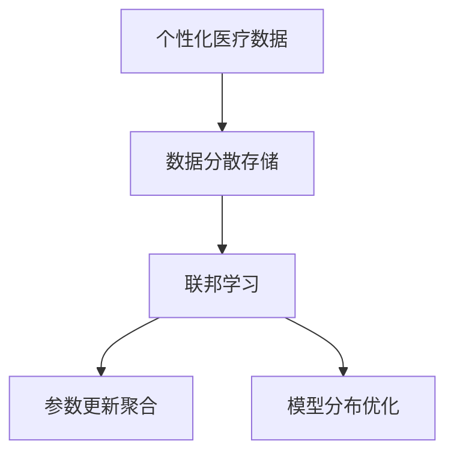
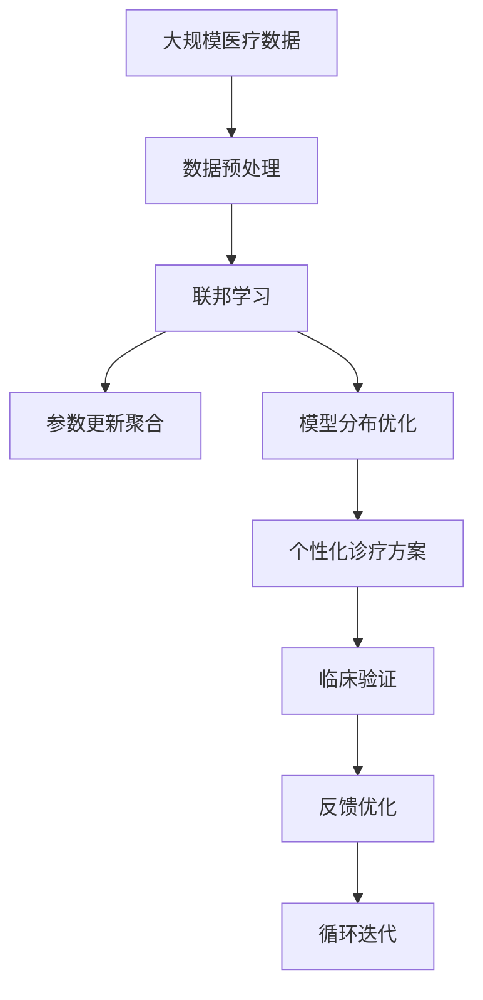

                 

# 联邦学习在个性化医疗中的潜力

## 1. 背景介绍

### 1.1 问题由来
随着大数据和人工智能技术的发展，个性化医疗逐渐成为医疗领域的重要方向。个性化医疗旨在根据个体遗传信息、生活习惯、过往病史等多维度信息，提供针对性的诊疗方案，提升治疗效果，减少医疗资源浪费。

然而，实现个性化医疗面临诸多挑战：
- **数据隐私**：个体健康数据涉及隐私，难以集中存储和处理。
- **数据孤岛**：不同医疗机构、不同地域的患者数据难以整合，形成数据孤岛。
- **数据质量**：医疗数据来源多样，质量参差不齐，缺乏统一的标准和格式。
- **计算资源**：大规模医疗数据处理需要高昂的计算资源，难以在本地部署。

为了应对这些挑战，联邦学习作为一种新型分布式学习范式，近年来在医疗领域引起了广泛关注。

### 1.2 问题核心关键点
联邦学习是一种分布式机器学习技术，其核心思想是在不共享数据的前提下，通过各节点本地训练模型的参数更新，聚合各节点更新的模型参数，得到全局最优模型。在个性化医疗中，联邦学习可以将各医疗机构或研究机构的数据进行分散存储和处理，同时保障数据隐私安全，得到全局最优的治疗方案。

联邦学习的关键点包括：
- 数据分散存储：各节点（如医院、研究机构）本地存储数据，不共享原始数据。
- 参数更新聚合：各节点独立更新模型参数，通过计算聚合各节点更新参数，得到全局最优模型。
- 模型分布优化：在保证隐私安全的前提下，各节点可以基于全局最优模型进行本地模型优化。

联邦学习的潜力在于其能够在保障隐私的同时，充分挖掘和利用分散的个体健康数据，推动个性化医疗的普及和发展。

### 1.3 问题研究意义
联邦学习在个性化医疗中的应用，对提升诊疗效果、保护数据隐私、降低医疗成本具有重要意义：

1. **提升诊疗效果**：通过联邦学习，可以从大规模分散的数据中挖掘个体化的治疗方案，提升诊疗效果。
2. **保护数据隐私**：联邦学习不共享原始数据，保障了患者的隐私和数据安全。
3. **降低医疗成本**：联邦学习通过分布式计算，减少了集中存储和处理医疗数据的成本。
4. **实现跨机构合作**：联邦学习促进了不同医疗机构、研究机构间的合作，提升了医疗资源利用效率。
5. **推动技术落地**：联邦学习为个性化医疗技术在大规模实际应用场景中的落地提供了技术支持。

## 2. 核心概念与联系

### 2.1 核心概念概述

为更好地理解联邦学习在个性化医疗中的应用，本节将介绍几个关键概念及其相互联系：

- **联邦学习**：一种分布式机器学习技术，通过各节点本地训练模型参数，聚合各节点更新参数，得到全局最优模型。
- **个性化医疗**：根据个体遗传信息、生活习惯等多维度信息，提供个性化诊疗方案，提升治疗效果。
- **数据分散存储**：各节点（如医院、研究机构）本地存储数据，不共享原始数据。
- **参数更新聚合**：各节点独立更新模型参数，通过计算聚合各节点更新参数，得到全局最优模型。
- **模型分布优化**：各节点基于全局最优模型进行本地模型优化。

这些概念构成了联邦学习在个性化医疗中的基本框架，通过这些概念的理解和应用，可以有效解决数据隐私、数据孤岛、数据质量、计算资源等挑战，实现个性化医疗的目标。

### 2.2 概念间的关系

联邦学习在个性化医疗中的应用可以通过以下Mermaid流程图来展示：



这个流程图展示了联邦学习在个性化医疗中的基本流程：

1. 个性化医疗数据通过分散存储，保障了数据的隐私和安全。
2. 联邦学习通过参数更新聚合和模型分布优化，从分散的数据中挖掘全局最优模型。
3. 各节点根据全局最优模型，进行本地模型优化，提升诊疗效果。

### 2.3 核心概念的整体架构

最后，我们用一个综合的流程图来展示联邦学习在个性化医疗中的整体架构：



这个综合流程图展示了联邦学习在个性化医疗中的应用流程：

1. 大规模医疗数据经过预处理，得到适合联邦学习的数据集。
2. 各节点基于本地数据，独立训练模型参数。
3. 参数更新聚合，得到全局最优模型。
4. 模型分布优化，各节点基于全局模型进行本地优化。
5. 个性化诊疗方案生成，并应用于临床。
6. 通过临床验证和反馈，优化模型，进入下一轮迭代。

通过这些概念和流程图的理解，可以更好地把握联邦学习在个性化医疗中的作用和应用方式。

## 3. 核心算法原理 & 具体操作步骤
### 3.1 算法原理概述

联邦学习的核心算法原理包括以下几个关键步骤：

1. **数据分布**：各节点（如医院、研究机构）本地存储数据，不共享原始数据。
2. **模型初始化**：在各节点本地训练模型参数。
3. **参数更新**：各节点独立更新模型参数，通过计算聚合各节点更新参数，得到全局最优模型。
4. **模型优化**：各节点基于全局最优模型进行本地模型优化。

联邦学习的过程可以概括为以下步骤：

1. **数据分割**：将全局数据集分割为多个本地数据集。
2. **本地训练**：各节点本地训练模型参数。
3. **参数聚合**：各节点更新模型参数，计算聚合参数。
4. **模型优化**：各节点基于全局最优模型进行本地模型优化。
5. **模型验证**：验证优化后的模型效果。

### 3.2 算法步骤详解

以下详细介绍联邦学习的具体算法步骤：

**Step 1: 数据分割与预处理**
- 将全局数据集 $D$ 分割为多个本地数据集 $D_i$，每个节点 $i$ 存储 $D_i$。
- 对本地数据集进行预处理，包括数据清洗、标准化、归一化等操作。

**Step 2: 本地训练**
- 在本地数据集 $D_i$ 上训练模型参数 $\theta_i$，得到本地模型 $M_i$。

**Step 3: 参数聚合**
- 计算各节点更新参数 $\Delta\theta_i$，通过计算得到全局更新参数 $\Delta\theta$。
- 更新全局模型参数 $\theta$，即 $\theta \leftarrow \theta - \eta\Delta\theta$，其中 $\eta$ 为学习率。

**Step 4: 模型优化**
- 各节点 $i$ 基于全局最优模型 $M$，进行本地模型优化。

**Step 5: 模型验证**
- 在验证集上验证模型效果，根据验证结果调整模型参数，进入下一轮迭代。

### 3.3 算法优缺点

联邦学习在个性化医疗中的应用具有以下优点：
1. 数据隐私保障：各节点本地存储数据，不共享原始数据，保障了数据的隐私和安全。
2. 数据分布计算：联邦学习通过分布式计算，减少了集中存储和处理医疗数据的成本。
3. 数据质量提升：联邦学习可以从大规模分散的数据中挖掘个体化的治疗方案，提升数据质量。
4. 跨机构合作：联邦学习促进了不同医疗机构、研究机构间的合作，提升了医疗资源利用效率。

同时，联邦学习也存在一些局限性：
1. 计算复杂度高：联邦学习的参数聚合过程复杂，计算量较大。
2. 网络延迟高：联邦学习需要频繁地进行参数更新和聚合，网络延迟较高。
3. 模型收敛慢：由于参数聚合方式不同，联邦学习可能存在模型收敛速度慢的问题。
4. 数据分布不均：各节点数据量不均，可能影响模型训练效果。

尽管存在这些局限性，但联邦学习在个性化医疗中的潜力不容忽视，未来需要在计算效率、网络优化等方面进行深入研究。

### 3.4 算法应用领域

联邦学习在个性化医疗中的应用领域非常广泛，主要包括：

- **个体化治疗方案**：根据个体基因信息、生活习惯、病史等多维度数据，生成个性化治疗方案。
- **药物研发**：利用分散的临床试验数据，挖掘新型药物的有效性和安全性。
- **疾病预测**：基于大量健康数据，预测个体患病的概率，提供早期预防措施。
- **临床决策支持**：利用联邦学习模型，辅助医生进行临床决策，提高诊疗效果。
- **公共卫生管理**：整合不同地区的健康数据，制定公共卫生政策和措施。

## 4. 数学模型和公式 & 详细讲解 & 举例说明

### 4.1 数学模型构建

联邦学习的数学模型可以表示为：
- 设全局数据集 $D=\{(x_i,y_i)\}_{i=1}^N$，其中 $x_i$ 为特征，$y_i$ 为标签。
- 设全局模型参数为 $\theta$，节点 $i$ 的本地模型参数为 $\theta_i$。
- 假设各节点本地数据集为 $D_i=\{(x_i^i,y_i^i)\}_{i=1}^N$。

则联邦学习的目标函数可以表示为：
$$
\min_{\theta} \frac{1}{N} \sum_{i=1}^N \ell(\theta_i;D_i) + \frac{\lambda}{N} \|\theta\|
$$
其中 $\ell(\theta_i;D_i)$ 为节点 $i$ 的本地损失函数，$\|\theta\|$ 为正则化项。

### 4.2 公式推导过程

联邦学习的参数更新过程可以表示为：
- 在节点 $i$ 本地训练模型参数 $\theta_i$，得到损失函数 $\ell(\theta_i;D_i)$。
- 计算节点 $i$ 的更新参数 $\Delta\theta_i = \nabla_{\theta_i}\ell(\theta_i;D_i)$。
- 计算全局更新参数 $\Delta\theta = \sum_{i=1}^N \Delta\theta_i$。
- 更新全局模型参数 $\theta \leftarrow \theta - \eta\Delta\theta$，其中 $\eta$ 为学习率。

### 4.3 案例分析与讲解

假设我们有一个包含 $1000$ 个样本的乳腺癌数据集，其中 $800$ 个样本为训练集，$200$ 个样本为测试集。我们希望利用联邦学习构建一个分类器，根据基因表达数据预测乳腺癌是否转移。

首先，将数据集随机分为两个节点 $A$ 和 $B$，每个节点存储 $500$ 个样本。节点 $A$ 存储训练集，节点 $B$ 存储测试集。

在节点 $A$ 上，利用随机梯度下降算法训练一个线性分类器 $\theta_A$，得到损失函数 $\ell_A(\theta_A;D_A)$。

在节点 $B$ 上，利用测试集评估分类器 $\theta_B$ 的性能，计算损失函数 $\ell_B(\theta_B;D_B)$。

然后，计算节点 $A$ 和 $B$ 的更新参数 $\Delta\theta_A$ 和 $\Delta\theta_B$，并计算全局更新参数 $\Delta\theta$。

最后，根据全局更新参数，更新全局模型参数 $\theta$，得到最终的分类器模型。

## 5. 项目实践：代码实例和详细解释说明

### 5.1 开发环境搭建

在进行联邦学习实践前，我们需要准备好开发环境。以下是使用Python进行PyTorch开发的环境配置流程：

1. 安装Anaconda：从官网下载并安装Anaconda，用于创建独立的Python环境。

2. 创建并激活虚拟环境：
```bash
conda create -n flenv python=3.8 
conda activate flenv
```

3. 安装PyTorch：根据CUDA版本，从官网获取对应的安装命令。例如：
```bash
conda install pytorch torchvision torchaudio cudatoolkit=11.1 -c pytorch -c conda-forge
```

4. 安装联邦学习相关库：
```bash
pip install federatedml
```

5. 安装各类工具包：
```bash
pip install numpy pandas scikit-learn matplotlib tqdm jupyter notebook ipython
```

完成上述步骤后，即可在`flenv`环境中开始联邦学习实践。

### 5.2 源代码详细实现

下面是使用PyTorch实现联邦学习项目的代码示例。

首先，定义全局模型和本地模型：

```python
from flfedml.models.classification import LinearClassifier
from flfedml.data import DataLoader

# 定义全局模型
global_model = LinearClassifier(in_features=784, out_features=10)

# 定义本地模型
local_model = LinearClassifier(in_features=784, out_features=10)

# 定义损失函数和优化器
criterion = nn.CrossEntropyLoss()
optimizer = torch.optim.SGD(local_model.parameters(), lr=0.001, momentum=0.9)

# 定义本地数据加载器
local_train_loader = DataLoader(train_data, batch_size=32, shuffle=True)
local_test_loader = DataLoader(test_data, batch_size=32, shuffle=False)
```

然后，定义联邦学习算法：

```python
from flfedml.algorithms import federated_learning

# 定义联邦学习算法
fl_algorithm = federated_learning.FederatedLearning(global_model, local_model, local_train_loader, local_test_loader)

# 定义通信轮数
rounds = 10

# 执行联邦学习算法
fl_algorithm.run(rounds)
```

最后，评估联邦学习模型的性能：

```python
# 在测试集上评估模型性能
test_loss, test_acc = fl_algorithm.evaluate()
print(f"Test Loss: {test_loss:.4f}, Test Accuracy: {test_acc:.4f}")
```

以上代码实现了联邦学习的基本流程，包括模型定义、数据加载、联邦学习算法运行和模型评估。通过简单的修改，可以实现更复杂的联邦学习应用。

### 5.3 代码解读与分析

让我们再详细解读一下关键代码的实现细节：

**定义全局模型和本地模型**：
- `LinearClassifier` 为联邦学习提供的线性分类器，定义了模型输入输出维度。
- `DataLoader` 为联邦学习提供的本地数据加载器，支持自定义数据格式和批量大小。

**联邦学习算法定义**：
- `federated_learning.FederatedLearning` 为联邦学习提供的算法接口，通过传入全局模型、本地模型、本地训练数据加载器和本地测试数据加载器，定义了联邦学习的基本流程。
- `run` 方法执行联邦学习算法，定义通信轮数。

**模型评估**：
- `evaluate` 方法在测试集上评估模型性能，返回测试损失和准确率。

**运行结果展示**：
- 运行上述代码后，输出测试集上的损失和准确率，可以进一步分析模型效果。

## 6. 实际应用场景

### 6.1 个体化治疗方案

联邦学习在个体化治疗方案中的应用，可以显著提升诊疗效果和患者满意度。例如，某医院希望利用分散的个体健康数据，构建一个个体化治疗方案生成系统。

具体而言，医院可以从电子健康记录中收集患者的基因信息、生活习惯、病史等多维度数据，分布存储到各个医疗节点。利用联邦学习技术，各节点独立训练模型，得到全局最优的治疗方案，最终在本地生成个体化的治疗建议。

### 6.2 药物研发

在药物研发中，联邦学习可以整合分散的临床试验数据，加速新药的研发过程。例如，某制药公司希望通过联邦学习，整合不同临床试验的数据，挖掘新型药物的有效性和安全性。

具体而言，公司可以收集不同临床试验的数据，每个临床试验为一个本地数据集。利用联邦学习技术，各节点独立训练模型，得到全局最优的药物效果和副作用预测模型，加速新药的研发进程。

### 6.3 疾病预测

在疾病预测中，联邦学习可以整合分散的健康数据，预测个体患病的概率，提供早期预防措施。例如，某公共卫生部门希望利用联邦学习，整合不同地区的健康数据，预测某地区的疫情爆发概率。

具体而言，部门可以收集不同地区的健康数据，每个地区为一个本地数据集。利用联邦学习技术，各节点独立训练模型，得到全局最优的疾病预测模型，预测不同地区的疫情爆发概率，制定相应的预防措施。

### 6.4 临床决策支持

在临床决策支持中，联邦学习可以辅助医生进行临床决策，提高诊疗效果。例如，某医院希望利用联邦学习，辅助医生进行乳腺癌的诊断和治疗方案制定。

具体而言，医院可以收集不同患者的乳腺癌数据，每个患者为一个本地数据集。利用联邦学习技术，各节点独立训练模型，得到全局最优的乳腺癌分类器，辅助医生进行乳腺癌的诊断和治疗方案制定。

## 7. 工具和资源推荐

### 7.1 学习资源推荐

为了帮助开发者系统掌握联邦学习在个性化医疗中的应用，这里推荐一些优质的学习资源：

1. 《联邦学习：原理与实践》系列博文：由联邦学习技术专家撰写，深入浅出地介绍了联邦学习的原理、实现和应用场景。

2. 《联邦学习入门》课程：由Coursera提供的联邦学习课程，适合初学者入门，涵盖了联邦学习的基本概念和实现方法。

3. 《联邦学习》书籍：由联邦学习领域专家所著，全面介绍了联邦学习的基本原理和应用，适合进阶学习。

4. FLAVOR框架：联邦学习领域最流行的开源框架，提供了丰富的联邦学习算法和工具，适合动手实践。

5. 联邦学习社区：国内外联邦学习研究者和开发者交流的平台，提供丰富的学习资源和实践经验。

通过对这些资源的学习实践，相信你一定能够快速掌握联邦学习在个性化医疗中的应用，并用于解决实际的医疗问题。

### 7.2 开发工具推荐

高效的开发离不开优秀的工具支持。以下是几款用于联邦学习开发的常用工具：

1. PyTorch：基于Python的开源深度学习框架，灵活动态的计算图，适合快速迭代研究。支持联邦学习算法实现。

2. TensorFlow：由Google主导开发的开源深度学习框架，生产部署方便，支持联邦学习算法实现。

3. FLAVOR框架：联邦学习领域最流行的开源框架，提供了丰富的联邦学习算法和工具，适合动手实践。

4. Weights & Biases：模型训练的实验跟踪工具，可以记录和可视化模型训练过程中的各项指标，方便对比和调优。

5. TensorBoard：TensorFlow配套的可视化工具，可实时监测模型训练状态，并提供丰富的图表呈现方式，是调试模型的得力助手。

6. Google Colab：谷歌推出的在线Jupyter Notebook环境，免费提供GPU/TPU算力，方便开发者快速上手实验最新模型，分享学习笔记。

合理利用这些工具，可以显著提升联邦学习任务的开发效率，加快创新迭代的步伐。

### 7.3 相关论文推荐

联邦学习在个性化医疗中的应用源于学界的持续研究。以下是几篇奠基性的相关论文，推荐阅读：

1. "Federated Learning: Concepts and Status"：一篇综述论文，介绍了联邦学习的概念、算法和应用场景，适合入门学习。

2. "Federated Learning: Strategies and Future Directions"：一篇综述论文，介绍了联邦学习的最新进展和未来方向，适合进阶学习。

3. "Decentralized Learning Methods"：一篇综述论文，介绍了分布式机器学习的概念和算法，适合了解联邦学习的理论基础。

4. "Federated Learning for Medical Image Classification"：一篇应用论文，介绍了联邦学习在医疗图像分类任务中的应用，适合具体应用场景的学习。

5. "A Survey of Federated Learning Methods and Protocols"：一篇综述论文，介绍了联邦学习的多种算法和协议，适合深入理解联邦学习的实现细节。

这些论文代表了大数据和人工智能技术在医疗领域的应用趋势，通过学习这些前沿成果，可以帮助研究者把握学科前进方向，激发更多的创新灵感。

除上述资源外，还有一些值得关注的前沿资源，帮助开发者紧跟联邦学习技术的最新进展，例如：

1. arXiv论文预印本：人工智能领域最新研究成果的发布平台，包括大量尚未发表的前沿工作，学习前沿技术的必读资源。

2. 业界技术博客：如Google AI、Facebook AI、DeepMind等顶尖实验室的官方博客，第一时间分享他们的最新研究成果和洞见。

3. 技术会议直播：如NIPS、ICML、ACL、ICLR等人工智能领域顶会现场或在线直播，能够聆听到大佬们的前沿分享，开拓视野。

4. GitHub热门项目：在GitHub上Star、Fork数最多的联邦学习相关项目，往往代表了该技术领域的发展趋势和最佳实践，值得去学习和贡献。

5. 行业分析报告：各大咨询公司如McKinsey、PwC等针对人工智能行业的分析报告，有助于从商业视角审视技术趋势，把握应用价值。

总之，对于联邦学习在个性化医疗中的应用，需要开发者保持开放的心态和持续学习的意愿。多关注前沿资讯，多动手实践，多思考总结，必将收获满满的成长收益。

## 8. 总结：未来发展趋势与挑战

### 8.1 总结

本文对联邦学习在个性化医疗中的应用进行了全面系统的介绍。首先阐述了联邦学习的基本概念和应用意义，明确了联邦学习在保障数据隐私、提升诊疗效果方面的独特价值。其次，从原理到实践，详细讲解了联邦学习的数学模型和操作步骤，给出了联邦学习项目开发的完整代码实例。同时，本文还广泛探讨了联邦学习在个体化治疗方案、药物研发、疾病预测等多个医疗领域的应用前景，展示了联邦学习的巨大潜力。

通过本文的系统梳理，可以看到，联邦学习在个性化医疗中的应用前景广阔，有望显著提升诊疗效果、保护数据隐私、降低医疗成本，为患者提供更好的健康服务。

### 8.2 未来发展趋势

展望未来，联邦学习在个性化医疗中的应用将呈现以下几个发展趋势：

1. **数据规模扩大**：随着数据采集技术的进步，联邦学习将从大规模医疗数据集中受益，提升模型的泛化能力和鲁棒性。
2. **计算资源优化**：联邦学习将不断优化计算资源使用，降低通信成本，提升模型训练效率。
3. **隐私保护加强**：联邦学习将进一步加强隐私保护技术，如差分隐私、安全多方计算等，保障数据安全。
4. **跨机构合作深入**：联邦学习将促进不同医疗机构、研究机构间的深度合作，提升数据共享和协同计算的能力。
5. **算法多样化**：联邦学习将引入更多算法，如分布式优化算法、异步更新算法等，优化模型训练过程。
6. **领域扩展**：联邦学习将从医疗领域扩展到更多领域，如教育、金融、智慧城市等，推动更多领域实现个性化服务。

这些趋势凸显了联邦学习在个性化医疗中的广泛应用前景，将进一步提升医疗服务的质量和效率。

### 8.3 面临的挑战

尽管联邦学习在个性化医疗中的应用前景广阔，但在实际落地过程中，仍面临诸多挑战：

1. **数据分布不均**：不同医疗机构、不同地区的数据量分布不均，可能影响模型训练效果。
2. **通信延迟高**：联邦学习需要频繁进行参数更新和聚合，网络延迟较高。
3. **计算复杂度高**：联邦学习的参数更新和聚合过程复杂，计算量大。
4. **隐私保护不足**：虽然联邦学习在隐私保护方面有所突破，但仍然存在数据泄露和攻击的风险。
5. **算法复杂度高**：联邦学习的算法实现复杂，需要较高的技术门槛。
6. **模型收敛慢**：联邦学习的模型训练过程可能存在收敛速度慢的问题。

这些挑战需要通过技术创新和优化解决，才能确保联邦学习在个性化医疗中的稳定应用。

### 8.4 研究展望

未来，联邦学习在个性化医疗中的应用需要从以下几个方面进行突破：

1. **优化数据分布**：通过数据增强、迁移学习等技术，优化数据分布不均的问题。
2. **提升通信效率**：引入异步更新、分布式优化等技术，提升联邦学习的通信效率。
3. **强化隐私保护**：引入差分隐私、安全多方计算等技术，进一步加强隐私保护。
4. **降低计算复杂度**：优化联邦学习的算法实现，降低计算复杂度，提高训练效率。
5. **提升模型鲁棒性**：引入鲁棒优化、模型蒸馏等技术，提升联邦学习模型的鲁棒性和泛化能力。
6. **拓展应用领域**：将联邦学习从医疗领域拓展到更多领域，推动更多行业实现个性化服务。

这些研究方向将为联邦学习在个性化医疗中的应用提供更强大的技术支持，进一步提升医疗服务的智能化水平，推动医疗技术的全面创新。

## 9. 附录：常见问题与解答

**Q1：什么是联邦学习？**

A: 联邦学习是一种分布式机器学习技术，通过各节点本地训练模型参数，聚合各节点更新参数，得到全局最优模型。

**Q2：联邦学习与传统分布式机器学习的区别是什么？**

A: 联邦学习与传统分布式机器学习的主要区别在于，联邦学习不共享原始数据，只共享模型参数，从而保护了数据隐私。

**Q3：联邦学习在个性化医疗中的应用有哪些？**

A: 联邦学习在个性化医疗中的应用包括个体化治疗方案、药物研发、疾病预测、临床决策支持等多个方面。

**Q4：联邦学习如何保护数据隐私？**

A: 联邦学习通过各节点本地训练模型参数，不共享原始数据，从而保护了数据隐私。

**Q5：联邦学习的缺点是什么？**

A: 联邦学习的缺点包括计算复杂度高、通信延迟高、数据分布不均

