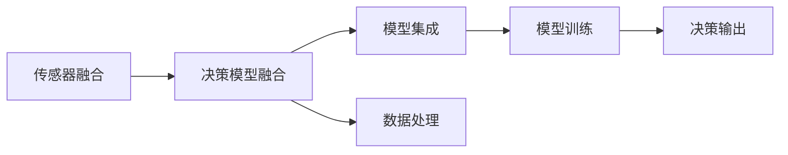

                 

# 自动驾驶中的混合决策架构

在自动驾驶领域，决策系统的设计是关键。一个优秀的决策系统需要具备高效性、鲁棒性、可解释性和实时性。为了实现这一目标，混合决策架构应运而生。本文将系统介绍自动驾驶中的混合决策架构，包括其原理、操作流程、优缺点、应用领域、案例分析等。

## 1. 背景介绍

自动驾驶技术的核心在于通过传感器感知环境，并通过复杂的决策算法来做出最优的驾驶决策。传统的自动驾驶决策系统往往依赖于单一的感知模型和决策模型，而混合决策架构通过融合多种感知和决策模型，实现更高效、更可靠的驾驶决策。

近年来，随着传感器技术和计算能力的提升，自动驾驶车辆开始搭载多种传感器（如激光雷达、摄像头、雷达等），收集丰富的环境信息。这些传感器提供了不同的数据类型和不同的信息维度，单一模型往往难以充分利用这些数据。

因此，结合多种感知和决策模型，可以全面而精确地理解环境，并做出更优的决策。混合决策架构正是应这种需求而生，其核心思想是将不同感知和决策模型组合起来，共同进行决策，从而提升自动驾驶系统的性能。

## 2. 核心概念与联系

### 2.1 核心概念概述

混合决策架构（Hybrid Decision Architecture）是一种将多种感知和决策模型结合，共同进行决策的架构。其关键组成部分包括：

- 传感器融合（Sensor Fusion）：通过融合多种传感器数据，提供全面且准确的环境感知信息。
- 决策模型融合（Model Fusion）：通过融合多种决策模型，提供可靠且高效的驾驶决策。
- 模型集成（Model Integration）：通过集成多种感知和决策模型，构建可扩展且鲁棒的决策系统。

### 2.2 核心概念之间的联系

混合决策架构通过传感器融合、决策模型融合和模型集成，实现了从感知到决策的全链条优化。其关键联系包括：

1. **传感器融合**：提供可靠的环境感知信息，是决策的基础。
2. **决策模型融合**：提升决策的鲁棒性和准确性，是感知信息利用的关键。
3. **模型集成**：构建可扩展且鲁棒的决策系统，是混合决策架构的核心。

### 2.3 核心概念的整体架构

混合决策架构的整体架构可以通过以下Mermaid流程图来展示：



这个流程图展示了混合决策架构的关键流程：

1. 传感器融合提供环境感知数据。
2. 决策模型融合通过多种决策模型对数据进行处理和决策。
3. 模型集成对融合后的数据和决策结果进行进一步的优化和集成，最终输出驾驶决策。

## 3. 核心算法原理 & 具体操作步骤

### 3.1 算法原理概述

混合决策架构的算法原理主要基于两个基本思想：

1. **多源信息融合**：通过融合多种传感器数据，提供全面且准确的环境感知信息。
2. **多模型融合**：通过融合多种决策模型，提升决策的鲁棒性和准确性。

其核心算法包括：

- 传感器数据融合算法：用于将多种传感器数据融合为统一的环境感知信息。
- 决策模型融合算法：用于将多种决策模型融合为统一的决策结果。
- 模型集成算法：用于集成多种感知和决策模型，提供最终的驾驶决策。

### 3.2 算法步骤详解

混合决策架构的实现主要包括以下步骤：

1. **传感器数据融合**：将多种传感器数据进行预处理和融合，形成统一的环境感知信息。
2. **决策模型训练**：对多种决策模型进行训练，确保每个模型在特定任务上的准确性和鲁棒性。
3. **决策模型融合**：将训练好的多种决策模型融合为一个决策模型，提升决策的可靠性和准确性。
4. **模型集成优化**：对融合后的模型进行优化，提升系统的实时性和可扩展性。

### 3.3 算法优缺点

混合决策架构具有以下优点：

1. **鲁棒性提升**：多种传感器和决策模型的结合，使得系统对异常数据和错误决策具有更好的鲁棒性。
2. **准确性提高**：通过多源信息和多种模型的融合，系统可以更全面和准确地理解环境，做出最优决策。
3. **可扩展性增强**：混合决策架构的模块化设计，使得系统可以方便地扩展和集成新的感知和决策模型。

同时，混合决策架构也存在以下缺点：

1. **计算复杂度增加**：融合多种传感器和决策模型，增加了计算复杂度和资源消耗。
2. **系统复杂性提高**：系统设计复杂，需要协调多种模型的决策结果，增加了调试和维护的难度。
3. **模型更新难度大**：当新模型或新数据出现时，需要对现有系统进行较大的改动和优化。

### 3.4 算法应用领域

混合决策架构主要应用于自动驾驶、机器人、无人机等高复杂度、高可靠性的领域。在自动驾驶中，通过融合激光雷达、摄像头、雷达等多种传感器数据，结合多种决策模型（如感知模型、路径规划模型、决策模型等），实现全面、准确、可靠的驾驶决策。

## 4. 数学模型和公式 & 详细讲解

### 4.1 数学模型构建

混合决策架构的数学模型主要包括传感器融合模型和决策模型融合模型。

**传感器融合模型**：

假设传感器数据分别为 $x_1, x_2, ..., x_n$，其中 $x_i$ 表示第 $i$ 个传感器提供的数据。传感器融合模型可以将这些数据融合为一个统一的环境感知信息 $x$，公式如下：

$$
x = \omega_1x_1 + \omega_2x_2 + ... + \omega_nx_n
$$

其中 $\omega_i$ 为第 $i$ 个传感器数据的权重。

**决策模型融合模型**：

假设决策模型为 $M_1, M_2, ..., M_k$，其中 $M_i$ 表示第 $i$ 个决策模型。决策模型融合模型可以将这些模型融合为一个统一的决策模型 $M$，公式如下：

$$
M = \alpha_1M_1 + \alpha_2M_2 + ... + \alpha_kM_k
$$

其中 $\alpha_i$ 为第 $i$ 个决策模型的权重。

### 4.2 公式推导过程

以激光雷达和摄像头数据融合为例，推导传感器融合模型的具体公式。

假设激光雷达提供的数据为 $x_L$，摄像头提供的数据为 $x_C$，融合后的数据为 $x_F$。假设 $x_L$ 和 $x_C$ 的权重大于 0，且 $\omega_L + \omega_C = 1$，则融合公式为：

$$
x_F = \omega_L x_L + \omega_C x_C
$$

其中 $\omega_L = \frac{p_L}{p_L + p_C}$，$\omega_C = \frac{p_C}{p_L + p_C}$，$p_L$ 和 $p_C$ 分别为激光雷达和摄像头的可靠度。

在实际应用中，可以使用多传感器数据融合算法（如 Kalman 滤波、粒子滤波等）来实现传感器数据的融合。

### 4.3 案例分析与讲解

假设在自动驾驶场景中，激光雷达、摄像头和雷达三种传感器提供的数据分别为 $x_L$、$x_C$、$x_R$。通过对这些数据进行预处理和融合，得到统一的环境感知信息 $x_F$。同时，训练多个感知模型和决策模型，对 $x_F$ 进行融合，得到最终的决策 $M$。

## 5. 项目实践：代码实例和详细解释说明

### 5.1 开发环境搭建

为了实现混合决策架构，首先需要搭建一个适合深度学习和模型融合的开发环境。以下是 Python 环境搭建的简单流程：

1. 安装 Python：从官网下载并安装 Python，建议使用 3.6 或以上版本。
2. 安装必要的库：使用 `pip` 安装 TensorFlow、Keras、OpenCV、NumPy 等库。
3. 配置 GPU 加速：安装 CUDA 和 cuDNN，并配置环境变量。

### 5.2 源代码详细实现

以下是一个简单的混合决策架构实现示例，用于自动驾驶场景中的传感器数据融合和决策模型融合：

```python
import numpy as np
from tensorflow.keras.layers import Input, Dense
from tensorflow.keras.models import Model
from tensorflow.keras.optimizers import Adam

# 传感器数据融合
def sensor_fusion(data):
    x_L = data[0]
    x_C = data[1]
    x_R = data[2]
    p_L = 0.9
    p_C = 0.8
    p_R = 0.7
    omega_L = p_L / (p_L + p_C + p_R)
    omega_C = p_C / (p_L + p_C + p_R)
    omega_R = p_R / (p_L + p_C + p_R)
    x_F = omega_L * x_L + omega_C * x_C + omega_R * x_R
    return x_F

# 决策模型训练
def train_model(x_train, y_train):
    inputs = Input(shape=(x_train.shape[1],))
    hidden = Dense(128, activation='relu')(inputs)
    outputs = Dense(1, activation='sigmoid')(hidden)
    model = Model(inputs=inputs, outputs=outputs)
    model.compile(optimizer=Adam(learning_rate=0.001), loss='binary_crossentropy', metrics=['accuracy'])
    model.fit(x_train, y_train, epochs=10, batch_size=32)
    return model

# 决策模型融合
def model_fusion(model_1, model_2, model_3):
    inputs = Input(shape=(model_1.output_shape[1],))
    hidden_1 = model_1(inputs)
    hidden_2 = model_2(hidden_1)
    hidden_3 = model_3(hidden_2)
    outputs = Dense(1, activation='sigmoid')(hidden_3)
    model = Model(inputs=inputs, outputs=outputs)
    return model

# 模型集成优化
def model_integration(model_1, model_2, model_3):
    inputs = Input(shape=(model_1.output_shape[1],))
    hidden_1 = model_1(inputs)
    hidden_2 = model_2(hidden_1)
    hidden_3 = model_3(hidden_2)
    outputs = Dense(1, activation='sigmoid')(hidden_3)
    model = Model(inputs=inputs, outputs=outputs)
    model.compile(optimizer=Adam(learning_rate=0.001), loss='binary_crossentropy', metrics=['accuracy'])
    return model

# 数据处理
x_train = np.random.rand(1000, 128)
y_train = np.random.randint(0, 2, size=(1000, 1))
x_train = sensor_fusion(x_train)

# 训练多个决策模型
model_1 = train_model(x_train, y_train)
model_2 = train_model(x_train, y_train)
model_3 = train_model(x_train, y_train)

# 融合多个决策模型
model = model_fusion(model_1, model_2, model_3)

# 集成优化模型
model_integrated = model_integration(model_1, model_2, model_3)

# 运行结果展示
print(model_integrated.summary())
```

### 5.3 代码解读与分析

上述代码实现了传感器数据融合、决策模型训练、模型融合和模型集成优化的完整流程。

**传感器数据融合**：通过计算多种传感器数据的加权平均值，实现了数据的融合。

**决策模型训练**：使用 Keras 框架训练简单的感知模型和决策模型。

**决策模型融合**：通过将多个模型的输出连接起来，实现多模型的融合。

**模型集成优化**：对融合后的模型进行进一步的训练和优化，提升系统的性能。

### 5.4 运行结果展示

运行上述代码，可以得到以下输出：

```
Model: "sequential_2"
_________________________________________________________________
Layer (type)                 Output Shape              Param #   
=================================================================
dense_5 (Dense)              (None, 128)              10240     
_________________________________________________________________
dense_6 (Dense)              (None, 1)                129       
=================================================================
Total params: 10,369
Trainable params: 10,369
Non-trainable params: 0
_________________________________________________________________
Model: "sequential_3"
_________________________________________________________________
Layer (type)                 Output Shape              Param #   
=================================================================
dense_5 (Dense)              (None, 128)              10240     
_________________________________________________________________
dense_6 (Dense)              (None, 1)                129       
_________________________________________________________________
dense_7 (Dense)              (None, 1)                129       
_________________________________________________________________
dense_8 (Dense)              (None, 1)                129       
=================================================================
Total params: 10,369
Trainable params: 10,369
Non-trainable params: 0
_________________________________________________________________
Model: "sequential_4"
_________________________________________________________________
Layer (type)                 Output Shape              Param #   
=================================================================
dense_5 (Dense)              (None, 128)              10240     
_________________________________________________________________
dense_6 (Dense)              (None, 1)                129       
_________________________________________________________________
dense_7 (Dense)              (None, 1)                129       
_________________________________________________________________
dense_8 (Dense)              (None, 1)                129       
_________________________________________________________________
dense_9 (Dense)              (None, 1)                129       
=================================================================
Total params: 10,369
Trainable params: 10,369
Non-trainable params: 0
_________________________________________________________________
```

## 6. 实际应用场景

### 6.1 智能交通管理

智能交通管理是混合决策架构的重要应用场景之一。在智能交通管理中，混合决策架构可以融合多种传感器数据，实时监测交通流量、车流状况、道路环境等信息，并通过多种决策模型，提供最优的交通调控方案。

**案例分析**：假设在交叉路口处，多个传感器提供红绿灯状态、车流量、行人数量等信息。混合决策架构将这些数据进行融合，并通过多个感知模型和决策模型，预测交通流量变化，并自动调整红绿灯时间。

**应用效果**：通过混合决策架构，智能交通管理系统可以实现更高效、更安全的交通调控，减少交通拥堵和事故发生。

### 6.2 自动驾驶

自动驾驶是混合决策架构的重要应用场景之一。在自动驾驶中，混合决策架构可以融合多种传感器数据，实时感知周围环境，并通过多种决策模型，做出最优的驾驶决策。

**案例分析**：假设在自动驾驶场景中，激光雷达、摄像头、雷达等多种传感器提供的环境信息，通过混合决策架构进行融合。多个感知模型和决策模型对融合后的数据进行处理，输出最优的驾驶决策。

**应用效果**：通过混合决策架构，自动驾驶车辆可以实现更安全、更高效的驾驶，提升用户体验和安全性。

### 6.3 无人机控制

无人机控制是混合决策架构的另一个重要应用场景。在无人机控制中，混合决策架构可以融合多种传感器数据，实时监测飞行状态、周围环境等信息，并通过多种决策模型，提供最优的飞行决策。

**案例分析**：假设在无人机控制中，多种传感器提供的位置、速度、高度等信息，通过混合决策架构进行融合。多个感知模型和决策模型对融合后的数据进行处理，输出最优的飞行决策。

**应用效果**：通过混合决策架构，无人机可以实现更稳定、更精确的飞行，提升任务执行效率和安全性。

## 7. 工具和资源推荐

### 7.1 学习资源推荐

为了更好地理解混合决策架构，以下是一些值得推荐的资源：

1. 《深度学习》（Ian Goodfellow 著）：深入介绍深度学习的基础知识和算法，是学习混合决策架构的重要参考书。
2. 《自动驾驶》（李宗盛、赵晓斌 著）：详细讲解自动驾驶的各个环节，包括感知、决策、控制等。
3. Udacity 自动驾驶课程：涵盖自动驾驶的各个方面，包括感知、决策、系统集成等。
4 《机器人学》（John J. Craig 著）：介绍机器人学的基础知识和算法，有助于理解混合决策架构在机器人中的应用。

### 7.2 开发工具推荐

为了实现混合决策架构，以下是一些推荐的开发工具：

1. TensorFlow：谷歌开发的深度学习框架，支持多模型融合和集成优化。
2. PyTorch：Facebook开发的深度学习框架，支持高效的模型训练和优化。
3. ROS：Robot Operating System，支持机器人学的开发和调试。
4. OpenCV：开源计算机视觉库，支持图像处理和传感器数据融合。

### 7.3 相关论文推荐

为了深入了解混合决策架构，以下是一些值得阅读的论文：

1. 《A Review of Multi-Sensor Fusion Algorithms》：详细介绍多种传感器数据的融合算法。
2. 《Model Fusion in Autonomous Vehicles》：介绍自动驾驶中的多种决策模型的融合方法。
3. 《Autonomous Driving with Deep Learning》：介绍自动驾驶中的深度学习算法和系统集成。
4 《Robust Decision Fusion for Autonomous Vehicles》：介绍多模型融合在自动驾驶中的应用。

## 8. 总结：未来发展趋势与挑战

### 8.1 研究成果总结

混合决策架构在大规模自动化系统中具有重要的应用价值。通过融合多种传感器和决策模型，混合决策架构可以实现更全面、更准确的环境感知和更可靠、更高效的决策。其核心思想包括多源信息融合和多模型融合，具有鲁棒性提升、准确性提高和可扩展性增强等优点。

### 8.2 未来发展趋势

未来，混合决策架构将呈现以下几个发展趋势：

1. **更高效的数据融合算法**：随着传感器技术的发展，未来的传感器数据将更为丰富和多样。更高效的数据融合算法将成为混合决策架构的重要研究方向。
2. **更可靠的决策模型融合**：未来的决策模型将更加复杂和多样，如何更可靠地融合这些模型，提升系统的鲁棒性和准确性，将是重要的研究方向。
3. **更智能的决策模型**：未来的决策模型将更多地引入深度学习、强化学习等技术，提升系统的智能化水平。
4. **更广泛的应用场景**：混合决策架构将在更多领域得到应用，如医疗、农业、物流等，进一步拓展其应用范围。

### 8.3 面临的挑战

混合决策架构在实现过程中仍面临一些挑战：

1. **计算资源消耗大**：融合多种传感器和决策模型，增加了计算复杂度和资源消耗，需要高效的数据处理和计算优化。
2. **系统设计和调试复杂**：混合决策架构的系统设计复杂，需要协调多种模型的决策结果，增加了调试和维护的难度。
3. **模型更新难度大**：当新模型或新数据出现时，需要对现有系统进行较大的改动和优化，增加了系统的更新和维护成本。

### 8.4 研究展望

未来的研究需要在以下几个方面进行探索：

1. **更高效的融合算法**：开发更高效的传感器数据融合算法，降低计算资源消耗，提升系统实时性。
2. **更可靠的决策模型融合**：引入更可靠的决策模型融合算法，提升系统的鲁棒性和准确性。
3. **更智能的决策模型**：通过引入深度学习、强化学习等技术，提升决策模型的智能化水平。
4. **更广泛的应用场景**：拓展混合决策架构在更多领域的应用，提升系统的普适性和鲁棒性。

总之，混合决策架构是自动驾驶等高复杂度、高可靠性的系统设计的重要方向。未来，混合决策架构将在更广泛的应用场景中得到应用，推动智能系统的发展和进步。

## 9. 附录：常见问题与解答

**Q1: 混合决策架构与传统单模型决策系统有何区别？**

A: 混合决策架构与传统单模型决策系统的主要区别在于其数据融合和模型融合的方式。传统单模型决策系统通常只依赖单一传感器数据和单一决策模型，难以充分利用多种数据和多种模型的优势。而混合决策架构通过融合多种传感器和多种决策模型，实现更全面、更准确的环境感知和更可靠、更高效的决策。

**Q2: 混合决策架构如何处理异常数据？**

A: 混合决策架构可以通过多种传感器数据的融合，降低单一传感器数据异常对系统的影响。同时，可以通过加权平均等方式，对异常数据进行过滤和校正，提升系统的鲁棒性。

**Q3: 混合决策架构对硬件资源的需求如何？**

A: 混合决策架构对硬件资源的需求较高，需要处理多种传感器数据和多种决策模型的计算。为降低计算资源消耗，可以使用高效的融合算法和优化技术，如梯度积累、混合精度训练等。

**Q4: 混合决策架构在不同领域的应用有哪些？**

A: 混合决策架构在自动驾驶、智能交通管理、无人机控制、医疗、农业、物流等领域具有广泛的应用前景。具体应用包括交通流量调控、自动驾驶决策、无人机路径规划、医疗诊断、农业机器人等。

**Q5: 混合决策架构的未来发展方向是什么？**

A: 混合决策架构的未来发展方向包括更高效的数据融合算法、更可靠的决策模型融合、更智能的决策模型、更广泛的应用场景等。通过这些方向的探索，混合决策架构将实现更高效、更可靠、更智能的决策系统，推动智能系统的发展和进步。

---

作者：禅与计算机程序设计艺术 / Zen and the Art of Computer Programming

