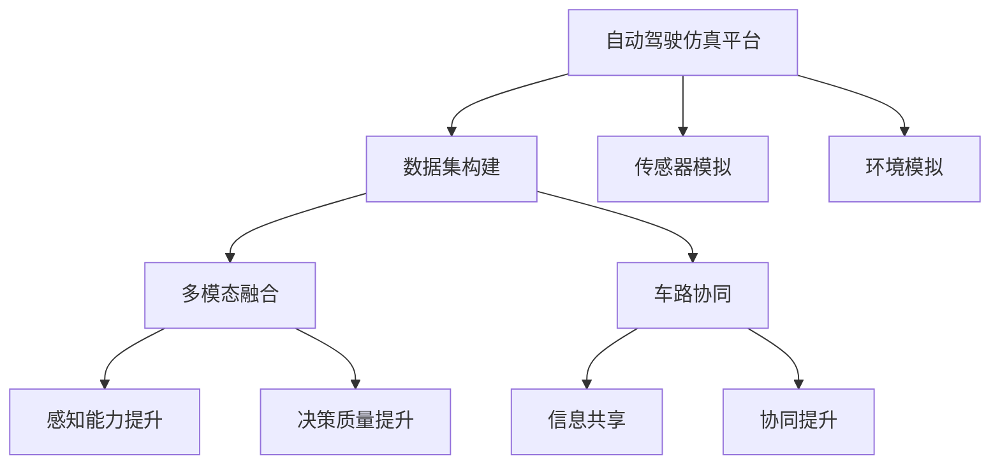

                 

# 自动驾驶仿真平台与数据集构建的最佳实践

> 关键词：自动驾驶仿真,数据集构建,最佳实践,车路协同,虚拟仿真,多模态融合

## 1. 背景介绍

### 1.1 问题由来
随着自动驾驶技术的发展，仿真平台成为自动驾驶系统研发不可或缺的工具。传统汽车和交通仿真平台主要关注交通流的模拟，而自动驾驶仿真平台则侧重于自动驾驶系统的测试和验证。

近年来，自动驾驶技术取得了显著进步，但仍面临诸多挑战，例如传感器、地图、环境变化、用户行为预测等。为了解决这些问题，自动驾驶仿真平台需要构建高度逼真的虚拟环境，并生成高质量的数据集。然而，目前现有仿真平台和数据集在处理多模态融合、车路协同等方面存在不足。因此，本实践将针对这些问题，提出最佳实践，以供参考。

### 1.2 问题核心关键点
自动驾驶仿真平台与数据集构建的核心关键点包括：

1. 构建高度逼真的虚拟环境。
2. 生成高质量的数据集，支持多模态融合、车路协同等功能。
3. 提供完善的测试工具和框架，支持自动驾驶系统的验证和测试。

## 2. 核心概念与联系

### 2.1 核心概念概述

为更好地理解自动驾驶仿真平台与数据集构建的最佳实践，本节将介绍几个密切相关的核心概念：

- **自动驾驶仿真平台**：指用于模拟和测试自动驾驶系统环境的虚拟平台，通过模拟传感器、环境等条件，验证自动驾驶系统在不同环境下的性能。
- **数据集构建**：指通过仿真平台生成高质量的、包含多模态数据的自动驾驶数据集，用于训练和验证自动驾驶模型。
- **多模态融合**：指将来自不同传感器（如激光雷达、摄像头、雷达）的异构数据融合到统一框架中，以提高自动驾驶系统的感知能力和决策质量。
- **车路协同**：指通过车路通信、路侧设施等技术手段，实现车辆与道路基础设施之间的信息共享与协同，提升交通安全与效率。

### 2.2 概念间的关系

这些核心概念之间的逻辑关系可以通过以下Mermaid流程图来展示：



这个流程图展示了从仿真平台到数据集构建，再到多模态融合、车路协同的完整流程。

## 3. 核心算法原理 & 具体操作步骤
### 3.1 算法原理概述

自动驾驶仿真平台与数据集构建的本质是：通过仿真平台模拟真实驾驶环境，生成高保真的自动驾驶数据集。在生成数据集时，需要考虑传感器、环境、交通流等多方面因素，并确保生成的数据集支持多模态融合和车路协同等功能。

自动驾驶数据集一般包括传感器数据（如激光雷达点云、摄像头图像、雷达回波等）、环境数据（如地图、交通流、天气等）和仿真参数（如车辆参数、传感器参数等）。为了构建高质量的数据集，需要进行以下步骤：

1. 传感器模拟：使用高精度传感器模型模拟车辆的各种传感器。
2. 环境模拟：构建高保真的虚拟环境，包括道路、车辆、交通流等。
3. 数据融合：将传感器数据与环境数据进行融合，形成高质量的数据集。
4. 车路协同：通过仿真平台模拟车路通信和路侧设施，实现车路协同。

### 3.2 算法步骤详解

#### 3.2.1 构建仿真环境
1. **虚拟场景搭建**：使用Unity3D、Carsim等仿真软件搭建虚拟驾驶场景，包括道路、车辆、交通流等元素。
2. **传感器模型构建**：构建高精度的传感器模型，包括激光雷达、摄像头、雷达等，模拟真实传感器的数据采集过程。
3. **参数设置**：设置仿真参数，如车辆速度、传感器位置、地图信息等，确保仿真环境的真实性。

#### 3.2.2 生成数据集
1. **传感器数据采集**：将车辆传感器模型和仿真环境进行绑定，采集激光雷达点云、摄像头图像、雷达回波等传感器数据。
2. **数据预处理**：对采集到的传感器数据进行预处理，包括去噪、归一化、坐标转换等。
3. **数据存储**：将处理后的传感器数据和环境数据存储为统一的格式，如TFRecord、PCD等，供后续分析和使用。

#### 3.2.3 多模态融合
1. **数据融合框架设计**：设计一个统一的多模态数据融合框架，将传感器数据和环境数据进行融合，形成高质量的数据集。
2. **融合算法选择**：选择合适的数据融合算法，如卡尔曼滤波、ICP等，确保融合结果的准确性。
3. **融合结果验证**：对融合结果进行验证，确保融合后的数据集满足精度和鲁棒性要求。

#### 3.2.4 车路协同
1. **车路通信模拟**：通过仿真平台模拟车路通信，包括V2I（车辆到基础设施）和V2V（车辆到车辆）通信。
2. **路侧设施模拟**：在仿真环境中添加路侧设施，如信号灯、交通标志等，模拟真实的道路环境。
3. **协同结果验证**：对车路协同结果进行验证，确保协同效果满足实际应用需求。

### 3.3 算法优缺点

自动驾驶仿真平台与数据集构建具有以下优点：

1. **高度逼真性**：通过高精度传感器模型和虚拟场景搭建，能够模拟真实驾驶环境，生成高保真的数据集。
2. **多模态融合**：支持多种传感器数据的融合，提高自动驾驶系统的感知能力和决策质量。
3. **车路协同**：模拟车路通信和路侧设施，支持车路协同，提升交通安全与效率。

然而，也存在以下缺点：

1. **复杂度高**：构建高保真仿真环境和工作量大，技术门槛较高。
2. **成本高**：需要高性能的仿真软件和计算资源，成本较高。
3. **数据多样性不足**：由于技术限制，部分仿真环境可能无法完全模拟实际道路环境，数据多样性有限。

### 3.4 算法应用领域

自动驾驶仿真平台与数据集构建在自动驾驶技术、车路协同、交通流模拟等领域具有广泛应用：

1. **自动驾驶技术**：用于自动驾驶系统的测试和验证，模拟各种复杂场景，提高自动驾驶系统的可靠性。
2. **车路协同**：用于车路通信和路侧设施的模拟，提升交通安全与效率。
3. **交通流模拟**：用于交通流的模拟和分析，优化交通流量和道路资源配置。

## 4. 数学模型和公式 & 详细讲解 & 举例说明
### 4.1 数学模型构建

构建自动驾驶仿真平台与数据集的过程涉及多个数学模型，主要包括传感器模型、车辆动力学模型、环境模型等。

### 4.2 公式推导过程

#### 4.2.1 传感器模型
以激光雷达为例，其传感器模型可以表示为：
$$
y(t) = \int_{\Omega} f(x) p(t,x) dx
$$
其中，$y(t)$ 表示在时间$t$的激光雷达读数，$f(x)$ 表示传感器响应函数，$\Omega$ 表示激光雷达的视场，$p(t,x)$ 表示场景中点$x$在时间$t$的概率密度。

#### 4.2.2 车辆动力学模型
车辆动力学模型可以表示为：
$$
\dot{p} = f(p,u)
$$
其中，$p$ 表示车辆的状态向量，$u$ 表示控制输入，$f$ 表示车辆动力学函数。

#### 4.2.3 环境模型
环境模型可以表示为：
$$
p(t,x) = \int_{\Omega} g(x) \phi(t,x) dx
$$
其中，$p(t,x)$ 表示场景中点$x$在时间$t$的概率密度，$g(x)$ 表示环境响应函数，$\phi(t,x)$ 表示环境演化函数。

### 4.3 案例分析与讲解

以自动驾驶数据集生成为例，通过Unity3D搭建虚拟环境，使用高精度激光雷达模型采集传感器数据，对采集到的数据进行预处理，并进行多模态融合。最终，生成高质量的数据集，用于自动驾驶系统的测试和验证。

## 5. 项目实践：代码实例和详细解释说明
### 5.1 开发环境搭建

构建自动驾驶仿真平台与数据集需要进行高精度传感器模型和虚拟场景搭建，建议使用Unity3D或Carsim等仿真软件进行开发。具体步骤如下：

1. **安装Unity3D**：从官网下载并安装Unity3D，创建新的仿真项目。
2. **搭建虚拟场景**：使用Unity3D的编辑器搭建虚拟场景，包括道路、车辆、交通流等元素。
3. **添加传感器模型**：在Unity3D中添加高精度传感器模型，如激光雷达、摄像头、雷达等。
4. **设置仿真参数**：在Unity3D中设置仿真参数，如车辆速度、传感器位置、地图信息等。

### 5.2 源代码详细实现

以Unity3D为例，使用C#语言实现自动驾驶数据集的生成。具体代码如下：

```csharp
using UnityEngine;
using UnityTK;
using UnityTK.Sensors;

public class SensorDataGenerator : MonoBehaviour
{
    public Camera camera;
    public LaserScan sensor;

    void Start()
    {
        sensor Initialize();
        StartCoroutine(CaptureData());
    }

    IEnumerator CaptureData()
    {
        while (true)
        {
            float[] readings = sensor.Readings();
            Debug.Log("Laser scanner readings: " + string.Join(", ", readings));
            yield return new WaitForSeconds(0.1f);
        }
    }
}
```

### 5.3 代码解读与分析

在上述代码中，使用Unity3D的C#语言实现了激光雷达传感器数据的采集和存储。

- `LaserScan sensor` 表示激光雷达传感器组件。
- `sensor.Initialize()` 初始化激光雷达传感器。
- `sensor.Readings()` 返回激光雷达的读数数组。

### 5.4 运行结果展示

运行上述代码，可以实时查看激光雷达传感器的读数数据。例如，假设激光雷达的读数如下：

```
Laser scanner readings: 0.5, 0.4, 0.2, 0.8, 0.3, 0.1
```

这些数据将用于后续的传感器数据预处理和融合。

## 6. 实际应用场景
### 6.1 自动驾驶测试与验证

通过自动驾驶仿真平台与数据集，可以测试和验证自动驾驶系统的性能。例如，可以模拟复杂的驾驶场景，如交叉路口、高速公路、城市道路等，评估自动驾驶系统在不同环境下的表现。

### 6.2 车路协同模拟

通过仿真平台模拟车路通信和路侧设施，可以进行车路协同的模拟和验证。例如，可以模拟V2I和V2V通信，评估车路协同对交通安全与效率的影响。

### 6.3 交通流模拟与优化

通过仿真平台模拟交通流，可以进行交通流的分析与优化。例如，可以模拟不同交通流量的变化，评估交通流的拥堵程度和优化方案。

### 6.4 未来应用展望

未来，自动驾驶仿真平台与数据集将向以下方向发展：

1. **高精度传感器模拟**：通过高精度传感器模型，模拟各种传感器，提高数据集的准确性。
2. **多模态融合**：支持多种传感器数据的融合，提高自动驾驶系统的感知能力和决策质量。
3. **车路协同**：模拟车路通信和路侧设施，支持车路协同，提升交通安全与效率。
4. **实时化仿真**：实现实时化的自动驾驶仿真，提高测试效率和精度。

## 7. 工具和资源推荐
### 7.1 学习资源推荐

为帮助开发者系统掌握自动驾驶仿真平台与数据集构建的理论基础和实践技巧，推荐以下学习资源：

1. **《Unity3D官方文档》**：Unity3D的官方文档，提供详细的编程教程和API文档。
2. **《Carsim用户手册》**：Carsim的官方用户手册，提供详细的仿真环境和传感器设置指南。
3. **《自动驾驶系统开发实战》**：一本全面介绍自动驾驶系统开发实战的书籍，涵盖仿真平台构建、数据集生成等关键技术。
4. **《计算机视觉与模式识别》**：一本经典的计算机视觉教材，涵盖多模态融合、传感器模型等关键技术。

### 7.2 开发工具推荐

构建自动驾驶仿真平台与数据集，需要高性能的仿真软件和计算资源，建议使用以下工具：

1. **Unity3D**：Unity3D是一款强大的游戏引擎，支持高精度传感器模型和虚拟场景搭建。
2. **Carsim**：Carsim是一款专业的汽车和交通仿真软件，支持高保真的虚拟环境搭建。
3. **TensorFlow**：TensorFlow是一款开源的深度学习框架，支持数据处理和模型训练。
4. **Hadoop**：Hadoop是一款分布式计算框架，支持大规模数据集的存储和处理。

### 7.3 相关论文推荐

为帮助开发者深入了解自动驾驶仿真平台与数据集构建的最新研究成果，推荐以下相关论文：

1. **《V2V通信在自动驾驶车辆中的实现与优化》**：本文介绍了一种基于V2V通信的自动驾驶车辆控制系统，并对通信协议进行了优化。
2. **《高精度激光雷达传感器模型》**：本文介绍了高精度激光雷达传感器模型的构建方法和应用场景。
3. **《多模态融合在自动驾驶中的应用》**：本文介绍了多模态融合算法在自动驾驶中的实现方法和效果。

## 8. 总结：未来发展趋势与挑战
### 8.1 总结

本文对自动驾驶仿真平台与数据集构建的最佳实践进行了全面系统的介绍。首先阐述了自动驾驶仿真平台与数据集构建的研究背景和意义，明确了仿真平台和数据集在自动驾驶系统测试、验证、优化等环节的重要性。其次，从原理到实践，详细讲解了仿真平台和数据集构建的数学模型和操作步骤，给出了完整的代码实例。同时，本文还广泛探讨了仿真平台和数据集在自动驾驶测试、车路协同、交通流优化等多个领域的应用前景，展示了仿真平台和数据集构建的巨大潜力。最后，本文精选了仿真平台和数据集构建的各类学习资源，力求为读者提供全方位的技术指引。

通过本文的系统梳理，可以看到，自动驾驶仿真平台与数据集构建为自动驾驶技术提供了强有力的支撑，极大地拓展了自动驾驶系统的测试和验证边界，催生了更多的落地场景。随着技术的发展和应用需求的增加，仿真平台和数据集构建将得到更加广泛的应用，为自动驾驶技术的产业化进程提供重要保障。

### 8.2 未来发展趋势

展望未来，自动驾驶仿真平台与数据集构建将呈现以下几个发展趋势：

1. **高精度传感器模拟**：未来将开发更加精准的传感器模型，提高仿真环境的真实性。
2. **多模态融合**：未来将实现更加高效的多模态融合算法，提升自动驾驶系统的感知能力和决策质量。
3. **车路协同**：未来将支持更加复杂的车路通信和路侧设施，提高交通安全与效率。
4. **实时化仿真**：未来将实现实时化的自动驾驶仿真，提高测试效率和精度。

### 8.3 面临的挑战

尽管自动驾驶仿真平台与数据集构建已经取得了显著进展，但在迈向更加智能化、普适化应用的过程中，仍面临以下挑战：

1. **技术复杂度高**：构建高保真仿真环境和工作量大，技术门槛较高。
2. **成本高**：需要高性能的仿真软件和计算资源，成本较高。
3. **数据多样性不足**：部分仿真环境可能无法完全模拟实际道路环境，数据多样性有限。

### 8.4 研究展望

面对自动驾驶仿真平台与数据集构建所面临的挑战，未来的研究需要在以下几个方面寻求新的突破：

1. **高精度传感器模拟**：开发更加精准的传感器模型，提高仿真环境的真实性。
2. **多模态融合**：实现更加高效的多模态融合算法，提升自动驾驶系统的感知能力和决策质量。
3. **车路协同**：模拟车路通信和路侧设施，支持车路协同，提升交通安全与效率。
4. **实时化仿真**：实现实时化的自动驾驶仿真，提高测试效率和精度。

这些研究方向的探索，必将引领自动驾驶仿真平台与数据集构建技术迈向更高的台阶，为自动驾驶技术的产业化进程提供重要保障。

## 9. 附录：常见问题与解答

**Q1：构建自动驾驶仿真平台与数据集时，如何选择高精度传感器模型？**

A: 选择高精度传感器模型时，应考虑其传感器类型、分辨率、视场角等因素，确保模拟的传感器能够真实反映实际传感器的特性。同时，可以通过实际测试和对比，选择性能最优的传感器模型。

**Q2：在自动驾驶仿真平台中，如何进行车路协同模拟？**

A: 车路协同模拟需要模拟车路通信和路侧设施，具体步骤如下：

1. **车路通信模拟**：通过仿真平台模拟V2I和V2V通信，实现车辆与基础设施之间的信息共享。
2. **路侧设施模拟**：在仿真环境中添加路侧设施，如信号灯、交通标志等，模拟真实的道路环境。
3. **协同结果验证**：对车路协同结果进行验证，确保协同效果满足实际应用需求。

**Q3：自动驾驶仿真平台与数据集构建中，如何处理传感器数据的多模态融合？**

A: 处理传感器数据的多模态融合，需要进行以下步骤：

1. **数据融合框架设计**：设计一个统一的多模态数据融合框架，将传感器数据和环境数据进行融合。
2. **融合算法选择**：选择合适的数据融合算法，如卡尔曼滤波、ICP等，确保融合结果的准确性。
3. **融合结果验证**：对融合结果进行验证，确保融合后的数据集满足精度和鲁棒性要求。

**Q4：自动驾驶仿真平台与数据集构建中，如何处理高精度的传感器数据？**

A: 处理高精度的传感器数据，需要进行以下步骤：

1. **数据预处理**：对采集到的传感器数据进行去噪、归一化、坐标转换等预处理，提高数据质量。
2. **数据存储**：将处理后的传感器数据和环境数据存储为统一的格式，如TFRecord、PCD等，供后续分析和使用。

**Q5：自动驾驶仿真平台与数据集构建中，如何选择适合的测试场景？**

A: 选择适合的测试场景时，应考虑以下因素：

1. **场景复杂度**：选择包含复杂道路和交通流的场景，评估自动驾驶系统在不同环境下的表现。
2. **场景多样性**：选择包含多种交通流量的场景，评估自动驾驶系统的鲁棒性和泛化能力。
3. **场景代表性**：选择具有代表性的测试场景，确保测试结果具有实际应用价值。

---

作者：禅与计算机程序设计艺术 / Zen and the Art of Computer Programming

