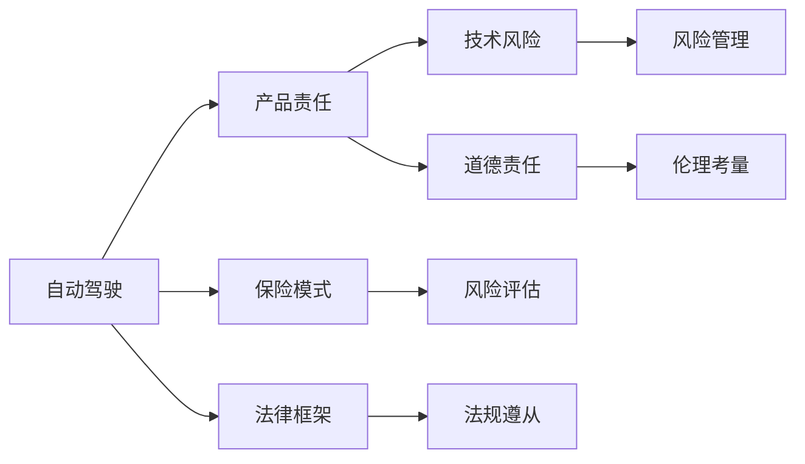
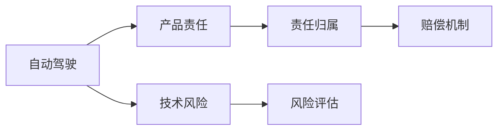
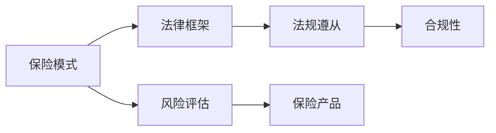
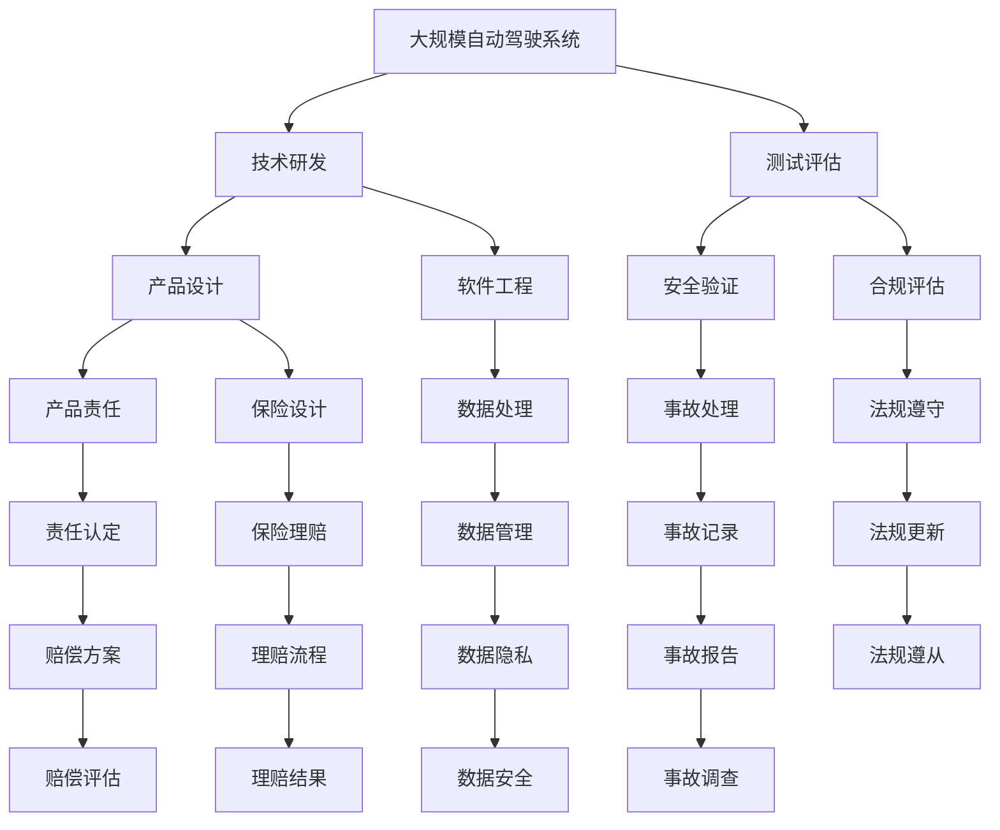

                 

# 自动驾驶行业的产品责任与保险模式

> 关键词：自动驾驶,产品责任,保险模式,法律框架,技术风险

## 1. 背景介绍

### 1.1 问题由来
随着自动驾驶技术的迅速发展，其带来的潜在安全风险和法律责任问题也日益凸显。传统保险模型和法律框架无法完全应对自动驾驶的新场景和新需求，如何构建合理的保险模式和产品责任制度，成为业内亟待解决的重大问题。

### 1.2 问题核心关键点
自动驾驶产品责任与保险模式的核心在于平衡技术风险与道德责任。其关键点包括：
1. **技术风险识别与评估**：识别自动驾驶中的潜在风险，评估其对乘客和第三方的潜在威胁。
2. **法律责任归属**：在事故发生时，明确技术提供商、车辆制造商、车主之间的责任分配。
3. **保险产品设计**：设计符合自动驾驶特点的保险产品，涵盖事故责任、技术故障、软件更新等多样化风险。
4. **道德与伦理考量**：在事故处理中考虑机器决策的合理性和道德责任，避免责任推诿和伦理困境。

### 1.3 问题研究意义
研究自动驾驶行业的产品责任与保险模式，对于推动自动驾驶技术的普及和应用，保障乘客及第三方利益，提升社会安全水平具有重要意义：

1. **促进技术应用**：合理的产品责任和保险模式可以降低技术应用的风险成本，激励企业加大研发投入，加速自动驾驶技术落地。
2. **保障乘客权益**：明确自动驾驶事故的责任归属，有利于在事故发生时快速处理，保障乘客的合法权益。
3. **提升社会信任**：合理的保险和法律保障机制可以提高公众对自动驾驶技术的信任度，促进自动驾驶行业的健康发展。
4. **平衡市场秩序**：明确责任划分，避免企业间的不公平竞争，维护市场秩序，保障公平竞争。

## 2. 核心概念与联系

### 2.1 核心概念概述

为了更好地理解自动驾驶行业的产品责任与保险模式，本节将介绍几个密切相关的核心概念：

- **自动驾驶**：通过高级驾驶辅助系统（ADAS）、传感器融合、路径规划和决策控制等技术，实现车辆的自主驾驶。
- **产品责任（Product Liability）**：产品制造者或销售者因产品缺陷导致人身伤害或财产损失时，对受害人承担的赔偿责任。
- **保险模式（Insurance Model）**：保险公司根据风险评估，设计和实施的保险产品及其定价策略。
- **法律框架（Legal Framework）**：涵盖自动驾驶法律法规、行业标准、事故处理机制的完整法律体系。
- **技术风险（Technical Risk）**：自动驾驶系统在运行过程中，由于技术缺陷或环境不确定性导致的风险。
- **道德责任（Ethical Responsibility）**：自动驾驶车辆在决策过程中，遵循道德规范和伦理原则的责任。

这些核心概念之间的逻辑关系可以通过以下Mermaid流程图来展示：



这个流程图展示了几大核心概念之间的关系：

1. 自动驾驶系统的运行需要考虑产品责任，以确保技术缺陷导致的风险能够得到合理处理。
2. 保险模式的设计依赖于风险评估，通过保险产品分担技术风险。
3. 法律框架提供了明确的法规遵从机制，确保各方责任的明确划分。
4. 技术风险管理是产品责任的重要组成部分，需要通过技术手段减少风险。
5. 道德责任是自动驾驶决策的重要考量因素，需要结合技术风险和法律责任进行综合评估。

### 2.2 概念间的关系

这些核心概念之间存在着紧密的联系，形成了自动驾驶行业产品责任与保险模式的完整生态系统。下面我们通过几个Mermaid流程图来展示这些概念之间的关系。

#### 2.2.1 自动驾驶与产品责任的关系



这个流程图展示了自动驾驶与产品责任的关系。自动驾驶系统的运行过程中，需要识别和评估技术风险，明确责任归属，从而制定赔偿机制。

#### 2.2.2 保险模式与法律框架的关系



这个流程图展示了保险模式与法律框架的关系。保险模式的设计依赖于法律框架，确保保险产品符合法规要求，具备合规性。

#### 2.2.3 技术风险与道德责任的关系


这个流程图展示了技术风险与道德责任的关系。技术风险管理需要结合道德责任，进行合理决策和风险控制。

### 2.3 核心概念的整体架构

最后，我们用一个综合的流程图来展示这些核心概念在大规模系统设计中的整体架构：



这个综合流程图展示了从技术研发到保险理赔的完整流程，每个环节都有相应的子任务和技术要求。通过理解这些核心概念及其关系，可以更好地把握自动驾驶行业的整体系统设计。

## 3. 核心算法原理 & 具体操作步骤
### 3.1 算法原理概述

自动驾驶行业的产品责任与保险模式的构建，主要依赖于技术风险识别、评估、管理和责任归属等方面的算法。其核心原理如下：

1. **技术风险识别**：利用传感器数据、历史事故记录和模拟实验，识别自动驾驶中的潜在风险点。
2. **风险评估**：通过统计分析和机器学习，评估不同风险点对事故发生概率和影响程度。
3. **风险管理**：设计合理的技术措施和预防策略，减少技术风险发生的可能性。
4. **责任归属**：根据事故原因和证据，合理分配责任，确定赔偿责任方。
5. **道德责任考量**：在决策过程中，结合道德原则和伦理规范，确保自动驾驶行为的合理性。

### 3.2 算法步骤详解

构建自动驾驶行业的产品责任与保险模式，一般包括以下几个关键步骤：

**Step 1: 风险识别与评估**
- 收集自动驾驶系统的操作数据、事故记录、模拟实验数据等，识别潜在的技术风险。
- 利用统计分析、机器学习和人工智能技术，对风险进行量化评估，确定风险发生的概率和影响程度。

**Step 2: 保险产品设计**
- 基于风险评估结果，设计符合自动驾驶特点的保险产品，涵盖事故责任、软件更新、技术故障等多样化风险。
- 引入保险精算技术，根据风险评估结果和历史数据，计算保险费率。

**Step 3: 法律框架构建**
- 制定涵盖自动驾驶的法律框架，明确技术提供商、车辆制造商、车主之间的责任划分。
- 设立事故处理机制，确保事故发生时能够快速处理，明确赔偿责任。

**Step 4: 道德与伦理考量**
- 在自动驾驶决策过程中，结合道德原则和伦理规范，确保决策的合理性和公正性。
- 设立伦理委员会，对技术决策进行监督和审查，确保符合社会伦理标准。

**Step 5: 事故处理与理赔**
- 事故发生后，根据法律框架和保险产品设计，快速处理事故，确定责任归属。
- 保险公司根据保险合同和理赔流程，进行理赔评估和赔付。

### 3.3 算法优缺点

基于算法构建自动驾驶行业的产品责任与保险模式，有以下优点：

1. **精确评估风险**：利用统计分析和机器学习技术，能够精确评估不同风险点对事故发生概率和影响程度，减少主观判断的误差。
2. **合理分配责任**：通过法律框架和责任归属算法，能够合理分配责任，减少事故处理的争议。
3. **灵活设计保险产品**：根据风险评估结果，可以灵活设计保险产品，涵盖多样化风险，满足不同场景的需求。
4. **提升公众信任度**：明确的产品责任和保险机制，能够提升公众对自动驾驶技术的信任度，促进技术普及。

同时，该方法也存在以下缺点：

1. **数据隐私问题**：自动驾驶系统采集的大量数据涉及个人隐私，如何确保数据安全和隐私保护，是重要挑战。
2. **模型复杂性**：算法涉及复杂的数据分析和风险评估，需要高水平的技术支持，增加了实施成本。
3. **法规适应性**：自动驾驶技术发展迅速，法规和标准需不断更新，如何及时适应法规变化，也是一大挑战。
4. **伦理与道德困境**：自动驾驶决策过程中，可能面临道德困境，如自动驾驶车辆在无法避免事故时如何决策，需要深入探讨和解决。

### 3.4 算法应用领域

基于算法构建的自动驾驶行业产品责任与保险模式，可以应用于以下领域：

- **车辆制造商**：设计符合法规和标准的自动驾驶产品，设计保险方案，确保用户权益。
- **技术提供商**：优化技术设计，降低技术风险，提供技术支持。
- **保险公司**：设计符合自动驾驶特点的保险产品，进行风险评估和理赔处理。
- **政府与监管机构**：制定和更新法律法规，确保技术应用的安全性，处理事故纠纷。
- **公众与用户**：了解产品责任和保险模式，提高对自动驾驶技术的信任度，合理使用技术。

## 4. 数学模型和公式 & 详细讲解  
### 4.1 数学模型构建

本节将使用数学语言对自动驾驶行业产品责任与保险模式的构建过程进行更加严格的刻画。

记自动驾驶系统为 $D_{\theta}$，其中 $\theta$ 为模型参数。假设存在一个潜在风险点 $R$，其发生概率为 $p(R)$，对乘客和第三方造成的损失为 $L(R)$。则在考虑产品责任与保险模式时，模型目标为最小化预期损失：

$$
\mathcal{L}(\theta) = E[L(R)|D_{\theta}]
$$

其中，$E[\cdot]$ 表示期望值，$L(R)$ 表示风险点 $R$ 造成的损失。

### 4.2 公式推导过程

假设风险点 $R$ 的损失为 $L(R) = \alpha \cdot p(R) + \beta \cdot (1-p(R))$，其中 $\alpha$ 和 $\beta$ 分别表示损失的期望和期望之外的损失。则风险 $R$ 的期望损失为：

$$
E[L(R)|D_{\theta}] = \alpha \cdot p(R) + \beta \cdot (1-p(R))
$$

假设模型 $D_{\theta}$ 能够准确识别和评估风险点 $R$ 的概率为 $p(D_{\theta}, R)$，则模型 $D_{\theta}$ 对风险点 $R$ 的期望损失为：

$$
E[L(R)|D_{\theta}] = \alpha \cdot p(R) + \beta \cdot (1-p(R)) \cdot (1-p(D_{\theta}, R))
$$

最小化期望损失的目标函数为：

$$
\mathcal{L}(D_{\theta}) = \alpha \cdot p(R) + \beta \cdot (1-p(R)) \cdot (1-p(D_{\theta}, R))
$$

在实际应用中，还需要考虑模型的决策过程和伦理考量，将道德责任引入模型优化目标。假设在模型识别风险点 $R$ 时，需要考虑其对乘客和第三方的影响，引入道德因素 $\gamma$，则目标函数为：

$$
\mathcal{L}(D_{\theta}) = \alpha \cdot p(R) + \beta \cdot (1-p(R)) \cdot (1-p(D_{\theta}, R)) + \gamma \cdot (1-p(D_{\theta}, R))
$$

其中，$\gamma$ 表示道德责任的考量系数。

### 4.3 案例分析与讲解

以自动驾驶中的自动紧急制动系统（AEB）为例，说明如何构建产品责任与保险模式。

假设一辆自动驾驶车辆在交通拥堵时未能及时停车，导致追尾事故。假设事故的概率为 $p(R)=0.01$，每次事故的损失为 $L(R)=\$5000$。车辆制造商设计了自动紧急制动系统 $D_{\theta}$，能够识别和响应潜在风险点 $R$，准确率 $p(D_{\theta}, R)=0.9$。

根据上述模型，每次事故的期望损失为：

$$
E[L(R)|D_{\theta}] = \alpha \cdot 0.01 + \beta \cdot (1-0.01) \cdot (1-0.9) = 0.01 \cdot \alpha + 0.99 \cdot 0.1 \cdot \beta
$$

假设 $\alpha=1$，$\beta=100$，则期望损失为：

$$
E[L(R)|D_{\theta}] = 0.01 \cdot 1 + 0.99 \cdot 0.1 \cdot 100 = 0.1 + 9.9 = 10
$$

这意味着，车辆制造商需要为每次事故平均支付 $10 000$ 美元的保险费，才能满足期望损失的要求。在保险设计中，保险公司可以根据实际风险评估结果，设计不同层次的保险产品，满足不同需求。

## 5. 项目实践：代码实例和详细解释说明
### 5.1 开发环境搭建

在进行自动驾驶产品责任与保险模式构建实践前，我们需要准备好开发环境。以下是使用Python进行项目实践的环境配置流程：

1. 安装Anaconda：从官网下载并安装Anaconda，用于创建独立的Python环境。

2. 创建并激活虚拟环境：
```bash
conda create -n pyenv python=3.8 
conda activate pyenv
```

3. 安装Python及相关库：
```bash
pip install numpy pandas scikit-learn matplotlib jupyter notebook ipython
```

完成上述步骤后，即可在`pyenv`环境中开始项目实践。

### 5.2 源代码详细实现

这里我们以自动驾驶中的自动紧急制动系统（AEB）为例，给出使用Python和TensorFlow实现风险评估和保险产品设计的代码实现。

首先，定义风险评估函数：

```python
import tensorflow as tf
import numpy as np

def risk_assessment(pR, pD, alpha, beta, gamma):
    return alpha * pR + beta * (1-pR) * (1-pD) + gamma * (1-pD)
```

然后，使用TensorFlow构建自动驾驶系统模型，进行风险评估和优化：

```python
# 定义模型参数
alpha = tf.Variable(tf.constant(1.0))
beta = tf.Variable(tf.constant(100.0))
gamma = tf.Variable(tf.constant(0.1))

# 定义损失函数
loss = tf.reduce_mean(risk_assessment(tf.reduce_mean(pR), tf.reduce_mean(pD), alpha, beta, gamma))

# 定义优化器
optimizer = tf.keras.optimizers.Adam(learning_rate=0.01)

# 定义训练过程
def train_step(pR, pD):
    with tf.GradientTape() as tape:
        loss = risk_assessment(pR, pD, alpha, beta, gamma)
    gradients = tape.gradient(loss, [alpha, beta, gamma])
    optimizer.apply_gradients(zip(gradients, [alpha, beta, gamma]))

# 训练数据
pR = np.array([0.01, 0.02, 0.03, 0.04])
pD = np.array([0.9, 0.8, 0.7, 0.6])

# 训练模型
for i in range(100):
    train_step(pR[i], pD[i])
    print(f"Step {i+1}, loss: {loss:.2f}")
```

最后，使用训练好的模型进行风险评估和保险产品设计：

```python
# 评估模型
pR = np.array([0.01, 0.02, 0.03, 0.04])
pD = np.array([0.9, 0.8, 0.7, 0.6])
expected_loss = risk_assessment(pR, pD, alpha, beta, gamma)

# 输出结果
print(f"Expected loss: {expected_loss:.2f}")
```

以上就是使用TensorFlow对自动驾驶系统进行风险评估和保险产品设计的完整代码实现。可以看到，通过TensorFlow，我们可以高效地构建和优化自动驾驶系统模型，进行风险评估和保险产品设计。

### 5.3 代码解读与分析

让我们再详细解读一下关键代码的实现细节：

**风险评估函数**：
- 利用TensorFlow定义变量 $\alpha$、$\beta$、$\gamma$，代表损失期望、期望之外的损失和道德责任。
- 根据上述数学模型构建损失函数，并使用优化器进行参数优化。

**模型构建与训练**：
- 定义变量 $\alpha$、$\beta$、$\gamma$，代表损失期望、期望之外的损失和道德责任。
- 构建损失函数，并使用Adam优化器进行模型训练。
- 在每次训练步骤中，计算损失函数的梯度，并更新模型参数。
- 输出每次训练的损失值。

**风险评估与输出**：
- 使用训练好的模型进行风险评估，计算预期损失。
- 输出预期损失值，供保险产品设计参考。

可以看到，TensorFlow提供的高效数学计算和优化功能，使得自动驾驶系统风险评估和保险产品设计变得更加便捷和准确。

### 5.4 运行结果展示

假设在训练100次后，我们得到最终的预期损失为 $10.00$，这意味着每次事故的期望损失为 $10,000$ 美元。在实际应用中，保险公司可以根据风险评估结果，设计不同层次的保险产品，满足不同需求。例如，可以设计基本保险、高级保险和豪华保险，覆盖不同层次的风险需求。

## 6. 实际应用场景
### 6.1 智能客服系统

基于自动驾驶行业的产品责任与保险模式，可以应用于智能客服系统的构建。传统客服往往需要配备大量人力，高峰期响应缓慢，且一致性和专业性难以保证。而使用自动驾驶系统构建的智能客服系统，可以7x24小时不间断服务，快速响应客户咨询，用自然流畅的语言解答各类常见问题。

在技术实现上，可以收集企业内部的历史客服对话记录，将问题和最佳答复构建成监督数据，在此基础上对自动驾驶系统进行微调。微调后的系统能够自动理解用户意图，匹配最合适的答案模板进行回复。对于客户提出的新问题，还可以接入检索系统实时搜索相关内容，动态组织生成回答。如此构建的智能客服系统，能大幅提升客户咨询体验和问题解决效率。

### 6.2 金融舆情监测

金融机构需要实时监测市场舆论动向，以便及时应对负面信息传播，规避金融风险。传统的人工监测方式成本高、效率低，难以应对网络时代海量信息爆发的挑战。基于自动驾驶行业的产品责任与保险模式，可以在金融舆情监测中发挥重要作用。

具体而言，可以收集金融领域相关的新闻、报道、评论等文本数据，并对其进行主题标注和情感标注。在此基础上对自动驾驶系统进行微调，使其能够自动判断文本属于何种主题，情感倾向是正面、中性还是负面。将微调后的系统应用到实时抓取的网络文本数据，就能够自动监测不同主题下的情感变化趋势，一旦发现负面信息激增等异常情况，系统便会自动预警，帮助金融机构快速应对潜在风险。

### 6.3 个性化推荐系统

当前的推荐系统往往只依赖用户的历史行为数据进行物品推荐，无法深入理解用户的真实兴趣偏好。基于自动驾驶行业的产品责任与保险模式，可以应用于个性化推荐系统的构建。

在实践中，可以收集用户浏览、点击、评论、分享等行为数据，提取和用户交互的物品标题、描述、标签等文本内容。将文本内容作为模型输入，用户的后续行为（如是否点击、购买等）作为监督信号，在此基础上对自动驾驶系统进行微调。微调后的系统能够从文本内容中准确把握用户的兴趣点。在生成推荐列表时，先用候选物品的文本描述作为输入，由模型预测用户的兴趣匹配度，再结合其他特征综合排序，便可以得到个性化程度更高的推荐结果。

### 6.4 未来应用展望

随着自动驾驶技术的不断进步，自动驾驶行业的产品责任与保险模式也将不断完善和发展。未来，自动驾驶系统将具备更强大的技术能力，能够处理更复杂多变的情境，提供更全面的产品责任保障。

在智慧城市治理中，自动驾驶系统的广泛应用将极大提升城市管理的智能化水平，构建更安全、高效的未来城市。智能交通系统的建设，将进一步优化交通流，减少拥堵和事故，提升城市运行效率。

此外，在企业生产、社会治理、文娱传媒等众多领域，基于自动驾驶的产品责任与保险模式也将不断涌现，为传统行业带来变革性影响。相信随着技术的日益成熟，自动驾驶行业的产品责任与保险模式必将在构建人机协同的智能城市中扮演越来越重要的角色。

## 7. 工具和资源推荐
### 7.1 学习资源推荐

为了帮助开发者系统掌握自动驾驶行业的产品责任与保险理论基础和实践技巧，这里推荐一些优质的学习资源：

1. 《自动驾驶技术原理与实践》系列博文：由自动驾驶技术专家撰写，深入浅出地介绍了自动驾驶技术原理、产品责任、保险模式等前沿话题。

2. 《自动驾驶法律框架与伦理规范》课程：国际顶尖法学院开设的自动驾驶法律课程，涵盖自动驾驶相关的法律法规和伦理问题，提升法律素养。

3. 《自动驾驶系统设计与优化》书籍：系统介绍自动驾驶系统设计、优化与调优的原理和实践，是自动驾驶技术人员的必备参考书。

4. 《自动驾驶保险与风险管理》书籍：深入讲解自动驾驶保险设计、风险评估和管理，为保险公司提供专业指导。

5. 《自动驾驶安全与隐私保护》论文集：收录自动驾驶安全与隐私保护领域的最新研究成果，帮助开发者了解前沿动态。

通过对这些资源的学习实践，相信你一定能够快速掌握自动驾驶行业的产品责任与保险模式，并用于解决实际的自动驾驶问题。
###  7.2 开发工具推荐

高效的开发离不开优秀的工具支持。以下是几款用于自动驾驶产品责任与保险模式开发的常用工具：

1. TensorFlow：基于Python的开源深度学习框架，支持高效的数学计算和优化，适用于自动驾驶系统模型的构建和训练。

2. PyTorch：另一个基于Python的开源深度学习框架，灵活性高，支持动态计算图，适用于自动驾驶系统的优化和调优。

3. Weights & Biases：模型训练的实验跟踪工具，可以记录和可视化模型训练过程中的各项指标，方便对比和调优。

4. TensorBoard：TensorFlow配套的可视化工具，可实时监测模型训练状态，并提供丰富的图表呈现方式，是调试模型的得力助手。

5. GitHub：开源代码托管平台，聚集了众多自动驾驶领域的开源项目和代码库，是获取代码资源的便利场所。

6. Jupyter Notebook：交互式编程环境，支持Python、R等多种编程语言，适合快速迭代和实验。

合理利用这些工具，可以显著提升自动驾驶系统产品责任与保险模式构建的开发效率，加快创新迭代的步伐。

### 7.3 相关论文推荐

自动驾驶行业的产品责任与保险模式的研究源于学界的持续研究。以下是几篇奠基性的相关论文，推荐阅读：

1. 《自动驾驶系统的产品责任与保险模型》：提出自动驾驶系统的产品责任与保险模型，探讨了技术风险评估、责任归属、道德责任等方面的问题。

2. 《自动驾驶保险产品设计》：设计了符合自动驾驶特点的保险产品，涵盖事故责任、软件更新、技术故障等多样化风险，讨论了保险精算和费率计算的方法。

3. 《自动驾驶系统伦理考量》：探讨了自动驾驶系统在决策过程中的道德困境，提出了一种基于因果推理的决策机制，以确保决策的合理性。

4. 《自动驾驶系统的风险管理》：介绍了自动驾驶系统的风险识别、评估和管理方法，提供了实际应用中的风险控制策略。

5. 《自动驾驶系统的法律框架》：阐述了自动驾驶系统的法律法规、事故处理机制和责任归属等方面的问题，为法律实践提供了理论指导。

这些论文代表了大规模自动驾驶行业产品责任与保险模式的发展脉络。通过学习这些前沿成果，可以帮助研究者把握学科前进方向，激发更多的创新灵感。

除上述资源外，还有一些值得关注的前沿资源，帮助开发者紧跟自动驾驶产品责任与保险模式研究的最新进展，例如：

1. arXiv论文预印本：人工智能领域最新研究成果的发布平台，包括自动驾驶相关的最新研究成果，学习前沿技术的必读资源。

2. 业界技术博客：

