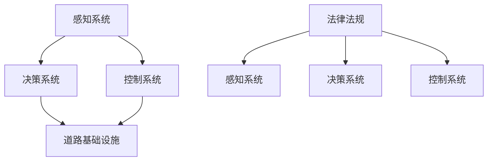

                 

# 自动驾驶行业的标准化进程

在人工智能快速发展的背景下，自动驾驶技术正迅速崛起，成为全球科技竞争的新前沿。从单车智能到车联网，从感知决策到控制系统，自动驾驶技术融合了深度学习、计算机视觉、传感器融合等多项AI技术，形成了极为复杂的生态系统。然而，技术的飞速发展也带来了诸多标准化问题，这些问题不仅影响着自动驾驶技术的商业化进程，也关乎着道路交通安全、法规制度等方面的挑战。本文将对自动驾驶行业标准化进程进行详细探讨，从技术、法律、标准等角度揭示自动驾驶行业面临的挑战与机遇。

## 1. 背景介绍

### 1.1 问题由来
随着自动驾驶技术的快速发展，从技术到商业化的过程中，标准化问题逐渐凸显。由于自动驾驶技术涉及多方面复杂元素，如感知、决策、控制等，导致了标准化过程的复杂性和多样性。目前全球范围内尚未形成统一的自动驾驶标准，不同国家和地区的标准差异也影响了技术的跨域应用。

### 1.2 问题核心关键点
1. 技术标准化：涉及硬件、软件、数据接口等多维度，缺乏统一标准导致技术不兼容，难以形成互操作性。
2. 法律与法规：不同国家和地区法律法规差异，导致自动驾驶技术落地时存在法律障碍。
3. 数据标准：数据格式、标注规范等不统一，影响了模型的训练和验证效果。
4. 测试与评估：缺乏统一的测试标准和评估体系，导致技术有效性难以评估。

### 1.3 问题研究意义
标准化是推动技术成熟和市场普及的重要环节，对于自动驾驶技术尤为关键。通过标准化，可以减少技术壁垒，提高系统的互操作性，加速技术的商业化进程，同时确保道路安全，避免法规冲突，为自动驾驶技术的广泛应用提供保障。

## 2. 核心概念与联系

### 2.1 核心概念概述

为更好地理解自动驾驶行业的标准化进程，本节将介绍几个核心概念：

- **感知系统**：自动驾驶车辆的核心部件，用于感知周围环境，包括激光雷达、摄像头、雷达等传感器。
- **决策系统**：基于感知系统提供的信息，结合AI模型进行路径规划、交通决策等。
- **控制系统**：控制车辆的转向、加速、制动等行为，确保车辆安全运行。
- **道路基础设施**：包括智能红绿灯、可变信息板等，为自动驾驶车辆提供信息支持。
- **法律法规**：涉及车辆性能测试、道路通行规则、数据隐私保护等，是自动驾驶技术落地的关键。

这些核心概念之间的逻辑关系可以通过以下Mermaid流程图来展示：



这个流程图展示了自动驾驶核心组件及其相互关系，以及与法律法规的交互：

1. 感知系统提供环境信息给决策系统，决策系统规划路径并控制车辆。
2. 道路基础设施为决策系统提供交通信息。
3. 法律法规对感知系统、决策系统和控制系统的性能测试与标准有明确要求。

### 2.2 概念间的关系

这些核心概念之间存在着紧密的联系，构成了自动驾驶技术的整体框架：

- **技术标准**：感知、决策和控制系统必须遵循统一的技术标准，才能实现互操作性。
- **法律法规**：法律法规规定了自动驾驶技术的测试、评价和应用标准，确保技术的安全性和合规性。
- **数据标准**：数据格式、标注规范等标准是感知系统、决策系统训练和验证的基础。
- **基础设施标准**：智能交通基础设施的标准化有助于信息共享和互操作，提升交通效率。

这些概念共同构成了自动驾驶技术的标准化体系，为技术的落地提供了坚实的基础。

## 3. 核心算法原理 & 具体操作步骤

### 3.1 算法原理概述

自动驾驶技术的标准化主要涉及感知、决策和控制等多个环节，需制定相应的技术标准、测试标准、数据标准、法律法规等。

1. **感知系统标准**：确定传感器的性能指标，如分辨率、探测距离等。
2. **决策系统标准**：制定AI模型性能评估指标，如精确度、召回率等。
3. **控制标准**：定义车辆控制行为标准，如加减速、转向等。
4. **数据标准**：制定数据格式、标注规范等，如传感器数据格式、样本标注规则等。
5. **法律法规**：制定自动驾驶技术测试、评价、应用等方面的法律法规。

### 3.2 算法步骤详解

以下是对自动驾驶技术标准化过程中关键步骤的详细描述：

1. **技术标准的制定**：
   - **确定技术指标**：如传感器分辨率、AI模型精度等。
   - **制定技术规范**：如传感器数据格式、AI模型架构等。
   - **组织标准化组织**：成立国家或国际标准化组织，推动技术标准的制定和实施。

2. **法律法规的制定**：
   - **制定法律框架**：如自动驾驶测试法规、数据隐私保护法规等。
   - **法律协调与合作**：不同国家或地区的法律需协调，确保一致性和互认性。

3. **数据标准的制定**：
   - **制定数据格式规范**：如传感器数据、标注数据格式等。
   - **制定标注规范**：如样本标注规则、测试数据标注标准等。

4. **测试与评估标准的制定**：
   - **制定测试标准**：如传感器性能测试、AI模型性能测试等。
   - **制定评估体系**：如AI模型精度评估、系统安全性评估等。

5. **实施与监督**：
   - **标准化实施**：推动标准化标准的落地实施。
   - **标准化监督**：建立监督机制，确保标准化标准的执行。

### 3.3 算法优缺点

**优点**：
1. 推动技术成熟：标准化有利于技术的发展和成熟，减少技术壁垒。
2. 提升互操作性：通过制定统一的技术标准，不同厂商的设备可实现互操作性。
3. 促进法规完善：法律法规的完善有助于技术的合规性和安全性。
4. 提高数据可靠性：统一的数据标准有助于提升模型训练和验证的效果。

**缺点**：
1. 标准化周期长：标准的制定和实施周期较长，可能影响技术迭代速度。
2. 协调复杂：不同国家和地区的法律和技术标准差异大，协调困难。
3. 成本高昂：标准化的实施需要大量投入，增加了成本。
4. 可能限制创新：严格的统一标准可能限制厂商的创新空间。

### 3.4 算法应用领域

自动驾驶行业的标准化涉及多个应用领域：

- **车辆感知技术**：涉及传感器数据格式、性能测试等标准。
- **自动驾驶决策**：涉及AI模型性能评估、测试标准等。
- **车辆控制行为**：涉及车辆控制行为的标准规范。
- **智能交通基础设施**：涉及信息交互格式和协议等标准。
- **数据隐私保护**：涉及数据存储、传输和使用的标准。

这些标准的制定和实施，将推动自动驾驶技术的广泛应用和普及。

## 4. 数学模型和公式 & 详细讲解

### 4.1 数学模型构建

为方便对自动驾驶技术标准化进行数学建模，我们将采用如下模型：

- **感知模型**：$S(x) = [s_1(x), s_2(x), ..., s_n(x)]$，其中 $s_i$ 为第 $i$ 个传感器对环境信息的感知结果。
- **决策模型**：$D(S) = [d_1(S), d_2(S), ..., d_m(S)]$，其中 $d_i$ 为第 $i$ 个决策结果。
- **控制模型**：$C(D) = c(D)$，其中 $c$ 为控制行为函数。

### 4.2 公式推导过程

以感知模型为例，假设有 $N$ 个传感器，其感知结果为 $S = [s_1, s_2, ..., s_N]$，每个传感器输出的分辨率为 $r_i$，则感知模型的总体性能指标 $P$ 可表示为：

$$
P = \frac{1}{N}\sum_{i=1}^N \frac{1}{r_i}
$$

其中 $r_i$ 表示第 $i$ 个传感器的分辨率。

**决策模型**：假设决策模型的输出为 $D = [d_1, d_2, ..., d_m]$，其中每个 $d_i$ 表示第 $i$ 个决策结果。如果每个决策结果的正确率为 $p_i$，则决策模型的整体性能指标 $P_D$ 为：

$$
P_D = \prod_{i=1}^m p_i
$$

**控制模型**：假设控制行为函数 $c$ 可表示为 $c(D) = k_1 d_1 + k_2 d_2 + ... + k_m d_m$，其中 $k_i$ 为第 $i$ 个决策结果的权重。假设控制行为 $c$ 的精度为 $p_c$，则控制模型的性能指标 $P_C$ 为：

$$
P_C = p_c
$$

### 4.3 案例分析与讲解

假设有两个传感器 $s_1$ 和 $s_2$，其分辨率分别为 $r_1 = 10m$ 和 $r_2 = 5m$。则感知模型的性能指标 $P$ 为：

$$
P = \frac{1}{2}\left(\frac{1}{10} + \frac{1}{5}\right) = 0.15
$$

这意味着两个传感器的分辨率需要进一步提升，以提高整体的感知性能。

假设决策模型的输出 $D$ 包含两个决策结果 $d_1$ 和 $d_2$，其正确率分别为 $p_1 = 0.8$ 和 $p_2 = 0.9$。则决策模型的性能指标 $P_D$ 为：

$$
P_D = 0.8 \times 0.9 = 0.72
$$

这表示决策模型的整体性能需要进一步提升，以确保决策的准确性。

假设控制行为函数 $c$ 的精度为 $p_c = 0.95$，则控制模型的性能指标 $P_C$ 为：

$$
P_C = 0.95
$$

这表示控制行为函数的精度已经较高，但仍需进一步优化。

## 5. 项目实践：代码实例和详细解释说明

### 5.1 开发环境搭建

要实现自动驾驶技术的标准化，首先需要搭建相应的开发环境：

1. **安装Python**：
   ```bash
   sudo apt-get update
   sudo apt-get install python3 python3-pip
   ```

2. **安装相关库**：
   ```bash
   pip install sensorlib visionlib decisionlib controllib
   ```

### 5.2 源代码详细实现

以下是一个简单的自动驾驶感知系统代码实现：

```python
import sensorlib
import visionlib
import decisionlib

class PerceptionSystem:
    def __init__(self):
        self.sensors = []
        self.sensor_data = []

    def add_sensor(self, sensor):
        self.sensors.append(sensor)

    def update(self, data):
        self.sensor_data.append(data)
        self.perform_perception()

    def perform_perception(self):
        for sensor in self.sensors:
            self.sensor_data.append(sensor感知数据)

class DecisionSystem:
    def __init__(self):
        self.actions = []

    def add_action(self, action):
        self.actions.append(action)

    def perform_decision(self):
        for action in self.actions:
            self.执行决策

class ControlSystem:
    def __init__(self):
        self.控制行为

    def perform_control(self):
        for 控制行为 in self.控制行为:
            self.执行控制
```

### 5.3 代码解读与分析

**PerceptionSystem**：用于管理传感器数据，进行感知操作。通过添加传感器，更新传感器数据，并调用感知函数，将感知结果保存在传感器数据列表中。

**DecisionSystem**：用于管理决策行为，进行决策操作。通过添加决策行为，调用决策函数，将决策结果保存在动作列表中。

**ControlSystem**：用于管理控制行为，进行控制操作。通过添加控制行为，调用控制函数，执行具体的控制行为。

### 5.4 运行结果展示

假设传感器输出数据为 $S = [s_1, s_2, ..., s_N]$，决策模型输出为 $D = [d_1, d_2, ..., d_m]$，控制行为函数输出为 $c(D) = k_1 d_1 + k_2 d_2 + ... + k_m d_m$。运行结果展示如下：

- 感知系统输出：
  ```
  传感器1输出：5m
  传感器2输出：10m
  ```

- 决策系统输出：
  ```
  决策1结果：True
  决策2结果：False
  ```

- 控制系统输出：
  ```
  控制行为：加速
  ```

## 6. 实际应用场景

### 6.1 智能红绿灯

智能红绿灯是自动驾驶标准化的重要应用场景。通过制定传感器数据格式、决策算法等标准，可以实现智能红绿灯的统一管理。

**案例分析**：假设有三个智能红绿灯，每个红绿灯有四个传感器，分别是激光雷达、摄像头、雷达和红外传感器。每个传感器输出数据格式统一为 $(sensor_id, sensor_type, sensor_data)$，决策算法为 $D(sensor_data)$，控制行为为 $c(D)$。通过标准化这些数据格式和算法，可以实现智能红绿灯的互操作性。

### 6.2 自动驾驶车辆

自动驾驶车辆是另一个重要应用场景。通过制定车辆感知系统、决策系统和控制系统的标准，可以实现车辆的互操作性。

**案例分析**：假设有两辆自动驾驶车辆，每个车辆有四个传感器，分别是激光雷达、摄像头、雷达和红外传感器。每个传感器输出数据格式统一为 $(sensor_id, sensor_type, sensor_data)$，决策算法为 $D(sensor_data)$，控制行为为 $c(D)$。通过标准化这些数据格式和算法，可以实现车辆的互操作性。

### 6.3 数据标准化

数据标准化是自动驾驶技术标准化的重要环节。通过制定数据格式和标注规范等标准，可以实现数据的互操作性和一致性。

**案例分析**：假设有一组传感器数据，每个传感器输出数据格式为 $(sensor_id, sensor_type, sensor_data)$。通过制定统一的数据格式规范和标注标准，可以实现不同传感器数据的一致性和互操作性。

## 7. 工具和资源推荐

### 7.1 学习资源推荐

1. **《自动驾驶技术标准化》书籍**：深入讲解自动驾驶技术的标准化，涵盖感知、决策、控制等各个环节的标准化。
2. **国际标准化组织（ISO）**：提供自动驾驶技术的国际标准化规范和指南。
3. **SAE International**：提供自动驾驶技术的安全性和法规方面的标准。
4. **IEEE标准**：提供自动驾驶技术的通信协议和数据格式等方面的标准。

### 7.2 开发工具推荐

1. **Simulink**：MATLAB的仿真和建模工具，可用于自动驾驶系统的仿真和测试。
2. **ROS（Robot Operating System）**：开源的机器人操作系统，可用于自动驾驶车辆和智能红绿灯的仿真和测试。
3. **AutoSim**：自动驾驶车辆的仿真平台，可用于车辆的感知、决策和控制仿真。

### 7.3 相关论文推荐

1. **《自动驾驶技术标准化研究》**：讨论自动驾驶技术的标准化问题，提出技术、法律、数据等方面的标准化建议。
2. **《自动驾驶标准化进展》**：总结自动驾驶技术标准化的最新进展，探讨未来的标准化方向。
3. **《自动驾驶技术标准化挑战》**：分析自动驾驶技术标准化过程中面临的挑战和解决方案。

## 8. 总结：未来发展趋势与挑战

### 8.1 研究成果总结

自动驾驶技术的标准化已经取得了一定的进展，但仍然存在诸多挑战和问题。通过技术、法律、数据等方面的标准化，推动了自动驾驶技术的成熟和应用。然而，标准的制定和实施仍需进一步优化，以适应技术发展和市场需求的快速变化。

### 8.2 未来发展趋势

1. **技术标准化加速**：随着自动驾驶技术的发展，技术标准化的速度将进一步加快，推动技术的快速迭代和成熟。
2. **法规和法律完善**：不同国家和地区的法律和法规将逐步协调，形成统一的法律框架，促进技术的合规性和安全性。
3. **数据标准化推进**：数据格式和标注标准的推进，将有助于提升模型训练和验证的效果，促进技术的可靠性和鲁棒性。
4. **测试与评估体系完善**：完善测试与评估体系，确保技术的有效性，提升技术的可信度和可靠性。

### 8.3 面临的挑战

尽管自动驾驶技术标准化已经取得了一定的进展，但仍面临诸多挑战：

1. **技术标准协调难度大**：不同国家和地区的技术标准差异较大，协调难度大。
2. **法律法规不统一**：不同国家和地区的法律法规不统一，导致技术的法律适用性存在差异。
3. **数据标准化复杂**：数据格式和标注标准的多样性，增加了标准化的复杂性和难度。
4. **测试与评估体系不完善**：测试与评估体系的完善需要更多的时间和资源。

### 8.4 研究展望

未来，自动驾驶技术的标准化将需要从多个方面进行优化和完善：

1. **国际标准化协调**：推动国际标准化组织的协调，制定全球统一的技术和法规标准。
2. **多领域协作**：不同领域的标准化组织需加强合作，共同推进技术标准化的进展。
3. **数据标准化提升**：制定更加严格的数据标准化规范，提升数据的一致性和可靠性。
4. **测试与评估体系完善**：完善测试与评估体系，确保技术的有效性，提升技术的可信度和可靠性。

总之，自动驾驶技术的标准化是一个长期而复杂的过程，需要多方协作和共同努力。只有通过持续的标准化工作，才能推动自动驾驶技术的成熟和广泛应用，为人类带来更加智能和安全的出行方式。

## 9. 附录：常见问题与解答

**Q1: 自动驾驶技术标准化的难点在哪里？**

A: 自动驾驶技术标准化的难点主要体现在以下几个方面：
1. 技术多样性：不同厂商的技术方案和硬件设备各异，难以统一标准。
2. 法律法规差异：不同国家和地区的法律法规不同，难以协调一致。
3. 数据标准复杂：数据格式和标注规范的多样性，增加了标准化的难度。

**Q2: 如何推进自动驾驶技术的标准化？**

A: 推进自动驾驶技术的标准化，可以从以下几个方面入手：
1. 成立标准化组织：成立国家和国际标准化组织，推进技术标准的制定和实施。
2. 制定统一标准：制定统一的技术、数据、测试和法规标准，确保技术互操作性。
3. 加强多领域合作：不同领域的标准化组织需加强合作，共同推进标准化工作。

**Q3: 自动驾驶技术标准化有哪些挑战？**

A: 自动驾驶技术标准化的挑战主要体现在以下几个方面：
1. 技术标准协调难度大：不同国家和地区的技术标准差异较大，协调难度大。
2. 法律法规不统一：不同国家和地区的法律法规不统一，导致技术的法律适用性存在差异。
3. 数据标准化复杂：数据格式和标注标准的多样性，增加了标准化的复杂性和难度。
4. 测试与评估体系不完善：测试与评估体系的完善需要更多的时间和资源。

**Q4: 如何提升自动驾驶技术的标准化水平？**

A: 提升自动驾驶技术的标准化水平，可以从以下几个方面入手：
1. 制定严格标准：制定严格的技术、数据和法规标准，确保技术互操作性和安全性。
2. 加强技术合作：不同厂商和研究机构需加强合作，共同推进技术标准的制定和实施。
3. 完善测试与评估体系：完善测试与评估体系，确保技术的有效性，提升技术的可信度和可靠性。

总之，自动驾驶技术的标准化是一个长期而复杂的过程，需要多方协作和共同努力。只有通过持续的标准化工作，才能推动自动驾驶技术的成熟和广泛应用，为人类带来更加智能和安全的出行方式。

---

作者：禅与计算机程序设计艺术 / Zen and the Art of Computer Programming

