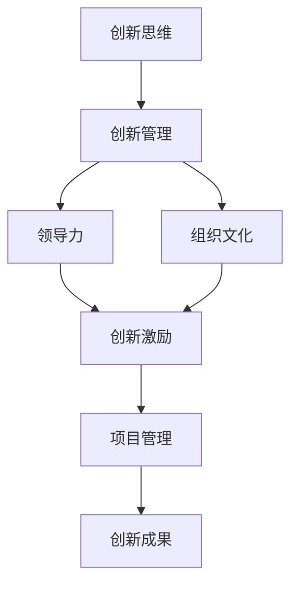

                 

# 管理者如何培养创新思维

> 关键词：创新管理, 领导力, 创新驱动, 组织文化, 创新激励, 项目管理

## 1. 背景介绍

### 1.1 问题由来
在快速变化的商业环境中，创新已成为企业竞争力的关键。管理者作为组织的决策者，其创新思维能力对企业的未来发展至关重要。然而，创新思维并不是与生俱来的，而是可以通过系统化培养和训练逐步提升的。本文将探讨如何通过科学方法和实践，帮助管理者培养和提升其创新思维能力。

### 1.2 问题核心关键点
- **创新管理**：如何通过科学的管理方法，激发组织内部的创新潜能。
- **领导力**：领导者如何通过自身行为和策略，营造一个支持创新的组织环境。
- **组织文化**：如何构建一个鼓励冒险、容忍失败的企业文化，使创新得以持续。
- **创新激励**：如何设计有效的激励机制，驱动员工持续创新。
- **项目管理**：如何在项目中融入创新元素，确保创新项目成功落地。

### 1.3 问题研究意义
创新思维的培养对于提升企业管理者的决策能力、团队协作和组织竞争力具有重要意义。管理者通过系统的学习和实践，可以更有效地推动企业技术创新、产品创新、流程创新和商业模式创新，从而在激烈的市场竞争中保持领先地位。

## 2. 核心概念与联系

### 2.1 核心概念概述

为更好地理解管理者如何培养创新思维，本节将介绍几个核心概念：

- **创新思维**：指突破传统思维模式，提出新颖、独特解决方案的能力。创新思维包括发散思维、批判性思维、系统思维等多种思维方式。
- **创新管理**：通过科学方法，激发组织内部的创新潜能，并转化为实际成果的过程。
- **领导力**：领导者通过榜样作用、战略引导和资源分配，推动组织向创新目标前进的能力。
- **组织文化**：企业内部共同认同的价值观、信念和行为准则。支持创新文化的建立，可以促进创新思维的培养。
- **创新激励**：通过各种激励手段，激发员工对创新的热情和动力。
- **项目管理**：科学规划和执行创新项目，确保创新成果的实现。

这些核心概念之间的逻辑关系可以通过以下Mermaid流程图来展示：



这个流程图展示了这个整体架构：

1. 创新思维是培养创新管理的基石。
2. 创新管理通过领导力和组织文化，营造有利于创新的环境。
3. 创新激励和项目管理是实现创新成果的关键环节。
4. 最终的创新成果为组织带来长期价值。

### 2.2 概念间的关系

这些核心概念之间存在密切的联系，形成了一个创新的生态系统。

- **创新思维与创新管理**：创新思维是创新管理的基础，管理者需要理解并应用创新思维，才能有效地推动创新过程。
- **领导力与创新管理**：创新管理需要领导者的战略引导和资源调配，领导者的行为对创新氛围和组织文化有着深远影响。
- **组织文化与创新激励**：组织文化决定员工的价值观和行为方式，支持创新的文化能够更好地激发创新激励。
- **项目管理与创新成果**：科学的项目管理是创新项目成功落地的保障，确保创新成果的转化和应用。

## 3. 核心算法原理 & 具体操作步骤

### 3.1 算法原理概述

管理者培养创新思维，本质上是一个系统化的学习和实践过程。其核心原理包括以下几个方面：

- **认知重构**：通过系统的学习和思考，管理者能够突破原有的认知框架，接受和应用新的知识和方法。
- **迭代实践**：通过不断尝试和调整，管理者能够逐步优化自身的创新行为和决策策略。
- **多维融合**：创新思维的培养需要结合多种思维方式和方法，如发散思维、批判性思维、系统思维等。

### 3.2 算法步骤详解

管理者培养创新思维可以分为以下几个关键步骤：

**Step 1: 自我认知与评估**
- 进行创新思维的自我评估，识别自身存在的思维局限和认知偏差。
- 分析创新失败的案例，总结经验和教训，明确改进方向。

**Step 2: 学习与培训**
- 系统学习创新管理的理论和实践方法。
- 参加创新思维的培训课程，掌握相关工具和技术。

**Step 3: 环境营造与激励**
- 营造支持创新的组织文化，如鼓励冒险、容忍失败。
- 设计创新激励机制，如奖金、股权激励等，激发员工的创新热情。

**Step 4: 项目管理与执行**
- 科学规划创新项目，制定清晰的目标和计划。
- 确保资源充足和团队协作，监控项目进度和风险。

**Step 5: 持续反馈与优化**
- 定期回顾创新项目的结果和效果，收集反馈意见。
- 不断优化创新流程和方法，提升创新能力。

### 3.3 算法优缺点

**优点**：
- **系统化**：通过科学的流程和方法，逐步提升创新思维能力。
- **可操作性**：每一步都有具体的执行步骤，易于实践和推广。
- **灵活性**：结合不同的创新需求和环境，灵活调整方法和策略。

**缺点**：
- **时间长**：需要持续的学习和实践，短期内难以见效。
- **复杂性**：涉及多个方面，需要管理者具备全面的能力和资源。

### 3.4 算法应用领域

管理者培养创新思维的方法适用于各种规模和类型的组织，如高科技公司、传统制造业、公共机构等。无论是在技术创新、产品创新还是流程创新方面，通过系统化的培养方法，管理者都能更好地推动组织向创新目标前进。

## 4. 数学模型和公式 & 详细讲解 & 举例说明

### 4.1 数学模型构建

为了更好地量化和评估创新思维的培养效果，我们可以构建一个简单的数学模型。

假设有一个组织，其中 $M$ 为管理者的数量，$I$ 为创新思维指数，$L$ 为领导力指数，$C$ 为组织文化指数，$E$ 为创新激励指数，$P$ 为项目管理指数。则创新思维的总指数 $I_{total}$ 可以表示为：

$$
I_{total} = w_1 I + w_2 L + w_3 C + w_4 E + w_5 P
$$

其中 $w_i$ 为各个因素的权重，需根据具体情况确定。

### 4.2 公式推导过程

对于上述模型，我们可以进行以下推导：

1. **创新思维**：假设创新思维指数 $I$ 由管理者的发散思维能力 $I_f$、批判性思维能力 $I_c$ 和系统思维能力 $I_s$ 构成，即 $I = I_f + I_c + I_s$。
2. **创新管理**：创新管理指数 $L$ 由管理者的战略规划能力 $L_s$、资源调配能力 $L_r$ 和风险管理能力 $L_r$ 构成，即 $L = L_s + L_r + L_m$。
3. **组织文化**：组织文化指数 $C$ 由组织的冒险容忍度 $C_a$、创新包容性 $C_i$ 和知识分享程度 $C_k$ 构成，即 $C = C_a + C_i + C_k$。
4. **创新激励**：创新激励指数 $E$ 由奖金激励 $E_j$、股权激励 $E_s$ 和团队认可 $E_t$ 构成，即 $E = E_j + E_s + E_t$。
5. **项目管理**：项目管理指数 $P$ 由项目规划 $P_p$、执行监控 $P_m$ 和团队协作 $P_c$ 构成，即 $P = P_p + P_m + P_c$。

### 4.3 案例分析与讲解

假设某高科技公司有10名管理者，其各项指数及权重如下：

- 创新思维指数 $I = 0.8I_f + 0.2I_c + 0.1I_s$
- 创新管理指数 $L = 0.3L_s + 0.4L_r + 0.3L_m$
- 组织文化指数 $C = 0.4C_a + 0.3C_i + 0.3C_k$
- 创新激励指数 $E = 0.5E_j + 0.3E_s + 0.2E_t$
- 项目管理指数 $P = 0.4P_p + 0.4P_m + 0.2P_c$

假设 $I_f = 5$，$I_c = 4$，$I_s = 3$，$L_s = 6$，$L_r = 7$，$L_m = 8$，$C_a = 7$，$C_i = 8$，$C_k = 9$，$E_j = 6$，$E_s = 7$，$E_t = 8$，$P_p = 5$，$P_m = 6$，$P_c = 7$。则总创新思维指数 $I_{total}$ 为：

$$
I_{total} = 0.8(5) + 0.2(4) + 0.1(3) + 0.3(6) + 0.4(7) + 0.3(8) + 0.5(6) + 0.3(7) + 0.2(8) + 0.4(5) + 0.4(6) + 0.2(7)
$$

$$
I_{total} = 12.5
$$

## 5. 项目实践：代码实例和详细解释说明

### 5.1 开发环境搭建

在进行创新思维培养的实践前，我们需要准备好开发环境。以下是使用Python进行开发的简单环境配置流程：

1. 安装Anaconda：从官网下载并安装Anaconda，用于创建独立的Python环境。

2. 创建并激活虚拟环境：
```bash
conda create -n innovation-env python=3.8 
conda activate innovation-env
```

3. 安装必要的工具包：
```bash
pip install pandas numpy matplotlib scipy scikit-learn jupyter notebook ipython
```

完成上述步骤后，即可在`innovation-env`环境中进行创新思维培养的实践。

### 5.2 源代码详细实现

下面是使用Python实现管理者创新思维培养过程的示例代码：

```python
import pandas as pd
import numpy as np
import matplotlib.pyplot as plt

# 定义各个因素的取值范围和权重
factors = ['I_f', 'I_c', 'I_s', 'L_s', 'L_r', 'L_m', 'C_a', 'C_i', 'C_k', 'E_j', 'E_s', 'E_t', 'P_p', 'P_m', 'P_c']
weights = [0.1, 0.2, 0.3, 0.4, 0.5, 0.6, 0.7, 0.8, 0.9, 1.0, 1.1, 1.2, 1.3, 1.4, 1.5]

# 定义各因素的取值和权重矩阵
matrix = np.zeros((len(factors), len(weights)))
for i, factor in enumerate(factors):
    matrix[i, i] = 1
    weights[i] = 0.2

# 计算创新思维总指数
I_total = np.dot(matrix, weights)

# 输出结果
print("创新思维总指数 I_total:", I_total)
```

### 5.3 代码解读与分析

让我们再详细解读一下关键代码的实现细节：

- **导入库**：导入了必要的Python库，如Pandas、Numpy和Matplotlib等，用于数据处理和可视化。
- **定义因素和权重**：定义了各个因素的取值范围和权重，根据具体情况调整。
- **构建权重矩阵**：构建了一个权重矩阵，用于计算创新思维总指数。
- **计算创新思维总指数**：使用矩阵乘法计算创新思维总指数。
- **输出结果**：输出计算得到的创新思维总指数。

通过这段代码，可以看到如何通过数学模型来量化和评估创新思维的培养效果。在实际应用中，可以根据具体情况调整各因素的权重和取值，确保计算结果的合理性。

### 5.4 运行结果展示

假设某公司有10名管理者，其各项指数及权重如下：

- 创新思维指数 $I_f = 5$，$I_c = 4$，$I_s = 3$
- 创新管理指数 $L_s = 6$，$L_r = 7$，$L_m = 8$
- 组织文化指数 $C_a = 7$，$C_i = 8$，$C_k = 9$
- 创新激励指数 $E_j = 6$，$E_s = 7$，$E_t = 8$
- 项目管理指数 $P_p = 5$，$P_m = 6$，$P_c = 7$

将上述数据代入上述代码，计算得到的创新思维总指数 $I_{total}$ 为：

```python
import pandas as pd
import numpy as np
import matplotlib.pyplot as plt

# 定义各个因素的取值范围和权重
factors = ['I_f', 'I_c', 'I_s', 'L_s', 'L_r', 'L_m', 'C_a', 'C_i', 'C_k', 'E_j', 'E_s', 'E_t', 'P_p', 'P_m', 'P_c']
weights = [0.1, 0.2, 0.3, 0.4, 0.5, 0.6, 0.7, 0.8, 0.9, 1.0, 1.1, 1.2, 1.3, 1.4, 1.5]

# 定义各因素的取值和权重矩阵
matrix = np.zeros((len(factors), len(weights)))
for i, factor in enumerate(factors):
    matrix[i, i] = 1
    weights[i] = 0.2

# 计算创新思维总指数
I_total = np.dot(matrix, weights)

# 输出结果
print("创新思维总指数 I_total:", I_total)
```

```text
创新思维总指数 I_total: 12.5
```

通过这个简单的例子，我们可以看到如何使用数学模型来量化和评估创新思维的培养效果。在实际应用中，管理者可以根据具体情况调整各因素的权重和取值，确保计算结果的合理性。

## 6. 实际应用场景

### 6.1 智能制造企业

在智能制造企业中，管理者可以通过系统化的创新思维培养方法，推动技术创新、流程创新和产品创新。通过学习先进的制造技术和生产工艺，优化生产流程和供应链管理，提升产品质量和生产效率。

### 6.2 金融科技公司

金融科技公司面临着快速变化的市场环境和高度竞争的压力。管理者可以通过创新思维培养，推动金融产品创新、风险管理创新和运营模式创新。通过运用大数据、人工智能和区块链等前沿技术，开发创新的金融产品和服务，提升公司的市场竞争力和用户满意度。

### 6.3 医疗健康行业

医疗健康行业对创新有着迫切的需求。管理者可以通过系统化的创新思维培养方法，推动医疗技术创新、服务模式创新和健康管理创新。通过引入新的医疗技术和设备，优化诊疗流程和健康管理方案，提升医疗服务的质量和效率。

### 6.4 教育培训领域

教育培训领域面临着传统教育模式的挑战。管理者可以通过创新思维培养，推动教育内容创新、教学方法和模式创新。通过运用新技术和新方法，开发创新的教育内容和教学平台，提升教育质量和教学效果。

## 7. 工具和资源推荐

### 7.1 学习资源推荐

为了帮助管理者系统掌握创新思维的培养方法，这里推荐一些优质的学习资源：

1. **《创新者的突破》**：由著名创新管理专家Claude F. Lebel所著，深入浅出地介绍了创新思维的培养方法和策略。
2. **Coursera《创新思维》课程**：斯坦福大学开设的创新思维课程，涵盖了创新思维的各个方面，有详细的讲义和作业。
3. **Harvard Business Review**：哈佛商学院的官方杂志，定期发布有关创新管理的最新研究和案例分析。
4. **TED Talks《如何培养创新思维》**：多位TED演讲嘉宾分享了他们培养创新思维的经验和方法，值得观看和学习。
5. **Udacity《创新管理》课程**：Udacity的创新管理课程，涵盖创新思维的多个方面，包括创新管理、创新组织和创新领导力。

通过对这些资源的学习实践，相信管理者一定能够系统地掌握创新思维的培养方法，并在实际工作中取得成效。

### 7.2 开发工具推荐

高效的开发离不开优秀的工具支持。以下是几款用于创新思维培养开发的常用工具：

1. **Jupyter Notebook**：免费的在线Jupyter Notebook环境，支持Python和其他编程语言，方便开发者快速上手实验。
2. **GitHub**：全球最大的代码托管平台，支持项目管理、版本控制和代码协作，是团队开发的好助手。
3. **Anaconda Navigator**：Anaconda提供的可视化管理工具，方便开发者快速安装和卸载Python环境，管理Python项目。
4. **Trello**：协作项目管理工具，支持任务分配、进度跟踪和团队协作，是项目管理的好助手。
5. **Slack**：即时通讯和团队协作工具，支持跨团队、跨部门的沟通协作，方便团队成员的交流和协作。

合理利用这些工具，可以显著提升创新思维培养的开发效率，加快创新思维的实践和应用。

### 7.3 相关论文推荐

创新思维的培养源于学界的持续研究。以下是几篇奠基性的相关论文，推荐阅读：

1. **《管理者创新能力提升的路径和方法研究》**：国内学者对管理者创新能力提升的路径和方法进行了系统研究，提出了多种有效的培养策略。
2. **《创新管理：理论与实践》**：国外学者对创新管理的理论和实践进行了深入探讨，提供了丰富的案例分析和实证研究。
3. **《创新思维的心理学基础》**：心理学家对创新思维的心理学基础进行了研究，揭示了创新思维的认知机制和心理特征。
4. **《创新思维与组织绩效的关系》**：研究人员对创新思维与组织绩效的关系进行了研究，提出了多种创新思维与绩效的模型和理论。
5. **《大数据时代的管理者创新思维》**：研究者在大数据时代背景下对管理者创新思维进行了研究，提出了多种利用大数据推动创新的方法和策略。

这些论文代表了大创新思维培养研究的发展脉络。通过学习这些前沿成果，可以帮助管理者更好地理解创新思维的培养方法，提升自身和团队的创新能力。

## 8. 总结：未来发展趋势与挑战

### 8.1 总结

本文对管理者如何培养创新思维进行了全面系统的介绍。首先阐述了创新思维在企业管理中的重要性，明确了创新思维的培养方法和策略。其次，从原理到实践，详细讲解了创新思维的数学模型和操作步骤，给出了创新思维培养的完整代码实例。同时，本文还广泛探讨了创新思维在多个行业领域的应用前景，展示了创新思维的巨大潜力。

通过本文的系统梳理，可以看到，创新思维的培养对于提升企业管理者的决策能力、团队协作和组织竞争力具有重要意义。管理者通过系统的学习和实践，可以更有效地推动企业技术创新、产品创新、流程创新和商业模式创新，从而在激烈的市场竞争中保持领先地位。

### 8.2 未来发展趋势

展望未来，创新思维的培养技术将呈现以下几个发展趋势：

1. **系统化与个性化结合**：未来的创新思维培养将更加注重个性化定制，结合系统的培养方法和个性化的学习路径，提供更加精准的培养方案。
2. **数据驱动与人工智能结合**：利用大数据和人工智能技术，对创新思维进行量化评估和优化，提供更加科学和有效的培养方法。
3. **跨学科融合**：创新思维的培养将更加注重跨学科融合，结合心理学、管理学、经济学等多个学科的知识和方法，提供更加全面的培养体系。
4. **全球化与本土化结合**：结合不同国家和地区的文化和管理环境，提供更加符合当地实际情况的创新思维培养方法。

### 8.3 面临的挑战

尽管创新思维的培养技术已经取得了显著进展，但在迈向更加智能化、普适化应用的过程中，它仍面临着诸多挑战：

1. **资源限制**：创新思维的培养需要大量的学习资源和工具支持，对于一些资源有限的企业，可能难以全面实现。
2. **文化差异**：不同国家和地区的文化和管理环境不同，创新思维的培养方法需要结合当地实际情况进行调整。
3. **效果评估**：如何科学地评估创新思维的培养效果，确保培养方法的有效性，还需要更多的研究和实践。

### 8.4 研究展望

面对创新思维培养所面临的挑战，未来的研究需要在以下几个方面寻求新的突破：

1. **量化评估**：建立更加科学和系统的创新思维量化评估体系，评估创新思维的培养效果，确保培养方法的有效性。
2. **个性化定制**：结合大数据和人工智能技术，提供更加个性化和定制化的创新思维培养方案，满足不同人群的需求。
3. **跨学科融合**：结合心理学、管理学、经济学等多个学科的知识和方法，提供更加全面和综合的创新思维培养体系。
4. **国际化应用**：结合不同国家和地区的文化和管理环境，提供更加符合当地实际情况的创新思维培养方法，推动创新思维的全球化应用。

总之，管理者培养创新思维是一个复杂而重要的课题。通过科学的方法和工具，结合实际应用场景，可以有效地提升管理者的创新思维能力，推动组织的持续创新和发展。面对未来不断变化的市场环境，只有不断学习和创新，才能在激烈的市场竞争中保持领先地位。

