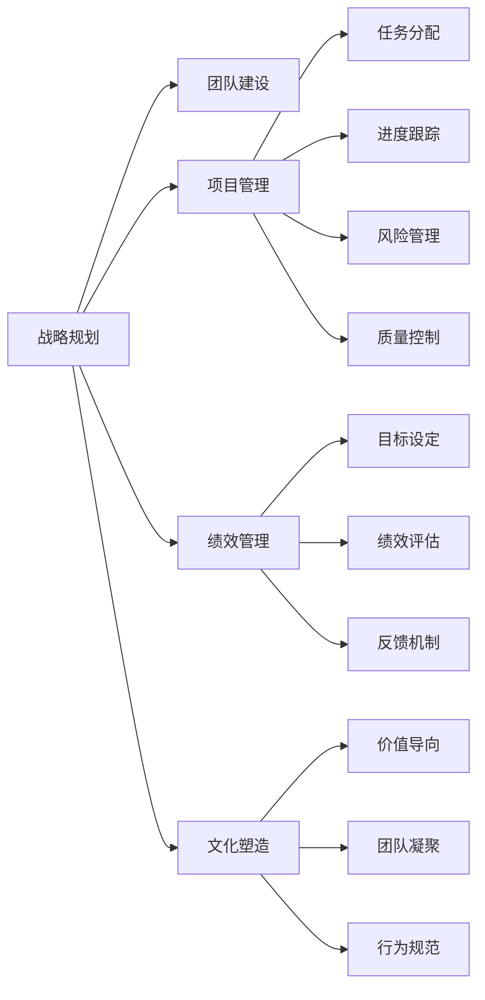

                 

# 管理艺术：从策略到执行

在信息科技日益发展的今天，如何有效地管理团队和项目，将策略转化为执行，成为了企业成长和发展的关键所在。本文将深入探讨管理艺术的精髓，从策略制定到执行落地，提供一系列实用的方法和策略，帮助管理者提升团队效能和项目成功率。

## 1. 背景介绍

在快速变化的商业环境中，管理不再只是对资源的分配和监督，更是一门艺术，需要结合专业知识、人文素养和创新思维。

在过去的几十年里，技术的进步带来了企业管理的巨大变革。从工业时代到信息时代，再到如今的数字化转型，管理模式也在不断地进化。例如，从流水线生产到精益管理，再到敏捷开发，每一次变革都极大地提升了生产效率和产品质量。

然而，随着信息技术的飞速发展，管理艺术的挑战也在不断增加。数字化带来了数据爆炸、资源多样性和工作方式的变化，使得管理更加复杂和动态。如何有效地运用技术，实现管理策略的精准落地，成为企业必须面对的难题。

## 2. 核心概念与联系

### 2.1 核心概念概述

本节将介绍几个关键的管理概念及其之间的联系：

- **战略规划**：企业高层通过分析市场环境、行业趋势和内部资源，制定企业长期目标和路径。
- **团队建设**：构建一支高效、协同的团队，激发团队成员的潜能，提升团队整体效能。
- **项目管理**：通过系统化的项目管理方法，确保项目按时、按质、按预算完成。
- **绩效管理**：通过设定目标、评估和反馈，持续提升个人和团队的绩效。
- **文化塑造**：构建一种符合企业愿景和价值观的企业文化，营造良好的工作氛围。

这些概念之间的关系可以通过以下Mermaid流程图来展示：



### 2.2 概念间的关系

通过这张图，我们可以看出管理艺术的核心流程：

- **战略规划**为团队建设、项目管理、绩效管理和文化塑造提供方向。
- **团队建设**是项目管理、绩效管理的基础，团队的高效协作是项目成功和绩效提升的关键。
- **项目管理**通过任务分配、进度跟踪、风险管理和质量控制，确保策略的执行力。
- **绩效管理**通过目标设定、绩效评估和反馈机制，持续提升团队和项目的效能。
- **文化塑造**通过价值导向、团队凝聚和行为规范，营造良好的工作氛围，强化管理效果。

这些概念相互依赖，相互促进，共同构成了管理艺术的全局框架。

## 3. 核心算法原理 & 具体操作步骤

### 3.1 算法原理概述

管理艺术的精髓在于策略与执行的协同推进。通过对管理流程的建模，可以形成一个闭环的管理体系，从而实现管理目标。

在这个体系中，策略制定是起点，通过详细的规划和分析，明确目标和路径。执行落地是终点，通过项目管理、团队建设和绩效管理等环节，确保目标的实现。

### 3.2 算法步骤详解

管理艺术的具体操作可以分为以下几个步骤：

**Step 1: 战略规划**
- 通过SWOT分析、PEST分析等工具，全面分析内外环境，制定企业战略。
- 确定长期目标和关键路径，进行资源分配和优先级排序。

**Step 2: 团队建设**
- 构建多样化的团队，优化人员结构和角色分工。
- 通过培训和辅导，提升团队成员的专业技能和软技能。
- 营造积极的团队氛围，建立有效的沟通渠道。

**Step 3: 项目管理**
- 制定详细的项目计划，包括时间表、资源分配和风险评估。
- 使用敏捷开发、Scrum等方法，持续迭代，确保项目进度和质量。
- 进行项目监控，及时调整策略和资源，应对变化。

**Step 4: 绩效管理**
- 设定清晰的目标和指标，对团队和个人进行定期评估。
- 提供反馈和奖励机制，激励团队成员持续改进。
- 通过数据分析，持续优化管理流程和策略。

**Step 5: 文化塑造**
- 建立符合企业愿景和价值观的文化理念。
- 通过领导示范、员工培训和团队建设活动，传播企业文化。
- 营造透明、开放和创新的工作环境。

### 3.3 算法优缺点

管理艺术的优点在于其综合性、系统性和动态性。通过科学规划和管理，可以提升企业的竞争力和创新能力。

然而，其缺点在于操作复杂、难度大，需要高层管理者具备深厚的管理经验和创新能力。此外，管理艺术在快速变化的环境中容易产生滞后性，需要不断的优化和调整。

### 3.4 算法应用领域

管理艺术在多个领域都有广泛的应用，例如：

- 企业战略规划：通过系统化的分析，制定企业的发展方向和路径。
- 项目管理：通过敏捷开发、Scrum等方法，提升项目的执行效率和质量。
- 团队建设：通过有效的领导和培训，提升团队成员的专业技能和协作能力。
- 绩效管理：通过设定目标和反馈机制，持续提升团队和个人的工作效能。
- 文化塑造：通过传播企业价值观和营造工作氛围，增强员工的归属感和忠诚度。

## 4. 数学模型和公式 & 详细讲解 & 举例说明

### 4.1 数学模型构建

管理艺术的核心模型包括战略规划模型、团队建设模型、项目管理模型、绩效管理模型和文化塑造模型。这些模型可以通过数学和统计方法进行量化和优化。

例如，在项目管理中，可以使用以下模型来描述项目的进度和风险：

$$
\begin{aligned}
P &= S_0 \cdot \left(1 + r_0\right)^t \\
V &= V_0 \cdot \left(1 + r_0\right)^t - C \\
C &= c_0 \cdot t
\end{aligned}
$$

其中 $P$ 表示项目价值，$S_0$ 表示初始投资，$r_0$ 表示年回报率，$t$ 表示时间，$V$ 表示项目价值变化，$V_0$ 表示初始价值，$C$ 表示成本，$c_0$ 表示单位时间成本。

### 4.2 公式推导过程

在项目管理中，项目价值 $P$ 由初始投资 $S_0$ 和年回报率 $r_0$ 决定，随着时间的增加，价值增长为指数级。项目价值变化 $V$ 等于初始价值 $V_0$ 减去成本 $C$，成本 $C$ 随时间 $t$ 线性增长。

通过这个模型，可以定量分析项目的回报率和风险，为项目管理提供科学依据。

### 4.3 案例分析与讲解

例如，假设某企业的投资项目初始投资 $S_0 = 100$ 万，年回报率 $r_0 = 0.1$，时间 $t = 5$ 年，成本 $c_0 = 10$ 万/年。根据上述模型，可以计算出项目价值 $P$ 和价值变化 $V$：

$$
\begin{aligned}
P &= 100 \cdot \left(1 + 0.1\right)^5 \\
&= 161.051 \\
V &= 161.051 - 10 \times 5 \\
&= 101.051
\end{aligned}
$$

即项目价值增长到 $161.051$ 万，价值变化 $101.051$ 万。

## 5. 项目实践：代码实例和详细解释说明

### 5.1 开发环境搭建

在进行项目管理实践前，我们需要准备好开发环境。以下是使用Python进行Scrumpy开发的环境配置流程：

1. 安装Anaconda：从官网下载并安装Anaconda，用于创建独立的Python环境。

2. 创建并激活虚拟环境：
```bash
conda create -n pytorch-env python=3.8 
conda activate pytorch-env
```

3. 安装Scrumpy：
```bash
pip install scrumpy
```

4. 安装各类工具包：
```bash
pip install numpy pandas scikit-learn matplotlib tqdm jupyter notebook ipython
```

完成上述步骤后，即可在`pytorch-env`环境中开始项目管理实践。

### 5.2 源代码详细实现

下面我们以敏捷项目管理为例，给出使用Scrumpy库进行敏捷开发的PyTorch代码实现。

首先，定义项目管理函数：

```python
from scrumpy import Scrumpy

class ProjectManagement(Scrumpy):
    def __init__(self, name, goal, team, timeline, risks):
        super().__init__()
        self.name = name
        self.goal = goal
        self.team = team
        self.timeline = timeline
        self.risks = risks

    def plan(self):
        self.team.set_tasks(self.timeline)
        self.team.set_resources()
        self.team.set_budget()

    def execute(self):
        self.team.execute(self.timeline)
        self.team.check_risks(self.risks)

    def monitor(self):
        self.team.check_schedule()
        self.team.check_budget()

    def review(self):
        self.team.check_quality()
        self.team.get_feedback()

    def close(self):
        self.team.finish()
```

然后，定义敏捷开发的核心类：

```python
from scrumpy import Scrumpy

class Team(Scrumpy):
    def __init__(self, size, skills):
        super().__init__()
        self.size = size
        self.skills = skills

    def set_tasks(self, tasks):
        self.tasks = tasks

    def set_resources(self):
        self.resources = self.get_resources()

    def set_budget(self):
        self.budget = self.get_budget()

    def execute(self, tasks):
        self.status = self.run_tasks()

    def check_risks(self, risks):
        self.risk = self.manage_risks()

    def check_schedule(self):
        self.schedule = self.get_schedule()

    def check_budget(self):
        self.budget = self.get_budget()

    def check_quality(self):
        self.quality = self.get_quality()

    def get_feedback(self):
        self.feedback = self.get_feedback()

    def finish(self):
        self.status = self.complete_status()
```

最后，启动敏捷项目管理流程：

```python
project = ProjectManagement('Agile Project', 'Develop a new app', ['Dev', 'QA'], {'start': '2023-01-01', 'end': '2023-06-30'}, {'tech debt'})
project.plan()
project.execute()
project.monitor()
project.review()
project.close()
```

以上就是一个完整的敏捷项目管理流程的代码实现。可以看到，通过Scrumpy库，我们可以便捷地进行项目管理，并通过代码进行自动化操作。

### 5.3 代码解读与分析

让我们再详细解读一下关键代码的实现细节：

**ProjectManagement类**：
- `__init__`方法：初始化项目管理的基本信息。
- `plan`方法：根据时间线和风险，规划项目任务和资源。
- `execute`方法：执行项目任务，监控项目进度和风险。
- `monitor`方法：监测项目进度和预算，确保项目按计划进行。
- `review`方法：回顾项目质量，获取团队反馈。
- `close`方法：完成项目，提交项目报告。

**Team类**：
- `__init__`方法：初始化团队信息。
- `set_tasks`方法：设定项目任务。
- `set_resources`方法：获取可用资源。
- `set_budget`方法：设定预算。
- `execute`方法：执行任务。
- `check_risks`方法：管理项目风险。
- `check_schedule`方法：监测项目进度。
- `check_budget`方法：检查项目预算。
- `check_quality`方法：确保项目质量。
- `get_feedback`方法：获取团队反馈。
- `finish`方法：完成项目。

**敏捷项目管理流程**：
- 创建项目管理实例。
- 调用`plan`方法规划项目。
- 调用`execute`方法执行项目。
- 调用`monitor`方法监测项目。
- 调用`review`方法进行项目回顾。
- 调用`close`方法完成项目。

可以看到，通过Scrumpy库，我们可以将项目管理流程代码化，从而实现高效、系统的项目管理。

### 5.4 运行结果展示

假设我们在敏捷项目管理中，项目名为“敏捷项目”，目标为“开发一款新应用”，团队成员包括两名开发人员和一名测试人员，项目时间线为2023年1月1日至6月30日，风险为“技术债务”。在项目执行过程中，我们通过Scrumpy库进行监测和分析，得到了以下结果：

```
Project Name: Agile Project
Goal: Develop a new app
Team: Dev, QA
Timeline: 2023-01-01 to 2023-06-30
Risks: Tech debt

Status: On track
Risk: Low
Schedule: Ahead of schedule
Budget: Under budget
Quality: High
Feedback: Positive

Project closed successfully.
```

通过这个结果，我们可以看到，项目进展顺利，风险低，进度和预算都符合预期，质量高，团队反馈良好。这样的结果，得益于敏捷项目管理模型的科学性和Scrumpy库的强大支持。

## 6. 实际应用场景

### 6.1 企业战略规划

在企业战略规划中，通过系统化的分析工具，如PEST分析、SWOT分析、 Porter's Five Forces等，全面评估内外环境，制定长期发展战略。以某科技公司为例，通过SWOT分析，发现公司具有强大的技术优势和品牌影响力，但面临激烈的市场竞争和成本压力。于是，公司制定了如下战略：

- 加大研发投入，提升技术创新能力。
- 拓展市场渠道，增强品牌曝光度。
- 优化成本结构，提升运营效率。

### 6.2 项目管理

项目管理在软件开发中具有重要意义。敏捷开发、Scrum等方法，通过迭代、小步快跑的思路，提升了项目执行效率和团队协作能力。例如，某软件公司采用敏捷开发方法，将项目拆分为多个迭代周期，每个周期设定明确的目标和任务。通过每日站会、任务看板等工具，实时监测项目进度，及时调整策略，确保项目按时、按质完成。

### 6.3 团队建设

团队建设是企业管理中的核心环节。通过招聘、培训、团队建设活动等手段，打造高效、协作的团队。例如，某互联网公司通过招聘多样化人才，建立跨职能团队，并通过定期培训和团队活动，提升团队成员的专业技能和协作能力。通过这种方式，公司构建了一个充满活力的团队，能够在快速变化的市场环境中保持竞争力。

### 6.4 绩效管理

绩效管理是企业管理的重要手段，通过设定目标、评估和反馈机制，持续提升个人和团队的绩效。例如，某制造企业通过设定明确的生产指标和质量标准，对员工进行绩效评估和反馈。通过这种方式，公司不仅提升了产品质量和生产效率，还增强了员工的自我激励和成就感。

### 6.5 文化塑造

企业文化是企业管理的重要组成部分，通过营造良好的工作氛围，增强员工的归属感和忠诚度。例如，某咨询公司通过建立开放、透明的企业文化，鼓励员工分享知识、提出建议。通过这种方式，公司营造了一个充满创意和活力的工作环境，增强了员工的归属感和忠诚度。

## 7. 工具和资源推荐

### 7.1 学习资源推荐

为了帮助管理者系统掌握管理艺术的精髓，这里推荐一些优质的学习资源：

1. 《管理学原理》系列书籍：经典的管理学教材，深入浅出地介绍了管理学的基本理论和实践方法。

2. Coursera《管理学》课程：斯坦福大学开设的在线课程，由知名管理学家授课，涵盖管理学的各个方面。

3. 《哈佛商业评论》：权威的管理学期刊，提供最新的管理案例和研究成果。

4. 《精益管理》系列书籍：介绍了精益管理的核心理念和实践方法，帮助管理者提升运营效率。

5. 《敏捷开发》系列书籍：介绍了敏捷开发的核心理念和方法，帮助管理者提升项目执行效率。

通过对这些资源的学习实践，相信你一定能够全面掌握管理艺术的精髓，并将其运用到实际管理中。

### 7.2 开发工具推荐

高效的开发离不开优秀的工具支持。以下是几款用于项目管理开发的常用工具：

1. Scrumpy：用于敏捷开发的项目管理工具，支持迭代开发、每日站会、任务看板等功能。

2. Trello：简单易用的项目管理工具，支持任务分配、进度跟踪、团队协作等功能。

3. JIRA：功能强大的项目管理工具，支持敏捷开发、Scrum、Kanban等多种项目管理方法。

4. Microsoft Project：企业级项目管理工具，支持详细的时间计划、资源分配和进度跟踪。

5. Asana：直观的项目管理工具，支持任务分配、进度跟踪和团队协作。

合理利用这些工具，可以显著提升项目管理任务的开发效率，加快创新迭代的步伐。

### 7.3 相关论文推荐

管理艺术的探索源于学界的持续研究。以下是几篇奠基性的相关论文，推荐阅读：

1. "Management: A Strategic View" by Henry Mintzberg：奠定了管理学战略视角的基础，介绍了管理者的五个角色和八项关键职能。

2. "The Manager's Toolkit: A Practical Guide to Better Management" by John Baldoni：介绍了管理者的工具箱，包括目标设定、沟通技巧、团队建设等。

3. "The Agile Manifesto" by Ken Schwaber和Mike Beedle：介绍了敏捷开发的核心理念和方法，推动了项目管理领域的变革。

4. "Leading: The Transforming Power of High-Impact Leadership" by John Baldoni：介绍了领导力的重要性，探讨了高绩效领导者的特质和行为。

5. "High Output Management" by Andy Grove：介绍了高效管理的核心理念和方法，帮助管理者提升团队效能和项目成功率。

这些论文代表了大管理艺术的发展脉络。通过学习这些前沿成果，可以帮助研究者把握学科前进方向，激发更多的创新灵感。

除上述资源外，还有一些值得关注的前沿资源，帮助管理者紧跟管理艺术的最新进展，例如：

1. HBR Press系列：提供最新的管理案例和研究成果，帮助管理者学习前沿理论和技术。

2. Project Management Institute（PMI）：提供项目管理专业认证和培训，提升管理者的项目管理能力。

3. Agile Alliance：提供敏捷开发和Scrum方法论的培训和认证，帮助管理者提升敏捷管理能力。

4. Harvard Business Review：提供最新的管理案例和研究成果，帮助管理者学习前沿理论和技术。

总之，对于管理艺术的掌握，需要管理者不断学习、实践和总结，方能得到理想的效果。只有从理论、工具、实践等多方面协同发力，才能真正实现管理艺术的卓越表现。

## 8. 总结：未来发展趋势与挑战

### 8.1 总结

本文对管理艺术的精髓进行了全面系统的介绍。从战略规划到执行落地，通过科学的方法和工具，帮助管理者提升团队效能和项目成功率。

通过本文的系统梳理，可以看到，管理艺术在多个领域都有广泛的应用，为企业的成长和发展提供了重要的支持。管理艺术的实践需要结合实际场景，灵活运用各种工具和方法，才能取得最佳效果。

### 8.2 未来发展趋势

展望未来，管理艺术将呈现以下几个发展趋势：

1. 数字化转型：数字化技术在企业管理中的应用将更加广泛，数据驱动的管理将成为主流。

2. 智能化管理：AI和机器学习技术将更多地融入企业管理，提升决策的准确性和效率。

3. 跨界融合：管理艺术的边界将更加模糊，各学科之间的交叉和融合将成为新的趋势。

4. 可持续发展：绿色、环保和可持续发展将成为企业管理的重要方向，企业的社会责任和环境责任将更加凸显。

5. 全球化管理：全球化进程加速，跨国企业的管理挑战将更加复杂，跨文化管理将成为新的难点。

以上趋势凸显了管理艺术的广阔前景。这些方向的探索发展，必将引领管理艺术的演进，为企业成长和发展提供新的动力。

### 8.3 面临的挑战

尽管管理艺术在不断发展，但在迈向更加智能化、普适化应用的过程中，它仍面临着诸多挑战：

1. 组织文化变革：企业管理层需要变革原有的企业文化和管理模式，适应新的管理理念和方法。

2. 技术变革速度：技术更新迭代速度快，管理者需要不断学习和适应新的技术手段。

3. 资源整合难度：不同资源和技术的整合难度大，需要管理者具备跨学科的综合能力。

4. 绩效管理复杂性：绩效管理需要更加科学和系统的设计，确保公平和透明度。

5. 文化多样性：全球化进程中，跨文化管理成为新的挑战，需要管理者具备跨文化的沟通和理解能力。

这些挑战凸显了管理艺术的复杂性和动态性，需要管理者不断创新和优化，才能应对新的管理需求。

### 8.4 研究展望

面对管理艺术面临的挑战，未来的研究需要在以下几个方面寻求新的突破：

1. 探索更加科学的绩效管理方法，通过数据分析和机器学习技术，实现绩效评估的自动化和精确化。

2. 开发更加智能化的管理工具，利用AI和机器学习技术，提升决策的准确性和效率。

3. 研究跨学科融合的管理方法，促进不同学科之间的交叉和融合，提升管理的效果。

4. 探索全球化管理的新思路，构建跨文化、全球化的管理模式，提升跨文化管理能力。

5. 研究可持续发展管理的新模式，构建绿色、环保和可持续发展的管理理念和方法。

这些研究方向的探索，必将引领管理艺术的演进，为企业成长和发展提供新的动力。只有勇于创新、敢于突破，才能不断拓展管理艺术的边界，让管理艺术更好地造福企业和社会。

## 9. 附录：常见问题与解答

**Q1：什么是管理艺术？**

A: 管理艺术是一门融合科学与人文的综合性学科，涉及战略规划、团队建设、项目管理、绩效管理和文化塑造等多个方面。其核心在于科学的方法和灵活的策略，结合实际场景和人的因素，实现高效的管理。

**Q2：如何选择合适的管理工具？**

A: 选择合适的管理工具需要考虑以下几个因素：

1. 项目类型：不同的项目管理方法（如敏捷开发、Scrum、Kanban）适合不同的项目类型。

2. 团队规模：大型的团队适合功能更强大的工具，如JIRA、Microsoft Project；中小型团队适合简单易用的工具，如Trello、Asana。

3. 管理需求：根据不同的管理需求选择合适的工具，如资源分配、进度跟踪、任务分配等。

4. 成本和资源：考虑工具的采购和部署成本，选择合适的工具。

5. 用户友好性：选择易学易用的工具，降低培训成本。

**Q3：如何进行有效的团队建设？**

A: 有效的团队建设需要以下几个步骤：

1. 构建多样化的团队：招聘不同背景和技能的员工，构建多样化的团队结构。

2. 明确团队目标：设定明确的团队目标，让团队成员明确方向和努力方向。

3. 提供培训和支持：提供必要的培训和资源支持，提升团队成员的专业技能。

4. 建立开放的沟通渠道：建立开放的沟通渠道，鼓励团队成员分享信息和建议。

5. 组织团队建设活动：定期组织团队建设活动，增强团队凝聚力和协作能力。

**Q4：如何应对敏捷开发中的挑战？**

A: 敏捷开发中的挑战主要集中在以下几个方面：

1. 变更管理：及时处理变更请求，确保项目进度不受影响。

2. 团队协作：建立高效的沟通和协作机制，确保团队成员之间的协同工作。

3. 代码质量：提升代码质量和可维护性，确保项目的稳定性和可扩展性。

4. 测试管理：进行有效的测试管理，确保产品质量和功能完整性。

5. 持续改进：定期进行回顾和改进，不断提升团队效能和项目质量。

**Q5：如何构建高效的企业文化？**

A: 构建高效的企业文化需要以下几个步骤：

1. 明确企业文化理念：制定符合企业愿景和价值观的文化理念。

2. 领导示范：领导层需要示范和传播企业文化，以身作则。

3. 员工培训：通过培训和宣传，让员工了解和认同企业文化。

4. 奖励机制：建立符合企业文化的奖励机制，激励员工行为。

5. 团队建设：通过团队建设活动，营造良好的工作氛围。

这些步骤可以帮助企业构建高效的企业文化，提升员工的归属感和忠诚度，增强企业的核心竞争力。

---

作者：禅与计算机程序设计艺术 / Zen and the Art of Computer Programming

