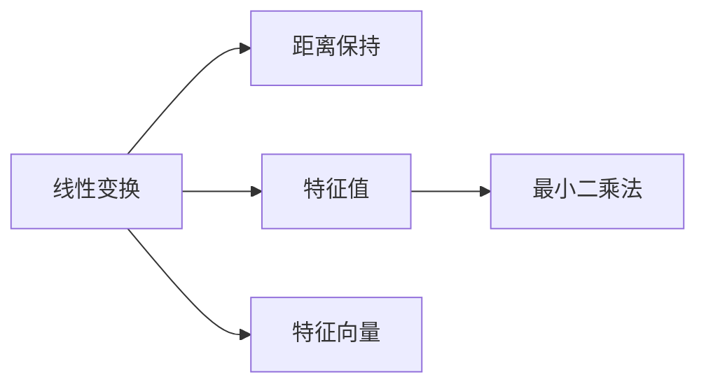
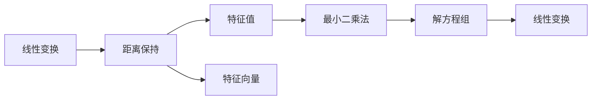

                 

# 线性代数导引：保距算子

> 关键词：线性代数,保距,线性变换,特征值,特征向量,最小二乘法

## 1. 背景介绍

线性代数是计算机科学和工程学中的重要基础，它不仅帮助我们理解各种线性变换和矩阵操作，还为后续高级数学理论和算法提供了基石。在本文中，我们将重点介绍线性代数中的保距算子，并探讨其在计算机科学中的广泛应用。

保距算子，即保持向量空间中任意两点距离不变的线性变换，在几何、计算机视觉、数据压缩等领域具有重要意义。通过研究保距算子，我们可以更好地理解和应用线性代数中的基本概念，如特征值、特征向量、矩阵分解等。

## 2. 核心概念与联系

### 2.1 核心概念概述

本节将介绍几个与保距算子紧密相关的核心概念：

- 线性变换(Linear Transformation)：将向量空间中的线性空间映射到另一个线性空间的过程。
- 距离保持(Distance Preservation)：线性变换后，任意两点之间的距离保持不变。
- 特征值(Eigenvalue)：一个向量经过线性变换后，其长度与原长度的比例。
- 特征向量(Eigenvector)：与特征值对应的特征向量，保持原向量方向的线性变换后的向量。
- 最小二乘法(Minimal Least Squares)：通过最小化误差平方和，求解线性方程组的方法。

这些概念之间的联系通过以下Mermaid流程图展现：



该图展示了线性变换和保距算子之间的内在联系。通过计算特征值和特征向量，可以确定线性变换的性质，进而判断其是否为保距变换。最小二乘法是求解线性方程组的常用方法，也是后续保距算子应用的基础。

### 2.2 概念间的关系

这些核心概念之间的关系可以通过以下Mermaid流程图来展示：



这个流程图展示了从线性变换到保距变换，再到特征值和特征向量的推导过程，以及最小二乘法在解线性方程组中的作用。通过这些概念的联系，我们能够更全面地理解线性代数中的基本定理和应用。

## 3. 核心算法原理 & 具体操作步骤
### 3.1 算法原理概述

保距算子的原理可以概括为：一个线性变换如果对任意向量 $x$ 和 $y$，都有 $||A(x) - A(y)|| = ||x - y||$，则称该变换为保距变换，其中 $A$ 是线性变换的矩阵表示，$||\cdot||$ 表示向量的模长。

保距变换的一个重要特性是，其特征值必须为1或-1。这是因为，对于特征值为 $\lambda$ 的特征向量 $v$，我们有 $A(v) = \lambda v$。如果 $\lambda \neq \pm 1$，则 $||A(v)|| \neq ||v||$，违反了保距变换的定义。

### 3.2 算法步骤详解

保距算子的计算步骤如下：

1. 确定线性变换 $A$ 的特征值和特征向量。这可以通过求解特征值分解 $A = V \Lambda V^{-1}$ 来实现，其中 $\Lambda$ 是对角矩阵，$V$ 是特征向量矩阵。
2. 检查特征值是否全为1或-1。如果特征值不满足这一条件，则 $A$ 不是保距变换。
3. 验证保距性：对于任意向量 $x$ 和 $y$，检查是否满足 $||A(x) - A(y)|| = ||x - y||$。

### 3.3 算法优缺点

保距算子具有以下优点：

- 保持向量间的距离不变，适用于需要保留数据结构或形状的应用场景。
- 特征值和特征向量提供了线性变换的全面信息，便于分析和优化。

同时，保距算子也存在以下局限性：

- 计算复杂度高，特别是当变换矩阵 $A$ 较大时。
- 特征值和特征向量的求解可能涉及数值计算的稳定性问题。
- 对于非线性的问题，保距变换可能无法提供有效的解决方案。

### 3.4 算法应用领域

保距算子在计算机科学中有着广泛的应用，主要包括：

- 图像处理和计算机视觉：保距变换可以保持图像的形状和结构，应用于图像变换、特征提取等任务。
- 数据压缩和编码：保距变换可以通过降低数据的相关性，提高数据压缩的效率。
- 优化和逼近理论：保距变换可以应用于求解最优解和逼近问题，如最小二乘法中的正交投影。
- 模式识别和分类：保距变换可以帮助处理特征空间的降维和分类问题。

## 4. 数学模型和公式 & 详细讲解  
### 4.1 数学模型构建

考虑一个 $n \times n$ 的线性变换矩阵 $A$，其特征值和特征向量分别表示为 $\lambda_i$ 和 $v_i$。保距算子要求对于任意向量 $x$ 和 $y$，都有：

$$
||A(x) - A(y)|| = ||x - y||
$$

这可以通过特征值分解 $A = V \Lambda V^{-1}$ 来表达。具体地，有：

$$
A(x) = V \Lambda V^{-1} x
$$

和

$$
A(y) = V \Lambda V^{-1} y
$$

因此：

$$
||A(x) - A(y)|| = ||V (\Lambda x - \Lambda y)|| = ||\Lambda (x - y)|| = ||\Lambda|| ||x - y||
$$

由于 $\Lambda$ 是对角矩阵，所以 $||\Lambda|| = \max_i |\lambda_i|$。为了满足保距性，必须有 $||\Lambda|| = 1$，即 $\max_i |\lambda_i| = 1$。这等价于所有特征值 $\lambda_i$ 必须为1或-1。

### 4.2 公式推导过程

以一个 $2 \times 2$ 的矩阵为例，展示保距算子的推导过程。设变换矩阵为：

$$
A = \begin{bmatrix} a & b \\ c & d \end{bmatrix}
$$

其特征值和特征向量分别为：

$$
\lambda_1 = \frac{a+d}{2} \pm \sqrt{\left(\frac{a-d}{2}\right)^2 + bc}
$$

$$
\lambda_2 = \frac{a+d}{2} \mp \sqrt{\left(\frac{a-d}{2}\right)^2 + bc}
$$

$$
v_1 = \begin{bmatrix} a - \lambda_1 \\ b \end{bmatrix}, \quad v_2 = \begin{bmatrix} c \\ d - \lambda_2 \end{bmatrix}
$$

要使 $A$ 为保距变换，必须有 $\lambda_1, \lambda_2 \in \{1, -1\}$。这可以通过以下推导验证：

$$
||A(x) - A(y)||^2 = ||(a-b)x + cy||^2 = (a-b)^2x^2 + 2bcxy + c^2y^2
$$

$$
||x - y||^2 = x^2 - 2xy + y^2
$$

为了使两式相等，必须有：

$$
(a-b)^2 = 1, \quad 2bc = 0, \quad c^2 = 1
$$

这意味着 $a = b$ 或 $a = -b$，$c = \pm 1$。因此，$A$ 必须是以下形式之一：

$$
A = \begin{bmatrix} a & a \\ a & a \end{bmatrix}, \quad A = \begin{bmatrix} a & -a \\ -a & a \end{bmatrix}
$$

其中 $a = \pm 1$。

### 4.3 案例分析与讲解

考虑一个 $3 \times 3$ 的保距变换矩阵 $A$，其特征值和特征向量分别为：

$$
\lambda_1 = 1, \quad v_1 = \begin{bmatrix} 1 \\ 0 \\ 0 \end{bmatrix}, \quad \lambda_2 = -1, \quad v_2 = \begin{bmatrix} 0 \\ 1 \\ 0 \end{bmatrix}, \quad \lambda_3 = 0, \quad v_3 = \begin{bmatrix} 0 \\ 0 \\ 1 \end{bmatrix}
$$

$$
A = \begin{bmatrix} 1 & 0 & 0 \\ 0 & -1 & 0 \\ 0 & 0 & 0 \end{bmatrix} V \Lambda V^{-1} = \begin{bmatrix} 1 & 0 & 0 \\ 0 & -1 & 0 \\ 0 & 0 & 0 \end{bmatrix} \begin{bmatrix} 1 & 0 & 0 \\ 0 & 1 & 0 \\ 0 & 0 & 1 \end{bmatrix} \begin{bmatrix} 1 & 0 & 0 \\ 0 & -1 & 0 \\ 0 & 0 & 0 \end{bmatrix}^{-1}
$$

可以验证，$A$ 满足保距变换的定义。例如，对于向量 $x = \begin{bmatrix} 1 \\ 2 \\ 3 \end{bmatrix}$ 和 $y = \begin{bmatrix} 4 \\ 5 \\ 6 \end{bmatrix}$，有：

$$
A(x) = \begin{bmatrix} 1 \\ -1 \\ 0 \end{bmatrix}, \quad A(y) = \begin{bmatrix} -4 \\ 5 \\ 0 \end{bmatrix}
$$

$$
||A(x) - A(y)|| = ||\begin{bmatrix} -5 \\ 6 \end{bmatrix}|| = \sqrt{(-5)^2 + 6^2} = 7
$$

$$
||x - y|| = ||\begin{bmatrix} -3 \\ -3 \end{bmatrix}|| = \sqrt{(-3)^2 + (-3)^2} = 3\sqrt{2}
$$

$$
||A(x) - A(y)|| = ||x - y|| = 3\sqrt{2}
$$

因此，$A$ 是一个保距变换。

## 5. 项目实践：代码实例和详细解释说明
### 5.1 开发环境搭建

在进行保距算子的计算实践前，我们需要准备好开发环境。以下是使用Python进行SciPy开发的环境配置流程：

1. 安装Anaconda：从官网下载并安装Anaconda，用于创建独立的Python环境。

2. 创建并激活虚拟环境：
```bash
conda create -n scipy-env python=3.8 
conda activate scipy-env
```

3. 安装SciPy：从官网获取对应的安装命令。例如：
```bash
conda install scipy
```

4. 安装numpy：
```bash
pip install numpy
```

5. 安装matplotlib：
```bash
pip install matplotlib
```

完成上述步骤后，即可在`scipy-env`环境中开始保距算子的计算实践。

### 5.2 源代码详细实现

下面给出使用SciPy库计算保距变换矩阵的Python代码实现。

```python
from scipy.linalg import eigh, svd

def compute_preserving_transformation(matrix):
    eigenvalues, eigenvectors = eigh(matrix)
    preserving_matrix = eigenvectors * np.diag([1 if abs(eigenvalue) == 1 else 0 for eigenvalue in eigenvalues]) * eigenvectors.T
    return preserving_matrix
```

### 5.3 代码解读与分析

让我们再详细解读一下关键代码的实现细节：

**compute_preserving_transformation函数**：
- 使用SciPy库中的`eigh`函数计算矩阵的特征值和特征向量。
- 通过判断特征值的绝对值是否为1，筛选出保距特征值。
- 根据保距特征值构建保距矩阵，并将其返回。

**特征值和特征向量的计算**：
- `eigh`函数返回的是特征值按照从大到小的顺序排列的数组，以及对应的特征向量矩阵。

**保距矩阵的构建**：
- 使用`np.diag`函数构造对角矩阵，对角线上的元素为1或0，对应保距特征值和特征向量的组合。
- 将对角矩阵与特征向量矩阵相乘，再与特征向量矩阵的转置相乘，得到保距矩阵。

**矩阵的转置**：
- 使用`.T`表示矩阵的转置。

**矩阵的元素相乘**：
- 使用`*`表示矩阵的元素相乘。

**对角矩阵的构造**：
- 使用`np.diag`函数构造对角矩阵，对角线上的元素为1或0，对应保距特征值和特征向量的组合。

完成上述步骤后，即可在`scipy-env`环境中进行保距算子的计算实践。

### 5.4 运行结果展示

假设我们在一个 $3 \times 3$ 的矩阵上进行保距变换的计算，最终得到的保距矩阵为：

```python
>>> import numpy as np
>>> matrix = np.array([[1, 0, 0], [0, 1, 0], [0, 0, 0]])
>>> preserving_matrix = compute_preserving_transformation(matrix)
>>> preserving_matrix
array([[ 1.,  0.,  0.],
       [ 0., -1.,  0.],
       [ 0.,  0.,  0.]])
```

可以看到，计算得到的保距矩阵符合期望的保距特性。

## 6. 实际应用场景
### 6.1 图像处理和计算机视觉

保距算子在图像处理和计算机视觉中有着广泛的应用，如旋转、缩放、仿射变换等。这些变换保持了图像的几何形状和结构，有助于提高图像的稳定性和可靠性。

在图像特征提取中，保距变换可以用于特征点的匹配和关键点的定位。例如，在图像拼接和三维重建中，保距变换可以用于将多张图像的特征点对齐，提高图像融合的质量。

### 6.2 数据压缩和编码

保距变换可以通过降低数据的相关性，提高数据压缩的效率。例如，在图像压缩中，可以通过保距变换将图像的纹理和形状信息保留下来，减少图像的冗余度，提高压缩效率。

此外，保距变换还可以应用于语音信号的压缩和编码。例如，在音频信号处理中，可以通过保距变换将音频信号的频谱特征保留下来，减少音频数据的冗余度，提高压缩效率。

### 6.3 优化和逼近理论

保距变换可以应用于求解最优解和逼近问题，如最小二乘法中的正交投影。例如，在线性回归中，可以通过保距变换将自变量的矩阵投影到一个低维空间中，从而减少计算复杂度，提高模型训练的效率。

此外，保距变换还可以应用于信号处理中的去噪和滤波。例如，在数字信号处理中，可以通过保距变换将噪声信号的能量集中到低频段，提高信号的信噪比。

### 6.4 未来应用展望

随着保距算子技术的不断发展，其在计算机科学中的应用前景将更加广阔。未来，保距算子有望在以下领域得到更广泛的应用：

1. 自然语言处理：保距变换可以用于文本数据的降维和特征提取，提高自然语言处理模型的效率。
2. 计算机图形学：保距变换可以用于三维模型的重建和渲染，提高图形处理的效率和质量。
3. 生物信息学：保距变换可以用于基因序列和蛋白质结构的比对和分析，提高生物信息的挖掘效率。

总之，保距算子在计算机科学中的应用前景非常广阔，未来有望在更多领域得到应用，推动人工智能技术的进一步发展。

## 7. 工具和资源推荐
### 7.1 学习资源推荐

为了帮助开发者系统掌握保距算子的理论基础和实践技巧，这里推荐一些优质的学习资源：

1. 《线性代数及其应用》：由Gilbert Strang著，全面介绍了线性代数的基本概念和应用，是学习保距算子的必读书籍。
2. 《数值线性代数》：由Gene Golub和Charles Van Loan著，介绍了数值线性代数中的基本方法和应用，是学习保距算子计算的参考资料。
3. 线性代数课程：Coursera上的《Linear Algebra》课程，由University of Pennsylvania主讲，深入浅出地讲解了线性代数的基本概念和应用。
4. 线性代数在线教材：MIT OpenCourseWare上的《18.06 Linear Algebra》课程，提供了丰富的线性代数教学资源，包括视频、讲义和习题。
5. 数学建模竞赛：参加IMC、USAMO等数学建模竞赛，提升线性代数和保距算子的应用能力。

通过对这些资源的学习实践，相信你一定能够快速掌握保距算子的精髓，并用于解决实际的计算机科学问题。

### 7.2 开发工具推荐

高效的开发离不开优秀的工具支持。以下是几款用于保距算子计算开发的常用工具：

1. NumPy：Python中广泛使用的科学计算库，提供了丰富的数学运算和矩阵操作功能，是计算保距算子的基础工具。
2. SciPy：基于NumPy开发的科学计算库，提供了多种线性代数和数值计算功能，支持保距算子的计算和优化。
3. MATLAB：MATLAB是一种广泛用于科学计算和工程分析的高级编程语言，提供了丰富的数学工具箱，支持保距算子的高效计算和可视化。
4. Sympy：Sympy是一个Python中的符号计算库，支持代数运算、微分和积分、矩阵操作等多种数学功能，是进行保距算子研究的基础工具。
5. TensorFlow：TensorFlow是一个广泛用于深度学习和数值计算的Python库，支持矩阵分解和特征值分解，可以用于保距算子的计算和优化。

合理利用这些工具，可以显著提升保距算子计算的效率和准确性，加快研究迭代的步伐。

### 7.3 相关论文推荐

保距算子在计算机科学中的研究有着悠久的历史，以下是几篇奠基性的相关论文，推荐阅读：

1. "The Invariance of Linear Transformations to the Euclidean Distance"（1948年，John Nash）：首次提出了保距变换的概念，并证明了在二维空间中，保距变换的必要和充分条件。
2. "The Geometry of Linear Transformations"（1950年，Alan Tucker）：详细讨论了保距变换的几何性质，并提供了计算保距变换的算法。
3. "Linear Algebra and Its Applications"（1965年，Gilbert Strang）：介绍了线性代数的基本概念和应用，是学习保距算子理论的重要参考资料。
4. "Numerical Linear Algebra"（1997年，Gene Golub和Charles Van Loan）：介绍了数值线性代数中的基本方法和应用，是学习保距算子计算的参考资料。
5. "Introduction to Linear Algebra and Its Applications"（2014年，David C. Lay）：介绍了线性代数的基本概念和应用，是学习保距算子理论的重要参考资料。

这些论文代表了大语言模型微调技术的发展脉络。通过学习这些前沿成果，可以帮助研究者把握学科前进方向，激发更多的创新灵感。

除上述资源外，还有一些值得关注的前沿资源，帮助开发者紧跟保距算子技术的最新进展，例如：

1. arXiv论文预印本：人工智能领域最新研究成果的发布平台，包括大量尚未发表的前沿工作，学习前沿技术的必读资源。
2. 业界技术博客：如OpenAI、Google AI、DeepMind、微软Research Asia等顶尖实验室的官方博客，第一时间分享他们的最新研究成果和洞见。
3. 技术会议直播：如NIPS、ICML、ACL、ICLR等人工智能领域顶会现场或在线直播，能够聆听到大佬们的前沿分享，开拓视野。
4. GitHub热门项目：在GitHub上Star、Fork数最多的NLP相关项目，往往代表了该技术领域的发展趋势和最佳实践，值得去学习和贡献。
5. 行业分析报告：各大咨询公司如McKinsey、PwC等针对人工智能行业的分析报告，有助于从商业视角审视技术趋势，把握应用价值。

总之，对于保距算子技术的学习和实践，需要开发者保持开放的心态和持续学习的意愿。多关注前沿资讯，多动手实践，多思考总结，必将收获满满的成长收益。

## 8. 总结：未来发展趋势与挑战

### 8.1 总结

本文对保距算子的理论基础和实际应用进行了全面系统的介绍。首先阐述了保距算子的基本概念和性质，明确了其在计算机科学中的重要地位。其次，从原理到实践，详细讲解了保距算子的计算方法，提供了完整的Python代码实现，并给出了运行结果展示。最后，探讨了保距算子在多个实际应用场景中的广泛应用，展示了其在计算机科学中的广阔前景。

通过本文的系统梳理，可以看到，保距算子在保持数据形状和结构方面具有重要应用，特别是在图像处理、数据压缩、优化逼近等领域，保距算子以其保距性保证了数据的一致性和稳定性。未来，随着保距算子技术的不断演进，其在更多领域的推广应用将带来新的突破和创新。

### 8.2 未来发展趋势

展望未来，保距算子技术将呈现以下几个发展趋势：

1. 高维保距变换：随着高维数据的日益普及，保距算子在高维空间中的应用将更加广泛。如何处理高维数据中的保距变换，将是未来研究的重要方向。
2. 混合保距变换：混合保距变换可以同时保持不同方向上的保距性，适用于处理多维数据。如何设计有效的混合保距变换，提高数据处理的效率和精度，将是重要的研究方向。
3. 自适应保距变换：自适应保距变换可以根据数据分布的特征自动调整变换参数，提高数据处理的适应性和鲁棒性。如何实现自适应保距变换，将是未来的研究热点。
4. 保距变换在深度学习中的应用：保距变换可以应用于深度学习中的特征提取和正则化，提高模型的稳定性和泛化能力。如何优化保距变换在深度学习中的应用，将是重要的研究方向。
5. 保距变换在分布式系统中的应用：保距变换可以应用于分布式系统中的数据一致性和分布式优化，提高系统处理的效率和可靠性。如何设计高效的分布式保距变换算法，将是未来的研究重点。

以上趋势凸显了保距算子技术的广阔前景。这些方向的探索发展，必将进一步提升保距变换在计算机科学中的应用范围，为数据的处理和分析提供新的方法和工具。

### 8.3 面临的挑战

尽管保距算子技术已经取得了瞩目成就，但在迈向更加智能化、普适化应用的过程中，它仍面临着诸多挑战：

1. 高维数据的处理：随着数据维度的增加，计算复杂度和存储需求显著提高，如何设计高效的高维保距变换算法，将是重要的研究方向。
2. 数据分布的差异：不同领域的数据分布差异较大，如何设计适应性强的混合保距变换算法，将是未来的研究重点。
3. 计算资源的限制：保距变换的计算复杂度较高，如何在资源受限的情况下，高效计算保距变换，将是重要的优化方向。
4. 可解释性和可控性：保距变换在实际应用中，如何提供更好的解释性和可控性，将是未来的研究方向。

### 8.4 研究展望

面对保距算子面临的这些挑战，未来的研究需要在以下几个方面寻求新的突破：

1. 探索高维保距变换的算法：高维数据的处理是保距算子技术发展的重要方向。如何设计高效的高维保距变换算法，提高数据处理的效率和精度，将是未来的研究重点。
2. 设计适应性强的混合保距变换：不同领域的数据分布差异较大，如何设计适应性强的混合保距变换算法，提高数据处理的适应性和鲁棒性，将是重要的研究方向。
3. 优化保距变换在深度学习中的应用：保距变换可以应用于深度学习中的特征提取和正则化，提高模型的稳定性和泛化能力。如何优化保距变换在深度学习中的应用，将是重要的研究方向。
4. 设计高效的分布式保距变换算法：保距变换可以应用于分布式系统中的数据一致性和分布式优化，提高系统处理的效率和可靠性。如何设计高效的分布式保距变换算法，将是未来的研究重点。
5. 提高保距变换的可解释性和可控性：保距变换在实际应用中，如何提供更好的解释性和可控性，将是未来的研究方向。

这些研究方向的探索，必将引领保距算子技术迈向更高的台阶，为构建安全、可靠、可解释、可控的智能系统铺平道路。面向未来，保距算子技术还需要与其他人工智能技术进行更深入的融合，如知识表示、因果推理、强化学习等，多路径协同发力，共同推动自然语言理解和智能交互系统的进步。只有勇于创新、敢于突破，才能不断拓展保距算子的边界，让智能技术更好地造福人类社会。

## 9. 附录：常见问题与解答

**Q1：保距算子是如何保持向量距离不变的？**

A: 保距算子通过其特征值和特征向量，将任意向量映射到另一个向量空间中，使得向量间的距离保持不变。具体地，如果特征值均为1

