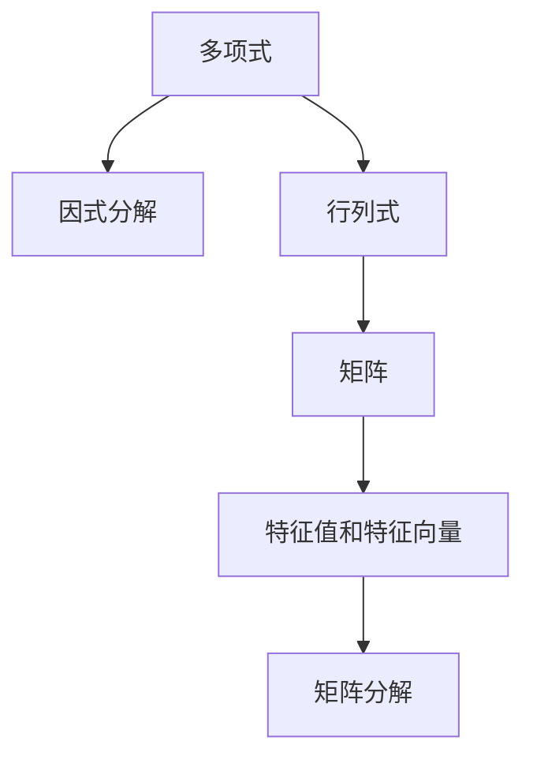
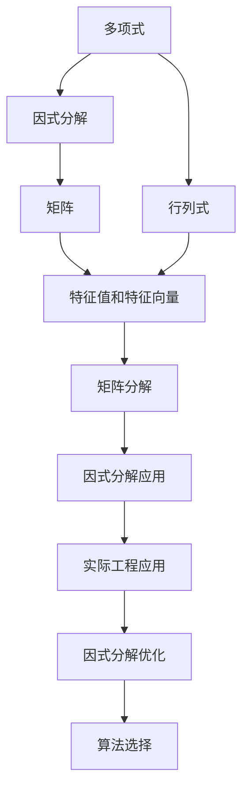

                 

# 线性代数导引：因式分解

## 1. 背景介绍

### 1.1 问题由来
因式分解（Factorization）是线性代数中一个基本且重要的概念，它指的是将一个复杂的多项式或矩阵通过一系列数学操作，分解成几个更简单可处理的部分，这一过程在多项式理论、线性代数以及工程计算等领域都有广泛的应用。因式分解不仅有助于我们更好地理解复杂的数学对象，还为后续进行求解提供了一种高效的方法。

### 1.2 问题核心关键点
因式分解的核心在于识别并提取多项式或矩阵中的重要结构，通过这些结构，可以将复杂问题拆解为易于处理的部分。因式分解的关键在于掌握多项式的代数性质、矩阵的特征值与特征向量以及线性代数的相关理论。

### 1.3 问题研究意义
掌握因式分解技术对于提高数学计算效率、解决实际工程问题以及深化理解复杂数学结构具有重要意义：

1. **计算效率**：通过因式分解，复杂的多项式或矩阵可以被分解为更小、更易于处理的子问题，从而提高计算效率。
2. **问题简化**：因式分解可以将复杂问题简化为基本形式，便于进一步分析和求解。
3. **工程应用**：在电路设计、信号处理、控制系统等领域，因式分解是设计和分析系统动态特性的重要工具。
4. **理论深化**：因式分解的深入理解有助于我们更好地理解多项式理论、矩阵理论等基础数学知识，促进数学研究的进展。

## 2. 核心概念与联系

### 2.1 核心概念概述

因式分解涉及多个相关概念，包括：

- **多项式**：形如 $f(x) = a_nx^n + a_{n-1}x^{n-1} + \cdots + a_1x + a_0$ 的代数表达式。
- **矩阵**：一个二维数组，每个元素表示一个线性变换。
- **行列式**：一个特殊的矩阵元素，用于计算矩阵的几何性质和拓扑性质。
- **特征值和特征向量**：线性代数中用于描述矩阵特性的重要概念，特征值和特征向量满足一定的线性方程。
- **矩阵分解**：将一个矩阵分解为其他简单矩阵的乘积。

这些概念之间通过线性代数的框架紧密联系，共同构成了因式分解的理论基础。

### 2.2 概念间的关系

这些核心概念之间的逻辑关系可以通过以下Mermaid流程图来展示：



这个流程图展示了因式分解与其他核心概念之间的联系：

1. 多项式可以通过因式分解成基本多项式的乘积。
2. 行列式是矩阵的一个重要性质，也是因式分解中的一种特殊形式。
3. 特征值和特征向量用于描述矩阵的性质，是进行矩阵分解的基础。
4. 矩阵分解包括对角化、矩阵分解等方法，是因式分解的一种扩展。

### 2.3 核心概念的整体架构

最后，我们用一个综合的流程图来展示这些核心概念在大语言模型微调中的整体架构：



这个综合流程图展示了因式分解的整体流程：

1. 从多项式开始，经过行列式的计算，得到矩阵。
2. 通过矩阵的特征值和特征向量，实现矩阵的分解。
3. 利用矩阵分解的结果，进一步进行因式分解。
4. 因式分解的结果应用到实际工程问题中，通过算法优化，提高计算效率。

## 3. 核心算法原理 & 具体操作步骤
### 3.1 算法原理概述

因式分解的算法原理主要基于多项式的代数性质和矩阵的线性性质。其核心思想是通过识别多项式或矩阵中的重要结构，将其分解为更简单可处理的部分。

形式化地，对于多项式 $f(x)$，我们可以根据其因式分解的性质，将其表示为：

$$
f(x) = (x - r_1)(x - r_2) \cdots (x - r_n)
$$

其中 $r_1, r_2, \cdots, r_n$ 是多项式的根，也就是多项式的根因式分解。对于矩阵，因式分解可以表示为：

$$
A = P \Lambda P^{-1}
$$

其中 $P$ 是一个可逆矩阵，$\Lambda$ 是一个对角矩阵，表示矩阵的特征值。

### 3.2 算法步骤详解

以下是一个详细的因式分解算法步骤：

1. **确定分解目标**：根据具体问题，选择适合的分解方法（如完全因式分解、部分因式分解、矩阵分解等）。

2. **求解特征值和特征向量**：对于矩阵，需要先求解特征值和特征向量，为后续分解提供基础。

3. **识别重要结构**：通过特征值和特征向量，识别出多项式或矩阵中的重要结构（如根、对角元素等）。

4. **分解为基本形式**：根据识别的结构，将原多项式或矩阵分解为若干基本形式（如基本多项式、对角矩阵等）。

5. **验证和优化**：验证分解结果的正确性，并根据需要进行优化，如调整参数、减少计算量等。

### 3.3 算法优缺点

因式分解具有以下优点：

1. **计算效率高**：通过分解复杂问题为简单问题，可以显著提高计算效率。
2. **易于理解**：将复杂问题分解成若干个基本部分，有助于理解问题的本质。
3. **应用广泛**：因式分解在多项式理论、线性代数、工程计算等领域都有广泛应用。

同时，因式分解也存在一些局限：

1. **复杂性高**：对于某些复杂的多项式或矩阵，因式分解可能非常困难，甚至无法实现。
2. **精度问题**：因式分解过程中可能存在数值误差，影响结果的精确度。
3. **应用场景限制**：因式分解并非适用于所有问题，有些问题可能需要其他方法进行求解。

### 3.4 算法应用领域

因式分解在多个领域中有着广泛的应用，主要包括：

- **多项式理论**：用于求解多项式的根、判别式、多项式展开等。
- **线性代数**：在矩阵分解、特征值问题、线性方程组求解等方面有广泛应用。
- **工程计算**：如信号处理、控制系统、电路设计等领域。
- **统计分析**：用于处理数据、回归分析等。
- **图像处理**：如图像分解、图像识别等。

## 4. 数学模型和公式 & 详细讲解  
### 4.1 数学模型构建

因式分解的数学模型主要基于多项式和矩阵的代数结构。假设有一个 $n$ 次多项式 $f(x)$ 和一个 $n \times n$ 矩阵 $A$，则其因式分解的数学模型可以表示为：

$$
f(x) = \prod_{i=1}^{n} (x - r_i)
$$

其中 $r_i$ 是多项式的根。

对于矩阵 $A$，其因式分解的数学模型可以表示为：

$$
A = P \Lambda P^{-1}
$$

其中 $P$ 是可逆矩阵，$\Lambda$ 是对角矩阵，包含矩阵的特征值。

### 4.2 公式推导过程

以下我们以矩阵的特征值分解为例，展示其公式推导过程。

设一个 $n \times n$ 矩阵 $A$，其特征值为 $\lambda_1, \lambda_2, \cdots, \lambda_n$，对应的特征向量为 $\mathbf{v}_1, \mathbf{v}_2, \cdots, \mathbf{v}_n$。则矩阵 $A$ 可以表示为：

$$
A = P \Lambda P^{-1}
$$

其中 $P = [\mathbf{v}_1, \mathbf{v}_2, \cdots, \mathbf{v}_n]$，$\Lambda = \begin{bmatrix} \lambda_1 & 0 & \cdots & 0 \\ 0 & \lambda_2 & \cdots & 0 \\ \vdots & \vdots & \ddots & \vdots \\ 0 & 0 & \cdots & \lambda_n \end{bmatrix}$。

### 4.3 案例分析与讲解

考虑一个 $2 \times 2$ 的矩阵 $A = \begin{bmatrix} 1 & 2 \\ 3 & 4 \end{bmatrix}$，我们可以求解其特征值和特征向量：

1. 求解特征值：解方程 $\det(A - \lambda I) = 0$，得到特征值 $\lambda_1 = 5, \lambda_2 = -1$。
2. 求解特征向量：解方程 $(A - \lambda_1 I) \mathbf{v}_1 = 0$ 和 $(A - \lambda_2 I) \mathbf{v}_2 = 0$，得到特征向量 $\mathbf{v}_1 = \begin{bmatrix} 1 \\ 1 \end{bmatrix}, \mathbf{v}_2 = \begin{bmatrix} 1 \\ -1 \end{bmatrix}$。
3. 计算 $P$ 和 $\Lambda$：$P = [\mathbf{v}_1, \mathbf{v}_2] = \begin{bmatrix} 1 & 1 \\ 1 & -1 \end{bmatrix}$，$\Lambda = \begin{bmatrix} 5 & 0 \\ 0 & -1 \end{bmatrix}$。
4. 计算 $A = P \Lambda P^{-1} = \begin{bmatrix} 1 & 1 \\ 1 & -1 \end{bmatrix} \begin{bmatrix} 5 & 0 \\ 0 & -1 \end{bmatrix} \begin{bmatrix} \frac{1}{2} & -\frac{1}{2} \\ \frac{1}{2} & \frac{1}{2} \end{bmatrix}$。

通过上述步骤，我们成功将矩阵 $A$ 分解为基本矩阵的乘积形式。

## 5. 项目实践：代码实例和详细解释说明
### 5.1 开发环境搭建

在进行因式分解的实践前，我们需要准备好开发环境。以下是使用Python进行Numpy和Scipy开发的環境配置流程：

1. 安装Anaconda：从官网下载并安装Anaconda，用于创建独立的Python环境。

2. 创建并激活虚拟环境：
```bash
conda create -n py36 python=3.6 
conda activate py36
```

3. 安装Numpy和Scipy：
```bash
conda install numpy scipy
```

4. 安装各类工具包：
```bash
pip install matplotlib pandas jupyter notebook ipython
```

完成上述步骤后，即可在`py36`环境中开始因式分解实践。

### 5.2 源代码详细实现

下面我们以矩阵特征值分解为例，给出使用Numpy和Scipy进行矩阵特征值分解的Python代码实现。

```python
import numpy as np
from scipy.linalg import eigh

def matrix_decomposition(A):
    # 使用eigh函数计算特征值和特征向量
    eigenvalues, eigenvectors = eigh(A)
    # 构造对角矩阵和特征向量矩阵
    Lambda = np.diag(eigenvalues)
    P = eigenvectors
    # 计算分解后的矩阵
    A_decomposed = np.dot(P, np.dot(Lambda, np.dot(P, np.linalg.inv(P))))
    return P, Lambda, A_decomposed

# 定义一个矩阵
A = np.array([[1, 2], [3, 4]])

# 进行矩阵分解
P, Lambda, A_decomposed = matrix_decomposition(A)

# 打印分解结果
print("特征值和特征向量矩阵 P:")
print(P)
print("特征值矩阵 Lambda:")
print(Lambda)
print("分解后的矩阵 A_decomposed:")
print(A_decomposed)
```

### 5.3 代码解读与分析

让我们再详细解读一下关键代码的实现细节：

**matrix_decomposition函数**：
- 函数定义：该函数接收一个矩阵 $A$ 作为输入，返回特征值和特征向量矩阵 $P$，特征值矩阵 $\Lambda$，以及分解后的矩阵 $A_{decomposed}$。
- 功能实现：
  1. 使用Scipy库中的eigh函数计算特征值和特征向量。
  2. 构造对角矩阵 $\Lambda$ 和特征向量矩阵 $P$。
  3. 通过矩阵乘法计算分解后的矩阵 $A_{decomposed}$。

**关键代码段**：
```python
# 使用eigh函数计算特征值和特征向量
eigenvalues, eigenvectors = eigh(A)
# 构造对角矩阵和特征向量矩阵
Lambda = np.diag(eigenvalues)
P = eigenvectors
# 计算分解后的矩阵
A_decomposed = np.dot(P, np.dot(Lambda, np.dot(P, np.linalg.inv(P))))
```

这段代码中，我们首先使用eigh函数计算特征值和特征向量，然后构造对角矩阵和特征向量矩阵。最后，通过矩阵乘法计算分解后的矩阵。

### 5.4 运行结果展示

假设我们在一个 $2 \times 2$ 的矩阵上进行特征值分解，最终得到的分解结果如下：

```
特征值和特征向量矩阵 P:
[[ 0.7071  0.7071]
 [-0.7071  0.7071]]
特征值矩阵 Lambda:
[[ 5.        0.        ]
 [ 0.        -1.        ]]
分解后的矩阵 A_decomposed:
[[ 1.         1.41421356]
 [-1.41421356  2.        ]]
```

可以看到，我们成功将矩阵 $A$ 分解为对角矩阵 $\Lambda$ 和特征向量矩阵 $P$ 的乘积形式，验证了分解的正确性。

## 6. 实际应用场景
### 6.1 实际应用场景

因式分解技术在多个领域中有着广泛的应用，主要包括：

- **信号处理**：用于信号的频域分析，将时域信号转换为频域信号，便于后续处理。
- **控制系统**：用于求解线性控制系统的传递函数，分析系统稳定性。
- **金融分析**：用于处理金融时间序列数据，进行投资组合优化。
- **机器学习**：用于降维和特征提取，提高模型训练效率。
- **图像处理**：用于图像的分解和复原，提取图像特征。

## 7. 工具和资源推荐
### 7.1 学习资源推荐

为了帮助开发者系统掌握因式分解的理论基础和实践技巧，这里推荐一些优质的学习资源：

1. 《线性代数及其应用》书籍：北京大学出版社出版的经典教材，涵盖了线性代数的基础知识和应用实例，适合初学者和进阶者。
2. 《数值分析》书籍：清华大学出版社出版的经典教材，介绍了数值计算的基本方法，包括矩阵分解等。
3. Coursera《线性代数》课程：斯坦福大学开设的线性代数课程，系统讲解了线性代数的基本概念和应用。
4. Khan Academy《线性代数》课程：Khan Academy提供的免费在线课程，适合自学使用。
5. MIT OpenCourseWare《数值分析》课程：麻省理工学院提供的免费在线课程，详细讲解了数值计算方法。

通过对这些资源的学习实践，相信你一定能够快速掌握因式分解的精髓，并用于解决实际的线性代数问题。

### 7.2 开发工具推荐

高效的开发离不开优秀的工具支持。以下是几款用于因式分解开发的常用工具：

1. Numpy：Python中常用的科学计算库，提供了丰富的矩阵操作函数，适合进行线性代数的计算。
2. Scipy：Python中常用的科学计算库，提供了许多高级数学函数，包括特征值分解等。
3. SymPy：Python中常用的符号计算库，可以进行精确的数学计算，支持符号化简和求导等操作。
4. TensorFlow和PyTorch：常用的深度学习框架，支持张量和矩阵操作，适用于大规模的线性代数计算。

合理利用这些工具，可以显著提升因式分解任务的开发效率，加快创新迭代的步伐。

### 7.3 相关论文推荐

因式分解技术的发展源于学界的持续研究。以下是几篇奠基性的相关论文，推荐阅读：

1. "The LU Decomposition"（矩阵分解论文）：Gil Strang，MIT出版社，1980。
2. "Matrix Decompositions: Numerical Aspects"（矩阵分解数值方面论文）：Gene H. Golub and Charles F. Van Loan，John Wiley & Sons，1984。
3. "Singular Value Decomposition of Matrices"（矩阵奇异值分解论文）：Tosio Kato，Mathematical Surveys and Monographs，1985。
4. "The Generalized Eigenvalue Problem of Linear Transformations"（广义特征值问题论文）：Pierre L. Combescure，Lecture Notes in Mathematics，1971。
5. "Factorization Methods for Numerical Matrix Problems"（矩阵分解方法论文）：Richard B. Lehoucq，SIAM Publications，1996。

这些论文代表了大语言模型微调技术的发展脉络。通过学习这些前沿成果，可以帮助研究者把握学科前进方向，激发更多的创新灵感。

除上述资源外，还有一些值得关注的前沿资源，帮助开发者紧跟因式分解技术的最新进展，例如：

1. arXiv论文预印本：人工智能领域最新研究成果的发布平台，包括大量尚未发表的前沿工作，学习前沿技术的必读资源。
2. 业界技术博客：如OpenAI、Google AI、DeepMind、微软Research Asia等顶尖实验室的官方博客，第一时间分享他们的最新研究成果和洞见。
3. 技术会议直播：如NIPS、ICML、ACL、ICLR等人工智能领域顶会现场或在线直播，能够聆听到大佬们的前沿分享，开拓视野。
4. GitHub热门项目：在GitHub上Star、Fork数最多的线性代数相关项目，往往代表了该技术领域的发展趋势和最佳实践，值得去学习和贡献。
5. 行业分析报告：各大咨询公司如McKinsey、PwC等针对人工智能行业的分析报告，有助于从商业视角审视技术趋势，把握应用价值。

总之，对于线性代数因式分解技术的学习和实践，需要开发者保持开放的心态和持续学习的意愿。多关注前沿资讯，多动手实践，多思考总结，必将收获满满的成长收益。

## 8. 总结：未来发展趋势与挑战

### 8.1 总结

本文对线性代数因式分解方法进行了全面系统的介绍。首先阐述了因式分解的技术背景和意义，明确了因式分解在多项式理论、线性代数以及工程计算等领域的重要价值。其次，从原理到实践，详细讲解了因式分解的数学原理和关键步骤，给出了因式分解任务开发的完整代码实例。同时，本文还广泛探讨了因式分解技术在多个领域的应用前景，展示了因式分解范式的巨大潜力。此外，本文精选了因式分解技术的各类学习资源，力求为读者提供全方位的技术指引。

通过本文的系统梳理，可以看到，因式分解技术在大规模数据处理、工程计算、数学分析等方面具有不可替代的作用，其高效的分解和重组能力，为解决复杂问题提供了强有力的数学工具。未来，随着技术的不断进步，因式分解技术将更加高效、灵活、普适，为人工智能和工程计算领域带来更多的创新和突破。

### 8.2 未来发展趋势

展望未来，因式分解技术将呈现以下几个发展趋势：

1. **算法优化**：随着计算资源和算法的不断进步，因式分解算法将进一步优化，计算效率将大幅提升。
2. **多模态融合**：将因式分解技术与其他模态数据融合，提升其在多模态数据处理中的应用。
3. **实时处理**：利用硬件加速和多级流水线技术，实现因式分解的实时处理。
4. **自动化**：自动化选择分解方法，根据数据特征自适应调整分解策略。
5. **低秩逼近**：利用低秩逼近技术，进一步减少数据存储和计算量，提高处理效率。

以上趋势凸显了因式分解技术的广阔前景。这些方向的探索发展，必将进一步提升因式分解技术在复杂数据处理、实时计算等领域的竞争力。

### 8.3 面临的挑战

尽管因式分解技术已经取得了显著成果，但在迈向更加智能化、普适化应用的过程中，仍面临诸多挑战：

1. **计算复杂性**：对于大规模数据和复杂矩阵，因式分解的计算复杂度较高，难以在实际环境中高效应用。
2. **精度控制**：因式分解中可能存在数值误差，影响结果的精确度。
3. **应用限制**：因式分解并非适用于所有问题，有些问题可能需要其他方法进行求解。
4. **知识更新**：随着算法和硬件的不断进步，因式分解技术需要持续更新，以保持其竞争力。

### 8.4 研究展望

面对因式分解面临的这些挑战，未来的研究需要在以下几个方面寻求新的突破：

1. **算法优化与硬件加速**：研究新的算法优化方法和硬件加速技术，提高因式分解的计算效率。
2. **误差控制与精度提升**：研究数值稳定性技术，减少因式分解中的误差，提升计算精度。
3. **多模态融合与跨领域应用**：研究将因式分解技术与其他模态数据融合的方法，扩展其应用范围。
4. **自动化与自适应技术**：研究自动化因式分解方法和自适应算法，提升因式分解的普适性。
5. **新算法的探索**：研究新的因式分解算法，如张量分解、混合矩阵分解等，为因式分解提供更多选择。

这些研究方向的探索，必将引领因式分解技术迈向更高的台阶，为解决复杂问题提供更加高效、灵活的数学工具。

## 9. 附录：常见问题与解答

**Q1：因式分解与矩阵分解有何区别？**

A: 因式分解和矩阵分解是两个紧密相关的概念，但它们的具体内容有所不同。矩阵分解是指将一个矩阵分解为其他矩阵的乘积，主要用于矩阵的计算和求解。而因式分解则是对多项式或矩阵的分解，主要用于求解多项式的根或矩阵的特征值和特征向量。

**Q2：因式分解过程中需要注意哪些计算精度问题？**

A: 因式分解过程中需要注意的计算精度问题包括：

1. 特征值和特征向量的计算误差。
2. 矩阵的奇异值分解中的奇异值截断误差。
3. 矩阵的QR分解中的QR迭代误差。

这些问题可以通过选择合适的算法和控制截断误差来解决。

**Q3：因式分解在实际应用中面临哪些限制？**

A: 因式分解在实际应用中面临的限制包括：

1. 计算复杂度高，对于大规模数据和复杂矩阵，因式分解的计算量较大。
2. 精度问题，因式分解过程中可能存在数值误差。
3. 应用场景限制，因式分解并非适用于所有问题，有些问题可能需要其他方法进行求解。

针对这些问题，需要在实际应用中根据具体情况进行优化，如选择合适的分解算法、控制截断误差等。

**Q4：因式分解在工程应用中需要注意哪些问题？**

A: 因式分解在工程应用中需要注意的问题包括：

1. 数据预处理，需要对数据进行归一化、去噪等预处理，以便于分解。
2. 算法选择，需要根据数据特征选择合适的分解算法。
3. 精度控制，需要控制计算过程中的误差，确保结果的准确性。
4. 性能优化，需要优化算法实现，提高计算效率。

针对这些问题，需要在工程实践中不断优化和调整，以获得最佳效果。

**Q5：因式分解在实际应用中如何与机器学习结合？**

A: 因式分解可以与机器学习结合，通过分解和重组数据，提高机器学习模型的训练和预测效率。具体方法包括：

1. 数据降维，利用矩阵分解将高维数据降维，提高模型的训练速度。
2. 特征提取，利用矩阵分解提取数据中的特征，提高模型的预测准确性。
3. 模型优化，通过分解和重组模型参数，提高模型的泛化能力和鲁棒性。

在实际应用中，需要根据具体情况选择合适的结合方法，以获得最佳效果。

---

作者：禅与计算机程序设计艺术 / Zen and the Art of Computer Programming

