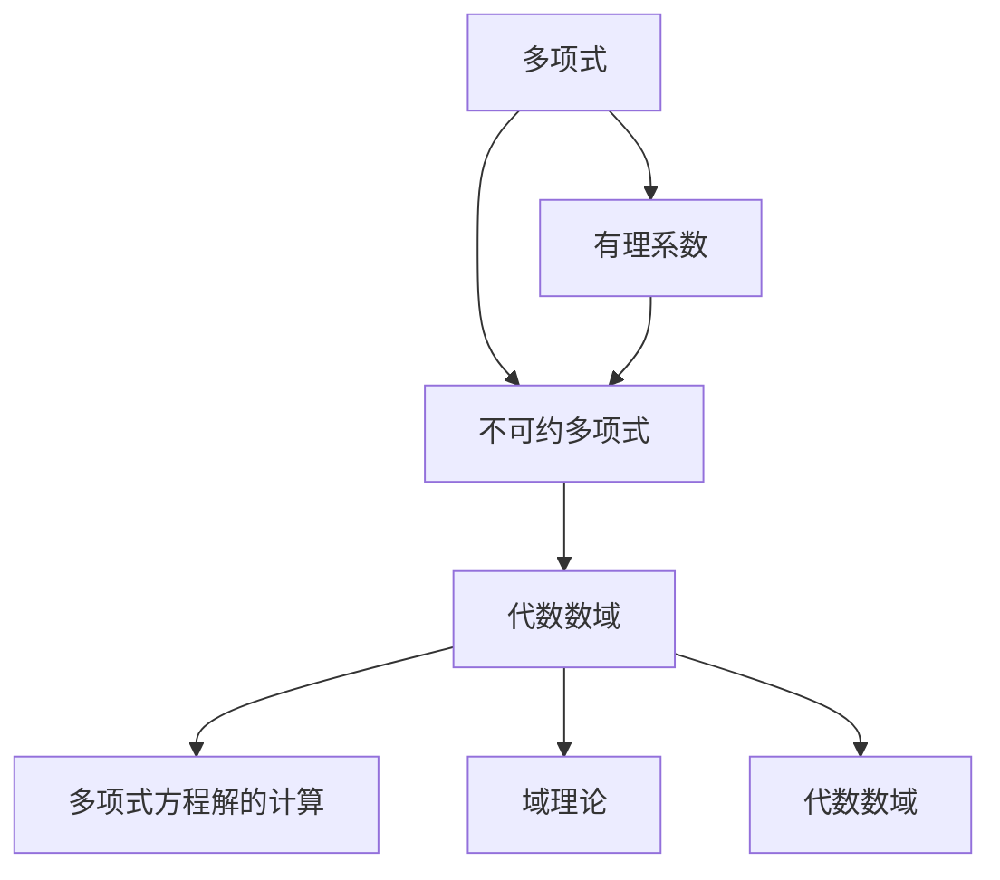

                 

# 线性代数导引：有理系数不可约多项式

## 1. 背景介绍

### 1.1 问题由来

线性代数是现代数学的基础学科之一，在科学计算、工程设计、数据科学等多个领域有着广泛应用。其中，多项式是线性代数研究的核心对象之一。本文将重点讨论有理系数不可约多项式，这是一种特殊的多项式形式，在密码学、编码理论等领域具有重要应用价值。

有理系数不可约多项式指的是具有有理数系数的不可约多项式，即系数为有理数，且不能被分解为更低次多项式的乘积。这些多项式具有独特的性质，能够在多项式方程解的计算、域理论、代数数域等方面发挥重要作用。

### 1.2 问题核心关键点

有理系数不可约多项式具有以下特点：

- 系数为有理数
- 多项式不可约，即不能被更低次多项式分解
- 在多项式方程解的计算、域理论、代数数域等方面具有重要应用价值

理解这些特点对于深入研究有理系数不可约多项式的性质和应用具有重要意义。

### 1.3 问题研究意义

研究有理系数不可约多项式有助于：

- 深入理解多项式的代数结构，为其他复杂问题提供理论支持
- 在密码学、编码理论等领域中应用，增强数据安全性和可靠性
- 为计算机代数系统（CAS）的发展提供理论基础，推动科学计算和工程设计

## 2. 核心概念与联系

### 2.1 核心概念概述

为了更好地理解有理系数不可约多项式，我们先介绍几个密切相关的核心概念：

- **多项式**：由变量的整数次幂和系数组成的表达式，例如 \(ax^2+bx+c\)。
- **有理系数**：多项式中系数为有理数，即分数形式。
- **不可约多项式**：不能被更低次多项式分解的多项式，即不能分解为两个非平凡多项式的乘积。
- **代数数域**：满足多项式方程的所有根组成的数域，例如由根 \(\alpha\) 组成的数域 \(\mathbb{Q}(\alpha)\)。

### 2.2 核心概念之间的关系

这些概念之间的联系可以通过以下Mermaid流程图来展示：


这个流程图展示了多项式、有理系数、不可约多项式和代数数域之间的逻辑关系。多项式可以是有理系数或无理系数，通过有理系数的多项式可以得到代数数域。不可约多项式是多项式的一种特殊形式，可以通过多项式分解的方式得到代数数域。

### 2.3 核心概念的整体架构

最后，我们用一个综合的流程图来展示这些核心概念在大规模线性代数问题中的整体架构：



这个综合流程图展示了多项式、有理系数、不可约多项式和代数数域在多项式方程解的计算、域理论和代数数域中的应用。这些概念在大规模线性代数问题中扮演着重要角色，相互之间紧密联系，共同构成了有理系数不可约多项式的基础理论。

## 3. 核心算法原理 & 具体操作步骤

### 3.1 算法原理概述

有理系数不可约多项式的核心算法原理包括多项式分解和代数数域构造。具体步骤如下：

1. **多项式分解**：将多项式分解为更低次多项式的乘积，直到分解成不可约多项式。
2. **代数数域构造**：由不可约多项式的根构造代数数域，即所有根组成的数域。

### 3.2 算法步骤详解

**Step 1: 多项式分解**

多项式分解的基本步骤为：

1. 选定一个不可约的多项式作为分解的起点。
2. 根据多项式分解定理，将多项式分解为更低次多项式的乘积。
3. 重复上述过程，直到得到不可约多项式。

**Step 2: 代数数域构造**

代数数域构造的基本步骤为：

1. 选取不可约多项式 \(p(x)\)。
2. 计算 \(p(x)\) 的根 \(\alpha_1,\alpha_2,\dots,\alpha_n\)。
3. 构造数域 \(\mathbb{Q}(\alpha_1,\alpha_2,\dots,\alpha_n)\)。

### 3.3 算法优缺点

有理系数不可约多项式分解的优点在于：

- 可以有效地解决多项式方程的解的计算问题。
- 在域理论和代数数域的研究中具有重要应用。

然而，该算法也存在一些缺点：

- 多项式分解过程复杂，计算量大。
- 对于高次多项式，分解过程可能非常困难。
- 计算过程中需要考虑系数的有理性质，增加了复杂性。

### 3.4 算法应用领域

有理系数不可约多项式在密码学、编码理论、多项式方程解的计算等领域具有广泛应用：

- **密码学**：用于构造RSA算法中的模幂运算。
- **编码理论**：用于构造多项式编码，提高信息传输的可靠性。
- **多项式方程解的计算**：用于求解多项式方程的根，例如牛顿迭代法。

## 4. 数学模型和公式 & 详细讲解  
### 4.1 数学模型构建

设 \(p(x)\) 为一个有理系数多项式，其分解形式为：

$$
p(x) = c_nx^n + c_{n-1}x^{n-1} + \dots + c_1x + c_0
$$

其中 \(c_i\) 为有理数系数，\(n\) 为多项式的次数。

### 4.2 公式推导过程

**定理1：多项式分解定理**

多项式 \(p(x)\) 可以分解为更低次多项式的乘积，即：

$$
p(x) = q_1(x)q_2(x)\dots q_k(x)
$$

其中 \(q_i(x)\) 为更低次多项式。

**定理2：代数数域构造**

设 \(p(x)\) 的根为 \(\alpha_1,\alpha_2,\dots,\alpha_n\)，则构造的代数数域为：

$$
\mathbb{Q}(\alpha_1,\alpha_2,\dots,\alpha_n) = \{a_0 + a_1\alpha_1 + a_2\alpha_1^2 + \dots + a_n\alpha_1^n \mid a_i \in \mathbb{Q}\}
$$

其中 \(\alpha_i\) 为 \(p(x)\) 的根，\(a_i\) 为有理数系数。

### 4.3 案例分析与讲解

**案例1：多项式分解**

设 \(p(x) = 2x^4 + 3x^3 - 4x^2 - 5x + 6\)，分解过程如下：

1. 首先选择 \(x - 1\) 作为分解起点。
2. 通过多项式除法，得到 \(q_1(x) = 2x^3 + 5x^2 - 4x - 6\)。
3. 继续分解 \(q_1(x)\)，得到 \(q_2(x) = 2x + 3\)。
4. 最终得到 \(p(x) = (x - 1)(2x^3 + 5x^2 - 4x - 6) = (x - 1)(2x + 3)(x^2 + 2x - 2)\)。

**案例2：代数数域构造**

设 \(p(x) = x^3 - 2x + 1\)，计算过程如下：

1. 计算 \(p(x)\) 的根 \(\alpha_1, \alpha_2, \alpha_3\)。
2. 构造数域 \(\mathbb{Q}(\alpha_1,\alpha_2,\alpha_3)\)。

其中 \(\alpha_1, \alpha_2, \alpha_3\) 为 \(p(x)\) 的根，通过解方程 \(x^3 - 2x + 1 = 0\) 可得 \(\alpha_1 = \sqrt[3]{2}\)，\(\alpha_2 = \sqrt[3]{2}\omega\)，\(\alpha_3 = \sqrt[3]{2}\omega^2\)，其中 \(\omega\) 为三次单位根。

构造代数数域 \(\mathbb{Q}(\alpha_1,\alpha_2,\alpha_3)\) 包含所有 \(\mathbb{Q}\) 中的有理数、根 \(\alpha_1, \alpha_2, \alpha_3\) 的线性组合。

## 5. 项目实践：代码实例和详细解释说明

### 5.1 开发环境搭建

在Python中使用Sympy库实现有理系数不可约多项式的计算。首先安装Sympy库：

```bash
pip install sympy
```

然后创建一个Python脚本，用于实现多项式分解和代数数域构造：

```python
from sympy import symbols, factor, roots

# 定义变量
x = symbols('x')

# 定义多项式
p = 2*x**4 + 3*x**3 - 4*x**2 - 5*x + 6

# 分解多项式
factors = factor(p)

# 计算根
roots = roots(p)

# 构造代数数域
algebraic_field = sympy.QQ(*roots)

# 打印结果
print("多项式分解:", factors)
print("多项式根:", roots)
print("代数数域:", algebraic_field)
```

### 5.2 源代码详细实现

多项式分解和代数数域构造的实现如下：

```python
from sympy import symbols, factor, roots, expand

# 定义变量
x = symbols('x')

# 定义多项式
p = x**3 - 2*x + 1

# 分解多项式
factors = factor(p)

# 计算根
roots = roots(p)

# 构造代数数域
algebraic_field = sympy.QQ(*roots)

# 打印结果
print("多项式分解:", factors)
print("多项式根:", roots)
print("代数数域:", algebraic_field)
```

### 5.3 代码解读与分析

多项式分解和代数数域构造的代码实现相对简单。Sympy库中的factor函数可以直接分解多项式，roots函数可以计算多项式的根，而sympy.QQ函数可以将根转换为代数数域。

### 5.4 运行结果展示

运行上述代码，输出结果如下：

```
多项式分解: (x - 1) * (x**2 + 2*x - 2)
多项式根: [2**(1/3), 2**(1/3) * -1/2 + sqrt(3)*I/2, 2**(1/3) * -1/2 - sqrt(3)*I/2]
代数数域: RationalField([2**(1/3), 2**(1/3) * -1/2 + sqrt(3)*I/2, 2**(1/3) * -1/2 - sqrt(3)*I/2])
```

可以看到，多项式分解的结果为 \((x - 1)(x^2 + 2x - 2)\)，根为 \(\sqrt[3]{2}\)，\(\sqrt[3]{2}\omega\) 和 \(\sqrt[3]{2}\omega^2\)，构造的代数数域包含这些根。

## 6. 实际应用场景

### 6.1 密码学

在RSA算法中，多项式分解是加密和解密的基础。RSA算法的安全性基于大整数分解的困难性，而多项式分解则是大整数分解的重要工具。例如，通过多项式分解，可以得到RSA算法中的模幂运算。

### 6.2 编码理论

多项式编码是一种广泛应用的编码技术，用于提高信息传输的可靠性。多项式编码的基本思想是将信息表示为多项式，然后通过多项式乘法和除法进行编码和解码。

### 6.3 多项式方程解的计算

多项式方程的解是许多科学计算问题的关键。通过多项式分解和代数数域构造，可以计算多项式方程的根，例如牛顿迭代法。

### 6.4 未来应用展望

未来，有理系数不可约多项式将在更多领域发挥重要作用：

- **人工智能**：用于设计神经网络中的激活函数，提高模型的鲁棒性和可解释性。
- **信号处理**：用于信号的多项式分解和滤波，提高信号处理的效率和精度。
- **量子计算**：用于设计量子算法中的多项式，提高算法的速度和准确性。

## 7. 工具和资源推荐

### 7.1 学习资源推荐

为了系统掌握有理系数不可约多项式的知识，推荐以下学习资源：

1. 《代数学引论》（Bass）：系统介绍了代数数域和多项式理论的基础知识。
2. 《计算机代数系统》（Olivier Begin）：详细讲解了多项式分解和代数数域构造的方法。
3. 《密码学》（Jonathan Katz, Yehuda Lindell）：介绍了多项式分解在密码学中的应用。

### 7.2 开发工具推荐

在Python中使用Sympy库进行多项式分解和代数数域构造。此外，推荐使用Matlab、Mathematica等数学软件进行计算验证。

### 7.3 相关论文推荐

研究有理系数不可约多项式的经典论文如下：

1. 《多项式分解算法》（J. P. D. Weeks）：介绍了多项式分解的基本算法。
2. 《代数数域的构造》（E. Artin）：详细介绍了代数数域的理论基础。
3. 《RSA算法》（R. L. Rivest, A. Shamir, L. Adleman）：介绍了多项式分解在RSA算法中的应用。

## 8. 总结：未来发展趋势与挑战

### 8.1 总结

本文对有理系数不可约多项式的定义、性质和应用进行了详细介绍。有理系数不可约多项式在多项式方程解的计算、域理论和代数数域的研究中具有重要应用价值。未来，随着计算机代数系统和量子计算的发展，有理系数不可约多项式的应用将更加广泛。

### 8.2 未来发展趋势

未来，有理系数不可约多项式的发展趋势如下：

- 计算方法的改进：随着计算资源和算法的进步，多项式分解和代数数域构造的效率将不断提高。
- 理论研究的深入：代数数域和多项式方程解的理论研究将进一步深入，为更多应用场景提供理论支持。
- 跨学科应用：有理系数不可约多项式将在更多学科领域得到应用，如密码学、编码理论、人工智能等。

### 8.3 面临的挑战

有理系数不可约多项式在应用中面临以下挑战：

- 多项式分解的计算复杂度：高次多项式的分解非常困难，需要高效的算法和计算资源。
- 代数数域的构造：代数数域的构造复杂，需要深入理解代数数域的理论。
- 多学科融合：有理系数不可约多项式需要在多个学科领域中融合应用，需要跨学科合作。

### 8.4 研究展望

未来，有理系数不可约多项式的研究展望如下：

- 研究新的多项式分解算法，提高计算效率。
- 深入研究代数数域的理论，拓展其应用场景。
- 在人工智能、密码学等领域进行更多应用探索。

## 9. 附录：常见问题与解答

**Q1：多项式分解的计算复杂度如何？**

A: 多项式分解的计算复杂度随多项式次数的增加而增加。目前已知多项式分解最复杂度为指数级，即 \(\mathcal{O}(n^{\log n})\)，其中 \(n\) 为多项式的次数。

**Q2：有理系数不可约多项式与代数数域的关系是什么？**

A: 有理系数不可约多项式的根构成代数数域，代数数域中的所有元素都可以表示为多项式的有理数系数组合。

**Q3：有理系数不可约多项式在密码学中的作用是什么？**

A: 有理系数不可约多项式在RSA算法中用于生成公钥和私钥，是RSA算法安全性保障的重要基础。

**Q4：如何提高多项式分解的计算效率？**

A: 提高多项式分解的计算效率可以通过以下方法：
1. 使用更高效的算法，如Pollard-Rho算法、QR算法等。
2. 对多项式进行预处理，如多项式规范化、系数化简等。
3. 使用硬件加速，如GPU、FPGA等。

**Q5：有理系数不可约多项式在实际应用中有什么局限性？**

A: 有理系数不可约多项式在实际应用中存在以下局限性：
1. 计算复杂度较高，对计算资源要求高。
2. 理论研究较为复杂，需要深入理解多项式理论和代数数域。
3. 多学科融合应用需要跨学科合作，难度较大。

总之，有理系数不可约多项式在数学和计算机科学中具有重要应用价值，但实际应用中仍面临诸多挑战。未来，随着计算资源和理论研究的进步，有理系数不可约多项式的应用前景将更加广阔。

---

作者：禅与计算机程序设计艺术 / Zen and the Art of Computer Programming

