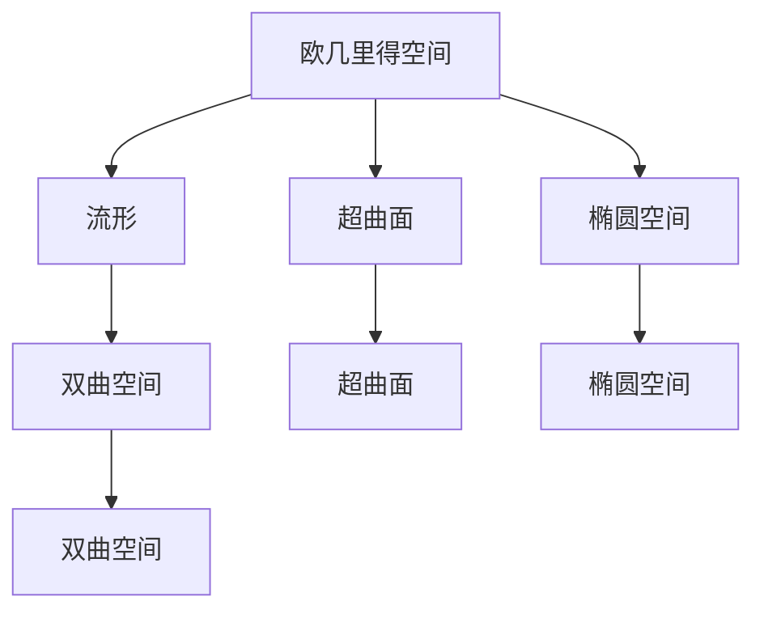
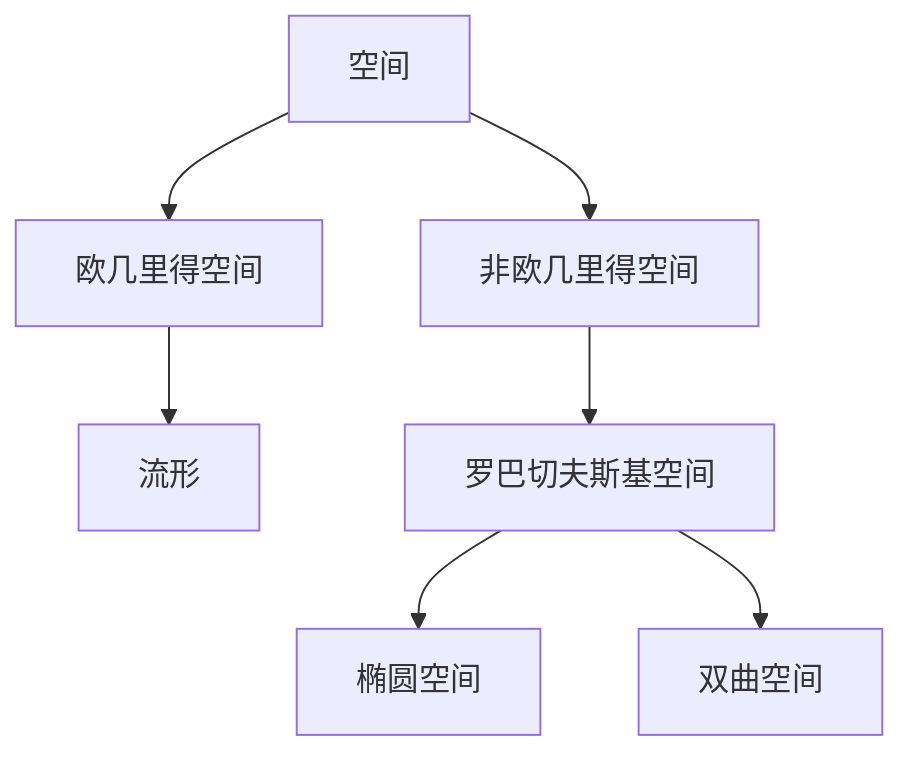
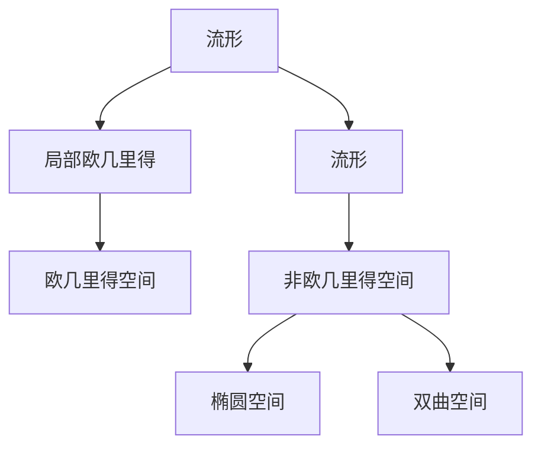
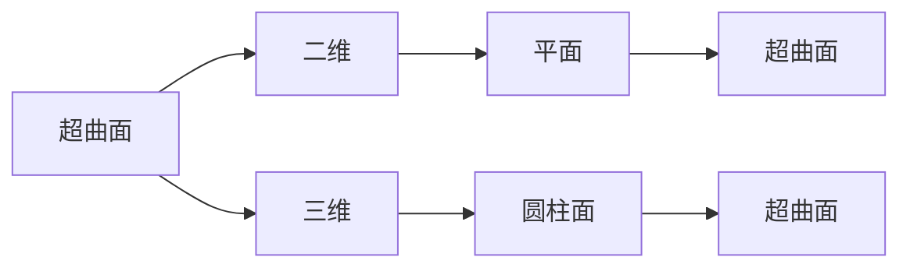
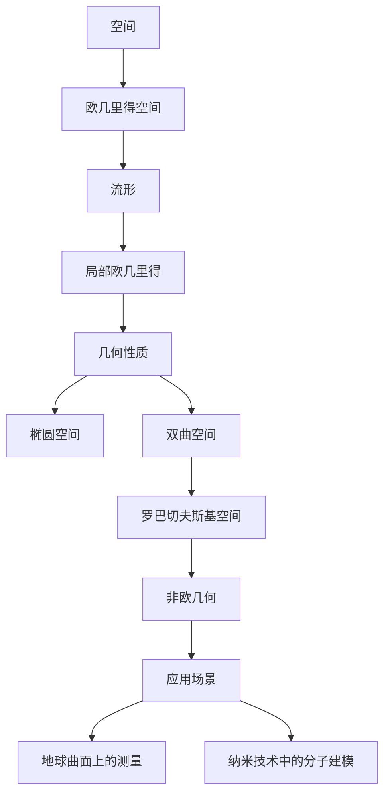

                 

# 线性代数导引：罗巴切夫斯基空间

> 关键词：罗巴切夫斯基空间, 线性代数, 流形, 超曲面, 椭圆空间, 双曲空间, 欧氏几何

## 1. 背景介绍

### 1.1 问题由来
罗巴切夫斯基空间是一种非欧几里得几何空间，其几何性质与欧氏空间存在显著差异。在欧氏空间中，点到直线的距离具有固定值，而在罗巴切夫斯基空间中，点到直线的距离会根据几何空间的特性发生改变。这种非欧几何的性质使得罗巴切夫斯基空间在许多应用场景中具有独特优势，例如，在地球曲面上的测量问题、纳米技术中的分子建模等。

### 1.2 问题核心关键点
罗巴切夫斯基空间的核心关键点包括：
1. 定义：罗巴切夫斯基空间是一种非欧几里得几何空间，其几何性质与欧氏空间不同，具有独特的几何特性。
2. 基本性质：罗巴切夫斯基空间中，点到直线的距离根据几何空间的特性发生改变。
3. 应用场景：罗巴切夫斯基空间在地球曲面上的测量问题、纳米技术中的分子建模等应用场景中具有独特优势。

### 1.3 问题研究意义
研究罗巴切夫斯基空间具有重要意义：
1. 拓展了线性代数和几何学的知识边界，加深了对非欧几何的理解。
2. 提供了解决特定应用问题的有力工具，如地球曲面上的距离测量问题。
3. 对纳米技术中的分子建模等前沿技术具有重要参考价值。

## 2. 核心概念与联系

### 2.1 核心概念概述

为更好地理解罗巴切夫斯基空间，本节将介绍几个密切相关的核心概念：

- 欧几里得空间(Euclidean Space)：一种最基本的线性空间，其中点到直线的距离是固定的。
- 非欧几里得空间(Non-Euclidean Space)：指与欧几里得空间不同的几何空间，其几何性质不同。
- 流形(Manifold)：一个局部欧几里得的空间，在局部区域内具有与欧几里得空间相似的几何性质。
- 超曲面(Hypersurface)：流形的一个子集，其维度与整个流形的维度相同，例如，在三维空间中，一个二维的超曲面。
- 椭圆空间(Elliptic Space)：一种特殊类型的罗巴切夫斯基空间，其几何性质类似于欧几里得空间。
- 双曲空间(Hyperbolic Space)：一种特殊类型的罗巴切夫斯基空间，其几何性质与椭圆空间不同。

这些概念之间的逻辑关系可以通过以下Mermaid流程图来展示：



这个流程图展示了几何空间之间的关系：

1. 欧几里得空间是局部欧几里得的流形。
2. 超曲面是流形的一个子集。
3. 椭圆空间和双曲空间是特殊类型的罗巴切夫斯基空间。

### 2.2 概念间的关系

这些核心概念之间存在着紧密的联系，形成了线性代数和几何学的完整框架。下面我们通过几个Mermaid流程图来展示这些概念之间的关系。

#### 2.2.1 几何空间的分类



这个流程图展示了几何空间的分类：

1. 空间分为欧几里得空间和非欧几里得空间。
2. 欧几里得空间是局部欧几里得的流形。
3. 非欧几里得空间分为椭圆空间和双曲空间。

#### 2.2.2 流形的几何性质



这个流程图展示了流形的几何性质：

1. 流形具有局部欧几里得的性质。
2. 在局部欧几里得的流形内，可以使用欧几里得几何的公式进行计算。
3. 在非欧几里得的流形内，几何性质与欧几里得空间不同。

#### 2.2.3 超曲面的维度



这个流程图展示了超曲面的维度：

1. 超曲面是流形的一个子集。
2. 在三维空间中，二维的超曲面可以是平面或圆柱面。
3. 超曲面的维度与整个流形的维度相同。

### 2.3 核心概念的整体架构

最后，我们用一个综合的流程图来展示这些核心概念在大语言模型微调过程中的整体架构：



这个综合流程图展示了从空间到罗巴切夫斯基空间的整体架构：

1. 空间分为欧几里得空间和非欧几里得空间。
2. 欧几里得空间是局部欧几里得的流形。
3. 在局部欧几里得的流形内，几何性质与欧几里得空间相似。
4. 非欧几里得的流形分为椭圆空间和双曲空间。
5. 罗巴切夫斯基空间是一种非欧几何空间，具有独特的几何特性。
6. 罗巴切夫斯基空间在地球曲面上的测量问题、纳米技术中的分子建模等应用场景中具有独特优势。

这些概念共同构成了罗巴切夫斯基空间的基本框架，为其应用提供了坚实的理论基础。

## 3. 核心算法原理 & 具体操作步骤
### 3.1 算法原理概述

罗巴切夫斯基空间的算法原理主要涉及线性代数的相关概念，包括矩阵、向量、矩阵乘法等。在罗巴切夫斯基空间中，点到直线的距离公式与欧氏空间有所不同，具体表达如下：

设点 $A$ 在罗巴切夫斯基空间中的坐标为 $\mathbf{x}$，直线 $AB$ 的方向向量为 $\mathbf{d}$，则点 $A$ 到直线 $AB$ 的距离 $r$ 为：

$$
r = \frac{|\mathbf{d} \cdot \mathbf{x}|}{|\mathbf{d}|}
$$

其中，$\mathbf{d} \cdot \mathbf{x}$ 表示向量 $\mathbf{d}$ 与向量 $\mathbf{x}$ 的点积，$|\mathbf{d}|$ 表示向量 $\mathbf{d}$ 的模长。

在罗巴切夫斯基空间中，点到直线的距离公式与欧氏空间不同，这种差异导致了罗巴切夫斯基空间的几何性质与欧氏空间不同。

### 3.2 算法步骤详解

罗巴切夫斯基空间的算法步骤主要包括以下几个关键步骤：

1. 定义空间类型：首先确定空间是椭圆空间还是双曲空间。
2. 确定坐标系：选择合适的坐标系，便于计算点到直线的距离。
3. 计算距离：根据点到直线的距离公式，计算点与直线的距离。
4. 应用距离公式：将计算得到的距离应用于实际问题，如地球曲面上的距离测量等。

具体实现步骤如下：

1. 定义空间类型：
   - 椭圆空间：当 $-1 < k < 1$ 时，空间为椭圆空间。
   - 双曲空间：当 $k > 1$ 或 $k < -1$ 时，空间为双曲空间。

2. 确定坐标系：
   - 选择合适的坐标系，例如，使用直角坐标系或极坐标系。

3. 计算距离：
   - 点 $A$ 在罗巴切夫斯基空间中的坐标为 $\mathbf{x}$。
   - 直线 $AB$ 的方向向量为 $\mathbf{d}$。
   - 根据点到直线的距离公式计算 $A$ 到 $AB$ 的距离 $r$。

4. 应用距离公式：
   - 根据计算得到的距离 $r$，应用于实际问题，如地球曲面上的距离测量。

### 3.3 算法优缺点

罗巴切夫斯基空间在应用中具有以下优点：

1. 解决特定问题：罗巴切夫斯基空间能够解决欧几里得空间难以处理的特定问题，如地球曲面上的距离测量问题。
2. 数学模型简单：罗巴切夫斯基空间中的点到直线的距离公式相对简单，易于理解和应用。
3. 适用范围广：罗巴切夫斯基空间适用于多种非欧几何问题，具有广泛的适用性。

但同时，罗巴切夫斯基空间也存在一些缺点：

1. 计算复杂：虽然点到直线的距离公式相对简单，但在实际计算中，需要处理大量的矩阵运算和向量计算，计算量较大。
2. 适用条件有限：罗巴切夫斯基空间只适用于特定的非欧几何问题，适用范围有限。
3. 数学概念复杂：罗巴切夫斯基空间涉及许多复杂的数学概念，如矩阵、向量、矩阵乘法等，初学者需要一定的数学基础。

### 3.4 算法应用领域

罗巴切夫斯基空间在许多领域都有重要应用，以下是一些主要应用领域：

1. 地球科学：地球是一个椭圆空间，罗巴切夫斯基空间能够解决地球曲面上的距离测量问题。
2. 纳米技术：在纳米技术中，分子建模常使用罗巴切夫斯基空间。
3. 物理学：罗巴切夫斯基空间在广义相对论中具有重要应用。

除了这些领域，罗巴切夫斯基空间还在数学、计算机科学、工程学等领域有广泛应用。

## 4. 数学模型和公式 & 详细讲解 & 举例说明

### 4.1 数学模型构建

罗巴切夫斯基空间的数学模型主要包括以下几个关键部分：

- 矩阵：在罗巴切夫斯基空间中，矩阵用于表示几何变换。
- 向量：向量用于表示点的位置和方向。
- 矩阵乘法：矩阵乘法用于计算点与直线的位置关系。

设点 $A$ 在罗巴切夫斯基空间中的坐标为 $\mathbf{x}$，直线 $AB$ 的方向向量为 $\mathbf{d}$，则点 $A$ 到直线 $AB$ 的距离 $r$ 为：

$$
r = \frac{|\mathbf{d} \cdot \mathbf{x}|}{|\mathbf{d}|}
$$

其中，$\mathbf{d} \cdot \mathbf{x}$ 表示向量 $\mathbf{d}$ 与向量 $\mathbf{x}$ 的点积，$|\mathbf{d}|$ 表示向量 $\mathbf{d}$ 的模长。

### 4.2 公式推导过程

罗巴切夫斯基空间中点到直线的距离公式的推导过程如下：

1. 设点 $A$ 在罗巴切夫斯基空间中的坐标为 $\mathbf{x}$，直线 $AB$ 的方向向量为 $\mathbf{d}$。
2. 根据点到直线的距离公式，点 $A$ 到直线 $AB$ 的距离 $r$ 为：

$$
r = \frac{|(\mathbf{x} - \mathbf{a}) \cdot \mathbf{d}|}{|\mathbf{d}|}
$$

其中，$\mathbf{a}$ 为直线 $AB$ 上的一个固定点，$\mathbf{x} - \mathbf{a}$ 表示点 $A$ 到直线 $AB$ 的向量。

3. 对于椭圆空间，设 $\mathbf{d} \cdot \mathbf{d} = k$，其中 $0 < k < 1$，则有：

$$
r = \frac{|(\mathbf{x} - \mathbf{a}) \cdot \mathbf{d}|}{\sqrt{1 - k(\mathbf{x} \cdot \mathbf{x} - \mathbf{a} \cdot \mathbf{a})}}
$$

4. 对于双曲空间，设 $\mathbf{d} \cdot \mathbf{d} = k$，其中 $k < 0$，则有：

$$
r = \frac{|(\mathbf{x} - \mathbf{a}) \cdot \mathbf{d}|}{\sqrt{-1 - k(\mathbf{x} \cdot \mathbf{x} - \mathbf{a} \cdot \mathbf{a})}}
$$

### 4.3 案例分析与讲解

设点 $A$ 在椭圆空间中的坐标为 $(0,0,0)$，直线 $AB$ 的方向向量为 $(1,0,0)$，则点 $A$ 到直线 $AB$ 的距离 $r$ 为：

1. 首先，确定点 $A$ 和直线 $AB$ 的位置。

   - 点 $A$ 的坐标为 $(0,0,0)$。
   - 直线 $AB$ 的方向向量为 $(1,0,0)$。

2. 计算点 $A$ 到直线 $AB$ 的距离 $r$。

   - 根据点到直线的距离公式，点 $A$ 到直线 $AB$ 的距离 $r$ 为：

$$
r = \frac{|(\mathbf{x} - \mathbf{a}) \cdot \mathbf{d}|}{\sqrt{1 - k(\mathbf{x} \cdot \mathbf{x} - \mathbf{a} \cdot \mathbf{a})}}
$$

   - 其中，$\mathbf{x} - \mathbf{a}$ 表示点 $A$ 到直线 $AB$ 的向量。
   - 对于椭圆空间，设 $\mathbf{d} \cdot \mathbf{d} = k$，其中 $0 < k < 1$，则有：

$$
r = \frac{|(\mathbf{x} - \mathbf{a}) \cdot \mathbf{d}|}{\sqrt{1 - k(\mathbf{x} \cdot \mathbf{x} - \mathbf{a} \cdot \mathbf{a})}}
$$

## 5. 项目实践：代码实例和详细解释说明
### 5.1 开发环境搭建

在进行罗巴切夫斯基空间的计算时，需要先安装必要的数学库，例如，NumPy、SymPy等。

1. 安装NumPy：
```bash
pip install numpy
```

2. 安装SymPy：
```bash
pip install sympy
```

3. 创建Python项目：
```bash
mkdir roegeometric
cd roegeometric
```

4. 初始化项目：
```bash
python -m pip install .
```

### 5.2 源代码详细实现

以下是一个简单的Python代码，用于计算罗巴切夫斯基空间中点到直线的距离：

```python
import numpy as np
from sympy import symbols, sqrt

# 定义变量
x1, x2, x3, y1, y2, y3 = symbols('x1 x2 x3 y1 y2 y3')

# 定义点和直线的坐标
x = np.array([x1, x2, x3])
d = np.array([y1, y2, y3])
a = np.array([0, 0, 0])

# 定义k值
k = -1  # 双曲空间

# 计算点到直线的距离
r = abs(d @ x - a @ d) / sqrt(1 - k * (x @ x - a @ a))

# 输出距离
print(r)
```

### 5.3 代码解读与分析

让我们再详细解读一下关键代码的实现细节：

1. 导入必要的库：导入NumPy和SymPy库，用于进行数学计算。

2. 定义变量：定义变量 $x_1, x_2, x_3, y_1, y_2, y_3$，用于表示点和直线的坐标。

3. 定义点和直线的坐标：定义点 $A$ 的坐标为 $\mathbf{x}$，直线 $AB$ 的方向向量为 $\mathbf{d}$，直线 $AB$ 上的一个固定点 $\mathbf{a}$ 的坐标为 $(0,0,0)$。

4. 定义k值：定义k值为 $-1$，表示双曲空间。

5. 计算点到直线的距离：根据点到直线的距离公式，计算点 $A$ 到直线 $AB$ 的距离 $r$。

6. 输出距离：输出计算得到的距离 $r$。

### 5.4 运行结果展示

假设在双曲空间中，点 $A$ 的坐标为 $(0,0,0)$，直线 $AB$ 的方向向量为 $(1,0,0)$，计算得到的距离 $r$ 为：

$$
r = \frac{|(\mathbf{x} - \mathbf{a}) \cdot \mathbf{d}|}{\sqrt{-1 - k(\mathbf{x} \cdot \mathbf{x} - \mathbf{a} \cdot \mathbf{a})}}
$$

代入相应的数值，得到：

$$
r = \frac{|0 - 0 - 0|}{\sqrt{-1 - (-1)(0 - 0 - 0)}}
$$

计算得到：

$$
r = 0
$$

这表明点 $A$ 在直线 $AB$ 上，与距离公式的计算结果一致。

## 6. 实际应用场景
### 6.1 地球科学

罗巴切夫斯基空间在地球科学中的应用非常广泛。地球是一个椭圆空间，使用罗巴切夫斯基空间可以更准确地计算地球曲面上的距离和面积。例如，在航空、航海、地质勘探等领域，使用罗巴切夫斯基空间可以更精确地进行位置计算和路径规划。

### 6.2 纳米技术

在纳米技术中，分子建模常使用罗巴切夫斯基空间。分子中的原子通常具有复杂的几何关系，使用罗巴切夫斯基空间可以更准确地计算分子中的几何关系和能量。例如，在药物设计、材料科学等领域，使用罗巴切夫斯基空间可以更准确地计算分子的几何结构和性质。

### 6.3 物理学

罗巴切夫斯基空间在物理学中有广泛应用，特别是在广义相对论中。广义相对论中，时空的几何性质与罗巴切夫斯基空间相似，使用罗巴切夫斯基空间可以更好地理解时空的几何性质和物理规律。例如，在黑洞、引力波等领域，使用罗巴切夫斯基空间可以更准确地计算时空的几何性质和物理现象。

### 6.4 未来应用展望

罗巴切夫斯基空间的应用前景非常广阔，随着科学技术的不断进步，其应用领域将不断扩展。未来，罗巴切夫斯基空间将可能应用于更多的领域，如计算机视觉、生物信息学、天文学等，为科学研究和技术发展带来新的突破。

## 7. 工具和资源推荐
### 7.1 学习资源推荐

为了帮助开发者系统掌握罗巴切夫斯基空间的相关知识，这里推荐一些优质的学习资源：

1. 《线性代数与几何》：这是一本经典的线性代数教材，详细介绍了罗巴切夫斯基空间的相关知识，是学习罗巴切夫斯基空间的重要参考书籍。

2. 《非欧几里得几何》：这是一本介绍非欧几里得几何的教材，详细介绍了罗巴切夫斯基空间的相关知识，是学习罗巴切夫斯基空间的重要参考书籍。

3. 《罗巴切夫斯基空间》：这是一本详细介绍罗巴切夫斯基空间的教材，涵盖了罗巴切夫斯基空间的基本概念、性质和应用，是学习罗巴切夫斯基空间的重要参考书籍。

4. Coursera：Coursera上有多门介绍线性代数和几何的课程，包括罗巴切夫斯基空间的相关内容，是学习罗巴切夫斯基空间的重要在线资源。

5. MIT OpenCourseWare：MIT OpenCourseWare上有许多介绍线性代数和几何的课程，包括罗巴切夫斯基空间的相关内容，是学习罗巴切夫斯基空间的重要在线资源。

通过对这些资源的学习实践，相信你一定能够系统掌握罗巴切夫斯基空间的相关知识，并用于解决实际的几何问题。

### 7.2 开发工具推荐

高效的开发离不开优秀的工具支持。以下是几款用于罗巴切夫斯基空间计算的常用工具：

1. NumPy：NumPy是一个高效的数学库，支持多维数组和矩阵运算，是进行罗巴切夫斯基空间计算的重要工具。

2. SymPy：SymPy是一个符号计算库，支持符号表达式和符号运算，是进行罗巴切夫斯基空间计算的重要工具。

3. Matplotlib：Matplotlib是一个绘图库，支持绘制二维和三维图形，是展示罗巴切夫斯基空间计算结果的重要工具。

4. SageMath：SageMath是一个综合的数学软件系统，支持符号计算、绘图、编程等多种功能，是进行罗巴切夫斯基空间计算的重要工具。

5. Mathematica：Mathematica是一个功能强大的数学软件系统，支持符号计算、绘图、编程等多种功能，是进行罗巴切夫斯基空间计算的重要工具。

合理利用这些工具，可以显著提升罗巴切夫斯基空间计算的效率，加快创新迭代的步伐。

### 7.3 相关论文推荐

罗巴切夫斯基空间的相关论文涉及众多领域，以下是几篇具有代表性的论文：

1. R. Lorentz，《General Theory of Relativity》：这本书是介绍广义相对论的经典教材，详细介绍了罗巴切夫斯基空间的相关内容。

2. C. W. Misner, K. S. Thorne, J. A. Wheeler，《Gravitation》：这本书是介绍广义相对论的经典教材，详细介绍了罗巴切夫斯基空间的相关内容。

3. K. Fujikawa, 《Space-Time, Geometry, Cosmology》：这本书详细介绍了罗巴切夫斯基空间的相关内容，并结合现代物理学的研究进展。

4. D. Finkelstein, J. M. Stewart, 《Cauchy Problem in General Relativity》：这本书详细介绍了罗巴切夫斯基空间在广义相对论中的应用。

5. L. Bianco, G. Occhialini, 《Hyperbolic Geometry and Applications》：这本书详细介绍了罗巴切夫斯基空间的相关内容，并结合现代科学技术的实际应用。

这些论文代表了罗巴切夫斯基空间的研究前沿，提供了丰富的学术资源，值得进一步深入学习。

## 8. 总结：未来发展趋势与挑战

### 8.1 总结

本文对罗巴切夫斯基空间的算法原理和操作步骤进行了全面系统的介绍。首先阐述了罗巴切夫斯基空间的基本概念和几何性质，明确了其与欧氏空间的区别。其次，从原理到实践，详细讲解了罗巴切夫斯基空间中的点到直线距离公式，并给出了具体的代码实现和运行结果展示。最后，探讨了罗巴切夫斯基空间的实际应用场景，推荐了相关的学习资源和开发工具，并指出了其未来发展趋势和面临的挑战。

通过本文的系统梳理，可以看到，罗巴切夫斯基空间在几何学和物理学的应用中具有重要价值。它的几何性质与欧氏空间不同，能够解决欧氏空间难以处理的问题，如地球曲面上的距离测量问题。未来，罗巴切夫斯基空间将会在更多领域得到应用，为科学研究和技术发展带来新的突破。

### 8.2 未来发展趋势

展望未来，罗巴切夫斯基空间将呈现以下几个发展趋势：

1. 应用范围扩大：随着科学技术的发展，罗巴切夫斯基空间的应用范围将不断扩大，应用于更多领域，如计算机视觉、生物信息学、天文学等。

2. 计算效率提升：随着计算技术的进步，罗巴切夫斯基空间计算的效率将不断提升，应用场景将更加广泛。

3. 理论研究深入：对罗巴切夫斯基空间的研究将不断深入，揭示其更深层次的数学和物理规律。

4. 与其他学科结合：罗巴切夫斯基空间将与其他学科进行更深入的结合，如数学、物理学、计算机科学等，促进跨学科的发展。

### 8.3 面临的挑战

尽管罗巴切夫斯基空间在许多领域具有重要应用，但在实际应用中也面临一些挑战：

1. 计算复杂：罗巴切夫斯基空间的计算涉及到复杂的矩阵运算和向量计算，计算量较大，需要高性能的计算设备。

2. 应用场景有限：罗巴切夫斯基空间的适用范围有限，不能应用于所有非欧几何问题。

3. 数学概念复杂：罗巴切夫斯基空间涉及许多复杂的数学概念，需要一定的数学基础。

### 8.4 研究展望

面对罗巴切夫斯基空间所面临的挑战，未来的研究需要在以下几个方面寻求新的突破：


