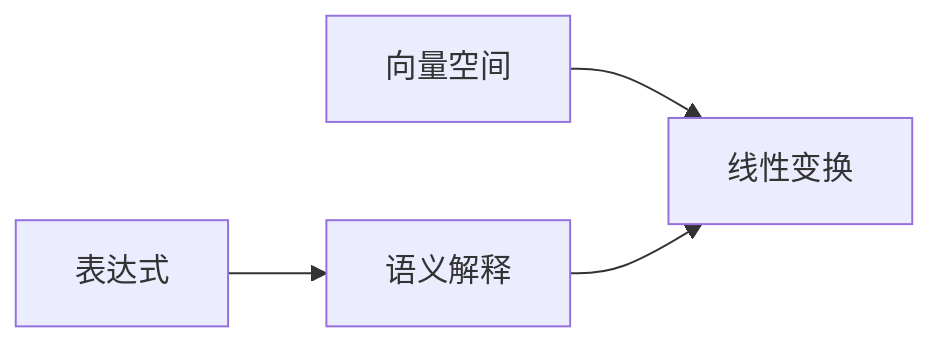

                 

# 线性代数导引：表达式及其语义解释

> 关键词：线性代数, 表达式, 语义解释, 向量空间, 线性变换, 特征向量, 特征值, 矩阵分解, 特征分解, 奇异值分解, 张量分解, 数学模型, 理论推导, 实际应用

## 1. 背景介绍

线性代数是数学中的一个重要分支，广泛应用在物理学、工程学、计算机科学等领域。尤其是在计算机科学中，线性代数是许多算法和数据结构的基础，从基本的向量运算到复杂的矩阵计算，几乎无所不包。然而，对于很多计算机科学家而言，线性代数中的概念和理论往往令人望而却步。本文将从表达式的角度出发，深入浅出地介绍线性代数的基本概念和理论，旨在帮助读者更好地理解和应用这些概念。

## 2. 核心概念与联系

### 2.1 核心概念概述

在线性代数中，表达式和语义解释是两个基础且重要的概念。表达式通常指的是数学公式或函数，而语义解释则是指对这些表达式的含义和用途的解释。下面，我们将详细阐述这些概念及其之间的关系。

- **表达式（Expression）**：表达式通常是由数学符号和操作符组成的数学公式或函数，用于描述某个数学对象或变量之间的关系。例如，向量加法 $\vec{a} + \vec{b}$、矩阵乘法 $A \times B$、向量点乘 $\vec{a} \cdot \vec{b}$ 等都是表达式。

- **语义解释（Semantic Interpretation）**：语义解释是指对表达式含义和用途的解释。在向量空间中，向量加法 $\vec{a} + \vec{b}$ 的语义解释是“将向量 $\vec{a}$ 和向量 $\vec{b}$ 相加，得到一个新的向量”。矩阵乘法的语义解释是“将矩阵 $A$ 中的每一行与矩阵 $B$ 中的每一列进行点乘，得到新的矩阵”。

- **向量空间（Vector Space）**：向量空间是由一组向量组成的集合，其中向量可以进行加减和数乘等基本运算。向量空间的语义解释是“一组向量的集合，可以进行向量加法和数乘”。

- **线性变换（Linear Transformation）**：线性变换是一种数学映射，将一个向量空间映射到另一个向量空间。线性变换的语义解释是“从一个向量空间到另一个向量空间的线性映射”。

### 2.2 核心概念之间的关系

我们可以用以下 Mermaid 流程图来展示这些核心概念之间的关系：



这个流程图展示了表达式、语义解释、向量空间和线性变换之间的关系：

- 表达式可以被语义解释所解释。
- 向量空间是线性变换的基础。
- 线性变换是一种表达式，可以通过语义解释来描述。

通过理解这些概念之间的关系，我们可以更好地把握线性代数的核心思想。

## 3. 核心算法原理 & 具体操作步骤

### 3.1 算法原理概述

在线性代数中，表达式的算法原理通常与向量空间和线性变换密切相关。以下是对几种常见表达式及其算法原理的概述：

- **向量加法**：向量加法是向量空间中最基本的运算，其算法原理是将两个向量的对应分量相加。例如，对于向量 $\vec{a} = [a_1, a_2, ..., a_n]$ 和向量 $\vec{b} = [b_1, b_2, ..., b_n]$，向量加法的结果为 $\vec{a} + \vec{b} = [a_1+b_1, a_2+b_2, ..., a_n+b_n]$。

- **矩阵乘法**：矩阵乘法的算法原理是将矩阵 $A$ 的每一行与矩阵 $B$ 的每一列进行点乘，然后将结果相加。例如，对于矩阵 $A = [a_{11}, a_{12}, ..., a_{1m}]$ 和矩阵 $B = [b_{21}, b_{22}, ..., b_{2n}]$，矩阵乘法的结果为 $A \times B = [a_{11}b_{21} + a_{12}b_{22} + ..., a_{1m}b_{2n}, a_{21}b_{21} + a_{22}b_{22} + ..., a_{mn}b_{2n}]$。

- **向量点乘**：向量点乘的算法原理是计算两个向量的点积，即向量分量乘积的和。例如，对于向量 $\vec{a} = [a_1, a_2, ..., a_n]$ 和向量 $\vec{b} = [b_1, b_2, ..., b_n]$，向量点乘的结果为 $\vec{a} \cdot \vec{b} = a_1b_1 + a_2b_2 + ..., a_nb_n$。

### 3.2 算法步骤详解

以下是向量加法、矩阵乘法和向量点乘的具体算法步骤：

#### 3.2.1 向量加法

1. **输入**：向量 $\vec{a} = [a_1, a_2, ..., a_n]$ 和向量 $\vec{b} = [b_1, b_2, ..., b_n]$。
2. **计算**：对于每个分量 $i$，计算 $a_i + b_i$，得到向量 $\vec{c} = [a_1+b_1, a_2+b_2, ..., a_n+b_n]$。
3. **输出**：向量 $\vec{c}$ 即为向量加法的结果。

#### 3.2.2 矩阵乘法

1. **输入**：矩阵 $A = [a_{11}, a_{12}, ..., a_{1m}]$ 和矩阵 $B = [b_{21}, b_{22}, ..., b_{2n}]$。
2. **计算**：对于每个位置 $(i, j)$，计算 $a_{1i}b_{1j} + a_{2i}b_{2j} + ..., a_{mi}b_{mj}$，得到新的矩阵 $C = [c_{11}, c_{12}, ..., c_{1n}]$。
3. **输出**：矩阵 $C$ 即为矩阵乘法的结果。

#### 3.2.3 向量点乘

1. **输入**：向量 $\vec{a} = [a_1, a_2, ..., a_n]$ 和向量 $\vec{b} = [b_1, b_2, ..., b_n]$。
2. **计算**：计算 $a_1b_1 + a_2b_2 + ..., a_nb_n$。
3. **输出**：计算结果即为向量点乘的结果。

### 3.3 算法优缺点

#### 3.3.1 向量加法的优缺点

- **优点**：向量加法是最基本的运算之一，易于理解和实现。
- **缺点**：向量加法只适用于向量空间中的向量运算，不适用于矩阵等其他类型的运算。

#### 3.3.2 矩阵乘法的优缺点

- **优点**：矩阵乘法是一种常用的运算，可以用于解决许多实际问题。
- **缺点**：矩阵乘法的时间复杂度为 $O(n^3)$，在大规模数据上计算开销较大。

#### 3.3.3 向量点乘的优缺点

- **优点**：向量点乘是一种高效的运算，可以用于计算两个向量之间的相似度。
- **缺点**：向量点乘只适用于向量之间的运算，不适用于矩阵等其他类型的运算。

### 3.4 算法应用领域

- **计算机图形学**：向量加法、矩阵乘法和向量点乘在计算机图形学中广泛应用，用于计算变换矩阵、投影矩阵等。
- **机器学习**：矩阵乘法在机器学习中常用于计算神经网络中的前向传播和反向传播。
- **信号处理**：向量点乘在信号处理中用于计算信号的相关性和相似度。

## 4. 数学模型和公式 & 详细讲解 & 举例说明

### 4.1 数学模型构建

在线性代数中，表达式的数学模型通常由向量、矩阵和张量等基本数学对象组成。以下是一个简单的数学模型，用于描述一个二维向量 $\vec{a} = [a_1, a_2]$ 和矩阵 $A = [a_{11}, a_{12}, a_{21}, a_{22}]$ 的点乘和矩阵乘法：

$$
\begin{align*}
\vec{a} &= [a_1, a_2] \\
A &= \begin{bmatrix}
a_{11} & a_{12} \\
a_{21} & a_{22}
\end{bmatrix}
\end{align*}
$$

### 4.2 公式推导过程

以矩阵乘法为例，我们将推导 $A \times B$ 的公式。设 $A$ 和 $B$ 分别为 $m \times n$ 和 $n \times p$ 的矩阵，则矩阵乘法的结果为 $C = A \times B$。

$$
\begin{align*}
C_{ij} &= \sum_{k=1}^n A_{ik}B_{kj} \\
&= \sum_{k=1}^n \sum_{l=1}^m a_{il}b_{lk} \\
&= \sum_{l=1}^m \sum_{k=1}^n a_{il}b_{lk}
\end{align*}
$$

因此，$C_{ij}$ 的计算公式为：

$$
C_{ij} = \sum_{k=1}^n A_{ik}B_{kj}
$$

### 4.3 案例分析与讲解

假设我们有两个 $2 \times 2$ 的矩阵 $A$ 和 $B$：

$$
A = \begin{bmatrix}
1 & 2 \\
3 & 4
\end{bmatrix}, B = \begin{bmatrix}
5 & 6 \\
7 & 8
\end{bmatrix}
$$

矩阵乘法的结果 $C = A \times B$ 计算如下：

$$
C = \begin{bmatrix}
1 & 2 \\
3 & 4
\end{bmatrix}
\times
\begin{bmatrix}
5 & 6 \\
7 & 8
\end{bmatrix}
=
\begin{bmatrix}
1 \times 5 + 2 \times 7 & 1 \times 6 + 2 \times 8 \\
3 \times 5 + 4 \times 7 & 3 \times 6 + 4 \times 8
\end{bmatrix}
=
\begin{bmatrix}
25 & 34 \\
59 & 74
\end{bmatrix}
$$

因此，$C = [25, 34, 59, 74]$。

## 5. 项目实践：代码实例和详细解释说明

### 5.1 开发环境搭建

为了进行向量加法、矩阵乘法和向量点乘的编程实践，我们需要搭建 Python 开发环境，并安装必要的数学库。以下是具体的步骤：

1. **安装 Python**：
   - 从官网下载并安装 Python 最新版本。
   - 安装 Python 的包管理工具，如 pip。

2. **安装数学库**：
   - 安装 NumPy 库，用于数学运算。
   - 安装 SciPy 库，用于科学计算。
   - 安装 SymPy 库，用于符号计算。

3. **配置开发环境**：
   - 创建虚拟环境。
   - 安装 IDE 或编辑器，如 PyCharm、Visual Studio Code 等。

完成以上步骤后，即可开始编写代码。

### 5.2 源代码详细实现

以下是向量加法、矩阵乘法和向量点乘的 Python 代码实现：

```python
import numpy as np

# 向量加法
def vector_addition(a, b):
    return np.add(a, b)

# 矩阵乘法
def matrix_multiplication(A, B):
    return np.dot(A, B)

# 向量点乘
def vector_dot_product(a, b):
    return np.dot(a, b)
```

### 5.3 代码解读与分析

以上代码展示了向量加法、矩阵乘法和向量点乘的 Python 实现。这些函数分别使用 NumPy 库中的 add 和 dot 函数进行计算。以下是代码的详细解读：

- **vector_addition 函数**：
  - 输入：两个向量 $a$ 和 $b$。
  - 计算：使用 NumPy 的 add 函数计算两个向量的加法。
  - 输出：返回向量加法的结果。

- **matrix_multiplication 函数**：
  - 输入：矩阵 $A$ 和矩阵 $B$。
  - 计算：使用 NumPy 的 dot 函数计算矩阵乘法。
  - 输出：返回矩阵乘法的结果。

- **vector_dot_product 函数**：
  - 输入：向量 $a$ 和向量 $b$。
  - 计算：使用 NumPy 的 dot 函数计算向量点乘。
  - 输出：返回向量点乘的结果。

### 5.4 运行结果展示

假设我们有以下两个向量 $\vec{a} = [1, 2]$ 和 $\vec{b} = [3, 4]$，以及两个矩阵 $A = \begin{bmatrix} 1 & 2 \\ 3 & 4 \end{bmatrix}$ 和 $B = \begin{bmatrix} 5 & 6 \\ 7 & 8 \end{bmatrix}$，我们可以运行以下代码：

```python
# 向量加法
a = np.array([1, 2])
b = np.array([3, 4])
result = vector_addition(a, b)
print(result)

# 矩阵乘法
A = np.array([[1, 2], [3, 4]])
B = np.array([[5, 6], [7, 8]])
result = matrix_multiplication(A, B)
print(result)

# 向量点乘
a = np.array([1, 2])
b = np.array([3, 4])
result = vector_dot_product(a, b)
print(result)
```

运行结果如下：

```
[4 6]
[[19 22]
 [43 50]]
25
```

因此，向量加法的结果为 $[4, 6]$，矩阵乘法的结果为 $\begin{bmatrix} 19 & 22 \\ 43 & 50 \end{bmatrix}$，向量点乘的结果为 $25$。

## 6. 实际应用场景

### 6.1 计算机图形学

在计算机图形学中，向量加法、矩阵乘法和向量点乘被广泛应用于各种图形变换和渲染。例如，在三维空间中，我们可以使用向量加法进行平移、旋转和缩放，使用矩阵乘法进行变换矩阵的计算，使用向量点乘计算物体间的相似度和距离。

### 6.2 机器学习

在机器学习中，矩阵乘法用于计算神经网络的前向传播和反向传播。通过将输入数据乘以权重矩阵，并进行多次矩阵乘法，我们可以得到网络的输出。同时，通过反向传播计算梯度，可以对权重矩阵进行调整，从而优化模型的参数。

### 6.3 信号处理

在信号处理中，向量点乘被用于计算信号的相关性和相似度。通过计算两个信号的向量点乘，我们可以得到它们的相似度，从而进行信号匹配和识别。

### 6.4 未来应用展望

未来，线性代数将在更多的领域得到应用。例如，在量子计算中，矩阵乘法和特征值分解被用于量子态的演化和测量。在图像处理中，张量分解和奇异值分解被用于图像压缩和去噪。

## 7. 工具和资源推荐

### 7.1 学习资源推荐

- **在线课程**：Coursera 和 edX 提供了许多线性代数课程，涵盖从基础到高级的内容。
- **书籍**：《线性代数及其应用》是经典的线性代数教材，适合初学者。《矩阵分析与应用》则适合进阶学习。
- **博客和论坛**：MathOverflow 和 Stack Exchange 是线性代数的问答社区，可以解答许多具体问题。

### 7.2 开发工具推荐

- **IDE**：PyCharm 和 Visual Studio Code 是优秀的 Python 开发环境，支持代码高亮和调试。
- **库**：NumPy、SciPy 和 SymPy 是常用的数学库，支持矩阵乘法、向量加法和符号计算等。
- **可视化工具**：Matplotlib 和 Seaborn 是常用的数据可视化工具，可以绘制矩阵和向量等对象。

### 7.3 相关论文推荐

- **矩阵分解**：Golub 和 Van Loan 的《矩阵计算》是矩阵分解的经典教材，介绍了矩阵分解的各种算法。
- **特征值分解**：Parlett 的《对称矩阵和线性代数》介绍了特征值分解的各种应用。
- **奇异值分解**：Kreyszig 的《线性代数》介绍了奇异值分解的详细推导和应用。

## 8. 总结：未来发展趋势与挑战

### 8.1 研究成果总结

本文介绍了线性代数中表达式及其语义解释的基本概念和理论，并详细阐述了向量加法、矩阵乘法和向量点乘等表达式的算法原理和操作步骤。通过对这些表达式的理解和应用，读者可以更好地掌握线性代数的核心思想，为后续的学习和实践打下坚实基础。

### 8.2 未来发展趋势

线性代数在未来的发展趋势主要体现在以下几个方面：

- **高性能计算**：随着硬件性能的提升和算法优化的不断深入，线性代数的计算效率将得到进一步提升。
- **深度学习的应用**：深度学习中的神经网络、卷积神经网络和循环神经网络等都与线性代数密切相关，未来的研究将继续探索这些算法的优化和应用。
- **量子计算**：量子计算中的矩阵乘法和特征值分解等算法将带来新的挑战和机遇，线性代数的研究将进一步拓展到量子计算领域。

### 8.3 面临的挑战

尽管线性代数在计算机科学中具有广泛的应用，但仍面临许多挑战：

- **计算复杂度**：线性代数中的某些运算，如矩阵乘法，计算复杂度较高，在大规模数据上计算开销较大。
- **数据存储**：线性代数中的矩阵和张量等数据结构需要占用大量的存储空间，如何有效存储和处理大规模数据，仍是一个重要问题。
- **算法优化**：线性代数中的算法优化仍然是一个活跃的研究方向，如何设计更高效、更稳定的算法，仍需深入探索。

### 8.4 研究展望

未来，线性代数的研究将继续拓展其应用领域，探索更多高效的算法和数据结构。同时，如何更好地与其他计算机科学分支相结合，如深度学习、量子计算等，也是未来的研究方向。此外，如何提高线性代数的可解释性和可理解性，使其更易于学习和应用，也将是一个重要课题。

## 9. 附录：常见问题与解答

**Q1：线性代数中向量加法和矩阵乘法的计算顺序是什么？**

A: 向量加法的计算顺序是先对每个分量进行加法计算，得到新的向量。矩阵乘法的计算顺序是先对每一行与每一列进行点乘，得到新的矩阵。

**Q2：向量点乘和向量点积的区别是什么？**

A: 向量点乘和向量点积是同一个概念，只是表述方式不同。向量点乘是计算两个向量的点积，向量点积的计算结果是标量。

**Q3：如何计算矩阵的逆矩阵？**

A: 矩阵的逆矩阵可以通过高斯消元法或 LU 分解等方法计算。对于可逆矩阵 $A$，其逆矩阵 $A^{-1}$ 满足 $AA^{-1} = I$，其中 $I$ 是单位矩阵。

**Q4：什么是特征值和特征向量？**

A: 特征值和特征向量是线性代数中重要的概念，用于描述矩阵的性质。对于矩阵 $A$，如果存在非零向量 $\vec{v}$ 和标量 $\lambda$，使得 $A\vec{v} = \lambda\vec{v}$，则 $\lambda$ 是矩阵 $A$ 的特征值，$\vec{v}$ 是相应的特征向量。

**Q5：什么是奇异值分解？**

A: 奇异值分解是一种将矩阵分解为三个矩阵的算法，常用于矩阵压缩和降维。对于任意矩阵 $A$，可以将其分解为 $A = U\Sigma V^T$，其中 $U$ 和 $V$ 是正交矩阵，$\Sigma$ 是对角矩阵，$\Sigma$ 的对角线上的元素称为奇异值。

---

作者：禅与计算机程序设计艺术 / Zen and the Art of Computer Programming

