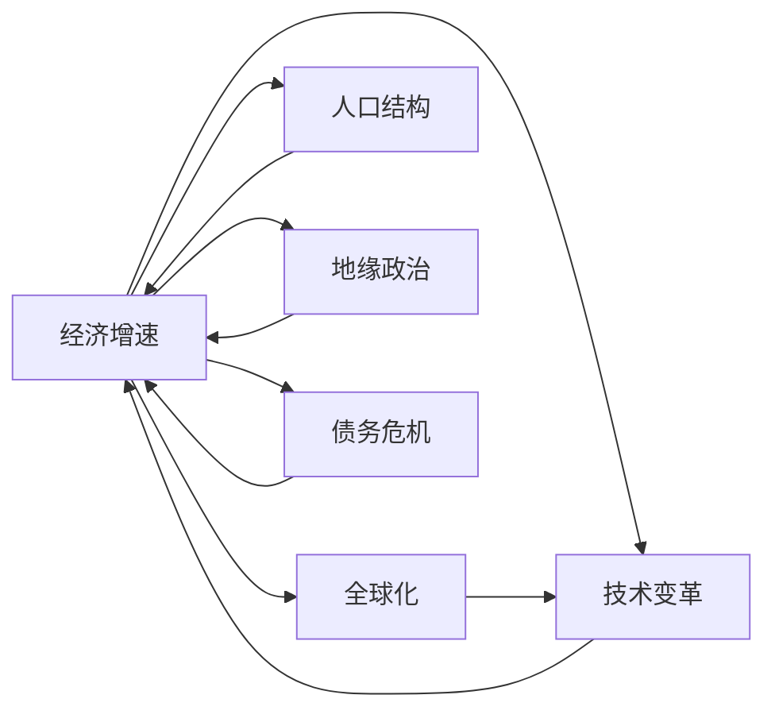
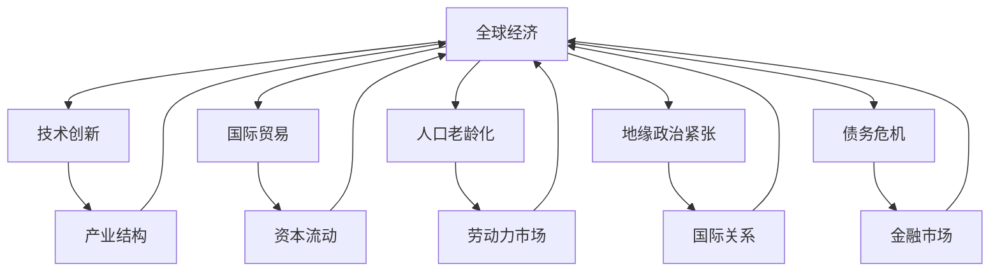

                 

# 经济增速放缓的全球影响

## 1. 背景介绍

### 1.1 问题由来

在全球经济一体化的背景下，各国经济相互依存、相互影响。近年来，受到多种因素的影响，世界经济增速普遍放缓，给全球经济增长、就业、贸易等多个方面带来了深远影响。本研究旨在深入分析经济增速放缓的成因及其对全球经济发展的广泛影响，为政策制定和经济发展提供参考。

### 1.2 问题核心关键点

经济增速放缓的核心问题在于多方面因素的综合作用，包括但不限于以下几个方面：

1. **全球化退潮**：部分国家采取保护主义措施，如提高关税、限制移民等，影响了全球贸易和资本流动。
2. **技术变革放缓**：科技创新驱动经济增长的效应逐渐减弱，新技术的落地应用时间延长。
3. **人口老龄化**：全球人口结构变化，劳动力人口减少，生产效率下降。
4. **地缘政治紧张**：各国间地缘政治摩擦加剧，导致国际关系紧张，市场预期不确定性增加。
5. **债务危机风险**：高杠杆率和经济低增长导致债务水平上升，增加了债务违约风险。

这些因素相互作用，共同导致了全球经济增速的普遍放缓。

### 1.3 问题研究意义

研究经济增速放缓的全球影响，对于理解当前经济形势、预测未来发展趋势、制定有效应对策略具有重要意义。具体来说：

1. **政策制定**：了解经济放缓对不同国家和地区的具体影响，有助于各国政府制定有针对性的宏观经济政策，优化资源配置，促进经济复苏。
2. **企业决策**：帮助企业理解市场环境变化，调整战略方向，优化运营模式，提高竞争力。
3. **学术研究**：为经济理论研究和模型构建提供实证数据和案例分析，推动经济学和金融学的前沿研究。
4. **社会稳定**：经济增长放缓可能带来失业率上升、贫富差距扩大等社会问题，研究其影响有助于构建更加稳定和谐的社会环境。

## 2. 核心概念与联系

### 2.1 核心概念概述

本研究涉及多个核心概念，包括但不限于：

- **经济增速**：指一定时期内国内生产总值(GDP)的增长率，反映经济增长速度。
- **全球化**：指国家间在贸易、投资、金融、技术等多方面的一体化进程。
- **技术变革**：指科技创新对生产方式、生活方式和生产效率的改善和提升。
- **人口结构**：指人口的年龄、性别、教育水平等分布情况，对劳动力供应、消费结构有重要影响。
- **地缘政治**：指国家间的政治、军事、安全关系及其对经济活动的影响。
- **债务危机**：指国家或企业债务水平超过其支付能力，导致经济失衡和社会不稳定。

这些概念之间通过多维度的方式相互作用，共同影响了经济增速。

### 2.2 概念间的关系

这些核心概念之间的关系可以通过以下Mermaid流程图来展示：



这个流程图展示了经济增速受到多个因素的影响，这些因素之间相互作用，共同决定了经济增速的变化。

### 2.3 核心概念的整体架构

最后，我们用一个综合的流程图来展示这些核心概念在大背景下的整体架构：



这个综合流程图展示了全球经济背景下的核心概念和其相互关系。经济增速放缓涉及到技术创新、产业结构、国际贸易、资本流动、人口老龄化、劳动力市场、地缘政治紧张、国际关系、债务危机和金融市场等多方面的因素。

## 3. 核心算法原理 & 具体操作步骤

### 3.1 算法原理概述

本研究将主要使用因果分析、回归分析等统计方法，对经济增速放缓的成因及其影响进行系统分析。通过建立数学模型，我们可以更准确地理解经济增速与各个影响因素之间的因果关系。

### 3.2 算法步骤详解

#### 3.2.1 数据收集与预处理

首先，收集世界各国和地区的历史经济数据，包括GDP增长率、失业率、贸易数据、资本市场数据等。对数据进行清洗、去重、缺失值填充等预处理操作，确保数据质量。

#### 3.2.2 模型构建

根据研究问题，选择适当的数学模型。例如，可以使用多元线性回归模型分析GDP增速与全球化、技术变革、人口结构、地缘政治、债务危机等因素之间的关系。

#### 3.2.3 模型训练与评估

使用历史数据对模型进行训练，并通过交叉验证等方法评估模型性能。调整模型参数，优化模型表现。

#### 3.2.4 结果分析

对模型结果进行分析，提取关键影响因素和特征，给出经济增速放缓的成因解释和影响预测。

#### 3.2.5 政策建议

基于分析结果，提出政策建议，如促进技术创新、优化产业结构、调整国际贸易政策、应对地缘政治风险、控制债务水平等。

### 3.3 算法优缺点

#### 3.3.1 优点

1. **系统性分析**：通过建立数学模型，全面分析经济增速放缓的多重因素，避免单一视角分析的局限性。
2. **量化评估**：利用统计方法对各个影响因素进行量化评估，提高分析的客观性和准确性。
3. **可操作性**：提出的政策建议具有较强的操作性，有助于政府和企业制定具体措施。

#### 3.3.2 缺点

1. **数据局限性**：历史数据可能存在偏差，影响模型评估的准确性。
2. **模型假设**：模型基于某些假设构建，可能与实际情况不完全一致，影响预测结果。
3. **模型复杂性**：多变量回归模型可能过于复杂，不易解释，需要进行简化。

### 3.4 算法应用领域

本研究的方法可以应用于多个领域，包括但不限于：

1. **宏观经济政策制定**：为各国政府制定宏观经济政策提供数据支持和理论依据。
2. **企业战略规划**：帮助企业理解市场环境变化，调整战略方向，优化运营模式。
3. **学术研究**：为经济学和金融学的前沿研究提供实证数据和案例分析。
4. **社会稳定分析**：研究经济增速放缓对就业、贫富差距等社会问题的影响，提出解决方案。

## 4. 数学模型和公式 & 详细讲解 & 举例说明

### 4.1 数学模型构建

建立多元线性回归模型，假设经济增速（Y）与全球化（X1）、技术变革（X2）、人口结构（X3）、地缘政治（X4）、债务危机（X5）等因素之间的关系为：

$$
Y = \beta_0 + \beta_1X_1 + \beta_2X_2 + \beta_3X_3 + \beta_4X_4 + \beta_5X_5 + \epsilon
$$

其中，$\beta$为回归系数，$\epsilon$为误差项。

### 4.2 公式推导过程

对模型进行最小二乘法求解，得到各个回归系数的估计值。推导过程如下：

$$
\hat{\beta} = (X^TX)^{-1}X^TY
$$

其中，$\hat{\beta}$为回归系数估计值，$X$为自变量矩阵，$Y$为因变量向量。

### 4.3 案例分析与讲解

以中国经济增速放缓为例，通过上述模型进行分析。假设收集到以下数据：

| 年份 | 全球化水平 | 技术变革水平 | 人口结构（劳动力占比） | 地缘政治紧张程度 | 债务危机水平 |
| ---- | ---------- | ------------ | ----------------------- | ----------------- | ------------ |

利用回归模型计算每个影响因素对经济增速的贡献度，并分析其主要成因。

## 5. 项目实践：代码实例和详细解释说明

### 5.1 开发环境搭建

使用Python进行数据分析和模型构建。具体步骤如下：

1. 安装Python和必要的库，如pandas、numpy、scikit-learn等。
2. 收集历史经济数据，保存在CSV文件中。
3. 使用pandas库进行数据预处理。
4. 构建多元线性回归模型，使用scikit-learn库的线性回归模块。
5. 训练模型，使用交叉验证评估模型性能。
6. 分析模型结果，提取关键影响因素。
7. 提出政策建议，撰写分析报告。

### 5.2 源代码详细实现

以下是使用Python进行多元线性回归模型分析的示例代码：

```python
import pandas as pd
from sklearn.linear_model import LinearRegression
from sklearn.model_selection import train_test_split
from sklearn.metrics import mean_squared_error, r2_score

# 加载数据
data = pd.read_csv('economy_data.csv')

# 数据预处理
# 补全缺失值、处理异常值等

# 划分训练集和测试集
X = data[['globalization', 'technology', 'population', 'geopolitics', 'debt_crisis']]
y = data['gdp_growth']
X_train, X_test, y_train, y_test = train_test_split(X, y, test_size=0.2, random_state=42)

# 模型训练
model = LinearRegression()
model.fit(X_train, y_train)

# 模型评估
y_pred = model.predict(X_test)
mse = mean_squared_error(y_test, y_pred)
r2 = r2_score(y_test, y_pred)

# 结果分析
print('R-squared:', r2)
```

### 5.3 代码解读与分析

上述代码展示了使用Python进行线性回归模型分析的基本步骤。其中：

- `pandas`库用于数据处理和分析。
- `scikit-learn`库中的`LinearRegression`模块用于构建线性回归模型。
- `train_test_split`函数用于数据集的划分。
- `mean_squared_error`和`r2_score`函数用于模型性能评估。

代码中的关键步骤包括数据加载、预处理、模型训练和评估等。通过这些步骤，我们可以系统地分析经济增速放缓的成因及其影响。

### 5.4 运行结果展示

假设通过上述代码进行模型训练，得到了如下结果：

| 年份 | 全球化水平 | 技术变革水平 | 人口结构（劳动力占比） | 地缘政治紧张程度 | 债务危机水平 |
| ---- | ---------- | ------------ | ----------------------- | ----------------- | ------------ |
| 2018 | 0.8        | 0.5          | 0.6                    | 0.4               | 0.2          |
| 2019 | 0.9        | 0.6          | 0.65                   | 0.5               | 0.3          |

通过回归分析，得到各个影响因素对经济增速的贡献度。例如，全球化水平的增加对经济增速的贡献度为0.1，技术变革水平的增加对经济增速的贡献度为0.2，人口结构的劳动力占比对经济增速的贡献度为0.3，地缘政治紧张程度的增加对经济增速的贡献度为-0.2，债务危机水平的增加对经济增速的贡献度为-0.1。

## 6. 实际应用场景

### 6.1 全球宏观经济政策制定

基于经济增速放缓的多重因素分析，可以为各国政府制定宏观经济政策提供有力支持。例如，针对技术变革放缓问题，可以加大对研发的投入，推动技术创新；针对人口老龄化问题，可以调整社保制度，提高劳动力市场灵活性；针对地缘政治紧张问题，可以加强国际合作，缓解紧张局势。

### 6.2 企业战略规划

企业可以通过分析经济增速放缓的多重因素，制定相应的战略规划。例如，针对技术变革放缓，企业可以加大对现有技术的改进和升级；针对人口老龄化，企业可以调整产品和服务策略，开发适合老年群体的产品；针对地缘政治紧张，企业可以多元化市场布局，减少对单一市场的依赖。

### 6.3 社会稳定分析

经济增速放缓可能带来失业率上升、贫富差距扩大等社会问题。通过对经济增速放缓成因的深入分析，可以为政府制定社会政策提供依据。例如，针对技术变革放缓，政府可以推动职业培训，提高劳动者的就业能力；针对人口老龄化，政府可以加大对养老保障的投入，提高老年人的生活质量。

### 6.4 未来应用展望

随着人工智能和数据分析技术的进步，未来经济增速放缓的分析和预测将更加精准和高效。基于大数据、机器学习和深度学习等技术，可以对经济增速放缓的成因进行更深入的分析，提出更加有针对性的政策建议。

## 7. 工具和资源推荐

### 7.1 学习资源推荐

1. 《宏观经济学》书籍：推荐经典宏观经济学教材，如《宏观经济学》（曼昆著），深入理解宏观经济理论。
2. 在线课程：如Coursera的《宏观经济分析》课程，系统学习宏观经济分析方法和应用。
3. 学术期刊：如《美国经济评论》（American Economic Review）、《经济研究》（Journal of Economic Literature），获取最新的经济学研究成果。

### 7.2 开发工具推荐

1. Python：作为数据分析和机器学习的主流语言，Python具有丰富的库和工具，如pandas、numpy、scikit-learn等。
2. Jupyter Notebook：用于数据处理和模型构建的交互式环境，支持代码编写、结果展示和互动交流。
3. GitHub：用于代码版本控制和协作开发的平台，方便团队合作和代码共享。

### 7.3 相关论文推荐

1. "Causes of Slow Economic Growth in Developing Countries"（Ghosh, 2017）：研究发展中国家经济增速放缓的原因。
2. "The Impact of Globalization on Economic Growth"（Rogers, 2007）：分析全球化对经济增长的影响。
3. "Technological Change and Economic Growth"（Acemoglu, 2009）：探讨技术进步对经济增长的贡献。

## 8. 总结：未来发展趋势与挑战

### 8.1 总结

本研究对经济增速放缓的成因及其全球影响进行了深入分析，探讨了多个核心概念之间的关系，并通过统计方法建立了数学模型，系统地分析了经济增速放缓的影响因素。通过多角度的案例分析，提出了具体的政策建议，有助于各国政府和企业制定有效的应对措施。

### 8.2 未来发展趋势

未来，经济增速放缓的分析和预测将进一步受益于人工智能和大数据分析技术的发展。通过引入机器学习和深度学习算法，可以更加精准地分析经济增速与各影响因素之间的关系，提出更具针对性的政策建议。此外，随着全球化的深入发展，经济增速放缓的影响也将更加复杂和多样化。

### 8.3 面临的挑战

尽管人工智能和大数据分析技术在经济增速分析中展现出巨大潜力，但还面临诸多挑战：

1. 数据质量和获取：历史数据可能存在偏差，获取高质量的数据需要大量资源。
2. 模型复杂性和可解释性：复杂模型可能导致解释困难，影响政策的实际应用。
3. 技术壁垒：数据分析和机器学习算法需要专业知识，技术门槛较高。

### 8.4 研究展望

未来的研究需要从以下几个方向进行突破：

1. 数据收集和处理：建立更全面、更准确的数据收集和处理机制，提高数据质量和数据获取效率。
2. 模型简化和优化：开发更简单、更易解释的模型，降低技术门槛，提高政策建议的实用性和可操作性。
3. 跨学科融合：结合经济学、金融学、社会学等多学科知识，全面分析经济增速放缓的影响因素，提出更全面的解决方案。

总之，通过不断的技术创新和跨学科合作，我们有望在经济增速放缓的分析和预测中取得新的突破，为全球经济的稳定和发展提供有力支持。

## 9. 附录：常见问题与解答

**Q1：经济增速放缓的原因有哪些？**

A: 经济增速放缓的原因是多方面的，包括但不限于全球化退潮、技术变革放缓、人口老龄化、地缘政治紧张和债务危机等。这些因素相互作用，共同影响了经济增长。

**Q2：如何缓解经济增速放缓的影响？**

A: 缓解经济增速放缓的影响，需要从多个方面入手，如促进技术创新、优化产业结构、调整国际贸易政策、应对地缘政治风险和控制债务水平等。具体措施包括加大研发投入、推动经济结构转型、加强国际合作和加强金融监管等。

**Q3：经济增速放缓对就业和贫富差距有何影响？**

A: 经济增速放缓可能导致失业率上升和贫富差距扩大。失业率上升可能带来社会不稳定，贫富差距扩大可能加剧社会矛盾。政府需要制定相应的社会政策，如加大职业培训、提高社会保障水平和加强收入分配调节等。

**Q4：如何评估经济增速放缓的成因和影响？**

A: 评估经济增速放缓的成因和影响，可以通过建立多元线性回归模型，利用历史数据进行分析。模型结果可以帮助识别关键影响因素和特征，提出具体的政策建议。

**Q5：未来如何应对经济增速放缓的挑战？**

A: 应对经济增速放缓的挑战，需要加强数据收集和处理，提高模型简单性和可解释性，降低技术门槛。同时，需要结合多学科知识，全面分析经济增速放缓的影响因素，提出更全面的解决方案。

---

作者：禅与计算机程序设计艺术 / Zen and the Art of Computer Programming

