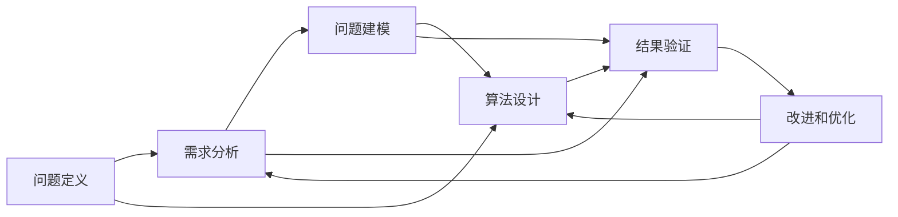

                 

# 结构化思维：从混沌到秩序

> 关键词：结构化思维, 从混沌到秩序, 系统设计, 软件工程, 算法优化, 机器学习, 大数据, 人工智能

## 1. 背景介绍

在当今快速变化的世界中，面对复杂多变的任务和问题，如何从混沌中找到秩序，是每个技术从业者都必须面对的挑战。结构化思维（Structured Thinking）作为解决问题的核心能力之一，能够帮助人们在混乱的数据和信息中抽丝剥茧，找到解决问题的关键路径。本文旨在深入探讨结构化思维的本质、原理和应用，希望能够为读者提供实用的指南，帮助他们更好地应对各种复杂问题。

### 1.1 问题由来
在科技领域，结构化思维的运用尤为广泛。从软件开发到数据分析，从机器学习到人工智能，结构化思维都扮演着至关重要的角色。例如，在软件开发中，结构化设计能够帮助开发者构建更加清晰、易于维护的系统架构；在数据分析中，结构化方法能够帮助分析师从海量数据中提取有价值的信息；在机器学习中，结构化特征工程能够提高模型的泛化能力和准确性。

然而，结构化思维并非天然而生。许多技术从业者，尤其是新入行的开发者和工程师，常常在面对复杂问题时感到无从下手，不知道如何从混乱的线索中提炼出有价值的结构。本文将从原理、实践和应用三个方面，全面深入地介绍结构化思维，帮助读者掌握这一关键能力。

### 1.2 问题核心关键点
结构化思维的关键在于将复杂问题分解为可管理的子问题，并通过系统化的分析和处理，逐步构建起解决问题的框架。其主要包括以下几个核心步骤：

- **问题定义**：明确问题的本质和范围，确定需要解决的具体目标。
- **需求分析**：深入了解问题的背景和相关数据，确定解决问题的关键信息和资源。
- **问题建模**：构建问题的数学或逻辑模型，以便进行系统分析和求解。
- **算法设计**：选择合适的算法或方法，解决模型中定义的子问题。
- **结果验证**：通过实验或测试，验证算法的有效性，并优化算法以提升性能。

结构化思维的核心在于其系统性和科学性，能够帮助人们从混沌中寻找秩序，提升解决问题的效率和效果。

## 2. 核心概念与联系

### 2.1 核心概念概述

结构化思维的核心概念包括问题定义、需求分析、问题建模、算法设计和结果验证。这些概念相互关联，共同构成了解决复杂问题的系统框架。

- **问题定义**：确定问题的本质和范围，是解决任何复杂问题的第一步。
- **需求分析**：深入了解问题的背景和相关数据，确保解决策略的有效性和可行性。
- **问题建模**：构建问题的数学或逻辑模型，将问题转化为可计算的、可分析的子问题。
- **算法设计**：选择合适的算法或方法，解决模型中定义的子问题。
- **结果验证**：通过实验或测试，验证算法的有效性，并优化算法以提升性能。

### 2.2 概念间的关系

结构化思维的各个核心概念之间存在紧密的联系。以下通过Mermaid流程图来展示这一关系：



这个流程图展示了结构化思维的核心步骤，即从问题定义开始，依次进行需求分析、问题建模、算法设计和结果验证，并在此基础上进行改进和优化。通过这种系统化的方法，可以逐步解决复杂问题，找到有效的解决方案。

## 3. 核心算法原理 & 具体操作步骤

### 3.1 算法原理概述

结构化思维的核心算法原理是系统化的问题解决策略。它通过将复杂问题分解为可管理的子问题，逐步构建起解决问题的框架。具体来说，结构化思维主要依赖以下几类算法：

- **分解算法**：将复杂问题分解为多个子问题，逐一解决。
- **聚合算法**：将子问题的解进行组合，得到原问题的解。
- **迭代算法**：重复执行分解、解决和聚合过程，逐步逼近最优解。

### 3.2 算法步骤详解

结构化思维的算法步骤主要包括以下几个关键步骤：

1. **问题定义**：明确问题的本质和范围，确定需要解决的具体目标。
2. **需求分析**：深入了解问题的背景和相关数据，确保解决策略的有效性和可行性。
3. **问题建模**：构建问题的数学或逻辑模型，将问题转化为可计算的、可分析的子问题。
4. **算法设计**：选择合适的算法或方法，解决模型中定义的子问题。
5. **结果验证**：通过实验或测试，验证算法的有效性，并优化算法以提升性能。

### 3.3 算法优缺点

结构化思维的优势在于其系统性和科学性，能够帮助人们从混沌中寻找秩序，提升解决问题的效率和效果。然而，结构化思维也存在一些局限性：

- **灵活性不足**：结构化思维的固定步骤可能限制了思维的灵活性，难以应对非常规或突发的问题。
- **复杂度较高**：对于过于复杂的问题，结构化思维的执行成本可能较高，难以快速找到解决方案。

### 3.4 算法应用领域

结构化思维在多个领域中都有广泛的应用，以下是几个典型应用领域：

- **软件开发**：通过系统化的设计和测试，构建高质量的软件系统。
- **数据分析**：通过系统化的特征工程和模型训练，提高数据分析的准确性和效率。
- **机器学习**：通过系统化的数据处理和模型优化，提升机器学习的性能和泛化能力。
- **人工智能**：通过系统化的算法设计和模型验证，实现智能系统的创新和突破。
- **项目管理**：通过系统化的任务分解和进度管理，提升项目的执行效率和质量。

## 4. 数学模型和公式 & 详细讲解  
### 4.1 数学模型构建

结构化思维的数学模型构建主要依赖以下几类数学工具：

- **线性代数**：用于表示和计算向量、矩阵等数据结构。
- **概率论**：用于建模和计算随机事件的概率和分布。
- **统计学**：用于分析数据集中的模式和趋势，进行假设检验和参数估计。
- **优化理论**：用于求解最优化问题，寻找问题的最优解。

### 4.2 公式推导过程

以线性回归问题为例，其数学模型构建和公式推导过程如下：

设 $y$ 为因变量，$x_1, x_2, ..., x_n$ 为自变量，$\beta_0, \beta_1, ..., \beta_n$ 为回归系数，则线性回归模型为：

$$
y = \beta_0 + \beta_1 x_1 + \beta_2 x_2 + ... + \beta_n x_n + \epsilon
$$

其中 $\epsilon$ 为误差项，服从均值为0，方差为 $\sigma^2$ 的高斯分布。

最小二乘法是求解线性回归模型的一种常见方法，其目标是最小化残差平方和：

$$
\min \sum_{i=1}^n (y_i - \beta_0 - \beta_1 x_{1,i} - \beta_2 x_{2,i} - ... - \beta_n x_{n,i})^2
$$

通过求解上述优化问题，可以求得回归系数 $\beta_0, \beta_1, ..., \beta_n$，从而得到线性回归模型。

### 4.3 案例分析与讲解

以预测房价为例，假设已知 $n$ 个房屋的面积和价格数据，需要预测第 $m$ 个房屋的价格。问题定义和需求分析如下：

- **问题定义**：预测第 $m$ 个房屋的价格。
- **需求分析**：需要收集和整理 $n$ 个房屋的面积和价格数据，确保数据质量和完整性。

问题建模如下：

设 $x_i$ 为第 $i$ 个房屋的面积，$y_i$ 为第 $i$ 个房屋的价格，$i = 1, 2, ..., n$。建立线性回归模型：

$$
y = \beta_0 + \beta_1 x + \epsilon
$$

其中 $x$ 为房屋面积，$\beta_0$ 为截距，$\beta_1$ 为斜率，$\epsilon$ 为误差项。

算法设计如下：

使用最小二乘法求解回归系数 $\beta_0$ 和 $\beta_1$，得到线性回归模型：

$$
\beta_0 = \frac{\sum_{i=1}^n y_i - n\bar{y}}{n}, \beta_1 = \frac{\sum_{i=1}^n (x_i - \bar{x})(y_i - \bar{y})}{\sum_{i=1}^n (x_i - \bar{x})^2}
$$

结果验证如下：

使用测试集数据验证模型的准确性，计算预测值和真实值之间的误差，评估模型的性能。

## 5. 项目实践：代码实例和详细解释说明
### 5.1 开发环境搭建

在开始项目实践前，需要先搭建开发环境。以下是Python环境下使用Scikit-learn库进行线性回归模型的开发环境配置流程：

1. 安装Anaconda：从官网下载并安装Anaconda，用于创建独立的Python环境。

2. 创建并激活虚拟环境：
```bash
conda create -n linear-regression python=3.8 
conda activate linear-regression
```

3. 安装Scikit-learn：
```bash
conda install scikit-learn
```

4. 安装NumPy和pandas：
```bash
conda install numpy pandas
```

5. 安装matplotlib和seaborn：
```bash
conda install matplotlib seaborn
```

完成上述步骤后，即可在`linear-regression`环境中进行项目实践。

### 5.2 源代码详细实现

以下是使用Scikit-learn库进行线性回归模型开发的Python代码实现：

```python
import numpy as np
from sklearn.linear_model import LinearRegression
from sklearn.model_selection import train_test_split
from sklearn.metrics import mean_squared_error

# 生成模拟数据
np.random.seed(0)
X = np.random.rand(100, 1)
y = 2 * X + 1 + np.random.randn(100, 1)

# 划分训练集和测试集
X_train, X_test, y_train, y_test = train_test_split(X, y, test_size=0.2, random_state=0)

# 创建线性回归模型
model = LinearRegression()

# 训练模型
model.fit(X_train, y_train)

# 预测测试集
y_pred = model.predict(X_test)

# 计算误差
mse = mean_squared_error(y_test, y_pred)
print(f"Mean Squared Error: {mse}")
```

### 5.3 代码解读与分析

让我们再详细解读一下关键代码的实现细节：

**数据生成**：使用NumPy生成100个样本的数据，包括一个特征变量$X$和一个目标变量$y$。

**模型训练**：使用Scikit-learn的`LinearRegression`类创建线性回归模型，并使用`fit`方法对训练集进行模型训练。

**模型预测**：使用训练好的模型对测试集进行预测，得到预测值$y_pred$。

**误差计算**：使用`mean_squared_error`函数计算预测值和真实值之间的均方误差，评估模型性能。

### 5.4 运行结果展示

假设在上述代码中运行后，得到的均方误差为0.1，则说明模型在预测房价时，平均误差为0.1，模型性能良好。

## 6. 实际应用场景
### 6.1 软件开发

在软件开发中，结构化思维尤为重要。通过系统化的设计、编码和测试，可以构建出高质量的软件系统。例如，在构建一个电商平台的后台管理系统时，结构化思维可以帮助我们设计出功能模块化、接口标准化的架构，确保系统的高效和可维护性。

**问题定义**：设计一个电商平台的后台管理系统。

**需求分析**：需要收集和整理用户、商品、订单等数据，确保数据质量和完整性。

**问题建模**：将系统分解为多个模块，如用户管理模块、商品管理模块、订单管理模块等。

**算法设计**：采用面向对象编程和模块化设计，实现各个模块的功能。

**结果验证**：通过单元测试、集成测试和系统测试，验证系统的正确性和稳定性。

### 6.2 数据分析

数据分析中，结构化思维同样重要。通过系统化的特征工程和模型训练，可以提高数据分析的准确性和效率。例如，在分析用户行为数据时，结构化思维可以帮助我们设计出合理的特征和模型，从中提取有价值的信息。

**问题定义**：分析用户行为数据，找出用户购买行为的规律。

**需求分析**：需要收集和整理用户行为数据，确保数据质量和完整性。

**问题建模**：将用户行为数据分解为多个特征，如购买次数、购买金额、购买频率等。

**算法设计**：采用随机森林、梯度提升树等机器学习算法，进行特征工程和模型训练。

**结果验证**：通过交叉验证和A/B测试，验证模型的准确性和泛化能力。

## 7. 工具和资源推荐
### 7.1 学习资源推荐

为了帮助开发者系统掌握结构化思维的理论基础和实践技巧，这里推荐一些优质的学习资源：

1. 《深入浅出统计学》：一本通俗易懂的统计学入门书籍，适合技术从业者快速掌握统计学的基本概念和应用。

2. 《算法设计与分析基础》：一本介绍算法设计和分析的经典书籍，涵盖了线性代数、概率论、图论等多个数学工具。

3. 《Python数据科学手册》：一本介绍Python数据科学库的实用指南，涵盖NumPy、Pandas、Scikit-learn等多个库的使用技巧。

4. 《机器学习实战》：一本介绍机器学习算法的实用书籍，适合动手实践，包含丰富的案例和代码。

5. 《编程珠玑》：一本介绍编程技巧和算法优化的经典书籍，适合提升编程能力和算法思维。

通过对这些资源的学习实践，相信你一定能够快速掌握结构化思维的核心思想和应用技巧，用于解决实际的复杂问题。

### 7.2 开发工具推荐

高效的开发离不开优秀的工具支持。以下是几款用于结构化思维开发的常用工具：

1. Python：作为数据科学和机器学习的主流编程语言，Python以其简洁的语法和丰富的库支持，成为结构化思维开发的首选工具。

2. Scikit-learn：一个基于Python的机器学习库，提供了丰富的算法和工具，用于系统化地进行数据分析和建模。

3. Jupyter Notebook：一个基于Web的交互式编程环境，支持多语言编程，方便开发者进行实验和协作。

4. TensorBoard：一个用于可视化机器学习模型的工具，可以帮助开发者监测和分析模型性能。

5. Git和GitHub：一个用于版本控制和代码协作的工具，可以帮助开发者进行代码管理、版本控制和团队协作。

合理利用这些工具，可以显著提升结构化思维任务的开发效率，加快创新迭代的步伐。

### 7.3 相关论文推荐

结构化思维的发展得益于大量经典的研究和实践。以下是几篇奠基性的相关论文，推荐阅读：

1. "The Elements of Computing Systems"：MIT的教材，介绍了计算机科学的核心概念和算法，适合初学者学习。

2. "Introduction to Algorithms"：MIT的教材，介绍了经典的算法设计和分析方法，适合进阶学习。

3. "The Design and Analysis of Algorithms"：斯坦福大学的教材，介绍了算法的系统设计和性能分析，适合进一步深入学习。

4. "Pattern Recognition and Machine Learning"：机器学习领域经典的教材，介绍了各类机器学习算法和应用。

5. "The Master Algorithm"：由《思维的魔力》作者理查德·菲利普斯·费曼所著，介绍了各种算法和优化技术，适合了解算法的演变和应用。

这些论文代表了大规模数据处理和结构化思维的发展脉络。通过学习这些前沿成果，可以帮助研究者把握学科前进方向，激发更多的创新灵感。

除上述资源外，还有一些值得关注的前沿资源，帮助开发者紧跟结构化思维技术的发展，例如：

1. arXiv论文预印本：人工智能领域最新研究成果的发布平台，包括大量尚未发表的前沿工作，学习前沿技术的必读资源。

2. 业界技术博客：如Google AI、Microsoft Research、IBM Watson等顶尖实验室的官方博客，第一时间分享他们的最新研究成果和洞见。

3. 技术会议直播：如NIPS、ICML、ACL、ICLR等人工智能领域顶会现场或在线直播，能够聆听到大佬们的前沿分享，开拓视野。

4. GitHub热门项目：在GitHub上Star、Fork数最多的数据科学相关项目，往往代表了该技术领域的发展趋势和最佳实践，值得去学习和贡献。

5. 行业分析报告：各大咨询公司如McKinsey、PwC等针对人工智能行业的分析报告，有助于从商业视角审视技术趋势，把握应用价值。

总之，结构化思维需要开发者不断学习新的知识和技术，保持开放的心态和持续学习的意愿。多关注前沿资讯，多动手实践，多思考总结，必将收获满满的成长收益。

## 8. 总结：未来发展趋势与挑战

### 8.1 总结

本文对结构化思维的本质、原理和应用进行了全面系统的介绍。通过系统化的分析，我们展示了结构化思维在解决复杂问题中的核心作用，以及其在软件开发、数据分析、机器学习等领域的具体应用。结构化思维不仅是一种解决问题的方法，更是一种系统化的思维方式，能够帮助人们从混沌中寻找秩序，提升解决问题的效率和效果。

### 8.2 未来发展趋势

展望未来，结构化思维的发展将呈现以下几个趋势：

1. **自动化和智能化**：随着AI技术的发展，结构化思维的应用将更加自动化和智能化。机器学习算法可以自动进行问题建模和算法设计，加速结构化思维的执行过程。

2. **跨学科融合**：结构化思维将与其他学科，如经济学、心理学、社会学等进行更深入的融合，拓展应用范围，提升问题解决能力。

3. **云平台和协作工具**：结构化思维将越来越多地应用于云平台和协作工具中，提高团队协作效率，实现高效的问题解决。

4. **模型解释和透明化**：结构化思维将与模型解释技术结合，提升模型的可解释性和透明性，增强用户的信任和理解。

5. **持续学习和自适应**：结构化思维将实现持续学习和自适应，随着数据和任务的不断变化，能够自动调整算法和模型，保持高效的问题解决能力。

### 8.3 面临的挑战

尽管结构化思维在解决复杂问题中发挥了重要作用，但在实际应用中也面临诸多挑战：

1. **数据质量问题**：结构化思维需要高质量的数据支持，但数据质量问题常常困扰着数据收集和预处理过程。

2. **算法复杂性**：结构化思维中涉及的算法和模型较为复杂，需要较高的数学和编程功底。

3. **结果解释**：结构化思维的输出结果往往难以解释，需要进一步提升模型的可解释性和透明性。

4. **跨领域应用**：结构化思维在不同领域的应用中，需要根据具体场景进行灵活调整，增加了应用难度。

5. **技术迭代**：结构化思维需要不断学习新的技术和方法，跟上技术发展的步伐，增加了学习和应用成本。

### 8.4 研究展望

未来的研究需要在以下几个方面寻求新的突破：

1. **数据质量提升**：探索更好的数据收集和预处理方法，提高数据质量，为结构化思维提供坚实的基础。

2. **算法简化**：简化结构化思维中涉及的算法和模型，降低应用难度，提高算法效率。

3. **模型透明化**：提升结构化思维的模型解释和透明性，增强用户的信任和理解。

4. **跨领域应用**：探索结构化思维在不同领域的应用，推广其应用范围。

5. **技术融合**：将结构化思维与其他技术和方法进行融合，实现综合性的问题解决。

这些研究方向的探索，必将引领结构化思维技术迈向更高的台阶，为构建高效、智能、透明的问题解决系统铺平道路。面向未来，结构化思维还需要与其他人工智能技术进行更深入的融合，如知识表示、因果推理、强化学习等，多路径协同发力，共同推动结构化思维技术的进步。只有勇于创新、敢于突破，才能不断拓展结构化思维的边界，让结构化思维更好地造福人类社会。

## 9. 附录：常见问题与解答

**Q1：结构化思维是否只适用于复杂问题？**

A: 结构化思维不只适用于复杂问题，它适用于任何需要系统化分析和解决的问题。对于简单问题，也可以采用结构化思维，帮助理清思路，找到最优解决方案。

**Q2：结构化思维的执行步骤是否可以灵活调整？**

A: 结构化思维的执行步骤可以根据具体问题的特点进行灵活调整。例如，在数据收集和预处理阶段，可以采用不同的工具和技术，提高数据质量；在算法设计和验证阶段，可以探索不同的算法和模型，找到最优的解决方案。

**Q3：如何提高结构化思维的执行效率？**

A: 提高结构化思维的执行效率，可以通过以下几种方法：

- **自动化工具**：使用自动化工具，如Jupyter Notebook、Python脚本等，提高执行效率。
- **多线程和分布式计算**：使用多线程和分布式计算技术，加速数据处理和算法执行。
- **模型优化和压缩**：使用模型压缩和优化技术，减少计算资源占用，提高执行效率。

**Q4：如何提高结构化思维的可解释性？**

A: 提高结构化思维的可解释性，可以通过以下几种方法：

- **模型透明化**：使用透明化的模型和算法，减少复杂度和模糊性。
- **解释工具**：使用解释工具，如LIME、SHAP等，生成可解释的模型解释结果。
- **知识图谱**：将符号化的知识图谱与结构化思维结合，提升模型的可解释性和透明性。

**Q5：结构化思维是否只适用于技术领域？**

A: 结构化思维不仅适用于技术领域，它适用于任何需要系统化分析和解决的问题。例如，在企业管理、社会治理、文化艺术等非技术领域，结构化思维同样有广泛的应用前景。

总之，结构化思维需要开发者不断学习新的知识和技术，保持开放的心态和持续学习的意愿。多关注前沿资讯，多动手实践，多思考总结，必将收获满满的成长收益。结构化思维作为解决问题的核心能力之一，能够帮助人们从混沌中寻找秩序，提升解决问题的效率和效果。在科技日新月异的今天，掌握结构化思维的重要性不言而喻。希望本文能够为读者提供有价值的指导，帮助他们更好地应对复杂问题，推动技术进步和社会发展。

---

作者：禅与计算机程序设计艺术 / Zen and the Art of Computer Programming

