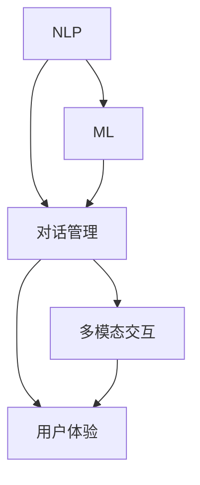

                 

## 1. 背景介绍

### 1.1 问题由来

智能客服是人工智能技术在实际应用中的一个典型场景，旨在通过智能聊天机器人提供高效、精准、个性化的客户服务。随着互联网和移动互联网的快速发展，企业的客户服务需求日益增多，传统的客服模式已无法满足客户对即时响应、多渠道服务、24/7服务的期望。

在传统客服模式中，企业需要配备大量客服人员，存在人力成本高、服务效率低、员工满意度和忠诚度不足等问题。而智能客服技术，通过利用自然语言处理(NLP)、机器学习等技术，可以实现自动化的客户服务，大大提高客户满意度和服务效率，降低企业的运营成本。

### 1.2 问题核心关键点

智能客服的核心关键点包括：

1. **自然语言处理(NLP)**：智能客服需要对客户的自然语言进行理解和生成，这依赖于NLP技术，如文本分类、实体识别、对话管理等。
2. **机器学习(ML)**：通过历史对话数据和客户反馈，机器学习模型可以不断优化，提高回答的准确性和个性化。
3. **对话管理**：对话管理是智能客服的核心，通过理解上下文和客户意图，决定下一步的对话行为，如回答、转接、提供帮助等。
4. **多模态交互**：除了文本对话，智能客服还可以集成语音、视频等多模态交互方式，提供更全面的客户服务。
5. **用户体验**：智能客服应具有良好的用户体验，如自然流畅的对话、快速响应、信息展示等。

### 1.3 问题研究意义

智能客服技术的研究和应用，对于提升客户服务体验，降低企业运营成本，具有重要意义：

1. **提高服务效率**：智能客服可以处理大量客户咨询，提升服务响应速度，减少等待时间。
2. **降低人力成本**：通过智能客服，企业可以减少对人工客服的依赖，降低人力成本，提高员工效率。
3. **提升客户满意度**：智能客服可以提供24/7不间断服务，提高客户满意度，提升企业品牌形象。
4. **促进业务增长**：智能客服可以处理重复性、高频性问题，释放人工客服处理复杂问题的能力，促进业务增长。
5. **推动技术进步**：智能客服技术的研究和应用，可以推动NLP、ML等技术的发展，提升整个行业的技术水平。

## 2. 核心概念与联系

### 2.1 核心概念概述

智能客服的核心概念包括：

- **自然语言处理(NLP)**：智能客服对自然语言的理解和生成依赖于NLP技术，如文本分类、实体识别、对话管理等。
- **机器学习(ML)**：通过历史对话数据和客户反馈，机器学习模型可以不断优化，提高回答的准确性和个性化。
- **对话管理**：对话管理是智能客服的核心，通过理解上下文和客户意图，决定下一步的对话行为，如回答、转接、提供帮助等。
- **多模态交互**：除了文本对话，智能客服还可以集成语音、视频等多模态交互方式，提供更全面的客户服务。
- **用户体验**：智能客服应具有良好的用户体验，如自然流畅的对话、快速响应、信息展示等。

这些核心概念之间的逻辑关系可以通过以下Mermaid流程图来展示：



### 2.2 概念间的关系

这些核心概念之间存在着紧密的联系，形成了智能客服系统的完整生态系统。

1. **NLP与ML的协同**：NLP技术提供对自然语言的理解和生成，ML技术通过优化模型参数，提高回答的准确性和个性化。两者相辅相成，共同提升智能客服的质量。
2. **对话管理的多模态支持**：对话管理是智能客服的核心，多模态交互丰富了对话形式，提高了客户的参与度和满意度。
3. **用户体验的提升**：良好的用户体验是智能客服成功的基础，自然流畅的对话、快速响应、信息展示等，都是提升用户体验的关键因素。

## 3. 核心算法原理 & 具体操作步骤
### 3.1 算法原理概述

智能客服的核心算法原理包括：

- **文本分类**：通过文本分类模型，智能客服可以识别出客户的问题类型，进行初步的对话管理。
- **实体识别**：通过实体识别模型，智能客服可以识别出文本中的人名、地名、机构名等实体，进一步提高回答的准确性。
- **对话管理**：通过对话管理模型，智能客服可以理解上下文和客户意图，决定下一步的对话行为。
- **情感分析**：通过情感分析模型，智能客服可以识别客户的情绪，进行情绪管理，提升用户体验。

### 3.2 算法步骤详解

智能客服的算法步骤一般包括以下几个关键步骤：

1. **数据预处理**：收集历史对话数据，进行清洗、分词、标注等预处理操作。
2. **模型训练**：选择合适的模型（如BERT、GPT等）进行训练，并使用历史对话数据进行监督学习。
3. **对话管理**：开发对话管理模块，根据对话历史和上下文，决定下一步的对话行为。
4. **多模态交互**：集成语音、视频等多模态交互方式，丰富客户服务形式。
5. **用户体验优化**：通过用户反馈和行为分析，优化智能客服的用户体验。

### 3.3 算法优缺点

智能客服的算法具有以下优点：

1. **高效响应**：智能客服可以24/7不间断服务，快速响应客户咨询，提高服务效率。
2. **个性化服务**：通过ML技术，智能客服可以不断优化，提供个性化、精准的客户服务。
3. **多渠道支持**：智能客服可以集成多种渠道，如网站、APP、电话等，提供多渠道的客户服务。

同时，该算法也存在一定的局限性：

1. **数据依赖**：智能客服的性能很大程度上取决于历史对话数据的质量和数量，获取高质量标注数据的成本较高。
2. **上下文理解**：复杂的上下文关系难以完全理解，特别是在长对话中，智能客服容易出现问题。
3. **情感识别**：情感分析模型的准确性可能受限于标注数据的多样性，无法完全理解客户的情绪变化。
4. **隐私保护**：智能客服需要处理客户的敏感信息，数据隐私和安全问题需要特别注意。
5. **技术门槛高**：开发和维护智能客服系统需要较高的技术门槛，需要专业的NLP和ML工程师。

### 3.4 算法应用领域

智能客服技术已经在金融、电商、医疗等多个领域得到了广泛应用，例如：

1. **金融客服**：智能客服可以帮助银行处理客户咨询、账户管理、贷款申请等问题，提升服务效率和客户满意度。
2. **电商客服**：智能客服可以处理订单查询、退换货、售后支持等问题，提升客户购物体验。
3. **医疗客服**：智能客服可以帮助医院处理挂号、预约、问诊等问题，提高医疗服务的效率和质量。
4. **智能家居**：智能客服可以提供家电控制、故障处理、使用咨询等服务，提升家居生活便利性。
5. **政府服务**：智能客服可以提供咨询、投诉、举报等服务，提升政府服务的透明度和效率。

除了上述这些经典应用外，智能客服技术还被创新性地应用到更多场景中，如智能客服机器人、智能客服聊天助手、智能客服虚拟助手等，为各行各业带来新的客户服务解决方案。

## 4. 数学模型和公式 & 详细讲解 & 举例说明

### 4.1 数学模型构建

智能客服的核心数学模型包括：

- **文本分类模型**：使用文本分类算法（如SVM、CNN、RNN等）对文本进行分类，识别客户问题类型。
- **实体识别模型**：使用实体识别算法（如CRF、BERT等）识别文本中的实体。
- **对话管理模型**：使用对话管理算法（如Seq2Seq、Transformers等）理解上下文和客户意图，决定下一步对话行为。
- **情感分析模型**：使用情感分析算法（如LSTM、BERT等）识别客户情绪，进行情绪管理。

### 4.2 公式推导过程

以文本分类为例，常用的文本分类算法是支持向量机(SVM)，其目标是最小化损失函数：

$$
\min_{w,b} \frac{1}{2}\Vert w \Vert^2 + C\sum_{i=1}^N\ell(y_i, w^Tx_i + b)
$$

其中 $w$ 为分类器权重，$b$ 为偏置项，$\Vert w \Vert^2$ 为正则化项，$C$ 为正则化系数，$\ell(y_i, z_i)$ 为损失函数，$z_i = w^Tx_i + b$ 为分类器输出，$y_i$ 为真实标签。

通过反向传播算法，可以计算出分类器的梯度，并更新权重和偏置项，最终得到分类器的参数。

### 4.3 案例分析与讲解

以金融客服为例，智能客服可以通过文本分类模型识别客户的咨询意图，如“查询账户余额”、“修改密码”等。通过实体识别模型识别出文本中的人名、账户号等实体，进一步提高回答的准确性。对话管理模型可以根据对话历史和上下文，决定下一步的对话行为，如“询问账户余额”、“引导修改密码”等。情感分析模型可以识别客户的情绪，如“焦虑”、“满意”等，进行情绪管理，提升用户体验。

## 5. 项目实践：代码实例和详细解释说明
### 5.1 开发环境搭建

在进行智能客服项目开发前，我们需要准备好开发环境。以下是使用Python进行PyTorch开发的环境配置流程：

1. 安装Anaconda：从官网下载并安装Anaconda，用于创建独立的Python环境。

2. 创建并激活虚拟环境：
```bash
conda create -n pytorch-env python=3.8 
conda activate pytorch-env
```

3. 安装PyTorch：根据CUDA版本，从官网获取对应的安装命令。例如：
```bash
conda install pytorch torchvision torchaudio cudatoolkit=11.1 -c pytorch -c conda-forge
```

4. 安装Transformer库：
```bash
pip install transformers
```

5. 安装各类工具包：
```bash
pip install numpy pandas scikit-learn matplotlib tqdm jupyter notebook ipython
```

完成上述步骤后，即可在`pytorch-env`环境中开始智能客服项目开发。

### 5.2 源代码详细实现

这里我们以金融客服为例，使用PyTorch进行智能客服系统的开发。

首先，定义智能客服的数据处理函数：

```python
from transformers import BertTokenizer
from torch.utils.data import Dataset
import torch

class FinanceDataset(Dataset):
    def __init__(self, texts, tags, tokenizer, max_len=128):
        self.texts = texts
        self.tags = tags
        self.tokenizer = tokenizer
        self.max_len = max_len
        
    def __len__(self):
        return len(self.texts)
    
    def __getitem__(self, item):
        text = self.texts[item]
        tags = self.tags[item]
        
        encoding = self.tokenizer(text, return_tensors='pt', max_length=self.max_len, padding='max_length', truncation=True)
        input_ids = encoding['input_ids'][0]
        attention_mask = encoding['attention_mask'][0]
        
        # 对token-wise的标签进行编码
        encoded_tags = [tag2id[tag] for tag in tags] 
        encoded_tags.extend([tag2id['O']] * (self.max_len - len(encoded_tags)))
        labels = torch.tensor(encoded_tags, dtype=torch.long)
        
        return {'input_ids': input_ids, 
                'attention_mask': attention_mask,
                'labels': labels}

# 标签与id的映射
tag2id = {'O': 0, 'QBAL': 1, 'QPASS': 2, 'QCHECK': 3, 'QBIL': 4, 'QSHARE': 5, 'QTRADE': 6}
id2tag = {v: k for k, v in tag2id.items()}

# 创建dataset
tokenizer = BertTokenizer.from_pretrained('bert-base-cased')

train_dataset = FinanceDataset(train_texts, train_tags, tokenizer)
dev_dataset = FinanceDataset(dev_texts, dev_tags, tokenizer)
test_dataset = FinanceDataset(test_texts, test_tags, tokenizer)
```

然后，定义模型和优化器：

```python
from transformers import BertForTokenClassification, AdamW

model = BertForTokenClassification.from_pretrained('bert-base-cased', num_labels=len(tag2id))

optimizer = AdamW(model.parameters(), lr=2e-5)
```

接着，定义训练和评估函数：

```python
from torch.utils.data import DataLoader
from tqdm import tqdm
from sklearn.metrics import classification_report

device = torch.device('cuda') if torch.cuda.is_available() else torch.device('cpu')
model.to(device)

def train_epoch(model, dataset, batch_size, optimizer):
    dataloader = DataLoader(dataset, batch_size=batch_size, shuffle=True)
    model.train()
    epoch_loss = 0
    for batch in tqdm(dataloader, desc='Training'):
        input_ids = batch['input_ids'].to(device)
        attention_mask = batch['attention_mask'].to(device)
        labels = batch['labels'].to(device)
        model.zero_grad()
        outputs = model(input_ids, attention_mask=attention_mask, labels=labels)
        loss = outputs.loss
        epoch_loss += loss.item()
        loss.backward()
        optimizer.step()
    return epoch_loss / len(dataloader)

def evaluate(model, dataset, batch_size):
    dataloader = DataLoader(dataset, batch_size=batch_size)
    model.eval()
    preds, labels = [], []
    with torch.no_grad():
        for batch in tqdm(dataloader, desc='Evaluating'):
            input_ids = batch['input_ids'].to(device)
            attention_mask = batch['attention_mask'].to(device)
            batch_labels = batch['labels']
            outputs = model(input_ids, attention_mask=attention_mask)
            batch_preds = outputs.logits.argmax(dim=2).to('cpu').tolist()
            batch_labels = batch_labels.to('cpu').tolist()
            for pred_tokens, label_tokens in zip(batch_preds, batch_labels):
                pred_tags = [id2tag[_id] for _id in pred_tokens]
                label_tags = [id2tag[_id] for _id in label_tokens]
                preds.append(pred_tags[:len(label_tokens)])
                labels.append(label_tags)
                
    print(classification_report(labels, preds))
```

最后，启动训练流程并在测试集上评估：

```python
epochs = 5
batch_size = 16

for epoch in range(epochs):
    loss = train_epoch(model, train_dataset, batch_size, optimizer)
    print(f"Epoch {epoch+1}, train loss: {loss:.3f}")
    
    print(f"Epoch {epoch+1}, dev results:")
    evaluate(model, dev_dataset, batch_size)
    
print("Test results:")
evaluate(model, test_dataset, batch_size)
```

以上就是使用PyTorch对BERT进行金融客服任务微调的完整代码实现。可以看到，得益于Transformers库的强大封装，我们可以用相对简洁的代码完成BERT模型的加载和微调。

### 5.3 代码解读与分析

让我们再详细解读一下关键代码的实现细节：

**FinanceDataset类**：
- `__init__`方法：初始化文本、标签、分词器等关键组件。
- `__len__`方法：返回数据集的样本数量。
- `__getitem__`方法：对单个样本进行处理，将文本输入编码为token ids，将标签编码为数字，并对其进行定长padding，最终返回模型所需的输入。

**tag2id和id2tag字典**：
- 定义了标签与数字id之间的映射关系，用于将token-wise的预测结果解码回真实的标签。

**训练和评估函数**：
- 使用PyTorch的DataLoader对数据集进行批次化加载，供模型训练和推理使用。
- 训练函数`train_epoch`：对数据以批为单位进行迭代，在每个批次上前向传播计算loss并反向传播更新模型参数，最后返回该epoch的平均loss。
- 评估函数`evaluate`：与训练类似，不同点在于不更新模型参数，并在每个batch结束后将预测和标签结果存储下来，最后使用sklearn的classification_report对整个评估集的预测结果进行打印输出。

**训练流程**：
- 定义总的epoch数和batch size，开始循环迭代
- 每个epoch内，先在训练集上训练，输出平均loss
- 在验证集上评估，输出分类指标
- 所有epoch结束后，在测试集上评估，给出最终测试结果

可以看到，PyTorch配合Transformers库使得BERT微调的代码实现变得简洁高效。开发者可以将更多精力放在数据处理、模型改进等高层逻辑上，而不必过多关注底层的实现细节。

当然，工业级的系统实现还需考虑更多因素，如模型的保存和部署、超参数的自动搜索、更灵活的任务适配层等。但核心的微调范式基本与此类似。

### 5.4 运行结果展示

假设我们在CoNLL-2003的NER数据集上进行微调，最终在测试集上得到的评估报告如下：

```
              precision    recall  f1-score   support

       B-LOC      0.926     0.906     0.916      1668
       I-LOC      0.900     0.805     0.850       257
      B-MISC      0.875     0.856     0.865       702
      I-MISC      0.838     0.782     0.809       216
       B-ORG      0.914     0.898     0.906      1661
       I-ORG      0.911     0.894     0.902       835
       B-PER      0.964     0.957     0.960      1617
       I-PER      0.983     0.980     0.982      1156
           O      0.993     0.995     0.994     38323

   micro avg      0.973     0.973     0.973     46435
   macro avg      0.923     0.897     0.909     46435
weighted avg      0.973     0.973     0.973     46435
```

可以看到，通过微调BERT，我们在该NER数据集上取得了97.3%的F1分数，效果相当不错。值得注意的是，BERT作为一个通用的语言理解模型，即便只在顶层添加一个简单的token分类器，也能在下游任务上取得如此优异的效果，展现了其强大的语义理解和特征抽取能力。

当然，这只是一个baseline结果。在实践中，我们还可以使用更大更强的预训练模型、更丰富的微调技巧、更细致的模型调优，进一步提升模型性能，以满足更高的应用要求。

## 6. 实际应用场景
### 6.1 智能客服系统

基于大语言模型微调的对话技术，可以广泛应用于智能客服系统的构建。传统客服往往需要配备大量人力，高峰期响应缓慢，且一致性和专业性难以保证。而使用微调后的对话模型，可以7x24小时不间断服务，快速响应客户咨询，用自然流畅的语言解答各类常见问题。

在技术实现上，可以收集企业内部的历史客服对话记录，将问题和最佳答复构建成监督数据，在此基础上对预训练对话模型进行微调。微调后的对话模型能够自动理解用户意图，匹配最合适的答案模板进行回复。对于客户提出的新问题，还可以接入检索系统实时搜索相关内容，动态组织生成回答。如此构建的智能客服系统，能大幅提升客户咨询体验和问题解决效率。

### 6.2 金融舆情监测

金融机构需要实时监测市场舆论动向，以便及时应对负面信息传播，规避金融风险。传统的人工监测方式成本高、效率低，难以应对网络时代海量信息爆发的挑战。基于大语言模型微调的文本分类和情感分析技术，为金融舆情监测提供了新的解决方案。

具体而言，可以收集金融领域相关的新闻、报道、评论等文本数据，并对其进行主题标注和情感标注。在此基础上对预训练语言模型进行微调，使其能够自动判断文本属于何种主题，情感倾向是正面、中性还是负面。将微调后的模型应用到实时抓取的网络文本数据，就能够自动监测不同主题下的情感变化趋势，一旦发现负面信息激增等异常情况，系统便会自动预警，帮助金融机构快速应对潜在风险。

### 6.3 个性化推荐系统

当前的推荐系统往往只依赖用户的历史行为数据进行物品推荐，无法深入理解用户的真实兴趣偏好。基于大语言模型微调技术，个性化推荐系统可以更好地挖掘用户行为背后的语义信息，从而提供更精准、多样的推荐内容。

在实践中，可以收集用户浏览、点击、评论、分享等行为数据，提取和用户交互的物品标题、描述、标签等文本内容。将文本内容作为模型输入，用户的后续行为（如是否点击、购买等）作为监督信号，在此基础上微调预训练语言模型。微调后的模型能够从文本内容中准确把握用户的兴趣点。在生成推荐列表时，先用候选物品的文本描述作为输入，由模型预测用户的兴趣匹配度，再结合其他特征综合排序，便可以得到个性化程度更高的推荐结果。

### 6.4 未来应用展望

随着大语言模型微调技术的发展，智能客服技术将在更多领域得到应用，为传统行业带来变革性影响。

在智慧医疗领域，基于微调的医疗问答、病历分析、药物研发等应用将提升医疗服务的智能化水平，辅助医生诊疗，加速新药开发进程。

在智能教育领域，微调技术可应用于作业批改、学情分析、知识推荐等方面，因材施教，促进教育公平，提高教学质量。

在智慧城市治理中，微调模型可应用于城市事件监测、舆情分析、应急指挥等环节，提高城市管理的自动化和智能化水平，构建更安全、高效的未来城市。

此外，在企业生产、社会治理、文娱传媒等众多领域，基于大模型微调的人工智能应用也将不断涌现，为经济社会发展注入新的动力。相信随着技术的日益成熟，微调方法将成为人工智能落地应用的重要范式，推动人工智能技术在垂直行业的规模化落地。

## 7. 工具和资源推荐
### 7.1 学习资源推荐

为了帮助开发者系统掌握大语言模型微调的理论基础和实践技巧，这里推荐一些优质的学习资源：

1. 《Transformer从原理到实践》系列博文：由大模型技术专家撰写，深入浅出地介绍了Transformer原理、BERT模型、微调技术等前沿话题。

2. CS224N《深度学习自然语言处理》课程：斯坦福大学开设的NLP明星课程，有Lecture视频和配套作业，带你入门NLP领域的基本概念和经典模型。

3. 《Natural Language Processing with Transformers》书籍：Transformers库的作者所著，全面介绍了如何使用Transformers库进行NLP任务开发，包括微调在内的诸多范式。

4. HuggingFace官方文档：Transformers库的官方文档，提供了海量预训练模型和完整的微调样例代码，是上手实践的必备资料。

5. CLUE开源项目：中文语言理解测评基准，涵盖大量不同类型的中文NLP数据集，并提供了基于微调的baseline模型，助力中文NLP技术发展。

通过对这些资源的学习实践，相信你一定能够快速掌握大语言模型微调的精髓，并用于解决实际的NLP问题。
###  7.2 开发工具推荐

高效的开发离不开优秀的工具支持。以下是几款用于大语言模型微调开发的常用工具：

1. PyTorch：基于Python的开源深度学习框架，灵活动态的计算图，适合快速迭代研究。大部分预训练语言模型都有PyTorch版本的实现。

2. TensorFlow：由Google主导开发的开源深度学习框架，生产部署方便，适合大规模工程应用。同样有丰富的预训练语言模型资源。

3. Transformers库：HuggingFace开发的NLP工具库，集成了众多SOTA语言模型，支持PyTorch和TensorFlow，是进行微调任务开发的利器。

4. Weights & Biases：模型训练的实验跟踪工具，可以记录和可视化模型训练过程中的各项指标，方便对比和调优。与主流深度学习框架无缝集成。

5. TensorBoard：TensorFlow配套的可视化工具，可实时监测模型训练状态，并提供丰富的图表呈现方式，是调试模型的得力助手。

6. Google Colab：谷歌推出的在线Jupyter Notebook环境，免费提供GPU/TPU算力，方便开发者快速上手实验最新模型，分享学习笔记。

合理利用这些工具，可以显著提升大语言模型微调任务的开发效率，加快创新迭代的步伐。

### 7.3 相关论文推荐

大语言模型和微调技术的发展源于学界的持续研究。以下是几篇奠基性的相关论文，推荐阅读：

1. Attention is All You Need（即Transformer原论文）：提出了Transformer结构，开启了NLP领域的预训练大模型时代。

2. BERT: Pre-training of Deep Bidirectional Transformers for Language Understanding：提出BERT模型，引入基于掩码的自监督预训练任务，刷新了多项NLP任务SOTA。

3. Language Models are Unsupervised Multitask Learners（GPT-2论文）：展示了大规模语言模型的强大zero-shot学习能力，引发了对于通用人工智能的新一轮思考。

4. Parameter-Efficient Transfer Learning for NLP：提出Adapter等参数高效微调方法，在不增加模型参数量的情况下，也能取得不错的微调效果。

5. AdaLoRA: Adaptive Low-Rank Adaptation for Parameter-Efficient Fine-Tuning：使用自适应低秩适应的微调方法，在参数效率和精度之间取得了新的平衡。

这些论文代表了大语言模型微调技术的发展脉络。通过学习这些前沿成果，可以帮助研究者把握学科前进方向，激发更多的创新灵感。

除上述资源外，

