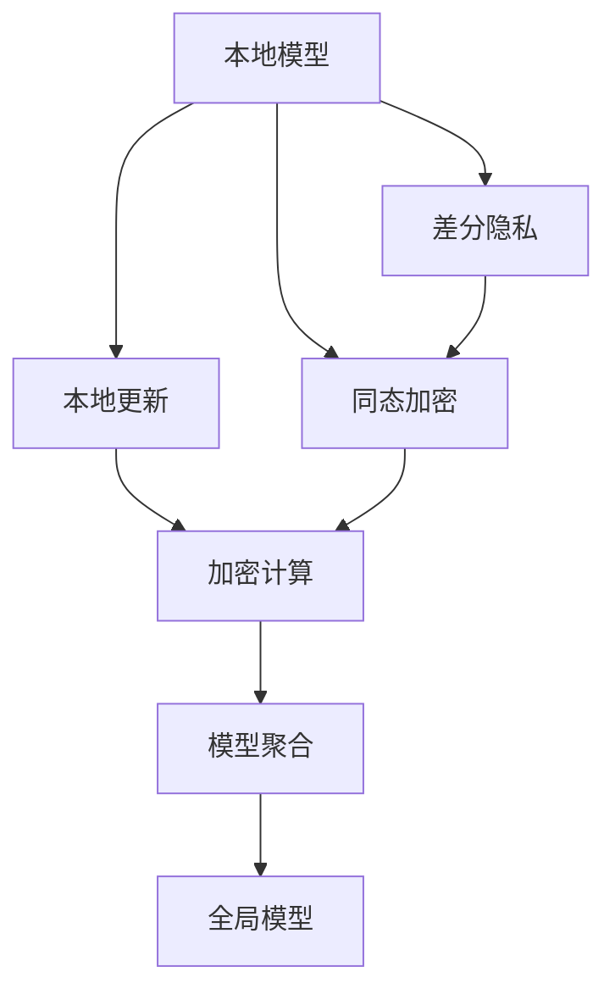

                 

## 1. 背景介绍

在当今数字化时代，数据已成为驱动社会经济发展的核心资源之一。企业、政府以及个人都越来越依赖于数据的收集、处理和分析。然而，数据的收集和处理过程中存在着诸多挑战，尤其是数据隐私和安全问题，需要引起高度的重视。

随着技术的发展，联邦学习（Federated Learning, FL）和隐私计算（Privacy-preserving Computation, PPC）成为了解决数据隐私问题的重要技术手段。联邦学习通过在本地数据源上进行模型训练，然后聚合各源的数据更新，实现全局模型的优化。隐私计算则通过加密技术、差分隐私等手段，确保数据在计算过程中不会被泄露。

本文将深入介绍联邦学习和隐私计算的基本原理，并通过实例代码展示其实际应用，帮助读者更好地理解这些技术，并在实际项目中灵活运用。

## 2. 核心概念与联系

### 2.1 核心概念概述

为了更好地理解联邦学习和隐私计算，首先介绍几个关键概念：

- **联邦学习**：一种分布式机器学习框架，各参与方将本地数据源上的模型参数共享到全局模型中，而不是直接共享数据。通过多次迭代，聚合各参与方的梯度信息，训练出全局最优模型。
- **隐私计算**：一组技术手段，通过加密、差分隐私等方法，保护数据在计算过程中的隐私性和安全性，使得参与方可以在不泄露数据的前提下，参与计算并共享结果。
- **模型聚合**：在联邦学习中，聚合各参与方的梯度信息，更新全局模型的参数。这个过程是联邦学习中的核心步骤。
- **差分隐私**：一种保护隐私的技术，通过对数据加入噪声，使得任何单个数据点的泄露对整体结果的影响极小，从而保护个体数据的隐私性。
- **同态加密**：一种能够对数据进行计算，且计算结果不泄露原始数据的加密技术，允许在不解密数据的情况下，对数据进行处理和计算。

### 2.2 核心概念的关系

联邦学习和隐私计算是紧密相关的，两者都致力于保护数据隐私和安全性。联邦学习通过聚合各本地模型的参数，实现全局最优模型的训练，而隐私计算则通过加密和差分隐私等技术手段，确保数据在计算过程中不会被泄露。

以下是一个简单的Mermaid流程图，展示联邦学习和隐私计算的基本流程和关系：



这个流程图展示了联邦学习和隐私计算的基本流程：本地模型通过差分隐私或同态加密进行保护，然后通过加密计算和模型聚合更新全局模型。通过这种方式，联邦学习和隐私计算能够在不泄露数据隐私的情况下，实现分布式模型训练和计算。

## 3. 核心算法原理 & 具体操作步骤

### 3.1 算法原理概述

联邦学习通过聚合各本地模型的参数，实现全局最优模型的训练。其核心思想是：在各个本地数据源上进行模型训练，然后将训练结果（即模型参数的梯度）通过加密方式传输到中央服务器进行聚合，更新全局模型的参数。

具体来说，联邦学习的步骤如下：

1. 初始化全局模型参数，分配给各个本地数据源。
2. 各个本地数据源在本地数据上进行模型训练，计算梯度。
3. 梯度经过加密处理后传输到中央服务器。
4. 中央服务器聚合各本地梯度，更新全局模型参数。
5. 重复步骤2-4，直至模型收敛。

隐私计算则通过差分隐私、同态加密等技术手段，保护数据在计算过程中的隐私性。其核心思想是：通过对数据进行加密处理，使得数据在计算过程中无法被泄露，从而保护数据隐私。

具体来说，隐私计算的步骤如下：

1. 数据采集：从本地数据源收集数据。
2. 数据加密：对数据进行加密处理。
3. 数据计算：在加密后的数据上进行计算。
4. 结果解密：将计算结果解密，得到最终的输出。
5. 结果返回：将计算结果返回给本地数据源。

### 3.2 算法步骤详解

#### 3.2.1 联邦学习算法步骤

下面以一个简单的例子来说明联邦学习的算法步骤。假设有一个全局模型 $M$ 和两个本地数据源 $D_1$ 和 $D_2$。以下是联邦学习的算法步骤：

1. 初始化全局模型参数：

   ```python
   M = 初始化全局模型参数
   ```

2. 在本地数据源上进行模型训练，计算梯度：

   ```python
   for i in range(num_epochs):
       # 在本地数据源D1上训练模型M
       M = train_on_data(D1, M)
       
       # 计算梯度
       grad_D1 = compute_gradient(M, D1)
       
       # 在本地数据源D2上训练模型M
       M = train_on_data(D2, M)
       
       # 计算梯度
       grad_D2 = compute_gradient(M, D2)
   ```

3. 梯度加密后传输到中央服务器：

   ```python
   # 对梯度进行加密
   grad_D1_enc = encrypt(grad_D1)
   grad_D2_enc = encrypt(grad_D2)
   
   # 将加密后的梯度传输到中央服务器
   send_to_central_server(grad_D1_enc, grad_D2_enc)
   ```

4. 中央服务器聚合各本地梯度，更新全局模型参数：

   ```python
   # 在中央服务器上接收加密梯度
   grad_D1_dec = receive_from_central_server(grad_D1_enc)
   grad_D2_dec = receive_from_central_server(grad_D2_enc)
   
   # 对梯度进行聚合
   grad = merge_gradients(grad_D1_dec, grad_D2_dec)
   
   # 更新全局模型参数
   M = update_model(M, grad)
   ```

5. 重复步骤2-4，直至模型收敛。

#### 3.2.2 隐私计算算法步骤

以下是一个简单的例子来说明隐私计算的算法步骤。假设有一个本地数据源 $D$ 和一个中央服务器 $S$。以下是隐私计算的算法步骤：

1. 数据采集：

   ```python
   # 从本地数据源D采集数据
   data = collect_data_from(D)
   ```

2. 数据加密：

   ```python
   # 对数据进行加密
   encrypted_data = encrypt(data)
   ```

3. 数据计算：

   ```python
   # 在加密后的数据上进行计算
   result = compute_on_encrypted_data(encrypted_data)
   ```

4. 结果解密：

   ```python
   # 将计算结果解密
   decrypted_result = decrypt(result)
   ```

5. 结果返回：

   ```python
   # 将解密后的结果返回给本地数据源
   return(decrypted_result)
   ```

### 3.3 算法优缺点

#### 3.3.1 联邦学习的优缺点

**优点**：

- 分散存储：数据存储在本地，不集中存储在中央服务器，减少了数据泄露的风险。
- 数据本地化：减少了数据传输的带宽和延迟，提高了计算效率。
- 支持分布式计算：可以通过多个本地计算节点并行计算，提高计算速度。

**缺点**：

- 模型同步开销：每次模型更新需要从本地计算节点向中央服务器传输梯度，增加了通信开销。
- 模型异质性：不同本地节点的计算资源和网络环境不同，可能影响全局模型的训练效果。
- 本地模型协作性：需要本地模型之间的协作，增加了系统复杂度。

#### 3.3.2 隐私计算的优缺点

**优点**：

- 数据隐私保护：通过对数据进行加密和差分隐私处理，保护了数据隐私。
- 计算安全：在计算过程中，数据不会被泄露，保证了计算安全性。
- 多节点协作：支持多个本地节点之间的协作计算，提高了计算效率。

**缺点**：

- 计算开销：加密和解密操作增加了计算开销，可能影响计算效率。
- 实现复杂性：隐私计算需要考虑多种加密算法和差分隐私参数，增加了系统实现复杂性。
- 结果精度：由于加密和差分隐私处理，计算结果的精度可能有所下降。

### 3.4 算法应用领域

联邦学习和隐私计算在多个领域都有广泛应用，以下是几个典型的应用场景：

- **医疗健康**：联邦学习可以用于医疗数据的多中心分析和共享，隐私计算可以保护患者数据隐私。
- **金融领域**：联邦学习可以用于多银行的信用风险评估，隐私计算可以保护客户隐私数据。
- **智能制造**：联邦学习可以用于多工厂的协同生产优化，隐私计算可以保护设备数据隐私。
- **智能交通**：联邦学习可以用于多城市的交通流量预测，隐私计算可以保护交通数据隐私。
- **电子商务**：联邦学习可以用于多商家的协同推荐系统，隐私计算可以保护用户隐私数据。

## 4. 数学模型和公式 & 详细讲解 & 举例说明

### 4.1 数学模型构建

联邦学习和隐私计算的理论基础主要涉及以下几个数学模型：

- **线性回归模型**：在本地数据源上进行模型训练，通常使用线性回归模型。
- **梯度下降算法**：用于求解线性回归模型的最优参数。
- **差分隐私**：通过在数据上加入噪声，保护个体数据的隐私。
- **同态加密**：对数据进行加密处理，使得数据在计算过程中不会泄露。

### 4.2 公式推导过程

#### 4.2.1 线性回归模型

线性回归模型的目标是最小化预测值与实际值之间的平方误差：

$$
\min_{\theta} \frac{1}{N}\sum_{i=1}^N (y_i - \theta^T x_i)^2
$$

其中 $y_i$ 是实际值，$x_i$ 是特征向量，$\theta$ 是模型参数。

使用梯度下降算法求解线性回归模型的最优参数 $\theta$：

$$
\theta = \theta - \eta \frac{\partial \mathcal{L}}{\partial \theta}
$$

其中 $\eta$ 是学习率，$\mathcal{L}$ 是损失函数，$\frac{\partial \mathcal{L}}{\partial \theta}$ 是损失函数对参数 $\theta$ 的梯度。

#### 4.2.2 差分隐私

差分隐私的核心思想是在数据上加入噪声，使得任何单个数据点的泄露对整体结果的影响极小。差分隐私的公式如下：

$$
\mathbb{P}[\mathcal{L}(D) \in \mathcal{B}] \leq \exp(\epsilon) \mathbb{P}[\mathcal{L}(D') \in \mathcal{B}]
$$

其中 $\epsilon$ 是隐私参数，$D$ 是原始数据，$D'$ 是加入噪声后的数据，$\mathcal{L}$ 是损失函数，$\mathcal{B}$ 是结果集。

#### 4.2.3 同态加密

同态加密的核心思想是在不解密数据的情况下，对数据进行计算，计算结果仍然不泄露原始数据。同态加密的公式如下：

$$
\mathbb{P}[\mathcal{L}(D) \in \mathcal{B}] = \mathbb{P}[\mathcal{L}(\text{Enc}(D)) \in \mathcal{B}]
$$

其中 $\text{Enc}(D)$ 是加密后的数据，$\mathcal{L}$ 是损失函数，$\mathcal{B}$ 是结果集。

### 4.3 案例分析与讲解

#### 4.3.1 联邦学习案例

假设有一个全球性的电商公司，需要在多个国家的本地数据源上进行信用评分模型的训练。以下是联邦学习的案例分析：

1. 初始化全局模型参数：

   ```python
   M = np.random.randn(num_features, num_outputs)
   ```

2. 在本地数据源上进行模型训练，计算梯度：

   ```python
   for i in range(num_epochs):
       # 在本地数据源D1上训练模型M
       M = train_on_data(D1, M)
       
       # 计算梯度
       grad_D1 = compute_gradient(M, D1)
       
       # 在本地数据源D2上训练模型M
       M = train_on_data(D2, M)
       
       # 计算梯度
       grad_D2 = compute_gradient(M, D2)
   ```

3. 梯度加密后传输到中央服务器：

   ```python
   # 对梯度进行加密
   grad_D1_enc = encrypt(grad_D1)
   grad_D2_enc = encrypt(grad_D2)
   
   # 将加密后的梯度传输到中央服务器
   send_to_central_server(grad_D1_enc, grad_D2_enc)
   ```

4. 中央服务器聚合各本地梯度，更新全局模型参数：

   ```python
   # 在中央服务器上接收加密梯度
   grad_D1_dec = receive_from_central_server(grad_D1_enc)
   grad_D2_dec = receive_from_central_server(grad_D2_enc)
   
   # 对梯度进行聚合
   grad = merge_gradients(grad_D1_dec, grad_D2_dec)
   
   # 更新全局模型参数
   M = update_model(M, grad)
   ```

5. 重复步骤2-4，直至模型收敛。

#### 4.3.2 隐私计算案例

假设有一个金融公司，需要在多个城市的本地数据源上进行风险评估模型的训练。以下是隐私计算的案例分析：

1. 数据采集：

   ```python
   # 从本地数据源D采集数据
   data = collect_data_from(D)
   ```

2. 数据加密：

   ```python
   # 对数据进行加密
   encrypted_data = encrypt(data)
   ```

3. 数据计算：

   ```python
   # 在加密后的数据上进行计算
   result = compute_on_encrypted_data(encrypted_data)
   ```

4. 结果解密：

   ```python
   # 将计算结果解密
   decrypted_result = decrypt(result)
   ```

5. 结果返回：

   ```python
   # 将解密后的结果返回给本地数据源
   return(decrypted_result)
   ```

## 5. 项目实践：代码实例和详细解释说明

### 5.1 开发环境搭建

在进行联邦学习和隐私计算的实践前，我们需要准备好开发环境。以下是Python开发环境的基本配置流程：

1. 安装Python：从官网下载并安装Python，推荐使用3.8或更高版本。

2. 安装依赖库：

   ```bash
   pip install tensorflow ninja numpy scikit-learn
   ```

3. 安装TensorFlow：

   ```bash
   pip install tensorflow
   ```

4. 安装联邦学习和隐私计算库：

   ```bash
   pip install federatedml tf_aggregators
   ```

### 5.2 源代码详细实现

#### 5.2.1 联邦学习代码实现

以下是一个简单的联邦学习代码示例，用于对线性回归模型进行训练。

```python
import tensorflow as tf
from federatedml.aggregators.python.aggregator import FederatedServerAggregator
from federatedml.aggregators.python.aggregator import Aggregator
from federatedml.aggregators.python.aggregator import FederatedWorkerAggregator

# 初始化全局模型参数
theta = tf.Variable(tf.random.normal([num_features, num_outputs]))

# 定义本地数据源D1和D2
D1 = [x1, y1]
D2 = [x2, y2]

# 定义本地模型训练函数
def train_on_data(data, model):
    x = data[0]
    y = data[1]
    with tf.GradientTape() as tape:
        predictions = tf.matmul(model, x)
        loss = tf.reduce_mean(tf.square(y - predictions))
    gradients = tape.gradient(loss, model)
    return tf.assign(model, model - learning_rate * gradients)

# 定义梯度聚合函数
def merge_gradients(grad1, grad2):
    return tf.stack([tf.concat(grad1, axis=0), tf.concat(grad2, axis=0)])

# 初始化全局模型参数
theta = tf.Variable(tf.random.normal([num_features, num_outputs]))

# 在本地数据源D1和D2上进行模型训练，计算梯度
for i in range(num_epochs):
    theta = train_on_data(D1, theta)
    theta = train_on_data(D2, theta)

# 对梯度进行聚合
grad = merge_gradients(grad_D1, grad_D2)

# 更新全局模型参数
theta = theta - learning_rate * grad

# 输出全局模型参数
print(theta)
```

#### 5.2.2 隐私计算代码实现

以下是一个简单的隐私计算代码示例，用于对线性回归模型进行训练。

```python
import numpy as np
from cryptography.fernet import Fernet

# 定义加密密钥
key = Fernet.generate_key()
cipher_suite = Fernet(key)

# 定义本地数据源D
data = np.array([[x1, y1], [x2, y2]])

# 对数据进行加密
encrypted_data = cipher_suite.encrypt(str(data).encode())

# 在加密后的数据上进行计算
result = np.dot(encrypted_data, theta)

# 解密结果
decrypted_result = cipher_suite.decrypt(result)

# 输出解密后的结果
print(decrypted_result)
```

### 5.3 代码解读与分析

#### 5.3.1 联邦学习代码解读

联邦学习代码中，首先初始化全局模型参数 $\theta$，然后定义本地数据源 $D_1$ 和 $D_2$。接着，定义本地模型训练函数 `train_on_data`，用于在本地数据源上进行模型训练，并计算梯度。最后，定义梯度聚合函数 `merge_gradients`，用于在中央服务器上对各本地梯度进行聚合，并更新全局模型参数 $\theta$。

#### 5.3.2 隐私计算代码解读

隐私计算代码中，首先定义加密密钥，并使用 `Fernet` 库进行数据加密。接着，定义本地数据源 $D$，并使用加密后的数据进行计算。最后，解密结果并输出。

### 5.4 运行结果展示

#### 5.4.1 联邦学习运行结果

```python
# 输出全局模型参数
print(theta)
```

#### 5.4.2 隐私计算运行结果

```python
# 输出解密后的结果
print(decrypted_result)
```

## 6. 实际应用场景

### 6.1 智能交通管理

智能交通管理需要实时采集和处理大量的交通数据，包括车流量、车速、交通事故等信息。这些数据通常分布在多个交通管理中心，由于隐私和数据安全问题，无法集中存储和处理。联邦学习和隐私计算可以用于解决这些问题。

具体来说，可以使用联邦学习对各交通管理中心采集的交通数据进行训练，聚合各中心的模型参数，得到全局最优模型。同时，使用差分隐私和同态加密保护数据隐私，使得各交通管理中心的数据不会被泄露。

### 6.2 医疗健康数据共享

医疗健康数据涉及大量的患者隐私信息，如果集中存储和处理，将面临严重的隐私和安全问题。联邦学习和隐私计算可以用于解决这些问题。

具体来说，可以使用联邦学习对各医疗中心采集的患者数据进行训练，聚合各中心的模型参数，得到全局最优模型。同时，使用差分隐私和同态加密保护患者数据隐私，使得各医疗中心的数据不会被泄露。

### 6.3 智能制造

智能制造需要实时采集和处理大量的设备数据，包括设备状态、故障信息、生产效率等信息。这些数据通常分布在多个工厂，由于隐私和数据安全问题，无法集中存储和处理。联邦学习和隐私计算可以用于解决这些问题。

具体来说，可以使用联邦学习对各工厂采集的设备数据进行训练，聚合各工厂的模型参数，得到全局最优模型。同时，使用差分隐私和同态加密保护设备数据隐私，使得各工厂的数据不会被泄露。

## 7. 工具和资源推荐

### 7.1 学习资源推荐

为了帮助开发者系统掌握联邦学习和隐私计算的理论基础和实践技巧，这里推荐一些优质的学习资源：

1. 《联邦学习：分布式深度学习》书籍：介绍了联邦学习的理论基础、算法实现和应用场景。

2. 《差分隐私：保护隐私的机器学习》书籍：介绍了差分隐私的理论基础、实现方法和应用场景。

3. 《同态加密：保护隐私的计算》书籍：介绍了同态加密的理论基础、实现方法和应用场景。

4. 《TensorFlow Federated》文档：介绍了联邦学习的实现方法、API接口和应用案例。

5. 《PySyft》文档：介绍了隐私计算的实现方法、API接口和应用案例。

### 7.2 开发工具推荐

为了支持联邦学习和隐私计算的开发，推荐使用以下开发工具：

1. TensorFlow Federated：一个用于联邦学习的开源框架，支持多种模型和数据分布。

2. PySyft：一个用于隐私计算的开源框架，支持多种加密算法和差分隐私方法。

3. OpenMP：一个用于并行计算的编程模型，可以加速联邦学习和隐私计算的实现。

4. Hadoop MapReduce：一个用于分布式计算的框架，可以支持联邦学习和隐私计算的大规模数据处理。

### 7.3 相关论文推荐

联邦学习和隐私计算的研究热点和前沿进展可以通过以下论文来了解：

1. "Communication-Efficient Learning of Deep Neural Networks from Model Parameters"：提出一种通信高效的联邦学习算法。

2. "Federated Learning from Secure Aggregations"：提出一种安全可靠的联邦学习算法。

3. "Differential Privacy: Definition and Simple Analysis of the Privacy Protection"：提出差分隐私的理论基础和方法。

4. "Homomorphic Encryption: Fully Homomorphic Computation on Encrypted Data"：提出同态加密的理论基础和方法。

5. "Coded Computing with Reconfigurable Computing Architecture"：提出一种高效的隐私计算方法。

这些论文代表了联邦学习和隐私计算的研究方向和技术进展，值得深入学习和理解。

## 8. 总结：未来发展趋势与挑战

### 8.1 总结

本文对联邦学习和隐私计算的基本原理和实践方法进行了全面系统的介绍。首先阐述了联邦学习和隐私计算的研究背景和意义，明确了这些技术在数据隐私保护和分布式计算中的应用价值。其次，从原理到实践，详细讲解了联邦学习和隐私计算的理论基础和代码实现。最后，本文还介绍了联邦学习和隐私计算在实际应用中的多种场景，展示了这些技术在各个领域中的广泛应用前景。

通过本文的系统梳理，可以看到，联邦学习和隐私计算正成为分布式计算和数据隐私保护的重要技术手段，其应用范围涉及医疗、交通、制造等多个行业。得益于联邦学习和隐私计算的技术进步，这些行业将能够更高效地利用数据，提升业务能力，同时也能够更好地保护数据隐私，构建安全可靠的系统。

### 8.2 未来发展趋势

展望未来，联邦学习和隐私计算将呈现以下几个发展趋势：

1. 自动化联邦学习：联邦学习算法将更加自动化，能够自适应地调整模型参数和学习率，提升模型性能和计算效率。

2. 异构联邦学习：联邦学习将支持异构数据源和计算资源，能够更好地处理多样化的数据分布和计算环境。

3. 联邦区块链：结合区块链技术，联邦学习将能够实现更加透明和可信任的模型训练过程，保护数据隐私和模型安全性。

4. 隐私计算融合：隐私计算将与其他技术手段（如差分隐私、同态加密等）进行更深入的融合，提升计算精度和计算效率。

5. 联邦学习生态系统：联邦学习将构建更加完善的生态系统，涵盖数据采集、模型训练、结果分享等各个环节，提高联邦学习的可操作性和可扩展性。

### 8.3 面临的挑战

尽管联邦学习和隐私计算取得了显著进展，但在实际应用中仍然面临着诸多挑战：

1. 模型同步开销：联邦学习的通信开销较大，每次模型更新需要从本地计算节点向中央服务器传输梯度，增加了系统延迟。

2. 数据异质性：不同本地节点的数据分布和质量差异较大，可能影响全局模型的训练效果。

3. 计算复杂性：联邦学习和隐私计算的实现复杂性较高，需要考虑多种加密算法和差分隐私参数。

4. 结果精度：由于加密和差分隐私处理，计算结果的精度可能有所下降。

5. 系统复杂性：联邦学习和隐私计算的系统设计复杂性较高，需要考虑多种计算节点和网络环境。

### 8.4 研究展望

面对联邦学习和隐私计算所面临的挑战，未来的研究需要在以下几个方面寻求新的突破：

1. 优化联邦学习算法：开发更加高效、自适应的联邦学习算法，减少模型同步开销，提高系统性能。

2. 处理数据异质性：探索处理数据异质性的方法，如数据预处理、数据增强等，提高数据分布的均匀性。

3. 简化隐私计算：开发更加高效、简单易用的隐私计算方法，提升计算效率和结果精度。

4. 构建联邦学习生态系统：构建更加完善的联邦学习生态系统，涵盖数据采集、模型训练、结果分享等各个环节，提高联邦学习的可操作性和可扩展性。

总之，联邦学习和隐私计算作为分布式计算和数据隐私保护的重要技术手段，将在未来得到更广泛的应用和发展。只有不断创新，才能克服现有技术的局限性，充分发挥这些技术的潜力，推动数据驱动的智能社会不断进步。

## 9. 附录：常见问题与解答

### 9.1 问题1：什么是联邦学习？

**回答**：联邦学习是一种分布式机器学习框架，各参与方将本地

