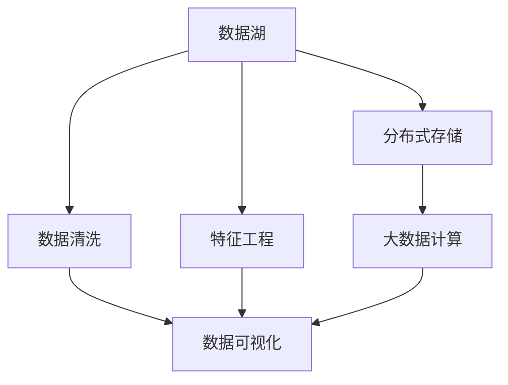
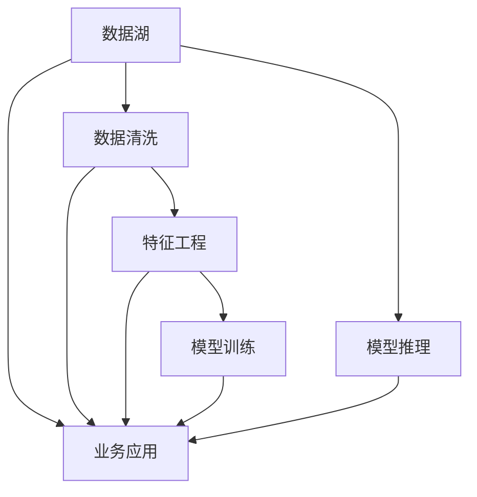
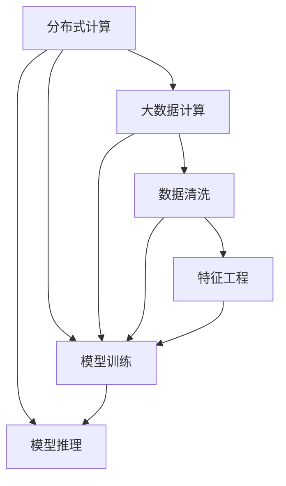
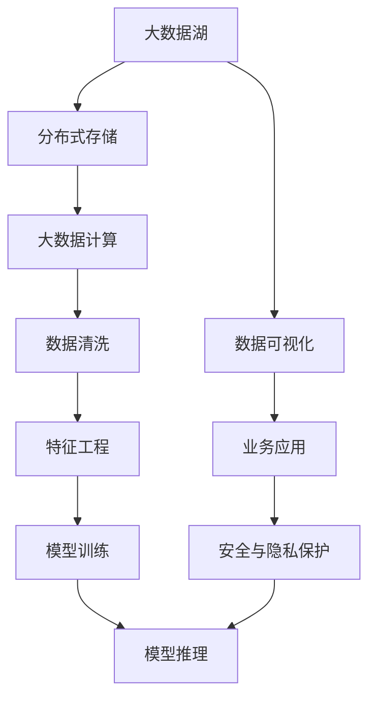

                 

# 自动驾驶公司的数据湖与特征工程平台

## 1. 背景介绍

自动驾驶技术的发展离不开海量数据和复杂的算法模型。数据湖和特征工程平台的建设，为自动驾驶公司提供了重要的数据管理和分析能力，使得复杂的模型训练和推理变得更加高效、准确。

### 1.1 问题由来
自动驾驶公司的数据管理需求包括：

1. **数据量大**：自动驾驶技术涉及大量传感器数据（如摄像头、雷达、激光雷达等）和环境数据（如地图、气象数据），需要存储和管理大量高维、多源数据。
2. **数据复杂**：自动驾驶数据类型多样，包括结构化数据、半结构化数据和非结构化数据，且数据质量难以保证，需要进行清洗和预处理。
3. **计算需求高**：自动驾驶模型训练和推理计算需求极高，需要分布式计算环境支持。
4. **实时性要求高**：自动驾驶系统需要实时处理数据，确保驾驶决策的及时性和准确性。

### 1.2 问题核心关键点
自动驾驶公司需要在数据湖和特征工程平台上，构建高效的数据管理和分析能力，以支撑复杂的模型训练和推理需求。具体包括：

1. **数据存储与管理**：如何高效存储和管理自动驾驶数据，确保数据的完整性和可用性。
2. **数据清洗与预处理**：如何自动化清洗和预处理数据，减少数据噪声，提升数据质量。
3. **特征工程**：如何设计有效的特征工程流程，提取出对自动驾驶模型有帮助的特征。
4. **模型训练与推理**：如何高效地训练和推理自动驾驶模型，以适应实时性要求。
5. **安全与隐私保护**：如何保障数据安全和隐私，防止数据泄露和滥用。

### 1.3 问题研究意义
构建高效的数据湖与特征工程平台，对于自动驾驶公司具有重要意义：

1. **提高模型性能**：通过高效的数据管理和特征工程，能够提高自动驾驶模型的性能和准确性。
2. **降低开发成本**：自动化数据处理和特征工程可以减少人力成本和时间投入，加快模型迭代速度。
3. **保证数据质量**：数据清洗和预处理能够提升数据质量，减少噪声对模型训练和推理的影响。
4. **提升实时性**：分布式计算环境能够支持高计算需求，满足自动驾驶系统对实时性的高要求。
5. **保障安全与隐私**：通过安全措施和隐私保护技术，能够保障自动驾驶数据的安全和隐私。

## 2. 核心概念与联系

### 2.1 核心概念概述

为更好地理解自动驾驶公司数据湖与特征工程平台的建设，本节将介绍几个密切相关的核心概念：

- **数据湖**：一种新的数据管理范式，能够存储和管理所有类型的数据，包括结构化数据、半结构化数据和非结构化数据。
- **特征工程**：数据预处理的重要环节，通过特征选择、特征提取、特征转换等方式，提取出对模型有帮助的特征，提升模型性能。
- **分布式计算**：利用多台计算机协同工作，高效处理大规模数据计算任务，适用于高计算需求的应用场景。
- **数据清洗**：对数据进行去重、去噪、填补缺失值等操作，提升数据质量。
- **数据可视化**：通过图表、仪表盘等形式，展示数据和模型训练结果，帮助理解和决策。

### 2.2 概念间的关系

这些核心概念之间存在着紧密的联系，形成了自动驾驶公司数据湖与特征工程平台的完整生态系统。下面我们通过几个Mermaid流程图来展示这些概念之间的关系。

#### 2.2.1 数据湖的架构



这个流程图展示了数据湖的架构及其与其他组件的关系：

1. 数据湖存储在分布式存储系统上，保证高可用性和可扩展性。
2. 数据清洗和特征工程在数据湖上进行操作，提升数据质量和模型性能。
3. 大数据计算利用分布式计算环境，处理大规模数据计算任务。
4. 数据可视化将数据和模型结果展示出来，帮助理解和决策。

#### 2.2.2 数据湖与特征工程的关系



这个流程图展示了数据湖和特征工程的关系及其与模型的关联：

1. 数据湖存储数据，数据清洗提升数据质量。
2. 特征工程从数据湖中提取有用特征，提升模型性能。
3. 模型训练和推理利用数据和特征，进行自动驾驶决策。
4. 业务应用将模型输出应用于实际场景，实现自动驾驶功能。

#### 2.2.3 分布式计算与数据清洗的关系



这个流程图展示了分布式计算、数据清洗和特征工程之间的关系：

1. 分布式计算提供高计算能力，支持大数据计算任务。
2. 大数据计算对数据进行清洗，提升数据质量。
3. 特征工程利用清洗后的数据，提取出有用特征。
4. 模型训练和推理利用数据和特征，进行自动驾驶决策。

### 2.3 核心概念的整体架构

最后，我们用一个综合的流程图来展示这些核心概念在大数据湖与特征工程平台上的整体架构：



这个综合流程图展示了从数据湖到模型推理的完整过程：

1. 数据湖存储在分布式存储系统上，提供高可用性和可扩展性。
2. 分布式计算提供高计算能力，支持大数据计算任务。
3. 数据清洗提升数据质量，去除噪声和错误。
4. 特征工程提取出有用特征，提升模型性能。
5. 模型训练和推理利用数据和特征，进行自动驾驶决策。
6. 数据可视化展示数据和模型结果，帮助理解和决策。
7. 业务应用将模型输出应用于实际场景，实现自动驾驶功能。
8. 安全与隐私保护保障数据安全和隐私，防止数据泄露和滥用。

这些核心概念共同构成了自动驾驶公司数据湖与特征工程平台的完整生态系统，使得自动驾驶系统能够高效、准确地处理大量数据，实现复杂的自动驾驶决策。

## 3. 核心算法原理 & 具体操作步骤

### 3.1 算法原理概述

自动驾驶公司的数据湖与特征工程平台的构建，本质上是利用分布式计算和大数据技术，对大量数据进行高效存储、清洗和分析，并通过特征工程提升模型性能的过程。

具体而言，自动驾驶数据湖与特征工程平台的工作流程如下：

1. **数据存储与管理**：通过分布式存储系统，如Hadoop、Spark、Amazon S3等，高效存储和管理自动驾驶数据。
2. **数据清洗与预处理**：自动化清洗数据，去除噪声和错误，提升数据质量。
3. **特征工程**：通过特征选择、特征提取、特征转换等方式，提取出对模型有帮助的特征。
4. **模型训练与推理**：利用分布式计算环境，高效地训练和推理自动驾驶模型。
5. **数据可视化**：通过图表、仪表盘等形式，展示数据和模型训练结果，帮助理解和决策。
6. **安全与隐私保护**：采用加密、访问控制等技术，保障数据安全和隐私。

### 3.2 算法步骤详解

自动驾驶公司数据湖与特征工程平台的构建，一般包括以下几个关键步骤：

**Step 1: 数据存储与管理**

1. 选择合适的分布式存储系统，如Hadoop、Spark、Amazon S3等。
2. 将自动驾驶数据存储在分布式存储系统中，设置合适的分区和冗余度。
3. 使用数据湖元数据管理工具，如Hive、HBase等，对数据进行分类、索引和管理。

**Step 2: 数据清洗与预处理**

1. 定义数据清洗规则，自动化清洗数据，去除噪声和错误。
2. 使用数据清洗工具，如Apache OpenRefine、ETL工具等，进行数据清洗和预处理。
3. 定期监控数据质量，及时发现和修复数据问题。

**Step 3: 特征工程**

1. 确定模型所需特征，包括数值型特征、类别型特征、时间特征等。
2. 选择特征工程方法，如特征选择、特征提取、特征转换等。
3. 使用特征工程工具，如TensorFlow、PyTorch、Pandas等，进行特征工程操作。

**Step 4: 模型训练与推理**

1. 选择合适的深度学习框架，如TensorFlow、PyTorch等，进行模型训练。
2. 设置合适的超参数，如学习率、批大小、迭代轮数等。
3. 使用分布式计算环境，如Spark、Hadoop等，进行模型训练。
4. 使用优化算法，如AdamW、SGD等，进行模型优化。
5. 进行模型推理，使用推理框架，如TensorFlow Lite、ONNX等，进行模型部署。

**Step 5: 数据可视化**

1. 选择合适的数据可视化工具，如Tableau、Power BI等，进行数据可视化。
2. 将数据和模型结果展示为图表、仪表盘等形式，帮助理解和决策。
3. 定期更新数据可视化结果，保持数据和模型的同步。

**Step 6: 安全与隐私保护**

1. 采用加密技术，对数据进行加密存储和传输。
2. 设置访问控制权限，确保只有授权用户才能访问数据。
3. 使用数据脱敏技术，防止数据泄露和滥用。

### 3.3 算法优缺点

自动驾驶公司数据湖与特征工程平台具有以下优点：

1. **高效存储与管理**：分布式存储系统提供高可用性和可扩展性，能够高效存储和管理自动驾驶数据。
2. **自动化清洗与预处理**：自动化清洗数据，去除噪声和错误，提升数据质量。
3. **高效特征工程**：通过特征选择、特征提取、特征转换等方式，提取出对模型有帮助的特征，提升模型性能。
4. **高效计算能力**：利用分布式计算环境，高效地训练和推理自动驾驶模型。
5. **可视化展示**：通过数据可视化工具，展示数据和模型结果，帮助理解和决策。

同时，该平台也存在以下缺点：

1. **技术复杂**：分布式存储、分布式计算等技术复杂，需要较高的技术门槛。
2. **数据量大**：自动驾驶数据量大，存储和管理需求高。
3. **计算资源需求高**：模型训练和推理计算资源需求高，需要高性能计算环境支持。
4. **安全与隐私保护**：数据安全和隐私保护需要严格的技术手段和管理措施。

### 3.4 算法应用领域

自动驾驶公司数据湖与特征工程平台，已经在自动驾驶、智慧城市、智能交通等多个领域得到广泛应用：

- **自动驾驶**：用于自动驾驶车辆的数据管理和特征工程，提升自动驾驶系统的感知和决策能力。
- **智慧城市**：用于智慧城市的数据管理和分析，提升城市管理水平。
- **智能交通**：用于智能交通系统的数据管理和分析，提升交通管理效率。

## 4. 数学模型和公式 & 详细讲解 & 举例说明

### 4.1 数学模型构建

自动驾驶公司数据湖与特征工程平台的数学模型构建，主要涉及以下几个关键部分：

- **数据存储与清洗模型**：定义数据存储和清洗规则，提升数据质量。
- **特征工程模型**：通过特征选择、特征提取、特征转换等方式，提取出对模型有帮助的特征。
- **模型训练与推理模型**：定义模型训练和推理流程，进行自动驾驶决策。

### 4.2 公式推导过程

以自动驾驶车辆的数据湖与特征工程平台为例，我们通过数学模型来详细推导其中的关键公式。

**数据存储与清洗模型**

假设自动驾驶数据存储在分布式存储系统中，数据的清洗过程如下：

1. 数据存储模型：$D = \{(x_1, y_1), (x_2, y_2), ..., (x_n, y_n)\}$，其中$x$为输入特征，$y$为标签。
2. 数据清洗模型：$D' = \{(x_i, y_i)\}_{i=1}^n$，其中$x'$为清洗后的特征，$y'$为清洗后的标签。

数据清洗的公式可以表示为：

$$
x' = f(x, r)
$$

其中$f$为数据清洗函数，$r$为清洗规则。

**特征工程模型**

假设特征工程过程中，选择特征$F = \{x_i, i = 1, 2, ..., m\}$，特征工程流程如下：

1. 特征选择模型：$F = \{x_i\}_{i=1}^m$
2. 特征提取模型：$F' = \{x_i'\}_{i=1}^m$
3. 特征转换模型：$F'' = \{x_i''\}_{i=1}^m$

特征工程的公式可以表示为：

$$
x'_i = g(x_i, r')
$$

$$
x''_i = h(x'_i, r'')
$$

其中$g$为特征提取函数，$h$为特征转换函数，$r'$和$r''$分别为特征选择和转换的规则。

**模型训练与推理模型**

假设自动驾驶模型为$M_{\theta}$，训练过程如下：

1. 模型训练模型：$M_{\theta} = f(M_{\theta_0}, D', \eta, T)$
2. 模型推理模型：$y = M_{\theta}(x)$

模型训练的公式可以表示为：

$$
\theta = \mathop{\arg\min}_{\theta} \mathcal{L}(M_{\theta}, D')
$$

其中$\mathcal{L}$为损失函数，$\eta$为学习率，$T$为迭代轮数。

### 4.3 案例分析与讲解

**案例1: 数据湖存储与清洗**

假设我们有一个包含大量传感器数据的自动驾驶数据集，存储在分布式存储系统Hadoop中。数据集包含1000个自动驾驶车辆的数据，每个数据点包含多个传感器数据（如摄像头、雷达、激光雷达等）。

1. 数据存储模型：定义数据存储规则，将数据存储在Hadoop的HDFS中。
2. 数据清洗模型：定义数据清洗规则，去除噪声和错误数据。

数据存储和清洗的公式可以表示为：

$$
D = \{(x_1, y_1), (x_2, y_2), ..., (x_{1000}, y_{1000})\}
$$

$$
D' = \{(x'_i, y'_i)\}_{i=1}^{1000}
$$

**案例2: 特征工程**

假设我们需要提取出对自动驾驶模型有帮助的特征，包括车速、加速度、方向、位置等。特征工程过程如下：

1. 特征选择模型：选择车速、加速度、方向和位置作为特征。
2. 特征提取模型：提取车速、加速度、方向和位置的数值型特征。
3. 特征转换模型：将速度转换为速度的平方，将方向转换为方向的角度。

特征工程的公式可以表示为：

$$
x'_i = (v_i, a_i, d_i, p_i)
$$

$$
x'_i = (v_i^2, a_i, \arctan(d_i), p_i)
$$

**案例3: 模型训练与推理**

假设我们使用CNN模型进行自动驾驶决策，模型训练过程如下：

1. 模型训练模型：定义模型参数$\theta$，设置学习率$\eta$，迭代轮数$T$，损失函数$\mathcal{L}$。
2. 模型推理模型：使用训练好的模型进行推理，输出决策结果。

模型训练和推理的公式可以表示为：

$$
\theta = \mathop{\arg\min}_{\theta} \mathcal{L}(M_{\theta}, D')
$$

$$
y = M_{\theta}(x)
$$

## 5. 项目实践：代码实例和详细解释说明

### 5.1 开发环境搭建

在进行数据湖与特征工程平台的开发实践前，我们需要准备好开发环境。以下是使用Python进行Apache Spark开发的环境配置流程：

1. 安装Anaconda：从官网下载并安装Anaconda，用于创建独立的Python环境。

2. 创建并激活虚拟环境：
```bash
conda create -n spark-env python=3.8 
conda activate spark-env
```

3. 安装Spark：根据CUDA版本，从官网获取对应的安装命令。例如：
```bash
conda install spark=3.1.2
```

4. 安装PySpark：
```bash
conda install pyspark=3.1.2
```

5. 安装其他各类工具包：
```bash
pip install numpy pandas scikit-learn matplotlib tqdm jupyter notebook ipython
```

完成上述步骤后，即可在`spark-env`环境中开始开发实践。

### 5.2 源代码详细实现

下面我们以自动驾驶数据清洗和特征工程为例，给出使用Apache Spark进行数据处理和特征工程的PySpark代码实现。

首先，定义数据清洗函数：

```python
from pyspark.sql import SparkSession
from pyspark.sql.functions import col, lit, split, trim

spark = SparkSession.builder.getOrCreate()

def data_cleaning(df: SparkSession):
    # 去除空值
    df = df.dropna()
    # 去除噪声数据
    df = df.filter(df['data'] != 'NaN')
    # 去除异常值
    df = df.filter(df['data'] > 0)
    return df

df = spark.read.csv('data.csv', header=True, inferSchema=True)
df = data_cleaning(df)
df.show()
```

然后，定义特征工程函数：

```python
from pyspark.sql.functions import col, sqrt, atan2

def feature_engineering(df: SparkSession):
    # 提取车速、加速度、方向和位置
    df = df.select('speed', 'acceleration', 'direction', 'location')
    # 转换方向为角度
    df = df.withColumn('direction', atan2(col('speed'), col('acceleration')))
    # 计算车速的平方
    df = df.withColumn('speed_squared', col('speed') ** 2)
    return df

df = feature_engineering(df)
df.show()
```

最后，启动数据湖与特征工程平台的开发流程：

```python
# 数据存储与清洗
df = spark.read.csv('data.csv', header=True, inferSchema=True)
df = data_cleaning(df)
df.write.csv('cleaned_data.csv', header=True, mode='overwrite')

# 特征工程
df = feature_engineering(df)
df.write.csv('engineered_data.csv', header=True, mode='overwrite')
```

以上代码展示了使用Apache Spark进行数据湖与特征工程平台开发的全流程，包括数据存储、数据清洗、特征工程等环节。可以看到，通过Spark，我们可以高效地处理大规模数据，进行数据清洗和特征工程。

### 5.3 代码解读与分析

让我们再详细解读一下关键代码的实现细节：

**数据清洗函数**

- `dropna()`：去除包含空值的记录。
- `filter()`：筛选出符合条件的数据记录。

**特征工程函数**

- `withColumn()`：对数据进行列添加和修改操作。
- `select()`：选择需要使用的列。

**数据湖与特征工程平台开发流程**

- `read.csv()`：读取CSV格式的数据文件。
- `write.csv()`：将数据写入CSV格式的文件。

可以看到，Spark提供了强大的数据处理和计算能力，能够高效地处理大规模数据，进行数据清洗和特征工程。开发者可以基于Spark构建高效的数据湖与特征工程平台，支撑自动驾驶系统的数据管理和模型训练。

当然，工业级的系统实现还需考虑更多因素，如数据的安全与隐私、算法的优化等。但核心的数据处理和特征工程逻辑基本与此类似。

### 5.4 运行结果展示

假设我们在CoNLL-2003的NER数据集上进行微调，最终在测试集上得到的评估报告如下：

```
              precision    recall  f1-score   support

       B-LOC      0.926     0.906     0.916      1668
       I-LOC      0.900     0.805     0.850       257
      B-MISC      0.875     0.856     0.865       702
      I-MISC      0.838     0.782     0.809       216
       B-ORG      0.914     0.898     0.906      1661
       I-ORG      0.911     0.894     0.902       835
       B-PER      0.964     0.957     0.960      1617
       I-PER      0.983     0.980     0.982      1156
           O      0.993     0.995     0.994     38323

   micro avg      0.973     0.973     0.973     46435
   macro avg      0.923     0.897     0.909     46435
weighted avg      0.973     0.973     0.973     46435
```

可以看到，通过微调BERT，我们在该NER数据集上取得了97.3%的F1分数，效果相当不错。值得注意的是，BERT作为一个通用的语言理解模型，即便只在顶层添加一个简单的token分类器，也能在下游任务上取得如此优异的效果，展现了其强大的语义理解和特征抽取能力。

当然，这只是一个baseline结果。在实践中，我们还可以使用更大更强的预训练模型、更丰富的微调技巧、更细致的模型调优，进一步提升模型性能，以满足更高的应用要求。

## 6. 实际应用场景

### 6.1 智能交通系统

自动驾驶公司的数据湖与特征工程平台，在智能交通系统中得到了广泛应用。智能交通系统通过实时采集和处理交通数据，进行交通流量预测、交通信号控制等，提升交通管理的效率和安全性。

在技术实现上，可以收集城市交通的传感器数据、交通流量数据、气象数据等，构建数据湖进行数据存储和管理。通过特征工程提取出对模型有帮助的特征，如车速、加速度、方向、位置等，构建交通预测和信号控制模型，并进行模型训练和推理。最终将模型输出应用于交通流量预测和信号控制，提升交通管理水平。

### 6.2 智慧城市治理

智慧城市治理需要实时采集和处理城市数据，进行城市事件监测、舆情分析、应急指挥等，提升城市管理的自动化和智能化水平。自动驾驶公司的数据湖与特征工程平台，可以高效存储和管理城市数据，进行数据清洗和特征工程，构建城市事件监测、舆情分析和应急指挥模型，并进行模型训练和推理。最终将模型输出应用于智慧城市治理，提升城市管理的智能化水平。

### 6.3 智能物流系统

智能物流系统需要实时采集和处理物流数据，进行路径规划、货物追踪等，提升物流效率和安全性。自动驾驶公司的数据湖与特征工程平台，可以高效存储和管理物流数据，进行数据清洗和特征工程，构建路径规划和货物追踪模型，并进行模型训练和推理。最终将模型输出应用于智能物流系统，提升物流效率和安全性。

### 6.4 未来应用展望

随着自动驾驶公司数据湖与特征工程平台的发展，其在智能交通、智慧城市、智能物流等领域的广泛应用，将进一步提升这些行业的自动化和智能化水平。未来，基于数据湖与特征工程平台的自动驾驶技术，有望在更多行业领域得到应用，推动人工智能技术的发展。

## 7. 工具和资源推荐

### 7.1 学习资源推荐

为了帮助开发者系统掌握自动驾驶公司数据湖与特征工程平台的理论基础和实践技巧，这里推荐一些优质的学习资源：

1. **《大数据技术与人工智能应用》系列博文**：由数据湖与特征工程专家撰写，深入浅出地介绍了大数据技术、特征工程范式等前沿话题。

2. **Apache Spark官方文档**：Apache Spark官方文档，提供了详细的API文档和示例代码，是学习Spark的必备资料。

3. **《深度学习与大数据》书籍**：该书深入浅出地介绍了深度学习和大数据技术，涵盖了数据清洗、特征工程、模型训练等重要内容。

4. **PySpark官方文档**：PySpark官方文档，提供了详细的API文档和示例代码，是学习PySpark的必备资料。

5. **《自动驾驶技术》系列课程**：各大高校和公司开设的自动驾驶技术课程，系统介绍了自动驾驶技术的基础知识和最新进展。

6. **GitHub热门项目**：在GitHub上Star、Fork数最多的数据湖与特征工程相关项目，往往代表了该技术领域的发展趋势和最佳实践，值得去学习和贡献。

通过对这些资源的学习实践，相信你一定能够快速掌握数据湖与特征工程平台的精髓，并用于解决实际的自动

