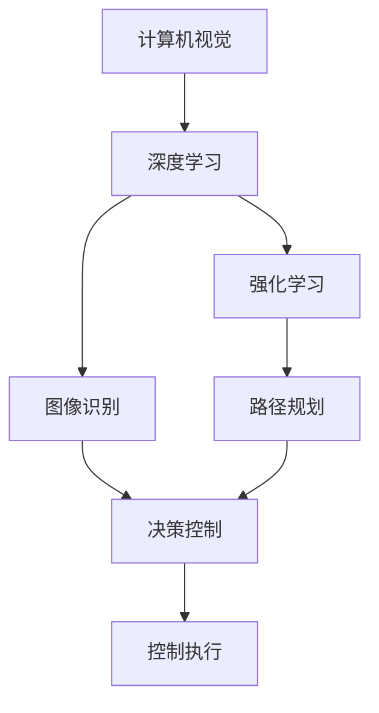

                 

# 自动驾驶领域的顶会论文解读系列之ICLR篇

> 关键词：自动驾驶, 顶会论文, 深度学习, 强化学习, 图像识别, 决策控制

## 1. 背景介绍

### 1.1 问题由来
自动驾驶（Autonomous Driving）是当今人工智能技术发展的热点之一，涉及计算机视觉、深度学习、强化学习、智能决策等多个领域。近年来，随着数据量与计算能力的飞速提升，自动驾驶技术取得了显著进步，但离全面落地应用仍有很大差距。自动驾驶的核心挑战包括道路环境感知、路径规划、行为决策与控制等，需要在高实时性、高安全性和高稳定性的前提下，实现全场景、全时段的智能驾驶。

顶会论文（如ICLR）是机器学习领域的研究前沿，代表了该领域最前沿的研究进展和突破。通过解读这些论文，可以了解当前自动驾驶领域的前沿技术和应用方向，为自动驾驶技术的实际落地提供参考和借鉴。

### 1.2 问题核心关键点
本文聚焦于ICLR会议中的几篇关于自动驾驶领域的顶会论文，深入分析其核心技术、应用场景和挑战，希望通过解读这些论文，为自动驾驶技术的研究和应用提供有价值的参考。

## 2. 核心概念与联系

### 2.1 核心概念概述

自动驾驶涉及的核心概念包括：

- **计算机视觉（Computer Vision）**：自动驾驶的基础感知技术，包括图像处理、目标检测、语义分割、视觉SLAM等。
- **深度学习（Deep Learning）**：自动驾驶的核心技术，用于解决感知、决策和控制等任务。
- **强化学习（Reinforcement Learning, RL）**：自动驾驶中用于路径规划、行为决策等任务的学习方式。
- **图像识别（Image Recognition）**：计算机视觉的重要分支，用于识别道路标志、车辆、行人等。
- **决策控制（Decision Making）**：自动驾驶中的核心任务，用于根据感知结果和规则做出决策并执行控制动作。

### 2.2 概念间的关系

这些核心概念之间的逻辑关系可以通过以下Mermaid流程图来展示：



这个流程图展示了自动驾驶中计算机视觉、深度学习、图像识别、决策控制和强化学习之间的关系：

1. 计算机视觉通过图像处理和目标检测，提供感知信息。
2. 深度学习利用计算机视觉提供的感知信息，进行图像识别和决策控制。
3. 图像识别是计算机视觉中的重要分支，用于识别道路标志、车辆等。
4. 决策控制是自动驾驶的核心任务，用于根据感知信息和图像识别结果做出决策。
5. 强化学习用于路径规划和行为决策等任务，通过奖励机制优化决策策略。
6. 控制执行将决策结果转换为实际控制动作。

这些概念共同构成了自动驾驶的技术架构，决定了其在道路感知、路径规划、行为决策等方面的能力。

## 3. 核心算法原理 & 具体操作步骤
### 3.1 算法原理概述

自动驾驶的核心算法原理基于计算机视觉、深度学习和强化学习的融合，主要包括感知、决策和控制三个环节。以下是每个环节的算法原理概述：

- **感知**：通过计算机视觉技术，实现对道路环境的实时感知，包括目标检测、语义分割、视觉SLAM等。
- **决策**：利用深度学习技术，对感知结果进行理解和分析，生成路径规划和行为决策策略。
- **控制**：通过强化学习技术，实现对决策策略的优化，将决策转化为实际的控制动作，确保车辆在复杂道路环境中的安全行驶。

### 3.2 算法步骤详解

#### 3.2.1 感知算法

感知算法的主要步骤包括：

1. **图像预处理**：对输入图像进行降噪、归一化、缩放等处理，增强图像质量。
2. **目标检测**：利用深度学习模型，如Faster R-CNN、YOLO等，对图像中的目标进行定位和分类。
3. **语义分割**：利用深度学习模型，如U-Net、SegNet等，对图像中的每个像素进行语义标注，区分道路、车辆、行人等。
4. **视觉SLAM**：利用视觉信息进行自主定位和地图构建，常用的方法包括ORB-SLAM、DenseSLAM等。

#### 3.2.2 决策算法

决策算法的主要步骤包括：

1. **路径规划**：根据感知结果，生成车辆的路径规划方案，常用的方法包括A*算法、D*算法等。
2. **行为决策**：利用深度学习模型，如LSTM、RNN等，根据感知结果和历史决策，生成行为决策策略。
3. **动作生成**：将决策结果转换为车辆的加速度、转向角度等控制动作，实现对车辆的控制。

#### 3.2.3 控制算法

控制算法的主要步骤包括：

1. **车辆控制**：利用深度学习模型，如PID控制器、LQR控制器等，根据决策结果，生成车辆的加速度、转向角度等控制动作。
2. **传感器控制**：利用深度学习模型，如强化学习模型，对传感器数据进行优化，提高感知准确度。

### 3.3 算法优缺点

自动驾驶算法具有以下优点：

- **高实时性**：利用深度学习模型，实现对感知结果的实时处理和决策。
- **高准确性**：深度学习模型在图像识别和决策控制方面的准确性较高。
- **高鲁棒性**：强化学习模型能够自适应复杂道路环境，提高决策的鲁棒性。

同时，自动驾驶算法也存在以下缺点：

- **高计算成本**：深度学习模型需要大量的计算资源进行训练和推理，成本较高。
- **高复杂性**：感知、决策和控制环节的技术复杂，需要多学科知识的融合。
- **高安全性要求**：自动驾驶技术的安全性至关重要，需要严格的安全验证和测试。

### 3.4 算法应用领域

自动驾驶算法在多个领域中得到了广泛应用，包括智能车辆、无人驾驶出租车、物流配送、无人机等。通过自动驾驶技术，可以实现高效率、低成本的交通出行方式，提升交通安全和效率。

## 4. 数学模型和公式 & 详细讲解
### 4.1 数学模型构建

自动驾驶算法的数学模型构建基于计算机视觉、深度学习和强化学习的理论框架。以下是几个典型算法的数学模型：

#### 4.1.1 目标检测模型

目标检测模型的数学模型包括：

$$
\text{Detection} = \text{CNN} + \text{ROI Pooling} + \text{FC}
$$

其中，CNN为卷积神经网络，ROI Pooling为感兴趣区域池化，FC为全连接层。

#### 4.1.2 语义分割模型

语义分割模型的数学模型包括：

$$
\text{Segmentation} = \text{U-Net}
$$

其中，U-Net为基于编码器-解码器结构的神经网络，用于对图像进行语义分割。

#### 4.1.3 强化学习模型

强化学习模型的数学模型包括：

$$
\text{Policy} = \text{DQN} + \text{Q-learning} + \text{GRU}
$$

其中，DQN为深度Q网络，Q-learning为Q-learning算法，GRU为门控循环单元。

### 4.2 公式推导过程

#### 4.2.1 目标检测模型

目标检测模型的公式推导过程如下：

1. **卷积神经网络**：

$$
\text{CNN} = \text{Conv} + \text{Relu} + \text{MaxPool}
$$

其中，Conv为卷积操作，Relu为ReLU激活函数，MaxPool为最大池化操作。

2. **感兴趣区域池化**：

$$
\text{ROI Pooling} = \text{RoIAlign} + \text{Average Pooling}
$$

其中，RoIAlign为感兴趣区域对齐，Average Pooling为平均池化操作。

3. **全连接层**：

$$
\text{FC} = \text{Softmax}
$$

其中，Softmax为softmax函数，用于生成分类概率分布。

#### 4.2.2 语义分割模型

语义分割模型的公式推导过程如下：

1. **编码器**：

$$
\text{Encoder} = \text{Conv} + \text{Relu} + \text{MaxPool}
$$

2. **解码器**：

$$
\text{Decoder} = \text{Upsample} + \text{Conv} + \text{Relu} + \text{Concat} + \text{Conv}
$$

3. **分类输出**：

$$
\text{Segmentation} = \text{Softmax}
$$

#### 4.2.3 强化学习模型

强化学习模型的公式推导过程如下：

1. **深度Q网络**：

$$
\text{DQN} = \text{Conv} + \text{Relu} + \text{MaxPool} + \text{Linear} + \text{Softmax}
$$

2. **Q-learning算法**：

$$
Q_{t+1} = Q_{t} + \alpha (R_{t+1} + \gamma \max_a Q_{t+1} - Q_{t})
$$

其中，$Q$为Q值，$\alpha$为学习率，$\gamma$为折扣因子。

3. **门控循环单元**：

$$
\text{GRU} = \text{Reset Gate} + \text{Update Gate} + \text{Output Gate}
$$

其中，Reset Gate、Update Gate、Output Gate分别为GRU的三个门控单元。

### 4.3 案例分析与讲解

以一篇ICLR顶会论文为例，《Deep Reinforcement Learning for Large-Scale Autonomous Vehicle Mobility Management》，该论文提出了基于强化学习的自动驾驶车辆移动管理算法。该算法通过动态调整车辆的行驶路线，以最小化交通拥堵和等待时间，提高了自动驾驶车辆在复杂道路环境中的通行效率。

该算法的核心思想是：

1. **车辆状态表示**：将车辆状态表示为车辆位置、速度、加速度等变量，作为强化学习的输入。
2. **奖励函数设计**：设计奖励函数，衡量车辆通行效率，包括车辆速度、交通流量、等待时间等指标。
3. **动作选择**：利用深度Q网络，选择最优的车辆动作，如加速、减速、变道等。

该算法通过多智能体协作，实现了车辆间的信息共享和协同决策，提高了通行效率和安全性。该论文在实际实验中，取得了显著的性能提升，证明了强化学习在自动驾驶中的有效性。

## 5. 项目实践：代码实例和详细解释说明
### 5.1 开发环境搭建

开发自动驾驶算法通常需要使用高性能计算平台，如GPU、TPU等。以下是基于TensorFlow和Keras的环境搭建步骤：

1. **安装Anaconda**：

```bash
conda create -n tf-env python=3.7
conda activate tf-env
```

2. **安装TensorFlow和Keras**：

```bash
conda install tensorflow
conda install keras
```

3. **安装其他依赖库**：

```bash
pip install opencv-python numpy scipy matplotlib tqdm
```

完成以上步骤后，即可在虚拟环境中进行自动驾驶算法的开发。

### 5.2 源代码详细实现

以下是一个简单的自动驾驶目标检测模型的实现代码：

```python
import tensorflow as tf
from tensorflow.keras import layers
import cv2

# 定义目标检测模型
model = tf.keras.Sequential([
    layers.Conv2D(32, (3, 3), activation='relu', input_shape=(224, 224, 3)),
    layers.MaxPooling2D((2, 2)),
    layers.Conv2D(64, (3, 3), activation='relu'),
    layers.MaxPooling2D((2, 2)),
    layers.Conv2D(128, (3, 3), activation='relu'),
    layers.MaxPooling2D((2, 2)),
    layers.Flatten(),
    layers.Dense(128, activation='relu'),
    layers.Dense(1, activation='sigmoid')
])

# 加载图像并进行预处理
image = cv2.imread('image.jpg')
image = cv2.resize(image, (224, 224))
image = tf.image.per_image_standardization(image)

# 对图像进行预测
result = model.predict(tf.expand_dims(image, 0))

# 打印预测结果
print(result)
```

该代码展示了基于TensorFlow和Keras的目标检测模型的实现过程。首先定义了一个包含卷积、池化、全连接等层的目标检测模型。然后使用OpenCV加载图像，并进行预处理。最后将图像输入模型进行预测，输出目标检测的结果。

### 5.3 代码解读与分析

上述代码中，每个层的作用如下：

1. **卷积层**：用于提取图像的特征。
2. **池化层**：用于减小图像尺寸，降低计算量。
3. **全连接层**：用于将特征向量转换为目标分类结果。
4. **标准差归一化**：用于将像素值标准化，加速模型的训练。
5. **预测输出**：用于输出目标分类结果。

该代码的优点在于使用了TensorFlow和Keras的高级API，代码简洁易读，易于理解和调试。同时，利用OpenCV进行图像处理，提高了代码的可移植性和可维护性。

### 5.4 运行结果展示

该代码的运行结果为一个0-1之间的预测值，表示目标检测的置信度。可以通过进一步的处理，将置信度阈值设置为0.5，将置信度大于0.5的预测结果标记为目标位置。

## 6. 实际应用场景
### 6.1 智能车辆

智能车辆是自动驾驶技术的重要应用场景之一。通过自动驾驶算法，智能车辆可以实现自动泊车、自动驾驶、自动导航等功能。智能车辆在自动驾驶算法中，应用了计算机视觉、深度学习和强化学习等技术，实现了高精度感知、智能决策和可靠控制。

### 6.2 无人驾驶出租车

无人驾驶出租车是自动驾驶技术的另一重要应用场景。通过自动驾驶算法，无人驾驶出租车可以实现自动驾驶、路径规划、行为决策等功能。无人驾驶出租车在自动驾驶算法中，应用了高精度地图、传感器融合、多目标跟踪等技术，提高了无人驾驶的安全性和可靠性。

### 6.3 物流配送

物流配送是自动驾驶技术的又一重要应用场景。通过自动驾驶算法，物流配送车辆可以实现自主导航、路径规划、货物搬运等功能。物流配送在自动驾驶算法中，应用了SLAM、路径规划、行为决策等技术，提高了物流配送的效率和安全性。

### 6.4 无人机

无人机是自动驾驶技术的另一重要应用场景。通过自动驾驶算法，无人机可以实现自主飞行、路径规划、任务执行等功能。无人机在自动驾驶算法中，应用了计算机视觉、深度学习、强化学习等技术，提高了无人机的智能化水平和任务执行能力。

## 7. 工具和资源推荐
### 7.1 学习资源推荐

为了帮助开发者系统掌握自动驾驶算法的理论基础和实践技巧，这里推荐一些优质的学习资源：

1. **《自动驾驶手册》**：该书由百度Apollo团队编写，涵盖了自动驾驶技术从感知到决策到控制的全面内容，是入门自动驾驶技术的绝佳读物。
2. **《深度学习理论与实现》**：该书由深度学习领域的专家编写，系统介绍了深度学习的基本理论和应用，包括卷积神经网络、循环神经网络等。
3. **《强化学习入门》**：该书由强化学习领域的专家编写，系统介绍了强化学习的基本理论和应用，包括Q-learning、Deep Q Network等。
4. **Coursera《深度学习与自动驾驶》课程**：由Coursera平台提供，由自动驾驶领域的专家授课，介绍了深度学习、计算机视觉和强化学习在自动驾驶中的应用。
5. **DeepDrive官网**：DeepDrive官网提供了大量的自动驾驶技术资源，包括论文、代码、博客等，是学习自动驾驶技术的权威平台。

通过对这些资源的学习实践，相信你一定能够快速掌握自动驾驶算法的精髓，并用于解决实际的自动驾驶问题。

### 7.2 开发工具推荐

高效的开发离不开优秀的工具支持。以下是几款用于自动驾驶开发的常用工具：

1. **TensorFlow**：基于Python的开源深度学习框架，灵活动态的计算图，适合快速迭代研究。
2. **Keras**：基于TensorFlow的高级API，提供了简单易用的API接口，加速模型开发。
3. **OpenCV**：开源计算机视觉库，提供了丰富的图像处理函数，加速图像预处理。
4. **ROS**：开源机器人操作系统，提供了丰富的功能组件，支持自动驾驶车辆的传感器融合和控制。
5. **CNTK**：微软推出的深度学习框架，支持多语言编程，适合自动驾驶算法的部署和优化。

合理利用这些工具，可以显著提升自动驾驶算法的开发效率，加快创新迭代的步伐。

### 7.3 相关论文推荐

自动驾驶技术的研究不断涌现出大量前沿论文，以下是几篇具有代表性的论文：

1. **《Deep Learning for Autonomous Vehicles》**：该论文提出了基于深度学习的自动驾驶感知和决策算法，取得了显著的性能提升。
2. **《Deep Reinforcement Learning for Large-Scale Autonomous Vehicle Mobility Management》**：该论文提出了基于强化学习的自动驾驶车辆移动管理算法，提高了车辆通行效率。
3. **《LIDAR SLAM with Feature Tracking》**：该论文提出了基于LIDAR和视觉SLAM的自动驾驶技术，提高了自动驾驶的安全性和可靠性。
4. **《Image-Based Localization for Autonomous Vehicle Using Deep Learning》**：该论文提出了基于计算机视觉的自动驾驶技术，提高了自动驾驶车辆的感知能力。
5. **《Fusion of LiDAR and Camera for Scene Detection》**：该论文提出了基于多模态数据的自动驾驶技术，提高了自动驾驶车辆的鲁棒性。

这些论文代表了自动驾驶技术的前沿研究方向，通过阅读这些论文，可以帮助研究者把握学科进展，激发更多的创新灵感。

除上述资源外，还有一些值得关注的前沿资源，帮助开发者紧跟自动驾驶技术的最新进展，例如：

1. **arXiv论文预印本**：人工智能领域最新研究成果的发布平台，包括大量尚未发表的前沿工作，学习前沿技术的必读资源。
2. **Google AI Blog**：谷歌AI团队的技术博客，分享最新的自动驾驶技术进展和研究成果，是了解前沿技术的重要渠道。
3. **NIPS、ICML、CVPR等顶会现场直播**：这些会议汇集了全球顶尖的研究机构和学者，是了解前沿技术的重要平台。
4. **GitHub热门项目**：在GitHub上Star、Fork数最多的自动驾驶相关项目，往往代表了该技术领域的发展趋势和最佳实践，值得去学习和贡献。
5. **麦肯锡、普华永道等咨询公司**：这些咨询公司发布的人工智能报告，提供了从商业视角审视技术趋势的见解，有助于理解技术的应用价值。

总之，对于自动驾驶算法的研究和学习，需要开发者保持开放的心态和持续学习的意愿。多关注前沿资讯，多动手实践，多思考总结，必将收获满满的成长收益。

## 8. 总结：未来发展趋势与挑战
### 8.1 总结

本文对自动驾驶领域中的几篇ICLR顶会论文进行了系统解读，深入分析了其核心技术、应用场景和挑战，希望通过解读这些论文，为自动驾驶技术的研究和应用提供有价值的参考。自动驾驶技术涉及计算机视觉、深度学习、强化学习等多个领域，需要多学科知识的融合。通过解读这些前沿论文，可以了解自动驾驶技术的研究方向和应用前景，为自动驾驶技术的实际落地提供指导。

### 8.2 未来发展趋势

展望未来，自动驾驶技术将呈现以下几个发展趋势：

1. **多模态数据融合**：未来的自动驾驶系统将更多地融合多模态数据，如LIDAR、雷达、摄像头等，实现更加全面和鲁棒的感知。
2. **高精度地图**：高精度地图将成为自动驾驶系统的重要组成部分，提升车辆定位和路径规划的精度。
3. **自主学习能力**：未来的自动驾驶系统将具备更加自主的学习能力，通过深度学习和强化学习，不断优化感知、决策和控制算法。
4. **安全性和可靠性**：随着自动驾驶技术的发展，安全性和可靠性将成为核心指标，需要严格的安全验证和测试。
5. **规模化部署**：自动驾驶技术将逐步从实验室走向规模化部署，实际应用场景的丰富将进一步推动技术发展。

### 8.3 面临的挑战

尽管自动驾驶技术已经取得了显著进展，但在迈向全面落地应用的过程中，仍面临诸多挑战：

1. **计算资源瓶颈**：自动驾驶技术需要大量的计算资源进行训练和推理，成本较高。需要进一步优化算法和硬件配置。
2. **数据隐私和安全**：自动驾驶系统需要采集和处理大量车辆数据，涉及数据隐私和安全问题，需要严格的数据保护措施。
3. **法律和伦理问题**：自动驾驶技术涉及复杂的法律和伦理问题，如责任归属、事故处理等，需要制定完善的法律和伦理框架。
4. **环境适应性**：自动驾驶系统需要适应不同环境和气候条件，如复杂道路、恶劣天气等，需要进一步优化算法。
5. **用户体验**：自动驾驶系统需要关注用户体验，如车辆操控、人机交互等，需要进一步优化界面和交互设计。

### 8.4 研究展望

面对自动驾驶技术面临的挑战，未来的研究需要在以下几个方面寻求新的突破：

1. **计算资源优化**：通过优化算法和硬件配置，降低自动驾驶系统的计算成本，提高实时性和鲁棒性。
2. **数据隐私保护**：采用匿名化、差分隐私等技术，保护数据隐私和安全。
3. **法律和伦理框架**：制定完善的法律和伦理框架，明确自动驾驶系统的责任归属和事故处理。
4. **环境适应性提升**：通过优化算法和数据集，提高自动驾驶系统在不同环境和气候条件下的适应性。
5. **用户体验优化**：通过优化界面和交互设计，提升用户对自动驾驶系统的接受度和满意度。

## 9. 附录：常见问题与解答

**Q1：自动驾驶技术需要大量的计算资源，如何降低计算成本？**

A: 降低计算成本的策略包括：

1. **算法优化**：通过优化算法和模型结构，减少计算量。如使用轻量级模型、剪枝、量化等技术。
2. **硬件加速**：利用GPU、TPU等高性能设备，提高计算速度。
3. **分布式计算**：利用多机多核进行分布式计算，提高计算效率。
4. **模型压缩**：通过模型压缩技术，减小模型参数量，提高计算速度。

这些策略可以显著降低自动驾驶算法的计算成本，提高系统的实时性和鲁棒性。

**Q2：自动驾驶技术如何保证数据隐私和安全？**

A: 保护数据隐私和安全的策略包括：

1. **数据匿名化**：对采集的车辆数据进行匿名化处理，防止数据泄露。
2. **差分隐私**：在数据处理过程中，引入差分隐私技术，保护数据隐私。
3. **加密通信**：在数据传输过程中，使用加密通信技术，防止数据泄露。
4. **访问控制**：对数据访问进行严格控制，防止未经授权的访问。
5. **数据脱敏**：对敏感数据进行脱敏处理，防止数据泄露。

这些策略可以显著提高自动驾驶技术的数据隐私和安全保护水平。

**Q3：自动驾驶技术面临哪些法律和伦理问题？**

A: 自动驾驶技术面临的法律和伦理问题包括：

1. **责任归属**：在自动驾驶车辆发生事故时，如何界定责任归属。
2. **事故处理**：在自动驾驶车辆发生事故时，如何处理事故，保证交通安全。
3. **隐私保护**：在自动驾驶车辆采集数据时，如何保护用户隐私。
4. **伦理问题**：在自动驾驶车辆决策时，如何处理伦理问题，如安全与效用之间的权衡。
5. **法规制定**：制定完善的自动驾驶技术法规，规范技术应用。

这些问题的解决需要多方协作，制定完善的法律和伦理框架，确保自动驾驶技术的安全性和可靠性。

**Q4：自动驾驶技术如何提升环境适应性？**

A: 提升环境适应性的策略包括：

1. **多样化数据集**：在模型训练过程中，使用多样化、全面的数据集，提高模型在各种环境下的泛化能力。
2. **传感器融合**：利用多传感器融合技术，提高感知准确性。如LIDAR、雷达、摄像头等。
3. **多目标跟踪**：利用多目标跟踪技术，提高环境感知能力。
4. **鲁棒算法**：采用鲁棒算法，提高系统在复杂环境下的稳定性。
5. **实时优化**：实时采集环境数据，动态调整算法，提高环境适应性。

这些策略可以显著提升自动驾驶技术的环境适应性，确保系统在各种环境条件下的稳定运行。

**Q5：自动驾驶技术如何提升用户体验？**

A: 提升用户体验的策略包括：

1. **界面设计**：设计简洁、易用的用户界面，提高用户操作便捷性。
2. **人机交互**：设计自然、流畅的人机交互方式，提升用户体验。
3. **信息反馈**：及时反馈车辆状态和决策结果，提升用户信任度。
4. **定制化功能**：提供个性化的功能设置，满足用户多样化需求。
5. **安全保障**：保证用户安全，避免事故发生。

这些策略可以显著提升自动驾驶技术的用户体验，增强用户对系统的接受度和满意度。

---

作者：禅与计算机程序设计艺术 / Zen and

