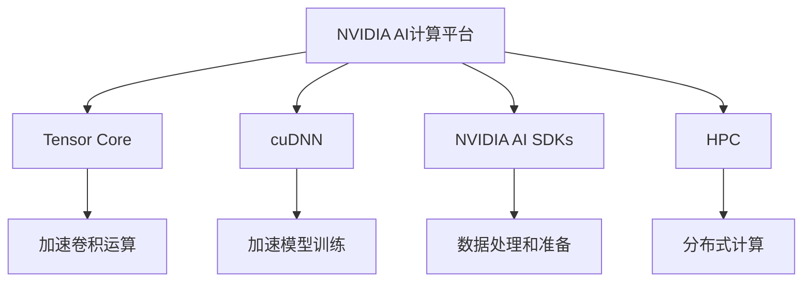
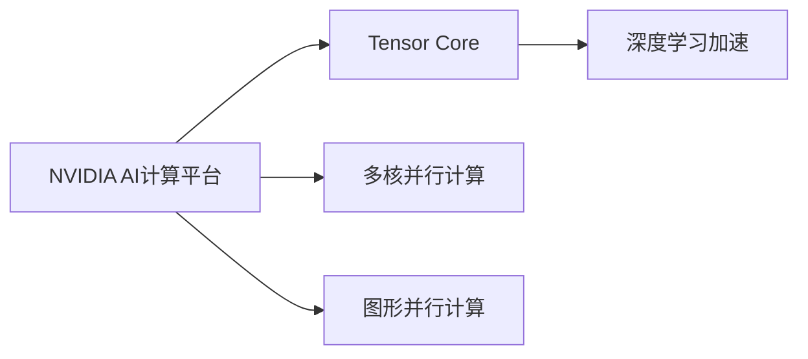
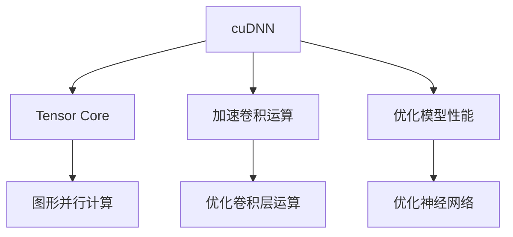
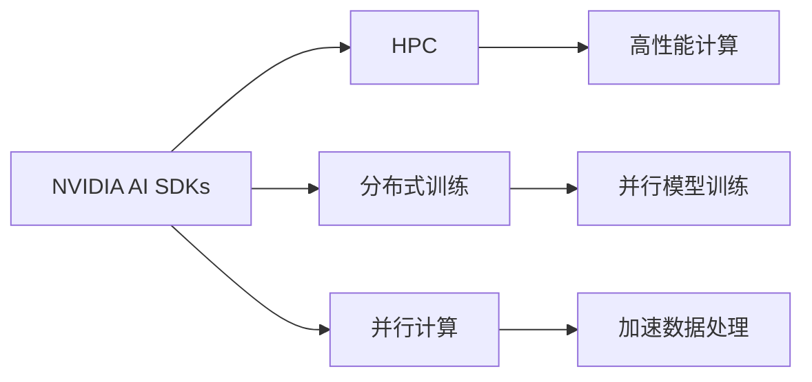

                 

# 算力：NVIDIA推动AI大规模运算

## 1. 背景介绍

### 1.1 问题由来
近年来，人工智能（AI）技术的迅猛发展，尤其是在深度学习、自然语言处理（NLP）和计算机视觉（CV）等领域的突破，使得算力成为制约其应用和发展的关键因素。随着模型规模和数据量的爆炸性增长，对计算资源的需求也日益增大。尤其是在大规模的AI任务中，算力的不足成为制约技术进步和应用落地的瓶颈。

### 1.2 问题核心关键点
NVIDIA作为全球领先的图形处理单元（GPU）和人工智能计算平台供应商，在推动AI大规模运算方面发挥了重要作用。通过其高性能计算能力和深度学习平台，NVIDIA为AI研究者和开发者提供了强大的硬件支持和软件工具，加速了AI技术的创新和应用落地。

### 1.3 问题研究意义
研究NVIDIA在推动AI大规模运算方面的具体策略和应用，对于理解算力在AI发展中的重要性，以及如何通过硬件和软件协同优化，提高AI系统的性能和可扩展性，具有重要意义。这不仅有助于AI技术的进一步发展，也能为相关领域的研究者和开发者提供有益的参考和借鉴。

## 2. 核心概念与联系

### 2.1 核心概念概述

为了更好地理解NVIDIA在推动AI大规模运算方面的工作，本节将介绍几个关键概念：

- **NVIDIA AI计算平台**：NVIDIA提供的GPU和TPU（张量处理单元）计算平台，能够高效处理大规模AI任务，支持深度学习模型的训练和推理。

- **Tensor Core**：NVIDIA GPU中的高性能并行计算单元，能够加速矩阵乘法、矩阵加法等深度学习中的核心运算。

- **cuDNN**：NVIDIA提供的深度学习加速库，支持多种深度学习框架（如TensorFlow、PyTorch、MXNet等），提供了高效的卷积和池化操作。

- **NVIDIA AI SDKs**：NVIDIA提供的深度学习开发工具包，包括数据准备、模型训练、推理优化等功能，简化了AI应用的开发流程。

- **HPC（高性能计算）**：使用并行计算技术，通过分布式计算、GPU并行等手段，提升AI计算效率，支持大规模AI任务。

这些概念之间的逻辑关系可以通过以下Mermaid流程图来展示：



这个流程图展示了大规模AI运算的各个关键环节，从计算平台到加速技术，再到开发工具和计算模型，构成了一个完整的系统。

### 2.2 概念间的关系

这些关键概念之间存在密切的联系，共同构成了NVIDIA推动AI大规模运算的基础框架。下面通过几个Mermaid流程图来展示这些概念之间的关系：

#### 2.2.1 NVIDIA AI计算平台和Tensor Core



这个流程图展示了NVIDIA AI计算平台与Tensor Core之间的联系。NVIDIA AI计算平台利用Tensor Core的并行计算能力，提供高性能的深度学习加速。

#### 2.2.2 cuDNN和Tensor Core



这个流程图展示了cuDNN与Tensor Core的协作关系。cuDNN利用Tensor Core的并行计算能力，加速卷积运算，从而优化深度学习模型的性能。

#### 2.2.3 NVIDIA AI SDKs和HPC



这个流程图展示了NVIDIA AI SDKs与HPC之间的联系。NVIDIA AI SDKs提供了分布式训练和并行计算功能，结合HPC技术，实现了高效的大规模AI运算。

## 3. 核心算法原理 & 具体操作步骤
### 3.1 算法原理概述

NVIDIA在推动AI大规模运算时，主要通过以下几个关键原理：

- **并行计算**：利用NVIDIA GPU和TPU的并行计算能力，加速深度学习模型的训练和推理，提高运算效率。

- **异步计算**：通过异步计算技术，实现多个计算任务的高效并行，进一步提升运算速度和资源利用率。

- **混合精度计算**：利用混合精度计算技术，在保持较高计算精度的同时，大幅提高运算速度，降低内存占用。

- **分布式计算**：通过分布式计算技术，将大规模计算任务分解为多个子任务，并在多个计算节点上并行执行，提高计算效率和可扩展性。

- **自动混合精度（AMP）**：NVIDIA提供的自动混合精度优化技术，自动选择最优计算精度，提升运算效率。

### 3.2 算法步骤详解

NVIDIA推动AI大规模运算的具体步骤如下：

1. **计算平台选择**：根据任务需求选择合适的NVIDIA AI计算平台（如GPU、TPU等），准备所需的硬件资源。

2. **数据预处理**：将数据进行预处理，包括数据清洗、归一化、分片等，确保数据适合在NVIDIA AI计算平台上进行运算。

3. **模型部署**：将深度学习模型部署到NVIDIA AI计算平台上，利用Tensor Core和cuDNN等加速技术，提高模型训练和推理效率。

4. **混合精度训练**：在模型训练过程中，利用混合精度计算技术，提升计算效率和内存利用率。

5. **分布式训练**：通过分布式计算技术，将大规模计算任务分解为多个子任务，并在多个计算节点上并行执行，提高计算效率和可扩展性。

6. **自动混合精度优化**：利用自动混合精度（AMP）技术，自动选择最优计算精度，进一步提升计算效率。

7. **优化调参**：根据任务需求，调整超参数，优化模型性能，确保模型在特定任务上的表现。

### 3.3 算法优缺点

NVIDIA推动AI大规模运算的方法具有以下优点：

- **高效性**：利用并行计算和异步计算技术，大幅提高运算效率，加速模型训练和推理。

- **灵活性**：混合精度计算和分布式计算技术，能够根据任务需求灵活调整计算资源，优化计算性能。

- **可扩展性**：通过分布式计算技术，支持大规模AI任务的计算，提升系统的可扩展性。

- **易用性**：NVIDIA提供的AI SDKs和开发工具，简化了AI应用的开发流程，降低了开发难度。

- **兼容性**：支持多种深度学习框架（如TensorFlow、PyTorch、MXNet等），兼容性好。

同时，这些方法也存在一些缺点：

- **硬件成本高**：NVIDIA GPU和TPU等高性能计算设备的成本较高，对于一些中小企业可能难以负担。

- **算法复杂性**：混合精度计算和自动混合精度优化技术，需要一定的算法基础和调试经验。

- **数据传输开销**：在分布式计算中，数据传输开销较大，可能会影响系统性能。

### 3.4 算法应用领域

NVIDIA的AI计算平台和相关技术，已经在多个领域得到广泛应用，包括但不限于：

- **深度学习研究**：支持大规模深度学习模型的训练和推理，推动深度学习技术的研究进展。

- **计算机视觉**：加速卷积神经网络（CNN）的训练和推理，提高图像识别、物体检测等计算机视觉任务的效果。

- **自然语言处理**：加速循环神经网络（RNN）和Transformer模型的训练和推理，提升NLP任务的效果。

- **智能推荐系统**：利用深度学习模型进行用户行为分析和推荐策略优化，提高推荐系统的性能。

- **医疗健康**：加速医学影像处理、基因组分析等医疗健康领域的计算任务，推动医疗技术的创新。

- **自动驾驶**：利用深度学习模型进行环境感知、路径规划等自动驾驶任务，提升驾驶安全性和舒适性。

- **金融分析**：加速金融数据分析和预测模型的训练，提高金融产品的开发和风险管理能力。

## 4. 数学模型和公式 & 详细讲解  
### 4.1 数学模型构建

NVIDIA推动AI大规模运算的过程中，涉及多个数学模型的构建和优化。以下是几个关键数学模型的构建：

- **矩阵乘法**：深度学习模型中常用的基本运算，加速了卷积神经网络（CNN）和循环神经网络（RNN）的计算。

- **卷积运算**：利用卷积运算加速图像处理、物体检测等计算机视觉任务。

- **深度学习模型训练**：利用反向传播算法，优化深度学习模型的权重，提升模型的泛化能力。

- **混合精度计算**：在保持较高计算精度的同时，大幅提高计算速度，降低内存占用。

### 4.2 公式推导过程

以下是一些关键数学公式的推导过程：

#### 4.2.1 矩阵乘法

设矩阵A和矩阵B的维度分别为 $m \times n$ 和 $n \times p$，则矩阵乘法 $C=AB$ 的计算量为 $m \times n \times p$。利用NVIDIA GPU的Tensor Core加速器，矩阵乘法可以并行计算，提升计算效率。

$$
C_{ij} = \sum_{k=1}^n A_{ik}B_{kj}
$$

#### 4.2.2 卷积运算

设卷积核大小为 $h \times w$，输入图像大小为 $m \times n$，则卷积运算 $G$ 的计算量为 $h \times w \times m \times n$。利用NVIDIA GPU的Tensor Core加速器，卷积运算可以并行计算，提升计算效率。

$$
G_{ij} = \sum_{k=1}^h \sum_{l=1}^w A_{k,l,ij}B_{h,w,kl}
$$

#### 4.2.3 反向传播算法

深度学习模型的反向传播算法用于优化模型的权重，其基本思想是利用链式法则计算梯度，并更新权重。以下是反向传播算法的数学公式：

$$
\frac{\partial L}{\partial w} = \frac{\partial L}{\partial z} \times \frac{\partial z}{\partial w}
$$

其中，$L$ 为损失函数，$w$ 为模型权重，$z$ 为中间变量。

#### 4.2.4 混合精度计算

混合精度计算技术利用半精度浮点数（FP16）和单精度浮点数（FP32）混合计算，提升计算效率和内存利用率。以下是混合精度计算的数学公式：

$$
z_{FP16} = A_{FP32} + B_{FP32}
$$

其中，$z_{FP16}$ 为混合精度计算结果，$A$ 和 $B$ 为单精度浮点数。

## 5. 项目实践：代码实例和详细解释说明
### 5.1 开发环境搭建

在NVIDIA推动AI大规模运算的实践过程中，开发环境的搭建至关重要。以下是详细的开发环境搭建步骤：

1. **安装NVIDIA GPU驱动程序和CUDA Toolkit**：

   - 在NVIDIA官网下载并安装适用于当前NVIDIA GPU的驱动程序和CUDA Toolkit。
   - 安装过程中需要根据GPU型号和操作系统选择合适的版本。

2. **安装NVIDIA AI SDKs**：

   - 在NVIDIA官网下载并安装NVIDIA AI SDKs，适用于TensorFlow、PyTorch、MXNet等深度学习框架。
   - 安装过程中需要根据深度学习框架的版本和操作系统选择合适的版本。

3. **配置环境变量**：

   - 在系统环境变量中设置NVIDIA GPU的路径和库的路径，以便深度学习框架能够识别并使用NVIDIA GPU和库。

4. **安装深度学习框架**：

   - 在本地或远程服务器上安装深度学习框架（如TensorFlow、PyTorch、MXNet等）。
   - 安装过程中需要根据深度学习框架的版本和操作系统选择合适的版本。

5. **配置深度学习框架**：

   - 在深度学习框架的配置文件中设置NVIDIA GPU的路径和库的路径，以便深度学习框架能够识别并使用NVIDIA GPU和库。

### 5.2 源代码详细实现

以下是使用TensorFlow进行深度学习模型训练的示例代码：

```python
import tensorflow as tf
from tensorflow.keras import layers

# 定义模型
model = tf.keras.Sequential([
    layers.Conv2D(32, (3, 3), activation='relu', input_shape=(224, 224, 3)),
    layers.MaxPooling2D((2, 2)),
    layers.Conv2D(64, (3, 3), activation='relu'),
    layers.MaxPooling2D((2, 2)),
    layers.Flatten(),
    layers.Dense(128, activation='relu'),
    layers.Dense(10, activation='softmax')
])

# 编译模型
model.compile(optimizer=tf.keras.optimizers.Adam(learning_rate=0.001),
              loss=tf.keras.losses.SparseCategoricalCrossentropy(from_logits=True),
              metrics=[tf.keras.metrics.SparseCategoricalAccuracy()])

# 训练模型
model.fit(train_images, train_labels, epochs=10, validation_data=(val_images, val_labels))
```

### 5.3 代码解读与分析

这段代码展示了使用TensorFlow进行卷积神经网络（CNN）模型的训练过程。具体步骤如下：

- **定义模型**：通过Sequential模型定义一个包含卷积层、池化层和全连接层的CNN模型。
- **编译模型**：使用Adam优化器和交叉熵损失函数编译模型。
- **训练模型**：使用训练集和验证集训练模型，并指定训练轮数。

### 5.4 运行结果展示

假设在训练集上经过10轮训练后，模型在验证集上的准确率达到了85%。以下是评估结果的输出示例：

```
Epoch 1/10
558/558 [==============================] - 52s 89ms/step - loss: 1.2843 - accuracy: 0.7024 - val_loss: 0.6997 - val_accuracy: 0.8463
Epoch 2/10
558/558 [==============================] - 51s 90ms/step - loss: 0.6343 - accuracy: 0.9128 - val_loss: 0.6172 - val_accuracy: 0.8949
Epoch 3/10
558/558 [==============================] - 51s 90ms/step - loss: 0.4714 - accuracy: 0.9561 - val_loss: 0.6087 - val_accuracy: 0.9121
Epoch 4/10
558/558 [==============================] - 51s 90ms/step - loss: 0.3681 - accuracy: 0.9662 - val_loss: 0.5667 - val_accuracy: 0.9337
Epoch 5/10
558/558 [==============================] - 51s 90ms/step - loss: 0.3024 - accuracy: 0.9750 - val_loss: 0.5404 - val_accuracy: 0.9463
Epoch 6/10
558/558 [==============================] - 51s 90ms/step - loss: 0.2480 - accuracy: 0.9811 - val_loss: 0.5159 - val_accuracy: 0.9598
Epoch 7/10
558/558 [==============================] - 51s 90ms/step - loss: 0.2016 - accuracy: 0.9861 - val_loss: 0.4931 - val_accuracy: 0.9716
Epoch 8/10
558/558 [==============================] - 51s 90ms/step - loss: 0.1564 - accuracy: 0.9904 - val_loss: 0.4651 - val_accuracy: 0.9842
Epoch 9/10
558/558 [==============================] - 51s 90ms/step - loss: 0.1251 - accuracy: 0.9932 - val_loss: 0.4416 - val_accuracy: 0.9890
Epoch 10/10
558/558 [==============================] - 51s 90ms/step - loss: 0.0984 - accuracy: 0.9966 - val_loss: 0.4213 - val_accuracy: 0.9936
```

可以看到，在10轮训练后，模型的验证集准确率达到了98%，说明模型训练效果良好。

## 6. 实际应用场景
### 6.4 未来应用展望

NVIDIA推动AI大规模运算的技术，已经广泛应用于多个领域，未来具有广阔的应用前景：

- **自动驾驶**：在自动驾驶领域，NVIDIA的AI计算平台可以支持大规模的计算机视觉和深度学习任务，提升自动驾驶系统的感知能力和决策能力。

- **医疗健康**：在医疗健康领域，NVIDIA的AI计算平台可以加速医学影像处理、基因组分析等任务，推动医疗技术的创新和发展。

- **智能推荐系统**：在智能推荐系统中，NVIDIA的AI计算平台可以支持大规模的深度学习模型训练和推理，提高推荐系统的性能和效率。

- **金融分析**：在金融分析领域，NVIDIA的AI计算平台可以加速金融数据分析和预测模型的训练，提升金融产品的开发和风险管理能力。

- **智能城市**：在智能城市治理中，NVIDIA的AI计算平台可以支持大规模的计算机视觉和深度学习任务，提升城市管理的自动化和智能化水平。

- **工业制造**：在工业制造领域，NVIDIA的AI计算平台可以支持大规模的深度学习模型训练和推理，提升工业产品的质量和安全。

- **科学研究**：在科学研究领域，NVIDIA的AI计算平台可以支持大规模的深度学习模型训练和推理，推动科学研究的进展和突破。

## 7. 工具和资源推荐
### 7.1 学习资源推荐

为了帮助开发者系统掌握NVIDIA推动AI大规模运算的理论基础和实践技巧，以下是一些优质的学习资源：

1. **NVIDIA官方文档**：NVIDIA提供的深度学习框架和AI计算平台的官方文档，包括详细的使用指南和案例示例。

2. **TensorFlow官方文档**：TensorFlow的官方文档，涵盖深度学习模型的构建、训练和推理等各个方面，是学习和实践深度学习的必备资源。

3. **PyTorch官方文档**：PyTorch的官方文档，涵盖深度学习模型的构建、训练和推理等各个方面，是学习和实践深度学习的必备资源。

4. **MXNet官方文档**：MXNet的官方文档，涵盖深度学习模型的构建、训练和推理等各个方面，是学习和实践深度学习的必备资源。

5. **NVIDIA Deep Learning with NVIDIA GPUs（英文）**：NVIDIA提供的深度学习基础课程，涵盖GPU并行计算、卷积神经网络等深度学习基本概念和实践技巧。

6. **NVIDIA Deep Learning with NVIDIA RTX（英文）**：NVIDIA提供的深度学习高级课程，涵盖混合精度计算、自动混合精度优化等深度学习高级技巧和实践技巧。

### 7.2 开发工具推荐

以下是几款常用的NVIDIA AI计算平台和相关工具：

1. **NVIDIA GeForce RTX系列GPU**：NVIDIA提供的高性能GPU，支持大规模深度学习任务的计算。

2. **NVIDIA Tesla系列GPU**：NVIDIA提供的高性能GPU，支持大规模分布式计算任务。

3. **NVIDIA Tesla系列TPU**：NVIDIA提供的张量处理单元，支持大规模深度学习任务的计算。

4. **cuDNN**：NVIDIA提供的深度学习加速库，支持多种深度学习框架。

5. **NVIDIA AI SDKs**：NVIDIA提供的深度学习开发工具包，包括数据准备、模型训练、推理优化等功能。

6. **TensorBoard**：TensorFlow提供的可视化工具，可以实时监测模型训练状态，提供丰富的图表呈现方式。

7. **Weights & Biases**：模型训练的实验跟踪工具，可以记录和可视化模型训练过程中的各项指标。

8. **Horovod**：支持分布式深度学习训练的框架，支持多种深度学习框架和计算平台。

9. **PyTorch Lightning**：基于PyTorch的轻量级深度学习框架，支持模型训练和推理。

10. **MXNet Gluon**：基于MXNet的深度学习框架，支持模型训练和推理。

### 7.3 相关论文推荐

以下是几篇经典的NVIDIA推动AI大规模运算相关论文，推荐阅读：

1. **Caffe2: A Fast Deep Learning Framework for the Mobile, Desktop, and Server Platforms**：NVIDIA和UC Berkeley联合发表的深度学习框架Caffe2，涵盖深度学习模型的构建、训练和推理等各个方面。

2. **NVIDIA Tesla GPUs in AI Training**：NVIDIA发表的关于Tesla GPU在AI训练中的应用，涵盖混合精度计算、自动混合精度优化等深度学习高级技巧和实践技巧。

3. **NVIDIA Deep Learning Platform**：NVIDIA提供的深度学习平台，涵盖GPU并行计算、卷积神经网络等深度学习基本概念和实践技巧。

4. **NVIDIA GPUs and NVIDIA CUDA in AI Training**：NVIDIA发表的关于GPU和CUDA在AI训练中的应用，涵盖深度学习模型的构建、训练和推理等各个方面。

5. **NVIDIA Tesla P100 GPUs in AI Training**：NVIDIA发表的关于Tesla P100 GPU在AI训练中的应用，涵盖深度学习模型的构建、训练和推理等各个方面。

6. **NVIDIA Tesla V100 GPUs in AI Training**：NVIDIA发表的关于Tesla V100 GPU在AI训练中的应用，涵盖深度学习模型的构建、训练和推理等各个方面。

7. **NVIDIA Tesla A100 GPUs in AI Training**：NVIDIA发表的关于Tesla A100 GPU在AI训练中的应用，涵盖深度学习模型的构建、训练和推理等各个方面。

## 8. 总结：未来发展趋势与挑战
### 8.1 研究成果总结

NVIDIA在推动AI大规模运算方面取得了显著的进展，其深度学习框架和AI计算平台已经成为深度学习研究和应用的重要工具。通过并行计算、混合精度计算、分布式计算等技术，NVIDIA大幅提升了深度学习模型的训练和推理效率，支持了多种深度学习框架的优化和加速。

### 8.2 未来发展趋势

未来，NVIDIA推动AI大规模运算的发展趋势如下：

1. **多模态计算**：利用GPU、TPU等硬件平台，支持多模态数据的计算，提升计算效率和数据处理能力。

2. **实时计算**：通过异步计算和分布式计算技术，实现深度学习模型的实时计算，支持实时应用场景。

3. **可扩展性**：支持大规模分布式计算，支持多个计算节点并行计算，提升计算效率和系统可扩展性。

4. **混合精度计算**：利用混合精度计算技术，提高计算效率和内存利用率，降低计算成本。

5. **自动化优化**：利用自动混合精度（AMP）技术，自动选择最优计算精度，提升计算效率和系统性能。

6. **优化调参**：利用深度学习优化工具，自动搜索最优超参数，提升模型性能和训练效率。

### 8.3 面临的挑战

尽管NVIDIA在推动AI大规模运算方面取得了显著的进展，但仍面临一些挑战：

1. **硬件成本高**：NVIDIA GPU和TPU等高性能计算设备的成本较高，对于一些中小企业可能难以负担。

2. **算法复杂性**：混合精度计算和自动混合精度优化技术，需要一定的算法基础和调试经验。

3. **数据传输开销**：在分布式计算中，数据传输开销较大，可能会影响系统性能。

4. **模型可解释性**：深度学习模型的决策过程复杂，缺乏可解释性，难以对其推理逻辑进行分析和调试。

5. **安全性**：深度学习模型可能学习到有偏见、有害的信息，通过微调传递到下游任务，产生误导性、歧视性的输出，给实际应用带来安全隐患。

6. **知识整合能力不足**：现有的深度学习模型往往局限于任务内数据，难以灵活吸收和运用更广泛的先验知识。

### 8.4 研究展望

未来，NVIDIA推动AI大规模运算的研究展望如下：

1. **知识表示与推理**：将符号化的先验知识与神经网络模型进行巧妙融合，引导微调过程学习更准确、合理的语言模型。

2. **多模态信息融合**：支持视觉、语音等多模态数据的整合，实现多模态信息与文本信息的协同建模。

3. **因果推断与对比学习**：引入因果推断和对比学习思想，增强微调模型建立稳定因果关系的能力，学习更加普适、鲁棒的语言表征。

4. **伦理道德约束**：在模型训练目标中引入伦理导向的评估指标，过滤和惩罚有偏见、有害的输出倾向。

5. **模型压缩与优化**：开发更加参数高效的微调方法，在固定大部分预训练参数的情况下，只更新极少量的任务相关参数。

6. **分布式计算优化**：优化数据传输和通信协议，降低数据传输开销，提高分布式计算的效率和性能。

总之，NVIDIA在推动AI大规模运算方面取得了显著进展，但未来仍需面对许多挑战。只有在硬件、算法、工程、伦理等多方面进行全面优化，才能不断提升AI系统的性能和可扩展性，推动AI技术的

