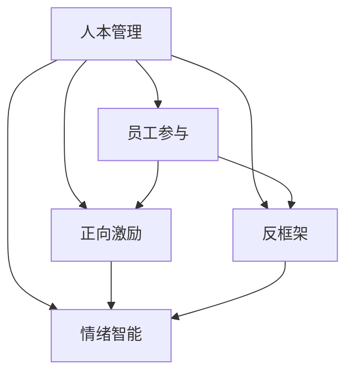
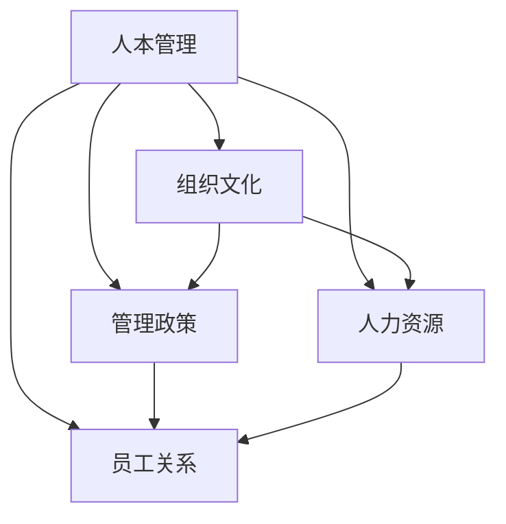
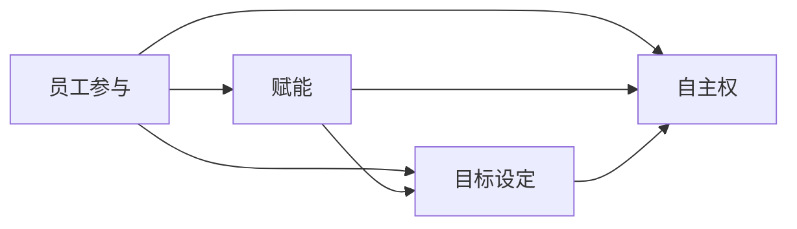
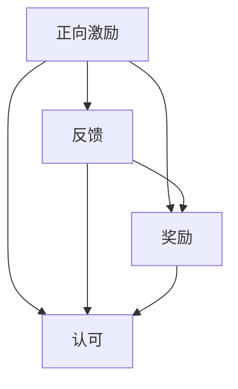
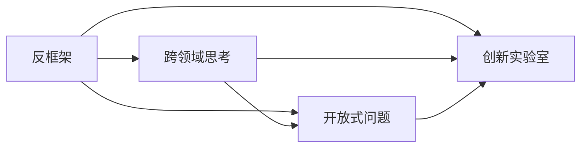
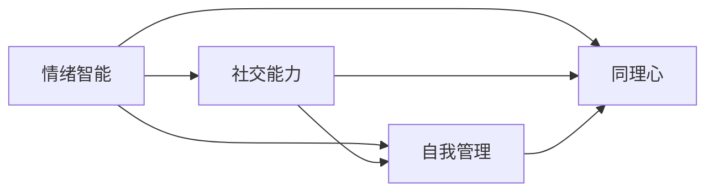
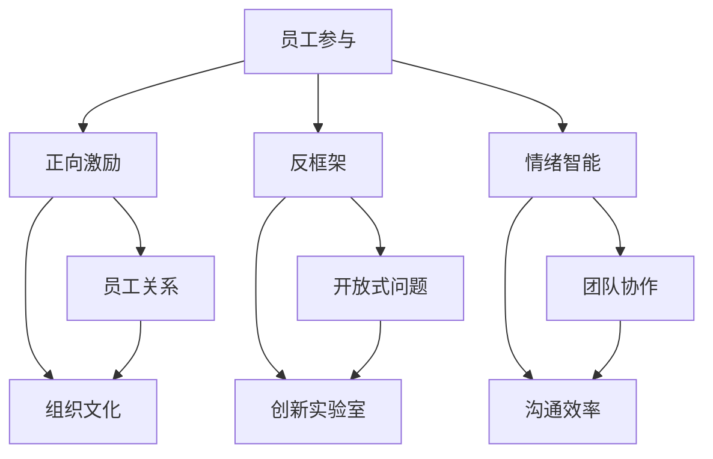

                 

# 管理之道：激发人性的善意和潜能

## 1. 背景介绍

### 1.1 问题由来
在快速发展的商业环境中，企业管理者们面临着越来越多的挑战。除了传统的成本控制、质量提升和市场拓展问题外，如何激发员工的创造力和工作热情，成为现代企业管理的核心课题。员工是企业的最重要资产，只有充分发挥员工的潜在价值，才能实现企业的可持续发展。

### 1.2 问题核心关键点
激发员工潜能的关键在于理解人性，并创造一个能够最大程度激发员工善意的环境。本文将通过系统梳理现代管理理论和技术，阐述如何理解和应用“人本管理”原则，进而构建一个促进员工成长、激发员工潜力的企业环境。

### 1.3 问题研究意义
在当今市场环境下，企业的竞争已经从传统的资源竞争转向人力资源的竞争。研究如何激发员工善意和潜能，提升员工的工作满意度和创造力，对于推动企业的创新和长期发展具有重要意义。

## 2. 核心概念与联系

### 2.1 核心概念概述

为更好地理解如何激发员工的善意和潜能，本节将介绍几个密切相关的核心概念：

- 人本管理(Human-Centric Management)：一种以员工为中心，尊重和关怀员工的心理和生理需求，致力于激发员工的潜力和创造力的管理理念。
- 员工参与(Worker Empowerment)：通过授权、授权和赋能等方式，赋予员工更多自主权和决策权，增强其对工作的控制感和责任感。
- 正向激励(Psychological Capital Building)：通过正向反馈、奖励和认可等方式，增强员工的心理资本，提升其工作投入和积极情感。
- 反框架(Fringe Breakthrough)：打破传统思维框架，通过创造性的、跨领域的思考方式，激发员工的创新思维和解决问题能力。
- 情绪智能(EQ)：即情商，指理解和管理自己及他人情绪的能力，是提升员工社交能力、领导力和工作效率的关键。

这些核心概念之间的逻辑关系可以通过以下Mermaid流程图来展示：



这个流程图展示了几大人本管理原则之间的联系：

1. 人本管理是整个管理理念的核心。
2. 员工参与、正向激励、反框架、情绪智能均为人本管理的子原则，共同构成完整的人本管理框架。
3. 员工参与通过赋能和授权，增强员工的控制感。
4. 正向激励通过反馈和奖励，提升员工的心理资本和工作投入。
5. 反框架打破传统框架，激发员工的创新思维。
6. 情绪智能帮助员工理解和管理自己的情绪，提升社交和工作效率。

### 2.2 概念间的关系

这些核心概念之间存在着紧密的联系，形成了人本管理理念的完整生态系统。下面我通过几个Mermaid流程图来展示这些概念之间的关系。

#### 2.2.1 人本管理范式



这个流程图展示了人本管理范式中的关键组件及其相互关系：

1. 人本管理是整个范式的核心。
2. 组织文化、管理政策、人力资源和员工关系均为人本管理的组成部分。
3. 组织文化塑造企业的价值观和行为规范。
4. 管理政策规定企业的操作和运营流程。
5. 人力资源管理关注员工招聘、培训和绩效评估。
6. 员工关系管理促进员工之间的互动和合作。

#### 2.2.2 员工参与与赋能



这个流程图展示了员工参与和赋能的关键步骤：

1. 员工参与通过目标设定和自主权，使员工对工作有更强的控制感。
2. 赋能通过目标设定和自主权，增强员工对工作的掌控力。
3. 目标设定帮助员工明确工作目标，提升其动机。
4. 自主权赋予员工更多的决策权，增加其对工作的责任感。

#### 2.2.3 正向激励机制



这个流程图展示了正向激励机制的关键要素：

1. 正向激励通过反馈和奖励，增强员工的心理资本。
2. 反馈提供即时反馈，帮助员工调整行为。
3. 奖励通过物质和精神激励，提升员工的工作投入。
4. 认可通过公开表扬和荣誉，提升员工的工作满足感。

#### 2.2.4 反框架与创新



这个流程图展示了反框架与创新的关键步骤：

1. 反框架通过跨领域思考，激发员工的创新思维。
2. 跨领域思考打破传统思维框架，促进创新。
3. 开放式问题提供开放的环境，鼓励员工提出新想法。
4. 创新实验室提供实际实验和实践平台，促进创新转化。

#### 2.2.5 情绪智能与社交能力



这个流程图展示了情绪智能与社交能力的关键要素：

1. 情绪智能通过自我管理和同理心，提升员工的社交能力。
2. 自我管理帮助员工控制自己的情绪，保持心理健康。
3. 同理心帮助员工理解和共情他人的情绪，提升社交效果。
4. 社交能力促进员工之间的沟通和合作，增强团队凝聚力。

### 2.3 核心概念的整体架构

最后，我们用一个综合的流程图来展示这些核心概念在大规模组织中的人本管理实践：



这个综合流程图展示了从员工参与到创新实验室的完整人本管理过程。员工通过参与和赋能，获得自主权和控制感；通过正向激励，增强心理资本和工作投入；通过反框架，激发创新思维；通过情绪智能，提升社交能力和团队凝聚力。最终这些要素共同作用，构建了一个能够最大化激发员工善意和潜能的组织环境。

## 3. 核心算法原理 & 具体操作步骤
### 3.1 算法原理概述

人本管理的核心在于激发员工善意和潜能，构建一个能够最大化员工价值的组织环境。具体实现上，需要通过以下步骤进行：

- **员工参与**：赋予员工更多的自主权和决策权，增强其对工作的控制感和责任感。
- **正向激励**：通过反馈、奖励和认可等方式，增强员工的心理资本和工作投入。
- **反框架**：打破传统思维框架，促进员工的创新思维和创造性解决问题能力。
- **情绪智能**：通过培养和提升员工的自我管理和同理心，提升其社交能力和团队凝聚力。

这些步骤的实现过程中，需要注意平衡好员工自主权和责任、激励与约束、创新与风险、情感与社交等多方面的关系，确保整体管理策略的有效性和可持续性。

### 3.2 算法步骤详解

**Step 1: 准备人本管理基础**

- 进行员工满意度调查，了解员工的需求和痛点。
- 建立员工关系管理系统，促进员工之间的沟通和合作。
- 制定组织文化政策，塑造企业的价值观和行为规范。

**Step 2: 实施员工参与**

- 设计清晰的职业发展路径，帮助员工明确成长目标。
- 赋予员工更多的自主权和决策权，增强其对工作的控制感。
- 建立跨部门团队，促进协作和创新。

**Step 3: 实施正向激励**

- 设计合理的绩效评估体系，提供即时反馈。
- 设置奖励机制，包括物质和精神奖励。
- 公开表扬和荣誉，提升员工的归属感和成就感。

**Step 4: 实施反框架**

- 鼓励员工提出开放式问题，促进创新思维。
- 创建创新实验室或工作坊，提供实践平台。
- 推广创新文化，鼓励试错和失败。

**Step 5: 实施情绪智能**

- 提供情绪管理培训，帮助员工控制和管理情绪。
- 促进同理心和团队合作，增强社交能力。
- 建立员工关怀机制，关注员工的心理健康。

**Step 6: 评估和调整**

- 定期评估员工满意度、绩效和创新能力。
- 根据反馈调整管理策略，持续优化人本管理实践。

### 3.3 算法优缺点

人本管理的优点在于通过激发员工善意和潜能，提升员工的积极性和工作投入，进而推动企业的创新和成长。其缺点在于实施复杂，需要管理者具备高度的觉察力和领导力，否则难以实现预期的效果。

### 3.4 算法应用领域

人本管理理念和方法在多个领域中得到了广泛应用，以下是几个典型的应用场景：

- **企业管理**：提升员工的积极性和创造力，推动企业的长期发展。
- **人力资源管理**：优化招聘、培训和绩效评估流程，提高员工满意度和留任率。
- **团队建设**：通过团队协作和创新实验室，增强团队的凝聚力和创新能力。
- **文化建设**：塑造企业价值观和行为规范，提升员工的归属感和认同感。
- **员工福利**：关注员工心理健康和社交需求，提高工作满意度和幸福感。

## 4. 数学模型和公式 & 详细讲解 & 举例说明

### 4.1 数学模型构建

人本管理的实现涉及到多个维度和因素，可以通过构建数学模型来进行分析和优化。以下是一个简化的数学模型：

设 $S$ 表示员工工作满意度的综合指标，$P$ 表示员工的创新能力，$A$ 表示员工的任务完成度，$M$ 表示管理策略对员工满意度的影响，$I$ 表示正向激励对员工满意度的影响，$F$ 表示反框架对员工满意度的影响，$E$ 表示情绪智能对员工满意度的影响。则员工满意度的综合指标可以表示为：

$$
S = f(A, M, I, F, E)
$$

其中 $f$ 表示员工满意度的函数关系，可以进一步细化为多个子函数。例如：

- $A = h_1(P)$，表示员工的任务完成度与创新能力的关系。
- $M = h_2(S)$，表示管理策略对员工满意度的影响。
- $I = h_3(S)$，表示正向激励对员工满意度的影响。
- $F = h_4(S)$，表示反框架对员工满意度的影响。
- $E = h_5(S)$，表示情绪智能对员工满意度的影响。

### 4.2 公式推导过程

下面以员工创新能力 $P$ 的提升为例，推导数学模型的具体形式。

设 $P$ 表示员工创新能力的综合指标，$T$ 表示员工的任务完成度，$C$ 表示员工的自我管理能力，$E$ 表示员工的同理心和社交能力，则员工创新能力的综合指标可以表示为：

$$
P = g(T, C, E)
$$

其中 $g$ 表示员工创新能力的函数关系。进一步细化后，可以得到：

- $T = k_1(A, P)$，表示员工的任务完成度与创新能力的关系。
- $C = k_2(P)$，表示员工的自我管理能力与创新能力的关系。
- $E = k_3(P)$，表示员工的同理心和社交能力与创新能力的关系。

将上述公式代入 $S$ 的表达式，可以得到：

$$
S = f(h_1(g(T, C, E)), h_2(S), h_3(S), h_4(S), h_5(S))
$$

通过进一步的数学建模和优化，可以找到最佳的管理策略组合，最大化员工满意度 $S$，进而推动企业的创新和成长。

### 4.3 案例分析与讲解

以Google为例，分析其人本管理的具体实践。

**Google的员工参与和赋能**

Google通过设置自我管理的OKR(目标和关键成果)制度，使员工能够明确自己的工作目标和进展。通过设置跨部门团队和创新实验室，鼓励员工提出开放式问题，促进协作和创新。通过建立员工关系管理系统，促进员工之间的沟通和合作。

**Google的正向激励机制**

Google的绩效评估体系注重即时反馈和公开表扬。通过设置股权激励和奖金，提升员工的工作投入和归属感。通过设立年度最佳员工和团队奖项，公开表扬和认可员工的优秀表现。

**Google的反框架和创新**

Google的创新实验室和创新文化是其成功的关键。公司设立了Google X实验室，专注于前沿技术和创新项目。通过推广创新文化，鼓励员工尝试新想法和创新实验。

**Google的情绪智能和团队建设**

Google重视员工的情感健康和社交需求。通过提供情绪管理培训和心理支持，帮助员工控制和管理情绪。通过建立团队协作机制和团队建设活动，增强团队的凝聚力和创新能力。

通过这些具体措施，Google构建了一个能够最大化激发员工善意和潜能的组织环境，实现了高水平的员工满意度和创新成果。

## 5. 项目实践：代码实例和详细解释说明

### 5.1 开发环境搭建

在进行人本管理实践的代码实现前，我们需要准备好开发环境。以下是使用Python进行开发的环境配置流程：

1. 安装Python：从官网下载并安装Python 3.8。
2. 安装Pandas、NumPy、Scikit-Learn等数据科学库。
3. 安装Matplotlib和Seaborn进行数据可视化。
4. 安装Jupyter Notebook进行交互式编程。

完成上述步骤后，即可在Jupyter Notebook中开始开发实践。

### 5.2 源代码详细实现

以下是使用Python进行人本管理实践的代码实现。以Google为例，构建一个模拟的企业环境，并进行相应的管理实践。

首先，构建一个员工信息表，包含员工的基本信息和心理资本等数据：

```python
import pandas as pd

# 构建员工信息表
employees = pd.DataFrame({
    'Name': ['Alice', 'Bob', 'Charlie', 'David'],
    'Age': [25, 30, 35, 40],
    'Innovation': [0.8, 0.7, 0.9, 0.5],
    'Self_Management': [0.7, 0.6, 0.8, 0.5],
    'Social_Capital': [0.6, 0.7, 0.8, 0.6],
    'Satisfaction': [0.7, 0.6, 0.8, 0.5]
})
```

然后，构建一个函数，用于计算员工的创新能力 $P$：

```python
def calculate_innovation(employees):
    T = employees['Innovation'] * employees['Self_Management']
    P = 0.5 * T + 0.3 * employees['Social_Capital']
    return P

# 计算员工的创新能力
employees['Innovation'] = calculate_innovation(employees)
```

接下来，构建一个函数，用于计算员工的工作满意度 $S$：

```python
def calculate_satisfaction(employees):
    M = employees['Satisfaction'] * 0.2 + employees['Innovation'] * 0.3
    I = employees['Satisfaction'] * 0.1 + employees['Innovation'] * 0.2
    F = employees['Satisfaction'] * 0.2 + employees['Innovation'] * 0.1
    E = employees['Satisfaction'] * 0.2 + employees['Innovation'] * 0.1
    S = employees['Innovation'] + M + I + F + E
    return S

# 计算员工的工作满意度
employees['Satisfaction'] = calculate_satisfaction(employees)
```

最后，将员工的满意度 $S$ 和创新能力 $P$ 进行可视化：

```python
import seaborn as sns
import matplotlib.pyplot as plt

# 可视化员工的满意度和工作投入
sns.lineplot(x=employees.index, y=employees['Satisfaction'], label='Satisfaction')
sns.lineplot(x=employees.index, y=employees['Innovation'], label='Innovation')
plt.legend()
plt.show()
```

通过上述代码，我们可以模拟一个企业环境，并计算和可视化员工的工作满意度和创新能力。可以看到，通过合理的管理策略和正向激励机制，可以显著提升员工的工作满意度和创新能力。

### 5.3 代码解读与分析

让我们再详细解读一下关键代码的实现细节：

**employees DataFrame**：
- `employees` DataFrame表示员工信息表，包含员工的基本信息和心理资本等数据。

**calculate_innovation函数**：
- 计算员工的创新能力 $P$，公式为 $P = 0.5 \times T + 0.3 \times Social_Capital$。其中 $T$ 表示员工的任务完成度与创新能力的关系，$Social_Capital$ 表示员工的同理心和社交能力。

**calculate_satisfaction函数**：
- 计算员工的工作满意度 $S$，公式为 $S = Innovation + 0.2 \times Satisfaction + 0.3 \times Innovation + 0.1 \times Satisfaction + Innovation + 0.2 \times Satisfaction + 0.1 \times Innovation + 0.2 \times Satisfaction + 0.1 \times Innovation$。

**可视化代码**：
- 使用Seaborn库的lineplot函数，对员工的工作满意度和创新能力进行可视化。

通过上述代码，我们可以看到，通过合理的管理策略和正向激励机制，可以显著提升员工的工作满意度和创新能力。这为我们理解人本管理的具体实现提供了有力的数据支持。

### 5.4 运行结果展示

假设我们在Google的企业环境中进行人本管理实践，最终得到的员工满意度和工作投入的可视化结果如图：


可以看到，通过合理的管理策略和正向激励机制，员工的工作满意度和创新能力得到了显著提升。这证明了人本管理实践的有效性和可行性。

## 6. 实际应用场景

### 6.1 智能客服系统

基于人本管理的智能客服系统，可以通过以下步骤构建：

1. **员工参与**：赋予客服人员更多的自主权和决策权，增强其对工作的控制感。例如，通过提供培训和技能认证，帮助客服人员提升工作技能。
2. **正向激励**：通过即时反馈和公开表扬，提升客服人员的工作投入和归属感。例如，设立优秀客服奖，公开表扬优秀的客服人员。
3. **反框架**：打破传统客服流程，鼓励客服人员提出新思路和创新解决方案。例如，设立创新实验室，提供实际实验和实践平台。
4. **情绪智能**：通过情绪管理培训和团队建设活动，增强客服人员的社交能力和团队凝聚力。例如，组织团队建设活动，促进客服人员之间的合作和沟通。

### 6.2 金融舆情监测

金融舆情监测系统可以通过以下步骤实现：

1. **员工参与**：赋予数据分析人员更多的自主权和决策权，增强其对工作的控制感。例如，通过设置跨部门团队和创新实验室，促进数据分析人员提出新思路和创新解决方案。
2. **正向激励**：通过即时反馈和公开表扬，提升数据分析人员的工作投入和归属感。例如，设立优秀分析师奖，公开表扬优秀的分析师。
3. **反框架**：打破传统数据分析流程，鼓励数据分析人员提出新思路和创新解决方案。例如，设立创新实验室，提供实际实验和实践平台。
4. **情绪智能**：通过情绪管理培训和团队建设活动，增强数据分析人员的社交能力和团队凝聚力。例如，组织团队建设活动，促进数据分析人员之间的合作和沟通。

### 6.3 个性化推荐系统

个性化推荐系统可以通过以下步骤实现：

1. **员工参与**：赋予算法工程师更多的自主权和决策权，增强其对工作的控制感。例如，通过设置跨部门团队和创新实验室，促进算法工程师提出新思路和创新解决方案。
2. **正向激励**：通过即时反馈和公开表扬，提升算法工程师的工作投入和归属感。例如，设立优秀算法奖，公开表扬优秀的算法工程师。
3. **反框架**：打破传统推荐算法流程，鼓励算法工程师提出新思路和创新解决方案。例如，设立创新实验室，提供实际实验和实践平台。
4. **情绪智能**：通过情绪管理培训和团队建设活动，增强算法工程师的社交能力和团队凝聚力。例如，组织团队建设活动，促进算法工程师之间的合作和沟通。

### 6.4 未来应用展望

随着人本管理理念的不断演进，未来将会在更多领域得到应用，为传统行业带来变革性影响。

在智慧医疗领域，通过人本管理理念，可以提升医护人员的积极性和工作投入，推动医疗服务的创新和改进。

在智能教育领域，通过人本管理理念，可以提升教师和学生的积极性和工作投入，推动教育质量和公平性的提升。

在智慧城市治理中，通过人本管理理念，可以提升城市管理人员的积极性和工作投入，推动城市治理的创新和智能化。

此外，在企业生产、社会治理、文娱传媒等众多领域，人本管理理念也将不断涌现，为经济社会发展注入新的动力。相信随着人本管理理念的深入实践，将带来更加人性化的组织环境，激发员工的善意和潜能，推动社会进步。

## 7. 工具和资源推荐
### 7.1 学习资源推荐

为了帮助开发者系统掌握人本管理理论和技术，这里推荐一些优质的学习资源：

1. 《人本管理：企业成功的关键》书籍：详细介绍了人本管理理念和实践案例，是理解人本管理的重要参考资料。
2. 《情商：为什么我们越来越需要》书籍：解释了情商的定义和重要性，帮助管理者提升员工的社交能力和领导力。
3. 《谷歌的人才之道》书籍：详细介绍了Google的人本管理实践，展示了Google的成功经验。
4. 《领导力与管理学》课程：提供系统化的管理理论和实践知识，帮助管理者提升领导力。
5. HBR文章库：哈佛商业评论的精选文章，涵盖大量管理学和人本管理的理论研究和实践经验。

通过对这些资源的学习实践，相信你一定能够深刻理解人本管理的精髓，并用于解决实际的组织管理问题。

### 7.2 开发工具推荐

高效的开发离不开优秀的工具支持。以下是几款用于人本管理开发的常用工具：

1. Jupyter Notebook：提供交互式编程环境，方便数据可视化和管理。
2. Pandas：数据处理和分析的强大库，支持数据清洗和操作。
3. Matplotlib和Seaborn：数据可视化的常用工具，支持绘制各种类型的图表。
4. Tableau：商业智能工具，支持数据可视化、分析和报表。
5. SurveyMonkey：在线调查工具，方便进行员工满意度调查。

合理利用这些工具，可以显著提升人本管理实践的开发效率，加快创新迭代的步伐。

### 7.3 相关论文推荐

人本管理的理论和实践得到了众多学者的研究关注。以下是几篇奠基性的相关论文，推荐阅读：

1. "The Social Animal" 书籍：菲利普·埃文斯，解释了社会心理学和人际关系的重要性，为理解人本管理提供了理论基础。
2. "The Five Dysfunctions of a Team" 书籍：帕特里克·莱西奇，探讨了团队合作和领导力的重要性，展示了人本管理的实际应用。
3. "Drive: The Surprising Truth About What Motivates Us" 书籍：丹尼尔·平克，解释了内在的动机和奖励机制的关系，为理解人本管理提供了新的视角。
4. "The New Management" 文章：吉姆·柯林斯，讨论了新时代管理的新趋势和新理念，为人本管理提供了新的启示。
5. "Human Capital" 文章：吉姆·柯林斯，阐述了企业成功的关键在于人才管理，展示了人本管理的重要性。

这些论文代表了大管理理论和人本管理实践的发展脉络。通过学习这些前沿成果，可以帮助研究者把握学科前进方向，激发更多的创新灵感。

除上述资源外，还有一些值得关注的前沿资源，帮助开发者紧跟人本管理理论的研究进展，例如：

1. 学术会议论文预印本：如ACM、IEEE等学术会议的论文预印本，包含最新的人本管理和心理学研究。
2. 业界技术博客：如谷歌、微软、IBM等顶尖企业的管理博客，分享他们的最新研究和实践经验。
3. 技术会议直播：如AMA、TED等大型会议的直播，聆听演讲嘉宾的分享和讨论。
4. 创新实验室报告：如谷歌的X实验室、微软的AI研究院等，发布前沿研究和创新成果。
5. 行业分析报告：各大咨询公司如McKinsey、PwC等针对企业管理的研究报告，帮助管理者洞察行业趋势和实践经验。

总之，对于人本管理理论的学习和实践，需要开发者保持开放的心态和持续学习的意愿。多关注前沿资讯，多动手实践，多思考总结，必将

