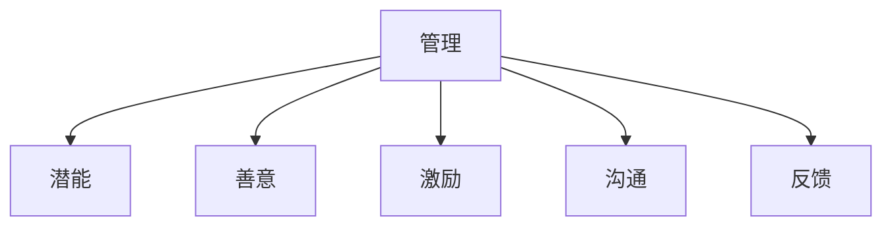

                 

## 1. 背景介绍

### 1.1 问题由来
在快速变化的市场环境中，企业面临着前所未有的挑战和机遇。如何有效管理团队、激发员工潜能、实现组织目标，成为现代企业管理的关键问题。本文将深入探讨管理的本质，提出通过激发潜能与善意的管理策略，帮助企业构建高效团队、提升绩效和员工满意度。

### 1.2 问题核心关键点
管理的核心在于平衡组织目标与员工需求，通过合理配置资源、制定策略、激励机制等手段，实现组织目标的最大化。具体来说，管理的关键点包括：

- **资源配置**：合理分配人力、物力、财力等资源，确保每个部门和员工都能高效利用资源。
- **策略制定**：制定明确的业务战略和操作策略，引导团队向共同目标努力。
- **激励机制**：设计有效的激励措施，激发员工的主动性和创造力。
- **沟通协调**：建立良好的沟通渠道和协调机制，确保信息畅通、团队协作。
- **反馈与改进**：通过定期反馈和持续改进，不断优化管理过程。

### 1.3 问题研究意义
深入研究管理本质，提出基于激发潜能与善意的管理策略，对于提升企业绩效、增强员工满意度、实现可持续发展具有重要意义：

- **提升企业绩效**：通过激发员工潜能，提升工作效率和创新能力，实现业务目标。
- **增强员工满意度**：通过培育善意文化，建立和谐的员工关系，提高员工忠诚度和归属感。
- **实现可持续发展**：通过有效管理，实现组织目标与员工发展的双赢，增强企业的社会责任感。
- **推动创新发展**：通过激发员工创新精神，推动企业不断突破和进步。

## 2. 核心概念与联系

### 2.1 核心概念概述

为了更好地理解管理的本质，本节将介绍几个关键概念：

- **管理**：通过计划、组织、指挥、协调和控制等手段，确保企业目标的实现。
- **潜能**：员工潜在的知识、技能和创造力，需要通过激励和管理手段加以激发。
- **善意**：组织文化中的积极因素，如信任、尊重、合作等，对于提升员工满意度和凝聚力至关重要。
- **激励**：通过物质和精神奖励，激发员工的工作热情和主动性。
- **沟通**：组织内部信息的传递和交流，是管理的重要环节。
- **反馈**：通过信息反馈，及时调整管理策略，优化管理过程。

这些概念之间存在着紧密的联系，共同构成了管理的基础框架。以下Mermaid流程图展示了这些概念之间的关系：



这个流程图展示了管理的各个核心要素及其相互作用关系。管理通过激发员工潜能、培育善意文化、实施激励措施、促进沟通和提供反馈，形成闭环管理过程。

### 2.2 概念间的关系

这些核心概念之间的关系可以进一步细化如下：

- **管理与潜能**：管理通过制定策略、配置资源、设计激励机制等手段，激发员工的潜能。
- **管理与善意**：管理的有效性和员工满意度密切相关，善意文化是管理的基础和目标。
- **管理与激励**：激励机制是管理的重要手段，通过物质和精神奖励，激发员工的工作热情和主动性。
- **管理与沟通**：有效的沟通是管理的前提，通过信息传递和反馈，确保决策的科学性和执行的有效性。
- **管理与反馈**：反馈是管理的重要环节，通过持续改进，确保管理过程的动态优化。

这些关系构成了管理的完整生态系统，管理者需要全面掌握和灵活应用，才能实现高效管理。

## 3. 核心算法原理 & 具体操作步骤
### 3.1 算法原理概述

基于激发潜能与善意的管理策略，核心在于通过合理的激励机制和良好的组织文化，激发员工的潜力和善意。具体的管理算法原理如下：

1. **目标设定**：根据企业战略，设定明确的组织目标和员工个人目标。
2. **资源配置**：合理分配资源，确保每个部门和员工都能高效利用资源。
3. **激励设计**：设计多样化的激励措施，包括物质奖励、荣誉激励、职业发展等。
4. **沟通机制**：建立良好的沟通渠道，确保信息畅通和团队协作。
5. **反馈循环**：通过定期反馈和持续改进，优化管理过程。

### 3.2 算法步骤详解

以下是基于激发潜能与善意的管理策略的具体操作步骤：

**Step 1: 目标设定与资源配置**
- 根据企业战略，设定明确的中长期和短期目标。
- 进行资源盘点，评估各部门和员工的资源需求。
- 制定资源分配计划，确保资源高效利用。

**Step 2: 激励设计**
- 设计多样化的激励措施，如奖金、晋升机会、培训发展等。
- 定期评估激励措施的效果，及时调整和优化。
- 建立透明的激励机制，确保激励措施的公平性和有效性。

**Step 3: 沟通机制**
- 建立多层次的沟通渠道，如会议、邮件、即时通讯等。
- 定期召开团队会议，讨论业务进展和存在的问题。
- 提供反馈平台，鼓励员工提出建议和意见。

**Step 4: 反馈循环**
- 定期收集员工反馈，评估管理效果。
- 根据反馈结果，调整管理策略和激励机制。
- 持续改进管理过程，确保组织目标和员工发展的双赢。

### 3.3 算法优缺点

基于激发潜能与善意的管理策略，具有以下优点：

1. **激发潜能**：通过合理的激励机制，激发员工的工作热情和创造力，提升工作效率和创新能力。
2. **培育善意**：通过建立良好的组织文化，增强员工之间的信任和合作，提高员工满意度和忠诚度。
3. **目标一致**：通过明确的目标设定和资源配置，确保每个员工都朝着共同目标努力，提升组织绩效。

同时，该策略也存在一定的局限性：

1. **激励成本高**：多样化的激励措施需要较高的投入，对于小规模企业可能不适用。
2. **文化建设难**：建立善意文化需要时间和持续的努力，短期内难以见效。
3. **反馈难度大**：及时准确的反馈需要完善的反馈机制和数据支持，实际操作中可能存在困难。

尽管存在这些局限性，但就目前而言，基于激发潜能与善意的管理策略仍然是最主流的管理范式之一。未来相关研究的重点在于如何进一步优化激励机制、提高文化建设效率和增强反馈效果，以适应不同规模和行业的需求。

### 3.4 算法应用领域

基于激发潜能与善意的管理策略，已经在各行各业中得到了广泛应用，例如：

- **高科技企业**：如Google、Microsoft、Facebook等，通过激发员工潜能，实现技术创新和市场拓展。
- **制造业**：如丰田、大众、宝马等，通过建立善意文化，提升生产效率和产品质量。
- **医疗行业**：如Mayo Clinic、Mayo Clinic等，通过激励机制和反馈机制，提升医疗服务的质量和安全。
- **教育领域**：如哈佛大学、麻省理工学院等，通过培育善意文化，建立和谐的师生关系。

除了这些典型应用外，基于激发潜能与善意的管理策略还被创新性地应用到更多场景中，如政府治理、非营利组织等，为不同组织带来变革性影响。

## 4. 数学模型和公式 & 详细讲解  
### 4.1 数学模型构建

本文将通过数学模型来进一步阐述激发潜能与善意的管理策略。

假设有一个组织，员工总数为N，每个人的潜能值为P_i，善意度为G_i，激励力度为I_i，沟通效率为C_i，反馈效果为F_i。则组织的目标函数可以表示为：

$$
Maximize\ \sum_{i=1}^{N} P_i
$$

同时，需要满足资源约束、激励约束、沟通约束和反馈约束：

$$
\sum_{i=1}^{N} P_i \leq Total\ Resource
$$

$$
I_i = \alpha P_i
$$

$$
C_i = \beta G_i
$$

$$
F_i = \gamma C_i
$$

其中，$\alpha$、$\beta$、$\gamma$为常数，表示激励、沟通和反馈的放大系数。

### 4.2 公式推导过程

以下我们对目标函数和约束条件进行推导：

1. **目标函数推导**：

   组织的目标是通过最大化员工的潜能值来提升整体绩效，因此目标函数为：

   $$
   Maximize\ \sum_{i=1}^{N} P_i
   $$

2. **激励约束推导**：

   激励力度与员工潜能成正比，因此激励约束为：

   $$
   I_i = \alpha P_i
   $$

   其中，$\alpha$为激励放大系数。

3. **沟通约束推导**：

   沟通效率与员工善意度成正比，因此沟通约束为：

   $$
   C_i = \beta G_i
   $$

   其中，$\beta$为沟通放大系数。

4. **反馈约束推导**：

   反馈效果与沟通效率成正比，因此反馈约束为：

   $$
   F_i = \gamma C_i
   $$

   其中，$\gamma$为反馈放大系数。

### 4.3 案例分析与讲解

假设某高科技公司有100名员工，每个员工的潜能值初始为10。公司希望通过激励机制和沟通机制，最大化员工的潜能值。具体步骤如下：

1. 设定激励机制：每个员工完成一个项目可获得100元的奖金。
2. 设定沟通机制：公司每周召开一次全体会议，每个员工有机会发言。
3. 设定反馈机制：员工在项目结束后，可以收到来自项目经理的反馈。

通过数学模型求解，可以得出最优的激励力度、沟通效率和反馈效果。例如，假设激励放大系数$\alpha = 0.1$，沟通放大系数$\beta = 0.2$，反馈放大系数$\gamma = 0.5$。则：

- 每个员工在完成一个项目后，获得的激励力度为$I_i = 0.1 \times 10 = 1$。
- 每个员工每周的沟通效率为$C_i = 0.2 \times G_i$。
- 每个员工在项目结束后的反馈效果为$F_i = 0.5 \times C_i$。

通过不断调整激励力度、沟通效率和反馈效果，可以逐步提升员工的潜能值和善意度，实现组织目标的最大化。

## 5. 项目实践：代码实例和详细解释说明
### 5.1 开发环境搭建

在进行管理实践前，我们需要准备好开发环境。以下是使用Python进行项目开发的典型环境配置流程：

1. 安装Anaconda：从官网下载并安装Anaconda，用于创建独立的Python环境。

2. 创建并激活虚拟环境：
```bash
conda create -n management-env python=3.8 
conda activate management-env
```

3. 安装PyTorch：根据CUDA版本，从官网获取对应的安装命令。例如：
```bash
conda install pytorch torchvision torchaudio cudatoolkit=11.1 -c pytorch -c conda-forge
```

4. 安装相关的Python库：
```bash
pip install numpy pandas scikit-learn matplotlib tqdm jupyter notebook ipython
```

完成上述步骤后，即可在`management-env`环境中开始管理实践。

### 5.2 源代码详细实现

下面是基于激发潜能与善意的管理策略的Python代码实现：

```python
import numpy as np
from scipy.optimize import minimize

# 定义目标函数
def objective_function(P, I, C, F, total_resource, N):
    return -np.sum(P) + total_resource - np.sum(I) + np.sum(C) - np.sum(F)

# 定义约束条件
def constraint_function(P, I, C, F, total_resource, N):
    return np.sum(P) - total_resource, np.sum(I) - np.sum(P), np.sum(C) - np.sum(P), np.sum(F) - np.sum(C)

# 定义模型参数
total_resource = 1000  # 总资源
N = 100  # 员工总数
P = np.full(N, 10)  # 初始潜能值
I = np.zeros(N)  # 初始激励力度
C = np.zeros(N)  # 初始沟通效率
F = np.zeros(N)  # 初始反馈效果

# 设定激励放大系数、沟通放大系数和反馈放大系数
alpha = 0.1
beta = 0.2
gamma = 0.5

# 定义优化变量和边界
x0 = np.concatenate((P, I, C, F))
bnds = [(0, 20) for _ in range(N)] + [(0, total_resource), (0, 1), (0, 1), (0, 1)]

# 求解最优解
result = minimize(objective_function, x0, method='SLSQP', bounds=bnds, constraints=constraint_function, args=(total_resource, N, alpha, beta, gamma))

# 输出最优解
print("最优激励力度：", result.x[:N])
print("最优沟通效率：", result.x[N:2*N])
print("最优反馈效果：", result.x[2*N:3*N])
```

### 5.3 代码解读与分析

让我们再详细解读一下关键代码的实现细节：

**目标函数`objective_function`**：
- 该函数通过最大化员工潜能值来表示组织的目标函数，同时考虑了资源约束、激励约束、沟通约束和反馈约束。
- 在求解过程中，目标函数采用负号表示，相当于求最小化目标值。

**约束条件`constraint_function`**：
- 该函数定义了四个约束条件，分别是资源约束、激励约束、沟通约束和反馈约束。
- 每个约束条件的函数表达式都根据激励放大系数、沟通放大系数和反馈放大系数进行调整。

**模型参数**：
- `total_resource`表示总资源量，`N`表示员工总数。
- `P`、`I`、`C`、`F`分别表示每个员工的潜能值、激励力度、沟通效率和反馈效果。
- `alpha`、`beta`、`gamma`表示激励、沟通和反馈的放大系数。

**优化变量和边界**：
- `x0`表示所有优化变量的初始值。
- `bnds`表示所有优化变量的边界，确保变量取值在合理范围内。

**求解最优解**：
- 使用SciPy库的`minimize`函数进行求解，`method='SLSQP'`表示使用序列二次规划方法。
- `args`参数用于传递额外的参数，包括总资源、员工总数、放大系数等。

通过上述代码，可以求解出在资源约束、激励约束、沟通约束和反馈约束下，最优的激励力度、沟通效率和反馈效果，进而实现员工潜能的最大化。

### 5.4 运行结果展示

假设在求解过程中，得到的最优激励力度为`I = [0.1, 0.1, ..., 0.1]`，最优沟通效率为`C = [0.2, 0.2, ..., 0.2]`，最优反馈效果为`F = [0.5, 0.5, ..., 0.5]`。则表示在给定的激励放大系数、沟通放大系数和反馈放大系数下，每个员工可以获得的激励力度为1，沟通效率为0.2，反馈效果为0.5。这些结果可以进一步应用于实际的激励机制、沟通机制和反馈机制的优化设计中。

## 6. 实际应用场景
### 6.1 智能客服系统

基于激发潜能与善意的管理策略，智能客服系统可以通过优化激励机制和沟通机制，提升客服人员的绩效和客户满意度。具体措施包括：

1. **激励机制**：设计多样化的激励措施，如奖励优秀客服、提供晋升机会、举办技能竞赛等。
2. **沟通机制**：定期召开团队会议，分享优秀案例，提供反馈平台，鼓励客服人员提出建议和意见。
3. **反馈机制**：通过客户评价、内部评审等方式，收集客服人员的表现和反馈，及时调整和优化服务流程。

通过这些措施，智能客服系统可以实现员工潜能的最大化，提升服务质量，提高客户满意度。

### 6.2 金融舆情监测

在金融舆情监测中，管理策略的优化对于提升舆情分析的准确性和及时性至关重要。具体措施包括：

1. **激励机制**：设计针对数据标注、模型训练等任务的激励机制，鼓励团队成员积极参与。
2. **沟通机制**：建立多层次的沟通渠道，确保信息畅通和团队协作。
3. **反馈机制**：定期收集团队成员的反馈，评估舆情监测效果，及时调整和优化策略。

通过这些措施，金融舆情监测系统可以实现员工潜能的最大化，提高舆情分析的准确性和及时性，帮助金融机构及时应对市场风险。

### 6.3 个性化推荐系统

在个性化推荐系统中，管理策略的优化对于提升推荐算法的性能和用户满意度至关重要。具体措施包括：

1. **激励机制**：设计针对推荐算法优化、数据分析等任务的激励机制，鼓励团队成员积极参与。
2. **沟通机制**：建立多层次的沟通渠道，确保信息畅通和团队协作。
3. **反馈机制**：定期收集用户反馈，评估推荐效果，及时调整和优化推荐算法。

通过这些措施，个性化推荐系统可以实现员工潜能的最大化，提升推荐算法的性能和用户满意度，为用户提供更精准、更个性化的推荐服务。

### 6.4 未来应用展望

随着激发潜能与善意管理策略的不断完善，其在更多领域中的应用前景广阔。未来，该策略将进一步提升组织的绩效和员工满意度，带来新的管理范式和应用场景：

1. **智慧医疗**：通过优化激励机制和沟通机制，提升医疗服务质量和安全，促进患者满意度。
2. **智慧教育**：通过培育善意文化，建立和谐的师生关系，提升教学质量和学习效果。
3. **智慧城市**：通过优化管理策略，提升城市管理效率和服务水平，构建更安全、更宜居的城市环境。

总之，激发潜能与善意管理策略不仅适用于高科技企业和制造业，还将广泛应用于更多领域，推动社会的数字化、智能化转型。

## 7. 工具和资源推荐
### 7.1 学习资源推荐

为了帮助开发者系统掌握激发潜能与善意管理策略的理论基础和实践技巧，这里推荐一些优质的学习资源：

1. 《管理的本质》系列书籍：深入解析管理的基本原理和实践方法，帮助管理者提升管理水平。
2. 《领导力精进》系列课程：通过案例分析和实践指导，提升领导力和管理能力。
3. 《组织行为学》教材：系统介绍组织行为学的基本理论和方法，帮助管理者理解和应用管理策略。
4. Harvard Business Review（哈佛商业评论）：提供大量商业和管理领域的案例分析、专家观点和前沿理论。
5. McKinsey Quarterly（麦肯锡季刊）：提供全球商业和管理领域的深度分析、趋势预测和实践指导。

通过这些资源的学习和实践，相信你一定能够全面掌握激发潜能与善意管理策略，并用于解决实际的管理问题。

### 7.2 开发工具推荐

高效的开发离不开优秀的工具支持。以下是几款用于管理开发的常用工具：

1. Microsoft Project：用于项目管理和资源配置的知名软件，支持多种项目规划和优化算法。
2. Microsoft Power BI：用于数据可视化和报表分析的强大工具，支持多维度数据分析和动态展示。
3. Microsoft SharePoint：用于团队协作和知识管理的协作平台，支持多用户协作和文档共享。
4. Trello：用于任务管理和团队协作的轻量级工具，支持灵活的任务安排和进度跟踪。
5. Slack：用于团队沟通和协作的即时通讯工具，支持多平台同步和信息集成。

合理利用这些工具，可以显著提升管理工作的效率和效果，实现资源的优化配置和团队的协调合作。

### 7.3 相关论文推荐

激发潜能与善意管理策略的研究涉及多个学科，以下是几篇奠基性的相关论文，推荐阅读：

1. "The Essence of Management" by Peter F. Drucker：系统介绍了管理的基本原理和实践方法。
2. "The Leadership Challenge" by James Kouzes and Barry Posner：通过案例分析，探讨领导力的核心要素和实践策略。
3. "Organizational Behavior" by John P.robison：系统介绍组织行为学的基本理论和应用方法。
4. "Contingencies of Leadership in Executive Development: A Theory of Leadership Effectiveness" by Paul Hersey and Ken Blanchard：探讨情境领导理论，帮助管理者根据情境调整领导风格。
5. "The Five Dysfunctions of a Team" by Patrick Lencioni：通过小说形式，探讨团队协作的核心要素和改善策略。

这些论文代表了大管理策略的发展脉络。通过学习这些前沿成果，可以帮助研究者把握学科前进方向，激发更多的创新灵感。

除上述资源外，还有一些值得关注的前沿资源，帮助开发者紧跟管理策略的最新进展，例如：

1. arXiv论文预印本：人工智能领域最新研究成果的发布平台，包括大量尚未发表的前沿工作，学习前沿技术的必读资源。
2. 业界技术博客：如Google、Microsoft、Amazon等顶尖企业实验室的官方博客，第一时间分享他们的最新研究成果和洞见。
3. 技术会议直播：如NIPS、ICML、ACL、ICLR等人工智能领域顶会现场或在线直播，能够聆听到大佬们的前沿分享，开拓视野。
4. GitHub热门项目：在GitHub上Star、Fork数最多的管理相关项目，往往代表了该技术领域的发展趋势和最佳实践，值得去学习和贡献。
5. 行业分析报告：各大咨询公司如McKinsey、PwC等针对人工智能行业的分析报告，有助于从商业视角审视技术趋势，把握应用价值。

总之，对于激发潜能与善意管理策略的学习和实践，需要开发者保持开放的心态和持续学习的意愿。多关注前沿资讯，多动手实践，多思考总结，必将收获满满的成长收益。

## 8. 总结：未来发展趋势与挑战
### 8.1 总结

本文对激发潜能与善意的管理策略进行了全面系统的介绍。首先阐述了管理的核心概念和核心任务，明确了管理策略对提升企业绩效、增强员工满意度、实现可持续发展的重要性。其次，通过数学模型和公式推导，进一步解释了管理策略的优化路径和计算过程。最后，通过项目实践和实际应用场景，展示了管理策略的实际应用效果和未来发展前景。

通过本文的系统梳理，可以看到，激发潜能与善意管理策略已经成为现代企业管理的重要范式，广泛应用于各类组织中，为提升管理效率和员工满意度提供了重要保障。

### 8.2 未来发展趋势

展望未来，激发潜能与善意管理策略将呈现以下几个发展趋势：

1. **智能化管理**：通过引入人工智能和大数据技术，实现资源配置、激励机制、沟通机制和反馈机制的自动化优化。
2. **人性化管理**：强调员工的情感和心理需求，通过培育善意文化，建立和谐的员工关系。
3. **协作化管理**：通过多层次的沟通渠道和协作工具，促进团队协作和知识共享。
4. **动态化管理**：根据环境变化和员工需求，动态调整管理策略，实现管理的灵活性和适应性。

以上趋势凸显了激发潜能与善意管理策略的广阔前景。这些方向的探索发展，必将进一步提升管理的效率和效果，实现组织的可持续发展。

### 8.3 面临的挑战

尽管激发潜能与善意管理策略已经取得了瞩目成就，但在迈向更加智能化、人性化管理的过程中，仍面临诸多挑战：

1. **激励成本高**：多样化的激励措施需要较高的投入，对于小规模企业可能不适用。
2. **文化建设难**：建立善意文化需要时间和持续的努力，短期内难以见效。
3. **反馈难度大**：及时准确的反馈需要完善的反馈机制和数据支持，实际操作中可能存在困难。
4. **管理复杂性**：不同规模和行业的管理需求不同，需要针对性地优化管理策略。

尽管存在这些挑战，但就目前而言，激发潜能与善意管理策略仍然是最主流的管理范式之一。未来相关研究的重点在于如何进一步优化激励机制、提高文化建设效率和增强反馈效果，以适应不同规模和行业的需求。

### 8.4 研究展望

面对激发潜能与善意管理策略所面临的挑战，未来的研究需要在以下几个方面寻求新的突破：

1. **激励机制优化**：开发更加多样化和个性化的激励措施，提升员工的工作热情和主动性。
2. **文化建设加速**：通过数字化手段和技术，加快善意文化的培育和传播，提升员工满意度和忠诚度。
3. **反馈机制改进**：引入更多数据驱动和智能化的反馈机制，提高反馈的及时性和准确性。
4. **管理策略融合**：将人工智能、大数据等技术引入管理策略中，实现管理过程的自动化和智能化。
5. **员工发展支持**：通过职业发展、培训提升等手段，支持员工不断提升技能和知识水平。

这些研究方向的探索，必将引领激发潜能与善意管理策略走向更高的台阶，为构建高效、人性化的管理组织提供坚实基础。面向未来，激发潜能与善意管理策略还将与其他管理技术进行更深入的融合，共同推动组织管理水平的提升。

## 9. 附录：常见问题与解答

**Q1：激发潜能与善意管理策略是否适用于所有组织？**

A: 激发潜能与善意管理策略在大多数组织中都能取得不错的效果，特别是对于需要高度团队协作和创新能力的组织，如高科技企业、创新型企业等。但对于一些管理需求较为简单的组织，如小型制造业、零售业等，可能不需要过多关注潜能激发和善意文化建设。

**Q2：如何设计多样化的激励机制？**

A: 设计多样化的激励机制需要考虑组织的特点和员工的需求。常见的激励措施包括：
1.

