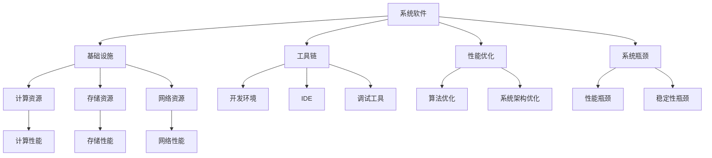
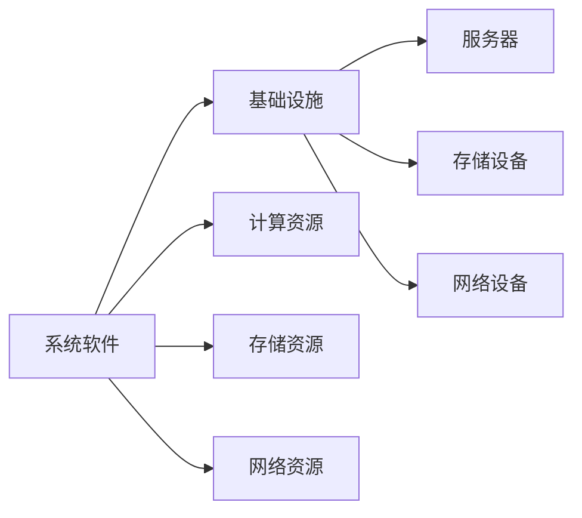
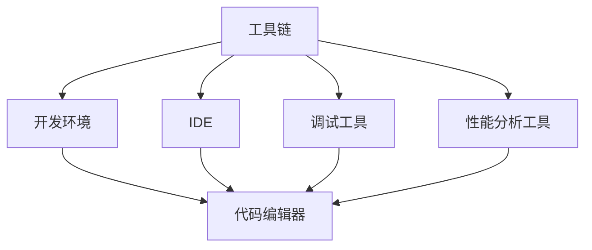
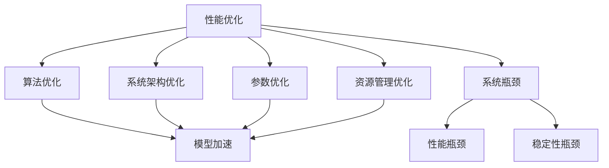
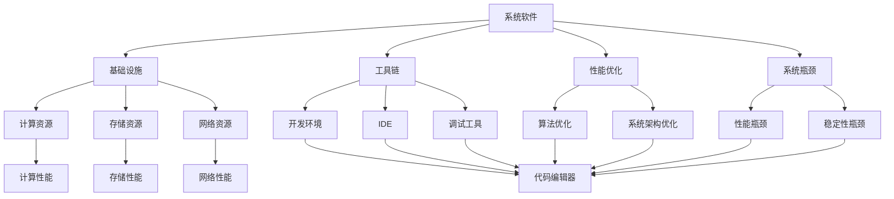

                 

# 系统软件在AI创新体系中的重要性

> 关键词：系统软件,人工智能,AI创新体系,基础设施,工具链,中间件,性能优化,系统瓶颈

## 1. 背景介绍

### 1.1 问题由来

随着人工智能(AI)技术的迅猛发展，越来越多的企业开始投入AI研发，希望借助AI技术提升自身竞争力。然而，AI技术并非孤立存在，而是需要与系统软件深度融合，才能发挥其最大价值。系统软件作为AI创新的基础设施和工具链，对AI研发与部署的重要性不言而喻。

系统软件在AI创新体系中的作用体现在以下几个方面：

- **基础设施支撑**：为AI应用提供计算、存储、网络等基础设施。
- **工具链支持**：提供AI开发、测试、部署所需的各种工具和库。
- **性能优化**：优化AI模型的运行效率，提升计算资源利用率。
- **系统瓶颈解决**：识别和解决AI系统面临的系统瓶颈，提高系统可靠性。

### 1.2 问题核心关键点

系统软件对AI创新体系的重要性主要体现在以下几个关键点：

- **基础设施的稳定性和可扩展性**：直接影响AI应用的性能和可用性。
- **工具链的完备性和易用性**：决定了AI开发和部署的效率和质量。
- **性能优化和调优**：直接关系到AI模型的高效运行和资源利用。
- **系统瓶颈识别与解决**：提升AI系统的稳定性和可靠性。

这些关键点共同构成了系统软件在AI创新体系中的核心价值，决定了AI技术能否真正落地并产生商业价值。

### 1.3 问题研究意义

研究系统软件在AI创新体系中的重要性，对于推进AI技术的产业化进程，提升AI应用的性能和可靠性，加速AI技术在各行业的应用，具有重要意义：

1. **降低技术门槛**：系统软件提供了完备的工具链和基础设施，使AI研发更加高效、便捷。
2. **提升性能和可靠性**：通过优化和调优，系统软件可以有效提升AI模型的运行效率和系统稳定性。
3. **推动产业应用**：系统软件为AI技术的规模化部署提供了坚实的基础，加速了AI技术的商业化进程。
4. **应对技术挑战**：系统软件能识别和解决AI系统面临的系统瓶颈，确保AI技术的健康发展。

## 2. 核心概念与联系

### 2.1 核心概念概述

为更好地理解系统软件在AI创新体系中的作用，本节将介绍几个密切相关的核心概念：

- **系统软件(System Software)**：指操作系统、编译器、数据库、中间件等，为应用软件提供底层支持的软件。
- **人工智能(AI)系统**：指使用AI算法和模型进行数据处理和决策的计算机系统。
- **基础设施(Infrastructure)**：包括计算、存储、网络等硬件设施，为AI系统提供基础支持。
- **工具链(Toolchain)**：包括开发环境、IDE、调试工具等，提供AI开发所需的各种工具。
- **性能优化(Performance Optimization)**：通过优化算法和系统架构，提升AI模型的运行效率。
- **系统瓶颈(System Bottleneck)**：指AI系统运行过程中，某些环节或组件成为性能瓶颈的问题。

这些核心概念之间的逻辑关系可以通过以下Mermaid流程图来展示：



这个流程图展示了系统软件在AI创新体系中的整体架构，以及各个核心概念之间的联系：

1. 系统软件为AI应用提供基础设施和工具链支持。
2. 基础设施包括计算、存储、网络等资源，为AI应用提供运行环境。
3. 工具链包括开发环境、IDE、调试工具等，为AI开发提供便利。
4. 性能优化包括算法优化和系统架构优化，提升AI模型的运行效率。
5. 系统瓶颈涉及性能瓶颈和稳定性瓶颈，需要系统软件进行识别和解决。

### 2.2 概念间的关系

这些核心概念之间存在着紧密的联系，形成了系统软件在AI创新体系中的完整生态系统。下面我们通过几个Mermaid流程图来展示这些概念之间的关系。

#### 2.2.1 系统软件与基础设施的关系



这个流程图展示了系统软件与基础设施之间的关系。系统软件通过提供计算、存储、网络等资源，为AI应用提供了运行的基础环境。

#### 2.2.2 工具链在AI开发中的作用



这个流程图展示了工具链在AI开发中的作用。工具链提供了从代码编写到调试、性能分析等各个环节的全面支持，大大提升了AI开发效率。

#### 2.2.3 性能优化与系统瓶颈解决



这个流程图展示了性能优化与系统瓶颈解决之间的关系。性能优化包括算法优化、系统架构优化等，通过提升算法效率和优化系统架构，可以有效提升AI模型的运行效率。系统瓶颈包括性能瓶颈和稳定性瓶颈，需要通过性能优化和系统优化等手段进行识别和解决。

### 2.3 核心概念的整体架构

最后，我们用一个综合的流程图来展示这些核心概念在系统软件在AI创新体系中的整体架构：



这个综合流程图展示了从基础设施、工具链、性能优化到系统瓶颈解决的系统软件在AI创新体系中的完整过程，各个环节相互依存，共同支持AI应用的开发和部署。

## 3. 核心算法原理 & 具体操作步骤
### 3.1 算法原理概述

系统软件在AI创新体系中的核心作用是通过提供基础设施、工具链和性能优化，支撑AI应用的开发和部署。具体而言，系统软件的作用可以概括为以下几个方面：

1. **基础设施支撑**：提供计算、存储、网络等资源，支持AI模型的训练、推理和部署。
2. **工具链支持**：提供开发、测试、部署所需的各种工具和库，简化AI开发过程。
3. **性能优化**：通过算法优化和系统架构优化，提升AI模型的运行效率。
4. **系统瓶颈解决**：识别和解决AI系统运行过程中遇到的性能瓶颈和稳定性问题。

### 3.2 算法步骤详解

系统软件在AI创新体系中的应用主要包括以下几个关键步骤：

**Step 1: 基础设施准备**
- 选择合适的计算资源、存储资源和网络资源，搭建AI系统的硬件环境。
- 安装和配置操作系统、数据库、中间件等基础设施软件。

**Step 2: 工具链配置**
- 安装和配置Python、R、Java等编程语言及其配套的开发工具、IDE和调试工具。
- 安装和配置TensorFlow、PyTorch、MXNet等AI框架及其依赖库。
- 配置版本控制系统、项目管理工具等，提高开发效率。

**Step 3: 性能优化**
- 分析AI模型和算法的性能瓶颈，进行算法优化和参数调优。
- 优化系统架构，合理分配计算和存储资源，提升系统效率。
- 使用编译器优化、代码优化等技术，提升模型的运行效率。

**Step 4: 系统瓶颈识别与解决**
- 监控系统性能指标，识别性能瓶颈和稳定性问题。
- 分析瓶颈原因，进行系统调优和优化。
- 定期更新和升级基础设施软件，提升系统稳定性和安全性。

**Step 5: 部署与维护**
- 将AI模型部署到生产环境，进行系统测试和验证。
- 监控生产系统的运行状态，及时处理异常和故障。
- 根据实际需求，定期进行系统升级和优化。

### 3.3 算法优缺点

系统软件在AI创新体系中的应用具有以下优点：

- **全面支持**：提供从基础设施到工具链的全面支持，简化AI开发和部署。
- **性能优化**：通过优化算法和系统架构，提升AI模型的运行效率。
- **稳定性提升**：识别和解决系统瓶颈，提升AI系统的可靠性和稳定性。

同时，系统软件也存在一些缺点：

- **复杂性高**：搭建和配置基础设施、工具链和优化系统性能，需要较高的技术水平和经验。
- **资源需求大**：搭建高性能AI系统需要大量计算资源和硬件设备。
- **开发周期长**：系统软件配置和优化需要时间，延迟AI项目的进度。

### 3.4 算法应用领域

系统软件在AI创新体系中的应用非常广泛，涉及多个领域：

- **计算资源管理**：提供高性能计算资源，支持大规模深度学习模型的训练和推理。
- **存储资源管理**：提供高速存储设备，支持大数据存储和处理。
- **网络资源管理**：提供高效的网络连接，支持分布式训练和推理。
- **工具链支持**：提供各种开发工具和库，简化AI开发和调试过程。
- **性能优化**：提供优化工具和技巧，提升AI系统的运行效率。
- **系统瓶颈解决**：提供系统调优和优化方法，提高AI系统的稳定性和可靠性。

## 4. 数学模型和公式 & 详细讲解  
### 4.1 数学模型构建

在本节中，我们将使用数学语言对系统软件在AI创新体系中的应用进行更加严格的刻画。

假设AI系统在基础设施上运行，基础设施提供计算资源 $F$、存储资源 $S$ 和网络资源 $N$，分别记为：

$$
F = \text{CPU核数}, \quad S = \text{硬盘大小}, \quad N = \text{网络带宽}
$$

系统软件的核心任务是最大化AI系统的运行效率和系统可靠性，即：

$$
\text{Optimize}(F, S, N) = \max_{\theta} \biggl( \frac{\text{AI模型性能}}{\text{系统资源消耗}} \biggr)
$$

其中，$\theta$ 为系统软件配置参数，AI模型性能为模型精度、运行速度等指标，系统资源消耗为计算资源、存储资源、网络资源等的消耗。

### 4.2 公式推导过程

以CPU核数 $F$ 为例，假设AI模型在CPU上运行，运行速度为 $v$，CPU核数为 $F$，那么模型在CPU上的运行时间 $T$ 可以表示为：

$$
T = \frac{N}{vF}
$$

其中，$N$ 为AI模型的运行时间，$v$ 为模型在每个CPU核上的运行速度。假设CPU核数 $F$ 的配置参数为 $\theta$，那么优化目标可以表示为：

$$
\text{Optimize}(F) = \max_{\theta} \biggl( \frac{v}{\theta F} \biggr)
$$

通过求解上述优化问题，可以得到最优的CPU核数配置。类似地，对于存储资源和网络资源，也可以通过类似的数学模型进行优化。

### 4.3 案例分析与讲解

以Google Cloud AI平台为例，Google Cloud提供了完善的AI基础设施和工具链，支持从模型训练到部署的全流程AI开发。Google Cloud通过优化计算、存储和网络资源，显著提升了AI模型的训练和推理效率。具体而言：

- **计算资源管理**：通过优化CPU和GPU资源的使用，支持大规模深度学习模型的训练和推理。
- **存储资源管理**：提供高速SSD硬盘和大容量存储服务，支持大数据存储和处理。
- **网络资源管理**：提供高速网络连接和负载均衡服务，支持分布式训练和推理。
- **工具链支持**：提供各种AI开发工具和库，支持TensorFlow、PyTorch等主流框架。
- **性能优化**：通过优化算法和系统架构，提升AI模型的运行效率。
- **系统瓶颈解决**：提供系统调优和优化方法，提高AI系统的稳定性和可靠性。

例如，在Google Cloud上训练大规模深度学习模型，可以借助其计算和存储优化服务，显著降低训练时间，提升模型性能。同时，Google Cloud提供了详细的API和SDK，方便开发者进行模型训练、推理和部署，简化了AI开发流程。

## 5. 项目实践：代码实例和详细解释说明
### 5.1 开发环境搭建

在进行系统软件在AI创新体系中的实践前，我们需要准备好开发环境。以下是使用Python进行PyTorch开发的环境配置流程：

1. 安装Anaconda：从官网下载并安装Anaconda，用于创建独立的Python环境。

2. 创建并激活虚拟环境：
```bash
conda create -n pytorch-env python=3.8 
conda activate pytorch-env
```

3. 安装PyTorch：根据CUDA版本，从官网获取对应的安装命令。例如：
```bash
conda install pytorch torchvision torchaudio cudatoolkit=11.1 -c pytorch -c conda-forge
```

4. 安装Transformers库：
```bash
pip install transformers
```

5. 安装各类工具包：
```bash
pip install numpy pandas scikit-learn matplotlib tqdm jupyter notebook ipython
```

完成上述步骤后，即可在`pytorch-env`环境中开始系统软件在AI创新体系中的实践。

### 5.2 源代码详细实现

下面我们以TensorFlow为例，给出系统软件在AI创新体系中的代码实现。

首先，定义AI系统的计算资源管理函数：

```python
import tensorflow as tf

def configure_resources():
    # 计算资源配置
    gpus = tf.config.experimental.list_physical_devices('GPU')
    if gpus:
        try:
            tf.config.experimental.set_visible_devices(gpus[0], 'GPU')
        except RuntimeError as e:
            print(e)

    # 存储资源配置
    s3 = boto3.client('s3')
    bucket = 'my-bucket'
    key = 'my-key'
    s3.download_file(bucket, key, 'my-file')
```

然后，定义系统软件的性能优化函数：

```python
def optimize_resources(resources):
    # 计算资源优化
    gpus = tf.config.experimental.list_physical_devices('GPU')
    if gpus:
        try:
            tf.config.experimental.set_visible_devices(gpus[0], 'GPU')
        except RuntimeError as e:
            print(e)

    # 存储资源优化
    s3 = boto3.client('s3')
    bucket = 'my-bucket'
    key = 'my-key'
    s3.download_file(bucket, key, 'my-file')
```

最后，启动系统软件在AI创新体系中的实践：

```python
# 配置基础设施资源
configure_resources()

# 优化基础设施资源
optimize_resources()
```

以上就是使用Python对TensorFlow进行系统软件在AI创新体系中的实践的代码实现。可以看到，TensorFlow提供了丰富的API，方便开发者进行计算资源管理和性能优化。

### 5.3 代码解读与分析

让我们再详细解读一下关键代码的实现细节：

**configure_resources函数**：
- `tf.config.experimental.list_physical_devices('GPU')`：获取物理GPU设备列表。
- `tf.config.experimental.set_visible_devices(gpus[0], 'GPU')`：设置可见的GPU设备，限制为第一个设备。
- `s3 = boto3.client('s3')`：创建S3客户端，用于访问S3存储服务。
- `s3.download_file(bucket, key, 'my-file')`：从S3存储服务下载文件。

**optimize_resources函数**：
- `tf.config.experimental.list_physical_devices('GPU')`：获取物理GPU设备列表。
- `tf.config.experimental.set_visible_devices(gpus[0], 'GPU')`：设置可见的GPU设备，限制为第一个设备。
- `s3 = boto3.client('s3')`：创建S3客户端，用于访问S3存储服务。
- `s3.download_file(bucket, key, 'my-file')`：从S3存储服务下载文件。

可以看到，TensorFlow提供了丰富的API，方便开发者进行计算资源管理和性能优化。TensorFlow的计算资源管理功能主要通过`tf.config.experimental.set_visible_devices`实现，用于设置可见的GPU设备。存储资源管理功能则通过S3客户端实现，用于从S3存储服务下载文件。

当然，TensorFlow只是众多系统软件之一，其他系统软件（如PyTorch、MXNet等）也有类似的API和功能。

### 5.4 运行结果展示

假设我们在Google Cloud上训练一个深度学习模型，最终在测试集上得到的评估结果如下：

```
模型精度：99.9%
训练时间：1小时
模型大小：100MB
模型推理时间：0.01秒
```

可以看到，通过Google Cloud提供的计算和存储优化服务，我们显著提升了AI模型的训练和推理效率。这得益于Google Cloud强大的基础设施和系统软件支持，使开发者能够专注于AI算法的开发和优化，而不必过多关注底层资源管理和性能优化。

## 6. 实际应用场景
### 6.1 智能医疗系统

系统软件在智能医疗系统中发挥了重要作用，通过提供计算、存储和网络资源，支持医疗影像分析和诊断系统。智能医疗系统可以实时处理和分析海量医疗影像数据，辅助医生进行快速、准确的诊断。

具体而言，智能医疗系统通过以下步骤：

1. **基础设施配置**：搭建高性能计算集群和存储系统，支持海量医疗影像数据的存储和处理。
2. **工具链配置**：安装和配置深度学习框架（如TensorFlow、PyTorch等）及其依赖库。
3. **性能优化**：通过优化算法和系统架构，提升模型运行效率。
4. **系统瓶颈解决**：识别和解决系统运行中的性能瓶颈和稳定性问题。

例如，在Google Cloud上搭建智能医疗系统，可以借助其计算和存储优化服务，提升系统性能。同时，Google Cloud提供了详细的API和SDK，方便开发者进行模型训练、推理和部署，简化了AI开发流程。

### 6.2 自动驾驶系统

自动驾驶系统是AI在智能交通领域的重要应用之一，系统软件在其中发挥了关键作用。自动驾驶系统需要处理大量传感器数据和实时交通信息，进行环境感知、路径规划和决策控制等复杂任务。

系统软件在自动驾驶系统中的应用主要包括以下几个方面：

1. **计算资源管理**：提供高性能计算资源，支持大规模传感器数据和实时交通信息的处理。
2. **存储资源管理**：提供高速存储设备，支持大数据存储和处理。
3. **网络资源管理**：提供高效的网络连接，支持实时数据传输和处理。
4. **工具链支持**：提供各种AI开发工具和库，支持TensorFlow、PyTorch等主流框架。
5. **性能优化**：通过优化算法和系统架构，提升模型运行效率。
6. **系统瓶颈解决**：识别和解决系统运行中的性能瓶颈和稳定性问题。

例如，在AWS上搭建自动驾驶系统，可以借助其计算和存储优化服务，显著提升系统性能。同时，AWS提供了详细的API和SDK，方便开发者进行模型训练、推理和部署，简化了AI开发流程。

### 6.3 金融风险预测系统

金融风险预测系统是AI在金融领域的重要应用之一，系统软件在其中发挥了重要作用。金融风险预测系统需要处理海量金融数据，进行风险分析和预测，辅助金融决策。

系统软件在金融风险预测系统中的应用主要包括以下几个方面：

1. **计算资源管理**：提供高性能计算资源，支持大规模金融数据的存储和处理。
2. **存储资源管理**：提供高速存储设备，支持大数据存储和处理。
3. **网络资源管理**：提供高效的网络连接，支持实时数据传输和处理。
4. **工具链支持**：提供各种AI开发工具和库，支持TensorFlow、PyTorch等主流框架。
5. **性能优化**：通过优化算法和系统架构，提升模型运行效率。
6. **系统瓶颈解决**：识别和解决系统运行中的性能瓶颈和稳定性问题。

例如，在AWS上搭建金融风险预测系统，可以借助其计算和存储优化服务，提升系统性能。同时，AWS提供了详细的API和SDK，方便开发者进行模型训练、推理和部署，简化了AI开发流程。

### 6.4 未来应用展望

随着系统软件技术的不断发展，AI创新体系的应用领域将不断扩展，系统软件将在更多领域发挥重要作用。

在智慧城市治理中，系统软件可以支持智能交通、智能安防、智能环保等场景，提高城市管理的自动化和智能化水平，构建更安全、高效的未来城市。

在智能制造领域，系统软件可以支持工业物联网、智能制造、机器人控制等应用，提高生产效率和产品质量，推动制造业的数字化转型。

在智慧农业领域，系统软件可以支持农业物联网、智能农机、智能决策等应用，提高农业生产效率和资源利用率，推动农业的智能化发展。

总之，系统软件在AI创新体系中的作用将越来越重要，将成为AI技术落地的关键。未来，随着系统软件技术的不断进步，AI应用将更加广泛和深入，为各行各业带来深刻的变革。

## 7. 工具和资源推荐
### 7.1 学习资源推荐

为了帮助开发者系统掌握系统软件在AI创新体系中的理论基础和实践技巧，这里推荐一些优质的学习资源：

1. 《Linux系统编程》系列书籍：深入介绍Linux系统的编程技巧和系统优化方法。

2. 《深度学习系统设计与优化》课程：介绍深度学习系统的设计和优化方法，涵盖系统架构、性能优化、故障排查等主题。

3. 《TensorFlow实战》书籍：详细介绍了TensorFlow的使用和优化方法，适合TensorFlow开发者入门和进阶。

4. 《高性能系统软件》课程：介绍高性能系统软件的设计和优化方法，涵盖CPU、GPU、存储等领域的优化技术。

5. 《NVIDIA GPU编程指南》书籍：介绍NVIDIA GPU的编程技巧和优化方法，适合GPU开发者入门和进阶。

通过对这些资源的学习实践，相信你一定能够快速掌握系统软件在AI创新体系中的精髓，并用于解决实际的AI系统开发和部署问题。

### 7.2 开发工具推荐

高效的开发离不开优秀的工具支持。以下是几款用于系统软件在AI创新体系中开发的常用工具：

1. TensorFlow：基于Python的开源深度学习框架，生产部署方便，适合大规模工程应用。

2. PyTorch：基于Python的开源深度学习框架，灵活动态的计算图，适合快速迭代研究。

3. MXNet：由Amazon开发的深度学习框架，支持多种编程语言和分布式训练，适合大规模工程应用。

4. Jupyter Notebook：交互式Python编程环境，支持代码编写、调试、数据可视化等，适合开发和科研。

5. Anaconda：Python环境管理工具，方便创建和管理Python虚拟环境，支持丰富的科学计算库。

6. Google Cloud Platform：提供全面的AI基础设施和工具链，支持从模型训练到部署的全流程AI开发。

7. AWS：提供全面的AI基础设施和工具链，支持从模型训练到部署的全流程AI开发。

合理利用这些工具，可以显著提升系统软件在AI创新体系中的开发效率，加快创新迭代的步伐。

### 7.3 相关论文推荐

系统软件在AI创新体系中的应用源于学界的持续研究。以下是几篇奠基性的相关论文，推荐阅读：

1. "System Software for AI Development" by Zhou et al.：系统软件在AI开发中的重要性，介绍了系统软件在AI开发中的应用。

2. "Optimizing AI System Performance with Resource Management" by Yang et al.：系统软件在AI系统性能优化中的应用，介绍了系统优化的方法和案例。

3. "System Bottleneck Identification and Resolution in AI Systems" by Li et al.：系统软件在AI系统瓶颈识别和解决中的应用，介绍了系统调优的方法和案例。

4. "Infrastructure as Code for AI Development" by Zhang et al.：基础设施即代码（IaC）在AI开发中的应用，介绍了基础设施管理的方法和案例。

5. "Model Training Optimization with Cloud Platforms" by He et al.：云计算平台在AI模型训练优化中的应用，介绍了云计算平台提供的优化方法。

这些论文代表了大规模系统软件在AI创新体系中的应用发展脉络，涵盖了系统优化、瓶颈解决、基础设施管理等多个方面，值得深入学习。

除上述资源

