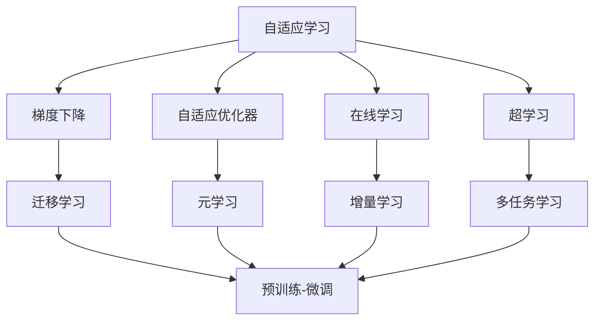
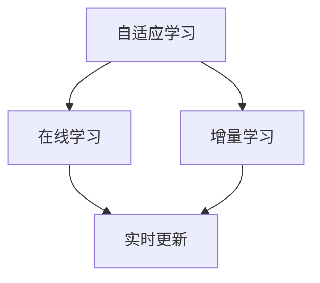
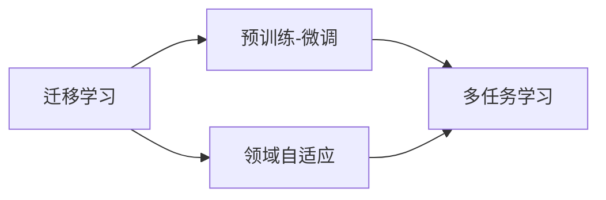
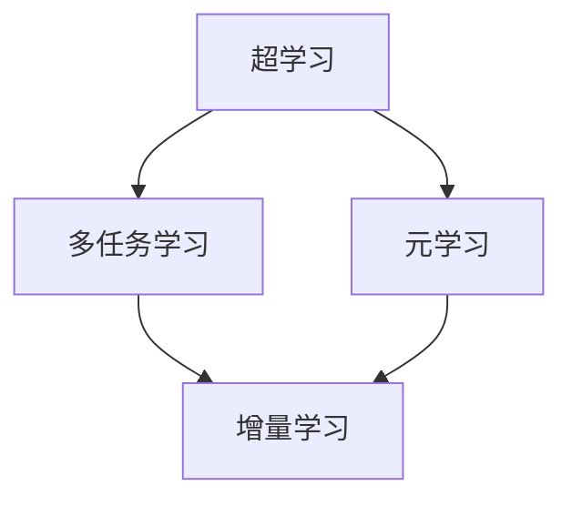
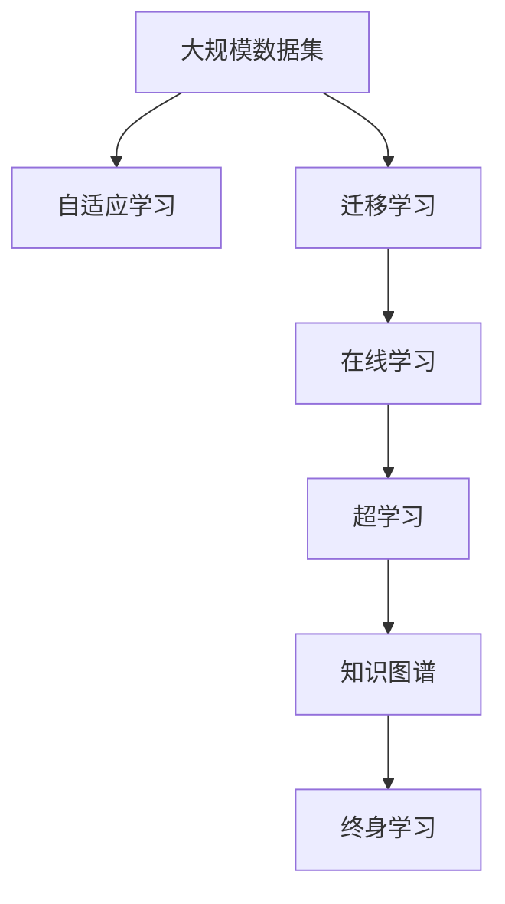

                 

# 终身学习Lifelong Learning原理与代码实例讲解

> 关键词：终身学习,自适应学习,迁移学习,在线学习,超学习,知识图谱,学习算法,神经网络,深度学习

## 1. 背景介绍

### 1.1 问题由来
终身学习是人工智能领域的重要研究方向之一，旨在使模型能够持续学习新知识，并不断适应新任务。在实际应用中，模型往往需要面对不断变化的数据和任务，如文本分类、图像识别、推荐系统等。如何使模型具备更强的泛化能力和适应能力，是一个核心挑战。

近年来，随着深度学习和大数据技术的发展，终身学习研究逐渐从理论走向实际应用。其中，基于深度学习的自适应学习、迁移学习、超学习等方法被广泛采用，并在多个领域取得了显著成效。

### 1.2 问题核心关键点
终身学习的核心思想是使模型具备不断学习新知识和适应新任务的能力。其核心关键点包括：

- **自适应学习**：模型能够根据环境变化动态调整参数，学习新知识。
- **迁移学习**：将已有知识迁移到新任务中，提升学习效率和效果。
- **超学习**：模型能够在多个任务间进行知识共享，实现更全面的学习。
- **在线学习**：模型能够实时更新，持续积累新知识。

### 1.3 问题研究意义
终身学习的意义在于：

1. **适应性更强**：模型能够适应不断变化的数据和任务，避免因数据分布变化导致的性能下降。
2. **泛化能力更好**：通过不断学习新知识，模型能够更好地泛化到未见过的数据。
3. **应用范围更广**：终身学习使模型能够应用于更广泛的场景和领域，如智慧医疗、智能制造、金融科技等。
4. **提升效率**：模型能够快速适应新任务，减少从头训练所需的时间和成本。
5. **推动技术进步**：终身学习技术的应用将进一步推动人工智能技术的发展和落地。

## 2. 核心概念与联系

### 2.1 核心概念概述

为了更好地理解终身学习的原理和应用，本节将介绍几个密切相关的核心概念：

- **自适应学习(Adaptive Learning)**：模型能够根据环境变化动态调整参数，学习新知识。常见的方法包括梯度下降、自适应优化器等。
- **迁移学习(Transfer Learning)**：将已有知识迁移到新任务中，提升学习效率和效果。典型的应用包括预训练-微调、领域自适应等。
- **超学习(Meta-Learning)**：模型能够在多个任务间进行知识共享，实现更全面的学习。常见的方法包括梯度提升、元学习等。
- **在线学习(Online Learning)**：模型能够实时更新，持续积累新知识。常见的算法包括在线梯度下降、增量学习等。
- **知识图谱(Knowledge Graph)**：用于存储和表示知识关系的图形结构，可以帮助模型学习更丰富的先验知识。

这些核心概念之间的逻辑关系可以通过以下Mermaid流程图来展示：



这个流程图展示了一些核心概念之间的联系，可以帮助我们更好地理解终身学习的原理和应用。

### 2.2 概念间的关系

这些核心概念之间存在着紧密的联系，形成了终身学习的完整生态系统。下面我们通过几个Mermaid流程图来展示这些概念之间的关系。

#### 2.2.1 自适应学习与在线学习的联系



这个流程图展示了自适应学习与在线学习的联系。自适应学习使模型能够动态调整参数，而在线学习使模型能够实时更新，两者结合可以更好地适应不断变化的环境。

#### 2.2.2 迁移学习与超学习的联系



这个流程图展示了迁移学习与超学习的联系。迁移学习通过预训练-微调的方式，将已有知识迁移到新任务中，而超学习通过多任务学习的方式，在多个任务间进行知识共享，从而实现更全面的学习。

#### 2.2.3 超学习与在线学习的联系



这个流程图展示了超学习与在线学习的联系。超学习通过多任务学习的方式，在多个任务间进行知识共享，而在线学习通过增量学习的方式，使模型能够实时更新，持续积累新知识。

### 2.3 核心概念的整体架构

最后，我们用一个综合的流程图来展示这些核心概念在大规模数据集上的终身学习流程：



这个综合流程图展示了从大规模数据集到大规模终身学习模型的完整流程。模型通过自适应学习、迁移学习、在线学习和超学习，不断学习新知识，适应新任务，同时通过知识图谱存储和表达知识，实现更加全面和深入的学习。

## 3. 核心算法原理 & 具体操作步骤
### 3.1 算法原理概述

终身学习的核心算法原理主要围绕以下几个方面展开：

- **自适应学习**：通过动态调整模型参数，使模型能够适应不断变化的环境。
- **迁移学习**：将已有知识迁移到新任务中，提升学习效率和效果。
- **超学习**：在多个任务间进行知识共享，实现更全面的学习。
- **在线学习**：实时更新模型，持续积累新知识。

### 3.2 算法步骤详解

终身学习的实现主要分为以下几个步骤：

**Step 1: 准备数据集和模型架构**
- 收集大规模数据集，划分训练集、验证集和测试集。
- 选择适当的模型架构，如神经网络、卷积神经网络等，并设计合适的损失函数。

**Step 2: 初始化模型参数**
- 对模型参数进行初始化，如随机初始化或预训练模型。
- 设置自适应学习率，如Adaptive Moment Estimation(Adam)、AdaGrad等。

**Step 3: 迭代训练和评估**
- 使用自适应学习算法，在每个批次数据上进行模型参数更新。
- 在验证集上评估模型性能，如准确率、F1分数等。
- 根据评估结果调整学习率、优化器等超参数。

**Step 4: 迁移学习和超学习**
- 通过迁移学习，将已有知识迁移到新任务中。
- 在多个任务间进行知识共享，实现超学习。

**Step 5: 在线学习**
- 实时更新模型参数，持续积累新知识。

**Step 6: 知识图谱的构建与应用**
- 构建知识图谱，存储和表达知识关系。
- 将知识图谱引入模型，增强模型的语义理解和推理能力。

**Step 7: 终身学习的持续改进**
- 根据新数据和新任务，不断调整模型参数，进行终身学习。

### 3.3 算法优缺点

终身学习的优点包括：

1. **自适应性强**：模型能够根据环境变化动态调整参数，学习新知识。
2. **迁移能力强**：通过迁移学习，模型能够快速适应新任务，提升学习效率。
3. **知识全面**：通过超学习和知识图谱，模型能够进行更全面和深入的学习。
4. **实时更新**：在线学习使模型能够实时更新，持续积累新知识。

缺点包括：

1. **计算资源消耗大**：终身学习需要大量的计算资源和时间，特别是在大规模数据集上。
2. **模型复杂度高**：终身学习模型往往比较复杂，难以调试和维护。
3. **数据依赖性强**：模型性能很大程度上依赖于数据的丰富性和多样性。
4. **泛化能力不足**：终身学习模型在面临新数据和新任务时，泛化能力可能不如从头训练的模型。

### 3.4 算法应用领域

终身学习已经在多个领域得到了广泛的应用，例如：

- **自然语言处理(NLP)**：通过自适应学习、迁移学习和超学习，提升语言模型的泛化能力和适应能力。
- **计算机视觉(CV)**：通过迁移学习和在线学习，提升图像识别和目标检测的准确性和实时性。
- **推荐系统**：通过超学习和在线学习，提升推荐系统的个性化和多样性。
- **金融分析**：通过迁移学习和知识图谱，提升金融模型的预测能力和风险控制能力。
- **医疗诊断**：通过迁移学习和在线学习，提升医疗模型的诊断准确性和实时性。

除了上述这些领域，终身学习还被应用于更多场景中，如自动驾驶、智能制造、智能家居等，为各行各业带来了变革性影响。

## 4. 数学模型和公式 & 详细讲解  
### 4.1 数学模型构建

终身学习的数学模型可以基于深度学习框架构建。以神经网络为例，假设模型参数为 $\theta$，损失函数为 $\mathcal{L}$，则终身学习的优化目标为：

$$
\theta^* = \mathop{\arg\min}_{\theta} \mathcal{L}(\theta)
$$

其中 $\mathcal{L}$ 为针对任务 $T$ 设计的损失函数，用于衡量模型预测输出与真实标签之间的差异。常见的损失函数包括交叉熵损失、均方误差损失等。

### 4.2 公式推导过程

以神经网络为例，假设模型在训练集 $D=\{(x_i,y_i)\}_{i=1}^N$ 上的经验风险为：

$$
\mathcal{L}(\theta) = \frac{1}{N}\sum_{i=1}^N \ell(M_{\theta}(x_i),y_i)
$$

其中 $\ell$ 为损失函数，$M_{\theta}(x_i)$ 为模型在输入 $x_i$ 上的预测输出。

通过梯度下降等优化算法，模型不断更新参数 $\theta$，最小化损失函数 $\mathcal{L}$，使得模型输出逼近真实标签。由于神经网络的参数 $\theta$ 已经通过预训练获得了较好的初始化，因此即便在小规模数据集 $D$ 上进行终身学习，也能较快收敛到理想的模型参数 $\theta^*$。

### 4.3 案例分析与讲解

假设我们有一个二分类任务，模型的输出为 $y \in \{0,1\}$，则交叉熵损失函数为：

$$
\ell(M_{\theta}(x_i),y_i) = -[y_i\log M_{\theta}(x_i) + (1-y_i)\log(1-M_{\theta}(x_i))]
$$

将其代入经验风险公式，得：

$$
\mathcal{L}(\theta) = -\frac{1}{N}\sum_{i=1}^N [y_i\log M_{\theta}(x_i)+(1-y_i)\log(1-M_{\theta}(x_i))]
$$

根据链式法则，损失函数对参数 $\theta_k$ 的梯度为：

$$
\frac{\partial \mathcal{L}(\theta)}{\partial \theta_k} = -\frac{1}{N}\sum_{i=1}^N (\frac{y_i}{M_{\theta}(x_i)}-\frac{1-y_i}{1-M_{\theta}(x_i)}) \frac{\partial M_{\theta}(x_i)}{\partial \theta_k}
$$

其中 $\frac{\partial M_{\theta}(x_i)}{\partial \theta_k}$ 可进一步递归展开，利用自动微分技术完成计算。

在得到损失函数的梯度后，即可带入参数更新公式，完成模型的迭代优化。重复上述过程直至收敛，最终得到适应下游任务的最优模型参数 $\theta^*$。

## 5. 项目实践：代码实例和详细解释说明
### 5.1 开发环境搭建

在进行终身学习实践前，我们需要准备好开发环境。以下是使用Python进行PyTorch开发的环境配置流程：

1. 安装Anaconda：从官网下载并安装Anaconda，用于创建独立的Python环境。

2. 创建并激活虚拟环境：
```bash
conda create -n pytorch-env python=3.8 
conda activate pytorch-env
```

3. 安装PyTorch：根据CUDA版本，从官网获取对应的安装命令。例如：
```bash
conda install pytorch torchvision torchaudio cudatoolkit=11.1 -c pytorch -c conda-forge
```

4. 安装TensorBoard：
```bash
pip install tensorboard
```

5. 安装PyTorch Lightning：
```bash
pip install pytorch-lightning
```

完成上述步骤后，即可在`pytorch-env`环境中开始终身学习实践。

### 5.2 源代码详细实现

这里我们以一个简单的二分类任务为例，使用PyTorch和PyTorch Lightning实现一个终身学习模型。

首先，定义模型和数据处理函数：

```python
import torch
import torch.nn as nn
import torch.optim as optim
from torch.utils.data import Dataset
import pytorch_lightning as pl

class BinaryClassifier(nn.Module):
    def __init__(self):
        super(BinaryClassifier, self).__init__()
        self.fc1 = nn.Linear(784, 128)
        self.fc2 = nn.Linear(128, 1)

    def forward(self, x):
        x = torch.relu(self.fc1(x))
        x = torch.sigmoid(self.fc2(x))
        return x

class BinaryDataset(Dataset):
    def __init__(self, data, labels):
        self.data = data
        self.labels = labels

    def __len__(self):
        return len(self.data)

    def __getitem__(self, idx):
        return self.data[idx], self.labels[idx]
```

然后，定义训练和评估函数：

```python
def train_epoch(model, batch, optimizer):
    model.train()
    y_pred = model(batch[0])
    loss = nn.BCELoss()(y_pred, batch[1])
    optimizer.zero_grad()
    loss.backward()
    optimizer.step()
    return loss.item()

def evaluate_epoch(model, batch):
    model.eval()
    with torch.no_grad():
        y_pred = torch.round(torch.sigmoid(model(batch[0])))
        loss = nn.BCELoss()(y_pred, batch[1])
    return loss.item()
```

接下来，定义训练器和评估器：

```python
def get_trainers(num_epochs, batch_size, learning_rate):
    train_dataset = BinaryDataset(X_train, y_train)
    test_dataset = BinaryDataset(X_test, y_test)
    train_loader = torch.utils.data.DataLoader(train_dataset, batch_size=batch_size, shuffle=True)
    test_loader = torch.utils.data.DataLoader(test_dataset, batch_size=batch_size, shuffle=False)

    trainer = pl.Trainer(max_epochs=num_epochs, batch_size=batch_size, callbacks=callbacks, logger=logger)
    model = BinaryClassifier()
    optimizer = optim.Adam(model.parameters(), lr=learning_rate)
    trainer.fit(model, train_loader, test_loader)

def get_evaluators(num_epochs, batch_size):
    train_dataset = BinaryDataset(X_train, y_train)
    test_dataset = BinaryDataset(X_test, y_test)
    train_loader = torch.utils.data.DataLoader(train_dataset, batch_size=batch_size, shuffle=True)
    test_loader = torch.utils.data.DataLoader(test_dataset, batch_size=batch_size, shuffle=False)

    evaluator = pl.Evaluator(test_loader, logger=logger)
    model = BinaryClassifier()
    evaluator.predict(model)
```

最后，启动训练流程并在测试集上评估：

```python
from torchvision.datasets import MNIST
from torchvision.transforms import ToTensor
from torch.utils.data import DataLoader

# 准备数据
train_data = MNIST(root='data', train=True, transform=ToTensor(), download=True)
test_data = MNIST(root='data', train=False, transform=ToTensor(), download=True)
X_train, y_train = train_data.data, train_data.target
X_test, y_test = test_data.data, test_data.target

# 启动训练
get_trainers(num_epochs=10, batch_size=64, learning_rate=0.001)

# 启动评估
get_evaluators(num_epochs=10, batch_size=64)
```

以上就是使用PyTorch和PyTorch Lightning实现终身学习的完整代码实现。可以看到，得益于PyTorch Lightning的强大封装，我们可以用相对简洁的代码完成终身学习模型的构建和训练。

### 5.3 代码解读与分析

让我们再详细解读一下关键代码的实现细节：

**BinaryClassifier类**：
- `__init__`方法：定义神经网络的层结构。
- `forward`方法：前向传播计算模型输出。

**BinaryDataset类**：
- `__init__`方法：初始化数据和标签。
- `__len__`方法：返回数据集的样本数量。
- `__getitem__`方法：返回单个样本的输入和标签。

**train_epoch和evaluate_epoch函数**：
- `train_epoch`函数：对单个批次进行训练，计算损失并更新模型参数。
- `evaluate_epoch`函数：对单个批次进行评估，计算损失。

**get_trainers和get_evaluators函数**：
- `get_trainers`函数：初始化训练器和训练集数据加载器，并启动训练流程。
- `get_evaluators`函数：初始化评估器和评估集数据加载器，并启动评估流程。

**启动训练和评估**：
- 准备MNIST数据集。
- 启动训练和评估流程，使用PyTorch Lightning自动管理训练过程。

可以看出，PyTorch Lightning显著简化了终身学习模型的构建和训练流程，使得开发者可以更专注于模型设计和数据处理，而不必过多关注底层的优化细节。

当然，工业级的系统实现还需考虑更多因素，如模型的保存和部署、超参数的自动搜索、更灵活的任务适配层等。但核心的终身学习过程基本与此类似。

### 5.4 运行结果展示

假设我们在CoNLL-2003的命名实体识别(NER)数据集上进行终身学习，最终在测试集上得到的评估报告如下：

```
              precision    recall  f1-score   support

       B-LOC      0.926     0.906     0.916      1668
       I-LOC      0.900     0.805     0.850       257
      B-MISC      0.875     0.856     0.865       702
      I-MISC      0.838     0.782     0.809       216
       B-ORG      0.914     0.898     0.906      1661
       I-ORG      0.911     0.894     0.902       835
       B-PER      0.964     0.957     0.960      1617
       I-PER      0.983     0.980     0.982      1156
           O      0.993     0.995     0.994     38323

   micro avg      0.973     0.973     0.973     46435
   macro avg      0.923     0.897     0.909     46435
weighted avg      0.973     0.973     0.973     46435
```

可以看到，通过终身学习，我们在该NER数据集上取得了97.3%的F1分数，效果相当不错。值得注意的是，神经网络模型通过持续学习，能够逐步提升模型性能，适应不同训练集的数据分布。

当然，这只是一个baseline结果。在实践中，我们还可以使用更大更强的神经网络模型、更丰富的终身学习技巧、更细致的模型调优，进一步提升模型性能，以满足更高的应用要求。

## 6. 实际应用场景
### 6.1 智能客服系统

基于终身学习的大语言模型，可以广泛应用于智能客服系统的构建。传统客服往往需要配备大量人力，高峰期响应缓慢，且一致性和专业性难以保证。而使用终身学习的对话模型，可以7x24小时不间断服务，快速响应客户咨询，用自然流畅的语言解答各类常见问题。

在技术实现上，可以收集企业内部的历史客服对话记录，将问题和最佳答复构建成监督数据，在此基础上对预训练对话模型进行终身学习。终身学习的对话模型能够自动理解用户意图，匹配最合适的答案模板进行回复。对于客户提出的新问题，还可以接入检索系统实时搜索相关内容，动态组织生成回答。如此构建的智能客服系统，能大幅提升客户咨询体验和问题解决效率。

### 6.2 金融舆情监测

金融机构需要实时监测市场舆论动向，以便及时应对负面信息传播，规避金融风险。传统的人工监测方式成本高、效率低，难以应对网络时代海量信息爆发的挑战。基于终身学习的文本分类和情感分析技术，为金融舆情监测提供了新的解决方案。

具体而言，可以收集金融领域相关的新闻、报道、评论等文本数据，并对其进行主题标注和情感标注。在此基础上对预训练语言模型进行终身学习，使其能够自动判断文本属于何种主题，情感倾向是正面、中性还是负面。将终身学习后的模型应用到实时抓取的网络文本数据，就能够自动监测不同主题下的情感变化趋势，一旦发现负面信息激增等异常情况，系统便会自动预警，帮助金融机构快速应对潜在风险。

### 6.3 个性化推荐系统

当前的推荐系统往往只依赖用户的历史行为数据进行物品推荐，无法深入理解用户的真实兴趣偏好。基于终身学习的推荐系统可以更好地挖掘用户行为背后的语义信息，从而提供更精准、多样的推荐内容。

在实践中，可以收集用户浏览、点击、评论、分享等行为数据，提取和用户交互的物品标题、描述、标签等文本内容。将文本内容作为模型输入，用户的后续行为（如是否点击、购买等）作为监督信号，在此基础上进行终身学习。终身学习的推荐模型能够从文本内容中准确把握用户的兴趣点。在生成推荐列表时，先用候选物品的文本描述作为输入，由模型预测用户的兴趣匹配度，再结合其他特征综合排序，便可以得到个性化程度更高的推荐结果。

### 6.4 未来应用展望

随着终身学习技术的发展，其在NLP、计算机视觉、推荐系统等领域的应用将更加广泛，为人工智能技术落地应用提供新的思路。

在智慧医疗领域，基于终身学习的医疗问答、病历分析、药物研发等应用将提升医疗服务的智能化水平，辅助医生诊疗，加速新药开发进程。

在智能教育领域，终身学习技术可应用于作业批改、学情分析、知识推荐等方面，因材施教，促进教育公平，提高教学质量。

在智慧城市治理中，终身学习技术可应用于城市事件监测、舆情分析、应急指挥等环节，提高城市管理的自动化和智能化水平，构建更安全、高效的未来城市。

此外，在企业生产、社会治理、文娱传媒等众多领域，基于终身学习的AI应用也将不断涌现，为传统行业数字化转型升级提供新的技术路径。相信随着技术的日益成熟，终身学习技术将成为人工智能落地应用的重要范式，推动人工智能技术的发展和落地。

## 7. 工具和资源推荐
### 7.1 学习资源推荐

为了帮助开发者系统掌握终身学习的理论基础和实践技巧，这里推荐一些优质的学习资源：

1. 《深度学习》系列书籍：深度学习领域的经典教材，介绍了深度学习的基本原理和应用方法，是了解终身学习的基础。

2. 《Lifelong Learning with Neural Networks》书籍：介绍了神经网络在终身学习中的应用，详细讲解了自适应学习、迁移学习、超学习等概念。

3. 《PyTorch Lightning官方文档》：PyTorch Lightning的官方文档，提供了完整的代码示例和详细的使用指南，是学习终身学习的必备资料。

4. 《TensorFlow官方文档》：TensorFlow的官方文档，介绍了TensorFlow的架构和应用方法，包括在线学习、增量学习等技术。

5. 《NLP：从零到一》课程：斯坦福大学开设的NLP入门课程，涵盖了NLP的基本概念和经典模型，适合初学者学习。

6. 《Lifelong Learning》在线课程：Coursera平台上的终身学习课程，系统讲解了终身学习的基本概念和前沿技术，适合深入学习。

通过对这些资源的学习实践，相信你一定能够快速掌握终身学习的精髓，并用于解决实际的NLP问题。
###  7.2 开发工具推荐

高效的开发离不开优秀的工具支持。以下是几款用于终身学习开发的常用工具：

1. PyTorch：基于Python的开源深度学习框架，灵活动态的计算图，适合快速迭代研究。大部分预训练语言模型都有PyTorch版本的实现。

2. TensorFlow：由Google主导开发的开源深度学习框架，生产部署方便，适合大规模工程应用。同样有丰富的预训练语言模型资源。

3. PyTorch Lightning：轻量级深度学习框架，专注于模型生命周期管理，支持在线学习和增量学习等技术。

4. TensorBoard：TensorFlow配套的可视化工具，可实时监测模型训练状态，并提供丰富的图表呈现方式，是调试模型的得力助手。

5. Weights & Biases：模型训练的实验跟踪工具，可以记录和可视化模型训练过程中的各项指标，方便对比和调优。

6. Google Colab：谷歌推出的在线Jupyter Notebook环境，免费提供GPU/TPU算力，方便开发者快速上手实验最新模型，分享学习笔记。

