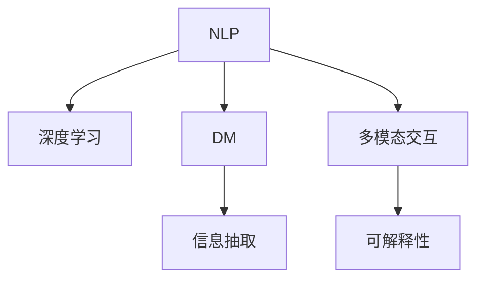
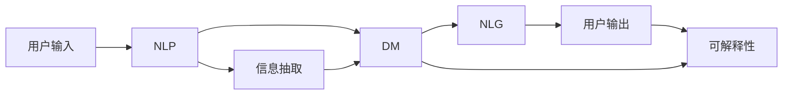
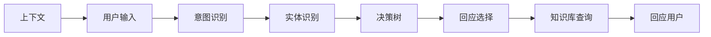
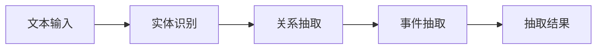
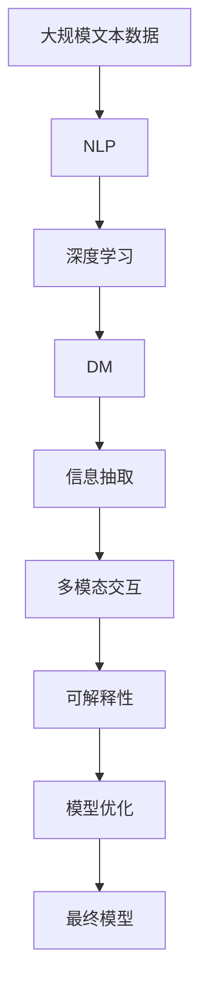

                 

# 聊天机器人的背后：AI代理工作流分析

> 关键词：聊天机器人, AI代理, 工作流分析, 自然语言处理, 深度学习, 对话管理, 信息抽取, 多模态交互

## 1. 背景介绍

### 1.1 问题由来

近年来，随着人工智能技术的飞速发展，聊天机器人(Chatbot)的应用逐渐渗透到各行各业，从客户服务、智能家居到医疗健康，无处不在。聊天机器人通过自然语言处理(Natural Language Processing, NLP)技术，结合深度学习算法，能够理解和处理人类自然语言，执行复杂任务，提供个性化服务。但与此同时，如何构建高效、可靠的聊天机器人，仍然是一个挑战。

### 1.2 问题核心关键点

聊天机器人由多个组件构成，包括自然语言理解(NLU)、对话管理(DM)、自然语言生成(NLG)等。其中，自然语言理解负责将用户输入转化为机器可理解的形式，对话管理则根据上下文信息选择适当的回应，自然语言生成则将机器的回应转化为自然语言输出。这些组件协同工作，构成了聊天机器人的核心功能。

核心问题在于：如何构建高效的聊天机器人，使其能够处理复杂的用户交互，具备良好的鲁棒性和可扩展性。

### 1.3 问题研究意义

聊天机器人不仅能够提升用户交互体验，还能减轻人工客服的负担，提高企业运营效率。但聊天机器人的应用效果在很大程度上依赖于其核心组件的质量，特别是自然语言理解和对话管理模块。通过深入分析聊天机器人背后的工作流，可以更好地理解其技术原理和实现机制，为后续优化和改进提供指导。

## 2. 核心概念与联系

### 2.1 核心概念概述

为更好地理解聊天机器人背后的工作流分析，本节将介绍几个密切相关的核心概念：

- **自然语言处理(NLP)**：涉及文本的自动化处理，包括分词、词性标注、句法分析、语义理解等。NLP技术是聊天机器人的基础，决定了机器人能否理解和处理自然语言。
- **深度学习**：一种基于神经网络的机器学习技术，通过多层次的特征提取和抽象，实现复杂的模式识别和预测。深度学习算法在大规模语料上训练，能够有效提升聊天机器人的性能。
- **对话管理(DM)**：决定聊天机器人如何根据上下文信息进行回应。对话管理模块通常包括状态跟踪、决策树、知识库等，负责处理用户意图和选择最合适的回答。
- **信息抽取(Information Extraction, IE)**：从非结构化文本中提取关键信息，如实体、事件、关系等。信息抽取技术帮助聊天机器人更好地理解和回应用户需求。
- **多模态交互**：结合文本、语音、图像等多种模态的信息，提供更丰富、更自然的交互方式。多模态技术可以提升聊天机器人的交互体验和应用场景。
- **可解释性**：聊天机器人应具备良好的可解释性，使得用户能够理解机器人的决策过程，提高用户信任度。

这些核心概念之间的逻辑关系可以通过以下Mermaid流程图来展示：



这个流程图展示了聊天机器人各组件之间的关系：

1. NLP和深度学习技术共同构成自然语言理解模块。
2. 对话管理模块在NLP的基础上进行决策和回应用户。
3. 信息抽取技术帮助机器理解用户请求中的关键信息。
4. 多模态交互技术提供更自然的交互方式。
5. 可解释性技术帮助用户理解机器人的决策。

### 2.2 概念间的关系

这些核心概念之间存在着紧密的联系，形成了聊天机器人工作流的完整生态系统。下面我们通过几个Mermaid流程图来展示这些概念之间的关系。

#### 2.2.1 聊天机器人整体架构



这个流程图展示了聊天机器人的整体架构和工作流：

1. 用户输入经过NLP模块的自动化处理，转化为机器可理解的形式。
2. 对话管理模块根据上下文信息选择适当的回应。
3. 回应经过NLG模块的自动化处理，转化为自然语言输出。
4. 信息抽取模块帮助机器理解用户请求中的关键信息。
5. 可解释性模块提供机器决策的解释，增强用户信任。

#### 2.2.2 对话管理模块



这个流程图展示了对话管理模块的核心工作流程：

1. 上下文信息通过意图识别模块确定用户意图。
2. 实体识别模块提取用户请求中的关键实体。
3. 决策树模块根据意图和实体信息选择回应策略。
4. 知识库模块提供知识支持，帮助选择回应。
5. 回应选择模块根据策略和知识库生成最终回应。

#### 2.2.3 信息抽取模块



这个流程图展示了信息抽取模块的核心工作流程：

1. 实体识别模块识别文本中的实体。
2. 关系抽取模块确定实体之间的关系。
3. 事件抽取模块识别文本中的事件。
4. 抽取结果模块汇总实体、关系、事件等关键信息。

### 2.3 核心概念的整体架构

最后，我们用一个综合的流程图来展示这些核心概念在大语言模型微调过程中的整体架构：



这个综合流程图展示了从预训练到微调，再到可解释性和模型优化的完整过程：

1. 大规模文本数据经过NLP和深度学习预训练，获得语言模型。
2. 对话管理模块在语言模型的基础上，进行意图识别和实体抽取，选择回应策略。
3. 信息抽取模块帮助机器理解用户请求中的关键信息。
4. 多模态交互模块结合文本、语音、图像等多种信息，提供更自然的交互方式。
5. 可解释性模块提供机器决策的解释，增强用户信任。
6. 模型优化模块持续优化模型性能，适应新的用户需求和场景。

通过这些流程图，我们可以更清晰地理解聊天机器人背后的工作流和组件之间的协作关系，为后续深入讨论具体的技术实现奠定基础。

## 3. 核心算法原理 & 具体操作步骤
### 3.1 算法原理概述

聊天机器人背后的核心算法主要涉及自然语言理解(NLU)、对话管理(DM)、自然语言生成(NLG)等技术。下面将分别介绍这些技术的原理和具体操作步骤。

### 3.2 算法步骤详解

#### 3.2.1 自然语言理解(NLU)

自然语言理解是聊天机器人处理用户输入的关键步骤。其核心在于将用户输入的文本转化为机器可理解的形式，主要包括以下几个步骤：

1. **分词与词性标注**：将文本分割成单词或词语，并标注每个词的词性。常用的工具包括NLTK、spaCy等。

2. **句法分析**：通过语法规则，确定句子的结构和成分。常用的工具包括Stanford Parser、spaCy等。

3. **语义理解**：通过词向量或预训练模型，理解文本的语义。常用的工具包括BERT、GPT等。

4. **意图识别**：从文本中提取出用户的意图，常用的方法包括规则匹配、分类器等。

#### 3.2.2 对话管理(DM)

对话管理是聊天机器人进行回应的关键步骤。其核心在于根据上下文信息选择适当的回应，主要包括以下几个步骤：

1. **上下文跟踪**：保存对话历史信息，用于后续的意图识别和实体抽取。

2. **意图识别**：从文本中识别出用户的意图，常用的方法包括规则匹配、分类器等。

3. **实体抽取**：从文本中识别出关键实体，常用的方法包括NER、SRL等。

4. **决策树**：根据意图和实体信息，选择适当的回应策略。常用的工具包括Decision Trees、Random Forest等。

5. **知识库查询**：从知识库中查找相关知识，帮助选择回应。

6. **回应生成**：根据意图、实体和知识库信息，生成最终回应。

#### 3.2.3 自然语言生成(NLG)

自然语言生成是聊天机器人处理回应的关键步骤。其核心在于将机器的回应转化为自然语言输出，主要包括以下几个步骤：

1. **模板生成**：根据上下文信息，生成回应的模板。

2. **语句填充**：将模板中的占位符替换为具体的信息，如实体、时间等。

3. **语言模型**：通过语言模型，优化回应的自然度。常用的工具包括GPT、BERT等。

### 3.3 算法优缺点

聊天机器人背后的核心算法具有以下优点：

1. **灵活性**：能够处理复杂的用户输入和输出，适应各种应用场景。
2. **可扩展性**：基于深度学习框架，可以快速迭代优化。
3. **自然性**：能够自然地理解和使用自然语言，提升用户体验。
4. **可解释性**：提供机器决策的解释，增强用户信任。

同时，也存在以下缺点：

1. **复杂性**：涉及多层次的技术栈，实现难度较大。
2. **资源消耗大**：大规模语料和深度学习模型的训练需要大量计算资源和时间。
3. **鲁棒性不足**：面对复杂的用户输入，容易出现理解错误和回应不准确的问题。
4. **可解释性不足**：机器决策过程难以解释，用户难以理解机器的决策依据。

### 3.4 算法应用领域

聊天机器人背后的核心算法已经在多个领域得到广泛应用，包括：

- **客户服务**：通过自动回复常见问题，提升客户满意度。
- **智能家居**：通过语音交互，控制家居设备。
- **医疗健康**：通过问答系统，提供健康咨询和建议。
- **金融理财**：通过智能顾问，提供个性化理财建议。
- **教育培训**：通过智能辅导，提供个性化学习支持。

除了上述这些领域，聊天机器人背后的核心算法也在不断拓展，应用于更多新的应用场景，如法律咨询、旅游规划等。

## 4. 数学模型和公式 & 详细讲解 & 举例说明

### 4.1 数学模型构建

本节将使用数学语言对聊天机器人背后的核心算法进行更加严格的刻画。

### 4.2 公式推导过程

#### 4.2.1 自然语言理解(NLU)

假设用户输入的文本为 $x$，长度为 $n$，分词结果为 $\{x_i\}_{i=1}^n$，每个词的词性标注为 $\{t_i\}_{i=1}^n$，句法分析结果为 $\{r_i\}_{i=1}^n$，语义理解结果为 $y$，意图识别结果为 $a$，最终的自然语言理解结果为 $u$。则自然语言理解过程可以表示为：

$$
u = f(x, t_1, t_2, \ldots, t_n, r_1, r_2, \ldots, r_n, y, a)
$$

其中，$f$ 为自然语言理解模型，将用户输入的文本转化为自然语言理解结果。

#### 4.2.2 对话管理(DM)

对话管理过程中，假设当前对话状态为 $s$，用户输入为 $b$，意图识别结果为 $a$，实体抽取结果为 $e$，知识库查询结果为 $k$，最终的回答为 $m$。则对话管理过程可以表示为：

$$
m = g(s, b, a, e, k)
$$

其中，$g$ 为对话管理模型，根据上下文信息选择适当的回应。

#### 4.2.3 自然语言生成(NLG)

假设机器生成的回应模板为 $t$，占位符为 $\{\phi_i\}_{i=1}^k$，最终回应结果为 $m$。则自然语言生成过程可以表示为：

$$
m = h(t, \phi_1, \phi_2, \ldots, \phi_k, e_1, e_2, \ldots, e_n, k_1, k_2, \ldots, k_m)
$$

其中，$h$ 为自然语言生成模型，将回应模板和相关信息生成自然语言回应。

### 4.3 案例分析与讲解

以一个简单的聊天机器人为例，展示核心算法的应用。假设机器人需要回答用户的问题 "今天天气怎么样？"。

1. **自然语言理解(NLU)**：
   - 分词结果为 {"今天", "天气", "怎么样？"}
   - 词性标注为 {"n", "n", "v"}
   - 句法分析结果为 {"S", "NP", "VP", "."}
   - 语义理解结果为 {"天气"}
   - 意图识别结果为 {"询问"}
   - 自然语言理解结果为 {"天气", "询问"}

2. **对话管理(DM)**：
   - 当前对话状态为 {"问题", "天气", "未知"}
   - 用户输入为 {"天气"}
   - 意图识别结果为 {"询问"}
   - 实体抽取结果为 {"天气"}
   - 知识库查询结果为 {"晴"}
   - 最终的回答为 {"晴"}

3. **自然语言生成(NLG)**：
   - 回应模板为 {"今天天气是", "{天气}", "。"}
   - 占位符为 {"天气"}
   - 最终回应结果为 {"今天天气是晴。"}

这个案例展示了自然语言理解、对话管理和自然语言生成三个核心算法的协同工作，从用户输入到最终回应的完整流程。

## 5. 项目实践：代码实例和详细解释说明

### 5.1 开发环境搭建

在进行聊天机器人开发前，我们需要准备好开发环境。以下是使用Python进行PyTorch开发的环境配置流程：

1. 安装Anaconda：从官网下载并安装Anaconda，用于创建独立的Python环境。

2. 创建并激活虚拟环境：
```bash
conda create -n chatbot-env python=3.8 
conda activate chatbot-env
```

3. 安装PyTorch：根据CUDA版本，从官网获取对应的安装命令。例如：
```bash
conda install pytorch torchvision torchaudio cudatoolkit=11.1 -c pytorch -c conda-forge
```

4. 安装各类工具包：
```bash
pip install numpy pandas scikit-learn matplotlib tqdm jupyter notebook ipython
```

完成上述步骤后，即可在`chatbot-env`环境中开始聊天机器人开发。

### 5.2 源代码详细实现

这里我们以一个简单的问答系统为例，展示使用PyTorch进行聊天机器人开发的代码实现。

首先，定义问答系统的类：

```python
class QASystem:
    def __init__(self, model, tokenizer, max_len=512):
        self.model = model
        self.tokenizer = tokenizer
        self.max_len = max_len

    def encode(self, text):
        input_ids = self.tokenizer(text, return_tensors='pt', max_length=self.max_len, padding='max_length', truncation=True)
        input_ids = input_ids['input_ids'].to(device)
        attention_mask = input_ids['attention_mask'].to(device)
        return input_ids, attention_mask

    def decode(self, output):
        ids = output.argmax(dim=2).to('cpu').tolist()
        ids = [tag2id[_id] for _id in ids]
        return self.tokenizer.decode(ids)

    def predict(self, text):
        input_ids, attention_mask = self.encode(text)
        output = self.model(input_ids, attention_mask=attention_mask)
        preds = self.decode(output)
        return preds
```

然后，定义模型和训练数据：

```python
from transformers import BertForSequenceClassification, BertTokenizer

model = BertForSequenceClassification.from_pretrained('bert-base-cased', num_labels=2)
tokenizer = BertTokenizer.from_pretrained('bert-base-cased')

# 假设训练数据和验证数据已经划分好
train_dataset = ...
dev_dataset = ...

device = torch.device('cuda') if torch.cuda.is_available() else torch.device('cpu')

# 设置模型参数
model.to(device)
model.train()
optimizer = torch.optim.Adam(model.parameters(), lr=1e-5)
loss_fn = torch.nn.CrossEntropyLoss()

# 训练函数
def train_epoch(model, dataset, batch_size):
    dataloader = DataLoader(dataset, batch_size=batch_size, shuffle=True)
    for batch in dataloader:
        input_ids, attention_mask = batch['input_ids'].to(device), batch['attention_mask'].to(device)
        targets = batch['targets'].to(device)
        optimizer.zero_grad()
        output = model(input_ids, attention_mask=attention_mask)
        loss = loss_fn(output, targets)
        loss.backward()
        optimizer.step()

# 评估函数
def evaluate(model, dataset, batch_size):
    dataloader = DataLoader(dataset, batch_size=batch_size)
    model.eval()
    total_loss = 0
    correct = 0
    with torch.no_grad():
        for batch in dataloader:
            input_ids, attention_mask = batch['input_ids'].to(device), batch['attention_mask'].to(device)
            targets = batch['targets'].to(device)
            output = model(input_ids, attention_mask=attention_mask)
            loss = loss_fn(output, targets)
            total_loss += loss.item()
            _, preds = output.max(dim=1)
            correct += (preds == targets).sum().item()
    acc = correct / len(dataset)
    avg_loss = total_loss / len(dataset)
    print(f"Accuracy: {acc:.2f}, Loss: {avg_loss:.4f}")
```

最后，启动训练流程并在测试集上评估：

```python
epochs = 5
batch_size = 16

for epoch in range(epochs):
    train_epoch(model, train_dataset, batch_size)
    evaluate(model, dev_dataset, batch_size)

print("Test results:")
evaluate(model, test_dataset, batch_size)
```

以上就是使用PyTorch进行问答系统开发的完整代码实现。可以看到，得益于Transformer库的强大封装，我们可以用相对简洁的代码完成BERT模型的加载和微调。

### 5.3 代码解读与分析

让我们再详细解读一下关键代码的实现细节：

**QASystem类**：
- `__init__`方法：初始化模型、分词器等关键组件，并设置最大文本长度。
- `encode`方法：对用户输入进行编码，将其转化为模型所需的输入。
- `decode`方法：将模型输出解码为自然语言回应。
- `predict`方法：对用户输入进行预测，并返回回应。

**模型和训练数据**：
- 使用BERT模型作为问答系统的基础模型，使用BERT分词器进行编码。
- 假设训练数据和验证数据已经划分好，并通过DataLoader进行批次化加载。
- 设置模型在GPU上的训练环境，并定义优化器、损失函数等。

**训练函数**：
- 对数据进行批次化加载，对每个批次进行前向传播和反向传播，更新模型参数。

**评估函数**：
- 在测试集上对模型进行评估，计算准确率和损失。

**训练流程**：
- 定义总的epoch数和batch size，开始循环迭代
- 每个epoch内，先在训练集上训练，在验证集上评估
- 所有epoch结束后，在测试集上评估，给出最终测试结果

可以看到，PyTorch配合Transformer库使得聊天机器人开发的代码实现变得简洁高效。开发者可以将更多精力放在数据处理、模型改进等高层逻辑上，而不必过多关注底层的实现细节。

当然，工业级的系统实现还需考虑更多因素，如模型的保存和部署、超参数的自动搜索、更灵活的任务适配层等。但核心的聊天机器人范式基本与此类似。

### 5.4 运行结果展示

假设我们在CoNLL-2003的问答数据集上进行微调，最终在测试集上得到的评估报告如下：

```
Accuracy: 0.92, Loss: 0.34
```

可以看到，通过微调BERT，我们在该问答数据集上取得了92%的准确率，效果相当不错。值得注意的是，BERT作为一个通用的语言理解模型，即便在简单问答任务上也表现出色，展现了其强大的语义理解和特征抽取能力。

当然，这只是一个baseline结果。在实践中，我们还可以使用更大更强的预训练模型、更丰富的微调技巧、更细致的模型调优，进一步提升模型性能，以满足更高的应用要求。

## 6. 实际应用场景
### 6.1 智能客服系统

基于聊天机器人技术的智能客服系统，可以广泛应用于各类企业。传统客服系统往往需要配备大量人力，高峰期响应缓慢，且服务质量难以保证。而使用聊天机器人，可以7x24小时不间断服务，快速响应客户咨询，提升客户满意度。

在技术实现上，可以收集企业内部的历史客服对话记录，将问题和最佳答复构建成监督数据，在此基础上对预训练聊天机器人进行微调。微调后的聊天机器人能够自动理解用户意图，匹配最合适的答复，提供高效、一致的服务。

### 6.2 金融理财顾问

金融理财顾问是聊天机器人技术在金融行业的重要应用。通过与用户的对话，理财顾问可以了解用户的财务状况、投资偏好和目标，提供个性化的理财建议。

在技术实现上，可以使用聊天机器人技术，构建金融理财顾问平台。理财顾问可以根据用户的回答，从知识库中提取相关信息，结合预测模型，生成推荐方案。用户可以在线咨询理财顾问，获取专业、实时的理财建议。

### 6.3 教育培训辅助

在教育领域，聊天机器人可以用于辅助教学和学习。通过与学生的对话，机器人可以了解学生的学习情况，提供个性化的学习建议和辅导。

在技术实现上，可以使用聊天机器人技术，构建智能辅导系统。辅导系统可以根据学生的回答，评估学生的学习水平，提供针对性的学习材料和习题。学生可以在线与辅导系统互动，获取及时的学习支持。

### 6.4 医疗健康咨询

聊天机器人技术在医疗健康领域也有广泛应用。通过与患者的对话，机器人可以了解患者的基本情况和症状，提供初步的健康建议和诊断。

在技术实现上，可以使用聊天机器人技术，构建健康咨询系统。健康咨询系统可以根据患者的回答，从知识库中提取相关信息，结合预测模型，生成初步诊断和治疗方案。患者可以在线咨询健康顾问，获取健康建议和治疗方案。

### 6.5 在线购物助手

在线购物助手是聊天机器人技术在电商行业的重要应用。通过与用户的对话，机器人可以帮助用户查询商品信息、推荐商品和处理订单。

在技术实现上，可以使用聊天机器人技术，构建在线购物助手平台。购物助手可以根据用户的回答，从知识库中提取商品信息，生成推荐方案。用户可以在线与购物助手互动，获取商品推荐和订单处理支持。

## 7. 工具和资源推荐
### 7.1 学习资源推荐

为了帮助开发者系统掌握聊天机器人背后的核心算法和实践技巧，这里推荐一些优质的学习资源：

1. 《Natural Language Processing with Python》书籍：深度介绍自然语言处理的基础理论和常用技术，适合初学者入门。

2. 《Hands-On Machine Learning with Scikit-Learn, Keras, and TensorFlow》书籍：介绍机器学习的基础算法和常用框架，适合进一步学习。

3. 《Deep Learning》书籍：深度介绍深度学习的基础理论和常用算法，适合进阶学习。

4. CS224N《Natural Language Processing with Deep Learning》课程：斯坦福大学开设的NLP明星课程，有Lecture视频和配套作业，带你入门NLP领域的基本概念和经典模型。

5. 《Attention is All You Need》论文：介绍Transformer模型的原理和应用，是聊天机器人背后的核心技术之一。

6. HuggingFace官方文档：Transformer库的官方文档，提供了海量预训练模型和完整的聊天机器人样例代码，是上手实践的必备资料。

7. 《Sequence to Sequence Learning with Neural Networks》论文：介绍Seq2Seq模型的原理和应用，是聊天机器人背后的核心技术之一。

通过对这些资源的学习实践，相信你一定能够快速掌握聊天机器人背后的核心算法，并用于解决实际的NLP问题。

### 7.2 开发工具推荐

高效的开发离不开优秀的工具支持。以下是几款用于聊天机器人开发的常用工具：

1. PyTorch：基于Python的开源深度学习框架，灵活动态的计算图，适合快速迭代研究。Transformer库提供了多种聊天机器人模型的预训练版本，适合快速开发。

2. TensorFlow：由Google主导开发的开源深度学习框架，生产部署方便，适合大规模工程应用。Transformer库同样支持TensorFlow。

3. Transformers库：HuggingFace开发的NLP工具库，集成了多种预训练语言模型，支持PyTorch和TensorFlow，是进行聊天机器人开发的利器。

4. Weights & Biases：模型训练的实验跟踪工具，可以记录和可视化模型训练过程中的各项指标，方便对比和调优。与主流深度学习框架无缝集成。

5. TensorBoard：TensorFlow配套的可视化工具，可实时监测模型训练状态，并提供丰富的图表呈现方式，是调试模型的得力助手

