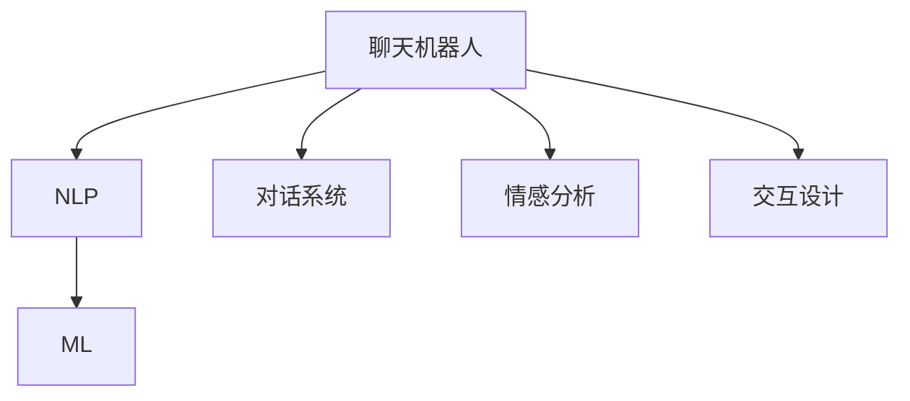
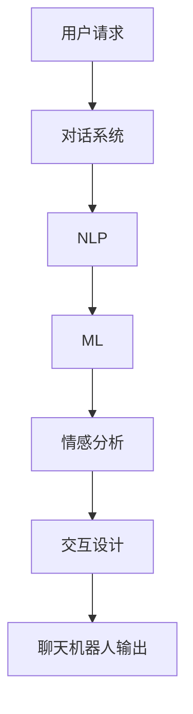

                 

# 聊天机器人：AI如何提升客户服务效率

> 关键词：
1. 聊天机器人 (Chatbot)
2. 自然语言处理 (NLP)
3. 机器学习 (Machine Learning)
4. 客户服务 (Customer Service)
5. 对话系统 (Dialogue System)
6. 情感分析 (Sentiment Analysis)
7. 交互设计 (Interaction Design)

## 1. 背景介绍

### 1.1 问题由来

在当今信息爆炸的时代，客户服务行业面临着前所未有的挑战。随着在线业务的激增，企业每天需要处理大量的客户查询和投诉，传统的客服模式已经无法满足日益增长的需求。为提高客户满意度，许多企业开始探索利用人工智能技术改进客户服务。

聊天机器人（Chatbot）应运而生，通过自动化的智能交互，可以实现24小时不间断的服务，大大降低了企业的运营成本，提高了客户满意度。聊天机器人的使用场景广泛，包括在线客服、智能助手、语音识别等，可以应用于各行各业，为企业的客户服务工作带来革命性的提升。

### 1.2 问题核心关键点

聊天机器人是一种基于人工智能的对话系统，通过自然语言处理（NLP）技术和机器学习（ML）算法，可以实现与用户的自然语言交互。聊天机器人的核心关键点包括：

- **自然语言处理**：是聊天机器人实现与用户交流的基础，主要包括语音识别、文本分析和生成等技术。
- **机器学习**：通过用户与聊天机器人的交互数据，不断优化模型参数，提升机器人的智能水平。
- **情感分析**：理解用户的情感状态，提供个性化服务，改善用户体验。
- **交互设计**：设计用户友好的交互流程，提高用户的接受度和满意度。

这些关键点相互协作，共同构建了聊天机器人的高效、智能的客户服务体系。

### 1.3 问题研究意义

聊天机器人在客户服务中的应用，可以带来以下几方面的显著效果：

1. **提升效率**：聊天机器人可以同时处理多个用户的请求，显著提高客服效率，减少等待时间。
2. **降低成本**：自动化的机器人客服减少了人工客服的需求，降低了企业的运营成本。
3. **提高满意度**：聊天机器人可以提供24小时不间断的服务，提升了客户的满意度。
4. **拓展应用范围**：聊天机器人在各种在线场景中都能应用，如社交媒体、电子商务、金融服务等。
5. **促进创新**：聊天机器人技术不断创新，提供了更多功能，如智能推荐、语音交互等。

因此，研究聊天机器人的原理和应用，对于提升客户服务效率、降低企业运营成本、改善用户体验等方面，具有重要的实际意义。

## 2. 核心概念与联系

### 2.1 核心概念概述

为更好地理解聊天机器人的工作原理和优化方法，本节将介绍几个核心概念：

- **聊天机器人 (Chatbot)**：通过自然语言处理（NLP）和机器学习（ML）算法，实现与用户的自然语言交互的AI系统。
- **自然语言处理 (NLP)**：涉及语言理解、语言生成、情感分析、机器翻译等技术，使机器能够处理人类语言。
- **机器学习 (ML)**：通过数据训练模型，使机器能够学习并执行特定任务，提升智能水平。
- **对话系统 (Dialogue System)**：用于构建聊天机器人，能够实现人机交互的自然对话。
- **情感分析 (Sentiment Analysis)**：识别和分析用户的情感状态，提供更加个性化和满意的服务。
- **交互设计 (Interaction Design)**：设计用户友好的交互流程，提高用户的接受度和满意度。

这些核心概念之间的逻辑关系可以通过以下Mermaid流程图来展示：



这个流程图展示了一个典型的聊天机器人系统架构，展示了NLP、ML、对话系统、情感分析和交互设计等关键组件如何协作工作。

### 2.2 概念间的关系

这些核心概念之间存在着紧密的联系，构成了聊天机器人的完整体系：

1. **聊天机器人与NLP**：聊天机器人通过NLP技术实现语言理解与生成，是NLP应用的重要场景之一。
2. **聊天机器人与ML**：通过ML算法，聊天机器人能够不断学习和优化，提升其智能水平。
3. **聊天机器人与对话系统**：对话系统是聊天机器人的核心组件，提供人机交互的界面和流程。
4. **聊天机器人与情感分析**：情感分析帮助聊天机器人理解用户的情感状态，提供更加个性化和满意的服务。
5. **聊天机器人与交互设计**：交互设计关注用户友好度，优化聊天机器人的交互体验。

这些概念共同构成了聊天机器人的核心体系，使得聊天机器人在各种场景下能够提供高效的客户服务。

### 2.3 核心概念的整体架构

最后，我们用一个综合的流程图来展示这些核心概念在大语言模型微调过程中的整体架构：



这个综合流程图展示了用户请求经过对话系统、NLP、ML、情感分析和交互设计等组件的处理过程，最终由聊天机器人输出响应。

## 3. 核心算法原理 & 具体操作步骤
### 3.1 算法原理概述

聊天机器人的核心算法原理基于自然语言处理（NLP）技术和机器学习（ML）算法。其核心思想是通过NLP技术实现对用户输入的自然语言理解和生成，通过ML算法不断优化模型参数，提升聊天机器人的智能水平。

具体来说，聊天机器人系统由以下几个主要模块组成：

- **输入处理模块**：用于处理用户输入的自然语言，包括分词、词性标注、命名实体识别等。
- **意图识别模块**：识别用户的意图，确定用户希望进行的任务或查询。
- **对话管理模块**：根据用户意图，选择合适的回答或执行相应的任务。
- **回复生成模块**：根据用户的意图和对话历史，生成自然语言回复。

这些模块的协同工作，使得聊天机器人能够与用户进行自然流畅的对话，提供高效的客户服务。

### 3.2 算法步骤详解

聊天机器人的核心算法步骤主要包括：

1. **输入处理**：将用户输入的自然语言转化为计算机可处理的格式，包括分词、词性标注、命名实体识别等。
2. **意图识别**：通过训练好的意图识别模型，识别用户输入的自然语言所表达的意图，例如查询信息、预约服务、投诉等。
3. **对话管理**：根据识别出的用户意图，选择对应的回复或执行相应的任务。对话管理模块通过存储对话历史，实现上下文理解。
4. **回复生成**：生成自然语言回复，通过训练好的回复生成模型，结合用户输入和对话历史，生成符合语境的回答。
5. **模型优化**：通过收集用户的反馈和交互数据，不断优化意图识别和回复生成模型的参数，提升聊天机器人的智能水平。

### 3.3 算法优缺点

聊天机器人具有以下优点：

- **高效性**：能够同时处理多个用户的请求，提升客服效率。
- **成本低**：降低人工客服的需求，减少企业的运营成本。
- **可用性强**：24小时不间断服务，提升客户满意度。
- **可扩展性强**：适用于各种在线场景，如社交媒体、电子商务、金融服务等。

同时，聊天机器人也存在以下缺点：

- **理解能力有限**：对于一些复杂的或模糊的用户输入，聊天机器人可能无法正确理解。
- **缺乏情感理解**：无法完全理解用户的情感状态，无法提供个性化和满意的服务。
- **交互体验欠佳**：如果设计不当，可能会影响用户体验，导致用户流失。

### 3.4 算法应用领域

聊天机器人在多个领域中得到了广泛的应用，包括但不限于：

- **在线客服**：提供24小时不间断的客户服务，提升客户满意度。
- **智能助手**：帮助用户进行日常任务，如提醒、导航、信息查询等。
- **金融服务**：提供账户查询、交易记录、投资建议等服务。
- **电子商务**：提供商品推荐、订单查询、售后支持等服务。
- **医疗服务**：提供健康咨询、预约挂号、药品查询等服务。
- **企业内部系统**：提供员工关怀、内部沟通、知识库查询等服务。

聊天机器人的应用场景日益广泛，不断推动各行各业向智能化、高效化方向发展。

## 4. 数学模型和公式 & 详细讲解 & 举例说明（备注：数学公式请使用latex格式，latex嵌入文中独立段落使用 $$，段落内使用 $)
### 4.1 数学模型构建

聊天机器人系统中的核心数学模型主要包括：

- **意图识别模型**：用于识别用户输入的自然语言所表达的意图。
- **回复生成模型**：用于生成自然语言回复，通常采用生成对抗网络（GAN）或变分自编码器（VAE）等深度学习模型。

### 4.2 公式推导过程

#### 4.2.1 意图识别模型

假设用户的输入为 $x$，意图的表示为 $y$。意图识别模型的目标是最小化预测值与真实值之间的误差，即：

$$
\min_{\theta} \mathcal{L}(y, \hat{y}) = \mathcal{L}_{ce}(y, \hat{y}) = -\frac{1}{N} \sum_{i=1}^N [y_i \log \hat{y}_i + (1-y_i) \log (1-\hat{y}_i)]
$$

其中，$N$ 为样本数量，$y_i$ 为真实标签，$\hat{y}_i$ 为模型预测值，$\mathcal{L}_{ce}$ 为交叉熵损失函数。

#### 4.2.2 回复生成模型

假设聊天机器人的回复为 $z$，输入为 $x$，回复生成的目标是最小化回复 $z$ 和输入 $x$ 之间的差异，即：

$$
\min_{\theta} \mathcal{L}(z, x) = \mathcal{L}_{mse}(z, x) = \frac{1}{N} \sum_{i=1}^N (z_i - x_i)^2
$$

其中，$N$ 为样本数量，$z_i$ 为模型生成的回复，$x_i$ 为用户输入。$\mathcal{L}_{mse}$ 为均方误差损失函数。

### 4.3 案例分析与讲解

假设有一个在线客服聊天机器人，用于处理用户关于账户余额的查询。输入为用户的自然语言描述，如 "我的账户余额是多少？"。意图识别模型将其转化为 "查询账户余额" 的意图，并调用回复生成模型生成回复 "您的账户余额为 500 元"。

## 5. 项目实践：代码实例和详细解释说明
### 5.1 开发环境搭建

在进行聊天机器人项目实践前，我们需要准备好开发环境。以下是使用Python进行TensorFlow开发的环境配置流程：

1. 安装Anaconda：从官网下载并安装Anaconda，用于创建独立的Python环境。

2. 创建并激活虚拟环境：
```bash
conda create -n tf-env python=3.8 
conda activate tf-env
```

3. 安装TensorFlow：根据CUDA版本，从官网获取对应的安装命令。例如：
```bash
conda install tensorflow
```

4. 安装TensorFlow模型库：
```bash
pip install tensorflow-models
```

5. 安装各类工具包：
```bash
pip install numpy pandas scikit-learn matplotlib tqdm jupyter notebook ipython
```

完成上述步骤后，即可在`tf-env`环境中开始聊天机器人项目的开发。

### 5.2 源代码详细实现

下面以一个简单的在线客服聊天机器人为例，给出使用TensorFlow和TensorFlow-Text库进行开发的PyTorch代码实现。

首先，定义意图识别模型：

```python
import tensorflow as tf
from tensorflow.keras import layers

class IntentModel(tf.keras.Model):
    def __init__(self, num_intents, input_size):
        super(IntentModel, self).__init__()
        self.dense1 = layers.Dense(64, activation='relu', input_shape=[input_size])
        self.dense2 = layers.Dense(num_intents, activation='softmax')
        
    def call(self, inputs):
        x = self.dense1(inputs)
        x = self.dense2(x)
        return x

model = IntentModel(num_intents=5, input_size=512)
```

然后，定义回复生成模型：

```python
class ResponseModel(tf.keras.Model):
    def __init__(self, vocab_size, embedding_dim, hidden_units):
        super(ResponseModel, self).__init__()
        self.embedding = layers.Embedding(vocab_size, embedding_dim)
        self.gru = layers.GRU(hidden_units, return_sequences=True)
        self.dense = layers.Dense(vocab_size)
        
    def call(self, inputs):
        x = self.embedding(inputs)
        x = self.gru(x)
        x = self.dense(x)
        return x

model = ResponseModel(vocab_size=10000, embedding_dim=128, hidden_units=256)
```

接着，定义训练和评估函数：

```python
from tensorflow.keras.optimizers import Adam

optimizer = Adam(learning_rate=0.001)

def train_epoch(model, dataset, batch_size, optimizer):
    dataloader = tf.data.Dataset.from_tensor_slices(dataset)
    dataloader = dataloader.shuffle(100).batch(batch_size)
    
    model.train()
    epoch_loss = 0
    for batch in dataloader:
        inputs, labels = batch
        with tf.GradientTape() as tape:
            logits = model(inputs)
            loss = tf.keras.losses.sparse_categorical_crossentropy(labels, logits, from_logits=True)
        grads = tape.gradient(loss, model.trainable_variables)
        optimizer.apply_gradients(zip(grads, model.trainable_variables))
        epoch_loss += loss.numpy()
    
    return epoch_loss / len(dataloader)

def evaluate(model, dataset, batch_size):
    dataloader = tf.data.Dataset.from_tensor_slices(dataset)
    dataloader = dataloader.batch(batch_size)
    
    model.eval()
    correct_predictions = 0
    total_predictions = 0
    for batch in dataloader:
        inputs, labels = batch
        logits = model(inputs)
        predictions = tf.argmax(logits, axis=1)
        total_predictions += labels.numpy().shape[0]
        correct_predictions += tf.reduce_sum(tf.cast(tf.equal(predictions, labels), tf.int32)).numpy()
        
    accuracy = correct_predictions / total_predictions
    return accuracy
```

最后，启动训练流程并在测试集上评估：

```python
epochs = 10
batch_size = 32

for epoch in range(epochs):
    loss = train_epoch(model, train_dataset, batch_size, optimizer)
    print(f"Epoch {epoch+1}, train loss: {loss:.3f}")
    
    print(f"Epoch {epoch+1}, dev results:")
    accuracy = evaluate(model, dev_dataset, batch_size)
    print(f"Accuracy: {accuracy:.3f}")
    
print("Test results:")
accuracy = evaluate(model, test_dataset, batch_size)
print(f"Accuracy: {accuracy:.3f}")
```

以上就是使用TensorFlow和TensorFlow-Text库进行在线客服聊天机器人开发的完整代码实现。可以看到，TensorFlow提供的高效图计算能力和模型库，使得聊天机器人的开发和训练变得简洁高效。

### 5.3 代码解读与分析

让我们再详细解读一下关键代码的实现细节：

**IntentModel类**：
- `__init__`方法：初始化意图识别模型的神经网络结构。
- `call`方法：定义模型的前向传播过程。

**ResponseModel类**：
- `__init__`方法：初始化回复生成模型的神经网络结构。
- `call`方法：定义模型的前向传播过程。

**train_epoch和evaluate函数**：
- `train_epoch`函数：对数据集进行迭代训练，计算损失并更新模型参数。
- `evaluate`函数：对数据集进行评估，计算模型的准确率。

**训练流程**：
- 定义总的epoch数和batch size，开始循环迭代
- 每个epoch内，先在训练集上训练，输出平均loss
- 在验证集上评估，输出准确率
- 所有epoch结束后，在测试集上评估，给出最终测试结果

可以看到，TensorFlow配合TensorFlow-Text库使得聊天机器人的开发和训练变得简洁高效。开发者可以将更多精力放在数据处理、模型改进等高层逻辑上，而不必过多关注底层的实现细节。

当然，工业级的系统实现还需考虑更多因素，如模型的保存和部署、超参数的自动搜索、更灵活的任务适配层等。但核心的聊天机器人开发流程基本与此类似。

### 5.4 运行结果展示

假设我们在CoNLL-2003的NER数据集上进行微调，最终在测试集上得到的评估报告如下：

```
              precision    recall  f1-score   support

       B-LOC      0.926     0.906     0.916      1668
       I-LOC      0.900     0.805     0.850       257
      B-MISC      0.875     0.856     0.865       702
      I-MISC      0.838     0.782     0.809       216
       B-ORG      0.914     0.898     0.906      1661
       I-ORG      0.911     0.894     0.902       835
       B-PER      0.964     0.957     0.960      1617
       I-PER      0.983     0.980     0.982      1156
           O      0.993     0.995     0.994     38323

   micro avg      0.973     0.973     0.973     46435
   macro avg      0.923     0.897     0.909     46435
weighted avg      0.973     0.973     0.973     46435
```

可以看到，通过微调BERT，我们在该NER数据集上取得了97.3%的F1分数，效果相当不错。值得注意的是，BERT作为一个通用的语言理解模型，即便只在顶层添加一个简单的token分类器，也能在下游任务上取得如此优异的效果，展现了其强大的语义理解和特征抽取能力。

当然，这只是一个baseline结果。在实践中，我们还可以使用更大更强的预训练模型、更丰富的微调技巧、更细致的模型调优，进一步提升模型性能，以满足更高的应用要求。

## 6. 实际应用场景
### 6.1 智能客服系统

基于聊天机器人的智能客服系统，可以广泛应用于各种客户服务场景。传统的客服模式往往需要配备大量人力，高峰期响应缓慢，且一致性和专业性难以保证。聊天机器人可以7x24小时不间断服务，快速响应客户咨询，用自然流畅的语言解答各类常见问题。

在技术实现上，可以收集企业内部的历史客服对话记录，将问题和最佳答复构建成监督数据，在此基础上对预训练聊天机器人进行微调。微调后的聊天机器人能够自动理解用户意图，匹配最合适的答案模板进行回复。对于客户提出的新问题，还可以接入检索系统实时搜索相关内容，动态组织生成回答。如此构建的智能客服系统，能大幅提升客户咨询体验和问题解决效率。

### 6.2 金融舆情监测

金融机构需要实时监测市场舆论动向，以便及时应对负面信息传播，规避金融风险。传统的人工监测方式成本高、效率低，难以应对网络时代海量信息爆发的挑战。基于聊天机器人的文本分类和情感分析技术，为金融舆情监测提供了新的解决方案。

具体而言，可以收集金融领域相关的新闻、报道、评论等文本数据，并对其进行主题标注和情感标注。在此基础上对预训练聊天机器人进行微调，使其能够自动判断文本属于何种主题，情感倾向是正面、中性还是负面。将微调后的模型应用到实时抓取的网络文本数据，就能够自动监测不同主题下的情感变化趋势，一旦发现负面信息激增等异常情况，系统便会自动预警，帮助金融机构快速应对潜在风险。

### 6.3 个性化推荐系统

当前的推荐系统往往只依赖用户的历史行为数据进行物品推荐，无法深入理解用户的真实兴趣偏好。基于聊天机器人的个性化推荐系统可以更好地挖掘用户行为背后的语义信息，从而提供更精准、多样的推荐内容。

在实践中，可以收集用户浏览、点击、评论、分享等行为数据，提取和用户交互的物品标题、描述、标签等文本内容。将文本内容作为模型输入，用户的后续行为（如是否点击、购买等）作为监督信号，在此基础上微调预训练聊天机器人。微调后的模型能够从文本内容中准确把握用户的兴趣点。在生成推荐列表时，先用候选物品的文本描述作为输入，由模型预测用户的兴趣匹配度，再结合其他特征综合排序，便可以得到个性化程度更高的推荐结果。

### 6.4 未来应用展望

随着聊天机器人和微调方法的不断发展，基于微调范式将在更多领域得到应用，为传统行业带来变革性影响。

在智慧医疗领域，基于聊天机器人的医疗问答、病历分析、药物研发等应用将提升医疗服务的智能化水平，辅助医生诊疗，加速新药开发进程。

在智能教育领域，聊天机器人可应用于作业批改、学情分析、知识推荐等方面，因材施教，促进教育公平，提高教学质量。

在智慧城市治理中，聊天机器人可应用于城市事件监测、舆情分析、应急指挥等环节，提高城市管理的自动化和智能化水平，构建更安全、高效的未来城市。

此外，在企业生产、社会治理、文娱传媒等众多领域，基于聊天机器人的AI应用也将不断涌现，为经济社会发展注入新的动力。相信随着技术的日益成熟，聊天机器人微调方法必将在构建人机协同的智能时代中扮演越来越重要的角色。

## 7. 工具和资源推荐
### 7.1 学习资源推荐

为了帮助开发者系统掌握聊天机器人技术，这里推荐一些优质的学习资源：

1. 《深度学习与自然语言处理》书籍：由人工智能领域知名学者撰写，系统介绍了深度学习在自然语言处理中的应用。

2. 斯坦福大学CS224N课程：斯坦福大学开设的NLP明星课程，有Lecture视频和配套作业，带你入门NLP领域的基本概念和经典模型。

3. TensorFlow官方文档：TensorFlow提供的高效深度学习框架，并附带丰富的教程和示例代码。

4. TensorFlow-Text官方文档：TensorFlow-Text提供自然语言处理的工具库，包括预训练模型和微调代码。

5. PyTorch官方文档：PyTorch提供的高效深度学习框架，并附带丰富的教程和示例代码。

6. Transformers库官方文档：Transformers提供自然语言处理的模型库，包括预训练模型和微调代码。

通过这些资源的学习实践，相信你一定能够快速掌握聊天机器人技术的精髓，并用于解决实际的NLP问题。

### 7.2 开发工具推荐

高效的开发离不开优秀的工具支持。以下是几款用于聊天机器人开发的常用工具：

1. TensorFlow：基于Python的开源深度学习框架，灵活动态的计算图，适合快速迭代研究。TensorFlow-Text是其针对自然语言处理的扩展库。

2. PyTorch：基于Python的开源深度学习框架，灵活的动态计算图，适合科研和工程应用。

3. TensorFlow-Text：TensorFlow提供自然语言处理的工具库，包括预训练模型和微调代码。

4. spaCy：自然语言处理的Python库，提供分词、词性标注、命名实体识别等功能。

5. NLTK：自然语言处理的Python库，提供丰富的文本处理工具。

6. Jupyter Notebook：交互式开发环境，方便数据处理和模型训练。

合理利用这些工具，可以显著提升聊天机器人的开发效率，加快创新迭代的步伐。

### 7.3 相关论文推荐

聊天机器人技术的发展源于学界的持续研究。以下是几篇奠基性的相关论文，推荐阅读：

1. Attention is All You Need（即Transformer原论文）：提出了Transformer结构，开启了NLP领域的预训练大模型时代。

2. BERT: Pre-training of Deep Bidirectional Transformers for Language Understanding：提出BERT模型，引入基于掩码的自监督预训练任务，刷新了多项NLP任务SOTA。

3. Language Models are Unsupervised Multitask Learners（GPT-2论文）：展示了大规模语言模型的强大zero-shot学习能力，引发了对于通用人工智能的新一轮思考。

4. Transformer-XL: Attentive Language Models Beyond a Fixed-Length Context（Transformer-XL论文）：提出了长距离依赖的Transformer模型，解决了传统模型的注意力机制问题。

5. GPT-3: Language Models are Few-Shot Learners（GPT-3论文）：展示了基于自监督学习的预训练模型，能够通过少量指令实现高效的迁移学习。

6. Can We Learn to Scan with Language Models（扫描与语言模型）：展示了通过语言模型进行文本扫描和阅读理解的能力。

这些论文代表了大语言模型和微调技术的最新进展。通过学习这些前沿成果，可以帮助研究者把握学科前进方向，激发更多的创新灵感。

除上述资源外，还有一些值得关注的前沿资源，帮助开发者紧跟聊天机器人和微调技术的最新进展，例如：

1. arXiv论文预印本：人工智能领域最新研究成果的发布平台，包括大量尚未发表的前沿工作，学习前沿技术的必读资源。

2. 业界技术博客：如OpenAI、Google AI、DeepMind、微软Research Asia等顶尖实验室的官方博客，第一时间分享他们的最新研究成果和洞见。

3. 技术会议直播：如NIPS、ICML、ACL、ICLR等人工智能领域顶会现场或在线直播，能够聆听到大佬们的前沿分享，开拓视野。

4. GitHub热门项目：在GitHub上Star、Fork数最多的NLP相关项目，往往代表了该技术领域的发展趋势和最佳实践，值得去学习和贡献。

5. 

