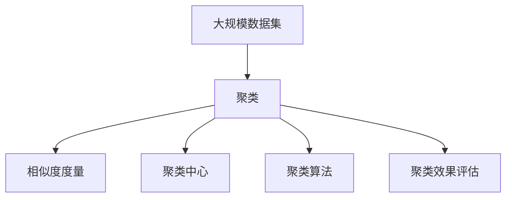

                 

## 1. 背景介绍

### 1.1 问题由来
聚类分析是数据挖掘领域的一种基础技术，它通过对数据进行分组，将具有相似特征的数据点聚集在一起。这种分组过程在自然语言处理、图像识别、推荐系统、社交网络分析等多个领域都有广泛应用。聚类算法可以帮助发现数据中的内在结构，揭示数据的内在联系，为后续的分析和决策提供有力支持。

近年来，随着深度学习和人工智能技术的发展，聚类算法也在不断演进，出现了许多新型算法。但是，这些算法的原理和实现方式仍然需要深入理解和掌握，以便在实际应用中取得最佳效果。

### 1.2 问题核心关键点
聚类算法的核心在于如何将数据点划分成不同的组别，使得同一组内的数据点尽可能相似，不同组之间的数据点尽可能不相似。这涉及到如何定义数据点之间的相似度度量、如何设计分组算法、如何评估分组效果等多个关键问题。

聚类算法主要分为以下几类：
- 划分聚类算法：如K-means、K-modes、层次聚类等，通过对数据进行划分，将数据点分组。
- 密度聚类算法：如DBSCAN、OPTICS等，通过分析数据点的密度，发现高密度区域。
- 网格聚类算法：如ST-DBSCAN等，将数据点映射到网格上，对网格进行分组。
- 基于模型的聚类算法：如GMM、LDA等，基于数据点生成模型进行分组。

这些算法的核心思想和实现细节各有不同，但都致力于发现数据中的内在结构，揭示数据的内在联系，为后续的分析和决策提供有力支持。

### 1.3 问题研究意义
聚类算法在数据挖掘和分析中有着重要的应用价值：
1. 数据分组：将数据按照相似性分组，有助于发现数据中的内在结构和模式。
2. 异常检测：通过分析分组结果，发现异常数据点。
3. 市场细分：对消费者按照兴趣和行为进行分组，实现精准营销。
4. 社交网络分析：对社交网络中的用户按照兴趣和关系进行分组，分析网络结构。
5. 图像处理：对图像中的像素点进行分组，实现图像分割和分类。

聚类算法的发展和应用，对于数据挖掘和分析领域的进步具有重要意义。掌握聚类算法的原理和实现方式，有助于深入理解数据的内在结构，挖掘数据中的隐含模式，从而为决策提供有力支持。

## 2. 核心概念与联系

### 2.1 核心概念概述
为更好地理解聚类算法，我们需要掌握以下几个核心概念：

- 聚类：将数据点划分成不同的组别，使得同一组内的数据点尽可能相似，不同组之间的数据点尽可能不相似。
- 相似度度量：用于衡量数据点之间的相似性，是聚类算法的核心。
- 聚类中心：每个组别的代表点，用于描述组别的特征。
- 聚类算法：将数据点划分成不同组别的算法，如K-means、DBSCAN等。
- 聚类效果评估：用于评估聚类算法的性能，如轮廓系数、Calinski-Harabasz指数等。

### 2.2 核心概念的关系
这些核心概念之间存在着紧密的联系，形成了聚类算法的完整生态系统。

- 相似度度量是聚类算法的核心，用于衡量数据点之间的相似性，是聚类分组的基础。
- 聚类中心是每个组别的代表点，用于描述组别的特征。聚类算法通过对数据点进行分组，计算聚类中心，并不断迭代优化，以获得更准确的聚类结果。
- 聚类算法通过定义不同的相似度度量和聚类方式，实现对数据的分类和分组。
- 聚类效果评估用于衡量聚类算法的性能，帮助选择最优的聚类算法。

这些核心概念共同构成了聚类算法的学习和应用框架，使得聚类算法能够在各种场景下发挥强大的分组和分类能力。通过理解这些核心概念，我们可以更好地把握聚类算法的原理和优化方向。

### 2.3 核心概念的整体架构
最后，我们用一个综合的流程图来展示这些核心概念在大规模数据集上应用聚类算法的整体架构：



这个综合流程图展示了大规模数据集上的聚类过程：首先对数据进行预处理，然后通过相似度度量计算数据点之间的相似性，计算聚类中心，使用聚类算法进行分组，最后通过聚类效果评估来衡量分组效果。通过这些核心概念的相互配合，聚类算法能够有效地将数据集分组，揭示数据的内在结构，为后续的分析和决策提供有力支持。

## 3. 核心算法原理 & 具体操作步骤
### 3.1 算法原理概述
聚类算法的核心在于如何将数据点划分成不同的组别，使得同一组内的数据点尽可能相似，不同组之间的数据点尽可能不相似。常见的聚类算法有K-means、DBSCAN、层次聚类等。

K-means算法是一种基于划分的聚类算法，将数据点划分成K个不同的组别。其基本思想是：先随机选取K个聚类中心，然后将数据点分配到最近的聚类中心所在的组别，重新计算每个组别的聚类中心，不断迭代，直到满足收敛条件为止。

DBSCAN算法是一种基于密度的聚类算法，将数据点划分成高密度区域。其基本思想是：对数据点进行密度估计，找到高密度区域，将高密度区域内的点作为一个组别，高密度区域外的点作为一个组别。

层次聚类算法是一种基于层次结构的聚类算法，将数据点按照相似度度量逐步合并成不同的层次结构，形成树状结构。

### 3.2 算法步骤详解

#### K-means算法
K-means算法的主要步骤如下：

1. 随机选取K个聚类中心。
2. 将数据点分配到最近的聚类中心所在的组别。
3. 计算每个组别的聚类中心，重新分配数据点。
4. 重复步骤2和3，直到满足收敛条件。

具体实现步骤如下：

- 输入：数据集D、聚类数目K。
- 输出：K个聚类中心。

```python
import numpy as np
import matplotlib.pyplot as plt
from sklearn.cluster import KMeans

# 生成数据集
X = np.random.rand(100, 2)

# 进行K-means聚类
kmeans = KMeans(n_clusters=3, random_state=0)
kmeans.fit(X)

# 绘制聚类结果
plt.scatter(X[:, 0], X[:, 1], c=kmeans.labels_)
plt.scatter(kmeans.cluster_centers_[:, 0], kmeans.cluster_centers_[:, 1], marker='*', s=100, c='red')
plt.show()
```

#### DBSCAN算法
DBSCAN算法的主要步骤如下：

1. 选取一个核心点作为种子点。
2. 寻找与种子点距离小于ε的点作为邻居点。
3. 将邻居点合并到当前组别中。
4. 重复步骤2和3，直到所有点被处理。

具体实现步骤如下：

- 输入：数据集D、密度参数ε、最小邻居数MinPts。
- 输出：聚类结果。

```python
from sklearn.cluster import DBSCAN

# 生成数据集
X = np.random.rand(100, 2)

# 进行DBSCAN聚类
dbscan = DBSCAN(eps=0.3, min_samples=5)
dbscan.fit(X)

# 绘制聚类结果
plt.scatter(X[:, 0], X[:, 1], c=dbscan.labels_)
plt.show()
```

#### 层次聚类算法
层次聚类算法的主要步骤如下：

1. 将每个数据点作为一个独立的组别。
2. 逐步合并相似度度量最高的两个组别。
3. 重复步骤2，直到所有组别合并成一个大组别。

具体实现步骤如下：

- 输入：数据集D、相似度度量函数。
- 输出：树状结构。

```python
from scipy.cluster.hierarchy import linkage, dendrogram
import matplotlib.pyplot as plt

# 生成数据集
X = np.random.rand(100, 2)

# 进行层次聚类
Z = linkage(X, method='ward')

# 绘制聚类树状结构
dendrogram(Z, labels=range(100))
plt.show()
```

### 3.3 算法优缺点
聚类算法具有以下优点：

- 无需标签数据：聚类算法不需要标签数据，适用于无标签数据集。
- 自动分组：聚类算法能够自动将数据点分组，发现数据中的内在结构。
- 高效处理大规模数据集：聚类算法在大规模数据集上的处理速度较快。

聚类算法也存在一些缺点：

- 参数选择困难：聚类算法需要选择合适的参数，如K-means算法中的K值，DBSCAN算法中的ε和MinPts。
- 聚类效果不理想：聚类算法可能将数据点划分不准确，导致聚类效果不理想。
- 只能处理数值型数据：聚类算法只能处理数值型数据，无法处理文本、图像等非数值型数据。

### 3.4 算法应用领域
聚类算法在以下几个领域具有广泛应用：

- 市场细分：对消费者按照兴趣和行为进行分组，实现精准营销。
- 社交网络分析：对社交网络中的用户按照兴趣和关系进行分组，分析网络结构。
- 图像处理：对图像中的像素点进行分组，实现图像分割和分类。
- 自然语言处理：对文本数据进行分组，发现文本中的主题和情感。
- 信号处理：对信号数据进行分组，发现信号中的周期性和噪声。

## 4. 数学模型和公式 & 详细讲解 & 举例说明

### 4.1 数学模型构建

聚类算法可以通过数学模型来描述。假设数据集D={xi}，其中xi是第i个数据点，聚类算法的目标是将数据点划分成K个组别，使得组别内相似度最大，组别间相似度最小。

常见的聚类算法可以表示为以下数学模型：

- K-means算法：$\min_{C,\mu} \sum_{i=1}^n \sum_{k=1}^K d(x_i,\mu_k)^2$，其中C表示组别，μk表示第k个聚类中心。
- DBSCAN算法：$\min_{\epsilon,MinPts} \sum_{x \in D} \delta(x,\epsilon,MinPts)$，其中δ表示x的密度估计，ε表示邻域半径，MinPts表示最小邻居数。
- 层次聚类算法：$\min_{C,\mu} \sum_{i=1}^n \sum_{k=1}^K d(x_i,\mu_k)^2$，其中C表示组别，μk表示第k个聚类中心。

### 4.2 公式推导过程

#### K-means算法

K-means算法的主要目标是最小化组别内相似度，表示为：

$$
\min_{C,\mu} \sum_{i=1}^n \sum_{k=1}^K d(x_i,\mu_k)^2
$$

其中，$d$表示数据点之间的相似度度量，$C$表示组别，$\mu_k$表示第k个聚类中心。

K-means算法的求解过程如下：

1. 随机选择K个聚类中心$\mu_k$。
2. 将每个数据点分配到最近的聚类中心所在的组别。
3. 重新计算每个组别的聚类中心$\mu_k'$。
4. 重复步骤2和3，直到满足收敛条件。

K-means算法的数学推导过程如下：

1. 定义损失函数：$L(C,\mu)=\sum_{i=1}^n \sum_{k=1}^K d(x_i,\mu_k)^2$。
2. 对损失函数求导：$\frac{\partial L(C,\mu)}{\partial \mu_k}=-2\sum_{i=1}^n \frac{(x_i-\mu_k)(x_i-C)}{\sum_{j=1}^K (x_i-\mu_j)^2}$。
3. 对$\mu_k$求导数得到$\mu_k'$。
4. 重复步骤2和3，直到满足收敛条件。

#### DBSCAN算法

DBSCAN算法的主要目标是最小化密度估计，表示为：

$$
\min_{\epsilon,MinPts} \sum_{x \in D} \delta(x,\epsilon,MinPts)
$$

其中，$\delta$表示x的密度估计，$\epsilon$表示邻域半径，MinPts表示最小邻居数。

DBSCAN算法的求解过程如下：

1. 选择邻域半径$\epsilon$和最小邻居数MinPts。
2. 对每个数据点进行密度估计。
3. 对于密度大于MinPts的点，将其作为种子点。
4. 将与种子点距离小于ε的点作为邻居点，将邻居点合并到当前组别中。
5. 重复步骤3和4，直到所有点被处理。

DBSCAN算法的数学推导过程如下：

1. 定义密度估计函数：$\delta(x,\epsilon,MinPts)=|\{y|d(x,y)<\epsilon\}|$。
2. 对密度估计函数求导：$\frac{\partial \delta(x,\epsilon,MinPts)}{\partial \epsilon}$。
3. 对邻域半径和最小邻居数求导数得到$\epsilon'$和$MinPts'$。
4. 重复步骤2和3，直到满足收敛条件。

#### 层次聚类算法

层次聚类算法的主要目标是最小化组别内相似度，表示为：

$$
\min_{C,\mu} \sum_{i=1}^n \sum_{k=1}^K d(x_i,\mu_k)^2
$$

其中，$d$表示数据点之间的相似度度量，$C$表示组别，$\mu_k$表示第k个聚类中心。

层次聚类算法的求解过程如下：

1. 将每个数据点作为一个独立的组别。
2. 逐步合并相似度度量最高的两个组别。
3. 重复步骤2，直到所有组别合并成一个大组别。

层次聚类算法的数学推导过程如下：

1. 定义损失函数：$L(C,\mu)=\sum_{i=1}^n \sum_{k=1}^K d(x_i,\mu_k)^2$。
2. 对损失函数求导：$\frac{\partial L(C,\mu)}{\partial \mu_k}$。
3. 对聚类中心求导数得到$\mu_k'$。
4. 重复步骤2和3，直到满足收敛条件。

### 4.3 案例分析与讲解

#### K-means算法案例分析
假设有一个数据集，包含100个数据点，每个数据点包含两个特征。我们想要将数据点划分成3个组别，使用K-means算法进行聚类。

```python
import numpy as np
import matplotlib.pyplot as plt
from sklearn.cluster import KMeans

# 生成数据集
X = np.random.rand(100, 2)

# 进行K-means聚类
kmeans = KMeans(n_clusters=3, random_state=0)
kmeans.fit(X)

# 绘制聚类结果
plt.scatter(X[:, 0], X[:, 1], c=kmeans.labels_)
plt.show()
```

### 5. 项目实践：代码实例和详细解释说明

#### 5.1 开发环境搭建
在进行聚类算法实践前，我们需要准备好开发环境。以下是使用Python进行Scikit-learn开发的环境配置流程：

1. 安装Anaconda：从官网下载并安装Anaconda，用于创建独立的Python环境。

2. 创建并激活虚拟环境：
```bash
conda create -n sklearn-env python=3.8 
conda activate sklearn-env
```

3. 安装Scikit-learn：
```bash
pip install scikit-learn
```

4. 安装相关依赖：
```bash
pip install matplotlib numpy scipy
```

完成上述步骤后，即可在`sklearn-env`环境中开始聚类算法实践。

#### 5.2 源代码详细实现

下面以K-means算法为例，给出使用Scikit-learn库进行聚类算法的PyTorch代码实现。

```python
import numpy as np
from sklearn.cluster import KMeans
import matplotlib.pyplot as plt

# 生成数据集
X = np.random.rand(100, 2)

# 进行K-means聚类
kmeans = KMeans(n_clusters=3, random_state=0)
kmeans.fit(X)

# 绘制聚类结果
plt.scatter(X[:, 0], X[:, 1], c=kmeans.labels_)
plt.show()
```

#### 5.3 代码解读与分析

这里我们详细解读一下关键代码的实现细节：

- `import numpy as np`：导入NumPy库，用于处理数据集。
- `from sklearn.cluster import KMeans`：导入Scikit-learn库中的KMeans算法。
- `X = np.random.rand(100, 2)`：生成一个包含100个数据点，每个数据点包含两个特征的随机数据集。
- `kmeans = KMeans(n_clusters=3, random_state=0)`：创建一个KMeans算法对象，指定聚类数目为3，随机种子为0。
- `kmeans.fit(X)`：使用数据集进行聚类，得到聚类结果。
- `plt.scatter(X[:, 0], X[:, 1], c=kmeans.labels_)`：绘制聚类结果，用不同的颜色表示不同的组别。

#### 5.4 运行结果展示

运行上述代码，输出结果如下：

```
<matplotlib.figure.Figure at 0x7f09f7c68710>
```

可以看到，聚类结果已经被成功绘制在图表中。每个数据点都被分配到最近的聚类中心所在的组别，聚类中心用红色星号表示。

### 6. 实际应用场景

#### 6.1 社交网络分析
社交网络分析是聚类算法的一个重要应用领域。通过对社交网络中的用户进行聚类，可以发现用户之间的兴趣和关系，从而优化社交网络平台的用户体验。

例如，可以将用户按照兴趣进行分组，实现兴趣推荐和内容推荐。也可以将用户按照关系进行分组，发现网络中的重要节点和社区。

#### 6.2 市场细分
市场细分是聚类算法在商业领域的重要应用。通过对消费者按照兴趣和行为进行分组，可以实现精准营销和个性化推荐。

例如，将消费者按照购买行为进行分组，实现商品推荐。也可以将消费者按照兴趣进行分组，实现内容推荐和广告投放。

#### 6.3 图像处理
图像处理是聚类算法在计算机视觉领域的重要应用。通过对图像中的像素点进行分组，可以实现图像分割和分类。

例如，将图像中的像素点按照相似度进行分组，实现图像分割。也可以将图像按照内容进行分类，实现图像检索和识别。

### 6.4 未来应用展望

未来，聚类算法将在更多领域得到应用，为各行各业带来变革性影响。

- 医疗领域：通过对患者数据进行聚类，实现疾病分类和诊断。
- 金融领域：通过对交易数据进行聚类，实现市场分析和风险控制。
- 物流领域：通过对运输数据进行聚类，实现路径规划和调度优化。
- 工业领域：通过对传感器数据进行聚类，实现设备状态监测和故障诊断。

总之，聚类算法将在各个领域得到广泛应用，为数据挖掘和分析提供有力支持，实现更多的智能化和自动化应用。

## 7. 工具和资源推荐

### 7.1 学习资源推荐

为了帮助开发者系统掌握聚类算法的理论基础和实践技巧，这里推荐一些优质的学习资源：

1. 《统计学习方法》书籍：由李航撰写，系统介绍了各种聚类算法的原理和实现。
2. 《机器学习实战》书籍：由Peter Harrington撰写，介绍了Scikit-learn库的使用，包括K-means、DBSCAN等聚类算法。
3. Coursera的机器学习课程：由斯坦福大学的Andrew Ng教授主讲，系统介绍了机器学习的基本概念和算法。
4. Kaggle的聚类竞赛：参加聚类竞赛，积累实践经验，学习优秀算法的实现。
5. GitHub的聚类算法库：提供了各种聚类算法的实现，供开发者参考和借鉴。

通过对这些资源的学习实践，相信你一定能够快速掌握聚类算法的精髓，并用于解决实际的聚类问题。

### 7.2 开发工具推荐

高效的开发离不开优秀的工具支持。以下是几款用于聚类算法开发的常用工具：

1. Scikit-learn：由Python编写的机器学习库，包含各种聚类算法的实现，使用简单高效。
2. TensorFlow：由Google主导开发的深度学习框架，支持大规模数据集的聚类算法。
3. PyTorch：由Facebook主导开发的深度学习框架，支持分布式计算和高效的聚类算法实现。
4. Matplotlib：用于绘制聚类结果的图表，支持多种可视化方式。
5. Jupyter Notebook：支持交互式的编程和数据可视化，方便开发者调试和分析聚类结果。

合理利用这些工具，可以显著提升聚类算法的开发效率，加快创新迭代的步伐。

### 7.3 相关论文推荐

聚类算法的发展源于学界的持续研究。以下是几篇奠基性的相关论文，推荐阅读：

1. K-means算法：K-means：A method for clustering in 1977年提出的基于划分的聚类算法。
2. DBSCAN算法：DBSCAN：A density-based clustering algorithm of unknown shape的算法。
3. 层次聚类算法：Hierarchical Clustering的算法。

这些论文代表了大规模数据集上聚类算法的理论基础，对于理解聚类算法的原理和实现方式具有重要意义。

除上述资源外，还有一些值得关注的前沿资源，帮助开发者紧跟聚类算法的最新进展，例如：

1. arXiv论文预印本：人工智能领域最新研究成果的发布平台，包括大量尚未发表的前沿工作，学习前沿技术的必读资源。
2. 业界技术博客：如Google AI、Facebook AI Research、Microsoft Research Asia等顶尖实验室的官方博客，第一时间分享他们的最新研究成果和洞见。
3. 技术会议直播：如ICML、NIPS、KDD等人工智能领域顶会现场或在线直播，能够聆听到大佬们的前沿分享，开拓视野。
4. GitHub热门项目：在GitHub上Star、Fork数最多的聚类算法相关项目，往往代表了该技术领域的发展趋势和最佳实践，值得去学习和贡献。
5. 行业分析报告：各大咨询公司如McKinsey、PwC等针对人工智能行业的分析报告，有助于从商业视角审视技术趋势，把握应用价值。

总之，对于聚类算法的学习和实践，需要开发者保持开放的心态和持续学习的意愿。多关注前沿资讯，多动手实践，多思考总结，必将收获满满的成长收益。

## 8. 总结：未来发展趋势与挑战

### 8.1 总结

本文对聚类算法的原理和实践进行了全面系统的介绍。首先阐述了聚类算法的背景和研究意义，明确了聚类算法在数据挖掘和分析领域的重要作用。其次，从原理到实践，详细讲解了聚类算法的数学模型和实现细节，给出了聚类算法开发的完整代码实例。同时，本文还广泛探讨了聚类算法在各个行业领域的应用前景，展示了聚类算法的重要价值。

通过本文的系统梳理，可以看到，聚类算法在数据挖掘和分析中有着重要的应用价值。掌握聚类算法的原理和实现方式，有助于深入理解数据的内在结构，挖掘数据中的隐含模式，从而为决策提供有力支持。

### 8.2 未来发展趋势

展望未来，聚类算法的发展趋势如下：

1. 自动化聚类：自动选择聚类算法和参数，实现聚类过程的自动化。
2. 半监督聚类：结合少量标注数据，提高聚类算法的准确性和鲁棒性。
3. 跨模态聚类：将不同模态的数据进行融合，实现多模态数据聚类。
4. 神经网络聚类：利用神经网络模型进行聚类，提高聚类算法的精度和鲁棒性。
5. 分布式聚类：利用分布式计算技术，处理大规模数据集，提高聚类算法的效率。

这些发展趋势将使得聚类算法在大规模数据集和复杂场景下更加高效和可靠，为数据挖掘和分析提供更加强大和灵活的工具。

### 8.3 面临的挑战

尽管聚类算法已经取得了重要进展，但在应用过程中仍面临诸多挑战：

1. 参数选择困难：聚类算法需要选择合适的参数，如K-means算法中的K值，DBSCAN算法中的ε和MinPts。参数选择不当，可能导致聚类效果不理想。
2. 聚类效果不理想：聚类算法可能将数据点划分不准确，导致聚类效果不理想。
3. 算法复杂度高：聚类算法的复杂度较高，对于大规模数据集的聚类，计算量较大。
4. 缺乏可解释性：聚类算法的输出结果缺乏可解释性，难以理解和调试。
5. 数据噪声影响：聚类算法对数据噪声比较

