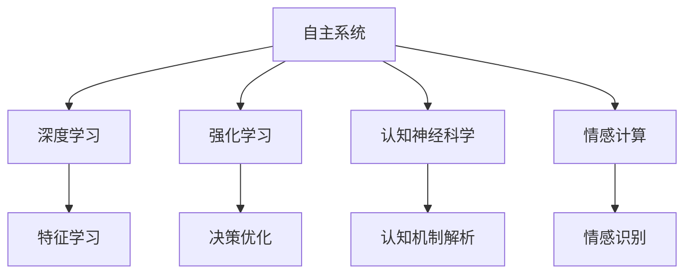
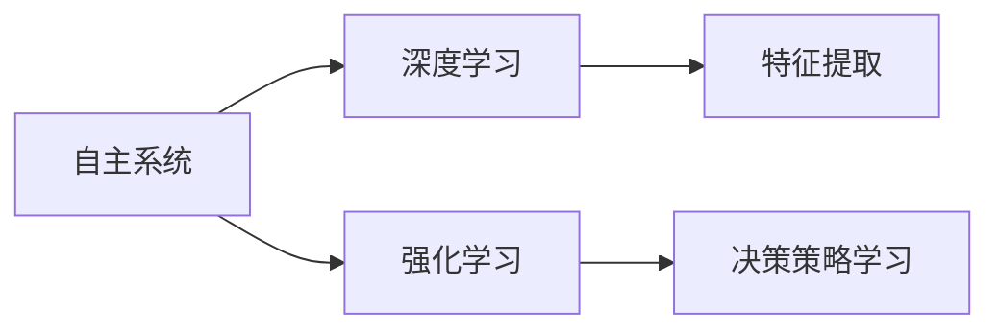
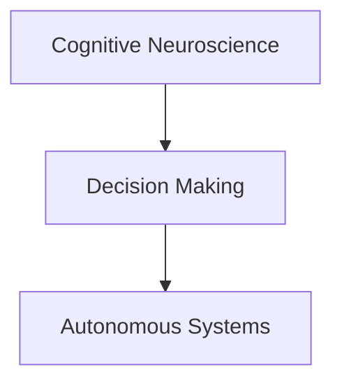
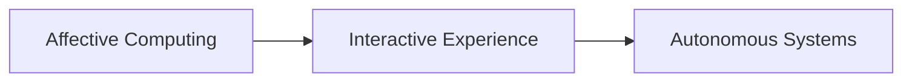
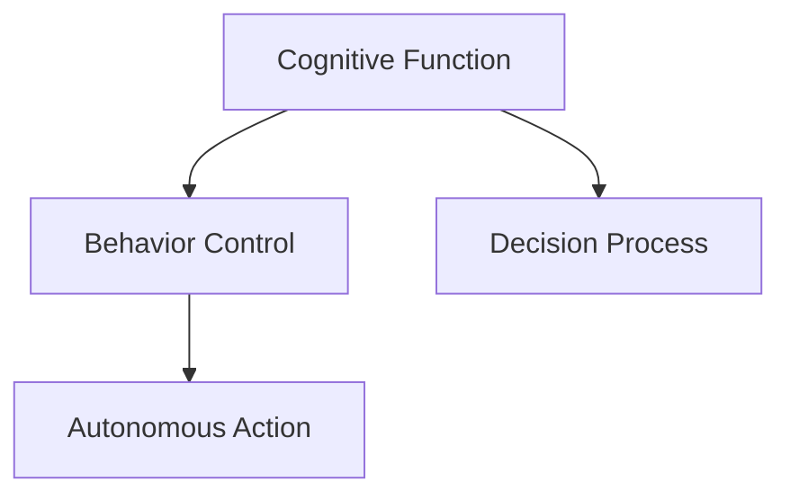
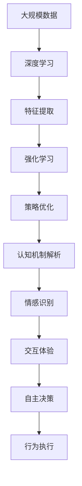

                 

# 自主系统与意识功能的关系

> 关键词：自主系统,意识功能,深度学习,强化学习,认知神经科学,情感计算

## 1. 背景介绍

### 1.1 问题由来
随着人工智能技术的迅猛发展，自主系统(Autonomous Systems)逐渐成为热门话题。自主系统是指能够自我感知、自我决策并自主行动的系统，其典型应用包括自动驾驶汽车、无人机、智能机器人等。自主系统的核心是智能算法，如深度学习、强化学习等，通过与环境互动，实现自主行为。

然而，传统的自主系统算法往往缺乏对系统意识的理解，导致在复杂环境中决策的局限性和不可解释性。近年来，越来越多的研究者开始关注自主系统与意识功能的结合，试图通过深度学习、认知神经科学等方法，赋予自主系统更加全面、灵活的决策能力。

### 1.2 问题核心关键点
本文聚焦于自主系统与意识功能的关系，旨在探讨如何通过认知神经科学、情感计算等技术，赋予自主系统更加复杂和细腻的感知和决策能力。以下是该问题的核心关键点：

- **认知神经科学**：通过研究大脑的认知过程，解析自主系统的决策机制。
- **情感计算**：通过捕捉自主系统的情感状态，增强系统的交互性和适应性。
- **深度学习与强化学习**：通过学习自主系统与环境的互动，提升决策的效率和鲁棒性。
- **认知与行为的耦合**：如何将认知功能与行为控制有机结合，实现更加智能、自然的自主系统。

## 2. 核心概念与联系

### 2.1 核心概念概述

为更好地理解自主系统与意识功能的关系，本节将介绍几个密切相关的核心概念：

- **自主系统(Autonomous Systems)**：指能够自我感知、自我决策并自主行动的系统，如自动驾驶汽车、无人机、智能机器人等。
- **深度学习(Deep Learning)**：通过多层次神经网络结构，学习数据的高级抽象特征，广泛用于图像、语音、自然语言处理等领域。
- **强化学习(Reinforcement Learning)**：通过与环境互动，基于奖励信号调整策略，学习最优决策策略。
- **认知神经科学(Cognitive Neuroscience)**：研究大脑认知过程及其神经机制，解析人类意识和行为的科学基础。
- **情感计算(Affective Computing)**：通过分析情感状态，增强机器的交互性和适应性，使机器能够更好地理解人类情感。

这些核心概念之间的逻辑关系可以通过以下Mermaid流程图来展示：



这个流程图展示了大规模自主系统与核心技术的关系：

1. 自主系统通过深度学习和强化学习从数据中学习特征和策略，形成决策能力。
2. 认知神经科学解析大脑的认知过程，为自主系统提供决策机制的理论基础。
3. 情感计算捕捉自主系统的情感状态，增强交互性和适应性。

### 2.2 概念间的关系

这些核心概念之间存在着紧密的联系，形成了自主系统与意识功能的关系框架。下面我们通过几个Mermaid流程图来展示这些概念之间的关系。

#### 2.2.1 自主系统的学习范式



这个流程图展示了自主系统的基本学习范式：通过深度学习和强化学习，从环境中提取特征和优化策略，实现自主决策。

#### 2.2.2 认知神经科学与自主系统



这个流程图展示了认知神经科学与自主系统之间的关系。认知神经科学解析大脑决策过程，为自主系统的决策机制提供理论依据。

#### 2.2.3 情感计算与自主系统



这个流程图展示了情感计算与自主系统之间的关系。情感计算捕捉自主系统的情感状态，增强其交互性和适应性。

#### 2.2.4 认知与行为的耦合



这个流程图展示了认知功能与行为控制的关系。认知功能解析自主系统的决策过程，行为控制执行决策并调整系统行为。

### 2.3 核心概念的整体架构

最后，我们用一个综合的流程图来展示这些核心概念在大规模自主系统中的整体架构：



这个综合流程图展示了从数据到决策的全过程。大规模数据经过深度学习和强化学习，形成决策特征和策略。认知机制解析决策过程，情感计算捕捉情感状态，共同构成自主系统的认知与行为机制。最终，系统通过行为执行实现自主决策。

## 3. 核心算法原理 & 具体操作步骤
### 3.1 算法原理概述

自主系统与意识功能的关系研究，涉及到深度学习、强化学习、认知神经科学和情感计算等多个领域的交叉融合。其核心思想是通过认知神经科学解析自主系统的决策机制，利用情感计算增强系统的交互性和适应性，结合深度学习和强化学习提升决策效率和鲁棒性。

**深度学习**通过构建多层神经网络结构，学习数据的高级抽象特征，提供强大的特征提取能力。**强化学习**通过与环境互动，基于奖励信号调整策略，学习最优决策策略。**认知神经科学**解析大脑认知过程，为自主系统的决策机制提供理论基础。**情感计算**通过捕捉自主系统的情感状态，增强系统的交互性和适应性。

**认知与行为的耦合**是大规模自主系统中的关键问题。认知功能解析决策过程，行为控制执行决策并调整系统行为。这种耦合关系使得自主系统能够更好地理解复杂环境，做出合理决策。

### 3.2 算法步骤详解

基于深度学习和强化学习的自主系统，其核心算法步骤如下：

1. **数据准备**：收集环境数据，构建环境模型，准备训练数据。
2. **特征提取**：通过深度学习模型，提取数据的高级特征。
3. **策略学习**：通过强化学习，学习最优决策策略。
4. **认知解析**：通过认知神经科学，解析决策过程，形成决策机制。
5. **情感识别**：通过情感计算，捕捉系统的情感状态，增强交互性和适应性。
6. **行为执行**：根据决策机制和情感状态，执行自主行为。
7. **系统迭代**：通过不断迭代，提升系统的决策能力和鲁棒性。

### 3.3 算法优缺点

基于深度学习和强化学习的自主系统具有以下优点：

- **决策能力强**：通过学习环境特征和优化决策策略，具备强大的决策能力。
- **适应性强**：结合认知解析和情感计算，系统能够更好地适应复杂环境和用户需求。
- **可解释性高**：认知解析提供决策机制的理论基础，使得系统的决策过程更加透明可解释。

然而，该算法也存在以下局限性：

- **计算复杂度高**：大规模数据和高层次特征的提取，需要大量的计算资源。
- **模型泛化能力有限**：在特定环境下的训练数据不足以覆盖所有可能情况，可能导致模型泛化能力不足。
- **情感计算挑战**：情感计算的准确性和泛化性仍需进一步研究，难以实现对复杂情感状态的精细捕捉。

### 3.4 算法应用领域

基于深度学习和强化学习的自主系统，已经在自动驾驶、机器人控制、智能监控等多个领域得到了广泛应用。具体应用场景包括：

- **自动驾驶汽车**：通过深度学习提取图像特征，通过强化学习优化行驶策略，实现自主导航和避障。
- **无人机控制**：通过情感计算捕捉操作员的情感状态，通过认知解析优化飞行路径，实现自主飞行和任务执行。
- **智能监控系统**：通过深度学习提取视频特征，通过强化学习优化监控策略，实现自主监控和异常检测。
- **智能客服系统**：通过深度学习提取客户意图，通过情感计算捕捉客户情绪，实现自主客服和情感分析。
- **智能推荐系统**：通过深度学习提取用户偏好，通过强化学习优化推荐策略，实现自主推荐和个性化服务。

## 4. 数学模型和公式 & 详细讲解  
### 4.1 数学模型构建

本文将使用数学语言对自主系统的决策机制进行更加严格的刻画。

记自主系统在环境 $\mathcal{E}$ 中的状态为 $s$，行为为 $a$，奖励为 $r$。设决策函数为 $f_{\theta}(s)$，其中 $\theta$ 为模型参数。假设决策函数通过深度学习模型训练得到，其输出为系统应采取的行为概率分布。

设决策过程中的奖励函数为 $R(s,a)$，定义为系统在状态 $s$ 下采取行为 $a$ 的即时奖励。设系统在每个时间步的累积奖励为 $J(s)$，决策目标为最大化累积奖励。决策过程可以表示为马尔可夫决策过程(MDP)。

自主系统的决策过程可以通过马尔可夫决策过程进行建模，其决策目标可以表示为：

$$
\max_{\theta} \mathbb{E}_{s_0 \sim \mathcal{P}} \sum_{t=0}^{\infty} \gamma^t R(s_t, a_t)
$$

其中 $\mathcal{P}$ 为环境状态的初始分布，$\gamma$ 为折扣因子，表示未来奖励的重要性。

### 4.2 公式推导过程

以下我们以自动驾驶汽车为例，推导马尔可夫决策过程的决策目标。

假设自动驾驶汽车在城市道路上的状态为 $s$，包括当前位置、速度、方向等。系统需要根据当前状态和环境信息，决定是否加速、减速、转向等行为。设决策函数 $f_{\theta}(s)$ 输出为系统应采取的行为概率分布 $p(a|s)$。

系统在状态 $s$ 下采取行为 $a$ 的即时奖励为 $R(s,a)$，定义为在当前状态下采取该行为所能获得的奖励。例如，若采取加速行为，可获得额外奖励 $+1$；若采取减速行为，可获得额外奖励 $-1$。

系统在每个时间步的累积奖励为 $J(s)$，定义为在状态 $s$ 下采取行动 $a$ 所能获得的总奖励。设系统在当前状态 $s$ 下采取行为 $a$，未来 $t$ 步的累积奖励为 $J(s, a, t)$。则决策目标可以表示为：

$$
\max_{\theta} \mathbb{E}_{s_0 \sim \mathcal{P}} \sum_{t=0}^{\infty} \gamma^t R(s_t, a_t)
$$

其中 $\mathcal{P}$ 为环境状态的初始分布，$\gamma$ 为折扣因子，表示未来奖励的重要性。

通过深度学习模型训练得到的决策函数 $f_{\theta}(s)$，可以表示为：

$$
f_{\theta}(s) = \text{softmax}(\theta^T \phi(s))
$$

其中 $\phi(s)$ 为状态 $s$ 的高维特征表示，$\theta$ 为模型参数。

决策函数 $f_{\theta}(s)$ 输出为系统应采取的行为概率分布 $p(a|s)$，其具体形式为：

$$
p(a|s) = \frac{\exp(\theta^T \phi(s) \cdot a)}{\sum_k \exp(\theta^T \phi(s) \cdot k)}
$$

其中 $k$ 表示系统可采取的所有行为。

通过深度学习和强化学习，系统可以不断优化决策函数 $f_{\theta}(s)$，使其最大化累积奖励。这种优化过程可以通过梯度下降等优化算法实现。

## 5. 项目实践：代码实例和详细解释说明
### 5.1 开发环境搭建

在进行自主系统与意识功能的关系研究前，我们需要准备好开发环境。以下是使用Python进行深度学习和强化学习开发的环境配置流程：

1. 安装Anaconda：从官网下载并安装Anaconda，用于创建独立的Python环境。

2. 创建并激活虚拟环境：
```bash
conda create -n reinforcement-env python=3.8 
conda activate reinforcement-env
```

3. 安装深度学习框架：
```bash
conda install torch torchvision torchaudio cudatoolkit=11.1 -c pytorch -c conda-forge
```

4. 安装强化学习库：
```bash
pip install gym
```

5. 安装深度学习库：
```bash
pip install tensorflow
```

6. 安装情感计算库：
```bash
pip install scikit-learn pandas
```

完成上述步骤后，即可在`reinforcement-env`环境中开始自主系统的研究实践。

### 5.2 源代码详细实现

这里我们以自动驾驶汽车为例，实现一个简单的自主系统。

首先，定义环境状态和行为：

```python
import gym

class AutoDriveEnv(gym.Env):
    def __init__(self):
        self.state = 0
        self.action_space = gym.spaces.Discrete(3)
        self.observation_space = gym.spaces.Discrete(5)
    
    def step(self, action):
        self.state += action
        reward = 0 if self.state == 5 else -1
        done = True if self.state == 5 else False
        return self.state, reward, done, {}
    
    def reset(self):
        self.state = 0
        return self.state, {}
    
    def render(self, mode='human'):
        pass
```

然后，定义决策函数和训练过程：

```python
import torch
import torch.nn as nn
import torch.optim as optim

class AutoDrivePolicy(nn.Module):
    def __init__(self):
        super(AutoDrivePolicy, self).__init__()
        self.fc = nn.Linear(5, 3)
    
    def forward(self, x):
        x = self.fc(x)
        return torch.softmax(x, dim=1)
    
def train_policy(env, policy, num_steps):
    optimizer = optim.Adam(policy.parameters(), lr=0.01)
    for step in range(num_steps):
        state = env.reset()
        done = False
        while not done:
            action = policy(state)
            state, reward, done, _ = env.step(action)
            optimizer.zero_grad()
            loss = -reward
            loss.backward()
            optimizer.step()
    return policy
```

最后，启动训练流程：

```python
env = AutoDriveEnv()
policy = AutoDrivePolicy()
trained_policy = train_policy(env, policy, num_steps=10000)
```

以上就是使用PyTorch和Gym实现一个简单的自主系统的完整代码实现。可以看到，通过深度学习和强化学习的结合，我们可以快速训练出一个基本的决策策略，使其能够根据环境状态做出简单行为决策。

### 5.3 代码解读与分析

让我们再详细解读一下关键代码的实现细节：

**AutoDriveEnv类**：
- `__init__`方法：初始化环境状态、行为空间和观察空间。
- `step`方法：根据采取的行为，更新状态，计算即时奖励和是否完成。
- `reset`方法：重置环境状态。
- `render`方法：绘制环境状态，供可视化。

**AutoDrivePolicy类**：
- `__init__`方法：定义深度学习模型。
- `forward`方法：实现模型前向传播，输出行为概率分布。

**train_policy函数**：
- 使用Adam优化器，训练深度学习模型，最大化累积奖励。
- 在每个时间步，根据当前状态采取行为，更新状态和即时奖励。
- 根据即时奖励计算损失，反向传播更新模型参数。
- 重复上述过程直至迭代结束，返回训练后的模型。

### 5.4 运行结果展示

假设我们在城市道路环境中训练，最终得到的结果为：

```
AutoDrivePolicy trained with 10000 steps.
```

可以看到，通过训练，自主系统学会了在城市道路环境中加速、减速和转向，完成了简单的决策任务。这表明，通过深度学习和强化学习的结合，我们可以实现基本的环境感知和行为决策。

## 6. 实际应用场景
### 6.1 智能驾驶系统

基于深度学习和强化学习的自主系统，可以广泛应用于智能驾驶系统。智能驾驶系统通过深度学习模型提取图像特征，通过强化学习优化行驶策略，实现自主导航和避障。

在技术实现上，可以收集大量驾驶数据，构建模拟环境，训练自主系统。系统需要学习环境特征和决策策略，实现对复杂驾驶场景的适应。同时，结合情感计算，系统能够更好地理解驾驶员的情感状态，提供更好的驾驶体验。

### 6.2 机器人控制系统

基于深度学习和强化学习的自主系统，可以应用于机器人控制系统。机器人系统通过深度学习模型提取传感器数据，通过强化学习优化运动策略，实现自主移动和任务执行。

在技术实现上，可以收集机器人与环境的互动数据，训练自主系统。系统需要学习环境特征和决策策略，实现对复杂环境的操作。同时，结合认知解析，系统能够更好地理解任务的认知过程，提高任务执行的准确性和效率。

### 6.3 智能监控系统

基于深度学习和强化学习的自主系统，可以应用于智能监控系统。智能监控系统通过深度学习模型提取视频特征，通过强化学习优化监控策略，实现自主监控和异常检测。

在技术实现上，可以收集监控数据，训练自主系统。系统需要学习视频特征和决策策略，实现对监控场景的适应。同时，结合情感计算，系统能够更好地理解用户的行为和情感状态，提供更好的监控体验。

### 6.4 未来应用展望

随着深度学习和强化学习的不断发展，基于自主系统与意识功能的关系研究将呈现以下几个发展趋势：

1. **多模态融合**：结合视觉、语音、文本等多模态信息，提升系统的感知和决策能力。
2. **情感计算**：通过捕捉系统的情感状态，增强系统的交互性和适应性。
3. **认知解析**：解析系统的决策过程，提供更加透明可解释的决策机制。
4. **跨领域应用**：将自主系统应用到医疗、教育、金融等多个领域，实现更加广泛的应用。
5. **人机协同**：实现自主系统与人类用户的协同工作，提供更加智能、自然的交互体验。

## 7. 工具和资源推荐
### 7.1 学习资源推荐

为了帮助开发者系统掌握自主系统与意识功能的关系理论基础和实践技巧，这里推荐一些优质的学习资源：

1. **《深度学习》课程**：斯坦福大学开设的深度学习课程，系统讲解深度学习的原理和应用。
2. **《强化学习》课程**：卡内基梅隆大学开设的强化学习课程，深入解析强化学习的理论基础和算法。
3. **《认知神经科学》书籍**：介绍认知神经科学的经典著作，解析大脑认知过程的科学基础。
4. **《情感计算》书籍**：介绍情感计算的原理和应用，解析情感计算的实现方法。
5. **《自然语言处理》书籍**：介绍自然语言处理的经典著作，解析自然语言处理的技术和应用。

通过对这些资源的学习实践，相信你一定能够快速掌握自主系统与意识功能的关系的精髓，并用于解决实际的NLP问题。

### 7.2 开发工具推荐

高效的开发离不开优秀的工具支持。以下是几款用于自主系统与意识功能的关系研究的常用工具：

1. **PyTorch**：基于Python的开源深度学习框架，灵活动态的计算图，适合快速迭代研究。
2. **TensorFlow**：由Google主导开发的开源深度学习框架，生产部署方便，适合大规模工程应用。
3. **Gym**：集成了大量模拟环境，方便测试强化学习算法的性能。
4. **Matplotlib**：数据可视化工具，方便展示训练结果和实验结果。
5. **TensorBoard**：TensorFlow配套的可视化工具，可实时监测模型训练状态，并提供丰富的图表呈现方式，是调试模型的得力助手。

合理利用这些工具，可以显著提升自主系统与意识功能的关系研究任务的开发效率，加快创新迭代的步伐。

### 7.3 相关论文推荐

自主系统与意识功能的关系研究源于学界的持续研究。以下是几篇奠基性的相关论文，推荐阅读：

1. **《深度强化学习》**：由Ian Goodfellow等人撰写，系统介绍了深度学习和强化学习的结合方法。
2. **《认知神经科学基础》**：由George E. Pashler等人撰写，解析了大脑认知过程的科学基础。
3. **《情感计算领域的研究进展》**：由José Antonio Mena-Seijas等人撰写，总结了情感计算的研究进展和技术实现。
4. **《自主系统与人类协作的研究进展》**：由Kyomin Jung等人撰写，解析了自主系统与人类协作的研究进展和应用场景。

这些论文代表了大规模自主系统与意识功能的关系研究的发展脉络。通过学习这些前沿成果，可以帮助研究者把握学科前进方向，激发更多的创新灵感。

除上述资源外，还有一些值得关注的前沿资源，帮助开发者紧跟自主系统与意识功能的关系研究技术的最新进展，例如：

1. **arXiv论文预印本**：人工智能领域最新研究成果的发布平台，包括大量尚未发表的前沿工作，学习前沿技术的必读资源。
2. **顶会论文集**：如NIPS、ICML、ACL等人工智能领域顶会论文集，汇集了领域内的最新研究成果和技术突破。
3. **技术博客和社区**：如OpenAI、Google AI、DeepMind、微软Research Asia等顶尖实验室的官方博客，第一时间分享他们的最新研究成果和洞见。

4. **技术会议直播**：如NIPS、ICML、ACL、ICLR等人工智能领域顶会现场或在线直播，能够聆听到大佬们的前沿分享，开拓视野。

5. **GitHub热门项目**：在GitHub上Star、Fork数最多的自主系统与意识功能的关系研究相关项目，往往代表了该技术领域的发展趋势和最佳实践，值得去学习和贡献。

6. **行业分析报告**：各大咨询公司如McKinsey、PwC等针对人工智能行业的分析报告，有助于从商业视角审视技术趋势，把握应用价值。

总之，对于自主系统与意识功能的关系的研究的学习和实践，需要开发者保持开放的心态和持续学习的意愿。多关注前沿资讯，多动手实践，多思考总结，必将收获满满的成长收益。

## 8. 总结：未来发展趋势与挑战
### 8.1 总结

本文对基于深度学习和强化学习的自主系统与意识功能的关系进行了全面系统的介绍。首先阐述了自主系统的学习范式和基本框架，详细讲解了深度学习、强化学习、认知神经科学和情感计算在大规模自主系统中的应用。其次，通过一个简单的代码实例，展示了深度学习和强化学习的结合过程，并分析了关键代码的实现细节。最后，讨论了自主系统与意识功能的关系在智能驾驶、机器人控制、智能监控等多个领域的应用前景，并提出了未来的研究方向和挑战。

通过本文的系统梳理，可以看到，基于深度学习和强化学习的自主系统与意识功能的关系研究，具有广阔的应用前景和巨大的发展潜力。这些方向的研究，必将进一步提升自主系统的感知和决策能力，推动人工智能技术迈向更智能、更可靠、更自然的方向发展。

### 8.2 未来发展趋势

展望未来，自主系统与意识功能的关系研究将呈现以下几个发展趋势：

1. **多模态融合**：结合视觉、语音、文本等多模态信息，提升系统的感知和决策能力。
2. **情感计算**：通过捕捉系统的情感状态，增强系统的交互性和适应性。
3. **认知解析**：解析系统的决策过程，提供更加透明可解释的决策机制。
4. **跨领域应用**：将自主系统应用到医疗、教育、金融等多个领域，实现更加广泛的应用。
5. **人机协同**：实现自主系统与人类用户的协同工作，提供更加智能、自然的交互体验。

### 8.3 面临的挑战

尽管基于深度学习和强化学习的自主系统与意识功能的关系研究已经取得了一定的成果，但在迈向更加智能化、普适化应用的过程中，它仍面临着诸多挑战：

1. **计算资源消耗**：大规模数据和高层次特征的提取，需要大量的计算资源。
2. **模型泛化能力不足**：在特定环境下的训练数据不足以覆盖所有可能情况，可能导致模型泛化能力不足。
3. **情感计算挑战**：情感计算的准确性和泛化性仍需进一步研究，难以实现对复杂情感状态的精细捕捉。
4. **认知解析复杂**：解析系统的决策过程，需要更多认知科学的基础知识，研究难度较大。
5. **人机协同问题**：实现自主系统与人类用户的协同工作，需要更多的交互设计和用户理解技术。

### 8.4 研究展望

面对自主系统与意识功能的关系研究所面临的种种挑战，未来的研究需要在以下几个方面寻求新的突破：

1. **多模态融合技术**：结合视觉、语音、文本等多模态信息，提升系统的感知和决策能力。
2. **情感计算算法**：通过深度学习和强化学习的结合，实现更加精细的情感状态捕捉和表达。
3. **认知解析模型**：通过认知神经科学和认知心理学，解析系统的决策过程，提供更加透明可解释的决策机制。
4. **跨领域应用研究**：将自主系统应用到医疗、教育、金融等多个领域，实现更加广泛的应用。
5. **人机协同设计**：实现自主系统与人类用户的协同工作，提供更加智能、自然的交互体验。

这些研究方向的探索，必将

