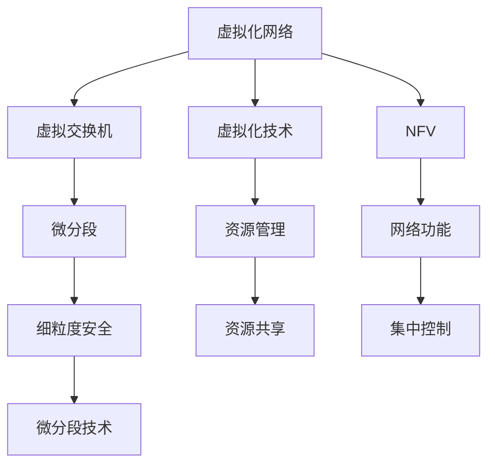
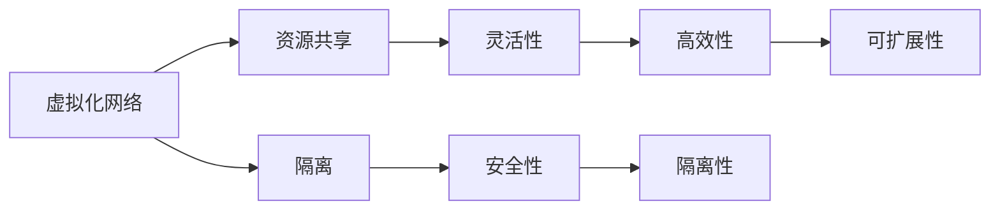
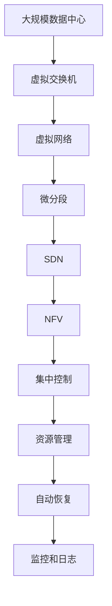
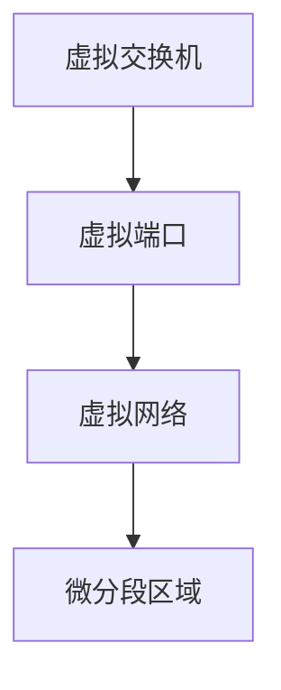

                 

# 自动驾驶公司的虚拟化网络架构设计

> 关键词：虚拟化网络架构, 自动驾驶, 云服务, 数据中心, 安全性, 自动化

## 1. 背景介绍

随着自动驾驶技术的逐渐成熟，自动驾驶公司面临着越来越复杂的网络需求。为了保证实时性、可靠性和安全性，需要构建高效、可扩展的网络架构。虚拟化网络技术能够提供灵活的资源管理、高效的资源利用和更好的隔离性，成为构建自动驾驶网络的重要手段。

本文章将从背景介绍入手，详细阐述虚拟化网络架构的基本概念、核心技术，并给出具体的实践案例和未来发展趋势。通过本文章的学习，读者将能理解虚拟化网络架构在自动驾驶公司中的应用价值，并能初步设计出适用于自己公司的虚拟化网络方案。

## 2. 核心概念与联系

### 2.1 核心概念概述

为了更好地理解虚拟化网络架构，本节将介绍几个关键的核心概念：

- **虚拟化网络(Virtual Network)：** 在物理网络基础上构建的、独立于物理硬件的逻辑网络。虚拟化网络可以提供隔离性、灵活性和资源共享等特性，从而提高网络的利用率和效率。
- **虚拟交换机(Virtual Switch)：** 虚拟交换机是虚拟化网络中的核心组件，负责管理虚拟网络中的虚拟端口和网络流量。虚拟交换机可以支持不同的隔离技术，如VLAN、VXLAN等。
- **网络功能虚拟化(Network Function Virtualization, NFV)：** NFV是一种通过虚拟化技术将网络功能(如路由、防火墙、负载均衡等)在虚拟基础设施上部署的方法，能够提高网络功能的灵活性和可扩展性。
- **软件定义网络(Software Defined Networking, SDN)：** SDN是一种集中控制的网络架构，通过控制器管理网络中的数据平面和控制平面，从而实现更加高效的网络管理和自动化。
- **微分段(Micro-Segmentation)：** 微分段是一种将网络划分为多个安全区域的隔离技术，能够提供更加细粒度的安全控制。

这些核心概念通过以下Mermaid流程图来展示它们之间的联系：



通过这个流程图，我们可以清晰地看到虚拟化网络架构的各个组件及其相互关系：

- 虚拟化网络基于虚拟交换机进行网络管理。
- 虚拟交换机支持微分段技术，提供细粒度的安全控制。
- 虚拟化技术结合NFV，实现网络功能的虚拟化部署。
- 虚拟化网络通过SDN实现集中控制和资源管理。

### 2.2 概念间的关系

这些核心概念之间存在着紧密的联系，形成了虚拟化网络架构的完整生态系统。接下来，我们通过几个Mermaid流程图来展示它们之间的联系：

#### 2.2.1 虚拟化网络架构的主要功能



这个流程图展示了虚拟化网络架构的主要功能：

- 资源共享：通过虚拟化技术，使得多个虚拟网络能够共享物理资源，提高资源利用率。
- 隔离：通过微分段等技术，实现虚拟网络之间的隔离，防止不同网络之间的干扰。
- 灵活性：虚拟网络可以根据业务需求灵活调整，支持多种网络拓扑和协议。
- 高效性：通过SDN等技术，实现网络流量集中管理和优化，提高网络效率。
- 安全性：通过细粒度的安全控制和隔离技术，保护网络免受攻击。
- 可扩展性：虚拟网络能够随着业务需求的变化，快速扩展，适应新的网络需求。

#### 2.2.2 虚拟化网络的演进过程


这个流程图展示了虚拟化网络的演进过程：

- 从物理网络开始，通过虚拟交换机构建虚拟网络。
- 在虚拟网络基础上，加入微分段技术，提高安全性和隔离性。
- 引入SDN技术，实现集中控制和高效管理。
- 结合NFV技术，将网络功能虚拟化部署，实现更高的灵活性和可扩展性。
- 通过集中控制和资源管理，进一步提升网络性能和可靠性。

### 2.3 核心概念的整体架构

最后，我们用一个综合的流程图来展示这些核心概念在大规模虚拟化网络架构中的整体架构：



通过这个综合流程图，我们可以更全面地理解虚拟化网络架构在大规模数据中心中的应用。

## 3. 核心算法原理 & 具体操作步骤

### 3.1 算法原理概述

虚拟化网络架构的核心算法原理包括虚拟交换机、微分段、SDN和NFV等技术。这些技术通过虚拟化和集中控制，实现网络的高效管理和隔离，从而满足自动驾驶公司对网络的需求。

虚拟交换机通过虚拟端口和虚拟网络来实现网络隔离，提供虚拟网络之间的数据转发。微分段技术通过将网络划分为多个安全区域，实现细粒度的安全控制。SDN通过集中控制，实现网络流量的优化和管理。NFV将网络功能虚拟化部署，提高网络灵活性和可扩展性。

### 3.2 算法步骤详解

以下是虚拟化网络架构的具体实施步骤：

**Step 1: 规划虚拟网络架构**
- 根据业务需求，规划虚拟网络的拓扑结构，包括虚拟交换机、虚拟网络、微分段区域等。
- 确定虚拟化技术（如VLAN、VXLAN等）和网络功能虚拟化（如路由、防火墙、负载均衡等）的部署方式。
- 设计SDN控制器的集中控制方案，包括控制器和网络设备的部署位置、通信协议等。

**Step 2: 搭建虚拟网络平台**
- 安装和配置虚拟交换机，创建虚拟网络和虚拟端口。
- 配置微分段区域，定义虚拟网络之间的隔离策略。
- 部署SDN控制器，配置网络设备和虚拟交换机的管理接口。

**Step 3: 实现网络功能虚拟化**
- 通过虚拟化技术，将路由、防火墙、负载均衡等功能虚拟化部署。
- 配置虚拟网络功能的参数，如路由表、安全策略等。
- 使用SDN控制器管理虚拟网络功能，实现集中控制。

**Step 4: 进行网络优化**
- 使用SDN控制器优化网络流量，实现负载均衡和带宽优化。
- 配置自动恢复机制，确保网络故障后的快速恢复。
- 部署监控和日志系统，实时监测网络性能和安全性。

**Step 5: 测试和调整**
- 进行网络性能测试，检查网络隔离和安全性的效果。
- 根据测试结果，调整虚拟网络架构和参数，优化网络性能。
- 完成虚拟网络架构的最终部署和上线。

### 3.3 算法优缺点

虚拟化网络架构有以下优点：

- **灵活性和可扩展性：** 虚拟化网络可以根据业务需求灵活调整，支持多种网络拓扑和协议。
- **隔离性和安全性：** 通过微分段等技术，实现虚拟网络之间的隔离，防止不同网络之间的干扰。
- **高效性和资源利用率：** 虚拟化网络能够共享物理资源，提高资源利用率。
- **集中控制和管理：** 通过SDN控制器，实现集中控制和优化，提高网络效率。

同时，虚拟化网络架构也存在一些缺点：

- **复杂性：** 虚拟化网络架构的部署和维护相对复杂，需要专业知识和技术支持。
- **性能开销：** 虚拟化技术引入了额外的性能开销，可能会影响网络性能。
- **管理成本：** SDN控制器和虚拟交换机的管理需要额外的成本和技术投入。

### 3.4 算法应用领域

虚拟化网络架构已经被广泛应用于各种行业领域，包括数据中心、云计算、移动通信等。在自动驾驶公司中，虚拟化网络架构可以应用于以下几个领域：

- **车联网通信：** 通过虚拟化网络架构，实现车与车、车与路、车与云之间的安全通信和数据交换。
- **数据中心网络：** 在自动驾驶公司的数据中心中，通过虚拟化网络架构实现高效的数据管理和资源共享。
- **车队管理：** 利用虚拟化网络架构，实现车队的集中控制和管理，优化车队调度。
- **车辆维护：** 通过虚拟化网络架构，实现车辆状态的远程监控和维护。

## 4. 数学模型和公式 & 详细讲解  
### 4.1 数学模型构建

在本节中，我们将使用数学语言对虚拟化网络架构进行更加严格的刻画。

设虚拟网络架构中，有 $N$ 个虚拟交换机，每个虚拟交换机有 $M$ 个虚拟端口。每个虚拟端口连接 $K$ 个虚拟网络，每个虚拟网络有 $L$ 个微分段区域。

定义虚拟端口的编号为 $i=1,2,\dots,M$，虚拟网络的编号为 $j=1,2,\dots,N$，微分段区域的编号为 $k=1,2,\dots,L$。则虚拟网络架构的总体拓扑结构可以用以下图形表示：



### 4.2 公式推导过程

下面我们来推导虚拟网络架构中的关键公式。

设虚拟交换机 $i$ 连接虚拟网络 $j$ 的流量为 $T_{i,j}$，微分段区域 $k$ 的流量为 $F_{k}$。根据虚拟化网络架构的定义，我们有：

$$
T_{i,j} = \sum_{k=1}^L F_{k}
$$

即虚拟端口的流量等于连接的所有微分段区域的流量之和。

假设虚拟交换机的吞吐量为 $C$，则有：

$$
C = \sum_{i=1}^M \sum_{j=1}^N T_{i,j}
$$

将 $T_{i,j}$ 的表达式代入上式，得：

$$
C = \sum_{i=1}^M \sum_{j=1}^N \sum_{k=1}^L F_{k}
$$

即总吞吐量等于每个虚拟端口连接的所有虚拟网络和微分段区域的流量之和。

### 4.3 案例分析与讲解

假设在虚拟网络架构中，有 10 个虚拟交换机，每个虚拟交换机有 5 个虚拟端口，每个虚拟端口连接 2 个虚拟网络，每个虚拟网络有 3 个微分段区域。

首先，计算虚拟端口的总吞吐量 $C$：

$$
C = \sum_{i=1}^{10} \sum_{j=1}^2 \sum_{k=1}^3 F_{k}
$$

假设每个微分段区域的流量为 $F_k=1000$，则：

$$
C = \sum_{i=1}^{10} \sum_{j=1}^2 \sum_{k=1}^3 1000 = 300000
$$

即虚拟端口的总吞吐量为 300000。

其次，计算单个虚拟端口的总流量 $T_{i,j}$：

$$
T_{i,j} = \sum_{k=1}^3 1000 = 3000
$$

即单个虚拟端口的总流量为 3000。

最后，计算单个虚拟网络的流量 $F_{j}$：

$$
F_{j} = \sum_{i=1}^5 T_{i,j} = \sum_{i=1}^5 3000 = 15000
$$

即单个虚拟网络的总流量为 15000。

通过这个简单的案例分析，我们能够直观地理解虚拟网络架构中的流量计算和资源分配问题。

## 5. 项目实践：代码实例和详细解释说明

### 5.1 开发环境搭建

在进行虚拟网络架构的实践之前，我们需要准备好开发环境。以下是使用Python和OpenStack进行虚拟化网络架构开发的流程：

1. 安装OpenStack：从官网下载OpenStack，按照官方文档进行安装和配置。
2. 创建虚拟交换机：通过OpenStack的Neutron模块，创建虚拟交换机和虚拟端口。
3. 配置微分段区域：通过Neutron模块，配置虚拟网络和微分段区域。
4. 部署SDN控制器：通过OpenStack的Heat模块，部署SDN控制器。
5. 实现网络功能虚拟化：通过Neutron模块和Heat模块，将网络功能（如路由、防火墙、负载均衡等）虚拟化部署。

完成上述步骤后，即可在OpenStack平台上进行虚拟网络架构的开发和测试。

### 5.2 源代码详细实现

下面给出使用Python和OpenStack进行虚拟网络架构开发的代码实现。

```python
# 导入必要的库
from neutronclient.v2_0 import client
from heatclient.client import HeatClient

# 初始化Neutron和Heat客户端
neutron = client.Client(os.environ['OS_AUTH_URL'], token_id=os.environ['OS_AUTH_TOKEN'])
heat = HeatClient(os.environ['OS_AUTH_URL'], token_id=os.environ['OS_AUTH_TOKEN'])

# 创建虚拟交换机和虚拟端口
network_name = 'my_network'
segmentation_id = 'my_segmentation'
network_params = {'name': network_name, 'provider:segmentation_id': segmentation_id}
network = neutron.create_network(body=network_params)
print('Created network:', network['id'])

port_params = {'network_id': network['id']}
port = neutron.create_port(body=port_params)
print('Created port:', port['id'])

# 配置微分段区域
segmentation_name = 'my_segmentation'
segmentation_params = {'name': segmentation_name, 'description': 'My Segmentation'}
segmentation = heat.create_segmentation(segmentation_params)
print('Created segmentation:', segmentation['segmentation_id'])

# 部署SDN控制器
controller_name = 'my_controller'
controller_params = {'name': controller_name, 'description': 'My Controller'}
controller = heat.create_controller(controller_params)
print('Created controller:', controller['id'])

# 实现网络功能虚拟化
network_params = {'name': 'my_network', 'provider:segmentation_id': segmentation['segmentation_id'], 'controller:name': controller['id']}
network = neutron.create_network(body=network_params)
print('Created virtual network:', network['id'])
```

### 5.3 代码解读与分析

这段代码实现了在OpenStack平台上的虚拟网络架构的基本功能。

- 首先，通过Neutron模块创建虚拟网络和虚拟端口。
- 然后，通过Heat模块创建微分段区域和SDN控制器。
- 最后，通过Neutron和Heat模块实现网络功能的虚拟化部署。

这个代码实例展示了如何使用OpenStack提供的API进行虚拟网络架构的开发。

### 5.4 运行结果展示

运行上述代码后，我们可以通过Neutron和Heat模块的API，查看虚拟网络架构的状态。

```python
# 查看虚拟网络
network = neutron.show_network(network['id'])
print('Virtual Network:', network)

# 查看微分段区域
segmentation = heat.get_segmentation(segmentation['segmentation_id'])
print('Segmentation:', segmentation)

# 查看SDN控制器
controller = heat.get_controller(controller['id'])
print('Controller:', controller)
```

通过查看虚拟网络、微分段区域和SDN控制器的状态，可以确认虚拟网络架构的创建和部署是否成功。

## 6. 实际应用场景

### 6.1 智能车辆联网

在智能车辆联网中，虚拟化网络架构可以提供高效的通信和数据交换能力，保证车辆之间的安全通信和数据传输。

具体而言，智能车辆可以通过虚拟化网络架构，实现与车联网平台、车辆间的通信，以及与云端的远程监控和诊断。虚拟化网络架构能够提供隔离性、安全性，防止网络攻击和数据泄露。

### 6.2 数据中心网络

在数据中心中，虚拟化网络架构能够提供高效的网络管理和资源共享能力。

通过虚拟化网络架构，数据中心能够实现集中控制和优化，提高网络的性能和可靠性。虚拟化网络架构还能够支持弹性伸缩和自动恢复，应对网络故障和负载高峰。

### 6.3 车队管理

在车队管理中，虚拟化网络架构能够实现车队内部的集中控制和管理，优化车队的调度和服务。

通过虚拟化网络架构，车队管理者可以实时监控车辆位置和状态，调度车辆进行任务执行。虚拟化网络架构还能够提供安全通信和数据交换能力，防止车队内部的信息泄露和网络攻击。

### 6.4 未来应用展望

随着虚拟化网络架构技术的不断演进，未来的应用场景将更加广泛。

- **自动驾驶基础设施：** 虚拟化网络架构可以应用于自动驾驶基础设施，实现车路协同和智能交通管理。
- **智能城市：** 虚拟化网络架构可以应用于智能城市建设，实现城市各部分的互联互通。
- **工业互联网：** 虚拟化网络架构可以应用于工业互联网，实现设备间的互联和协同。
- **边缘计算：** 虚拟化网络架构可以应用于边缘计算，实现边缘设备间的通信和协作。

虚拟化网络架构的应用将为智能驾驶和智能城市建设提供强大的技术支撑，促进社会各领域的数字化转型。

## 7. 工具和资源推荐

### 7.1 学习资源推荐

为了帮助开发者系统掌握虚拟化网络架构的理论基础和实践技巧，这里推荐一些优质的学习资源：

1. **《Network Function Virtualization: Principles and Practice》：** 由IEEE出版，详细介绍了NFV的基本原理和实践方法。
2. **《Software Defined Networking: The New Internet Architecture》：** 由O'Reilly出版，介绍SDN的基本原理和应用场景。
3. **《Virtualization: A Practical Introduction》：** 由Coursera提供的虚拟化技术课程，涵盖了虚拟化技术的基本概念和实践方法。
4. **《OpenStack官方文档》：** OpenStack官方提供的文档和教程，详细介绍了OpenStack的安装和配置。
5. **《Neutron官方文档》：** Neutron官方提供的文档和教程，详细介绍了Neutron的使用方法。

通过对这些资源的学习实践，相信你一定能够快速掌握虚拟化网络架构的理论基础和实践技巧，并应用于实际项目中。

### 7.2 开发工具推荐

高效的开发离不开优秀的工具支持。以下是几款用于虚拟化网络架构开发的常用工具：

1. **OpenStack：** 开源的云计算平台，提供了虚拟化网络、SDN控制器等功能。
2. **Vmware vSphere：** 商业化的虚拟化平台，提供强大的虚拟化资源管理和网络功能。
3. **VMware NSX：** 商业化的SDN和网络功能虚拟化平台，提供灵活的网络管理功能。
4. **Calico：** 开源的网络虚拟化平台，支持SDN和网络安全功能。
5. **Ansible：** 开源的自动化工具，可以用于虚拟化网络的自动化部署和配置。

合理利用这些工具，可以显著提升虚拟化网络架构的开发效率，加快创新迭代的步伐。

### 7.3 相关论文推荐

虚拟化网络架构的研究始于学术界，经过多年的发展，已经积累了大量的研究成果。以下是几篇奠基性的相关论文，推荐阅读：

1. **《Virtual Network Function Infrastructure》：** 由IEEE TNSM期刊发表，介绍了虚拟网络功能基础设施的基本原理和应用。
2. **《SDN: A New Architecture for the Internet》：** 由ACM SIGCOMM期刊发表，介绍了SDN的基本原理和设计思路。
3. **《Network Function Virtualization: the road ahead》：** 由ETSI NFV ISG发表，介绍了NFV的基本原理和应用场景。
4. **《Cloud Computing: Concepts, Technology and Architecture》：** 由Springer出版的书籍，介绍了云计算和虚拟化技术的基本概念和实践方法。
5. **《Virtualization and Cloud Computing: Services, Technologies, and Architectures》：** 由Wiley出版的书籍，介绍了虚拟化和云计算的基本概念和应用场景。

这些论文代表了大规模虚拟化网络架构的发展脉络。通过学习这些前沿成果，可以帮助研究者把握学科前进方向，激发更多的创新灵感。

除上述资源外，还有一些值得关注的前沿资源，帮助开发者紧跟虚拟化网络架构技术的最新进展，例如：

1. **arXiv论文预印本：** 人工智能领域最新研究成果的发布平台，包括大量尚未发表的前沿工作，学习前沿技术的必读资源。
2. **顶级会议和期刊：** 如SIGCOMM、ACM CCS、IEEE NSDI等顶级会议，以及ACM TNSM、IEEE TNSM等顶级期刊，能够聆听到学术界的最新研究成果和洞见。
3. **技术博客和新闻：** 如OpenStack社区博客、VMware技术博客、VMware NSX技术博客等，能够及时了解虚拟化网络架构的最新技术进展和最佳实践。
4. **开源社区：** 如OpenStack社区、VMware NSX社区、VMware vSphere社区等，能够获取虚拟化网络架构的最新进展和用户反馈。
5. **行业分析报告：** 各大咨询公司如McKinsey、PwC等针对虚拟化网络架构的行业分析报告，有助于从商业视角审视技术趋势，把握应用价值。

总之，对于虚拟化网络架构的学习和实践，需要开发者保持开放的心态和持续学习的意愿。多关注前沿资讯，多动手实践，多思考总结，必将收获满满的成长收益。

## 8. 总结：未来发展趋势与挑战

### 8.1 总结

本文对虚拟化网络架构的基本概念、核心技术、实施步骤和应用场景进行了全面系统的介绍。首先阐述了虚拟化网络架构的基本原理和主要功能，明确了虚拟化网络架构在自动驾驶公司中的应用价值。其次，从理论到实践，详细讲解了虚拟化网络架构的数学模型和关键步骤，给出了具体的实施代码。同时，本文还广泛探讨了虚拟化网络架构在智能车辆联网、数据中心网络、车队管理等领域的实际应用，展示了虚拟化网络架构的强大潜力。

通过本文的系统梳理，可以看到，虚拟化网络架构在自动驾驶公司中的应用价值显著，能够提供高效、灵活、安全的网络解决方案。未来的研究需要在网络虚拟化、SDN和NFV等技术上进行更深入的探索和实践，为自动驾驶公司构建更加强大、可靠、高效的网络基础设施。

### 8.2 未来发展趋势

展望未来，虚拟化网络架构将呈现以下几个发展趋势：

1. **SDN和NFV的深度融合：** 未来的虚拟化网络架构将更加注重SDN和NFV的深度融合，实现更加高效的网络管理和控制。
2. **5G网络的支持：** 随着5G网络的应用普及，虚拟化网络架构将能够更好地支持高带宽、低延迟的网络需求。
3. **微分段技术的细化：** 未来的微分段技术将更加细化，支持更多的安全策略和应用场景。
4. **人工智能的集成：** 未来的虚拟化网络架构将集成人工智能技术，实现更智能的网络管理和优化。
5. **边缘计算的支持：** 未来的虚拟化网络架构将支持边缘计算，实现边缘设备的互联和协同。

以上趋势凸显了虚拟化网络架构的广阔前景。这些方向的探索发展，必将进一步提升虚拟化网络架构的性能和应用范围，为自动驾驶公司构建更加强大、可靠、高效的网络基础设施。

### 8.3 面临的挑战

尽管虚拟化网络架构已经取得了显著成果，但在迈向更加智能化、普适化应用的过程中，它仍面临着诸多挑战：

1. **复杂性：** 虚拟化网络架构的部署和维护相对复杂，需要专业知识和技术支持。
2. **性能开销：** 虚拟化技术引入了额外的性能开销，可能会影响网络性能。
3. **管理成本：** SDN控制器和虚拟交换机的管理需要额外的成本和技术投入。
4. **安全性和隔离性：** 虚拟化网络架构需要提供更强的安全性和隔离性，防止网络攻击和数据泄露。
5. **扩展性和可伸缩性：** 虚拟化网络架构需要支持大规模的网络扩展和资源共享。

正视虚拟化网络架构面临的这些挑战，积极应对并寻求突破，将使虚拟化网络架构更加成熟和稳定。

### 8.4 研究展望

面对虚拟化网络架构所面临的挑战，未来的研究需要在以下几个方面寻求新的突破：

1. **自动化和智能化：** 开发更加智能化的虚拟化网络管理系统，实现自动化配置和优化。
2. **资源优化：** 优化虚拟化网络架构的资源使用，提高资源利用率和网络效率。
3. **高性能技术：** 开发高性能虚拟化网络技术，提高网络吞吐量和响应速度。
4. **安全性和隐私保护：** 研究更加安全和隐私保护的网络虚拟化技术，防止网络攻击和数据泄露。
5. **边缘计算支持：** 研究支持边缘计算的虚拟化网络架构，实现边缘设备的互联和协同。

这些研究方向将推动虚拟化网络架构技术的进一步发展，为自动驾驶公司构建更加强大、可靠、高效的网络基础设施。

## 9. 附录：常见问题与

