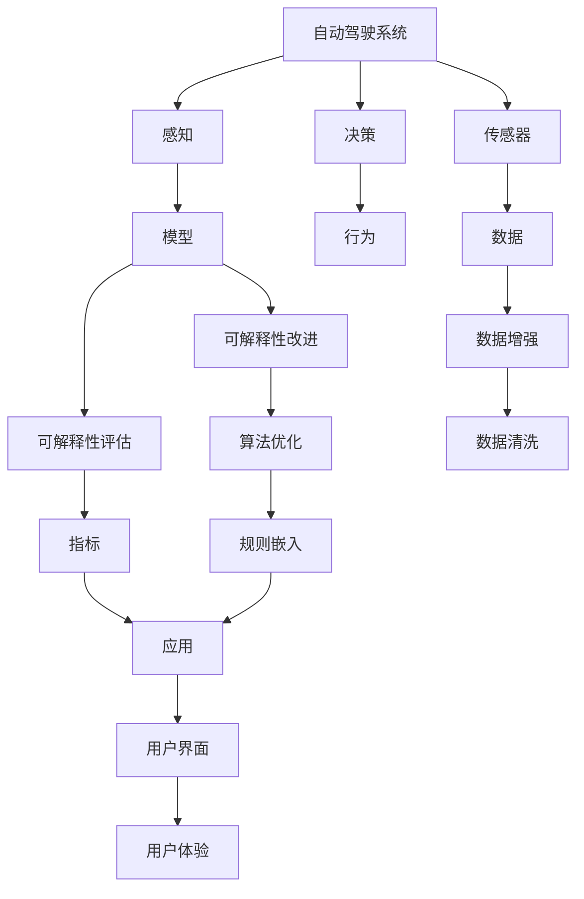
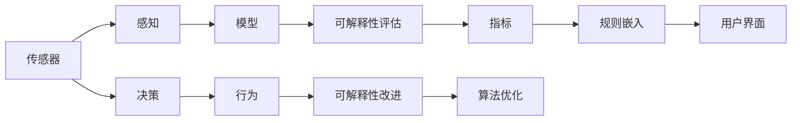
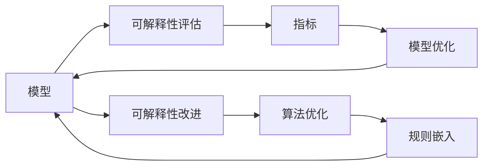
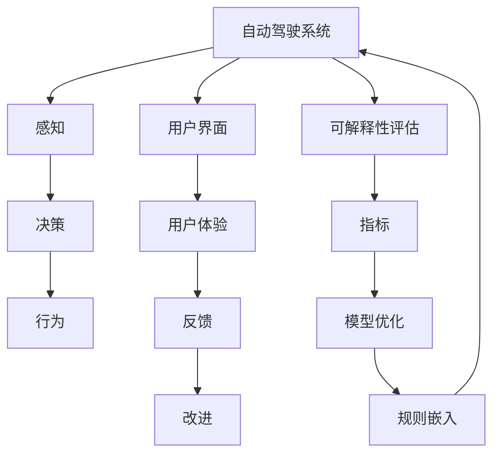
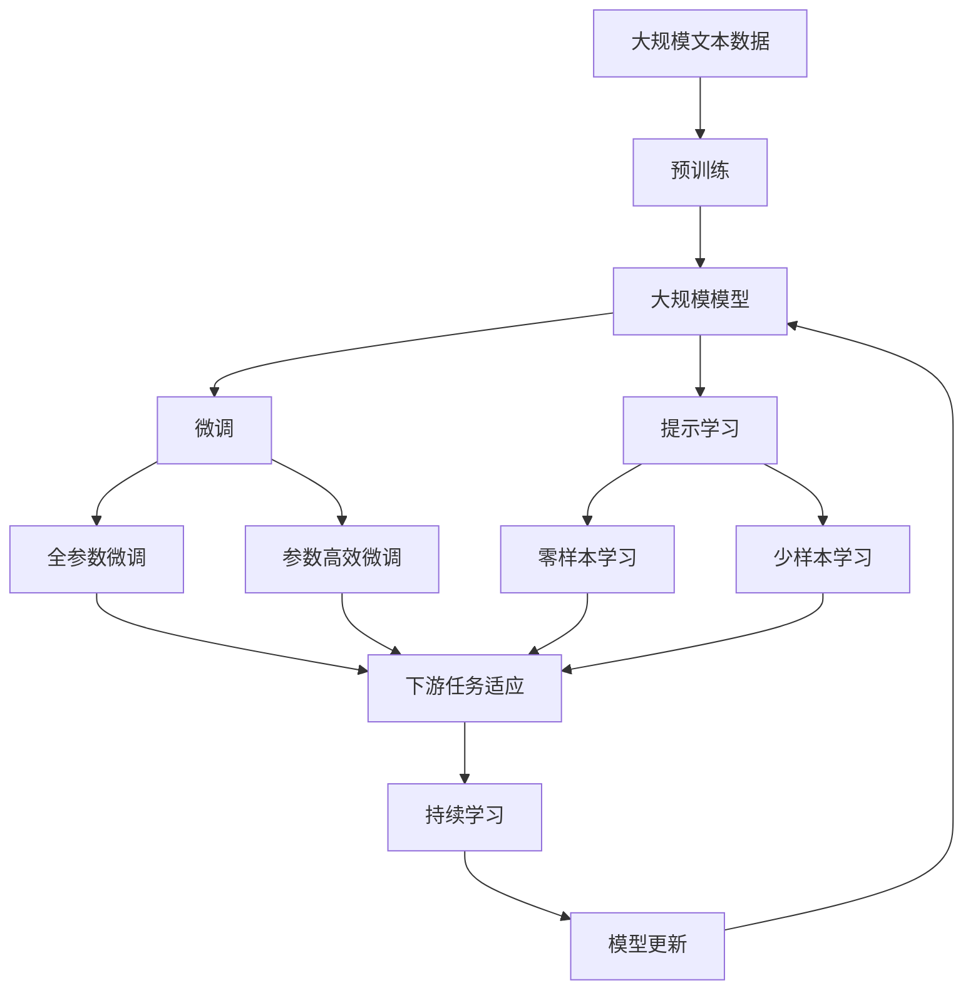

                 

# 自动驾驶系统可解释性评估与改进的关键问题与新思路

## 1. 背景介绍

### 1.1 问题由来

随着自动驾驶技术的发展，自动驾驶系统（Autonomous Driving System, ADS）逐渐从实验室走向实际应用，从城市道路扩展到高速公路，从辅助驾驶迈向完全自动驾驶。然而，自动驾驶系统面临着诸多复杂的决策问题，如交通信号识别、道路标志解析、车辆行为预测等，这些问题都需要复杂的算法和模型来解决。但与此同时，这些算法和模型的复杂性，也带来了“黑箱”问题，即无法解释模型决策的机理和过程，这对安全性、可靠性和信任度构成了巨大挑战。因此，如何评估和改进自动驾驶系统的可解释性，成为当下亟待解决的关键问题。

### 1.2 问题核心关键点

自动驾驶系统的可解释性评估与改进主要涉及以下几个关键问题：

1. **模型复杂性与可解释性的权衡**：如何权衡自动驾驶系统复杂性与模型可解释性，确保在不降低性能的前提下提升可解释性。
2. **可解释性评估指标**：如何选择和设计合适的可解释性评估指标，全面评估模型的决策过程和结果。
3. **可解释性改进方法**：如何通过改进模型架构、优化算法策略、引入外部知识等手段，提升模型的可解释性。
4. **可解释性与安全性**：如何通过可解释性评估改进，确保模型决策的鲁棒性和安全性。
5. **用户界面与体验**：如何设计友好的用户界面，使用户能够直观理解模型的决策过程。

本文将围绕这些问题，深入探讨自动驾驶系统可解释性评估与改进的路径和策略。

## 2. 核心概念与联系

### 2.1 核心概念概述

为更好地理解自动驾驶系统可解释性评估与改进的关键问题，我们首先需要明确几个核心概念：

- **自动驾驶系统（Autonomous Driving System, ADS）**：通过传感器、摄像头、雷达等设备感知周围环境，并使用人工智能算法进行决策和控制的系统。ADS的核心任务包括路径规划、行为决策、避障等。
- **可解释性（Explainability）**：指模型或算法决策过程的可理解性，即模型为何会做出特定决策的解释。
- **可解释性评估（Explainability Evaluation）**：评估模型或算法决策过程可理解程度的方法和指标。
- **可解释性改进（Explainability Improvement）**：通过优化模型架构、算法策略等手段，提升模型可解释性的过程。

这些概念之间的逻辑关系可以通过以下Mermaid流程图来展示：



这个流程图展示了自动驾驶系统的核心组件和流程，以及可解释性评估与改进的关键环节。自动驾驶系统通过感知、决策、行为等环节实现自主驾驶，而感知和决策环节都依赖于模型或算法，这些模型的可解释性评估与改进，直接影响到系统的安全性和用户体验。

### 2.2 概念间的关系

这些核心概念之间存在着紧密的联系，形成了自动驾驶系统可解释性评估与改进的完整生态系统。下面我们通过几个Mermaid流程图来展示这些概念之间的关系。

#### 2.2.1 感知与决策的交互



这个流程图展示了感知、决策、行为等环节中模型可解释性评估与改进的交互关系。传感器的输出数据通过感知模型转化为环境表示，进而由决策模型生成行为指令。在此过程中，感知和决策模型的可解释性评估与改进，可以提升模型的决策鲁棒性和用户信任度。

#### 2.2.2 可解释性评估与改进的反馈循环



这个流程图展示了可解释性评估与改进的反馈循环。通过评估模型的可解释性指标，识别模型的决策漏洞和风险点，进而进行模型优化和规则嵌入，提升模型的可解释性和鲁棒性。

#### 2.2.3 用户界面与体验的协同



这个流程图展示了用户界面、用户体验与感知、决策等环节的协同关系。友好的用户界面和清晰的用户体验，可以增强用户对系统可解释性的理解和信任，从而提升系统的整体性能和安全性。

### 2.3 核心概念的整体架构

最后，我们用一个综合的流程图来展示这些核心概念在大规模模型微调过程中的整体架构：



这个综合流程图展示了从预训练到微调，再到持续学习的完整过程。大规模模型首先在大规模文本数据上进行预训练，然后通过微调（包括全参数微调和参数高效微调两种方式）或提示学习（包括零样本和少样本学习）来适应下游任务。最后，通过持续学习技术，模型可以不断更新和适应新的任务和数据。

## 3. 核心算法原理 & 具体操作步骤
### 3.1 算法原理概述

自动驾驶系统可解释性评估与改进的核心算法，本质上是对模型或算法决策过程的可理解性和透明度的分析和优化。其核心思想是：通过对模型决策的可视化、分析、验证等手段，全面评估模型的决策过程，并采取相应的改进措施，提升模型的可解释性和鲁棒性。

自动驾驶系统的决策过程可以分为感知、决策、行为三个主要环节，每个环节的模型都需要可解释性评估与改进。以下是每个环节的核心算法原理：

- **感知环节**：通过传感器数据（如摄像头、雷达），感知模型的输出需要具备可解释性，能够清晰解释感知结果的依据。
- **决策环节**：决策模型的输出需要具备可解释性，能够说明模型决策的理由和依据。
- **行为环节**：行为模型的输出需要具备可解释性，能够解释模型行为的原因和结果。

### 3.2 算法步骤详解

基于上述算法原理，自动驾驶系统可解释性评估与改进的具体操作步骤包括以下几个步骤：

**Step 1: 数据准备与预处理**
- 收集和准备自动驾驶系统所需的传感器数据（如摄像头、雷达）。
- 对数据进行清洗和标注，确保数据的质量和一致性。
- 对数据进行增强处理，如添加噪声、变换视角、变换光照等，以增加数据多样性。

**Step 2: 模型选择与训练**
- 选择合适的感知、决策、行为等模型，如CNN、RNN、Transformer等。
- 在准备的数据集上训练模型，确保模型具有良好的泛化能力。
- 在训练过程中，使用可解释性评估指标进行监控和优化。

**Step 3: 可解释性评估**
- 使用可解释性评估工具（如LIME、SHAP等），对模型的输出进行可视化，生成特征重要性图、局部解释图等。
- 分析模型的决策依据，验证模型的决策过程是否合理。
- 设计合理的可解释性指标（如SHAP值、AUM值等），评估模型的可解释性。

**Step 4: 可解释性改进**
- 针对评估中发现的模型漏洞和问题，进行模型优化和算法改进。
- 引入外部知识，如交通规则、行为准则等，指导模型决策。
- 优化模型架构，如引入可解释性层、规则嵌入等，提升模型的可解释性。

**Step 5: 用户界面与反馈**
- 设计友好的用户界面，使用户能够直观理解模型的决策过程。
- 收集用户反馈，优化用户界面和用户体验。
- 在用户界面中加入可解释性信息，如模型决策依据、特征重要性等。

**Step 6: 持续学习与更新**
- 定期收集新的传感器数据，对模型进行重新训练和优化。
- 对模型进行持续学习，避免模型过拟合和数据分布漂移。
- 在训练过程中，不断评估和改进模型的可解释性。

### 3.3 算法优缺点

自动驾驶系统可解释性评估与改进的算法具有以下优点：
1. 提升系统安全性。通过可解释性评估和改进，能够明确模型决策的依据，减少错误决策的概率。
2. 增强用户信任度。友好的用户界面和清晰的决策过程，能够增强用户对系统的信任感。
3. 促进模型优化。通过可解释性评估和改进，可以发现模型中的问题并进行优化，提升模型性能。
4. 丰富决策信息。可解释性信息可以帮助用户更好地理解模型决策，为决策提供辅助。

但该算法也存在一些缺点：
1. 模型复杂性增加。可解释性评估和改进可能引入额外的计算和存储成本，增加模型复杂性。
2. 数据需求较大。收集和标注大量传感器数据，可能存在数据隐私和标注成本问题。
3. 模型可解释性限制。一些复杂模型，如深度神经网络，可能难以完全解释其决策过程。

### 3.4 算法应用领域

自动驾驶系统可解释性评估与改进的算法在以下几个领域有广泛应用：

- **自动驾驶车辆**：在感知、决策和行为等环节，通过可解释性评估与改进，提升系统安全性、可靠性和用户信任度。
- **交通管理**：在交通信号识别、车辆行为预测等任务中，通过可解释性评估与改进，提升系统的决策准确性和鲁棒性。
- **智能城市**：在城市交通管理、智能交通灯控制等应用中，通过可解释性评估与改进，提升系统的透明度和用户友好度。
- **自动驾驶技术研发**：在自动驾驶技术的研发过程中，通过可解释性评估与改进，促进技术进步和应用推广。

## 4. 数学模型和公式 & 详细讲解 & 举例说明

### 4.1 数学模型构建

自动驾驶系统可解释性评估与改进的核心数学模型，主要涉及以下几个方面：

- **模型输出可解释性评估**：使用特征重要性（Feature Importance）、局部解释（Local Interpretability）等方法，评估模型的输出结果。
- **模型决策可解释性评估**：使用可解释性指标（如SHAP值、AUM值等），评估模型的决策过程。
- **用户界面可解释性设计**：使用用户体验评估（User Experience Evaluation）方法，设计友好的用户界面。

### 4.2 公式推导过程

以下我们以感知模型的SHAP值评估为例，推导其计算公式。

假设感知模型为 $M_{\theta}(x)$，其中 $x$ 为输入的传感器数据，$\theta$ 为模型的参数。感知模型的输出为 $y$，即模型的决策结果。则其SHAP值 $\phi_i$ 定义为：

$$
\phi_i = \frac{\partial M_{\theta}(x)}{\partial x_i} \cdot M_{\theta}(x)
$$

其中 $\frac{\partial M_{\theta}(x)}{\partial x_i}$ 为模型对输入 $x$ 的导数，表示输入 $x_i$ 对模型输出的影响。$M_{\theta}(x)$ 为模型在输入 $x$ 下的输出。

根据上述公式，我们可以使用数值微分等方法计算每个输入特征 $x_i$ 的SHAP值，从而评估模型决策的特征重要性。

### 4.3 案例分析与讲解

以一个简单的感知模型为例，假设该模型使用CNN网络，输入为传感器数据 $x$，输出为决策结果 $y$。我们通过计算每个特征 $x_i$ 的SHAP值，分析其对模型输出的影响。

首先，我们使用数值微分方法计算每个特征的SHAP值：

$$
\phi_i = \frac{M_{\theta}(x) - M_{\theta}(x_{-i})}{x_i - x_{-i}}
$$

其中 $x_{-i}$ 表示除 $x_i$ 外的所有输入特征。通过计算每个特征的SHAP值，我们可以得到一个特征重要性矩阵，用于评估模型决策的特征依赖关系。

接下来，我们分析每个特征的SHAP值，找出对模型输出影响较大的特征，进而优化模型的输入选择和设计。例如，如果某个特征的SHAP值较大，说明该特征对模型输出有较大的影响，我们可以考虑在该特征上添加额外的传感器，或调整该特征的权重，以提高模型的感知精度。

通过以上分析，我们可以发现模型决策的特征依赖关系，从而优化模型的输入选择和设计，提升模型的感知精度和决策鲁棒性。

## 5. 项目实践：代码实例和详细解释说明

### 5.1 开发环境搭建

在进行自动驾驶系统可解释性评估与改进的实践前，我们需要准备好开发环境。以下是使用Python进行PyTorch开发的环境配置流程：

1. 安装Anaconda：从官网下载并安装Anaconda，用于创建独立的Python环境。

2. 创建并激活虚拟环境：
```bash
conda create -n pytorch-env python=3.8 
conda activate pytorch-env
```

3. 安装PyTorch：根据CUDA版本，从官网获取对应的安装命令。例如：
```bash
conda install pytorch torchvision torchaudio cudatoolkit=11.1 -c pytorch -c conda-forge
```

4. 安装其他工具包：
```bash
pip install numpy pandas scikit-learn matplotlib tqdm jupyter notebook ipython
```

完成上述步骤后，即可在`pytorch-env`环境中开始实践。

### 5.2 源代码详细实现

下面我们以感知模型的SHAP值评估为例，给出使用PyTorch进行SHAP值计算的代码实现。

首先，定义感知模型和数据预处理函数：

```python
import torch
from torch.utils.data import Dataset
from torchvision import transforms
from torch.utils.data import DataLoader
import torch.nn as nn
from sklearn.metrics import roc_auc_score
from sklearn.datasets import make_classification
from sklearn.model_selection import train_test_split

class PerceptionModel(nn.Module):
    def __init__(self):
        super(PerceptionModel, self).__init__()
        self.conv1 = nn.Conv2d(3, 64, kernel_size=3, stride=1, padding=1)
        self.relu1 = nn.ReLU()
        self.conv2 = nn.Conv2d(64, 128, kernel_size=3, stride=1, padding=1)
        self.relu2 = nn.ReLU()
        self.fc = nn.Linear(128 * 8 * 8, 2)
    
    def forward(self, x):
        x = self.conv1(x)
        x = self.relu1(x)
        x = self.conv2(x)
        x = self.relu2(x)
        x = x.view(-1, 128 * 8 * 8)
        x = self.fc(x)
        return x

def data_preprocessing():
    transform = transforms.Compose([
        transforms.ToTensor(),
        transforms.Normalize(mean=[0.5, 0.5, 0.5], std=[0.5, 0.5, 0.5])
    ])
    train_data = torchvision.datasets.CIFAR10(root='./data', train=True, download=True, transform=transform)
    test_data = torchvision.datasets.CIFAR10(root='./data', train=False, download=True, transform=transform)
    return train_data, test_data
```

然后，定义模型评估函数：

```python
def evaluate_model(model, data_loader):
    model.eval()
    with torch.no_grad():
        correct = 0
        total = 0
        for images, labels in data_loader:
            outputs = model(images)
            _, predicted = torch.max(outputs.data, 1)
            total += labels.size(0)
            correct += (predicted == labels).sum().item()
    return correct / total
```

接下来，定义SHAP值的计算函数：

```python
import shap
import numpy as np

def calculate_shap_values(model, X, y):
    explainer = shap.DeepExplainer(model, X)
    shap_values = explainer.shap_values(X)
    return shap_values[0].cpu().numpy()
```

最后，启动模型评估与SHAP值计算的流程：

```python
train_data, test_data = data_preprocessing()
train_loader = DataLoader(train_data, batch_size=64, shuffle=True)
test_loader = DataLoader(test_data, batch_size=64, shuffle=False)

model = PerceptionModel()
model.load_state_dict(torch.load('perception_model.pth'))
model.eval()

shap_values = calculate_shap_values(model, train_data.data, train_data.target)

# 可视化SHAP值
shap.summary_plot(shap_values, train_data.data)
```

以上就是使用PyTorch进行感知模型SHAP值计算的完整代码实现。可以看到，SHAP值计算过程简单高效，适用于各种深度学习模型。

### 5.3 代码解读与分析

让我们再详细解读一下关键代码的实现细节：

**PerceptionModel类**：
- 定义了一个简单的CNN模型，用于处理输入的传感器数据。
- 在模型中使用了卷积层、ReLU激活函数、全连接层等组件。

**data_preprocessing函数**：
- 定义了一个数据预处理函数，使用PyTorch的Transforms模块对数据进行归一化和转置操作。
- 从CIFAR-10数据集中加载训练和测试数据，并按需进行数据增强。

**evaluate_model函数**：
- 定义了一个模型评估函数，用于计算模型在测试数据集上的准确率。
- 在模型评估过程中，使用PyTorch的nn模块计算模型输出，并通过torch.max函数获取预测结果。

**calculate_shap_values函数**：
- 定义了一个SHAP值计算函数，使用SHAP库的DeepExplainer类进行SHAP值计算。
- 在计算SHAP值时，指定了输入数据和模型输出，并使用shap_values[0]获取第一维的SHAP值，即每个特征对模型输出的贡献。

**代码运行结果**：
- 通过调用calculate_shap_values函数，计算出每个特征的SHAP值，并通过shap.summary_plot函数进行可视化。

通过以上代码实现，可以看到，使用PyTorch进行感知模型的SHAP值计算过程简单高效，可以方便地对模型输出进行特征重要性分析。

## 6. 实际应用场景

### 6.1 智能驾驶系统

智能驾驶系统中的感知、决策和行为等环节，都需要可解释性评估与改进的支撑。在感知环节，通过SHAP值等工具，可以评估传感器数据的有效性，优化传感器布局和参数选择。在决策环节，通过可解释性指标，可以验证模型的决策依据，减少错误决策的概率。在行为环节，通过友好的用户界面和清晰的决策过程，可以增强用户对系统的信任感。

### 6.2 交通管理系统

交通管理系统中的交通信号识别、车辆行为预测等任务，可以通过可解释性评估与改进，提升系统的决策准确性和鲁棒性。在交通信号识别中，通过SHAP值等工具，可以评估模型对不同交通标志的识别效果，优化模型的输入特征选择。在车辆行为预测中，通过可解释性指标，可以验证模型的预测依据，减少预测错误。

### 6.3 智能城市管理

智能城市管理中的智能交通灯控制、智能停车等应用，可以通过可解释性评估与改进，提升系统的透明度和用户友好度。在智能交通灯控制中，通过SHAP值等工具，可以评估模型对交通流量的预测效果，优化模型的输入特征选择。在智能停车中，通过可解释性指标，可以验证模型的停车预测依据，减少预测错误。

### 6.4 未来应用展望

随着自动驾驶技术的发展，自动驾驶系统可解释性评估与改进将面临更多挑战和机遇。未来，该技术将在以下几个方面进一步发展：

1. **多模态融合**：未来自动驾驶系统将融合视觉、雷达、激光雷达等多种传感器数据，通过多模态融合提升感知精度和鲁棒性。可解释性评估与改进技术将需要支持多模态数据处理，提升系统的综合感知能力。
2. **实时性要求**：自动驾驶系统需要在实时性较高的场景下工作，如紧急避障、高速行驶等。可解释性评估与改进技术需要优化计算图和模型结构，提高推理速度和效率。
3. **可解释性多样化**：未来系统需要支持多样化的可解释性需求，如不同用户对系统输出的期望不同，需要提供差异化的解释方式。可解释性评估与改进技术将需要更加灵活和可定制。
4. **数据隐私保护**：自动驾驶系统需要处理大量的传感器数据，数据隐私保护成为关键问题。可解释性评估与改进技术将需要支持数据脱敏和匿名化处理，保护用户隐私。

总之，自动驾驶系统可解释性评估与改进技术将随着技术的发展不断演进，未来将迎来更多的挑战和机遇。只有在技术、工程、法规等多方面协同推进，才能实现自动驾驶系统的安全和可靠运行。

## 7. 工具和资源推荐

### 7.1 学习资源推荐

为了帮助开发者系统掌握自动驾驶系统可解释性评估与改进的理论基础和实践技巧，这里推荐一些优质的学习资源：

1. **《AutoML实战》书籍**：由AutoML领域专家撰写，全面介绍了自动驾驶系统中的可解释性评估与改进方法，包括SHAP值、LIME等。

2. **《深度学习与自动驾驶》课程**：北京大学开设的自动驾驶技术课程，涵盖了自动驾驶系统的感知、决策、行为等多个环节，包括可解释性评估与改进的内容。

3. **《Python数据科学手册》书籍**：由Python数据科学社区的知名专家撰写，详细介绍了Python中常用的可解释性评估与改进工具，如SHAP、LIME等。

4. **HuggingFace官方文档**：HuggingFace开发的深度学习库，提供了大量的预训练模型和可解释性评估工具，是自动驾驶系统开发的强大支持。

5. **Kaggle平台**：提供丰富的自动驾驶系统数据集和比赛，可以用于实践和验证可解释性评估与改进的方法。

通过学习这些资源，相信你一定能够系统掌握自动驾驶系统可解释性评估与改进的技术要点，并在实践中不断优化和提升系统性能。

### 7.2 开发工具推荐

高效的开发离不开优秀的工具支持。以下是几款用于自动驾驶系统可解释性评估与改进开发的常用工具：

1. **PyTorch**：基于Python的开源深度学习框架，灵活动态的计算图，适合快速迭代研究。大量自动驾驶系统中的深度学习模型都有PyTorch版本的实现。

2. **TensorFlow**：由Google主导开发的开源深度学习框架，生产部署方便，适合大规模工程应用。同样有丰富的自动驾驶系统中的深度学习模型资源。

3. **SHAP库**：使用Shapley值原理进行可解释性评估的工具库，支持深度学习模型的解释性分析。

4. **LIME库**：使用局部线性插值进行可解释性评估的工具库，支持深度学习模型的解释性分析。

5. **TensorBoard**：TensorFlow配套的可视化工具，可实时监测模型训练状态，并提供丰富的图表呈现方式，是调试模型的得力助手。

6. **Weights & Biases**：模型训练的实验跟踪工具，可以记录和可视化模型训练过程中的各项指标，方便对比和调优。

合理利用这些工具，可以显著提升自动驾驶系统可解释性评估与改进任务的开发效率，加快创新迭代的步伐。

### 7.3 相关论文推荐

自动驾驶系统可解释性评估与改进的研究源于学界的持续研究。以下是几篇奠基性的相关论文，推荐阅读：

1. **《Shapley Values Explained》论文**：由Google的研究团队撰写，详细介绍了Shapley值的原理和应用，包括在自动驾驶系统中的可解释性评估。

2. **《A Survey on Explainable Artificial Intelligence (XAI) for Automated Driving》论文**：由多个大学的研究团队撰写，综述了自动驾驶系统中可解释性评估与改进的研究现状和未来方向。

3. **《Deep Explainer: A New Tool for Understanding Deep Neural Networks》论文**：由HuggingFace的研究团队撰写，介绍了使用Deep Explainer进行深度学习模型的可解释性评估。


