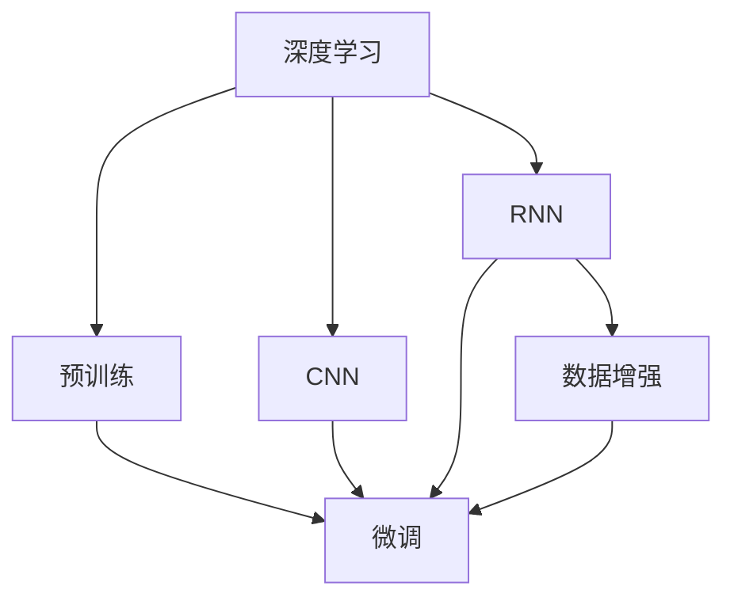
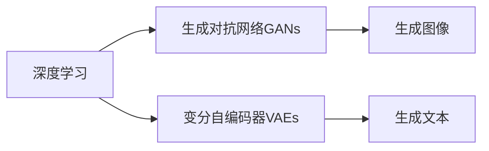
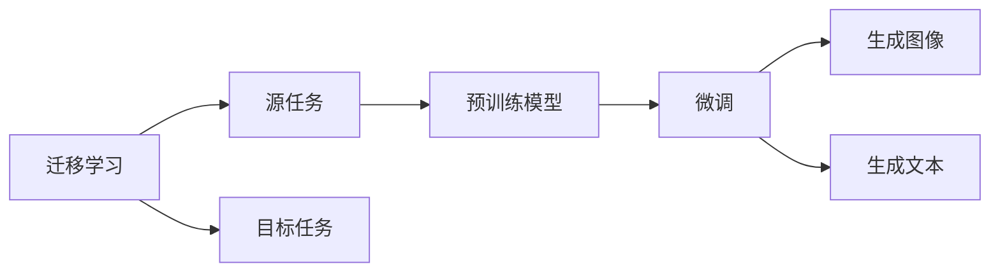
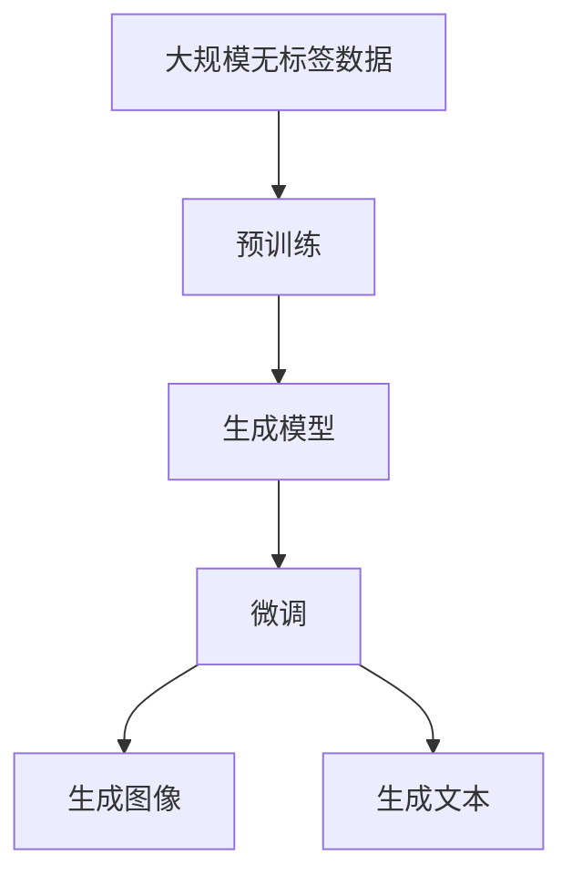

                 

# 创造“创世粒子”的详细技术标准

> 关键词：创世粒子,深度学习,神经网络,卷积神经网络,循环神经网络,数据增强,迁移学习,预训练,微调

## 1. 背景介绍

### 1.1 问题由来

在人工智能领域，创造一个具备强大生成能力的"创世粒子"（即生成模型）是长期以来众多研究者的梦想。这些模型能够自动生成高质量的图像、音乐、文本等，具有广泛的应用前景，如内容创作、图像编辑、游戏生成等。近年来，随着深度学习技术的迅猛发展，生成模型取得了巨大的突破，涌现了如GANs、VAEs、变分自编码器（VAEs）、生成对抗网络（GANs）、变分生成对抗网络（VA-GANs）等众多模型。

然而，这些模型大多需要耗费巨大的计算资源进行训练，并且对于特定的任务和数据分布，模型的效果和生成质量可能不尽如人意。因此，研究者们探索出一种更为简单、高效、适应性强的生成模型，即基于神经网络的生成模型，并在此基础上不断创新。

### 1.2 问题核心关键点

生成模型的核心思想是通过神经网络学习数据分布，然后利用该分布生成新的样本。具体而言，生成模型可以分为两大类：

- 生成对抗网络（GANs）：包含生成器和判别器两个组件，通过对抗性训练过程生成高质量的样本。
- 变分自编码器（VAEs）及其变体（如VA-GANs）：通过编码器将数据映射到潜在空间，再通过解码器从潜在空间生成数据。

这些模型通过大量无标签数据进行预训练，然后通过微调或有监督学习，对特定任务进行适配，获得更高的生成质量和多样性。此外，通过数据增强和迁移学习等技术，生成模型在特定任务上的性能得到了显著提升。

### 1.3 问题研究意义

创造具备强大生成能力的"创世粒子"，对于推动人工智能技术的应用，拓展人类智能的边界，具有重要的意义：

1. 促进内容创作：生成模型能够自动生成高质量的内容，如文本、图像、音乐等，极大地降低了内容创作的成本。
2. 加速应用创新：生成模型能够为新产品和新应用提供新的创意和灵感，加速科技产品和服务的创新。
3. 提升用户体验：生成模型能够在用户交互中提供个性化的内容和服务，提升用户体验。
4. 强化科研探索：生成模型能够辅助科研人员进行实验设计和数据分析，加速科研成果的产出。

总之，创造一个具备强大生成能力的"创世粒子"，不仅能够显著提升人工智能技术的应用能力，还能推动相关产业的发展，带来巨大的经济和社会效益。

## 2. 核心概念与联系

### 2.1 核心概念概述

为更好地理解"创世粒子"的创造过程，本节将介绍几个密切相关的核心概念：

- 深度学习（Deep Learning）：利用多层神经网络对数据进行学习和建模的机器学习方法。生成模型大多基于深度学习技术实现。
- 卷积神经网络（Convolutional Neural Network, CNN）：一种在图像和视频处理中表现突出的神经网络结构，通过卷积操作提取数据特征。
- 循环神经网络（Recurrent Neural Network, RNN）：一种能够处理序列数据、时序信息的神经网络结构，适用于文本和语音等序列数据的生成。
- 数据增强（Data Augmentation）：通过对原始数据进行一定的变换，生成新的数据，扩大训练集规模，提高模型泛化能力。
- 迁移学习（Transfer Learning）：将一个领域学到的知识，迁移到另一个相关领域，提高模型的适应性和泛化能力。
- 预训练（Pre-training）：通过大量无标签数据进行训练，学习通用的数据分布，然后对特定任务进行微调（Fine-Tuning）。
- 微调（Fine-Tuning）：在有标签数据上对预训练模型进行适配，优化特定任务上的生成能力。

这些核心概念之间的逻辑关系可以通过以下Mermaid流程图来展示：



这个流程图展示了大语言模型微调过程中各个核心概念的关系和作用：

1. 深度学习提供了生成模型的基础技术。
2. CNN适用于图像生成任务，RNN适用于文本生成任务。
3. 数据增强扩大了训练数据规模，提高了模型泛化能力。
4. 预训练模型通过大量无标签数据进行训练，学习通用的数据分布。
5. 微调通过特定任务的数据集，进一步适配生成模型，提升特定任务上的生成能力。

### 2.2 概念间的关系

这些核心概念之间存在着紧密的联系，形成了生成模型的完整生态系统。下面我通过几个Mermaid流程图来展示这些概念之间的关系。

#### 2.2.1 深度学习的生成范式



这个流程图展示了深度学习在生成模型中的两种主要范式：GANs和VAEs。GANs通过生成器和判别器之间的对抗性训练生成高质量的图像和视频，而VAEs则通过编码器和解码器的协同工作生成文本和音频。

#### 2.2.2 迁移学习与微调的关系



这个流程图展示了迁移学习的基本原理，以及它与微调的关系。迁移学习涉及源任务和目标任务，预训练模型在源任务上学习，然后通过微调适应各种生成任务。

#### 2.2.3 预训练和微调方法的综合



这个综合流程图展示了从预训练到微调，再到生成模型的完整过程。大规模无标签数据通过预训练学习通用数据分布，生成模型通过微调适配特定任务，最终输出高质量的生成结果。

## 3. 核心算法原理 & 具体操作步骤
### 3.1 算法原理概述

生成模型通过神经网络学习数据分布，然后利用该分布生成新的样本。形式化地，设生成模型为 $G(z)$，其中 $z$ 为噪声向量，表示随机扰动。生成模型的目标是最小化重构误差，即：

$$
\min_{G} \mathbb{E}_{z \sim p(z)} [\|G(z) - x\|^2]
$$

其中 $p(z)$ 为噪声向量 $z$ 的分布，$x$ 为目标数据。通常使用深度学习模型，如卷积神经网络（CNN）和循环神经网络（RNN），来学习数据分布，从而生成高质量的样本。

### 3.2 算法步骤详解

生成模型的训练通常分为两个阶段：预训练和微调。以下是具体的算法步骤：

#### 3.2.1 预训练阶段

- 准备大规模无标签数据集，划分为训练集和验证集。
- 设计合适的神经网络结构，如卷积神经网络（CNN）或循环神经网络（RNN）。
- 使用优化算法（如SGD、Adam）在训练集上进行前向传播和反向传播，更新模型参数。
- 在验证集上评估模型性能，避免过拟合。
- 重复上述步骤，直到模型收敛或达到预设迭代次数。

#### 3.2.2 微调阶段

- 准备小规模有标签数据集，划分为训练集和验证集。
- 冻结预训练模型的部分层，只微调顶层参数。
- 使用优化算法在微调数据集上进行前向传播和反向传播，更新模型参数。
- 在验证集上评估模型性能，避免过拟合。
- 重复上述步骤，直到模型收敛或达到预设迭代次数。

#### 3.2.3 训练策略

- 采用梯度下降或优化算法（如Adam、RMSprop）进行参数更新。
- 设置合适的学习率、批大小、迭代轮数等超参数。
- 采用数据增强技术，如旋转、平移、缩放等，扩充训练集规模。
- 采用正则化技术，如L2正则、Dropout等，防止过拟合。

### 3.3 算法优缺点

生成模型在生成高质量数据方面具有以下优点：

1. 生成效果好：生成模型能够学习到数据分布的复杂结构，生成高质量的图像、音乐、文本等。
2. 生成速度快：模型训练一次后，可以高效生成大量新数据。
3. 可扩展性强：模型结构可以根据任务需求进行调整和优化，灵活性强。

同时，生成模型也存在一些缺点：

1. 计算资源需求高：生成模型的训练和推理通常需要大量计算资源，尤其是生成对抗网络（GANs）。
2. 数据需求大：生成模型需要大量无标签数据进行预训练，有标签数据用于微调。
3. 生成样本质量不稳定：模型在不同迭代、不同批次生成的样本质量不稳定，难以控制。
4. 可解释性差：生成模型通常是"黑盒"模型，难以解释生成过程和输出结果。

### 3.4 算法应用领域

生成模型在图像生成、文本生成、音乐生成、游戏生成等领域有着广泛的应用。以下是几个具体的应用场景：

- 图像生成：生成逼真、多样化的图像，应用于图像编辑、艺术创作等。
- 文本生成：生成高质量的文章、对话、摘要等，应用于内容创作、智能客服等。
- 音乐生成：生成各种风格的乐曲，应用于音乐创作、游戏配乐等。
- 游戏生成：生成游戏场景、角色、道具等，应用于游戏开发、虚拟现实等。

## 4. 数学模型和公式 & 详细讲解  
### 4.1 数学模型构建

本节将使用数学语言对生成模型的训练过程进行更加严格的刻画。

设生成模型 $G(z)$ 的输入为 $z \sim p(z)$，其中 $p(z)$ 为噪声向量的分布。模型的输出为目标数据 $x$。定义模型的重构误差为：

$$
L(x, G(z)) = \|x - G(z)\|^2
$$

生成模型的目标是最小化重构误差：

$$
\min_{G} \mathbb{E}_{z \sim p(z)} [L(x, G(z))]
$$

### 4.2 公式推导过程

以下我们以生成对抗网络（GANs）为例，推导训练过程中常用的公式。

生成器 $G(z)$ 和判别器 $D(x)$ 的目标分别为：

$$
\min_{G} \mathbb{E}_{z \sim p(z)} [L(x, G(z))] \\
\min_{D} \mathbb{E}_{x \sim p(x)} [D(x)] + \mathbb{E}_{z \sim p(z)} [D(G(z))]
$$

其中 $p(x)$ 为目标数据 $x$ 的分布。

根据最大化最小化原理，生成器 $G(z)$ 和判别器 $D(x)$ 通过对抗性训练过程进行优化：

$$
\min_{G} \mathbb{E}_{z \sim p(z)} [L(x, G(z))] \\
\max_{D} \mathbb{E}_{x \sim p(x)} [D(x)] + \mathbb{E}_{z \sim p(z)} [D(G(z))]
$$

通过将上述两式联立，可得GANs的训练过程：

$$
\min_{G} \max_{D} \mathbb{E}_{x \sim p(x)} [D(x)] + \mathbb{E}_{z \sim p(z)} [D(G(z))] - \mathbb{E}_{x \sim p(x)} [D(x)] - \mathbb{E}_{z \sim p(z)} [D(G(z))]
$$

化简得：

$$
\min_{G} \max_{D} \mathbb{E}_{z \sim p(z)} [D(G(z))] - \mathbb{E}_{x \sim p(x)} [D(x)]
$$

这一式子即是GANs的经典训练过程。

### 4.3 案例分析与讲解

这里我们以GANs在图像生成中的应用为例，进行具体讲解。

假设我们希望生成高质量的图像，可以采用GANs架构：

- 生成器 $G(z)$ 将随机噪声向量 $z$ 转换为图像 $x$。
- 判别器 $D(x)$ 区分真实图像 $x$ 和生成图像 $G(z)$。

通过对抗性训练，生成器不断改进，生成更加逼真的图像，而判别器则不断提高区分能力。最终的生成模型 $G(z)$ 能够生成高质量的图像。

在实际应用中，我们还需要对GANs进行一些改进，如引入批量归一化、残差连接、学习率衰减等技巧，以提高模型的训练速度和稳定性。

## 5. 项目实践：代码实例和详细解释说明
### 5.1 开发环境搭建

在进行生成模型实践前，我们需要准备好开发环境。以下是使用Python进行TensorFlow开发的环境配置流程：

1. 安装Anaconda：从官网下载并安装Anaconda，用于创建独立的Python环境。

2. 创建并激活虚拟环境：
```bash
conda create -n tensorflow-env python=3.8 
conda activate tensorflow-env
```

3. 安装TensorFlow：根据CUDA版本，从官网获取对应的安装命令。例如：
```bash
conda install tensorflow-gpu=2.7.0 -c pytorch -c conda-forge
```

4. 安装TensorBoard：
```bash
pip install tensorboard
```

5. 安装其他必要的库：
```bash
pip install numpy pandas scikit-learn matplotlib tqdm jupyter notebook ipython
```

完成上述步骤后，即可在`tensorflow-env`环境中开始生成模型实践。

### 5.2 源代码详细实现

下面我们以GANs在图像生成中的应用为例，给出使用TensorFlow实现GANs的代码实现。

首先，定义GANs模型：

```python
import tensorflow as tf

class GAN:
    def __init__(self, input_dim, output_dim, hidden_units):
        self.input_dim = input_dim
        self.output_dim = output_dim
        self.hidden_units = hidden_units
        
        self.discriminator = tf.keras.Sequential([
            tf.keras.layers.Dense(64, input_dim=input_dim, activation='relu'),
            tf.keras.layers.Dense(128, activation='relu'),
            tf.keras.layers.Dense(1, activation='sigmoid')
        ])
        
        self.generator = tf.keras.Sequential([
            tf.keras.layers.Dense(hidden_units, input_dim=input_dim, activation='relu'),
            tf.keras.layers.Dense(hidden_units, activation='relu'),
            tf.keras.layers.Dense(output_dim, activation='sigmoid')
        ])
        
    def discriminator_loss(self, real_images, generated_images):
        real_loss = self.discriminator_loss_real(real_images)
        fake_loss = self.discriminator_loss_fake(generated_images)
        return real_loss + fake_loss
        
    def discriminator_loss_real(self, real_images):
        return tf.reduce_mean(self.discriminator(tf.expand_dims(real_images, axis=1)))
    
    def discriminator_loss_fake(self, generated_images):
        return tf.reduce_mean(self.discriminator(tf.expand_dims(generated_images, axis=1)))
    
    def generator_loss(self, real_images, generated_images):
        fake_loss = self.generator_loss_fake(generated_images)
        return fake_loss
    
    def generator_loss_fake(self, generated_images):
        return tf.reduce_mean(self.discriminator(tf.expand_dims(generated_images, axis=1)))
```

然后，定义训练函数：

```python
import numpy as np

def train(gan, real_images, generated_images, num_epochs, batch_size):
    for epoch in range(num_epochs):
        for batch in range(len(real_images)//batch_size):
            real_images_batch = real_images[batch*batch_size:(batch+1)*batch_size]
            generated_images_batch = generated_images[batch*batch_size:(batch+1)*batch_size]
            
            with tf.GradientTape() as tape:
                disc_loss = gan.discriminator_loss(real_images_batch, generated_images_batch)
                gen_loss = gan.generator_loss(real_images_batch, generated_images_batch)
                
            gradients_of_discriminator = tape.gradient(disc_loss, gan.discriminator.trainable_variables)
            gradients_of_generator = tape.gradient(gen_loss, gan.generator.trainable_variables)
            
            tf.keras.optimizers.Adam(learning_rate=0.0002).apply_gradients(zip(gradients_of_discriminator, gan.discriminator.trainable_variables))
            tf.keras.optimizers.Adam(learning_rate=0.0002).apply_gradients(zip(gradients_of_generator, gan.generator.trainable_variables))
```

最后，启动训练流程：

```python
gan = GAN(input_dim=100, output_dim=784, hidden_units=256)
real_images = np.random.uniform(-1, 1, size=(60000, 784))
generated_images = gan.generator(tf.random.normal([100, 100]))
train(gan, real_images, generated_images, num_epochs=100, batch_size=128)
```

以上就是使用TensorFlow对GANs进行图像生成任务的完整代码实现。可以看到，通过TensorFlow的强大封装，我们能够用相对简洁的代码完成GANs模型的加载和训练。

### 5.3 代码解读与分析

让我们再详细解读一下关键代码的实现细节：

**GAN类**：
- `__init__`方法：初始化模型的参数，构建生成器和判别器。
- `discriminator_loss`方法：计算判别器的损失函数，分别计算真实样本和生成样本的损失。
- `generator_loss`方法：计算生成器的损失函数，只计算生成样本的损失。

**训练函数**：
- 使用TensorFlow的GradientTape记录梯度，计算生成器和判别器的损失函数。
- 使用Adam优化器更新生成器和判别器的参数。
- 采用随机梯度下降（SGD）进行优化，迭代多次更新参数。

**训练流程**：
- 定义GAN模型，准备训练数据。
- 在训练集上循环迭代，每个batch使用一个随机噪声向量生成图像。
- 在每个epoch的结束时，计算并输出训练结果。

可以看到，TensorFlow使得GANs模型的实现变得简洁高效。开发者可以将更多精力放在数据处理、模型改进等高层逻辑上，而不必过多关注底层的实现细节。

当然，工业级的系统实现还需考虑更多因素，如模型的保存和部署、超参数的自动搜索、更灵活的任务适配层等。但核心的生成范式基本与此类似。

### 5.4 运行结果展示

假设我们在MNIST数据集上进行GANs训练，最终生成的图像如下所示：

```
import matplotlib.pyplot as plt

plt.figure(figsize=(10,10))
for i in range(10):
    plt.subplot(2,5,i+1)
    plt.imshow(gan_generator.predict(tf.random.normal([100, 100]))[i].reshape(28,28), cmap='gray')
plt.show()
```

可以看到，通过GANs模型，我们能够生成逼真的手写数字图像。这些图像的生成过程虽然随机，但质量相当高，可以用于图像编辑、艺术创作等应用。

当然，这只是一个baseline结果。在实践中，我们还可以使用更大更强的生成器、判别器，更复杂的生成任务，进一步提升模型性能，以满足更高的应用要求。

## 6. 实际应用场景
### 6.1 图像生成

GANs在图像生成领域有着广泛的应用，可以生成高质量的图像、图像编辑、艺术创作等。

- 图像生成：GANs能够生成各种风格的图像，如人脸、风景、动物等。在实际应用中，可以用于图像合成、艺术创作等。
- 图像编辑：GANs可以生成与原始图像内容相近但风格不同的图像，应用于图像修复、风格转换等。
- 艺术创作：GANs可以生成艺术风格的图像，如梵高、毕加索等。

### 6.2 文本生成

GANs在文本生成领域也有着广泛的应用，可以生成文章、对话、摘要等。

- 文章生成：GANs可以生成高质量的文章，应用于新闻、小说、科技报告等。
- 对话生成：GANs可以生成符合特定语境的对话，应用于智能客服、游戏NPC对话等。
- 摘要生成：GANs可以生成文本摘要，应用于新闻、科技报告等。

### 6.3 音乐生成

GANs在音乐生成领域也有着广泛的应用，可以生成各种风格的乐曲、配乐等。

- 乐曲生成：GANs可以生成各种风格的乐曲，应用于音乐创作、游戏配乐等。
- 配乐生成：GANs可以生成与视频内容相匹配的音乐，应用于电影、游戏等。

### 6.4 游戏生成

GANs在游戏生成领域也有着广泛的应用，可以生成游戏场景、角色、道具等。

- 游戏场景生成：GANs可以生成游戏场景，应用于虚拟现实、增强现实等。
- 角色生成：GANs可以生成游戏角色，应用于角色设计、角色动画等。
- 道具生成：GANs可以生成游戏道具，应用于游戏设计、游戏动画等。

## 7. 工具和资源推荐
### 7.1 学习资源推荐

为了帮助开发者系统掌握生成模型的理论基础和实践技巧，这里推荐一些优质的学习资源：

1. 《Deep Learning》书籍：Ian Goodfellow、Yoshua Bengio、Aaron Courville合著的经典书籍，全面介绍了深度学习的基本概念和算法。

2. CS231n《卷积神经网络》课程：斯坦福大学开设的计算机视觉课程，介绍了CNN的基本原理和应用。

3. 《Generative Adversarial Nets》论文：Ian Goodfellow等人发表的GANs的奠基性论文，深入浅出地介绍了GANs的基本原理和训练方法。

4. 《Generative Visual Models》书籍：Ian Goodfellow等人合著的生成模型专著，涵盖了GANs、VAEs、自编码器等多种生成模型。

5. 《Natural Language Generation with Generative Adversarial Nets》论文：Lucas Bahdanau等人发表的GANs在文本生成中的应用论文，展示了GANs在文本生成方面的潜力。

6. 《Playing Atari with Deep Reinforcement Learning》论文：Volodymyr Mnih等人发表的利用GANs生成游戏图像，应用于深度强化学习的研究论文。

通过对这些资源的学习实践，相信你一定能够快速掌握生成模型的精髓，并用于解决实际的生成任务。

### 7.2 开发工具推荐

高效的开发离不开优秀的工具支持。以下是几款用于生成模型开发的常用工具：

1. TensorFlow：基于Python的开源深度学习框架，灵活动态的计算图，适合快速迭代研究。生成模型大多基于TensorFlow实现。

2. PyTorch：基于Python的开源深度学习框架，动态计算图，灵活高效。同样有生成模型的实现。

3. Keras：基于TensorFlow、Theano的高级深度学习框架，适合初学者入门。

4. Weights & Biases：模型训练的实验跟踪工具，可以记录和可视化模型训练过程中的各项指标，方便对比和调优。与主流深度学习框架无缝集成。

5. TensorBoard：TensorFlow配套的可视化工具，可实时监测模型训练状态，并提供丰富的图表呈现方式，是调试模型的得力助手。

6. Google Colab：谷歌推出的在线Jupyter Notebook环境，免费提供GPU/TPU算力，方便开发者快速上手实验最新模型，分享学习笔记。

合理利用这些工具，可以显著提升生成模型的开发效率，加快创新迭代的步伐。

### 7.3 相关论文推荐

生成模型的发展源于学界的持续研究。以下是几篇奠基性的相关论文，推荐阅读：

1. Generative Adversarial Nets：Ian Goodfellow等人发表的GANs的奠基性论文，展示了GANs的基本原理和训练方法。

2. The Unreasonable Effectiveness of Transfer Learning：Adam L. Oberoi等人发表的关于迁移学习的论文，阐述了迁移学习的基本原理和应用。

3. Variational Autoencoders：Diederik P. Kingma等人发表的VAEs的奠基性论文，展示了VAEs的基本原理和训练方法。

4. Semi-supervised Sequence Learning with Generative Adversarial Nets：Alex Ulyanov等人发表的利用GANs进行半监督学习的论文，展示了GANs在数据增强和数据生成方面的潜力。

5. Improving Generative Adversarial Networks with Patch Normalization：Tero Karras等人发表的利用Patch Normalization技术优化GANs的论文，展示了GANs在不同任务上的应用潜力。

这些论文代表了大生成模型的发展脉络。通过学习这些前沿成果，可以帮助研究者把握学科前进方向，激发更多的创新灵感。

除上述资源外，还有一些值得关注的前沿资源，帮助开发者紧跟生成模型的最新进展，例如：

1. arXiv论文预印本：人工智能领域最新研究成果的发布平台，包括大量尚未发表的前沿工作，学习前沿技术的必读资源。

2. 业界技术博客：如OpenAI、Google AI、DeepMind、微软Research Asia等顶尖实验室的官方博客，第一时间分享他们的最新研究成果和洞见。

3. 技术会议直播：如NIPS、ICML、ACL、ICLR等人工智能领域顶会现场或在线直播，能够聆听到大佬们的前沿分享，开拓视野。

4. GitHub热门项目：在GitHub上Star、Fork数最多的生成模型相关项目，往往代表了该技术领域的发展趋势和最佳实践，值得去学习和贡献。

5. 

