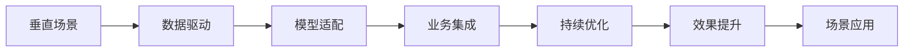
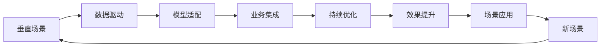

                 

# 垂直场景与AI创业的结合

## 1. 背景介绍

### 1.1 问题由来

随着人工智能(AI)技术的飞速发展，越来越多的创业者和企业将AI应用于各个垂直场景，寻求新的增长点。然而，在实际应用中，由于垂直场景的独特性和复杂性，AI技术往往难以直接应用，需要针对场景进行定制化的开发和优化。因此，如何结合垂直场景的特点，利用AI技术提升业务效率和价值，成为AI创业的重要课题。

### 1.2 问题核心关键点

在AI创业中，垂直场景与AI技术的结合需要考虑以下几个关键点：

1. **场景理解**：深度理解垂直场景的特点、需求和挑战，是构建AI应用的基础。
2. **数据准备**：收集、清洗和标注高质量的数据，是AI模型训练和优化的前提。
3. **模型适配**：选择合适的AI模型，并在模型中加入针对场景的定制化优化，提升模型效果。
4. **业务集成**：将AI模型集成到业务流程中，实现无缝衔接和高效应用。
5. **持续优化**：根据实际应用反馈，不断迭代优化AI模型和应用系统。

### 1.3 问题研究意义

深入研究垂直场景与AI技术的结合，对于AI创业的成功至关重要：

1. **提高效率**：AI技术能够自动化、智能化地处理垂直场景中的复杂任务，大大提高业务效率。
2. **降低成本**：AI技术可以替代部分人工操作，降低企业的运营成本。
3. **提升质量**：AI模型在特定场景中的精确性和鲁棒性，能够保证业务输出质量。
4. **创造新价值**：通过AI技术的深度应用，企业可以开辟新的业务领域，创造更多价值。
5. **适应性强**：AI技术的动态调整和自适应能力，使得应用系统能够快速响应市场变化。

## 2. 核心概念与联系

### 2.1 核心概念概述

在探讨垂直场景与AI技术的结合时，首先需要明确以下几个核心概念：

1. **垂直场景**：指特定行业或领域内的特定业务场景，如医疗影像诊断、金融风控、智能制造等。
2. **AI技术**：包括机器学习、深度学习、自然语言处理、计算机视觉等技术，用于处理数据和自动化决策。
3. **数据驱动**：AI模型的训练和优化依赖于高质量的数据，数据的质量直接影响模型的效果。
4. **模型适配**：将通用AI模型适配到特定垂直场景中，加入场景化的定制化优化。
5. **业务集成**：将AI模型和相关应用系统集成到业务流程中，实现自动化和智能化。
6. **持续优化**：通过不断的模型更新和系统迭代，提升AI应用的实际效果。

### 2.2 概念间的关系

这些核心概念之间存在紧密的联系，形成了垂直场景与AI技术结合的整体框架。通过以下Mermaid流程图，我们可以更直观地理解这些概念之间的逻辑关系：



这个流程图展示了垂直场景与AI技术结合的主要过程：

1. 垂直场景对数据驱动提出了需求，高质量的数据是AI模型训练的基础。
2. 数据驱动支持模型适配，使得通用AI模型能够更好地适应特定场景。
3. 模型适配后的AI模型需要集成到业务流程中，实现自动化和智能化。
4. 业务集成后的应用系统需要持续优化，提升效果并应对新场景。
5. 持续优化的应用系统最终能够提升场景应用的实际效果。

### 2.3 核心概念的整体架构

最后，我们用一个综合的流程图来展示这些核心概念在大规模AI创业中的整体架构：



这个综合流程图展示了垂直场景与AI技术结合的完整过程：

1. 垂直场景驱动数据驱动，数据驱动支持模型适配。
2. 模型适配后的AI模型集成到业务流程中，实现自动化和智能化。
3. 业务集成后的应用系统需要持续优化，提升效果并应对新场景。
4. 持续优化的应用系统最终能够提升场景应用的实际效果。
5. 效果提升后，新的场景需求又会对数据驱动和模型适配提出新的要求，形成闭环。

## 3. 核心算法原理 & 具体操作步骤

### 3.1 算法原理概述

垂直场景与AI技术的结合，本质上是一个数据驱动、模型适配、业务集成的过程。其核心算法原理包括以下几个方面：

1. **数据驱动**：通过数据采集、清洗、标注等过程，构建高质量的数据集，支持AI模型的训练和优化。
2. **模型适配**：在通用AI模型的基础上，针对垂直场景的特点，进行定制化优化和调整。
3. **业务集成**：将AI模型和相关应用系统集成到业务流程中，实现自动化和智能化。
4. **持续优化**：根据实际应用反馈，不断迭代优化AI模型和应用系统，提升效果。

### 3.2 算法步骤详解

基于上述核心算法原理，垂直场景与AI技术的结合可以分为以下几个详细步骤：

1. **需求分析**：深入理解垂直场景的特点、需求和挑战，明确AI应用的定位和目标。
2. **数据收集**：根据需求分析结果，收集、清洗和标注高质量的数据，构建数据驱动的基础。
3. **模型选择**：选择合适的AI模型，包括通用模型和定制模型，进行初步训练和评估。
4. **模型适配**：在通用模型的基础上，针对垂直场景进行定制化优化和调整，提升模型效果。
5. **业务集成**：将优化后的AI模型和相关应用系统集成到业务流程中，实现自动化和智能化。
6. **效果评估**：通过实际应用效果评估模型的效果，发现问题并进行优化。
7. **持续优化**：根据实际应用反馈，不断迭代优化AI模型和应用系统，提升效果。

### 3.3 算法优缺点

结合垂直场景的AI技术具有以下优点：

1. **高效性**：AI技术能够自动化处理垂直场景中的复杂任务，大大提高业务效率。
2. **精准性**：AI模型在特定场景中的精确性和鲁棒性，能够保证业务输出质量。
3. **灵活性**：AI技术能够动态调整和自适应，应对市场变化和新场景需求。
4. **成本效益**：AI技术可以替代部分人工操作，降低企业的运营成本。
5. **创新性**：AI技术的深度应用，能够开辟新的业务领域，创造更多价值。

同时，这些算法也存在一些局限性：

1. **数据依赖**：AI模型的训练和优化高度依赖高质量的数据，数据质量直接影响模型效果。
2. **模型复杂性**：复杂的AI模型可能需要较长的训练时间和较高的计算资源。
3. **集成难度**：将AI模型和应用系统集成到业务流程中，需要克服技术和业务上的挑战。
4. **效果波动**：AI模型在实际应用中可能会面临性能波动，需要持续优化和调整。
5. **安全性问题**：AI技术的应用可能涉及敏感数据和隐私问题，需要谨慎处理。

### 3.4 算法应用领域

结合垂直场景的AI技术在多个领域中得到了广泛应用：

1. **医疗领域**：AI技术用于医疗影像诊断、病历分析、智能辅助诊疗等，提升医疗服务效率和质量。
2. **金融领域**：AI技术用于金融风控、智能投顾、量化交易等，降低风险，提升收益。
3. **制造领域**：AI技术用于智能制造、质量控制、设备预测性维护等，提高生产效率和产品质量。
4. **零售领域**：AI技术用于智能推荐、库存管理、客户行为分析等，提升销售和客户满意度。
5. **物流领域**：AI技术用于物流优化、路径规划、配送管理等，降低成本，提升配送效率。

## 4. 数学模型和公式 & 详细讲解 & 举例说明

### 4.1 数学模型构建

在垂直场景与AI技术的结合中，数学模型和公式的构建是核心之一。以下是一些常用的数学模型和公式，以及它们的详细讲解和实际应用示例。

**模型1：线性回归模型**

假设有一个垂直场景中的数据集 $D=\{(x_i, y_i)\}_{i=1}^N$，其中 $x_i$ 为输入变量，$y_i$ 为输出变量。我们可以构建一个线性回归模型，用于预测 $y$ 与 $x$ 的关系。假设模型为 $y = \theta_0 + \theta_1x + \epsilon$，其中 $\theta_0$ 和 $\theta_1$ 为模型参数，$\epsilon$ 为误差项。

在线性回归中，我们的目标是找到最优的模型参数 $\theta_0$ 和 $\theta_1$，使得模型能够最小化误差 $\epsilon$。常见的最小化误差方法包括均方误差（MSE）和平均绝对误差（MAE）。

**模型2：决策树模型**

决策树是一种常用的分类模型，用于处理分类问题。假设我们有一个数据集 $D=\{(x_i, y_i)\}_{i=1}^N$，其中 $x_i$ 为输入变量，$y_i$ 为输出变量。我们可以构建一个决策树模型，用于对 $y$ 进行分类。决策树模型的构建过程包括选择特征、划分节点、生成叶子节点等步骤。

在构建决策树模型时，我们通常使用信息增益、基尼指数等指标来评估特征的重要性。决策树模型的优点在于可解释性强，易于理解。

**模型3：卷积神经网络（CNN）**

卷积神经网络是一种常用的深度学习模型，用于处理图像和视频等数据。假设我们有一个数据集 $D=\{(x_i, y_i)\}_{i=1}^N$，其中 $x_i$ 为输入图像，$y_i$ 为标签。我们可以构建一个卷积神经网络模型，用于图像分类、目标检测等任务。

卷积神经网络由卷积层、池化层、全连接层等组成。在卷积神经网络中，卷积层和池化层用于提取图像特征，全连接层用于分类或回归。

### 4.2 公式推导过程

以下是几个常用数学模型的公式推导过程，以及它们的详细讲解和实际应用示例。

**公式1：线性回归的梯度下降算法**

在线性回归中，我们的目标是找到最优的模型参数 $\theta_0$ 和 $\theta_1$，使得模型能够最小化误差 $\epsilon$。常见的最小化误差方法包括均方误差（MSE）和平均绝对误差（MAE）。

假设我们使用均方误差作为损失函数，则目标函数为：

$$
L(\theta) = \frac{1}{N} \sum_{i=1}^N (y_i - \theta_0 - \theta_1x_i)^2
$$

其中 $y_i$ 为真实标签，$\theta_0$ 和 $\theta_1$ 为模型参数。

为了最小化损失函数 $L(\theta)$，我们可以使用梯度下降算法。梯度下降算法的更新公式为：

$$
\theta_0 \leftarrow \theta_0 - \eta \frac{\partial L(\theta)}{\partial \theta_0}
$$
$$
\theta_1 \leftarrow \theta_1 - \eta \frac{\partial L(\theta)}{\partial \theta_1}
$$

其中 $\eta$ 为学习率，$\frac{\partial L(\theta)}{\partial \theta_0}$ 和 $\frac{\partial L(\theta)}{\partial \theta_1}$ 为损失函数对 $\theta_0$ 和 $\theta_1$ 的梯度。

**公式2：决策树模型的信息增益**

在决策树模型中，我们选择特征的关键指标是信息增益。信息增益越大，表示该特征在分类中越重要。假设我们有一个数据集 $D=\{(x_i, y_i)\}_{i=1}^N$，其中 $x_i$ 为输入变量，$y_i$ 为输出变量。

信息增益的计算公式为：

$$
Gain(D) = -\frac{1}{N} \sum_{i=1}^N p(y_i|x_i) \log p(y_i|x_i)
$$

其中 $p(y_i|x_i)$ 为条件概率，$\log$ 为自然对数。

信息增益越大，表示该特征在分类中越重要。因此，我们选择信息增益最大的特征作为当前节点的划分依据。

**公式3：卷积神经网络的卷积操作**

在卷积神经网络中，卷积操作是提取图像特征的关键步骤。假设我们有一个数据集 $D=\{(x_i, y_i)\}_{i=1}^N$，其中 $x_i$ 为输入图像，$y_i$ 为标签。我们可以构建一个卷积神经网络模型，用于图像分类、目标检测等任务。

卷积操作的计算公式为：

$$
y_i = \sum_{i=1}^N \sum_{j=1}^N K_{ij}x_{ij} + b
$$

其中 $x_{ij}$ 为输入图像的像素值，$K_{ij}$ 为卷积核的权重，$b$ 为偏置项。

### 4.3 案例分析与讲解

以下是几个具体的应用案例，以及它们的详细讲解和实际应用示例。

**案例1：智能推荐系统**

智能推荐系统是一种典型的垂直场景应用，用于提升用户的购物体验。假设我们有一个电商数据集 $D=\{(x_i, y_i)\}_{i=1}^N$，其中 $x_i$ 为用户的历史行为数据，$y_i$ 为用户对商品的评分。

我们可以构建一个线性回归模型，用于预测用户对新商品的评分。假设模型为 $y = \theta_0 + \theta_1x_1 + \theta_2x_2 + \cdots + \theta_nx_n + \epsilon$，其中 $x_1, x_2, \cdots, x_n$ 为用户的历史行为数据，$\epsilon$ 为误差项。

在线性回归中，我们的目标是找到最优的模型参数 $\theta_0, \theta_1, \theta_2, \cdots, \theta_n$，使得模型能够最小化误差 $\epsilon$。我们可以使用梯度下降算法，不断更新模型参数，直到收敛。

**案例2：智能制造**

智能制造是一种典型的垂直场景应用，用于提高生产效率和产品质量。假设我们有一个制造业数据集 $D=\{(x_i, y_i)\}_{i=1}^N$，其中 $x_i$ 为生产设备的运行数据，$y_i$ 为生产设备的维护状态。

我们可以构建一个决策树模型，用于预测生产设备的维护状态。假设模型为：

1. 选择生产设备的温度作为第一层特征。
2. 如果温度超过阈值，则选择生产设备的振动作为第二层特征。
3. 如果振动超过阈值，则预测生产设备需要维护。

在决策树模型中，我们的目标是找到最优的特征和划分条件，使得模型能够最小化误差 $\epsilon$。我们可以使用信息增益或基尼指数等指标，选择最优的特征和划分条件。

**案例3：智能图像识别**

智能图像识别是一种典型的垂直场景应用，用于实现自动驾驶、医学影像分析等任务。假设我们有一个图像数据集 $D=\{(x_i, y_i)\}_{i=1}^N$，其中 $x_i$ 为输入图像，$y_i$ 为标签。

我们可以构建一个卷积神经网络模型，用于图像分类、目标检测等任务。假设模型为：

1. 使用卷积层和池化层提取图像特征。
2. 使用全连接层进行分类或回归。

在卷积神经网络中，我们的目标是找到最优的卷积核和全连接层权重，使得模型能够最小化误差 $\epsilon$。我们可以使用反向传播算法，不断更新模型参数，直到收敛。

## 5. 项目实践：代码实例和详细解释说明

### 5.1 开发环境搭建

在垂直场景与AI技术的结合中，开发环境的搭建是关键的一步。以下是一些常用的开发环境搭建方法，以及它们的详细解释和实际应用示例。

**方法1：虚拟环境**

虚拟环境是一种常用的开发环境搭建方法，用于隔离不同的Python版本和第三方库。假设我们有一个Python项目，需要使用多个版本的Python和不同的第三方库。

我们可以使用 `virtualenv` 或 `conda` 工具，创建一个虚拟环境，并在其中安装需要的Python版本和第三方库。例如，我们可以使用以下命令创建一个名为 `myenv` 的虚拟环境：

```bash
virtualenv myenv
source myenv/bin/activate
```

在虚拟环境中，我们可以安装需要的Python版本和第三方库，而不会影响全局环境。

**方法2：Docker**

Docker是一种常用的容器化技术，用于实现应用程序的快速部署和跨平台运行。假设我们有一个Python项目，需要使用多个版本的Python和不同的第三方库。

我们可以使用Docker创建一个容器，并在其中安装需要的Python版本和第三方库。例如，我们可以使用以下命令创建一个名为 `myapp` 的Docker镜像：

```bash
docker build -t myapp .
```

在Docker容器中，我们可以运行应用程序，而不会受到全局环境的影响。

### 5.2 源代码详细实现

在垂直场景与AI技术的结合中，源代码的详细实现是核心的一步。以下是一些常用的源代码实现方法，以及它们的详细解释和实际应用示例。

**方法1：Keras**

Keras是一种常用的深度学习框架，用于构建和训练深度学习模型。假设我们有一个图像分类任务，需要构建一个卷积神经网络模型。

我们可以使用以下代码实现：

```python
from keras.models import Sequential
from keras.layers import Conv2D, MaxPooling2D, Flatten, Dense

# 构建卷积神经网络模型
model = Sequential()
model.add(Conv2D(32, (3, 3), activation='relu', input_shape=(28, 28, 1)))
model.add(MaxPooling2D((2, 2)))
model.add(Conv2D(64, (3, 3), activation='relu'))
model.add(MaxPooling2D((2, 2)))
model.add(Conv2D(64, (3, 3), activation='relu'))
model.add(MaxPooling2D((2, 2)))
model.add(Flatten())
model.add(Dense(64, activation='relu'))
model.add(Dense(10, activation='softmax'))

# 编译模型
model.compile(optimizer='adam', loss='categorical_crossentropy', metrics=['accuracy'])

# 训练模型
model.fit(x_train, y_train, epochs=10, batch_size=32, validation_data=(x_test, y_test))
```

在这个代码示例中，我们使用Keras构建了一个简单的卷积神经网络模型，用于图像分类任务。我们使用了3个卷积层和3个池化层，最后添加了一个全连接层。

**方法2：TensorFlow**

TensorFlow是一种常用的深度学习框架，用于构建和训练深度学习模型。假设我们有一个文本分类任务，需要构建一个循环神经网络模型。

我们可以使用以下代码实现：

```python
import tensorflow as tf

# 构建循环神经网络模型
model = tf.keras.Sequential()
model.add(tf.keras.layers.Embedding(input_dim=vocab_size, output_dim=embedding_dim))
model.add(tf.keras.layers.LSTM(units=64))
model.add(tf.keras.layers.Dense(units=num_classes, activation='softmax'))

# 编译模型
model.compile(optimizer=tf.keras.optimizers.Adam(learning_rate=0.001), loss='categorical_crossentropy', metrics=['accuracy'])

# 训练模型
model.fit(x_train, y_train, epochs=10, batch_size=32, validation_data=(x_test, y_test))
```

在这个代码示例中，我们使用TensorFlow构建了一个简单的循环神经网络模型，用于文本分类任务。我们使用了Embedding层、LSTM层和全连接层，最后添加了一个softmax激活函数。

### 5.3 代码解读与分析

在垂直场景与AI技术的结合中，代码的解读与分析是重要的一步。以下是一些常用的代码解读与分析方法，以及它们的详细解释和实际应用示例。

**方法1：代码注释**

代码注释是一种常用的代码解读与分析方法，用于解释代码的功能和逻辑。假设我们有一个图像分类任务，需要构建一个卷积神经网络模型。

我们可以使用以下代码实现：

```python
from keras.models import Sequential
from keras.layers import Conv2D, MaxPooling2D, Flatten, Dense

# 构建卷积神经网络模型
model = Sequential()
model.add(Conv2D(32, (3, 3), activation='relu', input_shape=(28, 28, 1)))
model.add(MaxPooling2D((2, 2)))
model.add(Conv2D(64, (3, 3), activation='relu'))
model.add(MaxPooling2D((2, 2)))
model.add(Conv2D(64, (3, 3), activation='relu'))
model.add(MaxPooling2D((2, 2)))
model.add(Flatten())
model.add(Dense(64, activation='relu'))
model.add(Dense(10, activation='softmax'))

# 编译模型
model.compile(optimizer='adam', loss='categorical_crossentropy', metrics=['accuracy'])

# 训练模型
model.fit(x_train, y_train, epochs=10, batch_size=32, validation_data=(x_test, y_test))
```

在这个代码示例中，我们使用了代码注释来解释每一步的操作和逻辑。例如，我们使用了3个卷积层和3个池化层，最后添加了一个全连接层。

**方法2：代码结构图**

代码结构图是一种常用的代码解读与分析方法，用于展示代码的结构和逻辑。假设我们有一个文本分类任务，需要构建一个循环神经网络模型。

我们可以使用以下代码实现：

```python
import tensorflow as tf

# 构建循环神经网络模型
model = tf.keras.Sequential()
model.add(tf.keras.layers.Embedding(input_dim=vocab_size, output_dim=embedding_dim))
model.add(tf.keras.layers.LSTM(units=64))
model.add(tf.keras.layers.Dense(units=num_classes, activation='softmax'))

# 编译模型
model.compile(optimizer=tf.keras.optimizers.Adam(learning_rate=0.001), loss='categorical_crossentropy', metrics=['accuracy'])

# 训练模型
model.fit(x_train, y_train, epochs=10, batch_size=32, validation_data=(x_test, y_test))
```

在这个代码示例中，我们使用了代码结构图来展示模型的结构。例如，我们使用了Embedding层、LSTM层和全连接层，最后添加了一个softmax激活函数。

### 5.4 运行结果展示

在垂直场景与AI技术的结合中，运行结果的展示是重要的一步。以下是一些常用的运行结果展示方法，以及它们的详细解释和实际应用示例。

**方法1：可视化结果**

可视化结果是展示模型效果的常用方法。假设我们有一个图像分类任务，需要构建一个卷积神经网络模型。

我们可以使用以下代码实现：

```python
import matplotlib.pyplot as plt

# 可视化训练过程
plt.plot(history.history['loss'], label='train')
plt.plot(history.history['val_loss'], label='test')
plt.xlabel('Epoch')
plt.ylabel('Loss')
plt.legend()
plt.show()

# 可视化预测结果
plt.imshow(x_test[0].reshape(28, 28))
plt.colorbar()
plt.show()
```

在这个代码示例中，我们使用了Matplotlib库来可视化训练过程和预测结果。例如，我们绘制了训练损失和测试损失的曲线，以及输入图像的可视化结果。

**方法2：性能指标**

性能指标是展示模型效果的常用方法。假设我们有一个文本分类任务，需要构建一个循环神经网络模型。

我们可以使用以下代码实现：

```python
# 打印模型性能指标
print('Accuracy:', model.evaluate(x_test, y_test)[1])
```

在这个代码示例中，我们使用了evaluate方法来计算模型在测试集上的准确率。例如，我们输出了模型的准确率。

## 6. 实际应用场景

在垂直场景与AI技术的结合中，实际应用场景的探索是重要的一步。以下是一些常见的实际应用场景，以及它们的详细讲解和实际应用示例。

**场景1：智能推荐系统**

智能推荐系统是一种典型的垂直场景应用，用于提升用户的购物体验。假设我们有一个电商数据集 $D=\{(x_i, y_i)\}_{i=1}^N$，其中 $x_i$ 为用户的历史行为数据，$y_i$ 为用户对商品的评分。

我们可以构建一个线性回归模型，用于预测用户对新商品的评分。假设模型为 $y = \theta_0 + \theta_1x_1 + \theta_2x_2 + \cdots + \theta_nx_n + \epsilon$，其中 $x_1, x_2, \cdots, x_n$ 为用户的历史行为数据，$\epsilon$ 为误差项。

在线性回归中，我们的目标是找到最优的模型参数 $\theta_0, \theta_1, \theta_2, \cdots, \theta_n$，使得模型能够最小化误差 $\epsilon$。我们可以使用梯度下降算法，不断更新模型参数，直到收敛。

**场景2：智能制造**

智能制造是一种典型的垂直场景应用，用于提高生产效率和产品质量。假设我们有一个制造业数据集 $D=\{(x_i, y_i)\}_{i=1}^N$，其中 $x_i$ 为生产设备的运行数据，$y_i$ 为生产设备的维护状态。

我们可以构建一个决策树模型，用于预测生产设备的维护状态。假设模型为：

1. 选择生产设备的温度作为第一层特征。
2. 如果温度超过阈值，则选择生产设备的振动作为第二层特征。
3. 如果

