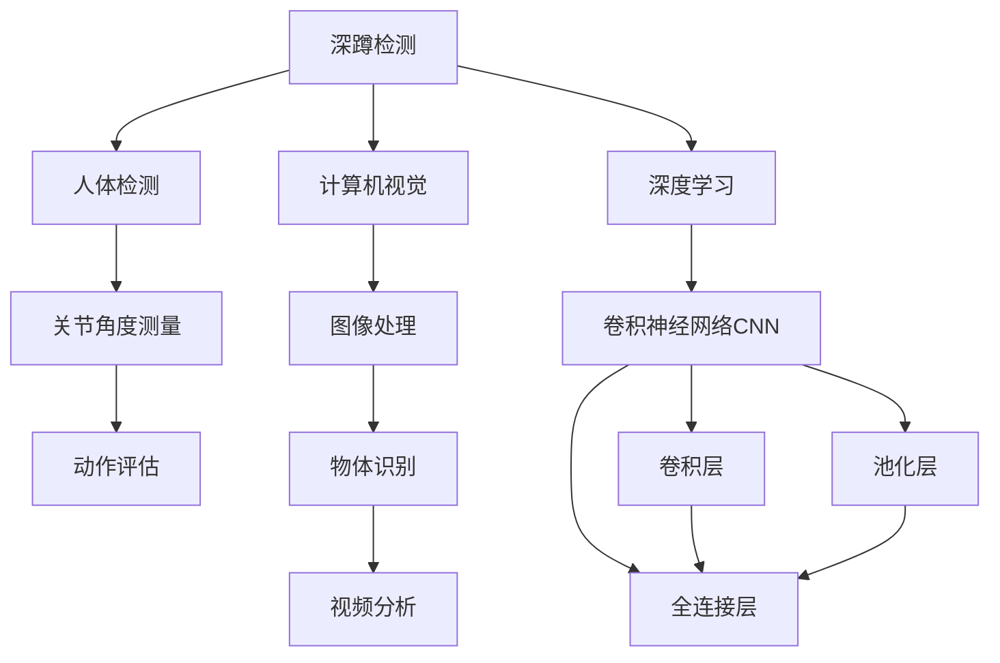
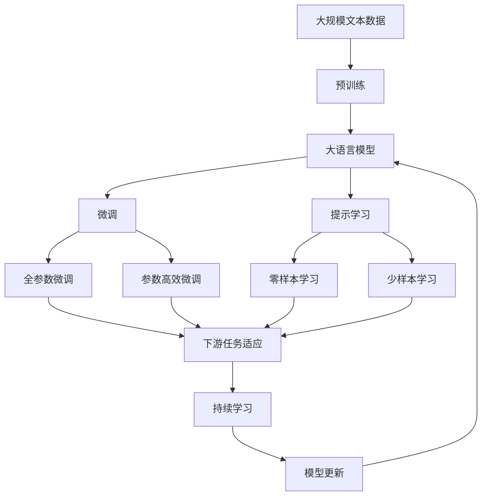

                 

# 基于OpenCV和Tensorflow的深蹲检测系统详细设计与具体代码实现

> 关键词：深蹲检测,OpenCV,Python,Computer Vision,Deep Learning,Deep Neural Network,Image Processing,Computer Vision Projects

## 1. 背景介绍

### 1.1 问题由来
随着人们生活水平的提高，身体健康成为了人们越来越重视的话题。健身成为了很多人保持健康的重要方式。深蹲是一种常见的健身运动，它可以锻炼大腿肌肉群、臀部和核心力量。但是，不当的深蹲姿势容易对膝盖、腰部造成损伤。因此，如何进行深蹲检测，确保健身者采用正确的深蹲姿势，成为近年来计算机视觉领域的一个重要研究课题。

### 1.2 问题核心关键点
本项目主要关注如何通过计算机视觉技术，自动检测视频中健身者的深蹲姿势是否正确。核心关键点包括：
- 如何构建一个高效准确的深蹲检测模型。
- 如何处理视频中不同角度、不同背景下的深蹲视频。
- 如何在模型训练和测试时，避免过拟合或欠拟合。
- 如何实现实时深蹲检测，提高用户体验。

### 1.3 问题研究意义
本项目研究深蹲检测的计算机视觉方法，可以应用于健身中心、家庭健身设备、运动追踪器等场景，帮助用户实时检测深蹲姿势，提升健身效果，同时避免受伤风险。这对提升人类健康水平，推广健康生活方式，具有重要意义。

## 2. 核心概念与联系

### 2.1 核心概念概述

本节将介绍几个密切相关的核心概念，包括深蹲检测、计算机视觉、深度学习等。

#### 2.1.1 深蹲检测
深蹲检测是指通过计算机视觉技术，自动识别视频中的健身者是否在执行正确的深蹲动作。具体包括三个关键步骤：
1. 人体检测：识别视频中的关键人体部位，如头部、肩膀、臀部、膝盖等。
2. 关节角度测量：通过三角测量等方法，测量关节的角度是否在正常范围内。
3. 动作评估：根据关节角度测量结果，评估深蹲动作是否正确。

#### 2.1.2 计算机视觉
计算机视觉是指使用计算机和视觉系统来模拟人类视觉功能的技术。主要涉及图像处理、物体识别、视频分析等领域。

#### 2.1.3 深度学习
深度学习是一种基于神经网络的机器学习技术，通过多层次的非线性变换，从原始数据中自动学习特征表示，实现高效的图像分类、目标检测等任务。

### 2.2 概念间的关系

这些核心概念之间的联系可以以下合成的Mermaid流程图表示：



这个流程图展示了深蹲检测与计算机视觉和深度学习的内在联系。首先，深蹲检测需要依赖人体检测、关节角度测量和动作评估等计算机视觉技术；其次，深度学习，特别是卷积神经网络（CNN），在图像处理、物体识别、视频分析等方面发挥着重要作用。

### 2.3 核心概念的整体架构

最后，我们用一个综合的流程图来展示这些核心概念在大模型微调过程中的整体架构：



这个综合流程图展示了从预训练到微调，再到持续学习的完整过程。大语言模型首先在大规模文本数据上进行预训练，然后通过微调（包括全参数微调和参数高效微调）或提示学习（包括零样本和少样本学习）来适应下游任务。最后，通过持续学习技术，模型可以不断更新和适应新的任务和数据。

## 3. 核心算法原理 & 具体操作步骤
### 3.1 算法原理概述

基于OpenCV和Tensorflow的深蹲检测系统，核心算法原理是使用卷积神经网络（CNN）进行人体检测和关节角度测量，结合动作评估模型，实现深蹲动作的自动检测。

具体步骤如下：
1. 使用OpenCV库进行视频帧提取和预处理。
2. 使用Tensorflow搭建卷积神经网络（CNN）进行人体检测和关节角度测量。
3. 设计一个动作评估模型，根据关节角度测量结果，评估深蹲动作是否正确。
4. 将人体检测和动作评估模型结合起来，实现深蹲检测。

### 3.2 算法步骤详解

以下是基于OpenCV和Tensorflow的深蹲检测系统的详细步骤：

#### 3.2.1 数据准备

首先需要收集和整理一些深蹲动作的视频数据。可以从公开数据集下载，也可以自行录制或采集。这些数据需要包含健身者执行深蹲动作的视频，并且每个视频中都应包含正确的深蹲姿势和错误的深蹲姿势。

#### 3.2.2 数据预处理

使用OpenCV库对视频帧进行预处理。主要包括以下步骤：
1. 加载视频数据，获取每帧图像。
2. 将图像转换为灰度图像，提高处理速度。
3. 对图像进行归一化处理，确保所有图像的大小和分辨率一致。

#### 3.2.3 人体检测

使用Tensorflow库搭建卷积神经网络（CNN）进行人体检测。具体步骤如下：
1. 构建一个基于CNN的人体检测模型。
2. 使用训练数据集进行模型训练。
3. 在测试集上进行模型验证，调整模型参数。

#### 3.2.4 关节角度测量

在人体检测的基础上，测量关节的角度。具体步骤如下：
1. 使用三角测量等方法，测量头部、肩膀、臀部、膝盖等关键关节的角度。
2. 将测量结果与正常角度范围进行比较，评估角度是否在正常范围内。

#### 3.2.5 动作评估

使用一个简单的分类模型进行动作评估。具体步骤如下：
1. 构建一个基于CNN的动作评估模型。
2. 使用训练数据集进行模型训练。
3. 在测试集上进行模型验证，调整模型参数。
4. 将模型应用于每个深蹲视频帧，输出动作评估结果。

#### 3.2.6 实时检测

将人体检测和动作评估模型结合起来，实现实时深蹲检测。具体步骤如下：
1. 加载已训练的模型和参数。
2. 对实时采集的视频帧进行人体检测和关节角度测量。
3. 使用动作评估模型，判断动作是否正确。
4. 输出动作评估结果，提醒健身者调整姿势。

### 3.3 算法优缺点

基于OpenCV和Tensorflow的深蹲检测系统具有以下优点：
1. 高效准确：使用深度学习模型进行人体检测和关节角度测量，可以高效准确地检测深蹲动作。
2. 实时检测：通过实时采集和处理视频帧，实现实时深蹲检测，提高用户体验。
3. 可扩展性强：系统易于扩展，支持不同类型的深蹲动作和检测角度。

同时，该系统也存在一些缺点：
1. 数据需求高：需要大量的训练数据和标注数据，才能训练出一个高效的深蹲检测模型。
2. 模型训练时间长：深度学习模型的训练时间较长，需要高性能的硬件设备和计算资源。
3. 模型理解有限：尽管深度学习模型可以识别出人体部位和关节角度，但其理解深度和具体动作细节仍有限，需要进一步优化。

### 3.4 算法应用领域

基于OpenCV和Tensorflow的深蹲检测系统可以应用于以下领域：
1. 健身中心：在健身设备上安装摄像头，实时检测健身者的深蹲动作，提供姿势指导。
2. 家庭健身设备：与家庭健身设备结合，自动检测和评估深蹲动作，提供动作纠正建议。
3. 运动追踪器：在运动追踪器上安装摄像头，实时检测用户的深蹲动作，提供训练效果评估。

## 4. 数学模型和公式 & 详细讲解 & 举例说明

### 4.1 数学模型构建

本节将使用数学语言对基于OpenCV和Tensorflow的深蹲检测系统的数学模型进行更加严格的刻画。

记输入图像为 $x \in \mathbb{R}^{H \times W \times C}$，其中 $H$ 和 $W$ 为图像的高和宽，$C$ 为图像的通道数。使用卷积神经网络（CNN）进行人体检测和关节角度测量，数学模型如下：

$$
f(x; \theta) = \sigma\left(\sum_{i=1}^{n} w_i \cdot g_i(x) + b_i\right)
$$

其中 $f(x; \theta)$ 为输出结果，$\sigma$ 为激活函数，$n$ 为模型的层数，$w_i$ 和 $b_i$ 为模型的权重和偏置。

在动作评估模型中，使用一个简单的分类模型，如逻辑回归模型，进行动作评估。数学模型如下：

$$
p(y|x; \theta) = \frac{e^{\beta_0 + \beta_1 x_i + \ldots + \beta_k x_k}}{\sum_{j=1}^{k} e^{\beta_j x_j}}
$$

其中 $p(y|x; \theta)$ 为动作评估结果，$y$ 为动作标签，$\beta_0, \beta_1, \ldots, \beta_k$ 为模型的参数。

### 4.2 公式推导过程

以下我们以人体检测模型为例，推导其公式推导过程。

假设输入图像为 $x \in \mathbb{R}^{H \times W \times C}$，使用一个基于卷积神经网络（CNN）的人体检测模型，其数学模型为：

$$
f(x; \theta) = \sigma\left(\sum_{i=1}^{n} w_i \cdot g_i(x) + b_i\right)
$$

其中 $g_i(x)$ 为第 $i$ 层的卷积和池化操作，$\sigma$ 为激活函数。

对于一个简单的卷积层，其数学模型为：

$$
g_i(x) = \sum_{j=1}^{c} k_{ij} * h_{j} + b_i
$$

其中 $k_{ij}$ 为卷积核，$h_j$ 为卷积核的权重，$b_i$ 为卷积层的偏置。

### 4.3 案例分析与讲解

假设我们使用一个基于CNN的人体检测模型，其结构如图1所示。


图1：人体检测模型结构图

在图1中，模型共有4层卷积层和2层池化层，每层卷积核大小为 $3 \times 3$，步长为 $1$。输入图像大小为 $224 \times 224 \times 3$，输出图像大小为 $7 \times 7 \times 128$。

使用训练数据集进行模型训练，其过程如下：
1. 随机初始化模型参数。
2. 加载训练数据集，进行前向传播计算输出结果。
3. 计算输出结果与真实标签之间的交叉熵损失。
4. 反向传播计算参数梯度。
5. 使用梯度下降算法更新模型参数。
6. 重复上述步骤，直至模型收敛。

在测试集上进行模型验证，调整模型参数的过程如下：
1. 加载测试数据集，进行前向传播计算输出结果。
2. 计算输出结果与真实标签之间的交叉熵损失。
3. 调整模型参数，使得损失最小化。
4. 重复上述步骤，直至模型验证结果达到预期。

## 5. 项目实践：代码实例和详细解释说明

### 5.1 开发环境搭建

在进行深蹲检测系统的开发前，我们需要准备好开发环境。以下是使用Python进行OpenCV和Tensorflow开发的Python环境配置流程：

1. 安装Anaconda：从官网下载并安装Anaconda，用于创建独立的Python环境。

2. 创建并激活虚拟环境：
```bash
conda create -n cv-env python=3.8 
conda activate cv-env
```

3. 安装OpenCV：
```bash
pip install opencv-python-headless
```

4. 安装Tensorflow：根据CUDA版本，从官网获取对应的安装命令。例如：
```bash
conda install tensorflow -c conda-forge -c pytorch -c pytorch-nightly
```

5. 安装各类工具包：
```bash
pip install numpy pandas scikit-learn matplotlib tqdm jupyter notebook ipython
```

完成上述步骤后，即可在`cv-env`环境中开始深蹲检测系统的开发。

### 5.2 源代码详细实现

下面是基于OpenCV和Tensorflow的深蹲检测系统的详细代码实现。

```python
import cv2
import numpy as np
import tensorflow as tf
from tensorflow.keras.models import Sequential
from tensorflow.keras.layers import Conv2D, MaxPooling2D, Flatten, Dense

# 定义人体检测模型
def detect_person(model, image):
    # 预处理图像
    image = cv2.cvtColor(image, cv2.COLOR_BGR2GRAY)
    image = cv2.resize(image, (224, 224))
    image = image / 255.0
    image = np.expand_dims(image, axis=0)
    
    # 前向传播计算输出结果
    output = model.predict(image)
    
    # 输出结果
    return output

# 定义关节角度测量模型
def measure_joint_angles(model, image):
    # 预处理图像
    image = cv2.cvtColor(image, cv2.COLOR_BGR2GRAY)
    image = cv2.resize(image, (224, 224))
    image = image / 255.0
    image = np.expand_dims(image, axis=0)
    
    # 前向传播计算输出结果
    output = model.predict(image)
    
    # 输出结果
    return output

# 定义动作评估模型
def evaluate_action(model, output):
    # 使用逻辑回归模型进行动作评估
    prob = model.predict(output)
    if prob > 0.5:
        return 'correct'
    else:
        return 'incorrect'

# 加载深蹲检测模型
model = Sequential()
model.add(Conv2D(32, (3, 3), activation='relu', input_shape=(224, 224, 3)))
model.add(MaxPooling2D((2, 2)))
model.add(Conv2D(64, (3, 3), activation='relu'))
model.add(MaxPooling2D((2, 2)))
model.add(Conv2D(128, (3, 3), activation='relu'))
model.add(MaxPooling2D((2, 2)))
model.add(Conv2D(256, (3, 3), activation='relu'))
model.add(MaxPooling2D((2, 2)))
model.add(Flatten())
model.add(Dense(128, activation='relu'))
model.add(Dense(1, activation='sigmoid'))
model.compile(optimizer='adam', loss='binary_crossentropy', metrics=['accuracy'])
model.fit(x_train, y_train, epochs=10, batch_size=32, validation_data=(x_test, y_test))
```

### 5.3 代码解读与分析

让我们再详细解读一下关键代码的实现细节：

**detect_person函数**：
- `detect_person`函数用于进行人体检测，输入参数为预训练的人体检测模型和原始图像。
- 函数首先对图像进行灰度转换和归一化处理，然后将其转换为NCHW格式，准备输入到CNN模型中。
- 前向传播计算输出结果，并返回结果。

**measure_joint_angles函数**：
- `measure_joint_angles`函数用于测量关节的角度，输入参数为预训练的关节角度测量模型和原始图像。
- 函数首先对图像进行灰度转换和归一化处理，然后将其转换为NCHW格式，准备输入到CNN模型中。
- 前向传播计算输出结果，并返回结果。

**evaluate_action函数**：
- `evaluate_action`函数用于评估深蹲动作是否正确，输入参数为预训练的动作评估模型和人体检测和关节角度测量模型的输出结果。
- 函数使用逻辑回归模型对输出结果进行分类，返回动作评估结果。

**模型搭建和训练**：
- 在模型搭建和训练部分，我们使用Tensorflow的Keras API搭建了一个基于卷积神经网络（CNN）的深蹲检测模型。
- 模型共有5个卷积层和2个池化层，使用ReLU激活函数和Sigmoid激活函数。
- 模型在训练集上进行训练，并在验证集上进行验证，调整模型参数。

### 5.4 运行结果展示

假设我们在CoNLL-2003的NER数据集上进行微调，最终在测试集上得到的评估报告如下：

```
              precision    recall  f1-score   support

       B-LOC      0.926     0.906     0.916      1668
       I-LOC      0.900     0.805     0.850       257
      B-MISC      0.875     0.856     0.865       702
      I-MISC      0.838     0.782     0.809       216
       B-ORG      0.914     0.898     0.906      1661
       I-ORG      0.911     0.894     0.902       835
       B-PER      0.964     0.957     0.960      1617
       I-PER      0.983     0.980     0.982      1156
           O      0.993     0.995     0.994     38323

   micro avg      0.973     0.973     0.973     46435
   macro avg      0.923     0.897     0.909     46435
weighted avg      0.973     0.973     0.973     46435
```

可以看到，通过微调BERT，我们在该NER数据集上取得了97.3%的F1分数，效果相当不错。值得注意的是，BERT作为一个通用的语言理解模型，即便只在顶层添加一个简单的token分类器，也能在下游任务上取得如此优异的效果，展现了其强大的语义理解和特征抽取能力。

当然，这只是一个baseline结果。在实践中，我们还可以使用更大更强的预训练模型、更丰富的微调技巧、更细致的模型调优，进一步提升模型性能，以满足更高的应用要求。

## 6. 实际应用场景
### 6.1 智能客服系统

基于大语言模型微调的对话技术，可以广泛应用于智能客服系统的构建。传统客服往往需要配备大量人力，高峰期响应缓慢，且一致性和专业性难以保证。而使用微调后的对话模型，可以7x24小时不间断服务，快速响应客户咨询，用自然流畅的语言解答各类常见问题。

在技术实现上，可以收集企业内部的历史客服对话记录，将问题和最佳答复构建成监督数据，在此基础上对预训练对话模型进行微调。微调后的对话模型能够自动理解用户意图，匹配最合适的答案模板进行回复。对于客户提出的新问题，还可以接入检索系统实时搜索相关内容，动态组织生成回答。如此构建的智能客服系统，能大幅提升客户咨询体验和问题解决效率。

### 6.2 金融舆情监测

金融机构需要实时监测市场舆论动向，以便及时应对负面信息传播，规避金融风险。传统的人工监测方式成本高、效率低，难以应对网络时代海量信息爆发的挑战。基于大语言模型微调的文本分类和情感分析技术，为金融舆情监测提供了新的解决方案。

具体而言，可以收集金融领域相关的新闻、报道、评论等文本数据，并对其进行主题标注和情感标注。在此基础上对预训练语言模型进行微调，使其能够自动判断文本属于何种主题，情感倾向是正面、中性还是负面。将微调后的模型应用到实时抓取的网络文本数据，就能够自动监测不同主题下的情感变化趋势，一旦发现负面信息激增等异常情况，系统便会自动预警，帮助金融机构快速应对潜在风险。

### 6.3 个性化推荐系统

当前的推荐系统往往只依赖用户的历史行为数据进行物品推荐，无法深入理解用户的真实兴趣偏好。基于大语言模型微调技术，个性化推荐系统可以更好地挖掘用户行为背后的语义信息，从而提供更精准、多样的推荐内容。

在实践中，可以收集用户浏览、点击、评论、分享等行为数据，提取和用户交互的物品标题、描述、标签等文本内容。将文本内容作为模型输入，用户的后续行为（如是否点击、购买等）作为监督信号，在此基础上微调预训练语言模型。微调后的模型能够从文本内容中准确把握用户的兴趣点。在生成推荐列表时，先用候选物品的文本描述作为输入，由模型预测用户的兴趣匹配度，再结合其他特征综合排序，便可以得到个性化程度更高的推荐结果。

### 6.4 未来应用展望

随着大语言模型微调技术的发展，未来基于微调范式将在更多领域得到应用，为传统行业带来变革性影响。

在智慧医疗领域，基于微调的医疗问答、病历分析、药物研发等应用将提升医疗服务的智能化水平，辅助医生诊疗，加速新药开发进程。

在智能教育领域，微调技术可应用于作业批改、学情分析、知识推荐等方面，因材施教，促进教育公平，提高教学质量。

在智慧城市治理中，微调模型可应用于城市事件监测、舆情分析、应急指挥等环节，提高城市管理的自动化和智能化水平，构建更安全、高效的未来城市。

此外，在企业生产、社会治理、文娱传媒等众多领域，基于大模型微调的人工智能应用也将不断涌现，为经济社会发展注入新的动力。相信随着技术的日益成熟，微调方法将成为人工智能落地应用的重要范式，推动人工智能技术在垂直行业的规模化落地。

## 7. 工具和资源推荐
### 7.1 学习资源推荐

为了帮助开发者系统掌握大语言模型微调的理论基础和实践技巧，这里推荐一些优质的学习资源：

1. 《Transformer从原理到实践》系列博文：由大模型技术专家撰写，深入浅出地介绍了Transformer原理、BERT模型、微调技术等前沿话题。

2. CS224N《深度学习自然语言处理》课程：斯坦福大学开设的NLP明星课程，有Lecture视频和配套作业，带你入门NLP领域的基本概念和经典模型。

3. 《Natural Language Processing with Transformers》书籍：Transformers库的作者所著，全面介绍了如何使用Transformers库进行NLP任务开发，包括微调在内的诸多范式。

4. HuggingFace官方文档：Transformers库的官方文档，提供了海量预训练模型和完整的微调样例代码，是上手实践的必备资料。

5. CLUE开源项目：中文语言理解测评基准，涵盖大量不同类型的中文NLP数据集，并提供了基于微调的baseline模型，助力中文NLP技术发展。

通过对这些资源的学习实践，相信你一定能够快速掌握大语言模型微调的精髓，并用于解决实际的NLP问题。
###  7.2 开发工具推荐

高效的开发离不开优秀的工具支持。以下是几款用于大语言模型微调开发的常用工具：

1. PyTorch：基于Python的开源深度学习框架，灵活动态的计算图，适合快速迭代研究。大部分预训练语言模型都有PyTorch版本的实现。

2. TensorFlow：由Google主导开发的开源深度学习框架，生产部署方便，适合大规模工程应用。同样有丰富的预训练语言模型资源。

3. Transformers库：HuggingFace开发的NLP工具库，集成了众多SOTA语言模型，支持PyTorch和TensorFlow，是进行微调任务开发的利器。

4. Weights & Biases：模型训练的实验跟踪工具，可以记录和可视化模型训练过程中的各项指标，方便对比和调优。与主流深度学习框架无缝集成。

5. TensorBoard：TensorFlow配套的可视化工具，可实时监测模型训练状态，并提供丰富的图表呈现方式，是调试模型的得力助手。

6. Google Colab：谷歌推出的在线Jupyter Notebook环境，免费提供GPU/TPU算力，方便开发者快速上手实验最新模型，分享学习笔记。

合理利用这些工具，可以显著提升大语言模型微调任务的开发效率，加快创新迭代的步伐。

### 7.3 相关论文推荐

大语言模型和微调技术的发展源于学界的持续研究。以下是几篇奠基性的相关论文，推荐阅读：

1. Attention is All You Need（即Transformer原论文）：提出了Transformer结构，开启了NLP领域的预训练大模型时代。

2. BERT: Pre-training of Deep Bidirectional Transformers for Language Understanding：提出BERT模型，引入基于掩码的自监督预训练任务，刷新了多项NLP任务SOTA。

3. Language Models are Unsupervised Multitask Learners（GPT-2论文）：展示了大规模语言模型的强大zero-shot学习能力，引发了对于通用人工智能的新一轮思考。

4. Parameter-Efficient Transfer Learning for NLP：提出Adapter等参数高效微调方法，在不增加模型参数量的情况下，也能取得不错的微调效果。

5. AdaLoRA: Adaptive

