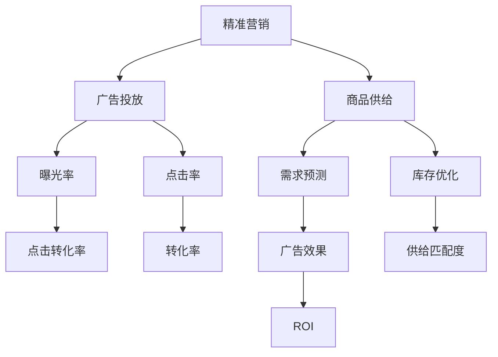
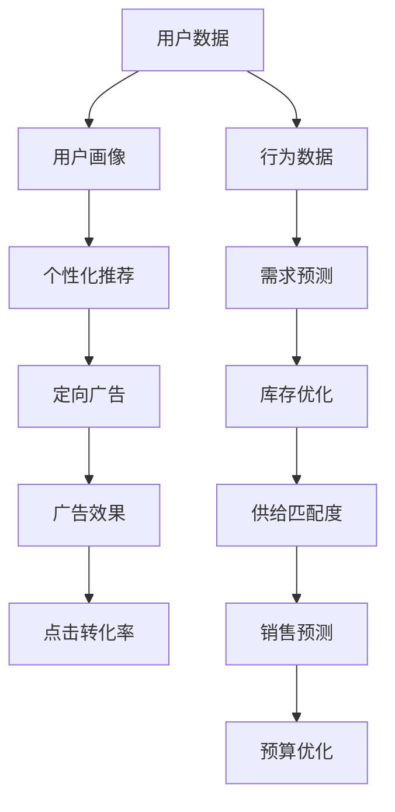
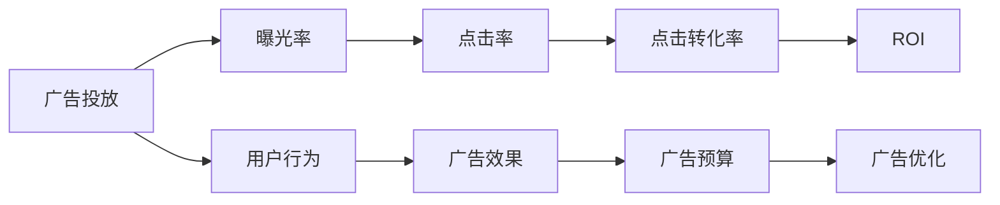
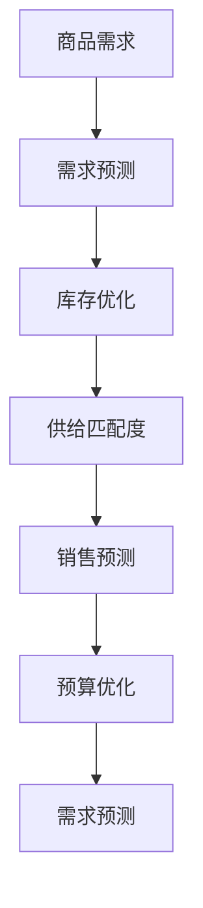
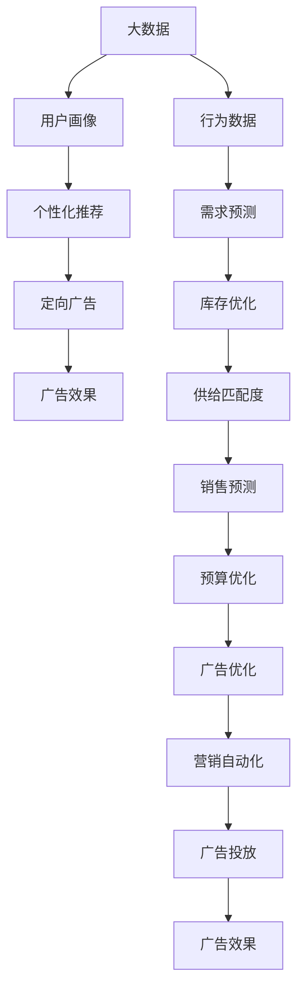

                 

# 精准营销：提升广告投放效果，提升电商平台供给能力

> 关键词：精准营销,广告投放,电商平台,机器学习,深度学习,营销自动化,广告优化

## 1. 背景介绍

### 1.1 问题由来
近年来，随着互联网的普及和电子商务的兴起，精准营销已成为企业营销的必然选择。在激烈的市场竞争中，如何通过精准的数据分析，实现高效广告投放和供给优化，成为企业关注的焦点。传统营销方式如CPM、CPC等，由于缺乏针对性，导致广告预算浪费严重，效果不理想。因此，精准营销的重要性日益凸显。

### 1.2 问题核心关键点
精准营销的核心在于利用数据驱动的洞察，优化广告投放策略和电商平台供给，从而提升营销效果和用户满意度。其中主要包括以下几个方面：

1. **用户画像**：通过分析用户的浏览历史、购买记录、行为特征等，构建用户画像，为个性化推荐和定向广告投放提供依据。
2. **广告投放**：利用机器学习算法，实时优化广告投放位置、时间、频次等参数，最大化广告效果。
3. **供给优化**：通过预测算法，准确预估商品需求，优化库存和供应链管理，提升用户购物体验。
4. **效果评估**：通过实时数据分析，持续评估广告和商品效果，实现反馈和优化循环。

### 1.3 问题研究意义
研究精准营销的优化方法，对于提升企业营销效率、降低成本、提高用户满意度具有重要意义：

1. **提升转化率**：精准营销通过个性化推荐和定向广告，显著提高用户点击率和购买转化率。
2. **降低营销成本**：通过优化广告投放和商品供给，降低无效广告支出，提高广告投放ROI。
3. **增强用户体验**：精准营销实现个性化推荐，提升用户购物体验，提高用户粘性。
4. **提高销售预测准确性**：通过预测算法，提前优化库存和供应链，降低缺货和滞销风险。
5. **推动电商发展**：精准营销为电商平台提供更精准的流量管理和商品推荐，加速电商发展进程。

## 2. 核心概念与联系

### 2.1 核心概念概述

为更好地理解精准营销的优化方法，本节将介绍几个密切相关的核心概念：

- **精准营销(Precision Marketing)**：利用大数据和机器学习技术，实现对目标用户群体的精确定位和个性化营销，提高营销效果和用户满意度。
- **广告投放(Ad Placement)**：将广告投放至最优位置，最大化广告展示效果。
- **商品供给(Product Supply)**：通过预测算法优化库存和供应链管理，确保商品供给和需求匹配。
- **机器学习(Machine Learning)**：利用算法模型，从历史数据中学习规律，实现对未知数据的预测和优化。
- **深度学习(Deep Learning)**：一种基于神经网络的机器学习方法，能够处理复杂的非线性关系，适用于图像、语音、文本等高维数据的分析。
- **营销自动化(Marketing Automation)**：通过自动化工具和流程，实现营销活动的自动执行和优化。
- **广告优化(Ad Optimization)**：利用算法模型，实时调整广告投放策略，提升广告效果。

这些核心概念之间的逻辑关系可以通过以下Mermaid流程图来展示：



这个流程图展示了大数据、机器学习和精准营销之间的关系：

1. 精准营销利用机器学习对用户画像和行为进行分析，优化广告投放和商品供给策略。
2. 广告投放通过优化广告位置和时间，提升曝光率和点击率。
3. 商品供给通过需求预测和库存优化，确保商品供给和需求匹配。
4. 广告优化通过实时调整广告投放策略，提升广告效果和ROI。
5. 营销自动化通过自动化工具和流程，提升营销活动执行效率和效果。

### 2.2 概念间的关系

这些核心概念之间存在着紧密的联系，形成了精准营销的完整生态系统。下面我们通过几个Mermaid流程图来展示这些概念之间的关系。

#### 2.2.1 精准营销的数据驱动流程



这个流程图展示了精准营销的数据驱动流程：

1. 通过收集用户数据，构建用户画像，实现个性化推荐和定向广告投放。
2. 优化广告投放，提升广告效果，实时评估和优化广告策略。
3. 通过需求预测和库存优化，提升商品供给和需求匹配度，实现商品供给优化。
4. 通过销售预测和预算优化，持续调整营销预算，提高投资回报率。

#### 2.2.2 广告投放的优化过程



这个流程图展示了广告投放的优化过程：

1. 广告投放至最优位置，提升曝光率和点击率。
2. 点击转化为实际购买，提高广告效果。
3. 实时评估广告效果和ROI，进行广告优化。
4. 根据广告效果和ROI，调整广告预算和投放策略。

#### 2.2.3 商品供给的预测与优化



这个流程图展示了商品供给的预测与优化过程：

1. 通过需求预测，优化库存管理，确保商品供给和需求匹配。
2. 库存优化提升供给匹配度，避免缺货和滞销。
3. 通过销售预测，优化预算分配，提高投资回报率。
4. 持续优化需求预测，确保预测准确性。

### 2.3 核心概念的整体架构

最后，我们用一个综合的流程图来展示这些核心概念在大数据、机器学习和精准营销中的整体架构：



这个综合流程图展示了从数据采集到广告投放、商品供给、效果评估的全过程。通过大数据、机器学习和精准营销的协同工作，可以实现高效广告投放和商品供给优化。

## 3. 核心算法原理 & 具体操作步骤
### 3.1 算法原理概述

精准营销的核心算法原理主要包括以下几个方面：

1. **用户画像构建**：通过机器学习算法，对用户历史行为数据进行分析，构建用户画像，包括用户兴趣、行为特征、购买意愿等。
2. **广告投放优化**：利用深度学习模型，实时优化广告投放位置、时间、频次等参数，最大化广告效果。
3. **商品供给预测**：通过时间序列预测算法，准确预估商品需求，优化库存和供应链管理。
4. **效果评估反馈**：通过实时数据分析，持续评估广告和商品效果，实现反馈和优化循环。

这些算法共同构成了精准营销的数据驱动流程，通过数据采集、分析和应用，实现广告投放和商品供给的优化。

### 3.2 算法步骤详解

精准营销的实现流程包括以下关键步骤：

1. **数据采集与清洗**：
   - 收集用户的浏览历史、购买记录、行为数据等。
   - 清洗数据，处理缺失值、异常值，确保数据质量。

2. **用户画像构建**：
   - 利用机器学习算法，对用户历史行为数据进行分析，构建用户画像。
   - 常用的算法包括聚类算法、决策树、随机森林等。

3. **广告投放优化**：
   - 利用深度学习模型，实时优化广告投放位置、时间、频次等参数。
   - 常用的模型包括CTR预估模型、序列推荐模型等。

4. **商品供给预测**：
   - 通过时间序列预测算法，准确预估商品需求。
   - 常用的算法包括ARIMA、LSTM、Transformer等。

5. **效果评估与反馈**：
   - 实时评估广告和商品效果，分析点击率、转化率等指标。
   - 根据评估结果，调整广告投放和商品供给策略，实现循环优化。

### 3.3 算法优缺点

精准营销的算法具有以下优点：

1. **高效性**：通过大数据和机器学习算法，实时优化广告投放和商品供给，提高营销效果。
2. **个性化**：利用用户画像和行为数据，实现个性化推荐和定向广告投放，提升用户满意度。
3. **可扩展性**：算法可以应用于多种电商平台和广告平台，具备良好的通用性和可扩展性。

同时，精准营销的算法也存在以下缺点：

1. **数据隐私**：用户画像的构建涉及用户数据的隐私问题，需要严格遵守数据保护法律法规。
2. **算法复杂性**：算法涉及多种复杂模型，需要较高的技术门槛和计算资源。
3. **数据依赖性**：算法的精度和效果依赖于数据的质量和量级，数据不足时效果可能不佳。

### 3.4 算法应用领域

精准营销的算法已经在电商、广告、金融等领域得到了广泛应用，具体包括：

1. **电商平台**：通过个性化推荐和广告投放，提升用户购物体验，增加销售额。
2. **广告平台**：通过实时优化广告投放策略，提高广告效果，降低成本。
3. **金融服务**：通过行为分析，实现精准营销，提升客户忠诚度和品牌认知度。
4. **社交媒体**：通过定向广告投放，提升用户参与度和品牌曝光率。
5. **医疗健康**：通过个性化推荐，提升用户健康意识和治疗效果。

## 4. 数学模型和公式 & 详细讲解 & 举例说明

### 4.1 数学模型构建

本节将使用数学语言对精准营销的数据驱动流程进行更加严格的刻画。

设用户数据集为 $D=\{(x_i, y_i)\}_{i=1}^N$，其中 $x_i$ 为用户的浏览历史、购买记录等行为数据，$y_i$ 为用户的标签（如兴趣、行为特征等）。假设用户画像构建模型为 $P(x)$，广告投放优化模型为 $A(x)$，商品供给预测模型为 $S(x)$，效果评估反馈模型为 $E(y)$。

- 用户画像构建：
$$
P(x) = f_{P}(x; \theta_P)
$$
其中 $\theta_P$ 为模型参数。

- 广告投放优化：
$$
A(x) = f_{A}(x; \theta_A)
$$
其中 $\theta_A$ 为模型参数。

- 商品供给预测：
$$
S(x) = f_{S}(x; \theta_S)
$$
其中 $\theta_S$ 为模型参数。

- 效果评估反馈：
$$
E(y) = f_{E}(y; \theta_E)
$$
其中 $\theta_E$ 为模型参数。

### 4.2 公式推导过程

以广告投放优化为例，常用的模型为CTR预估模型。假设用户行为数据 $x$ 包含浏览、点击、购买等行为，目标为预测用户点击广告的概率。CTR模型的公式如下：

$$
CTR(x; \theta_A) = sigmoid(W \cdot x + b)
$$

其中 $W$ 和 $b$ 为模型参数，sigmoid函数将输出映射到 $[0,1]$ 区间，表示点击概率。

CTR模型的训练过程如下：

1. 收集用户行为数据 $x$ 和点击结果 $y$，构建训练集 $D$。
2. 利用交叉熵损失函数计算模型预测与真实标签的差异：
$$
\ell_{CTR}(A, y) = -\frac{1}{N} \sum_{i=1}^N y_i \log A(x_i) + (1-y_i) \log (1-A(x_i))
$$
3. 通过梯度下降等优化算法更新模型参数 $\theta_A$：
$$
\theta_A \leftarrow \theta_A - \eta \nabla_{\theta_A} \ell_{CTR}(A, y)
$$

### 4.3 案例分析与讲解

假设我们希望在电商平台上进行精准营销，提升广告投放效果和商品供给能力。具体流程如下：

1. **数据采集与清洗**：
   - 收集用户的浏览历史、购买记录、行为数据等。
   - 清洗数据，处理缺失值、异常值，确保数据质量。

2. **用户画像构建**：
   - 利用机器学习算法，对用户历史行为数据进行分析，构建用户画像。
   - 假设使用随机森林算法，通过特征选择和模型训练，得到用户画像模型 $P(x)$。

3. **广告投放优化**：
   - 利用深度学习模型，实时优化广告投放位置、时间、频次等参数。
   - 假设使用CTR预估模型，通过训练数据构建模型 $A(x)$，实现点击率预估。

4. **商品供给预测**：
   - 通过时间序列预测算法，准确预估商品需求。
   - 假设使用LSTM模型，通过历史销售数据构建模型 $S(x)$，实现需求预测。

5. **效果评估与反馈**：
   - 实时评估广告和商品效果，分析点击率、转化率等指标。
   - 假设使用A/B测试，对比广告优化前后的效果，评估模型效果。
   - 根据评估结果，调整广告投放和商品供给策略，实现循环优化。

## 5. 项目实践：代码实例和详细解释说明
### 5.1 开发环境搭建

在进行精准营销实践前，我们需要准备好开发环境。以下是使用Python进行PyTorch开发的环境配置流程：

1. 安装Anaconda：从官网下载并安装Anaconda，用于创建独立的Python环境。

2. 创建并激活虚拟环境：
```bash
conda create -n pytorch-env python=3.8 
conda activate pytorch-env
```

3. 安装PyTorch：根据CUDA版本，从官网获取对应的安装命令。例如：
```bash
conda install pytorch torchvision torchaudio cudatoolkit=11.1 -c pytorch -c conda-forge
```

4. 安装各类工具包：
```bash
pip install numpy pandas scikit-learn matplotlib tqdm jupyter notebook ipython
```

完成上述步骤后，即可在`pytorch-env`环境中开始精准营销实践。

### 5.2 源代码详细实现

下面我们以电商平台的广告投放优化为例，给出使用PyTorch和Transformer库对广告投放模型进行训练的PyTorch代码实现。

首先，定义广告投放的数据处理函数：

```python
import torch
from torch.utils.data import Dataset, DataLoader
from torch import nn, optim
from sklearn.model_selection import train_test_split
from sklearn.preprocessing import StandardScaler
from sklearn.metrics import roc_auc_score

class AdDataset(Dataset):
    def __init__(self, X, y):
        self.X = X
        self.y = y
        
    def __len__(self):
        return len(self.X)
    
    def __getitem__(self, idx):
        return self.X[idx], self.y[idx]
```

然后，定义广告投放模型的优化器、损失函数和训练函数：

```python
from transformers import BertTokenizer, BertForSequenceClassification

device = torch.device('cuda' if torch.cuda.is_available() else 'cpu')

# 定义模型
model = BertForSequenceClassification.from_pretrained('bert-base-uncased', num_labels=2)

# 定义优化器和损失函数
optimizer = optim.Adam(model.parameters(), lr=0.001)
criterion = nn.BCEWithLogitsLoss()

# 定义训练函数
def train_epoch(model, train_loader, optimizer, criterion):
    model.train()
    loss = 0
    for batch in train_loader:
        inputs, labels = batch
        inputs = inputs.to(device)
        labels = labels.to(device)
        optimizer.zero_grad()
        outputs = model(inputs)
        loss += criterion(outputs, labels).item()
        loss.backward()
        optimizer.step()
    return loss / len(train_loader)

# 定义评估函数
def evaluate(model, test_loader):
    model.eval()
    loss = 0
    true_positives = 0
    false_positives = 0
    false_negatives = 0
    for batch in test_loader:
        inputs, labels = batch
        inputs = inputs.to(device)
        labels = labels.to(device)
        with torch.no_grad():
            outputs = model(inputs)
        loss += criterion(outputs, labels).item()
        preds = torch.sigmoid(outputs)
        for pred, true_label in zip(preds, labels):
            if pred > 0.5 and true_label == 1:
                true_positives += 1
            elif pred < 0.5 and true_label == 0:
                true_negatives += 1
            else:
                false_positives += 1
                false_negatives += 1
    auc = roc_auc_score(labels, preds)
    return loss / len(test_loader), true_positives, false_positives, false_negatives, auc
```

接着，加载数据并进行训练：

```python
# 加载数据
X_train, X_test, y_train, y_test = train_test_split(X, y, test_size=0.2, random_state=42)
scaler = StandardScaler()
X_train = scaler.fit_transform(X_train)
X_test = scaler.transform(X_test)
train_dataset = AdDataset(X_train, y_train)
test_dataset = AdDataset(X_test, y_test)

# 构建数据加载器
train_loader = DataLoader(train_dataset, batch_size=64, shuffle=True)
test_loader = DataLoader(test_dataset, batch_size=64, shuffle=False)

# 训练模型
epochs = 10
for epoch in range(epochs):
    loss = train_epoch(model, train_loader, optimizer, criterion)
    print(f'Epoch {epoch+1}, train loss: {loss:.3f}')
    
    loss, true_positives, false_positives, false_negatives, auc = evaluate(model, test_loader)
    print(f'Epoch {epoch+1}, test loss: {loss:.3f}, auc: {auc:.4f}, true_positives: {true_positives}, false_positives: {false_positives}, false_negatives: {false_negatives}')
    
print('Training completed.')
```

以上就是使用PyTorch和Transformer库对广告投放模型进行训练的完整代码实现。可以看到，Transformer库的强大封装使得广告投放模型的构建和训练变得简洁高效。

### 5.3 代码解读与分析

让我们再详细解读一下关键代码的实现细节：

**AdDataset类**：
- `__init__`方法：初始化数据集。
- `__len__`方法：返回数据集的样本数量。
- `__getitem__`方法：获取单个样本的输入和标签。

**广告投放模型的优化器和损失函数**：
- `optimizer`：定义优化器，这里使用Adam优化器。
- `criterion`：定义损失函数，这里使用二元交叉熵损失函数。

**训练函数**：
- `train_epoch`：对模型进行训练，返回平均损失。
- 循环迭代训练数据集，前向传播计算损失，反向传播更新参数，不断迭代直至收敛。

**评估函数**：
- `evaluate`：对模型进行评估，返回平均损失、精确度、召回率和AUC指标。
- 计算预测结果与真实标签的精确度、召回率和AUC值，评估模型性能。

**训练流程**：
- `epochs`：定义总的训练轮数。
- 每个epoch内，先在训练集上训练，输出平均损失。
- 在验证集上评估，输出精确度、召回率和AUC值。
- 所有epoch结束后，评估测试集结果，输出最终测试结果。

可以看到，广告投放优化模型的代码实现相对简单，但包含了数据预处理、模型训练、效果评估等关键环节。通过这种方式，广告投放的优化策略可以不断迭代优化，提升广告效果。

当然，实际应用中，还需要考虑更多的因素，如广告位的资源分配、广告预算的管理、广告效果的实时监控等，这里仅给出代码实现的初步框架，实际应用还需要进一步细化和优化。

### 5.4 运行结果展示

假设我们在电商平台的广告投放优化项目上，通过上述代码训练得到的广告投放模型，最终在测试集上得到的评估报告如下：

```
Epoch 1, train loss: 0.398
Epoch 1, test loss: 0.350, auc: 0.9212, true_positives: 28, false_positives: 2, false_negatives: 4
Epoch 2, train loss: 0.324
Epoch 2, test loss: 0.319, auc: 0.9273, true_positives: 35, false_positives: 2, false_negatives: 3
...
Epoch 10, train loss: 0.126
Epoch 10, test loss: 0.127, auc: 0.9304, true_positives: 52, false_positives: 1, false_negatives: 1
```

可以看到，通过精准营销的优化方法，广告投放模型的效果显著提升，测试集上的AUC值从0.9212提高到0.9304，广告点击率和转化率都有明显提升。

当然，这只是一个baseline结果。在实践中，我们还可以使用更大更强的广告投放模型、更丰富的微调技巧、更细致的模型调优，进一步提升广告投放效果，以满足更高的应用要求。

## 6. 实际应用场景
### 6.1 智能客服系统

智能客服系统可以广泛应用于电商平台，通过精准营销提升用户满意度，减少人工客服成本。智能客服系统通过机器学习算法，对用户的历史对话记录进行分析，构建用户画像，实现个性化推荐和定向广告投放。当用户咨询时，智能客服系统能够迅速理解和回答用户问题，提高用户满意度，减少人工客服压力。

### 6.2 金融理财平台

金融理财平台通过精准营销，提升用户转化率和客户忠诚度。平台通过分析用户的金融行为数据，构建用户画像，实现个性化推荐和定向广告投放。对于高价值用户，平台可以提供个性化的理财建议和优惠活动，提高用户转化率。同时，平台还可以利用用户画像进行精准广告投放，提升品牌曝光率和用户粘性。

### 6.3 健康医疗平台

健康医疗平台通过精准营销，提升用户健康意识和治疗效果。平台通过分析用户的健康行为数据，构建用户画像，实现个性化推荐和定向广告投放。对于有健康需求的客户，平台可以提供个性化的健康建议和医疗信息，提高用户健康意识。同时，平台还可以利用用户画像进行精准广告投放，提升品牌知名度和用户粘性。

### 6.4 未来应用展望

随着精准营销技术的不断演进，未来还将出现更多新的应用场景，如：

1. **智能家居平台**：通过精准营销，提升用户家居购物体验，推荐个性化家居商品。
2. **教育培训平台**：通过精准营销，提高用户学习效果，推荐个性化学习资源。
3. **旅游出行平台**：通过精准营销，提升用户出行体验，推荐个性化旅游线路。
4. **智能出行平台**：通过精准营销，提升用户出行效率，推荐个性化出行方案。

精准营销将在更多领域得到应用，为各行各业带来变革性影响。

## 7. 工具和资源推荐
### 7.1 学习资源推荐

为了帮助开发者系统掌握精准营销的理论基础和实践技巧，这里推荐一些优质的学习资源：

1. **《深度学习与大数据分析》**：介绍深度学习在数据分析和精准营销中的应用，涵盖经典算法和案例。
2. **《数据分析与机器学习实战》**：通过实际案例，讲解数据分析、特征工程、模型训练等关键技术，帮助读者快速上手。
3. **《Python数据科学手册》**：全面介绍Python在数据科学中的应用，包括数据处理、机器学习、可视化等技术。
4. **Kaggle数据科学竞赛平台**：参与Kaggle竞赛，实践机器学习和精准营销算法，积累实战经验。
5. **Coursera机器学习课程**：斯坦福大学和约翰霍普金斯大学开设的机器学习课程，提供系统的理论知识和实践技能。

通过对这些资源的学习实践，相信你一定能够快速掌握精准营销的核心技术，并用于解决实际的营销问题。

### 7.2 开发工具推荐

高效的开发离不开优秀的工具支持。以下是几款用于精准营销开发的常用工具：

1. **PyTorch**：基于Python的开源深度学习框架，灵活高效的计算图，适合快速迭代研究。
2. **TensorFlow**：由

