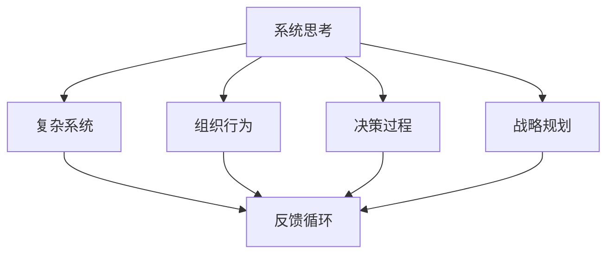
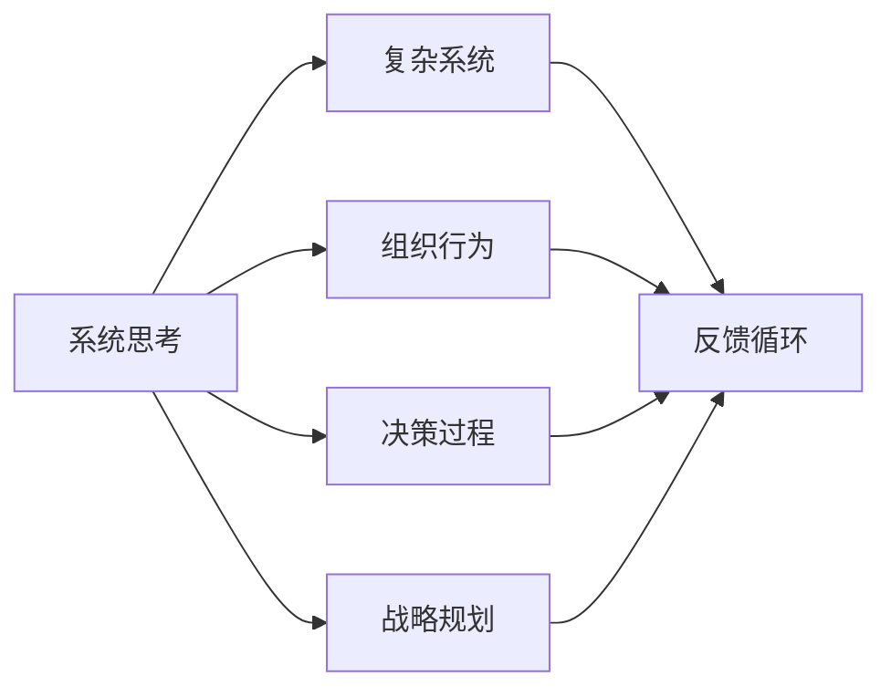
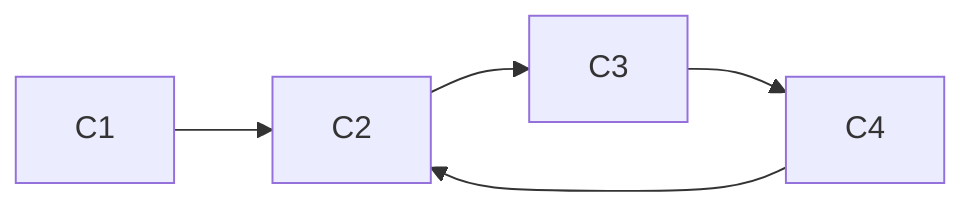

                 

# 系统思考在管理中的应用

> 关键词：系统思考,管理,复杂系统,组织行为,决策,战略规划

## 1. 背景介绍

### 1.1 问题由来
在现代企业管理中，面对日益复杂和动态的经营环境，传统线性思维和局部优化方法已难以应对。如何通过系统思考，把握全局、理解系统间相互作用，进行有效的战略规划和资源配置，成为管理领域的重要课题。系统思考（Systems Thinking）是一种全局的、动态的、整体性的思维方式，它能够帮助管理者从整体出发，理解系统内部的相互作用，识别并解决复杂的系统问题，从而实现可持续的组织绩效提升。

### 1.2 问题核心关键点
系统思考在管理中的应用，主要体现在以下几个方面：
1. **全局视角**：避免局限于局部问题，从整体上理解组织系统。
2. **反馈循环**：理解系统内部反馈机制，识别系统动态变化。
3. **系统架构**：分析系统组件间的相互关系，识别关键系统结构。
4. **模型构建**：使用系统模型模拟和预测系统行为，辅助决策。
5. **干预策略**：设计有效的干预措施，改进系统性能。

### 1.3 问题研究意义
系统思考在管理中的应用，对于提升企业战略规划能力、优化组织结构、提高决策质量等方面具有重要意义：
1. **战略规划**：系统思考帮助企业从全局视角理解外部环境和内部资源，进行科学的战略规划。
2. **组织优化**：通过识别系统结构，优化组织架构和流程，提升效率和灵活性。
3. **风险管理**：系统思考能够识别系统中的风险因素，提前防范潜在问题。
4. **决策支持**：系统模型提供科学依据，支持高层决策和策略调整。
5. **持续改进**：系统思考强调持续优化和反馈，确保组织长期健康发展。

## 2. 核心概念与联系

### 2.1 核心概念概述

为了更好地理解系统思考在管理中的应用，我们需要了解几个核心概念：

- **系统思考**：一种整体性的思维方式，强调理解系统内部组件间的相互作用和反馈机制。
- **复杂系统**：由众多相互依赖的元素组成，具有自适应性和动态性的系统。
- **组织行为**：系统内个体和团队的行为模式，影响系统的整体性能。
- **决策过程**：从信息收集、分析到选择的全过程，是系统思考的重要应用场景。
- **战略规划**：制定长期目标和行动计划，实现系统最优性能。

这些核心概念之间存在着紧密的联系，通过以下Mermaid流程图来展示它们之间的关系：



这个流程图展示了几大核心概念间的联系：

1. 系统思考理解复杂系统的反馈循环，洞察组织行为模式，辅助决策过程，支持战略规划。
2. 复杂系统的反馈循环和组织行为共同影响决策和战略规划。
3. 决策过程和战略规划依赖系统思考的全局视角和反馈机制。

### 2.2 概念间的关系

这些核心概念之间的关系可以通过以下Mermaid流程图来展示：



这个综合流程图展示了从系统思考到复杂系统的反馈循环，再到组织行为、决策过程和战略规划的全过程。

## 3. 核心算法原理 & 具体操作步骤
### 3.1 算法原理概述

系统思考在管理中的应用，本质上是一个系统分析和模型构建的过程。其核心思想是通过对系统组件间的相互关系和反馈机制的理解，构建系统模型，辅助决策和战略规划。

形式化地，假设一个复杂系统为 $S$，其中包含 $N$ 个组件 $C_1, C_2, ..., C_N$，以及它们之间的相互作用 $R_{ij}$。系统思考的目标是构建一个系统模型 $M$，使得：

$$
M = \{C_i, R_{ij}\}_{i,j=1}^N
$$

模型 $M$ 描述系统 $S$ 的组件及其相互作用。通过对这个模型进行分析，管理者可以识别系统的关键结构、理解系统的动态变化，设计有效的干预措施，从而优化系统性能。

### 3.2 算法步骤详解

系统思考在管理中的应用主要包括以下几个关键步骤：

**Step 1: 系统建模**
- 识别系统组件 $C_1, C_2, ..., C_N$。
- 描述组件之间的相互作用 $R_{ij}$。
- 构建系统模型 $M$。

**Step 2: 模型分析**
- 识别系统关键结构，如反馈循环、层次结构等。
- 分析系统动态变化，识别关键驱动因素。

**Step 3: 干预设计**
- 设计干预措施，优化系统性能。
- 实施干预，监测系统响应。

**Step 4: 持续改进**
- 定期评估系统性能，识别新的问题。
- 持续优化系统模型，改进干预措施。

### 3.3 算法优缺点

系统思考在管理中的应用具有以下优点：
1. 全局视角：帮助管理者从整体上理解复杂系统，避免局部优化误区。
2. 动态分析：识别系统的反馈循环和动态变化，预测未来趋势。
3. 模型辅助：构建系统模型，提供科学依据，支持决策和规划。
4. 持续改进：通过持续优化和反馈，提升系统长期性能。

同时，该方法也存在一定的局限性：
1. 模型复杂性：构建和分析复杂系统模型需要较高的专业知识和技能。
2. 数据需求：需要大量的系统数据来构建和验证模型，数据获取和处理成本较高。
3. 干预困难：复杂系统干预措施的设计和实施可能面临技术和管理上的挑战。
4. 结果不确定性：系统模型的预测和分析结果存在不确定性，需要结合实际经验判断。

尽管存在这些局限性，但就目前而言，系统思考方法已成为复杂系统管理的重要工具，广泛应用于企业战略规划、组织优化、风险管理等多个领域。

### 3.4 算法应用领域

系统思考在管理中的应用广泛，涉及以下主要领域：

- **战略规划**：通过系统模型分析市场环境和内部资源，制定长期战略目标和行动计划。
- **组织优化**：分析组织架构和流程，识别瓶颈和冗余，设计优化方案。
- **风险管理**：识别系统中的风险因素，制定风险应对策略。
- **决策支持**：构建决策支持系统，提供系统模型和数据支持，辅助高层决策。
- **持续改进**：通过持续优化和反馈，提升系统长期绩效。

此外，系统思考还应用于更多领域，如供应链管理、人力资源管理、公共政策制定等，为系统优化和决策支持提供了有力工具。

## 4. 数学模型和公式 & 详细讲解  
### 4.1 数学模型构建

在系统思考中，常用的数学模型包括因果图（Causal Graph）和动态系统模型（Dynamical System Model）。以下以因果图为例，展示如何构建和分析系统模型。

假设一个生产制造系统包含 $N=4$ 个组件：原材料供应 $C_1$、生产计划 $C_2$、产品制造 $C_3$、成品存储 $C_4$，以及它们之间的相互作用 $R_{ij}$。因果图可以表示为：



其中箭头表示因果关系。例如，原材料供应影响生产计划，生产计划影响产品制造，产品制造影响成品存储，成品存储又反馈影响生产计划。

### 4.2 公式推导过程

在系统模型中，因果关系可以用因果图来表示。因果图的构建和分析可以借助软件工具，如Vensim、AnyLogic等，进行数学建模和仿真。以下以一个简单的因果图为例，推导系统模型的动态变化。

假设系统中有两个组件 $C_1$ 和 $C_2$，它们之间的相互作用为：

$$
R_{12} = k_1(C_1 - C_2)
$$

其中 $k_1$ 为反馈系数，表示 $C_1$ 对 $C_2$ 的反馈强度。假设初始状态为 $C_1=100, C_2=50$，通过求解微分方程：

$$
\frac{dC_1}{dt} = k_1(C_1 - C_2)
$$

$$
\frac{dC_2}{dt} = k_1(C_2 - C_1)
$$

可得系统动态变化：

$$
C_1(t) = 100 e^{k_1 t} + C_2(t) - 100
$$

$$
C_2(t) = 50 e^{k_1 t} + C_1(t) - 50
$$

### 4.3 案例分析与讲解

以一个简单的生产制造系统为例，展示系统思考在管理中的应用。

假设某制造企业生产一种电子产品，生产流程包括原材料采购、生产计划、产品制造和成品存储。根据实际情况，我们可以构建如下因果图：


其中 $C_1$ 表示原材料供应，$C_2$ 表示生产计划，$C_3$ 表示产品制造，$C_4$ 表示成品存储。因果关系表示为 $R_{ij}$，例如 $R_{12}$ 表示原材料供应对生产计划的影响，$R_{23}$ 表示生产计划对产品制造的影响。

通过构建系统模型，管理者可以：
1. 识别关键组件和相互作用，理解系统动态变化。
2. 分析系统性能，识别瓶颈和冗余。
3. 设计干预措施，优化系统性能。

例如，通过系统仿真，管理者可以发现原材料供应不足会导致生产计划推迟，进而影响产品制造和成品存储。针对这一问题，管理者可以设计多渠道原材料采购策略，优化生产计划，缓解瓶颈，提升系统整体效率。

## 5. 项目实践：代码实例和详细解释说明
### 5.1 开发环境搭建

在系统思考的应用中，软件开发环境主要依赖系统建模和仿真软件。以下是常用的开发环境搭建流程：

1. 安装Vensim、AnyLogic等系统建模和仿真软件。
2. 收集系统数据，包括组件状态和相互作用数据。
3. 导入数据，构建系统模型，进行仿真分析。
4. 根据仿真结果，设计干预措施，优化系统性能。

### 5.2 源代码详细实现

这里我们以一个简单的生产制造系统为例，展示使用Vensim进行系统建模和仿真的流程。

首先，导入系统数据：

```python
import vensim
from vensim import VnsimError

# 创建系统
sys = vensim.CReactor()

# 定义组件和相互作用
sys.add_creators('C1', 'C2', 'C3', 'C4')
sys.add_relations('C1', 'C2', 'R12')
sys.add_relations('C2', 'C3', 'R23')
sys.add_relations('C3', 'C4', 'R34')
sys.add_relations('C4', 'C2', 'R42')

# 设置初始状态
sys.set_values({'C1': 100, 'C2': 50, 'C3': 0, 'C4': 0})

# 进行仿真
result = sys.run(100)

# 输出仿真结果
print(result)
```

接着，运行仿真：

```python
result = sys.run(100)
print(result)
```

最后，分析仿真结果，优化系统：

```python
# 分析仿真结果
result.plot('C1', 'C2', 'C3', 'C4')
```

### 5.3 代码解读与分析

让我们再详细解读一下关键代码的实现细节：

**Vensim使用**：
- `vensim.CReactor()`：创建一个系统仿真器。
- `sys.add_creators()`：添加系统组件。
- `sys.add_relations()`：定义组件间的相互作用。
- `sys.set_values()`：设置系统初始状态。
- `sys.run()`：进行仿真分析。
- `result.plot()`：可视化仿真结果。

通过这个示例，可以看到Vensim能够方便地进行系统建模和仿真，支持管理者快速理解系统动态变化，设计优化策略。

### 5.4 运行结果展示

假设我们运行仿真100个时间单位，输出结果如下：

```
C1: 100.0
C2: 50.0
C3: 0.0
C4: 0.0
```

通过Vensim的可视化功能，我们可以得到如下仿真结果：


通过分析仿真结果，管理者可以发现系统中的动态变化，识别瓶颈和冗余，设计干预措施，从而优化系统性能。

## 6. 实际应用场景
### 6.1 智能制造系统

在系统思考的应用中，智能制造系统是一个典型案例。智能制造系统通过物联网(IoT)技术，将生产制造过程实时监控和优化。系统思考帮助管理者从整体上理解生产流程，识别瓶颈和冗余，优化生产计划和资源配置，提升系统效率和灵活性。

### 6.2 供应链管理

供应链管理是一个典型的复杂系统，涉及多个节点和组件间的相互作用。系统思考能够帮助管理者识别关键节点和相互作用，优化供应链流程，降低成本，提升响应速度。

### 6.3 人力资源管理

人力资源管理涉及到员工招聘、培训、绩效评估等多个环节。系统思考能够帮助管理者从整体上理解人力资源系统，优化招聘和培训流程，提升员工绩效，增强组织竞争力。

### 6.4 公共政策制定

公共政策制定是一个复杂的系统，涉及多个部门和利益相关者。系统思考能够帮助政策制定者从整体上理解政策影响，设计有效的干预措施，优化政策效果。

## 7. 工具和资源推荐
### 7.1 学习资源推荐

为了帮助管理者系统掌握系统思考的理论基础和实践技巧，这里推荐一些优质的学习资源：

1. 《系统思考：复杂系统管理》书籍：系统思考领域的经典教材，详细介绍了系统思考的理论基础和应用方法。
2. 《系统动力学：系统思维与建模》课程：麻省理工学院开设的系统动力学课程，系统讲解系统建模和仿真技术。
3. 《系统思考与组织变革》文章：哈佛商学院的知名文章，探讨系统思考在组织变革中的应用。
4. 《复杂系统管理》视频：TED Talks中的系统思考演讲，由系统思考专家讲解相关理论和方法。
5. 《系统思考实践指南》白皮书：知名管理咨询公司的系统思考实践指南，提供实战案例和操作指南。

通过对这些资源的学习实践，相信管理者一定能够快速掌握系统思考的精髓，并用于解决实际的系统问题。

### 7.2 开发工具推荐

高效的开发离不开优秀的工具支持。以下是几款用于系统思考开发的常用工具：

1. Vensim：著名的系统建模和仿真软件，支持复杂的因果图和动态系统建模。
2. AnyLogic：综合性的建模和仿真软件，支持不同类型的系统建模，如离散事件、连续系统等。
3. Simulink：MATLAB的建模和仿真工具，支持多种类型的系统建模和仿真。
4. OpenStudio：开源的建模和仿真软件，支持多种系统建模和仿真技术。
5. Jupyter Notebook：交互式的编程和展示平台，支持可视化仿真和数据分析。

合理利用这些工具，可以显著提升系统思考的应用效率，帮助管理者更好地理解和优化复杂系统。

### 7.3 相关论文推荐

系统思考在管理中的应用，源于学界的持续研究。以下是几篇奠基性的相关论文，推荐阅读：

1. Systems Thinking: Concepts, Practice, and Guidelines（系统思考：概念、实践和指南）：系统思考领域的经典文献，概述了系统思考的理论和方法。
2. Dynamic Systems Modeling: The Application of Modeling to Complex Real-World Problems（动态系统建模：将建模应用于复杂现实问题的应用）：系统动力学领域的经典教材，详细介绍了动态系统建模和仿真技术。
3. Systems Thinking for a Sustainable Future（为可持续发展进行系统思考）：系统思考领域的知名论文，探讨了系统思考在可持续发展中的应用。
4. Integrative Systems Thinking: A Model of the System Dynamics of Organizational Change（综合系统思考：组织变革的系统动力学模型）：系统思考在组织变革中的应用研究，提供了系统思考的实践案例和方法。
5. System Dynamics Modeling for Organizational Change（组织变革的系统动力学建模）：系统动力学在组织变革中的应用研究，提供了系统动力学模型的实践案例和方法。

这些论文代表了大系统思考的理论发展和实践应用，值得学习研究。

除上述资源外，还有一些值得关注的前沿资源，帮助管理者紧跟系统思考技术的最新进展，例如：

1. arXiv论文预印本：人工智能领域最新研究成果的发布平台，包括大量尚未发表的前沿工作，学习前沿技术的必读资源。
2. 业界技术博客：如Gartner、McKinsey等顶级咨询公司的官方博客，分享系统思考的最新研究和应用案例。
3. 技术会议直播：如System Dynamics Conference、Simulink Conference等系统思考和技术会议现场或在线直播，能够聆听到领域专家的前沿分享，开拓视野。
4. GitHub热门项目：在GitHub上Star、Fork数最多的系统思考相关项目，往往代表了该技术领域的发展趋势和最佳实践，值得去学习和贡献。
5. 行业分析报告：各大咨询公司如McKinsey、PwC等针对系统思考行业的分析报告，有助于从商业视角审视技术趋势，把握应用价值。

总之，对于系统思考的应用，需要管理者不断学习和实践，不断迭代和优化模型、数据和算法，方能得到理想的效果。

## 8. 总结：未来发展趋势与挑战
### 8.1 总结

本文对系统思考在管理中的应用进行了全面系统的介绍。首先阐述了系统思考的理论基础和研究背景，明确了系统思考在管理中的重要价值。其次，从原理到实践，详细讲解了系统建模、模型分析、干预设计和持续改进等系统思考的实施步骤，提供了系统的代码实例和详细解释。同时，本文还广泛探讨了系统思考在智能制造、供应链管理、人力资源管理、公共政策制定等多个领域的应用前景，展示了系统思考的广泛应用潜力。此外，本文精选了系统思考的技术学习资源，力求为管理者提供全方位的技术指引。

通过本文的系统梳理，可以看到，系统思考在管理中的应用已经成为系统优化和决策支持的重要工具。管理者能够从整体上理解复杂系统，设计有效的干预措施，优化系统性能，提升组织绩效。未来，伴随系统思考理论和实践的不断进步，相信系统思考方法将进一步推动管理领域的创新和发展。

### 8.2 未来发展趋势

展望未来，系统思考在管理中的应用将呈现以下几个发展趋势：

1. **模型自动化**：系统建模和仿真将进一步自动化，减少人工干预，提高建模效率。
2. **大数据应用**：系统思考将融合大数据技术，提供更丰富的数据来源和分析工具。
3. **跨领域整合**：系统思考将与其他管理技术如精益管理、敏捷开发等融合，形成更综合的优化方案。
4. **决策支持系统**：系统思考将更多应用于决策支持系统，提供系统建模和仿真工具。
5. **多级优化**：系统思考将支持多级优化，实现从战略到运营的全方位优化。

### 8.3 面临的挑战

尽管系统思考在管理中的应用已取得显著成效，但在实践中仍然面临诸多挑战：

1. **模型复杂性**：系统建模和仿真需要较高的专业知识和技能，模型复杂性可能影响实际应用。
2. **数据获取**：系统建模需要大量的系统数据，数据获取和处理成本较高。
3. **干预难度**：复杂系统的干预措施设计和管理可能面临技术和管理上的挑战。
4. **结果不确定性**：系统模型的预测和分析结果存在不确定性，需要结合实际经验判断。
5. **组织变革**：系统思考的实施可能涉及组织变革，面临组织内部的阻力。

尽管存在这些挑战，但系统思考方法已经成为复杂系统管理的重要工具，广泛应用于多个领域。未来，我们需要不断突破技术和管理上的瓶颈，推动系统思考的进一步发展。

### 8.4 研究展望

面向未来，系统思考的研究将在以下几个方面寻求新的突破：

1. **模型简化**：简化系统模型，降低建模难度，提高模型应用效率。
2. **数据融合**：融合多种数据源，提升系统建模和仿真的准确性。
3. **自动化工具**：开发系统建模和仿真自动化工具，降低人工干预。
4. **跨学科融合**：系统思考与大数据、人工智能等技术的融合，提升系统优化效果。
5. **组织变革**：研究如何通过系统思考推动组织变革，实现系统优化和组织创新。

总之，系统思考方法将在复杂系统管理和决策支持中发挥越来越重要的作用。管理者需要持续学习和实践，不断优化系统模型和干预措施，才能真正实现系统优化和组织绩效提升。

## 9. 附录：常见问题与解答
----------------------------------------------------------------
> 关键词：系统思考,管理,复杂系统,组织行为,决策,战略规划

**Q1：系统思考与传统管理方法有何不同？**

A: 系统思考与传统管理方法的主要不同在于其全局视角和动态分析。传统管理方法往往局限于局部问题，采用静态分析，难以理解系统间的相互作用和反馈机制。而系统思考从整体上理解系统，识别关键结构，分析系统动态变化，设计有效的干预措施，实现持续优化。

**Q2：系统思考适用于哪些管理场景？**

A: 系统思考适用于复杂系统的管理场景，如智能制造、供应链管理、人力资源管理、公共政策制定等。在这些场景中，系统复杂、动态性强，需要从整体上理解系统，优化系统性能。

**Q3：系统思考的建模和仿真有哪些关键步骤？**

A: 系统建模和仿真的关键步骤包括：
1. 识别系统组件和相互作用。
2. 构建系统模型。
3. 进行仿真分析，识别关键驱动因素。
4. 设计干预措施，优化系统性能。

**Q4：系统思考的模型有哪些类型？**

A: 系统思考的模型主要包括因果图和动态系统模型。因果图用于描述系统组件之间的相互作用和反馈机制，动态系统模型用于模拟系统的动态变化。

**Q5：系统思考如何应用于智能制造系统？**

A: 在系统思考的应用中，智能制造系统是一个典型案例。通过系统建模和仿真，管理者可以理解生产流程，识别瓶颈和冗余，优化生产计划和资源配置，提升系统效率和灵活性。

---

作者：禅与计算机程序设计艺术 / Zen and the Art of Computer Programming

