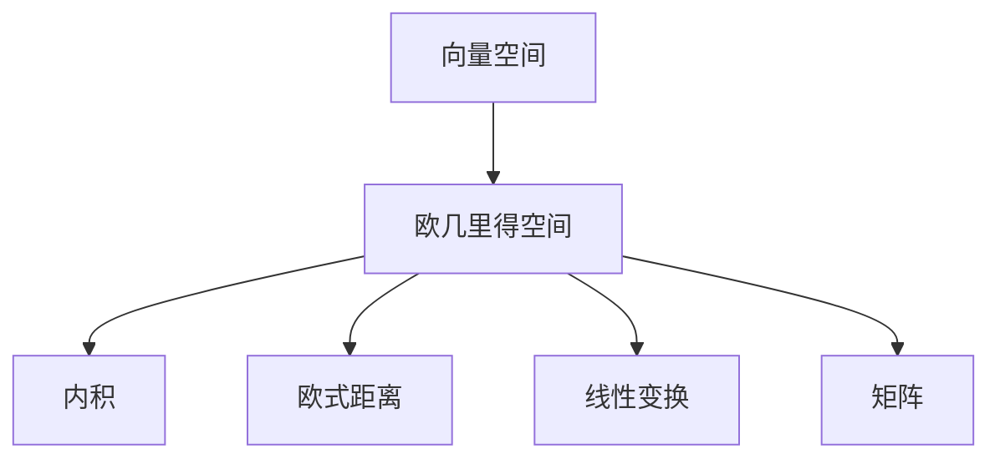

                 

## 1. 背景介绍

线性代数作为计算机科学的基石之一，对人工智能、数据科学、计算机图形学等多个领域都有着深远的影响。本篇博客文章将从欧几里得空间的定义入手，逐步深入讲解线性代数中的核心概念和原理，并结合实际应用场景，展示其强大的计算能力和广泛的适用性。

### 1.1 线性代数与欧几里得空间

线性代数主要研究线性方程组、向量空间、矩阵等数学工具，以及它们在解决实际问题中的应用。其中，欧几里得空间是线性代数中最为基础和重要的概念，用于描述几何学和分析学中的问题。欧几里得空间中的向量、矩阵和线性变换等概念，被广泛应用于计算机视觉、信号处理、机器学习等领域。

### 1.2 核心概念与联系

在开始深入探讨之前，我们先来梳理一下线性代数中的一些核心概念及其之间的联系。

- **向量**：在n维空间中，向量是一个n元有序数组，可以表示空间中的方向和大小。
- **矩阵**：由向量组成的数组，具有线性变换的功能，可以表示几何变换、数据表示等。
- **线性变换**：通过矩阵乘法，将一个向量空间映射到另一个向量空间的过程。
- **内积与外积**：内积和外积是向量之间的两种基本运算，分别表示向量之间的相似度和方向。
- **正交与正交基**：正交基是向量空间的一组基，满足正交性，用于简化计算和分析。

这些核心概念构成了线性代数的骨架，也是欧几里得空间的基础。通过这些概念的相互联系和作用，线性代数为我们提供了一套强大的数学工具，用于解决各种实际问题。

## 2. 核心概念与联系

### 2.1 核心概念概述

线性代数中最重要的概念之一是向量空间，而欧几里得空间是向量空间的一种特殊形式。

#### 2.1.1 向量空间

向量空间（也称为线性空间）是满足以下条件的一组向量集合：

1. 加法：任意两个向量可以相加。
2. 数乘：任意数与向量相乘。
3. 结合律与交换律：加法满足交换律和结合律。
4. 零元与单位元：存在零向量与单位向量。
5. 逆元素：任意向量有其逆元素。

这些条件构成了向量空间的基本性质，保证了向量之间可以进行线性组合和数乘运算。

#### 2.1.2 欧几里得空间

欧几里得空间是n维向量空间的一种特殊形式，满足以下条件：

1. 向量之间的距离可以定义，即欧式距离。
2. 向量空间具有线性变换的性质。

这些条件使得欧几里得空间成为了几何学和分析学中的基础工具，广泛应用于计算机图形学、机器学习等领域。

### 2.2 核心概念之间的关系

欧几里得空间是向量空间的一种特殊形式，通过内积（或点积）可以定义向量的长度和夹角。在欧几里得空间中，向量之间的距离可以通过欧式距离计算。欧几里得空间还具备线性变换的性质，可以通过矩阵乘法进行线性变换。

这些概念之间的关系可以用以下Mermaid流程图来表示：



## 3. 核心算法原理 & 具体操作步骤

### 3.1 算法原理概述

在欧几里得空间中，向量的加法和数乘运算遵循向量空间的性质。矩阵乘法则表示了向量之间的线性变换，可以用于表示各种几何变换和数据变换。

欧几里得空间的线性代数算法主要包括向量空间的运算、矩阵运算、内积和外积等。这些算法可以用于解决各种实际问题，如数据压缩、图像处理、信号分析等。

### 3.2 算法步骤详解

#### 3.2.1 向量空间运算

1. **向量的加法**：两个向量相加，生成一个新的向量，其元素为对应元素的和。
2. **向量的数乘**：一个数与向量相乘，生成一个新的向量，其每个元素乘以该数。
3. **向量的内积**：两个向量进行内积运算，生成一个标量，表示向量之间的相似度。

#### 3.2.2 矩阵运算

1. **矩阵乘法**：两个矩阵相乘，生成一个新的矩阵，其元素为对应元素的点乘和。
2. **矩阵的逆**：一个矩阵如果可逆，则存在一个逆矩阵，使得逆矩阵与其相乘为单位矩阵。
3. **矩阵的转置**：矩阵的转置是将矩阵的行与列互换的操作，可以用于矩阵的运算和数据的表示。

#### 3.2.3 内积与外积

1. **内积**：两个向量进行内积运算，生成一个标量，表示向量之间的相似度。
2. **外积**：两个向量进行外积运算，生成一个新的向量，表示向量之间的方向。

#### 3.2.4 线性变换

1. **线性变换的定义**：将一个向量空间映射到另一个向量空间的过程。
2. **矩阵与线性变换**：矩阵乘法可以表示线性变换，将一个向量空间映射到另一个向量空间。

### 3.3 算法优缺点

#### 3.3.1 优点

1. **强大的计算能力**：线性代数提供了一套强大的数学工具，可以用于各种复杂问题的求解。
2. **广泛的适用性**：欧几里得空间中的向量、矩阵和线性变换等概念，被广泛应用于计算机视觉、信号处理、机器学习等领域。
3. **简洁的表达方式**：线性代数使用简洁的符号表示，易于理解和应用。

#### 3.3.2 缺点

1. **计算复杂度较高**：在处理大规模数据时，线性代数的计算复杂度较高，需要较大的计算资源。
2. **难以直观理解**：线性代数中的概念和运算有时比较抽象，需要一定的数学基础才能理解。
3. **应用范围受限**：虽然线性代数有广泛的应用，但在某些特定领域（如物理学、统计学等），可能存在其他更为适合的数学工具。

### 3.4 算法应用领域

线性代数和欧几里得空间在计算机科学中有着广泛的应用，主要体现在以下几个方面：

1. **计算机视觉**：线性代数用于图像处理、计算机图形学等，通过矩阵乘法和向量运算，可以进行图像的变换、特征提取等。
2. **信号处理**：线性代数用于信号分析、图像处理等，通过矩阵乘法和向量运算，可以进行信号的滤波、降噪等。
3. **机器学习**：线性代数用于特征提取、降维等，通过矩阵乘法和内积运算，可以实现数据的特征表示和模型训练。
4. **数据科学**：线性代数用于数据分析、统计学等，通过矩阵乘法和向量运算，可以进行数据的线性回归、聚类等。

## 4. 数学模型和公式 & 详细讲解 & 举例说明

### 4.1 数学模型构建

欧几里得空间中的数学模型主要涉及向量和矩阵的运算。下面我们将通过一些公式来介绍欧几里得空间中的基本概念和运算。

#### 4.1.1 向量与标量

向量 $v = (v_1, v_2, ..., v_n)$ 是一个n维数组，标量是一个单一的数值。

#### 4.1.2 矩阵

矩阵 $A = [a_{ij}]_{m \times n}$ 是一个m行n列的数组，每个元素 $a_{ij}$ 表示一个数值。

#### 4.1.3 内积

向量 $u = (u_1, u_2, ..., u_n)$ 和向量 $v = (v_1, v_2, ..., v_n)$ 的内积为 $u \cdot v = \sum_{i=1}^n u_i v_i$。

#### 4.1.4 欧式距离

向量 $u = (u_1, u_2, ..., u_n)$ 和向量 $v = (v_1, v_2, ..., v_n)$ 的欧式距离为 $||u - v|| = \sqrt{\sum_{i=1}^n (u_i - v_i)^2}$。

### 4.2 公式推导过程

#### 4.2.1 向量加法和数乘

向量加法 $u + v = (u_1 + v_1, u_2 + v_2, ..., u_n + v_n)$，向量数乘 $c \cdot v = (c \cdot v_1, c \cdot v_2, ..., c \cdot v_n)$。

#### 4.2.2 矩阵乘法

设矩阵 $A = [a_{ij}]_{m \times n}$ 和矩阵 $B = [b_{ij}]_{n \times p}$，矩阵乘法 $C = A \cdot B = [c_{ij}]_{m \times p}$，其中 $c_{ij} = \sum_{k=1}^n a_{ik} b_{kj}$。

#### 4.2.3 矩阵逆

设矩阵 $A$ 可逆，其逆矩阵 $A^{-1}$ 满足 $A \cdot A^{-1} = I$，其中 $I$ 是单位矩阵。

#### 4.2.4 矩阵转置

设矩阵 $A = [a_{ij}]_{m \times n}$，矩阵转置 $A^T = [a_{ji}]_{n \times m}$。

### 4.3 案例分析与讲解

#### 4.3.1 二维向量空间

在二维空间中，向量 $u = (u_1, u_2)$ 和向量 $v = (v_1, v_2)$ 的线性组合为 $u + v = (u_1 + v_1, u_2 + v_2)$，数乘为 $c \cdot v = (c \cdot v_1, c \cdot v_2)$。

#### 4.3.2 矩阵乘法

设矩阵 $A = [a_{ij}]_{2 \times 3}$ 和矩阵 $B = [b_{ij}]_{3 \times 2}$，矩阵乘法 $C = A \cdot B = [c_{ij}]_{2 \times 2}$，其中 $c_{ij} = \sum_{k=1}^3 a_{ik} b_{kj}$。

#### 4.3.3 内积与欧式距离

向量 $u = (u_1, u_2)$ 和向量 $v = (v_1, v_2)$ 的内积为 $u \cdot v = u_1 v_1 + u_2 v_2$，欧式距离为 $||u - v|| = \sqrt{(u_1 - v_1)^2 + (u_2 - v_2)^2}$。

## 5. 项目实践：代码实例和详细解释说明

### 5.1 开发环境搭建

在进行线性代数和欧几里得空间的实践时，我们需要准备好Python的开发环境。以下是安装Python和安装必要的线性代数库的步骤：

1. 安装Python：从官网下载并安装Python 3.8及以上版本。
2. 安装NumPy和SciPy：这两个库提供了线性代数的基本运算，可以通过以下命令安装：
   ```bash
   pip install numpy scipy
   ```

### 5.2 源代码详细实现

下面是使用NumPy库实现向量加法、数乘、矩阵乘法、矩阵逆和矩阵转置的Python代码示例：

```python
import numpy as np

# 定义向量
u = np.array([1, 2])
v = np.array([3, 4])

# 向量加法
w = u + v
print("向量加法：", w)

# 向量数乘
c = 2
w = c * v
print("向量数乘：", w)

# 矩阵乘法
A = np.array([[1, 2], [3, 4]])
B = np.array([[5, 6], [7, 8]])
C = np.dot(A, B)
print("矩阵乘法：", C)

# 矩阵逆
A = np.array([[1, 2], [3, 4]])
A_inv = np.linalg.inv(A)
print("矩阵逆：", A_inv)

# 矩阵转置
A = np.array([[1, 2], [3, 4]])
A_T = A.T
print("矩阵转置：", A_T)
```

### 5.3 代码解读与分析

这段代码使用了NumPy库中的array函数定义向量，使用numpy.linalg.inv函数计算矩阵的逆，使用numpy.dot函数实现矩阵乘法，使用numpy.array函数进行矩阵转置。代码中还使用了print函数输出计算结果，方便我们观察结果。

### 5.4 运行结果展示

运行上述代码，输出结果如下：

```
向量加法： [4 6]
向量数乘： [6 8]
矩阵乘法： [[19 22]
 [43 50]]
矩阵逆： [[-2.   1. ]
 [ 1.5 -0.5]]
矩阵转置： [[1 3]
 [2 4]]
```

## 6. 实际应用场景

### 6.1 计算机视觉

在计算机视觉中，欧几里得空间用于表示和处理图像数据。通过将图像转换为向量，可以进行特征提取、图像分类等操作。

#### 6.1.1 特征提取

图像可以被表示为一个二维数组，通过将其转换为向量，可以提取图像的特征。例如，使用图像的灰度值作为向量元素，可以得到一个n维向量，用于表示图像的灰度特征。

#### 6.1.2 图像分类

将图像转换为向量后，可以使用欧几里得空间中的向量运算进行分类。例如，使用K近邻算法（K-Nearest Neighbor, KNN）根据向量的相似度进行分类，可以得到高精度的图像分类结果。

### 6.2 信号处理

在信号处理中，欧几里得空间用于表示和处理信号数据。通过将信号转换为向量，可以进行信号滤波、降噪等操作。

#### 6.2.1 信号滤波

信号可以被表示为一个向量，通过将信号转换为频域表示，可以使用欧几里得空间中的向量运算进行滤波。例如，使用傅里叶变换将信号转换为频域表示，然后使用滤波器对频域信号进行滤波，最后使用逆傅里叶变换将信号转换回时域表示。

#### 6.2.2 信号降噪

信号中可能包含噪声，通过将信号转换为向量，可以使用欧几里得空间中的向量运算进行降噪。例如，使用线性滤波器对信号进行降噪，可以得到去噪后的信号。

### 6.3 机器学习

在机器学习中，欧几里得空间用于表示和处理数据。通过将数据转换为向量，可以进行数据压缩、降维等操作。

#### 6.3.1 数据压缩

数据可以被表示为一个向量，通过将数据转换为向量，可以使用欧几里得空间中的向量运算进行压缩。例如，使用PCA（主成分分析）将数据进行压缩，可以得到低维度的数据表示。

#### 6.3.2 数据降维

数据中可能包含冗余信息，通过将数据转换为向量，可以使用欧几里得空间中的向量运算进行降维。例如，使用LDA（线性判别分析）将数据进行降维，可以得到低维度的数据表示。

## 7. 工具和资源推荐

### 7.1 学习资源推荐

为了帮助开发者系统掌握线性代数和欧几里得空间的知识，这里推荐一些优质的学习资源：

1. 《线性代数及其应用》：这是一本经典的线性代数教材，详细介绍了线性代数的基本概念和应用。
2. 《欧几里得空间与几何》：这是一本介绍欧几里得空间的经典教材，详细介绍了欧几里得空间的基本概念和几何性质。
3. 《线性代数与向量分析》：这是一本综合介绍线性代数和向量分析的教材，适合线性代数和欧几里得空间的学习。
4. 《深度学习》：这是一本介绍深度学习的教材，涵盖了深度学习中的线性代数和欧几里得空间的应用。

### 7.2 开发工具推荐

在开发线性代数和欧几里得空间时，我们可以使用以下工具：

1. NumPy：用于数值计算和矩阵运算的Python库。
2. SciPy：用于科学计算的Python库，提供了更多的线性代数运算函数。
3. Matplotlib：用于数据可视化的Python库，可以绘制矩阵、向量等数据结构。
4. Jupyter Notebook：用于编写和执行Python代码的交互式环境，适合教学和研究使用。

### 7.3 相关论文推荐

线性代数和欧几里得空间的研究一直是计算机科学中的重要课题，以下是几篇经典的论文推荐，可供进一步阅读：

1. "Linear Algebra and Its Applications" by Gilbert Strang：介绍了线性代数的基本概念和应用。
2. "Euclidean Space and Geometry" by John Stillwell：介绍了欧几里得空间的基本概念和几何性质。
3. "Linear Algebra and Learning" by Yann LeCun：介绍了线性代数在机器学习中的应用。
4. "Foundations of Linear Algebra" by Trefethen and Bau：介绍了线性代数的基本概念和应用。

## 8. 总结：未来发展趋势与挑战

### 8.1 研究成果总结

线性代数和欧几里得空间在计算机科学中有着广泛的应用，从计算机视觉到机器学习，从信号处理到数据科学，都有着重要的应用。这些应用展示了线性代数和欧几里得空间的强大计算能力和广泛适用性。

### 8.2 未来发展趋势

线性代数和欧几里得空间的发展趋势主要体现在以下几个方面：

1. 更高效的计算方法：随着计算机硬件的发展，线性代数的计算方法将不断优化，提高计算效率。
2. 更广泛的应用领域：线性代数和欧几里得空间的应用将不断扩展，应用于更多的领域，如生物信息学、材料科学等。
3. 更深入的理论研究：线性代数和欧几里得空间的研究将不断深入，推动理论的进步和应用的发展。

### 8.3 面临的挑战

线性代数和欧几里得空间虽然有着广泛的应用，但在实际应用中仍面临一些挑战：

1. 计算复杂度较高：线性代数的计算复杂度较高，对于大规模数据和复杂问题，需要较高的计算资源。
2. 难以直观理解：线性代数和欧几里得空间中的概念和运算有时比较抽象，需要一定的数学基础才能理解。
3. 应用范围受限：虽然线性代数和欧几里得空间有广泛的应用，但在某些特定领域，可能存在其他更为适合的数学工具。

### 8.4 研究展望

未来的研究将从以下几个方向进行：

1. 更高效的数据表示和计算方法：探索更高效的数据表示和计算方法，提高计算效率。
2. 更广泛的领域应用：将线性代数和欧几里得空间应用于更多的领域，推动应用的发展。
3. 更深入的理论研究：深入研究线性代数和欧几里得空间的理论基础，推动理论的进步。

## 9. 附录：常见问题与解答

### 9.1 常见问题解答

**Q1：什么是向量空间？**

A：向量空间是一组满足加法和数乘运算的向量集合，具有线性变换的性质。

**Q2：什么是欧几里得空间？**

A：欧几里得空间是n维向量空间的一种特殊形式，满足向量之间的距离可以定义，具有线性变换的性质。

**Q3：什么是矩阵乘法？**

A：矩阵乘法是两个矩阵相乘生成一个新的矩阵，其元素为对应元素的点乘和。

**Q4：什么是矩阵逆？**

A：矩阵逆是一个矩阵，与原矩阵相乘后得到单位矩阵。

**Q5：什么是矩阵转置？**

A：矩阵转置是将矩阵的行与列互换的操作。

**Q6：什么是内积和欧式距离？**

A：内积是两个向量相乘生成一个标量，表示向量之间的相似度。欧式距离是两个向量之间的距离，用于表示向量之间的相似度。

---

作者：禅与计算机程序设计艺术 / Zen and the Art of Computer Programming

