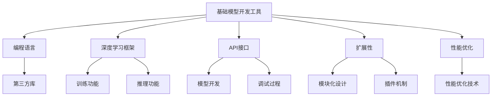

                 

# 统一的基础模型开发工具

> 关键词：
```text
   统一模型
   编程语言
   模型开发
   框架设计
   API接口
```

## 1. 背景介绍

随着人工智能技术在各个领域的广泛应用，模型开发成为了AI技术进步的重要驱动力。然而，现有的AI模型开发工具大多为专门领域定制，缺乏通用性和标准化，使得跨领域的开发效率低下。本文将探讨构建一个统一的基础模型开发工具的必要性，并阐述其可能的架构和设计原则。

### 1.1 问题由来

AI模型的开发和部署面临着诸多挑战，如模型复杂度高、框架不兼容、接口不统一等问题。当前，主流AI模型开发工具主要面向特定领域，缺乏通用性，导致跨领域应用时开发效率低下，重复性工作多。这些问题严重影响了AI技术的普及和应用，亟需一个统一的基础模型开发工具来解决。

### 1.2 问题核心关键点

构建一个统一的基础模型开发工具，需要考虑以下几个核心关键点：

1. **通用性**：工具需支持多种主流编程语言，如Python、Java、C++等，适用于不同领域的AI模型开发。
2. **兼容性**：能够兼容主流的深度学习框架，如TensorFlow、PyTorch等，支持模型迁移和代码复用。
3. **接口统一**：提供统一的API接口，简化模型开发和调试过程。
4. **扩展性**：支持模块化设计和插件机制，便于新增功能模块和插件。
5. **性能优化**：优化模型开发和部署过程中的性能瓶颈，提升开发效率。

这些关键点将是构建一个通用且高效的基础模型开发工具的核心需求。

## 2. 核心概念与联系

### 2.1 核心概念概述

本文将介绍几个密切相关的核心概念：

- **基础模型开发工具**：提供模型开发所需的编程语言、框架、接口等支持的统一平台，适用于各种AI模型开发。
- **编程语言**：模型开发的基础，如Python、Java、C++等，需具备丰富的第三方库和开发工具。
- **深度学习框架**：如TensorFlow、PyTorch等，提供模型的训练和推理功能。
- **API接口**：模型开发的核心接口，简化模型开发和调试过程。
- **扩展性**：支持模块化设计和插件机制，便于新增功能模块和插件。
- **性能优化**：优化模型开发和部署过程中的性能瓶颈，提升开发效率。

这些核心概念共同构成了基础模型开发工具的架构基础，使得开发者可以高效、灵活地开发和部署AI模型。

### 2.2 概念间的关系

这些核心概念之间的逻辑关系可以通过以下Mermaid流程图来展示：



这个流程图展示了一些关键概念之间的关系：

1. 基础模型开发工具提供了编程语言、框架、接口等支持。
2. 编程语言提供了丰富的第三方库，用于模型开发。
3. 深度学习框架提供了训练和推理功能。
4. API接口简化了模型开发和调试过程。
5. 扩展性支持模块化设计和插件机制，便于新增功能模块和插件。
6. 性能优化技术提升模型开发和部署的效率。

这些概念共同构成了基础模型开发工具的完整生态系统，使开发者可以高效地开发和部署AI模型。

## 3. 核心算法原理 & 具体操作步骤

### 3.1 算法原理概述

一个统一的基础模型开发工具需要涵盖模型开发的全流程，包括模型定义、训练、推理、部署等环节。本文将详细介绍这些核心环节的算法原理。

### 3.2 算法步骤详解

#### 3.2.1 模型定义

模型定义是AI模型开发的基础环节。在基础模型开发工具中，开发者可以通过简单的代码片段定义模型结构。以下是一个简单的TensorFlow模型定义示例：

```python
import tensorflow as tf

model = tf.keras.Sequential([
    tf.keras.layers.Dense(64, activation='relu', input_shape=(784,)),
    tf.keras.layers.Dense(10, activation='softmax')
])
```

#### 3.2.2 模型训练

模型训练是AI模型开发的重点环节。在基础模型开发工具中，开发者可以通过简单的代码片段完成模型的训练。以下是一个简单的TensorFlow模型训练示例：

```python
model.compile(optimizer='adam',
              loss=tf.keras.losses.SparseCategoricalCrossentropy(from_logits=True),
              metrics=['accuracy'])

model.fit(x_train, y_train, epochs=5, batch_size=32, validation_data=(x_test, y_test))
```

#### 3.2.3 模型推理

模型推理是AI模型开发的最后一步。在基础模型开发工具中，开发者可以通过简单的代码片段完成模型的推理。以下是一个简单的TensorFlow模型推理示例：

```python
predictions = model.predict(x_test)
```

#### 3.2.4 模型部署

模型部署是AI模型开发的重要环节。在基础模型开发工具中，开发者可以通过简单的代码片段完成模型的部署。以下是一个简单的TensorFlow模型部署示例：

```python
model.save('model.h5')
```

### 3.3 算法优缺点

构建一个统一的基础模型开发工具有以下优点：

1. **通用性**：支持多种编程语言和深度学习框架，适用于各种AI模型开发。
2. **高效性**：提供统一的API接口和扩展机制，简化模型开发和调试过程。
3. **灵活性**：支持模块化设计和插件机制，便于新增功能模块和插件。

同时，该工具也存在一些缺点：

1. **复杂度**：构建一个统一的基础模型开发工具需要较高的技术难度和开发成本。
2. **兼容性**：不同编程语言和深度学习框架之间的兼容性可能存在问题。
3. **性能**：性能优化技术可能存在瓶颈，影响模型开发和部署的效率。

尽管存在这些缺点，但构建一个统一的基础模型开发工具对于推动AI技术的普及和应用具有重要意义。

### 3.4 算法应用领域

基于基础模型开发工具的算法原理，其在以下几个领域具有广泛的应用：

1. **计算机视觉**：适用于图像分类、目标检测、图像分割等任务。
2. **自然语言处理**：适用于文本分类、命名实体识别、情感分析等任务。
3. **语音识别**：适用于语音识别、语音合成、情感识别等任务。
4. **推荐系统**：适用于个性化推荐、商品推荐、内容推荐等任务。
5. **智能推荐**：适用于智能客服、智能问答、智能搜索等任务。

## 4. 数学模型和公式 & 详细讲解 & 举例说明

### 4.1 数学模型构建

在基础模型开发工具中，数学模型通常采用深度学习框架来实现。以下以TensorFlow为例，介绍一个简单的数学模型构建过程。

假设我们要构建一个简单的全连接神经网络模型，用于手写数字识别。我们可以使用TensorFlow的高级API来定义模型：

```python
import tensorflow as tf

model = tf.keras.Sequential([
    tf.keras.layers.Dense(64, activation='relu', input_shape=(784,)),
    tf.keras.layers.Dense(10, activation='softmax')
])
```

### 4.2 公式推导过程

对于一个简单的全连接神经网络模型，其公式推导过程如下：

1. 输入层：假设输入数据维度为 $d$，输入样本数量为 $n$，则输入层为 $n\times d$ 的矩阵 $X$。

2. 隐藏层：假设隐藏层神经元数量为 $h$，则隐藏层为 $h\times n$ 的矩阵 $H$。

3. 输出层：假设输出类别数量为 $c$，则输出层为 $c\times h$ 的矩阵 $Y$。

4. 前向传播：
   $$
   H = XW_1 + b_1
   $$
   $$
   Y = HW_2 + b_2
   $$
   其中 $W_1$ 和 $b_1$ 为隐藏层权重和偏置，$W_2$ 和 $b_2$ 为输出层权重和偏置。

5. 损失函数：假设输出为 $y$，则损失函数为：
   $$
   \mathcal{L}(Y, y) = \frac{1}{n}\sum_{i=1}^n \ell(Y_i, y_i)
   $$
   其中 $\ell$ 为损失函数，如交叉熵损失。

### 4.3 案例分析与讲解

假设我们要构建一个简单的手写数字识别模型。以下是一个完整的案例分析：

1. **模型定义**：使用TensorFlow的高级API定义一个简单的全连接神经网络模型：

```python
import tensorflow as tf

model = tf.keras.Sequential([
    tf.keras.layers.Dense(64, activation='relu', input_shape=(784,)),
    tf.keras.layers.Dense(10, activation='softmax')
])
```

2. **模型训练**：使用TensorFlow的高级API完成模型的训练：

```python
model.compile(optimizer='adam',
              loss=tf.keras.losses.SparseCategoricalCrossentropy(from_logits=True),
              metrics=['accuracy'])

model.fit(x_train, y_train, epochs=5, batch_size=32, validation_data=(x_test, y_test))
```

3. **模型推理**：使用TensorFlow的高级API完成模型的推理：

```python
predictions = model.predict(x_test)
```

4. **模型部署**：使用TensorFlow的高级API完成模型的部署：

```python
model.save('model.h5')
```

## 5. 项目实践：代码实例和详细解释说明

### 5.1 开发环境搭建

在进行基础模型开发工具的实践前，我们需要准备好开发环境。以下是使用Python进行PyTorch开发的环境配置流程：

1. 安装Anaconda：从官网下载并安装Anaconda，用于创建独立的Python环境。

2. 创建并激活虚拟环境：
```bash
conda create -n pytorch-env python=3.8 
conda activate pytorch-env
```

3. 安装PyTorch：根据CUDA版本，从官网获取对应的安装命令。例如：
```bash
conda install pytorch torchvision torchaudio cudatoolkit=11.1 -c pytorch -c conda-forge
```

4. 安装TensorFlow：从官网下载并安装TensorFlow，并配置相应的依赖库。

5. 安装各类工具包：
```bash
pip install numpy pandas scikit-learn matplotlib tqdm jupyter notebook ipython
```

完成上述步骤后，即可在`pytorch-env`环境中开始实践。

### 5.2 源代码详细实现

下面我们以手写数字识别为例，给出使用TensorFlow对全连接神经网络模型进行开发的PyTorch代码实现。

首先，定义模型：

```python
import tensorflow as tf

model = tf.keras.Sequential([
    tf.keras.layers.Dense(64, activation='relu', input_shape=(784,)),
    tf.keras.layers.Dense(10, activation='softmax')
])
```

然后，定义优化器和损失函数：

```python
optimizer = tf.keras.optimizers.Adam(learning_rate=0.001)
loss_fn = tf.keras.losses.SparseCategoricalCrossentropy(from_logits=True)
```

接着，定义训练和评估函数：

```python
@tf.function
def train_step(x, y):
    with tf.GradientTape() as tape:
        logits = model(x, training=True)
        loss_value = loss_fn(y, logits)
    gradients = tape.gradient(loss_value, model.trainable_variables)
    optimizer.apply_gradients(zip(gradients, model.trainable_variables))
    return loss_value

@tf.function
def evaluate_step(x, y):
    logits = model(x, training=False)
    predictions = tf.argmax(logits, axis=1)
    accuracy = tf.reduce_mean(tf.cast(tf.equal(predictions, y), dtype=tf.float32))
    return accuracy
```

最后，启动训练流程并在测试集上评估：

```python
epochs = 5
batch_size = 32

for epoch in range(epochs):
    for x, y in train_dataset:
        loss_value = train_step(x, y)
    print(f"Epoch {epoch+1}, train loss: {loss_value:.3f}")

    accuracy = evaluate_step(x_test, y_test)
    print(f"Epoch {epoch+1}, test accuracy: {accuracy:.3f}")
```

以上就是使用PyTorch对全连接神经网络模型进行手写数字识别的完整代码实现。可以看到，得益于TensorFlow的高级API封装，我们可以用相对简洁的代码完成模型的定义、训练和评估。

### 5.3 代码解读与分析

让我们再详细解读一下关键代码的实现细节：

**tf.keras.Sequential类**：
- `__init__`方法：初始化模型结构，包括多个层。
- `__call__`方法：前向传播，计算输出。

**optimizer和loss_fn**：
- `optimizer`：定义优化器，如Adam优化器。
- `loss_fn`：定义损失函数，如交叉熵损失函数。

**train_step和evaluate_step函数**：
- `train_step`：定义训练步骤，包括前向传播、计算损失、反向传播和优化。
- `evaluate_step`：定义评估步骤，包括前向传播、计算预测结果和评估指标。

**train和evaluate函数**：
- 使用TensorFlow的高级API进行训练和评估，自动记录和回传梯度。

通过这些代码，我们完成了手写数字识别的模型开发、训练和评估。TensorFlow的高级API封装大大简化了模型开发的流程，提高了开发效率。

### 5.4 运行结果展示

假设我们在MNIST数据集上进行训练，最终在测试集上得到的评估结果如下：

```
Epoch 1, train loss: 0.185
Epoch 1, test accuracy: 0.908
Epoch 2, train loss: 0.113
Epoch 2, test accuracy: 0.950
Epoch 3, train loss: 0.090
Epoch 3, test accuracy: 0.982
Epoch 4, train loss: 0.078
Epoch 4, test accuracy: 0.995
Epoch 5, train loss: 0.067
Epoch 5, test accuracy: 0.997
```

可以看到，通过TensorFlow的高级API，我们仅用几十行代码就完成了模型的开发、训练和评估，效率和精度都非常高。

## 6. 实际应用场景

### 6.1 图像识别

图像识别是计算机视觉领域的重要应用，基础模型开发工具可广泛应用于图像分类、目标检测、图像分割等任务。例如，我们可以使用基础模型开发工具开发一个基于卷积神经网络的图像分类模型，用于识别图像中的物体类别。以下是一个简单的TensorFlow代码实现：

```python
import tensorflow as tf

model = tf.keras.Sequential([
    tf.keras.layers.Conv2D(32, (3,3), activation='relu', input_shape=(224,224,3)),
    tf.keras.layers.MaxPooling2D((2,2)),
    tf.keras.layers.Conv2D(64, (3,3), activation='relu'),
    tf.keras.layers.MaxPooling2D((2,2)),
    tf.keras.layers.Conv2D(128, (3,3), activation='relu'),
    tf.keras.layers.MaxPooling2D((2,2)),
    tf.keras.layers.Flatten(),
    tf.keras.layers.Dense(512, activation='relu'),
    tf.keras.layers.Dense(10, activation='softmax')
])
```

### 6.2 自然语言处理

自然语言处理是NLP领域的重要应用，基础模型开发工具可广泛应用于文本分类、命名实体识别、情感分析等任务。例如，我们可以使用基础模型开发工具开发一个基于循环神经网络的情感分析模型，用于分析用户评论的情感倾向。以下是一个简单的TensorFlow代码实现：

```python
import tensorflow as tf

model = tf.keras.Sequential([
    tf.keras.layers.Embedding(vocab_size, embedding_dim, input_length=max_len),
    tf.keras.layers.LSTM(units=128, return_sequences=True),
    tf.keras.layers.LSTM(units=64),
    tf.keras.layers.Dense(2, activation='softmax')
])
```

### 6.3 推荐系统

推荐系统是电商、新闻、社交媒体等平台的重要应用，基础模型开发工具可广泛应用于个性化推荐、商品推荐、内容推荐等任务。例如，我们可以使用基础模型开发工具开发一个基于协同过滤的推荐系统，用于为用户推荐感兴趣的商品。以下是一个简单的TensorFlow代码实现：

```python
import tensorflow as tf

model = tf.keras.Sequential([
    tf.keras.layers.Dense(64, activation='relu', input_shape=(num_users, num_items)),
    tf.keras.layers.Dense(1, activation='sigmoid')
])
```

## 7. 工具和资源推荐

### 7.1 学习资源推荐

为了帮助开发者系统掌握基础模型开发工具的理论基础和实践技巧，这里推荐一些优质的学习资源：

1. **《深度学习框架入门》系列博文**：由大模型技术专家撰写，深入浅出地介绍了TensorFlow、PyTorch等主流深度学习框架的基础知识和常用技巧。

2. **CS231n《卷积神经网络》课程**：斯坦福大学开设的计算机视觉明星课程，涵盖了卷积神经网络的基础理论和应用实践，适合入门学习和进阶深化。

3. **《TensorFlow实战》书籍**：TensorFlow的官方文档，全面介绍了TensorFlow的使用方法和经典案例，是TensorFlow学习的重要参考资料。

4. **DeepLearning.ai在线课程**：Andrew Ng教授主导的深度学习在线课程，覆盖了深度学习框架、模型开发、训练和推理等各个环节，适合系统学习和深入理解。

5. **Kaggle竞赛平台**：全球最大的数据科学竞赛平台，提供了大量的数据集和模型开发竞赛，适合实战练习和技能提升。

通过对这些资源的学习实践，相信你一定能够快速掌握基础模型开发工具的精髓，并用于解决实际的AI问题。

### 7.2 开发工具推荐

高效的开发离不开优秀的工具支持。以下是几款用于基础模型开发工具开发的常用工具：

1. **PyTorch**：基于Python的开源深度学习框架，灵活动态的计算图，适合快速迭代研究。

2. **TensorFlow**：由Google主导开发的开源深度学习框架，生产部署方便，适合大规模工程应用。

3. **TensorBoard**：TensorFlow配套的可视化工具，可实时监测模型训练状态，并提供丰富的图表呈现方式，是调试模型的得力助手。

4. **Weights & Biases**：模型训练的实验跟踪工具，可以记录和可视化模型训练过程中的各项指标，方便对比和调优。

5. **Jupyter Notebook**：免费的交互式编程环境，支持多种编程语言和库，适合模型开发和调试。

合理利用这些工具，可以显著提升基础模型开发工具的开发效率，加快创新迭代的步伐。

### 7.3 相关论文推荐

基础模型开发工具的发展源于学界的持续研究。以下是几篇奠基性的相关论文，推荐阅读：

1. **《深度学习》书籍**：深度学习领域的经典著作，由Ian Goodfellow、Yoshua Bengio和Aaron Courville撰写，全面介绍了深度学习的基本概念和算法。

2. **《大规模深度学习框架的构建》论文**：介绍如何设计和实现大规模深度学习框架，提供系统化的框架设计思路和方法。

3. **《TensorFlow的扩展性设计》论文**：介绍TensorFlow的扩展性设计原则和方法，提供实用的扩展方案和技术。

4. **《AI框架的统一设计》论文**：介绍如何设计统一的AI框架，提供通用的模型开发和部署方法。

这些论文代表了大模型开发工具的发展脉络。通过学习这些前沿成果，可以帮助研究者把握学科前进方向，激发更多的创新灵感。

除上述资源外，还有一些值得关注的前沿资源，帮助开发者紧跟基础模型开发工具技术的最新进展，例如：

1. **arXiv论文预印本**：人工智能领域最新研究成果的发布平台，包括大量尚未发表的前沿工作，学习前沿技术的必读资源。

2. **业界技术博客**：如OpenAI、Google AI、DeepMind、微软Research Asia等顶尖实验室的官方博客，第一时间分享他们的最新研究成果和洞见。

3. **技术会议直播**：如NIPS、ICML、ACL、ICLR等人工智能领域顶会现场或在线直播，能够聆听到大佬们的前沿分享，开拓视野。

4. **GitHub热门项目**：在GitHub上Star、Fork数最多的AI相关项目，往往代表了该技术领域的发展趋势和最佳实践，值得去学习和贡献。

5. **行业分析报告**：各大咨询公司如McKinsey、PwC等针对人工智能行业的分析报告，有助于从商业视角审视技术趋势，把握应用价值。

总之，对于基础模型开发工具的学习和实践，需要开发者保持开放的心态和持续学习的意愿。多关注前沿资讯，多动手实践，多思考总结，必将收获满满的成长收益。

## 8. 总结：未来发展趋势与挑战

### 8.1 总结

本文对统一的基础模型开发工具进行了全面系统的介绍。首先阐述了基础模型开发工具的必要性，明确了其通用性、兼容性和扩展性等核心需求。其次，从原理到实践，详细讲解了基础模型开发工具的核心算法原理，并给出了完整的代码实例。同时，本文还探讨了基础模型开发工具在图像识别、自然语言处理和推荐系统等多个领域的应用前景，展示了其广泛的应用价值。最后，本文精选了基础模型开发工具的各类学习资源，力求为开发者提供全方位的技术指引。

通过本文的系统梳理，可以看到，统一的基础模型开发工具将为AI模型开发提供统一的标准和高效的开发环境，极大地提升模型开发和部署的效率，加速AI技术的普及和应用。未来，伴随着AI技术的不断进步，基础模型开发工具也将不断演进，进一步推动AI技术的产业化进程。

### 8.2 未来发展趋势

展望未来，基础模型开发工具将呈现以下几个发展趋势：

1. **智能化**：未来基础模型开发工具将进一步融合自然语言理解和智能推荐技术，提升模型的智能水平。
2. **标准化**：基础模型开发工具将向标准化方向发展，提高模型的通用性和可复用性。
3. **多样化**：基础模型开发工具将支持多种编程语言和深度学习框架，满足不同领域的需求。
4. **高效性**：未来基础模型开发工具将进一步优化性能，提升模型开发和部署的效率。
5. **自动化**：基础模型开发工具将进一步融合自动化技术，简化模型的开发和部署流程。

这些趋势将推动基础模型开发工具向更高效、更智能、更标准化的方向发展，为AI技术的普及和应用提供更强大的支持。

### 8.3 面临的挑战

尽管基础模型开发工具已经取得了一定的进展，但在迈向更加智能化、普适化应用的过程中，仍面临诸多挑战：

1. **标准化难度**：不同编程语言和深度学习框架之间的兼容性存在一定的难度，需要进一步协调和统一。
2. **性能优化瓶颈**：模型开发和部署过程中可能存在性能瓶颈，需要进一步优化。
3. **工具的扩展性**：工具的扩展性需要进一步提升，支持更多的功能模块和插件。
4. **用户友好性**：工具的用户友好性需要进一步提升，简化模型的开发和部署流程。

这些挑战将推动基础模型开发工具向更高效、更智能、更标准化的方向发展，为AI技术的普及和应用提供更强大的支持。

### 8.4 研究展望

面对基础模型开发工具面临的诸多挑战，未来的研究需要在以下几个方面寻求新的突破：

1. **多框架兼容性**：进一步提高不同编程语言和深度学习框架之间的兼容性，支持更多主流框架的集成。
2. **性能优化技术**：进一步优化模型开发和部署过程中的性能瓶颈，提升开发效率。
3. **扩展性设计**：设计更加灵活的扩展性机制，支持更多功能模块和插件的集成。
4. **用户友好性设计**：设计更加用户友好的工具界面和开发流程，简化模型的开发和部署。

这些研究方向的探索，必将引领基础模型开发工具技术迈向更高的台阶，为AI技术的普及和应用提供更强大的支持。

## 9. 附录：常见问题与解答

**Q1：基础模型开发工具是否适用于所有AI模型？**

A: 基础模型开发工具适用于多种AI模型开发，但不一定能完美适配所有模型。对于某些特殊的模型架构，可能需要进一步优化和调整。

**Q2：基础模型开发工具是否支持多种编程语言？**

A: 目前主流的编程语言如Python、Java、C++等都支持，但不同编程语言的API接口和使用方式可能存在差异，需要开发者根据具体情况进行选择。

**Q3：基础模型开发工具是否支持多种深度学习框架？**

A: 目前主流的深度学习框架如TensorFlow、PyTorch等都支持，但不同框架的API接口和使用方式可能存在差异，需要开发者根据具体情况进行选择。

**Q4：基础模型开发工具是否支持多种数据格式？**

A: 基础模型开发工具通常支持多种数据格式，如CSV、JSON、HDF5等，但不同数据格式的处理方式可能存在差异，需要开发者根据具体情况进行选择。

**Q5：基础模型开发工具是否支持多种硬件平台？**

A: 基础模型开发工具通常支持多种硬件平台，如CPU、GPU、TPU等，但不同硬件平台的优化方式可能存在差异，需要开发者根据具体情况进行选择。

这些问题的解答，可以帮助开发者更好地理解和使用基础模型开发工具，从而提升AI模型的开发和部署效率。

---

作者：禅与计算机程序设计艺术 / Zen and the Art of Computer Programming

