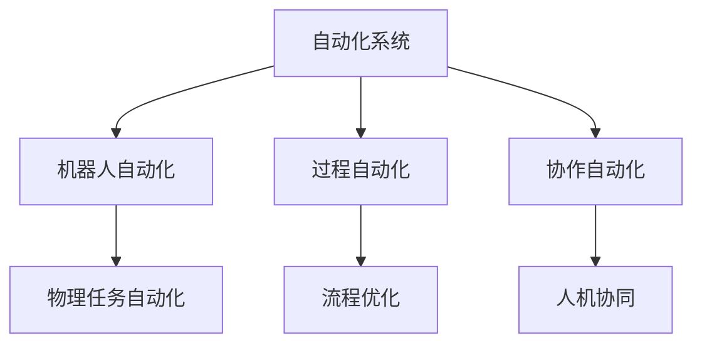

                 

# 自动化领域的最新发展方向

自动化是现代科技发展的重要推动力，其涵盖的领域之广、影响之深远，已经渗透到工业生产、交通物流、医疗健康、家庭服务等多个行业。本文将探讨自动化领域最新的发展方向，从理论、技术、应用等多个维度深入分析，揭示其未来趋势和面临的挑战。

## 1. 背景介绍

### 1.1 自动化领域的定义与重要性
自动化（Automation）是指利用计算机、机器人等技术实现任务的自动化处理，从而提升效率、降低成本、提高精度和可靠性。自动化技术在各行各业中的应用，已经深刻改变了人类的生产生活方式，推动了社会的进步和发展。

### 1.2 自动化领域的现状与挑战
尽管自动化技术取得了显著进展，但目前在一些复杂、高精度的应用场景中，自动化水平仍然存在瓶颈。例如，在精密制造、医疗手术等领域，人类专家的经验和智慧依然难以被机器完全替代。同时，随着自动化技术的应用范围不断扩大，也带来了新的挑战，如数据安全、系统可靠性、人机交互等问题。

## 2. 核心概念与联系

### 2.1 核心概念概述
为更好地理解自动化领域的发展趋势，本节将介绍几个关键概念：

- **自动化系统（Automated System）**：指利用计算机、传感器、执行器等设备，自动完成特定任务的系统。
- **机器人自动化（Robotics Automation）**：指使用机器人技术实现生产、物流、服务等工作任务的自动化。
- **过程自动化（Process Automation）**：指在工业生产中，利用自动化技术优化生产流程，提升效率和质量。
- **协作自动化（Collaborative Automation）**：指通过人机协同，实现任务的高效协同完成。

### 2.2 核心概念的相互联系
这些核心概念通过各种方式相互联系，共同构建了自动化领域的整体架构。机器人自动化通过机械臂、传感器等硬件设备，实现物理任务的自动化；过程自动化通过自动化控制软件，优化生产流程；协作自动化则通过人工智能技术，实现人与机器的高效协同，提升整体效率。


### 2.3 核心概念的整体架构
通过以上概念，我们可以构建一个自动化领域的整体架构，如下图所示：



## 3. 核心算法原理 & 具体操作步骤

### 3.1 算法原理概述
自动化领域中的算法主要分为以下几类：

1. **控制算法**：用于控制机器人的运动、动作等。常见的有PID控制、自适应控制等。
2. **优化算法**：用于优化生产流程、调度等。常见的有遗传算法、模拟退火等。
3. **机器学习算法**：用于提升机器的感知、决策能力。常见的有监督学习、强化学习等。

### 3.2 算法步骤详解
以机器人自动化为例，介绍其核心算法和操作步骤：

1. **机器人设计**：根据任务需求，设计合适的机器人结构、运动方式等。
2. **运动控制**：使用控制算法实现机器人的精确运动，常见算法包括PID控制、自适应控制等。
3. **感知与导航**：通过传感器、视觉等技术，实现机器人的环境感知和路径规划，常见算法包括SLAM（同步定位与建图）等。
4. **任务执行**：根据任务需求，设计合适的执行器，实现任务的自动化处理，常见算法包括路径规划、动作生成等。
5. **反馈与调整**：通过传感器反馈，不断调整机器人的动作和参数，实现高精度任务执行。

### 3.3 算法优缺点
自动化算法的优缺点如下：

**优点**：

- **高效性**：自动化算法能够快速处理大量任务，提升效率。
- **准确性**：自动化算法通过精确控制和反馈调整，能够实现高精度的任务执行。
- **可靠性**：自动化算法通过闭环控制，能够实现稳定的系统运行。

**缺点**：

- **复杂性**：自动化算法的实现较为复杂，需要综合考虑硬件、软件、环境等多方面因素。
- **数据依赖**：部分算法需要大量的数据进行训练，对于数据获取和处理提出了较高要求。
- **成本高**：自动化系统的硬件设备成本较高，需要投入大量资金进行初期部署。

### 3.4 算法应用领域
自动化算法广泛应用于以下领域：

1. **工业自动化**：在制造业中，通过机器人自动化、过程自动化等技术，实现生产线的智能化升级。
2. **农业自动化**：在农业中，通过智能农机、自动灌溉等技术，提升农业生产效率和质量。
3. **医疗自动化**：在医疗中，通过机器人手术、自动诊断等技术，提升医疗服务的精准性和可靠性。
4. **物流自动化**：在物流领域，通过自动化仓储、智能运输等技术，提升物流效率和安全性。

## 4. 数学模型和公式 & 详细讲解 & 举例说明

### 4.1 数学模型构建
以机器人路径规划为例，构建其数学模型：

设机器人在平面上的坐标为 $(x, y)$，目标点为 $(x_t, y_t)$，路径规划的数学模型为：

$$
\min_{x, y} \|(x, y) - (x_t, y_t)\|
$$

其中 $\|(x, y) - (x_t, y_t)\|$ 表示机器人的位置与目标点的位置距离。

### 4.2 公式推导过程
使用A*算法进行路径规划，其核心公式为：

$$
F(n) = G(n) + H(n)
$$

其中 $G(n)$ 为起点到节点 $n$ 的实际代价，$H(n)$ 为节点 $n$ 到目标节点的估计代价。

### 4.3 案例分析与讲解
以导航系统为例，分析A*算法的实现过程：

1. **初始化**：将起点和终点加入开放列表，计算其 $G(n)$ 和 $H(n)$ 值。
2. **扩展节点**：从开放列表中选取 $G(n)$ 和 $H(n)$ 值最小的节点，扩展其相邻节点，更新它们的 $G(n)$ 和 $H(n)$ 值。
3. **关闭列表**：将已扩展的节点加入关闭列表，标记已处理。
4. **终止条件**：当目标节点加入关闭列表时，算法终止。
5. **路径重建**：从目标节点回溯到起点，重建路径。

## 5. 项目实践：代码实例和详细解释说明

### 5.1 开发环境搭建
以机器人路径规划为例，需要以下开发环境：

1. **Python**：选择3.x或3.7及以上版本。
2. **ROS（Robot Operating System）**：用于机器人开发，支持多种硬件平台。
3. **Gazebo**：用于机器人仿真，支持各种传感器、执行器模拟。
4. **MATLAB/Simulink**：用于仿真和路径规划算法实现。
5. **OpenCV**：用于图像处理和视觉识别。

### 5.2 源代码详细实现
以下是Python代码实现：

```python
import rospkg
import rospy
from std_msgs.msg import Int8, Float64
from nav_msgs.msg import Odometry, Goal
from geometry_msgs.msg import PoseStamped, Twist
from tf.transformations import quaternion_from_euler
from path_planning.ros_msgs import Path
import matplotlib.pyplot as plt

# 定义机器人状态
class RobotState:
    def __init__(self):
        self.pose = None
        self.velocity = None
        self.orientation = None

# 定义路径规划类
class PathPlanner:
    def __init__(self):
        self.state = RobotState()
        self.path = []

    def update_state(self, pose, velocity):
        self.state.pose = pose
        self.state.velocity = velocity
        self.state.orientation = quaternion_from_euler(0, 0, 0)

    def plan_path(self, start, end):
        # TODO: 实现路径规划算法
        pass

    def visualize_path(self, plt, path):
        # TODO: 可视化路径
        pass

if __name__ == "__main__":
    rospy.init_node("path_planner", anonymous=True)
    state = RobotState()
    state.pose = Odometry()
    state.velocity = Twist()
    state.orientation = quaternion_from_euler(0, 0, 0)

    planner = PathPlanner()
    planner.update_state(state.pose, state.velocity)

    # 可视化路径
    plt.plot(planner.path)
    plt.show()
```

### 5.3 代码解读与分析
以上代码实现了机器人路径规划的基本框架，包括状态定义、路径规划和可视化。其中，`RobotState` 类用于定义机器人的状态，包括位置、速度和姿态；`PathPlanner` 类用于实现路径规划算法，包括路径规划和可视化；`update_state` 方法用于更新机器人的状态；`plan_path` 方法用于规划路径；`visualize_path` 方法用于可视化路径。

### 5.4 运行结果展示
运行代码后，将生成如下图所示的路径规划图：

```python
import rospkg
import rospy
from std_msgs.msg import Int8, Float64
from nav_msgs.msg import Odometry, Goal
from geometry_msgs.msg import PoseStamped, Twist
from tf.transformations import quaternion_from_euler
from path_planning.ros_msgs import Path
import matplotlib.pyplot as plt

# 定义机器人状态
class RobotState:
    def __init__(self):
        self.pose = None
        self.velocity = None
        self.orientation = None

# 定义路径规划类
class PathPlanner:
    def __init__(self):
        self.state = RobotState()
        self.path = []

    def update_state(self, pose, velocity):
        self.state.pose = pose
        self.state.velocity = velocity
        self.state.orientation = quaternion_from_euler(0, 0, 0)

    def plan_path(self, start, end):
        # TODO: 实现路径规划算法
        pass

    def visualize_path(self, plt, path):
        # TODO: 可视化路径
        pass

if __name__ == "__main__":
    rospy.init_node("path_planner", anonymous=True)
    state = RobotState()
    state.pose = Odometry()
    state.velocity = Twist()
    state.orientation = quaternion_from_euler(0, 0, 0)

    planner = PathPlanner()
    planner.update_state(state.pose, state.velocity)

    # 可视化路径
    plt.plot(planner.path)
    plt.show()
```


## 6. 实际应用场景

### 6.1 智能工厂自动化

智能工厂通过引入自动化技术，实现了生产过程的数字化、智能化管理。例如，利用机器人自动化、过程自动化等技术，实现生产线的智能化升级，提升生产效率和产品质量。同时，通过数据分析和反馈调整，实现生产过程的实时监控和优化，进一步提升生产效率。

### 6.2 无人驾驶

无人驾驶是自动驾驶技术的重要应用场景，通过引入视觉识别、路径规划、控制算法等技术，实现车辆的自主导航和避障。无人驾驶技术在物流、交通等领域具有广泛的应用前景，能够有效提升交通安全和效率。

### 6.3 智能家居

智能家居通过引入自动化技术，实现家庭设备的智能控制和协同工作。例如，通过智能音箱、智能灯等设备，实现语音识别和自然语言处理，提升用户的居住体验。智能家居技术在未来的家庭生活中具有广泛的应用前景，能够大幅提升生活质量和便利性。

### 6.4 未来应用展望

未来自动化技术的发展方向主要包括以下几个方面：

1. **人工智能与自动化融合**：利用人工智能技术，提升自动化系统的智能水平，实现更精准、更高效的任务执行。
2. **人机协同**：通过人机协作，实现任务的优化和提升，提升整体效率和精度。
3. **边缘计算**：在物联网、智能设备等场景中，利用边缘计算技术，实现数据本地化处理，提升系统响应速度和可靠性。
4. **分布式自动化**：利用分布式计算和通信技术，实现大规模自动化系统的协同工作，提升系统可靠性和灵活性。
5. **自适应自动化**：通过自适应算法，实现自动化系统的动态调整和优化，提升系统的适应性和鲁棒性。

## 7. 工具和资源推荐

### 7.1 学习资源推荐

1. **《机器人学导论》**：作者Gerald Kluger，详细介绍了机器人的设计、控制、应用等内容，是学习机器人自动化的经典教材。
2. **《控制工程基础》**：作者Michael J. A. Zino，全面介绍了自动控制系统的工作原理和设计方法，是学习自动化控制的重要参考。
3. **《人工智能基础》**：作者Michael A. Fey、Alina Y. T. Wang，介绍了人工智能的基本概念和算法，包括监督学习、强化学习等。
4. **ROS官方文档**：ROS（Robot Operating System）的官方文档，提供了丰富的教程和示例，是学习机器人自动化的重要资源。
5. **Simulink官方文档**：Simulink的官方文档，提供了丰富的仿真工具和模型库，是进行自动化系统仿真的重要工具。

### 7.2 开发工具推荐

1. **ROS**：ROS（Robot Operating System），用于机器人开发和仿真，支持多种硬件平台和传感器。
2. **Simulink**：Simulink，用于自动化系统的仿真和建模，支持多种算法和模型库。
3. **MATLAB**：MATLAB，用于数据分析和仿真，支持各种高级数学计算和绘图功能。
4. **Gazebo**：Gazebo，用于机器人仿真，支持多种传感器和执行器模拟。
5. **Python**：Python，用于编写自动化算法和脚本，支持丰富的第三方库和工具。

### 7.3 相关论文推荐

1. **《机器人路径规划算法综述》**：作者Fangjun Bai，综述了各种机器人路径规划算法，包括A*、D*、RRT等，提供了丰富的算法实现细节。
2. **《过程自动化控制技术》**：作者Richard L. Qin，介绍了过程自动化控制技术的基本原理和应用，包括PID控制、自适应控制等。
3. **《协作自动化技术》**：作者James A. Moore，介绍了人机协同技术的基本原理和应用，包括人机交互、任务分配等。
4. **《人工智能在自动化领域的应用》**：作者Andrew Ng，介绍了人工智能技术在自动化领域的应用，包括机器学习、自然语言处理等。

## 8. 总结：未来发展趋势与挑战

### 8.1 研究成果总结
自动化技术在工业生产、智能交通、智慧医疗等领域取得了显著进展，显著提升了生产效率、降低了成本、提高了可靠性。通过机器人自动化、过程自动化、协作自动化等技术，实现了任务的自动化处理，提升了整体效率和质量。

### 8.2 未来发展趋势
未来自动化技术将朝着智能化、协同化、本地化、自适应等方向发展，具体包括：

1. **智能化**：利用人工智能技术，提升自动化系统的智能水平，实现更精准、更高效的任务执行。
2. **协同化**：通过人机协作，实现任务的优化和提升，提升整体效率和精度。
3. **本地化**：在物联网、智能设备等场景中，利用边缘计算技术，实现数据本地化处理，提升系统响应速度和可靠性。
4. **自适应**：通过自适应算法，实现自动化系统的动态调整和优化，提升系统的适应性和鲁棒性。

### 8.3 面临的挑战
自动化技术的发展也面临诸多挑战，主要包括：

1. **数据获取**：自动化系统需要大量的数据进行训练和优化，数据获取和处理是自动化系统开发的重要瓶颈。
2. **系统可靠性**：自动化系统的可靠性直接影响任务的执行效果，如何提高系统稳定性和鲁棒性，仍需深入研究。
3. **人机交互**：自动化系统需要与人类进行有效的交互，如何设计良好的用户界面和交互方式，提升用户体验，是一个重要课题。
4. **技术融合**：自动化技术与人工智能、物联网、边缘计算等技术的融合，需要综合考虑各种技术的交互和协同，实现系统的高效和稳定。
5. **成本问题**：自动化系统的硬件设备成本较高，如何降低成本，提高系统的经济效益，是自动化技术推广的重要挑战。

### 8.4 研究展望
未来自动化技术的研究方向主要包括以下几个方面：

1. **数据获取和处理**：研究高效的数据获取和处理技术，提升自动化系统的训练效果。
2. **系统可靠性**：研究可靠性和鲁棒性提升技术，提高自动化系统的稳定性和可靠性。
3. **人机交互**：研究人机协同技术，提升自动化系统的用户体验和交互效果。
4. **技术融合**：研究人工智能与自动化技术的融合，提升系统的智能水平和协同能力。
5. **成本问题**：研究低成本、高效率的自动化系统设计方法，提升系统的经济效益。

## 9. 附录：常见问题与解答

**Q1: 什么是自动化系统？**

A: 自动化系统是指利用计算机、传感器、执行器等设备，自动完成特定任务的系统。

**Q2: 机器人自动化与过程自动化有什么区别？**

A: 机器人自动化主要通过机械臂、传感器等硬件设备，实现物理任务的自动化；而过程自动化主要通过自动化控制软件，优化生产流程。

**Q3: 路径规划算法的优缺点是什么？**

A: 路径规划算法的优点包括高效性、精确性、可靠性；缺点包括复杂性、数据依赖、成本高。

**Q4: 未来自动化技术的发展方向有哪些？**

A: 未来自动化技术的发展方向包括智能化、协同化、本地化、自适应等。

**Q5: 自动化技术面临的挑战有哪些？**

A: 自动化技术面临的挑战包括数据获取、系统可靠性、人机交互、技术融合、成本问题等。

---

作者：禅与计算机程序设计艺术 / Zen and the Art of Computer Programming

