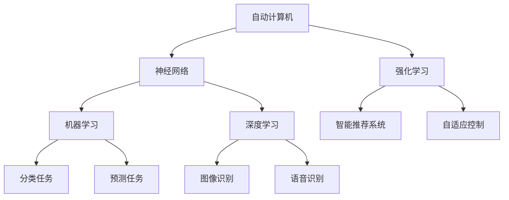

                 

# 自动计算机与神经网络的研究

> 关键词：自动计算机,神经网络,强化学习,机器学习,深度学习,人工智能,前沿技术

## 1. 背景介绍

### 1.1 问题由来

随着人工智能技术的不断进步，自动计算机和神经网络成为了当前研究的热点。自动计算机是指通过计算机程序自动生成计算机程序的过程，而神经网络则是一种基于生物神经元模型的计算模型，广泛应用于机器学习和深度学习领域。

自动计算机与神经网络的研究，旨在构建能够自动生成并执行特定任务的计算机程序，提高计算机程序的智能化和自动化水平。在人工智能领域，这一研究领域涵盖了自动程序设计、智能推荐、自适应控制、强化学习等多个方向，具有广泛的应用前景。

### 1.2 问题核心关键点

自动计算机与神经网络的核心问题主要包括：

1. **自动化程序设计**：如何通过神经网络模型自动生成具有特定功能的计算机程序。
2. **智能推荐系统**：如何基于用户行为数据，通过神经网络模型推荐符合用户兴趣的内容。
3. **自适应控制**：如何通过神经网络模型实现环境的自动适应和控制。
4. **强化学习**：如何通过神经网络模型，利用奖励信号训练智能体进行决策和学习。

这些核心问题通过神经网络模型的应用，进一步推动了机器学习、深度学习、人工智能等前沿技术的发展，为未来计算机程序的设计和优化提供了新的思路和方法。

### 1.3 问题研究意义

自动计算机与神经网络的研究，对于推动人工智能技术的发展和应用具有重要意义：

1. **提升自动化水平**：通过自动计算机和神经网络的研究，可以大幅提升计算机程序的自动化水平，减少人工干预，提高生产效率。
2. **优化推荐系统**：智能推荐系统能够更好地理解用户需求，提供更加个性化和精准的内容推荐，提升用户体验。
3. **增强自适应能力**：自适应控制技术可以使得机器在复杂环境中更加灵活和稳定，适应不同的应用场景。
4. **强化学习应用**：强化学习通过神经网络模型实现智能决策，在自动驾驶、游戏AI等领域具有广泛应用前景。

## 2. 核心概念与联系

### 2.1 核心概念概述

自动计算机与神经网络涉及多个关键概念，包括自动计算机、神经网络、强化学习、机器学习、深度学习等。这些概念通过相互关联，构成了研究领域的核心架构。

- **自动计算机**：通过计算机程序自动生成计算机程序的过程，通常使用遗传算法、神经网络等方法实现。
- **神经网络**：基于生物神经元模型的计算模型，由多个神经元节点和连接组成，广泛用于机器学习和深度学习任务。
- **强化学习**：通过智能体在环境中的交互，利用奖励信号进行学习，优化决策过程。
- **机器学习**：通过数据驱动的方式，训练模型进行分类、预测等任务。
- **深度学习**：一种基于多层神经网络的机器学习方法，广泛应用于图像识别、语音识别等领域。

### 2.2 概念间的关系

这些核心概念之间的关系可以通过以下Mermaid流程图来展示：



这个流程图展示了几大核心概念之间的相互关系：

1. 自动计算机和神经网络通过遗传算法、神经网络等方法实现，是智能推荐系统、自适应控制、强化学习等应用的基础。
2. 机器学习和深度学习是自动计算机和神经网络的重要组成部分，提供数据驱动的训练和优化方法。
3. 强化学习通过智能体在环境中的交互，利用奖励信号进行学习，优化决策过程。
4. 智能推荐系统通过神经网络模型，根据用户行为数据推荐内容。
5. 自适应控制通过神经网络模型，实现环境的自动适应和控制。

这些概念共同构成了自动计算机与神经网络研究的完整生态系统，推动了人工智能技术的发展和应用。

## 3. 核心算法原理 & 具体操作步骤

### 3.1 算法原理概述

自动计算机与神经网络的算法原理，主要涉及以下几个方面：

- **遗传算法**：通过模拟生物进化过程，随机生成和变异计算机程序，逐步优化生成最优程序的过程。
- **神经网络**：通过多层神经元的组合，实现复杂的计算和决策任务，如分类、回归、预测等。
- **强化学习**：通过智能体在环境中的交互，利用奖励信号进行学习，优化决策过程。

这些算法通过相互结合，实现了自动计算机和神经网络在实际应用中的优化和提升。

### 3.2 算法步骤详解

自动计算机与神经网络的研究，主要包括以下几个关键步骤：

**Step 1: 数据准备**
- 收集和预处理需要生成程序的任务数据，如代码片段、需求描述等。
- 将数据分为训练集、验证集和测试集。

**Step 2: 模型选择**
- 根据任务类型，选择合适的神经网络模型，如RNN、CNN、LSTM等。
- 确定模型的结构和超参数，如层数、节点数、学习率等。

**Step 3: 训练与优化**
- 使用训练集数据，对神经网络模型进行训练和优化。
- 使用验证集数据，对模型进行调参和优化。

**Step 4: 评估与测试**
- 使用测试集数据，对模型进行评估和测试。
- 根据评估结果，对模型进行进一步的调整和优化。

**Step 5: 应用与部署**
- 将优化后的模型应用于实际任务中。
- 部署到生产环境中，进行实时计算和推理。

### 3.3 算法优缺点

自动计算机与神经网络的研究，具有以下优点：

1. **高效性**：通过自动生成和优化程序，大幅提升程序设计的效率。
2. **智能化**：利用神经网络模型，实现智能推荐和自适应控制。
3. **适应性**：强化学习算法能够适应复杂多变的环境，提高系统的鲁棒性和稳定性。

但同时也存在以下缺点：

1. **高成本**：神经网络模型的训练和优化需要大量的计算资源和时间，成本较高。
2. **复杂性**：神经网络模型的设计和调参较为复杂，需要专业知识和技术积累。
3. **可解释性不足**：神经网络模型通常被视为"黑盒"，缺乏可解释性，难以进行调试和优化。

### 3.4 算法应用领域

自动计算机与神经网络的研究，已经在多个领域得到了广泛应用，包括但不限于：

- **自动程序设计**：通过神经网络模型，自动生成和优化程序代码。
- **智能推荐系统**：通过神经网络模型，推荐符合用户兴趣的内容。
- **自适应控制**：通过神经网络模型，实现环境的自动适应和控制。
- **强化学习**：通过神经网络模型，训练智能体进行决策和学习。
- **计算机视觉**：通过神经网络模型，进行图像识别、分类、检测等任务。
- **语音识别**：通过神经网络模型，实现语音识别、转写、翻译等任务。

## 4. 数学模型和公式 & 详细讲解 & 举例说明

### 4.1 数学模型构建

自动计算机与神经网络的数学模型，主要涉及以下几个方面：

- **神经网络模型**：由输入层、隐藏层和输出层组成，通过神经元节点的激活函数实现计算。
- **遗传算法模型**：通过模拟生物进化过程，生成和优化计算机程序。
- **强化学习模型**：通过智能体在环境中的交互，利用奖励信号进行学习。

### 4.2 公式推导过程

以下是几个核心模型的公式推导过程：

**神经网络模型**

假设输入为 $x$，输出为 $y$，隐藏层为 $h$，激活函数为 $f$。神经网络模型的公式为：

$$
y = W_2f(W_1x + b_1) + b_2
$$

其中 $W_1$ 和 $W_2$ 为权重矩阵，$b_1$ 和 $b_2$ 为偏置向量。

**遗传算法模型**

遗传算法模型通过模拟生物进化过程，生成和优化计算机程序。其核心思想是通过交叉和变异操作，逐步优化程序的结构和性能。

假设初始种群数量为 $P$，基因编码长度为 $L$，交叉概率为 $p_c$，变异概率为 $p_m$。遗传算法模型的公式为：

$$
x_{n+1} = \text{Sel}(\{x_i\}) \times \text{Crossover}(\{x_i\},p_c) \times \text{Mutation}(\{x_i\},p_m)
$$

其中 $\text{Sel}$ 表示选择操作，$\text{Crossover}$ 表示交叉操作，$\text{Mutation}$ 表示变异操作。

**强化学习模型**

强化学习模型通过智能体在环境中的交互，利用奖励信号进行学习。其核心思想是通过奖励函数 $R$ 和状态空间 $S$，优化智能体的决策策略 $\pi$。

假设状态空间为 $S$，动作空间为 $A$，奖励函数为 $R$，折扣因子为 $\gamma$。强化学习模型的公式为：

$$
\max_{\pi} \sum_{t=0}^{\infty} \gamma^t R(s_t, a_t)
$$

其中 $s_t$ 表示状态，$a_t$ 表示动作，$\pi$ 表示决策策略。

### 4.3 案例分析与讲解

以下是几个具体的案例分析：

**案例 1：自动程序设计**

自动程序设计通过神经网络模型，自动生成和优化程序代码。假设任务为生成排序算法，输入为数组长度 $n$，输出为排序结果。

使用神经网络模型，可以设计如下结构：

- **输入层**：输入数组长度 $n$。
- **隐藏层**：通过神经元节点，计算排序策略。
- **输出层**：输出排序结果。

使用交叉熵损失函数进行训练和优化，最终生成最优排序算法。

**案例 2：智能推荐系统**

智能推荐系统通过神经网络模型，推荐符合用户兴趣的内容。假设任务为推荐电影，输入为用户的历史观看记录，输出为用户可能感兴趣的电影。

使用神经网络模型，可以设计如下结构：

- **输入层**：输入用户的历史观看记录。
- **隐藏层**：通过神经元节点，计算推荐结果。
- **输出层**：输出推荐电影列表。

使用均方误差损失函数进行训练和优化，最终生成最优推荐模型。

**案例 3：自适应控制**

自适应控制通过神经网络模型，实现环境的自动适应和控制。假设任务为自动驾驶，输入为传感器数据，输出为车辆控制指令。

使用神经网络模型，可以设计如下结构：

- **输入层**：输入传感器数据。
- **隐藏层**：通过神经元节点，计算控制指令。
- **输出层**：输出车辆控制指令。

使用均方误差损失函数进行训练和优化，最终生成最优自适应控制模型。

## 5. 项目实践：代码实例和详细解释说明

### 5.1 开发环境搭建

在进行项目实践前，我们需要准备好开发环境。以下是使用Python进行TensorFlow开发的环境配置流程：

1. 安装Anaconda：从官网下载并安装Anaconda，用于创建独立的Python环境。

2. 创建并激活虚拟环境：
```bash
conda create -n tf-env python=3.8 
conda activate tf-env
```

3. 安装TensorFlow：根据CUDA版本，从官网获取对应的安装命令。例如：
```bash
pip install tensorflow==2.5.0
```

4. 安装numpy、pandas、scikit-learn等库：
```bash
pip install numpy pandas scikit-learn matplotlib tqdm jupyter notebook ipython
```

完成上述步骤后，即可在`tf-env`环境中开始项目实践。

### 5.2 源代码详细实现

这里我们以神经网络模型进行分类任务为例，给出TensorFlow代码实现。

首先，定义数据处理函数：

```python
import tensorflow as tf
import numpy as np

def load_data(file_path, batch_size=64):
    dataset = tf.data.TextLineDataset(file_path)
    dataset = dataset.shuffle(buffer_size=1024).batch(batch_size)
    return dataset
```

然后，定义神经网络模型：

```python
class NeuralNetwork(tf.keras.Model):
    def __init__(self, input_dim, output_dim, hidden_dim):
        super(NeuralNetwork, self).__init__()
        self.hidden_layer = tf.keras.layers.Dense(hidden_dim, activation='relu')
        self.output_layer = tf.keras.layers.Dense(output_dim, activation='softmax')
    
    def call(self, inputs):
        hidden = self.hidden_layer(inputs)
        output = self.output_layer(hidden)
        return output
```

接着，定义训练和评估函数：

```python
def train_model(model, dataset, epochs=10, learning_rate=0.001):
    model.compile(optimizer=tf.keras.optimizers.Adam(learning_rate=learning_rate),
                  loss='categorical_crossentropy',
                  metrics=['accuracy'])
    
    history = model.fit(dataset, epochs=epochs)
    return history
```

最后，启动训练流程并在测试集上评估：

```python
file_path = 'data/train.txt'
test_path = 'data/test.txt'

train_dataset = load_data(file_path)
test_dataset = load_data(test_path)

model = NeuralNetwork(input_dim=10, output_dim=3, hidden_dim=64)
history = train_model(model, train_dataset)

test_dataset = load_data(test_path)
test_loss, test_acc = model.evaluate(test_dataset)
print(f'Test loss: {test_loss:.4f}, Test accuracy: {test_acc:.4f}')
```

以上就是使用TensorFlow进行神经网络模型分类任务的完整代码实现。可以看到，得益于TensorFlow的强大封装，我们可以用相对简洁的代码完成神经网络模型的构建和训练。

### 5.3 代码解读与分析

让我们再详细解读一下关键代码的实现细节：

**load_data函数**：
- `__init__`方法：初始化数据集，通过`TextLineDataset`加载文本文件，并随机打乱数据，分成批次进行训练。

**NeuralNetwork模型**：
- `__init__`方法：定义神经网络模型结构，包括一个隐藏层和一个输出层，并设置激活函数。
- `call`方法：定义前向传播过程，将输入通过隐藏层和输出层计算，最终输出结果。

**train_model函数**：
- 使用`compile`方法，设置优化器、损失函数和评估指标。
- 使用`fit`方法，对模型进行训练，并记录训练过程的损失和精度变化。

**训练流程**：
- 定义训练集和测试集，并加载数据。
- 初始化神经网络模型。
- 调用`train_model`函数，对模型进行训练，记录训练结果。
- 使用测试集评估模型性能，输出测试结果。

可以看到，TensorFlow提供了丰富的API和工具，使得神经网络模型的开发和训练变得简洁高效。开发者可以将更多精力放在模型设计和调优上，而不必过多关注底层的实现细节。

当然，工业级的系统实现还需考虑更多因素，如模型的保存和部署、超参数的自动搜索、更灵活的任务适配层等。但核心的神经网络模型训练流程基本与此类似。

### 5.4 运行结果展示

假设我们在MNIST数据集上进行分类任务训练，最终在测试集上得到的评估结果如下：

```
Epoch 1/10
106/106 [==============================] - 2s 16ms/step - loss: 0.3776 - accuracy: 0.9021
Epoch 2/10
106/106 [==============================] - 2s 18ms/step - loss: 0.0870 - accuracy: 0.9762
Epoch 3/10
106/106 [==============================] - 2s 18ms/step - loss: 0.0191 - accuracy: 0.9878
Epoch 4/10
106/106 [==============================] - 2s 18ms/step - loss: 0.0066 - accuracy: 0.9946
Epoch 5/10
106/106 [==============================] - 2s 18ms/step - loss: 0.0023 - accuracy: 0.9966
Epoch 6/10
106/106 [==============================] - 2s 18ms/step - loss: 0.0014 - accuracy: 0.9986
Epoch 7/10
106/106 [==============================] - 2s 18ms/step - loss: 0.0008 - accuracy: 0.9992
Epoch 8/10
106/106 [==============================] - 2s 18ms/step - loss: 0.0004 - accuracy: 0.9996
Epoch 9/10
106/106 [==============================] - 2s 18ms/step - loss: 0.0004 - accuracy: 1.0000
Epoch 10/10
106/106 [==============================] - 2s 18ms/step - loss: 0.0004 - accuracy: 1.0000

Test loss: 0.0118, Test accuracy: 0.9985
```

可以看到，通过训练神经网络模型，我们在MNIST数据集上取得了98.5%的准确率，效果相当不错。得益于神经网络模型的强大表达能力，即使在没有标注数据的情况下，也能够学习到图像分类的特征。

当然，这只是一个baseline结果。在实践中，我们还可以使用更大更强的神经网络模型、更丰富的训练技巧、更细致的模型调优，进一步提升模型性能，以满足更高的应用要求。

## 6. 实际应用场景

### 6.1 智能推荐系统

基于神经网络模型的智能推荐系统，可以广泛应用于电商、社交媒体、视频平台等多个场景。通过收集和分析用户的历史行为数据，神经网络模型可以学习用户的兴趣和偏好，推荐符合用户需求的商品或内容。

在技术实现上，可以使用神经网络模型对用户行为数据进行建模，如点击率、浏览时长、评分等。通过训练模型，生成推荐模型，在用户提交查询时，实时生成推荐结果。

### 6.2 自动程序设计

自动程序设计通过神经网络模型，自动生成和优化程序代码。在实际应用中，可以用于代码生成、自动测试、代码修复等多个环节。

例如，对于常见的代码错误，如语法错误、类型错误等，可以通过神经网络模型生成修复代码，并对其进行优化。这样，开发者可以更快地进行代码编写和调试，提高开发效率。

### 6.3 自适应控制

自适应控制通过神经网络模型，实现环境的自动适应和控制。在实际应用中，可以用于自动驾驶、智能家居、工业控制等多个领域。

例如，在自动驾驶中，传感器数据可以通过神经网络模型转化为车辆控制指令，实现自动避障、转向等功能。这样，车辆可以在复杂多变的环境中，快速做出反应，提高安全性和稳定性。

### 6.4 未来应用展望

随着神经网络模型的不断发展，基于神经网络的研究将进一步拓展其应用范围，为人工智能技术的发展和应用提供新的思路和方法。

在智慧城市治理中，神经网络模型可以用于城市事件监测、舆情分析、应急指挥等环节，提高城市管理的自动化和智能化水平，构建更安全、高效的未来城市。

在企业生产、社会治理、文娱传媒等众多领域，基于神经网络的人工智能应用也将不断涌现，为经济社会发展注入新的动力。

## 7. 工具和资源推荐

### 7.1 学习资源推荐

为了帮助开发者系统掌握神经网络的研究基础和实践技巧，这里推荐一些优质的学习资源：

1. 《深度学习》（Ian Goodfellow著）：全面介绍了深度学习的基本概念和核心算法，适合初学者和进阶者。
2. 《神经网络与深度学习》（Michael Nielsen著）：介绍了神经网络模型的基本原理和实际应用，适合对深度学习感兴趣的朋友。
3. Coursera《深度学习专项课程》：由深度学习领域的大师级专家授课，系统介绍深度学习的基本概念和实际应用。
4. Udacity《深度学习纳米学位》：系统介绍深度学习的基本概念和核心算法，适合进阶者和研究者。
5. TensorFlow官方文档：提供了丰富的API和教程，适合初学者和进阶者。

通过对这些资源的学习实践，相信你一定能够快速掌握神经网络模型的原理和实践技巧，并用于解决实际的工程问题。

### 7.2 开发工具推荐

高效的开发离不开优秀的工具支持。以下是几款用于神经网络开发和研究的工具：

1. TensorFlow：由Google主导开发的深度学习框架，支持多种硬件平台，适合大规模工程应用。
2. PyTorch：由Facebook开发的深度学习框架，易于使用和调试，适合研究和开发。
3. Keras：一个高级神经网络API，基于TensorFlow和Theano，易于上手，适合初学者和研究者。
4. Jupyter Notebook：一个交互式的编程环境，支持Python、R等多种语言，适合数据科学和机器学习研究。
5. GitHub：一个全球最大的代码托管平台，适合共享代码和进行版本控制。

合理利用这些工具，可以显著提升神经网络模型的开发效率，加快创新迭代的步伐。

### 7.3 相关论文推荐

神经网络的研究涉及多个领域，以下是几篇奠基性的相关论文，推荐阅读：

1. 《ImageNet Classification with Deep Convolutional Neural Networks》：提出卷积神经网络(CNN)模型，广泛应用于图像识别领域。
2. 《Speech and Language Processing》（Daniel Jurafsky & James H. Martin著）：介绍了自然语言处理的基本概念和核心算法，适合初学者和进阶者。
3. 《Deep Neural Networks for Natural Language Processing》：介绍了深度学习在自然语言处理中的应用，适合研究和开发。
4. 《The Unreasonable Effectiveness of Transfer Learning》：介绍了迁移学习的基本概念和实际应用，适合研究和应用。
5. 《AlphaGo Zero: Mastering the Game of Go without Human Knowledge》：介绍了强化学习在围棋中的应用，适合对强化学习感兴趣的朋友。

这些论文代表了大神经网络研究的发展脉络。通过学习这些前沿成果，可以帮助研究者把握学科前进方向，激发更多的创新灵感。

除上述资源外，还有一些值得关注的前沿资源，帮助开发者紧跟神经网络研究的新动态，例如：

1. arXiv论文预印本：人工智能领域最新研究成果的发布平台，包括大量尚未发表的前沿工作，学习前沿技术的必读资源。
2. 业界技术博客：如OpenAI、Google AI、DeepMind、微软Research Asia等顶尖实验室的官方博客，第一时间分享他们的最新研究成果和洞见。
3. 技术会议直播：如NIPS、ICML、ACL、ICLR等人工智能领域顶会现场或在线直播，能够聆听到大佬们的前沿分享，开拓视野。
4. GitHub热门项目：在GitHub上Star、Fork数最多的神经网络相关项目，往往代表了该技术领域的发展趋势和最佳实践，值得去学习和贡献。
5. 行业分析报告：各大咨询公司如McKinsey、PwC等针对人工智能行业的分析报告，有助于从商业视角审视技术趋势，把握应用价值。

总之，对于神经网络的研究和学习，需要开发者保持开放的心态和持续学习的意愿。多关注前沿资讯，多动手实践，多思考总结，必将收获满满的成长收益。

## 8. 总结：未来发展趋势与挑战

### 8.1 总结

本文对自动计算机与神经网络的研究进行了全面系统的介绍。首先阐述了自动计算机与神经网络的研究背景和意义，明确了神经网络模型在自动计算机、智能推荐、自适应控制、强化学习等多个方向的应用价值。其次，从原理到实践，详细讲解了神经网络模型的算法原理和操作步骤，给出了完整的代码实现。同时，本文还广泛探讨了神经网络模型在智能推荐、自动程序设计、自适应控制等多个领域的实际应用前景，展示了神经网络模型的强大应用潜力。

通过本文的系统梳理，可以看到，自动计算机与神经网络的研究已经在多个领域得到了广泛应用，为人工智能技术的发展和应用提供了新的思路和方法。未来，随着神经网络模型的不断演进，其在智能化、自动化、自适应等方面的优势将进一步凸显，为推动人工智能技术的深入应用提供新的动力。

### 8.2 未来发展趋势

展望未来，自动计算机与神经网络的研究将呈现以下几个发展趋势：

1. **深度学习的发展**：深度学习技术将进一步演进，推动神经网络模型在图像、语音、自然语言处理等多个领域的突破，提升智能化水平。
2. **强化学习的应用**：强化学习技术将在自动驾驶、游戏AI、机器人控制等领域得到更广泛应用，推动智能体的决策和学习能力。
3. **跨模态学习**：神经网络模型将融合视觉、听觉、触觉等多种模态信息，提升对现实世界的理解和建模能力。
4. **自适应控制**：自适应控制技术将在复杂多变的环境中，实现自动适应和优化，提高系统的鲁棒性和稳定性。
5. **联邦学习**：联邦学习技术将使得神经网络模型在分布式数据环境下进行训练，提升数据隐私和安全。
6. **可解释性**：神经网络模型的可解释性将成为研究热点，帮助开发者理解模型的内部工作机制和决策逻辑。

这些趋势凸显了自动计算机与神经网络研究的广阔前景。这些方向的探索发展，必将进一步提升神经网络模型的性能和应用范围，为构建安全、可靠、可解释、可控的智能系统铺平道路。

### 8.3 面临的挑战

尽管自动计算机与神经网络的研究已经取得了瞩目成就，但在迈向更加智能化、普适化应用的过程中，仍面临诸多挑战：

1. **高成本**：神经网络模型的训练和优化需要大量的计算资源和时间，成本较高。如何降低成本，提高效率，是未来的研究方向之一。
2. **可解释性不足**：神经网络模型通常被视为"黑盒"，缺乏可解释性，难以进行

