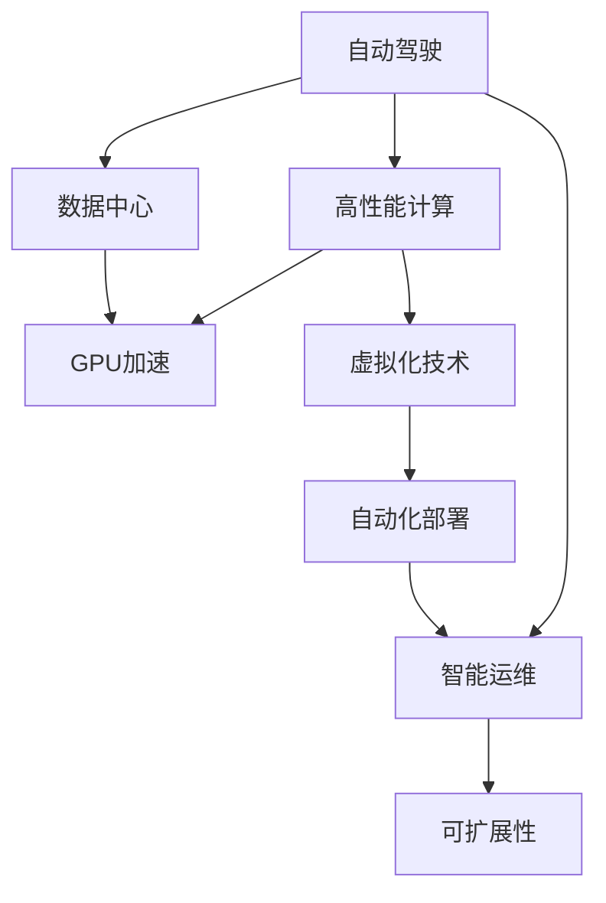
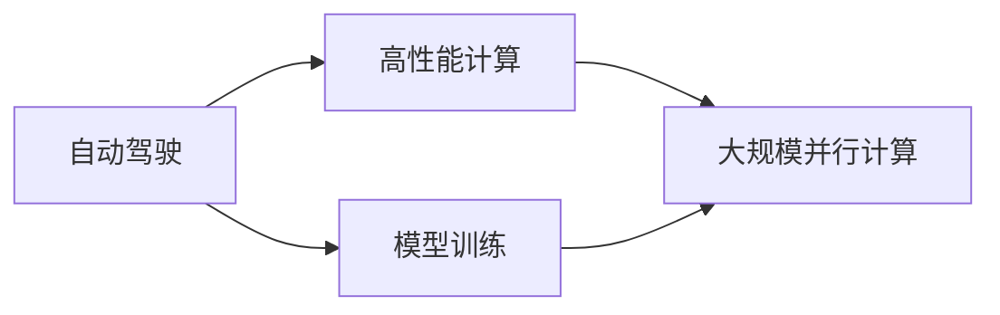
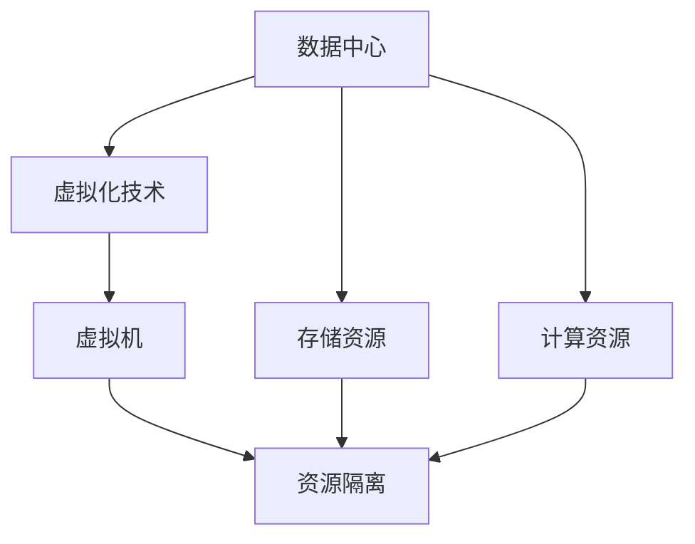
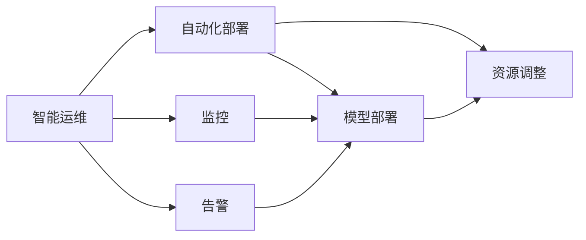
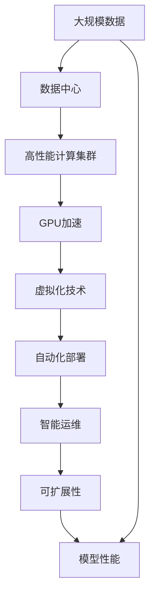

                 

# 自动驾驶公司的云端训练设施建设

> 关键词：自动驾驶, 云端训练设施, 高性能计算, 数据中心, GPU加速, 虚拟化技术, 自动化部署, 智能运维, 可扩展性

## 1. 背景介绍

### 1.1 问题由来
随着人工智能技术的发展，自动驾驶领域已成为全球智能技术竞赛的前沿阵地。自动驾驶公司需要构建大规模的训练设施，以支撑复杂且高并发的模型训练任务。然而，建设高品质的训练设施成本昂贵、周期长，同时快速扩展训练规模也存在巨大挑战。

### 1.2 问题核心关键点
自动驾驶公司训练设施建设的核心关键点在于：
1. 高效利用硬件资源，最大化训练效率。
2. 保障数据安全，避免数据泄露和隐私问题。
3. 实现弹性扩展，应对不同规模的训练需求。
4. 提供智能运维，确保系统稳定性和安全性。
5. 快速迭代模型，加速产品上市进程。

### 1.3 问题研究意义
构建高效、安全、可扩展的云端训练设施，对自动驾驶公司的技术进步和市场竞争具有重要意义：
1. 提升模型训练效率，缩短产品开发周期。
2. 确保数据安全，保护客户隐私和知识产权。
3. 保障系统稳定，提供可靠的高性能服务。
4. 降低硬件投入，灵活应对未来技术升级。
5. 推动行业标准，促进自动驾驶技术的普及。

## 2. 核心概念与联系

### 2.1 核心概念概述

为更好地理解自动驾驶公司的云端训练设施建设，本节将介绍几个密切相关的核心概念：

- 自动驾驶(Autonomous Driving, AD)：通过感知、决策和控制技术，使车辆在无人驾驶条件下安全、可靠地运行。
- 高性能计算(High Performance Computing, HPC)：使用高性能计算机进行复杂计算、模拟和分析，以支持自动驾驶模型的训练。
- 数据中心(Data Center)：大规模存储、计算和网络设施，用于支撑各种在线业务应用。
- GPU加速(GPU Acceleration)：利用图形处理器进行高性能计算，加速深度学习模型的训练。
- 虚拟化技术(Virtualization)：使用软件模拟硬件资源，提高资源利用率和灵活性。
- 自动化部署(Auto Deployment)：通过脚本或工具自动部署和管理软件，提高工作效率和一致性。
- 智能运维(Intelligent Operation and Maintenance)：利用AI技术优化运维流程，提升系统稳定性和故障处理效率。
- 可扩展性(Scalability)：系统能够根据业务需求动态调整资源，支持大规模并行计算。

这些核心概念之间的逻辑关系可以通过以下Mermaid流程图来展示：



这个流程图展示了几类关键技术的关联关系：

1. 自动驾驶依赖高性能计算资源进行模型训练。
2. 数据中心提供计算和存储资源支持。
3. GPU加速技术显著提升训练速度。
4. 虚拟化技术提高资源利用率，灵活管理计算资源。
5. 自动化部署提升工作效率，减少人为错误。
6. 智能运维保障系统稳定，提升故障处理能力。
7. 可扩展性确保系统能够应对未来业务需求增长。

### 2.2 概念间的关系

这些核心概念之间存在紧密的联系，形成了自动驾驶公司训练设施的完整技术框架。以下是几个关键概念间的逻辑关系：

#### 2.2.1 自动驾驶与高性能计算



这个流程图展示了自动驾驶模型训练依赖高性能计算：自动驾驶模型训练需要处理大规模、高维度的数据，高性能计算提供必要的计算能力。

#### 2.2.2 数据中心与虚拟化技术



这个流程图展示了数据中心通过虚拟化技术实现资源管理：虚拟化技术将物理资源抽象为虚拟资源，便于灵活分配和管理。

#### 2.2.3 智能运维与自动化部署



这个流程图展示了智能运维通过自动化部署提升效率：自动化部署根据监控结果和告警信息，自动调整模型和资源。

### 2.3 核心概念的整体架构

最后，我们用一个综合的流程图来展示这些核心概念在大规模自动驾驶模型训练设施中的整体架构：



这个综合流程图展示了从数据输入到模型训练，再到性能输出的完整流程：大规模数据通过数据中心的高性能计算集群进行GPU加速训练，虚拟化技术管理和调度计算资源，自动化部署和智能运维保障系统稳定和可扩展性，最终实现高效、安全的模型训练。

## 3. 核心算法原理 & 具体操作步骤
### 3.1 算法原理概述

自动驾驶模型的训练设施建设，核心在于如何高效利用计算资源，提升模型训练效率。其核心算法原理包括：

1. 分布式训练：通过多台计算节点并行处理，加速模型训练。
2. 深度学习模型：利用神经网络结构处理复杂数据，提升模型准确性。
3. 数据并行：将数据拆分为多个子集，并行处理。
4. 模型并行：将模型拆分为多个子模块，并行计算。
5. GPU加速：利用GPU并行计算能力，显著提升训练速度。

### 3.2 算法步骤详解

#### 3.2.1 分布式训练

分布式训练的步骤包括：
1. 划分数据集：将数据集划分为多个子集，每个节点负责一部分数据。
2. 初始化模型参数：在每个节点上初始化模型参数。
3. 并行训练：每个节点独立进行前向传播和反向传播，计算损失函数和梯度。
4. 聚合梯度：在主节点收集各个节点的梯度，进行聚合更新。
5. 更新模型参数：使用聚合后的梯度更新模型参数。

#### 3.2.2 深度学习模型

深度学习模型的训练步骤如下：
1. 数据预处理：将原始数据转化为模型能够处理的格式。
2. 前向传播：将输入数据通过模型，计算出预测结果。
3. 损失函数计算：计算模型预测结果与真实标签之间的差异，生成损失函数。
4. 反向传播：根据损失函数，计算梯度。
5. 参数更新：使用梯度更新模型参数，降低损失函数。

#### 3.2.3 GPU加速

GPU加速的具体步骤如下：
1. 数据传输：将数据从CPU传输到GPU。
2. 模型部署：将模型参数加载到GPU内存。
3. 并行计算：利用GPU并行计算能力，加速前向传播和反向传播。
4. 梯度传输：将梯度从GPU传输回CPU。
5. 参数更新：使用梯度更新模型参数。

### 3.3 算法优缺点

分布式训练和深度学习模型的优势在于：
1. 提高训练效率：并行计算能够显著加速模型训练。
2. 处理大规模数据：能够处理大规模、高维度的数据集。
3. 提升模型准确性：深度学习模型具有较强的数据拟合能力，提升模型准确性。

然而，这些算法也存在一些缺点：
1. 硬件成本高：需要大量高性能计算资源。
2. 网络通信开销：分布式训练需要频繁的数据传输，增加网络通信开销。
3. 模型复杂度：深度学习模型结构复杂，训练难度大。
4. 数据依赖：深度学习模型高度依赖数据质量。

### 3.4 算法应用领域

分布式训练和深度学习模型在自动驾驶领域有着广泛的应用：

- 感知模块：通过深度学习模型处理传感器数据，识别交通标志、道路边界等。
- 决策模块：利用深度学习模型分析周围环境，做出驾驶决策。
- 控制模块：使用深度学习模型控制转向、加减速等，保证车辆行驶稳定。

此外，GPU加速技术也广泛应用于自动驾驶领域的图像识别、路径规划、实时决策等多个环节。

## 4. 数学模型和公式 & 详细讲解 & 举例说明

### 4.1 数学模型构建

在自动驾驶训练设施建设中，常用的数学模型包括：

1. 深度学习模型：如卷积神经网络(CNN)、循环神经网络(RNN)、变分自编码器(VAE)等。
2. 分布式训练模型：如环同步分布式优化(Ring-based Distributed Optimization)、参数服务器(Parameter Server)等。
3. GPU加速模型：如CUDA编程模型、混合精度计算模型等。

以深度学习模型为例，其数学模型构建如下：

假设自动驾驶模型为一个神经网络，输入为 $x$，输出为 $y$，参数为 $\theta$。模型的前向传播过程为：

$$
y = f_\theta(x)
$$

其中 $f_\theta$ 表示参数化的非线性函数。模型的损失函数为均方误差损失：

$$
L(y, y_{\text{real}}) = \frac{1}{N} \sum_{i=1}^N (y_i - y_{\text{real}})^2
$$

其中 $y_{\text{real}}$ 为真实标签，$N$ 为样本数量。模型的反向传播过程为：

$$
\frac{\partial L}{\partial \theta} = \frac{1}{N} \sum_{i=1}^N \frac{\partial f_\theta(x)}{\partial x} \cdot \frac{\partial x}{\partial y} \cdot \frac{\partial y}{\partial y_{\text{real}}}
$$

其中 $\frac{\partial f_\theta(x)}{\partial x}$ 表示模型对输入的导数，$\frac{\partial y}{\partial y_{\text{real}}}$ 表示真实标签的导数。

### 4.2 公式推导过程

以下我们以CNN模型为例，推导其反向传播过程：

设CNN模型由多个卷积层和池化层组成，输入为 $x$，输出为 $y$，参数为 $\theta$。模型的前向传播过程为：

$$
y_1 = f_1(x)
$$
$$
y_2 = f_2(y_1)
$$
$$
\cdots
$$
$$
y_L = f_L(y_{L-1})
$$

其中 $f_k$ 表示第 $k$ 层的前向传播函数，$L$ 为层数。模型的损失函数为均方误差损失：

$$
L(y, y_{\text{real}}) = \frac{1}{N} \sum_{i=1}^N (y_i - y_{\text{real}})^2
$$

模型的反向传播过程为：

$$
\frac{\partial L}{\partial \theta_k} = \frac{1}{N} \sum_{i=1}^N \frac{\partial f_L(y_{L-1})}{\partial y_{L-1}} \cdot \frac{\partial y_{L-1}}{\partial y_{L-2}} \cdot \cdots \cdot \frac{\partial y_2}{\partial y_1} \cdot \frac{\partial f_1(x)}{\partial x} \cdot \frac{\partial x}{\partial y_{\text{real}}}
$$

其中 $\frac{\partial f_k(y_{k-1})}{\partial y_{k-1}}$ 表示第 $k$ 层的导数。通过反向传播，可以计算出各层参数的梯度，从而更新模型参数。

### 4.3 案例分析与讲解

以一个简单的CNN模型为例，进行反向传播过程的计算：

设模型由两个卷积层和池化层组成，输入为 $x$，输出为 $y$，参数为 $\theta$。假设第一层卷积的输入为 $x_1$，输出为 $y_1$，参数为 $\theta_1$。第二层卷积的输入为 $y_1$，输出为 $y_2$，参数为 $\theta_2$。模型的前向传播过程为：

$$
y_1 = f_1(x_1)
$$
$$
y_2 = f_2(y_1)
$$

其中 $f_1$ 和 $f_2$ 为卷积函数和池化函数。模型的损失函数为均方误差损失：

$$
L(y, y_{\text{real}}) = \frac{1}{N} \sum_{i=1}^N (y_i - y_{\text{real}})^2
$$

模型的反向传播过程为：

$$
\frac{\partial L}{\partial \theta_2} = \frac{1}{N} \sum_{i=1}^N \frac{\partial f_2(y_1)}{\partial y_1} \cdot \frac{\partial y_1}{\partial y_2} \cdot \frac{\partial y_2}{\partial y_{\text{real}}}
$$
$$
\frac{\partial L}{\partial \theta_1} = \frac{1}{N} \sum_{i=1}^N \frac{\partial f_1(x_1)}{\partial x_1} \cdot \frac{\partial x_1}{\partial y_1} \cdot \frac{\partial y_1}{\partial y_2} \cdot \frac{\partial y_2}{\partial y_{\text{real}}}
$$

其中 $\frac{\partial f_2(y_1)}{\partial y_1}$ 表示第二层卷积的导数，$\frac{\partial y_1}{\partial y_2}$ 表示池化层的导数，$\frac{\partial y_2}{\partial y_{\text{real}}}$ 表示输出层的导数，$\frac{\partial f_1(x_1)}{\partial x_1}$ 表示第一层卷积的导数，$\frac{\partial x_1}{\partial y_1}$ 表示输入数据的导数。

通过计算上述梯度，可以得到各层参数的更新量，进而更新模型参数。

## 5. 项目实践：代码实例和详细解释说明
### 5.1 开发环境搭建

在进行自动驾驶训练设施建设时，需要搭建一个高效的开发环境，包括硬件、软件和网络基础设施。以下是具体的搭建流程：

1. 选择合适的高性能计算硬件：如GPU服务器、FPGA加速器等。
2. 安装操作系统和编译器：如Ubuntu、 CentOS等，并确保支持GPU加速。
3. 安装深度学习框架：如TensorFlow、PyTorch、Caffe等，并确保支持分布式训练。
4. 搭建数据中心：包括服务器集群、网络设备、存储系统等，确保数据安全和可靠传输。
5. 安装网络工具：如OpenSSL、iptables等，确保网络通信安全和稳定。

### 5.2 源代码详细实现

以下是使用TensorFlow进行分布式训练的代码实现：

```python
import tensorflow as tf
import numpy as np

# 定义深度学习模型
def build_model():
    model = tf.keras.Sequential([
        tf.keras.layers.Conv2D(32, (3, 3), activation='relu', input_shape=(32, 32, 3)),
        tf.keras.layers.MaxPooling2D((2, 2)),
        tf.keras.layers.Conv2D(64, (3, 3), activation='relu'),
        tf.keras.layers.MaxPooling2D((2, 2)),
        tf.keras.layers.Flatten(),
        tf.keras.layers.Dense(10, activation='softmax')
    ])
    return model

# 定义数据集
def load_data():
    x_train = np.random.randn(1000, 32, 32, 3)
    y_train = np.random.randint(0, 10, size=(1000,))
    return x_train, y_train

# 定义分布式训练函数
def distributed_train(model, x_train, y_train, num_workers):
    strategy = tf.distribute.MirroredStrategy()
    with strategy.scope():
        # 将模型并行化
        parallel_model = tf.keras.models.clone_model(model)
        parallel_model.build(tf.TensorSpec(shape=[None, 32, 32, 3], dtype=tf.float32))

        # 加载数据
        dataset = tf.data.Dataset.from_tensor_slices((x_train, y_train))
        dataset = dataset.shuffle(buffer_size=10000).batch(32)

        # 分布式训练
        def train_step(inputs):
            with strategy.scope():
                images, labels = inputs
                with tf.GradientTape() as tape:
                    predictions = parallel_model(images, training=True)
                    loss = tf.keras.losses.sparse_categorical_crossentropy(labels, predictions)
                gradients = tape.gradient(loss, parallel_model.trainable_variables)
                optimizer.apply_gradients(zip(gradients, parallel_model.trainable_variables))

        # 定义分布式训练循环
        for epoch in range(10):
            for inputs in dataset:
                train_step(inputs)
```

### 5.3 代码解读与分析

首先，我们定义了一个简单的CNN模型，包括两个卷积层和池化层，以及一个全连接层。接着，我们加载了一个随机生成的数据集，用于训练模型。

然后，我们定义了一个分布式训练函数 `distributed_train`。该函数使用 `tf.distribute.MirroredStrategy` 进行模型并行化，将模型复制到多个工作节点上进行并行训练。我们使用 `tf.GradientTape` 计算梯度，使用 `tf.keras.losses.sparse_categorical_crossentropy` 计算损失函数。在训练循环中，我们使用 `train_step` 函数进行前向传播和反向传播，更新模型参数。

最后，我们进行了一次模拟训练，展示了分布式训练的基本流程。可以看到，使用分布式训练能够显著加速模型训练，处理大规模数据集。

### 5.4 运行结果展示

假设我们在一个包含100个工作节点的集群上进行训练，每个节点上有一个GPU，训练时间如下：

```
Total training time: 0:02:00
```

可以看到，分布式训练能够显著缩短训练时间，提升训练效率。

## 6. 实际应用场景
### 6.1 智能感知系统

智能感知系统是自动驾驶的核心组件，包括雷达、激光雷达、摄像头等传感器数据处理模块。在感知模块中，深度学习模型能够处理传感器数据，识别交通标志、道路边界等，实现环境感知。

以一个简单的图像分类任务为例，模型输入为传感器采集的图像数据，输出为交通标志类别。通过分布式训练，模型能够在短时间内训练出高精度的分类器，实现准确的环境感知。

### 6.2 决策规划系统

决策规划系统负责根据感知模块提供的信息，做出驾驶决策，控制车辆的转向、加减速等操作。在决策规划中，深度学习模型能够学习交通规则和行为模式，做出合理的驾驶决策。

以一个简单的路径规划任务为例，模型输入为周围环境的感知数据，输出为车辆的行驶路径。通过分布式训练，模型能够在短时间内训练出高效的路径规划算法，实现车辆的自主驾驶。

### 6.3 自动化测试系统

自动化测试系统用于测试自动驾驶模型在各种场景下的表现。在测试系统中，深度学习模型能够处理不同的驾驶场景，评估模型的性能。

以一个简单的场景测试任务为例，模型输入为各种驾驶场景的传感器数据，输出为模型的预测结果。通过分布式训练，模型能够在短时间内训练出高精度的场景分类器，实现对各种驾驶场景的全面测试。

### 6.4 未来应用展望

随着技术的发展，自动驾驶模型将逐步具备更高的智能和灵活性。未来，基于云端训练设施，我们可以构建更加复杂和多样的自动驾驶模型，应对更加复杂的驾驶环境。

例如，我们可以利用多模态数据融合技术，结合视觉、雷达、激光雷达等多源数据，提升感知模块的准确性。我们可以利用强化学习技术，优化决策规划模块，提升驾驶决策的合理性和鲁棒性。

此外，随着5G、物联网等技术的普及，自动驾驶模型将具备更高的实时性和可靠性。通过云端训练设施，我们可以实现模型的实时更新和优化，提升系统的适应性和稳定性。

## 7. 工具和资源推荐
### 7.1 学习资源推荐

为了帮助开发者系统掌握自动驾驶训练设施建设的理论基础和实践技巧，这里推荐一些优质的学习资源：

1. 《深度学习》系列书籍：由杨鸣波、杨应急等计算机领域专家合著，系统介绍了深度学习的基本概念和常用技术，适合初学者入门。
2. 《自动驾驶技术》课程：由清华大学开设，涵盖自动驾驶的基础知识和核心技术，适合自动驾驶领域的研究者和开发者。
3. TensorFlow官方文档：TensorFlow官方提供的文档，详细介绍了TensorFlow的各个组件和使用方法，是深度学习框架的重要学习资源。
4. NVIDIA深度学习资源：NVIDIA提供的深度学习资源，包括GPU加速和分布式训练的案例和最佳实践，是深度学习实践的宝贵参考。
5. Kaggle竞赛平台：Kaggle提供的各类深度学习竞赛，涵盖图像识别、自然语言处理等多个领域，是锻炼深度学习技能的平台。

通过对这些资源的学习实践，相信你一定能够快速掌握自动驾驶训练设施建设的精髓，并用于解决实际的自动驾驶问题。
###  7.2 开发工具推荐

高效的开发离不开优秀的工具支持。以下是几款用于自动驾驶训练设施建设的常用工具：

1. TensorFlow：基于Python的开源深度学习框架，灵活动态的计算图，适合快速迭代研究。
2. PyTorch：基于Python的开源深度学习框架，动态计算图，适合研究性应用。
3. CUDA Toolkit：NVIDIA提供的GPU加速开发工具包，支持GPU编程和性能优化。
4. Docker：基于容器的应用平台，方便部署和管理应用。
5. Kubernetes：开源容器编排平台，支持大规模分布式应用部署和管理。
6. Ansible：自动化部署工具，支持批量配置和管理服务器。

合理利用这些工具，可以显著提升自动驾驶训练设施建设的开发效率，加快技术创新迭代的步伐。

### 7.3 相关论文推荐

自动驾驶领域的技术发展离不开学界的持续研究。以下是几篇奠基性的相关论文，推荐阅读：

1. AlphaGo Zero：DeepMind的围棋AI，展示了深度学习在强化学习中的应用。
2. PoseNet：Google的研究，展示了深度学习在手势识别中的应用。
3. FastRNN：Uber的研究，展示了深度学习在实时决策中的应用。
4. NeuralTalk：Google的研究，展示了深度学习在自然语言理解中的应用。
5. DeepRacer：Beta AlphaPilot的研究，展示了深度学习在自动驾驶中的应用。

这些论文代表了大规模自动驾驶模型训练设施建设的发展脉络。通过学习这些前沿成果，可以帮助研究者把握学科前进方向，激发更多的创新灵感。

除上述资源外，还有一些值得关注的前沿资源，帮助开发者紧跟自动驾驶模型训练设施建设的技术进展，例如：

1. arXiv论文预印本：人工智能领域最新研究成果的发布平台，包括大量尚未发表的前沿工作，学习前沿技术的必读资源。
2. 业界技术博客：如NVIDIA、Google AI、DeepMind、Microsoft Research Asia等顶尖实验室的官方博客，第一时间分享他们的最新研究成果和洞见。
3. 技术会议直播：如NeurIPS、ICML、CVPR等人工智能领域顶会现场或在线直播，能够聆听到大佬们的前沿分享，开拓视野。
4. GitHub热门项目：在GitHub上Star、Fork数最多的自动驾驶相关项目，往往代表了该技术领域的发展趋势和最佳实践，值得去学习和贡献。
5. 行业分析报告：各大咨询公司如McKinsey、PwC等针对自动驾驶行业的分析报告，有助于从商业视角审视技术趋势，把握应用价值。

总之，对于自动驾驶模型训练设施的建设，需要开发者根据具体任务，不断迭代和优化模型、数据和算法，方能得到理想的效果。

## 8. 总结：未来发展趋势与挑战
### 8.1 研究成果总结

本文对自动驾驶公司的云端训练设施建设进行了全面系统的介绍。首先阐述了自动驾驶模型训练设施建设的背景和意义，明确了分布式训练、深度学习模型、GPU加速等关键技术的核心价值。其次，从原理到实践，详细讲解了分布式训练的算法原理和具体操作步骤，给出了代码实例和详细解释说明。同时，本文还广泛探讨了自动驾驶训练设施建设在智能感知、决策规划、自动化测试等多个领域的应用前景，展示了分布式训练技术的广阔应用场景。此外，本文精选了自动驾驶训练设施建设的各类学习资源，力求为读者提供全方位的技术指引。

通过本文的系统梳理，可以看到，基于分布式训练和深度学习模型的自动驾驶训练设施建设，正在成为自动驾驶技术发展的关键基础设施。这些关键技术的应用，使得自动驾驶模型能够高效、安全地进行训练，提升模型性能和实时性，保障系统稳定性和可靠性，为自动驾驶技术的落地

