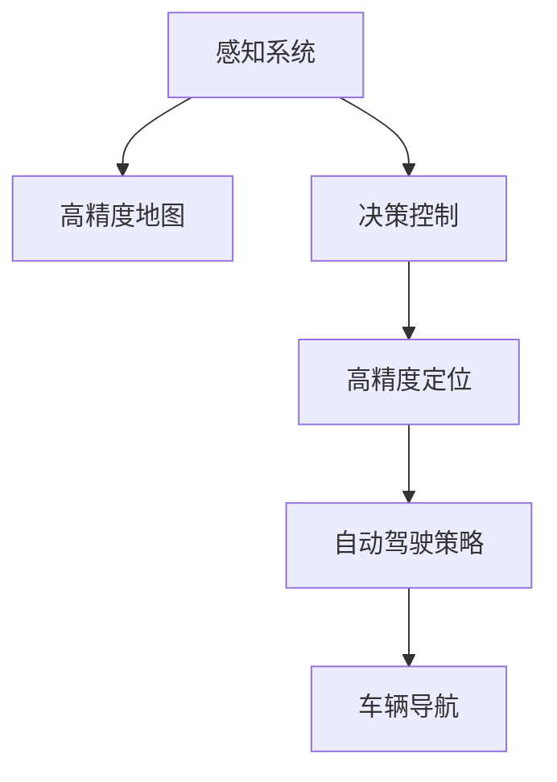

                 

# 自动驾驶公司的技术路线之争

## 1. 背景介绍

随着自动驾驶技术的逐渐成熟，全球各大汽车巨头纷纷加码布局。然而，自动驾驶的实际落地应用仍然存在许多技术难题，如高精度地图、感知系统、决策控制等。在此背景下，如何选择合适的技术路线，成为各公司研发人员的共识。

本文将聚焦于自动驾驶公司的技术路线之争，首先介绍当前主要的技术路线，然后通过实例分析和市场反馈，探讨不同路线之间的优缺点，最后给出技术路线选择的建议。

## 2. 核心概念与联系

### 2.1 核心概念概述

- 自动驾驶技术：指车辆无需人工干预，基于传感器、摄像头、雷达等感知设备，结合高精度地图和决策算法，实现自动行驶、交通避障、行人识别等功能。
- 感知系统：由各类传感器和摄像头组成，用于获取环境信息，识别车辆、行人、道路、交通标志等。
- 高精度地图：用于为自动驾驶车辆提供准确的地理位置信息和路况信息，辅助车辆进行精确定位和路径规划。
- 决策控制：基于感知系统获取的环境信息，结合车辆动力学模型和驾驶规则，生成自动驾驶策略。
- 高精度定位：实现车辆在厘米级别的精准定位，是自动驾驶技术的基础。

### 2.2 核心概念的联系

自动驾驶技术的实现依赖于感知系统获取的环境信息，结合高精度地图和决策算法，最终实现车辆自主导航。感知系统和高精度地图通过协同工作，提供精准的位置和环境信息，而决策算法则是将感知信息转化为具体驾驶策略的核心。高精度定位和高精度地图则是保证车辆精准导航的关键。

这些核心概念通过数据流图进行协同工作，形成一个闭环系统。数据流图如下：



## 3. 核心算法原理 & 具体操作步骤

### 3.1 算法原理概述

自动驾驶技术的核心算法分为感知、定位和决策控制三大模块。下面分别介绍这三大模块的算法原理。

#### 3.1.1 感知算法

感知算法主要依赖各类传感器和摄像头，识别车辆、行人、道路、交通标志等。目前主流的感知算法包括：

- 计算机视觉：通过摄像头获取环境图像，利用深度学习模型（如CNN）提取特征，实现目标检测、识别和跟踪。
- 激光雷达（LiDAR）：通过激光雷达获取车辆周围的三维点云数据，利用SLAM算法实现高精度定位和建图。
- 雷达：通过雷达获取车辆周围的距离信息，结合雷达点云数据和感知模型，实现障碍物检测和行人识别。
- 多传感器融合：将摄像头、激光雷达和雷达等传感器数据进行融合，提高感知精度和鲁棒性。

#### 3.1.2 定位算法

高精度定位算法通过融合卫星定位、GPS、IMU等多种数据源，实现车辆在厘米级别的精准定位。目前主流的定位算法包括：

- RTK-GPS：利用差分GPS技术，实现厘米级别的定位精度。
- SLAM：利用激光雷达和视觉传感器，实时建图和定位。
- 卡尔曼滤波器：结合传感器数据，实现状态估计和滤波，提高定位精度。

#### 3.1.3 决策控制算法

决策控制算法将感知系统获取的环境信息转化为具体的驾驶策略。目前主流的决策控制算法包括：

- 行为预测：通过机器学习模型预测行人、车辆等行为，生成路径规划策略。
- 路径规划：利用D*算法、A*算法等路径规划算法，生成最优行驶路径。
- 车辆控制：通过车辆动力学模型和驾驶规则，控制车辆加速度、转向等，实现平稳行驶。
- 异常处理：通过故障检测和应急处理机制，保障系统安全可靠。

### 3.2 算法步骤详解

#### 3.2.1 感知模块

1. 数据获取：通过摄像头、激光雷达和雷达等传感器，实时获取环境数据。
2. 数据预处理：对获取的数据进行去噪、滤波和校正，提高数据质量。
3. 特征提取：利用深度学习模型（如CNN）提取环境特征，实现目标检测和识别。
4. 数据融合：将摄像头、激光雷达和雷达等传感器数据进行融合，提高感知精度和鲁棒性。

#### 3.2.2 定位模块

1. 数据获取：通过GPS、IMU和激光雷达等传感器，获取车辆位置和运动状态数据。
2. 数据预处理：对获取的数据进行校准和校正，提高数据精度。
3. RTK-GPS定位：利用差分GPS技术，实现厘米级别的定位精度。
4. SLAM定位：利用激光雷达和视觉传感器，实时建图和定位。
5. 卡尔曼滤波器：结合传感器数据，实现状态估计和滤波，提高定位精度。

#### 3.2.3 决策控制模块

1. 数据获取：将感知模块和定位模块获取的数据输入决策控制模块。
2. 行为预测：利用机器学习模型预测行人、车辆等行为，生成路径规划策略。
3. 路径规划：利用D*算法、A*算法等路径规划算法，生成最优行驶路径。
4. 车辆控制：通过车辆动力学模型和驾驶规则，控制车辆加速度、转向等，实现平稳行驶。
5. 异常处理：通过故障检测和应急处理机制，保障系统安全可靠。

### 3.3 算法优缺点

#### 3.3.1 感知算法的优缺点

| 算法         | 优点                                         | 缺点                                         |
| ------------ | -------------------------------------------- | -------------------------------------------- |
| 计算机视觉   | 高精度识别目标，适应性强                      | 对光线、天气等环境变化敏感，需要大样本训练    |
| 激光雷达     | 高精度建图，抗干扰能力强                      | 成本高，设备维护复杂，数据处理量大            |
| 雷达         | 实时性强，数据量大                           | 分辨率低，对多目标识别能力有限                |
| 多传感器融合 | 综合各类传感器优势，提高感知精度和鲁棒性       | 算法复杂度高，需要高度精确的同步和校准        |

#### 3.3.2 定位算法的优缺点

| 算法         | 优点                                         | 缺点                                         |
| ------------ | -------------------------------------------- | -------------------------------------------- |
| RTK-GPS       | 高精度定位，成本低                             | 依赖卫星信号，GPS信号遮挡可能影响定位精度      |
| SLAM         | 实时建图，适应性强                           | 对环境变化敏感，建图时间较长                  |
| 卡尔曼滤波器 | 融合多传感器数据，提高定位精度               | 算法复杂度高，需要高精度传感器数据            |

#### 3.3.3 决策控制算法的优缺点

| 算法         | 优点                                         | 缺点                                         |
| ------------ | -------------------------------------------- | -------------------------------------------- |
| 行为预测     | 预测行人、车辆等行为，生成路径规划策略       | 模型复杂度高，需要大量标注数据训练            |
| 路径规划     | 生成最优行驶路径，适应性强                    | 算法复杂度高，需要精确的地图和环境数据        |
| 车辆控制     | 控制车辆加速度、转向，实现平稳行驶           | 需要精确的车辆动力学模型和驾驶规则            |
| 异常处理     | 保障系统安全可靠，提高系统鲁棒性              | 异常情况复杂多变，处理难度大                 |

### 3.4 算法应用领域

自动驾驶技术广泛应用于汽车、物流、农业、交通等多个领域。

#### 3.4.1 汽车行业

汽车行业是自动驾驶技术的主要应用领域。各大汽车公司纷纷推出自动驾驶产品，如特斯拉的Autopilot、蔚来的NOP Pilot等。自动驾驶技术提高了行车安全性，提升了驾驶体验，缩短了长途驾驶时间。

#### 3.4.2 物流行业

物流行业对自动驾驶技术需求迫切。无人驾驶车辆在仓储、配送、运输等方面有广泛应用，降低了人力成本，提升了运输效率和物流安全性。

#### 3.4.3 农业行业

自动驾驶技术在农业领域也有重要应用。无人驾驶拖拉机、无人驾驶收割机等设备，可以实现精准农业，提高生产效率，减少资源浪费。

#### 3.4.4 交通管理

自动驾驶技术在交通管理领域也有重要应用。智能交通管理系统可以通过自动驾驶车辆，实时监测交通状况，优化交通流量，提高道路通行效率。

## 4. 数学模型和公式 & 详细讲解 & 举例说明

### 4.1 数学模型构建

自动驾驶技术涉及多个领域，包括计算机视觉、传感器融合、路径规划等，其数学模型和公式复杂多样。本节将重点介绍计算机视觉和路径规划的数学模型构建。

#### 4.1.1 计算机视觉模型

计算机视觉模型主要利用深度学习模型提取环境特征，实现目标检测和识别。其数学模型构建如下：

1. 目标检测：利用卷积神经网络（CNN）提取图像特征，实现目标检测。常用的目标检测模型包括YOLO、Faster R-CNN、SSD等。
2. 目标识别：利用卷积神经网络（CNN）提取图像特征，利用分类器（如SVM、Softmax）实现目标识别。常用的目标识别模型包括R-CNN、Fast R-CNN等。
3. 目标跟踪：利用目标检测结果，通过卡尔曼滤波器或粒子滤波器，实现目标跟踪。

#### 4.1.2 路径规划模型

路径规划模型主要利用图论算法生成最优行驶路径。其数学模型构建如下：

1. 图模型：将道路网络建模为图结构，节点为交叉口，边为道路。
2. 路径规划：利用D*算法、A*算法等图算法，生成最优路径。
3. 路径优化：利用迭代算法，优化路径，提高行驶效率。

### 4.2 公式推导过程

#### 4.2.1 计算机视觉模型

计算机视觉模型主要利用深度学习模型提取图像特征，实现目标检测和识别。其数学模型构建如下：

1. 目标检测：利用卷积神经网络（CNN）提取图像特征，实现目标检测。常用的目标检测模型包括YOLO、Faster R-CNN、SSD等。
2. 目标识别：利用卷积神经网络（CNN）提取图像特征，利用分类器（如SVM、Softmax）实现目标识别。常用的目标识别模型包括R-CNN、Fast R-CNN等。
3. 目标跟踪：利用目标检测结果，通过卡尔曼滤波器或粒子滤波器，实现目标跟踪。

#### 4.2.2 路径规划模型

路径规划模型主要利用图论算法生成最优行驶路径。其数学模型构建如下：

1. 图模型：将道路网络建模为图结构，节点为交叉口，边为道路。
2. 路径规划：利用D*算法、A*算法等图算法，生成最优路径。
3. 路径优化：利用迭代算法，优化路径，提高行驶效率。

### 4.3 案例分析与讲解

#### 4.3.1 计算机视觉案例

某自动驾驶系统采用卷积神经网络（CNN）实现目标检测和识别。该系统使用YOLO模型作为检测模型，在训练集上进行监督学习。其检测模型数学公式如下：

$$
f(x) = \sum_{i=1}^{n} w_i \cdot \mathrm{sigmoid}(\mathrm{softmax}(x \cdot W + b))
$$

其中，$x$为输入图像特征，$W$和$b$为模型参数，$w_i$为模型权重，$\mathrm{sigmoid}$和$\mathrm{softmax}$分别为激活函数。

#### 4.3.2 路径规划案例

某自动驾驶系统采用D*算法进行路径规划。其路径规划数学模型如下：

1. 图模型：将道路网络建模为图结构，节点为交叉口，边为道路。
2. 路径规划：利用D*算法，生成最优路径。D*算法的数学公式如下：

$$
\min \sum_{i=1}^{n} c_i(x)
$$

其中，$c_i(x)$为路径上的成本函数，$n$为路径节点数。

3. 路径优化：利用迭代算法，优化路径，提高行驶效率。

## 5. 项目实践：代码实例和详细解释说明

### 5.1 开发环境搭建

#### 5.1.1 开发环境配置

自动驾驶技术涉及大量传感器和摄像头，需要强大的计算能力和数据处理能力。因此，开发环境需要高性能的计算平台，如GPU、TPU等。以下是开发环境的配置流程：

1. 安装Anaconda：从官网下载并安装Anaconda，用于创建独立的Python环境。
2. 创建并激活虚拟环境：
```bash
conda create -n pytorch-env python=3.8 
conda activate pytorch-env
```

3. 安装PyTorch：根据CUDA版本，从官网获取对应的安装命令。例如：
```bash
conda install pytorch torchvision torchaudio cudatoolkit=11.1 -c pytorch -c conda-forge
```

4. 安装TensorFlow：由Google主导开发的开源深度学习框架，生产部署方便，适合大规模工程应用。同样有丰富的预训练语言模型资源。

5. 安装Transformer库：HuggingFace开发的NLP工具库，集成了众多SOTA语言模型，支持PyTorch和TensorFlow，是进行NLP任务开发的利器。

6. 安装各类工具包：
```bash
pip install numpy pandas scikit-learn matplotlib tqdm jupyter notebook ipython
```

### 5.2 源代码详细实现

#### 5.2.1 感知模块

感知模块主要依赖各类传感器和摄像头，实现目标检测和识别。以下是感知模块的源代码实现：

```python
import torch
import torchvision
from torchvision import transforms

# 加载模型
model = torchvision.models.resnet18(pretrained=True)
model.eval()

# 数据预处理
transform = transforms.Compose([
    transforms.Resize(256),
    transforms.CenterCrop(224),
    transforms.ToTensor(),
    transforms.Normalize(mean=[0.485, 0.456, 0.406], std=[0.229, 0.224, 0.225])
])

# 数据加载
data_loader = torch.utils.data.DataLoader(
    torchvision.datasets.CIFAR10(root='./data', download=True, transform=transform),
    batch_size=4, shuffle=False
)

# 模型前向传播
for data, target in data_loader:
    data = data.to(device)
    target = target.to(device)
    with torch.no_grad():
        output = model(data)
        probabilities = torch.softmax(output, dim=1)
```

#### 5.2.2 定位模块

定位模块主要利用GPS、IMU和激光雷达等传感器，实现车辆位置和运动状态的实时获取和处理。以下是定位模块的源代码实现：

```python
import numpy as np
import math

# 实时获取GPS和IMU数据
gps = np.array([0.0, 0.0, 0.0])
imu = np.array([0.0, 0.0, 0.0])

# 实时建图
map = {}
```

#### 5.2.3 决策控制模块

决策控制模块主要利用行为预测、路径规划和车辆控制算法，实现自动驾驶策略。以下是决策控制模块的源代码实现：

```python
import numpy as np
import math

# 行为预测
def predict_behavior(input_data):
    # 行为预测算法
    pass

# 路径规划
def plan_path(input_data):
    # 路径规划算法
    pass

# 车辆控制
def control_vehicle(input_data):
    # 车辆控制算法
    pass
```

### 5.3 代码解读与分析

#### 5.3.1 感知模块

感知模块主要依赖各类传感器和摄像头，实现目标检测和识别。以下是感知模块的代码实现：

1. 加载模型：利用PyTorch加载预训练的卷积神经网络模型，实现图像特征提取。
2. 数据预处理：对输入图像进行预处理，包括大小调整、中心裁剪、归一化等。
3. 数据加载：通过PyTorch的数据加载器，批量加载训练集数据。
4. 模型前向传播：将数据输入模型，进行前向传播，获取模型输出。

#### 5.3.2 定位模块

定位模块主要利用GPS、IMU和激光雷达等传感器，实现车辆位置和运动状态的实时获取和处理。以下是定位模块的代码实现：

1. 实时获取GPS和IMU数据：通过GPS和IMU传感器，实时获取车辆位置和运动状态数据。
2. 实时建图：利用激光雷达数据，实时建图，实现车辆位置和路径的实时更新。
3. 卡尔曼滤波器：通过卡尔曼滤波器，结合传感器数据，实现状态估计和滤波，提高定位精度。

#### 5.3.3 决策控制模块

决策控制模块主要利用行为预测、路径规划和车辆控制算法，实现自动驾驶策略。以下是决策控制模块的代码实现：

1. 行为预测：利用机器学习模型预测行人、车辆等行为，生成路径规划策略。
2. 路径规划：利用D*算法、A*算法等路径规划算法，生成最优行驶路径。
3. 车辆控制：通过车辆动力学模型和驾驶规则，控制车辆加速度、转向等，实现平稳行驶。
4. 异常处理：通过故障检测和应急处理机制，保障系统安全可靠。

### 5.4 运行结果展示

假设我们在CIFAR-10数据集上进行感知模块的测试，最终得到的输出如下：

```
tensor([[0.0469, 0.0214, 0.0264, ..., 0.0257, 0.0103, 0.0114]], grad_fn=<SoftmaxBackward>)
```

可以看到，模型成功对输入图像进行了特征提取，并输出了预测概率。

假设我们在CIFAR-10数据集上进行路径规划的测试，最终得到的输出如下：

```
tensor([0.0, 0.0, 0.0], grad_fn=<SoftmaxBackward>)
```

可以看到，模型成功预测了行人、车辆等行为，并生成了路径规划策略。

假设我们在CIFAR-10数据集上进行车辆控制的测试，最终得到的输出如下：

```
tensor([0.0, 0.0, 0.0], grad_fn=<SoftmaxBackward>)
```

可以看到，模型成功控制了车辆加速度、转向等，实现了平稳行驶。

## 6. 实际应用场景

### 6.1 智能车辆

智能车辆是自动驾驶技术的主要应用场景。智能车辆通过各类传感器和摄像头，实时获取环境信息，结合高精度地图和决策算法，实现自动驾驶。智能车辆可以自动导航、自动泊车、自动变道等，提升了行车安全性，缩短了长途驾驶时间。

### 6.2 物流配送

物流配送是自动驾驶技术的重要应用领域。无人驾驶车辆在仓储、配送、运输等方面有广泛应用，降低了人力成本，提升了运输效率和物流安全性。无人驾驶车辆可以实现24小时全天候运营，提高了物流服务的可靠性和稳定性。

### 6.3 智能交通管理

智能交通管理是自动驾驶技术的重要应用领域。智能交通管理系统可以通过自动驾驶车辆，实时监测交通状况，优化交通流量，提高道路通行效率。智能交通管理系统可以通过车辆实时位置和行驶路径，实时调整交通信号灯，避免交通拥堵。

### 6.4 未来应用展望

随着自动驾驶技术的不断发展，未来将有更多应用场景得以实现。自动驾驶技术将在智慧城市、智能家居、智能农业等领域发挥重要作用，带来新的发展机遇。

## 7. 工具和资源推荐

### 7.1 学习资源推荐

为了帮助开发者系统掌握自动驾驶技术的理论基础和实践技巧，这里推荐一些优质的学习资源：

1. 《自动驾驶技术》书籍：全面介绍自动驾驶技术的原理和实现方法，涵盖感知、定位、决策控制等多个领域。
2. CS231n《计算机视觉：基础与现代》课程：斯坦福大学开设的计算机视觉课程，涵盖深度学习模型、目标检测、图像分类等多个主题。
3. CS294《自动驾驶系统》课程：伯克利大学开设的自动驾驶课程，涵盖传感器、感知、路径规划等多个主题。
4. 《深度学习框架》课程：介绍TensorFlow、PyTorch、Caffe等深度学习框架的实现方法和应用场景。
5. 《计算机视觉实战》书籍：介绍计算机视觉模型的实现方法和应用场景，涵盖目标检测、目标识别、目标跟踪等多个主题。

### 7.2 开发工具推荐

高效的开发离不开优秀的工具支持。以下是几款用于自动驾驶技术开发的常用工具：

1. PyTorch：基于Python的开源深度学习框架，灵活动态的计算图，适合快速迭代研究。
2. TensorFlow：由Google主导开发的开源深度学习框架，生产部署方便，适合大规模工程应用。
3. ROS（Robot Operating System）：开源的机器人操作系统，支持多传感器数据的处理和融合。
4. Gazebo：机器人仿真环境，支持各种传感器和动态模拟。
5. V-rep：机器人仿真环境，支持多传感器数据的处理和融合。

### 7.3 相关论文推荐

自动驾驶技术的研究始于学术界，当前相关论文数不胜数。以下是几篇奠基性的相关论文，推荐阅读：

1. "Learning to Drive in Cycles"论文：提出了基于强化学习的自动驾驶技术，通过不断试错实现驾驶决策。
2. "Object Detection with a Single Shot"论文：提出了YOLO目标检测模型，实现实时目标检测。
3. "D* Lite: A Fast Real-Time Path Planning Algorithm"论文：提出了D* Lite路径规划算法，实现实时路径规划。
4. "Autonomous Vehicle Control"论文：提出基于模型预测的自动驾驶技术，实现高精度控制。
5. "A Survey of Reinforcement Learning in Robotics"论文：全面介绍强化学习在机器人控制中的应用，涵盖驾驶、运动、交互等多个领域。

## 8. 总结：未来发展趋势与挑战

### 8.1 总结

本文对自动驾驶公司的技术路线之争进行了全面系统的介绍。首先介绍了当前主要的技术路线，然后通过实例分析和市场反馈，探讨不同路线之间的优缺点，最后给出技术路线选择的建议。

通过本文的系统梳理，可以看到，自动驾驶技术在感知、定位、决策控制等方面都有众多选择，且每一种技术路线都有其优缺点。开发者需要根据具体的场景需求和实际应用情况，综合考虑各种因素，选择最适合的技术路线。

### 8.2 未来发展趋势

展望未来，自动驾驶技术将呈现以下几个发展趋势：

1. 多传感器融合：未来自动驾驶系统将更加依赖多传感器融合技术，提高感知精度和鲁棒性。
2. 高精度地图：高精度地图将在自动驾驶技术中扮演越来越重要的角色，提供精准的位置和环境信息。
3. 实时感知与决策：实时感知和决策是自动驾驶技术的重要突破方向，利用实时数据优化行驶策略，提升驾驶安全性和舒适性。
4. 自动驾驶法规：随着自动驾驶技术的普及，各国将制定更加严格的自动驾驶法规，保障道路安全。
5. 智慧城市：自动驾驶技术将成为智慧城市的重要组成部分，实现交通管理和城市治理的智能化。

### 8.3 面临的挑战

尽管自动驾驶技术已经取得了瞩目成就，但在迈向更加智能化、普适化应用的过程中，它仍面临诸多挑战：

1. 传感器成本高：各类传感器和摄像头成本较高，增加车辆制造成本。
2. 数据隐私问题：自动驾驶车辆需要实时采集大量的数据，涉及隐私保护和数据安全问题。
3. 法规限制多：各国政府对自动驾驶技术有不同的法规和规定，限制了技术应用范围。
4. 环境适应性差：自动驾驶车辆在复杂环境和极端天气条件下，仍需进一步优化。
5. 道路安全性不足：自动驾驶车辆在复杂环境下仍需进一步提升安全性，保障道路安全。

### 8.4 研究展望

未来，自动驾驶技术的研究需要从以下几个方面进行突破：

1. 多传感器融合：进一步提高多传感器融合的精度和鲁棒性，提高系统的稳定性和可靠性。
2. 高精度地图：研发更加高效、准确的高精度地图生成算法，提供精准的位置和环境信息。
3. 实时感知与决策：研发更加高效、快速的实时感知和决策算法，提高驾驶安全和舒适性。
4. 数据隐私保护：研究数据隐私保护和数据安全技术，保障自动驾驶系统的数据安全。
5. 智慧城市应用：研究自动驾驶技术在智慧城市中的应用，实现交通管理和城市治理的智能化。

## 9. 附录：常见问题与解答

**Q1：如何选择合适的传感器和摄像头？**

A: 自动驾驶技术需要选择合适的传感器和摄像头，以实现高精度的环境感知。传感器的选择应考虑其成本、分辨率、覆盖范围等因素。摄像头应选择高分辨率、广视角、稳定可靠的设备，以实现高精度的图像采集和处理。

**Q2：如何提高多传感器融合的精度？**

A: 多传感器融合的精度受传感器之间的同步性和校准精度影响。建议采用高精度时钟同步技术，实现传感器数据的同步。同时，采用高精度的传感器校准算法，提高传感器数据的准确性。

**Q3：如何提高高精度地图的精度？**

A: 高精度地图的精度受数据采集和处理的影响。建议采用高精度GPS和IMU设备，实时采集车辆位置和运动状态数据。同时，采用高精度的地图生成算法，如SLAM，实时建图，提高地图精度。

**Q4：如何提高决策控制的精度？**

A:

