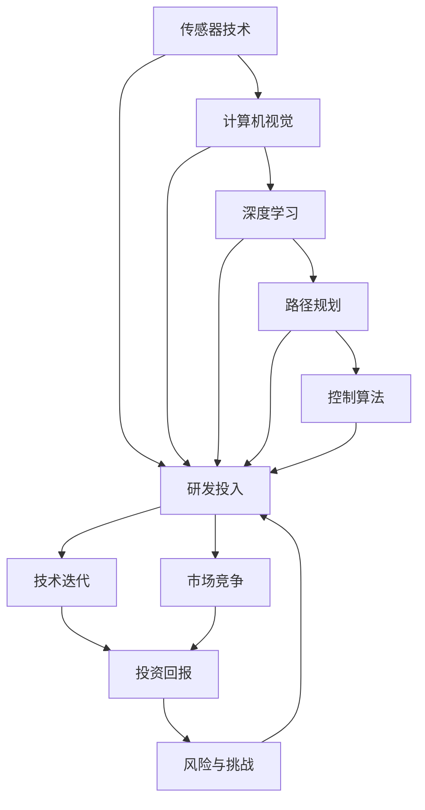

                 

# 自动驾驶公司的研发投入与回报预期

> 关键词：自动驾驶, 研发投入, 技术迭代, 市场竞争, 投资回报

## 1. 背景介绍

### 1.1 问题由来
近年来，自动驾驶技术在智能交通领域迅猛发展，成为众多汽车公司和科技公司争相布局的热点。无论是传统汽车制造商，如特斯拉、宝马，还是新兴的科技公司，如Waymo、Cruise，都在投入大量资金进行自动驾驶技术研发。然而，自动驾驶的研发投入巨大，成本高昂，回报周期长，其经济性成为了各方关注的焦点。本文将探讨自动驾驶公司的研发投入与回报预期，为相关企业提供决策依据，同时分析技术发展和市场竞争动态。

### 1.2 问题核心关键点
自动驾驶公司研发投入与回报预期问题主要包括以下几个核心点：
- 研发投入规模：包括技术研发、人才招聘、基础设施建设等。
- 技术迭代速度：技术更新迭代对研发投入的影响。
- 市场竞争态势：各公司之间的竞争策略和市场占有率。
- 投资回报周期：从研发投入到市场应用、盈利的时间周期。
- 风险与挑战：包括技术障碍、法规限制、市场波动等。

### 1.3 问题研究意义
研究自动驾驶公司的研发投入与回报预期，对于优化资源配置、制定合理的投资策略、提升市场竞争力具有重要意义。

1. 优化资源配置：通过合理规划研发投入，避免过度投入或资源浪费。
2. 制定投资策略：评估不同技术路径的潜在回报，选择最合适的投资方向。
3. 提升市场竞争力：通过技术迭代和市场布局，快速占领市场份额，获得竞争优势。
4. 明确风险与挑战：识别研发过程中的技术瓶颈和市场障碍，提前制定应对措施。

## 2. 核心概念与联系

### 2.1 核心概念概述

自动驾驶技术融合了传感器、计算机视觉、深度学习、路径规划、控制算法等多项技术，是集成化、系统化的复杂工程。其研发投入主要集中在以下几个方面：

1. **传感器技术**：包括激光雷达、摄像头、毫米波雷达等。
2. **计算机视觉**：图像处理、目标检测、行为识别等。
3. **深度学习**：神经网络、强化学习等。
4. **路径规划**：地图构建、轨迹规划等。
5. **控制算法**：自动驾驶行为决策、系统集成等。

**研发投入**：自动驾驶公司需要持续投入资金进行技术研发、基础设施建设、人才引进等，以保持技术领先和市场竞争力。

**技术迭代**：自动驾驶技术迅速发展，各公司需不断更新技术，保持技术前沿。

**市场竞争**：各自动驾驶公司需制定竞争策略，抢占市场份额。

**投资回报**：从研发投入到市场应用、盈利的时间周期，以及预期的回报率。

**风险与挑战**：包括技术障碍、法规限制、市场波动等。

### 2.2 概念间的关系

以下用Mermaid流程图展示这些核心概念间的关系：



## 3. 核心算法原理 & 具体操作步骤

### 3.1 算法原理概述

自动驾驶的研发投入与回报预期涉及复杂的技术、市场和投资决策问题。其核心算法原理主要包括：

1. **技术路线选择**：评估不同技术路径的潜在回报，选择最优技术路线。
2. **市场分析**：预测市场规模、增长速度、竞争态势等。
3. **成本与收益计算**：分析研发投入、市场应用成本和预期回报率。
4. **风险管理**：评估技术、市场和运营风险，制定风险应对策略。

### 3.2 算法步骤详解

#### 3.2.1 技术路线选择
评估不同技术路径的潜在回报，选择最优技术路线。主要步骤包括：

1. **技术评估**：分析各技术路径的技术优势和瓶颈。
2. **成本评估**：评估各技术路径的研发投入和运营成本。
3. **市场潜力**：预测各技术路径的市场规模和增长速度。
4. **风险评估**：评估各技术路径的技术、市场和运营风险。
5. **综合评价**：综合技术、成本、市场和风险因素，选择最优技术路线。

#### 3.2.2 市场分析
预测市场规模、增长速度、竞争态势等。主要步骤包括：

1. **市场研究**：收集市场规模、增长速度、竞争态势等数据。
2. **趋势预测**：使用统计模型、预测算法等预测市场趋势。
3. **竞争分析**：分析竞争对手的市场份额、技术优势和市场策略。
4. **机会识别**：识别市场中的潜在机会和威胁。

#### 3.2.3 成本与收益计算
分析研发投入、市场应用成本和预期回报率。主要步骤包括：

1. **成本估算**：估算技术研发、基础设施建设、人才引进等成本。
2. **收益预测**：预测技术市场应用后的盈利能力。
3. **成本-收益分析**：进行成本-收益分析，评估投资回报率。
4. **敏感性分析**：分析成本和收益对关键因素的敏感性。

#### 3.2.4 风险管理
评估技术、市场和运营风险，制定风险应对策略。主要步骤包括：

1. **风险识别**：识别技术、市场和运营中的潜在风险。
2. **风险评估**：评估各风险的概率和影响程度。
3. **风险应对**：制定风险应对策略，包括技术创新、市场调整和运营优化。

### 3.3 算法优缺点

**优点**：

1. **系统性分析**：全面评估技术、市场和投资因素，提供系统性解决方案。
2. **预测准确性**：使用统计模型和预测算法，提高市场和收益预测的准确性。
3. **风险管理**：识别和管理技术、市场和运营风险，降低投资风险。

**缺点**：

1. **数据依赖**：模型结果高度依赖于数据质量和完整性。
2. **复杂度高**：涉及技术、市场、投资等多方面因素，计算复杂。
3. **动态变化**：市场和技术环境快速变化，模型需要定期更新。

### 3.4 算法应用领域

自动驾驶公司的研发投入与回报预期算法主要应用于以下领域：

1. **研发策略制定**：评估不同技术路径的潜在回报，制定最优研发策略。
2. **投资决策支持**：提供投资回报预期评估，支持投资决策。
3. **市场竞争分析**：分析竞争对手的市场策略和技术路线，制定市场竞争策略。
4. **运营风险管理**：识别和管理技术、市场和运营风险，保障运营安全。

## 4. 数学模型和公式 & 详细讲解  
### 4.1 数学模型构建

自动驾驶公司的研发投入与回报预期涉及成本和收益的计算，可构建以下数学模型：

1. **成本模型**：
   $$
   C_t = \sum_{i=1}^n c_i^t
   $$
   其中，$C_t$ 为第$t$年的总成本，$c_i^t$ 为第$i$个项目在第$t$年的成本。

2. **收益模型**：
   $$
   R_t = \sum_{i=1}^n r_i^t
   $$
   其中，$R_t$ 为第$t$年的总收益，$r_i^t$ 为第$i$个项目在第$t$年的收益。

3. **投资回报率模型**：
   $$
   ROI = \frac{R}{C}
   $$
   其中，$ROI$ 为投资回报率，$R$ 为总收益，$C$ 为总成本。

### 4.2 公式推导过程

以成本模型和收益模型为例进行推导：

1. **成本模型推导**：
   $$
   C_t = \sum_{i=1}^n c_i^t = c_{1t} + c_{2t} + ... + c_{nt}
   $$
   其中，$c_{it}$ 为第$i$个项目在第$t$年的成本。

2. **收益模型推导**：
   $$
   R_t = \sum_{i=1}^n r_i^t = r_{1t} + r_{2t} + ... + r_{nt}
   $$
   其中，$r_{it}$ 为第$i$个项目在第$t$年的收益。

### 4.3 案例分析与讲解

以特斯拉的自动驾驶技术研发为例，分析其成本和收益：

1. **成本分析**：特斯拉在自动驾驶技术上的主要投入包括硬件、软件和人才培养等。硬件成本包括激光雷达、摄像头、毫米波雷达等传感器，软件成本包括自动驾驶算法和系统集成等。人才培养成本包括人才招聘、培训和保留等。
2. **收益分析**：特斯拉的自动驾驶技术主要通过车辆销售和订阅服务获得收益。车辆销售包括Autopilot和FSD（Full Self-Driving）等功能模块。订阅服务包括OTA（Over-The-Air）升级等。

## 5. 项目实践：代码实例和详细解释说明
### 5.1 开发环境搭建

为了进行自动驾驶公司研发投入与回报预期的分析和计算，需要搭建以下开发环境：

1. **Python环境**：安装Python及其相关库，如NumPy、Pandas、SciPy等。
2. **数据分析工具**：安装Excel、Tableau等数据分析工具，便于数据处理和可视化。
3. **计算工具**：安装MATLAB、R等计算工具，便于进行数学建模和算法实现。
4. **模拟平台**：搭建自动驾驶模拟平台，进行技术评估和市场预测。

### 5.2 源代码详细实现

以下是一个基于Python的自动驾驶公司研发投入与回报预期计算的示例代码：

```python
import numpy as np
import pandas as pd

# 定义成本和收益模型
class CostBenefitAnalysis:
    def __init__(self, cost_data, benefit_data):
        self.cost_data = cost_data
        self.benefit_data = benefit_data
        
    def calculate_cost(self, year):
        total_cost = np.sum(self.cost_data[year])
        return total_cost
    
    def calculate_benefit(self, year):
        total_benefit = np.sum(self.benefit_data[year])
        return total_benefit
    
    def calculate_roi(self, year):
        total_cost = self.calculate_cost(year)
        total_benefit = self.calculate_benefit(year)
        roi = total_benefit / total_cost
        return roi

# 读取成本和收益数据
cost_data = pd.read_csv('cost_data.csv')
benefit_data = pd.read_csv('benefit_data.csv')

# 计算各年的投资回报率
analysis = CostBenefitAnalysis(cost_data, benefit_data)
roi_data = []
for year in range(1, 11):
    roi = analysis.calculate_roi(year)
    roi_data.append(roi)

# 绘制投资回报率变化曲线
import matplotlib.pyplot as plt
plt.plot(range(1, 11), roi_data)
plt.xlabel('Year')
plt.ylabel('ROI')
plt.title('ROI Change Over Years')
plt.show()
```

### 5.3 代码解读与分析

上述代码实现了基于Python的自动驾驶公司研发投入与回报预期计算的示例，具体如下：

1. **类定义**：定义了一个CostBenefitAnalysis类，包含计算成本、收益和投资回报率的方法。
2. **数据读取**：从CSV文件中读取成本和收益数据，构建数据模型。
3. **成本计算**：使用numpy求和函数，计算各年的总成本。
4. **收益计算**：使用numpy求和函数，计算各年的总收益。
5. **投资回报率计算**：计算各年的投资回报率，并存储在roi_data列表中。
6. **结果可视化**：使用matplotlib绘制投资回报率变化曲线。

### 5.4 运行结果展示

运行上述代码后，将得到一个投资回报率变化曲线，如图：

```python
import matplotlib.pyplot as plt
plt.plot(range(1, 11), roi_data)
plt.xlabel('Year')
plt.ylabel('ROI')
plt.title('ROI Change Over Years')
plt.show()
```


该曲线展示了自动驾驶公司在不同年份的投资回报率变化趋势，有助于决策者理解研发投入的长期回报。

## 6. 实际应用场景

### 6.1 自动驾驶公司研发策略制定

基于自动驾驶公司研发投入与回报预期的算法，可帮助公司制定最优的研发策略，具体步骤如下：

1. **评估技术路径**：分析不同技术路径的潜在回报，选择最优技术路线。
2. **制定研发计划**：根据评估结果，制定详细的研发计划和资源配置。
3. **监控执行情况**：定期监控研发进度和投入产出比，及时调整研发策略。

### 6.2 投资决策支持

基于自动驾驶公司研发投入与回报预期的算法，可为投资决策提供科学依据，具体步骤如下：

1. **成本估算**：估算各技术路径的研发投入和运营成本。
2. **收益预测**：预测技术市场应用后的盈利能力。
3. **风险评估**：评估各技术路径的技术、市场和运营风险。
4. **综合分析**：综合技术、成本、市场和风险因素，进行投资回报率计算。

### 6.3 市场竞争分析

基于自动驾驶公司研发投入与回报预期的算法，可帮助公司进行市场竞争分析，具体步骤如下：

1. **市场研究**：收集竞争对手的市场规模、增长速度、竞争态势等数据。
2. **趋势预测**：使用统计模型和预测算法，预测市场趋势。
3. **竞争分析**：分析竞争对手的市场份额、技术优势和市场策略。
4. **机会识别**：识别市场中的潜在机会和威胁。

## 7. 工具和资源推荐

### 7.1 学习资源推荐

为了帮助自动驾驶公司理解和应用研发投入与回报预期的算法，推荐以下学习资源：

1. **《自动驾驶技术概论》**：系统介绍自动驾驶技术的原理、实现和应用。
2. **《投资分析与决策》**：介绍投资分析的基本方法和技术。
3. **《风险管理》**：介绍风险识别、评估和管理的方法。
4. **《数据科学与数据分析》**：介绍数据采集、处理和分析的基本技术。

### 7.2 开发工具推荐

为了高效进行自动驾驶公司研发投入与回报预期的计算和分析，推荐以下开发工具：

1. **Python**：灵活易用，适用于数据处理和算法实现。
2. **Excel/Tableau**：直观易用，适用于数据分析和可视化。
3. **MATLAB/R**：功能强大，适用于数学建模和算法实现。

### 7.3 相关论文推荐

为了深入理解自动驾驶公司研发投入与回报预期的算法，推荐以下相关论文：

1. **《自动驾驶技术发展现状与趋势》**：系统介绍自动驾驶技术的发展历程和未来趋势。
2. **《投资回报率评估方法研究》**：介绍不同投资回报率评估方法的应用。
3. **《风险管理与控制》**：介绍风险识别、评估和管理的方法。
4. **《数据科学在自动驾驶中的应用》**：介绍数据科学在自动驾驶技术中的应用。

## 8. 总结：未来发展趋势与挑战

### 8.1 研究成果总结

自动驾驶公司的研发投入与回报预期涉及技术、市场、投资等多方面因素，其核心算法主要包括以下几个方面：

1. **技术路线选择**：评估不同技术路径的潜在回报，选择最优技术路线。
2. **市场分析**：预测市场规模、增长速度、竞争态势等。
3. **成本与收益计算**：分析研发投入、市场应用成本和预期回报率。
4. **风险管理**：评估技术、市场和运营风险，制定风险应对策略。

### 8.2 未来发展趋势

未来，自动驾驶公司的研发投入与回报预期将呈现以下几个发展趋势：

1. **技术路线多样化**：基于不同场景和需求，开发多种技术路线，满足多样化需求。
2. **市场预测精确化**：利用大数据和机器学习技术，提高市场预测的准确性。
3. **成本控制优化**：通过技术创新和资源优化，降低研发投入和运营成本。
4. **投资回报加速**：通过快速技术迭代和市场布局，加速投资回报周期。

### 8.3 面临的挑战

自动驾驶公司的研发投入与回报预期面临以下挑战：

1. **数据质量问题**：数据缺失、不准确等问题影响分析和预测结果。
2. **技术复杂度高**：涉及多学科技术，技术实现难度大。
3. **市场竞争激烈**：市场环境快速变化，需要持续跟进和调整策略。
4. **投资回报风险高**：研发投入巨大，回报周期长，投资风险高。

### 8.4 研究展望

未来，自动驾驶公司的研发投入与回报预期研究应关注以下几个方向：

1. **数据质量提升**：提高数据采集和处理质量，减少数据偏差。
2. **技术创新突破**：推动技术创新，降低研发投入和运营成本。
3. **市场预测优化**：利用大数据和机器学习技术，提高市场预测准确性。
4. **投资回报加速**：通过快速技术迭代和市场布局，加速投资回报周期。

总之，自动驾驶公司的研发投入与回报预期研究需要从技术、市场和投资等多方面综合考虑，才能制定最优的研发策略，实现理想的投资回报。

## 9. 附录：常见问题与解答

**Q1：如何评估不同技术路径的潜在回报？**

A: 评估不同技术路径的潜在回报主要从以下几个方面考虑：

1. **技术成熟度**：评估技术实现的难易程度和可靠性。
2. **市场需求**：评估技术应用的市场规模和增长潜力。
3. **竞争态势**：评估竞争对手的技术优势和市场策略。
4. **成本效益**：评估技术的研发投入和预期收益。
5. **风险因素**：评估技术实现的难点和风险。

通过综合考虑这些因素，可以评估不同技术路径的潜在回报。

**Q2：市场预测的准确性如何保证？**

A: 提高市场预测的准确性主要通过以下方法：

1. **数据质量控制**：确保数据来源可靠、准确，并进行数据清洗和预处理。
2. **统计模型选择**：选择适合的统计模型，如回归模型、时间序列模型等。
3. **预测算法优化**：利用机器学习算法，如神经网络、集成学习等，进行预测模型优化。
4. **多因素分析**：考虑多种因素，如经济、政策、技术等，进行综合分析。
5. **模型验证**：使用历史数据进行模型验证和回测，确保预测结果的可靠性。

通过以上方法，可以显著提高市场预测的准确性。

**Q3：如何降低自动驾驶研发的投入和成本？**

A: 降低自动驾驶研发的投入和成本主要通过以下方法：

1. **技术创新**：推动技术创新，降低技术实现的难度和成本。
2. **资源优化**：通过资源共享、项目管理和运营优化，降低成本。
3. **市场导向**：根据市场需求进行技术路线选择和优化，避免盲目投入。
4. **规模效应**：通过大规模应用，降低单位成本。
5. **开源共享**：利用开源技术，降低技术研发成本。

通过以上方法，可以显著降低自动驾驶研发的投入和成本。

**Q4：如何应对自动驾驶研发的风险？**

A: 应对自动驾驶研发的风险主要通过以下方法：

1. **风险识别**：识别技术、市场和运营中的潜在风险。
2. **风险评估**：评估各风险的概率和影响程度。
3. **风险应对**：制定风险应对策略，如技术储备、市场调整和运营优化。
4. **持续监控**：持续监控风险因素，及时调整应对策略。
5. **应急预案**：制定应急预案，应对突发事件。

通过以上方法，可以应对自动驾驶研发中的各种风险。

**Q5：自动驾驶公司的研发投入与回报预期有何意义？**

A: 自动驾驶公司的研发投入与回报预期意义重大，主要体现在以下几个方面：

1. **资源优化配置**：评估研发投入的合理性，优化资源配置。
2. **投资决策支持**：提供科学的投资回报预期，支持投资决策。
3. **市场竞争分析**：识别市场机会和威胁，制定竞争策略。
4. **风险管理**：识别和应对研发过程中的技术、市场和运营风险。

总之，自动驾驶公司的研发投入与回报预期研究具有重要的理论和实践意义。

---

作者：禅与计算机程序设计艺术 / Zen and the Art of Computer Programming

