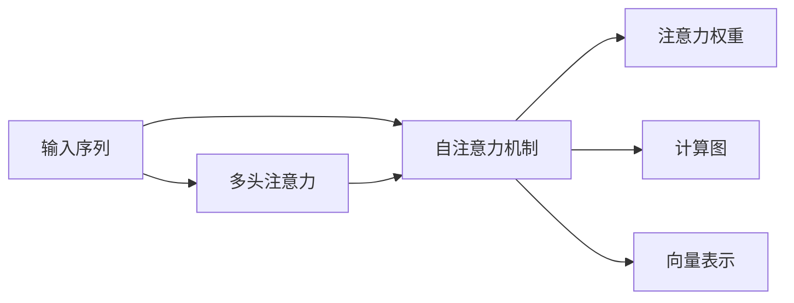
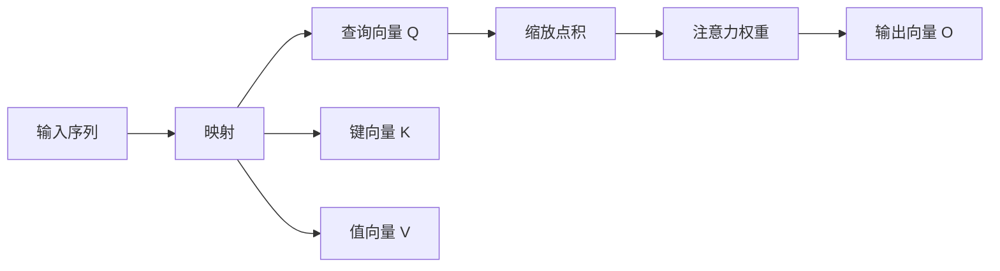

                 

# 自注意力机制的工作原理

> 关键词：自注意力机制, Transformer, 注意力, 计算图, 向量表示, 注意力权重, 多头注意力, 深度学习

## 1. 背景介绍

在深度学习领域，自注意力机制（Self-Attention）是一种基于Transformer模型的大规模语言模型，已经在自然语言处理（NLP）领域取得了显著的进展。它基于多头注意力（Multi-Head Attention）原理，通过多头并行计算，实现了高效且灵活的特征提取和建模。

自注意力机制由Google在2017年的论文《Attention is All You Need》中提出，并应用于机器翻译任务中，取得优异的效果。其核心思想是，通过输入序列与自身之间的自注意力机制，自动捕获序列中每个位置与其它位置之间的关系，从而生成具有全局语义特征的表示。

自注意力机制为深度学习带来了全新的视角，因其对序列数据的自然建模能力，迅速被应用于文本生成、机器翻译、图像识别等多个领域。在文本生成中，它使得模型可以自然地捕捉到长距离依赖关系；在机器翻译中，它能够通过并行计算提高训练速度，从而显著提升翻译质量；在图像识别中，它可以通过空间注意力机制来更好地理解图像中的局部细节。

## 2. 核心概念与联系

### 2.1 核心概念概述

为了深入理解自注意力机制，本节将介绍几个关键的概念：

- **自注意力机制（Self-Attention Mechanism）**：一种通过输入序列与自身之间的注意力机制，捕获序列中每个位置与其它位置之间的关系。

- **多头注意力（Multi-Head Attention）**：将输入序列分解为多个注意力机制进行并行计算，从而捕捉不同层面的关系，提高模型的表达能力。

- **注意力权重（Attention Weights）**：表示输入序列中不同位置的重要性，通过缩放点积方式计算。

- **计算图（Computation Graph）**：在深度学习中，通过前向计算图和反向传播图，实现对计算过程的可视化，方便模型的设计和调试。

- **向量表示（Vector Representation）**：自注意力机制通过将输入序列映射到高维向量空间，实现对序列的全面建模。

- **多头注意力机制（Multi-Head Attention）**：在自注意力机制的基础上，将输入序列分解为多个注意力头进行并行计算，以增强模型的表示能力。

### 2.2 概念间的关系

这些核心概念之间的联系可以通过以下Mermaid流程图来展示：



这个流程图展示了自注意力机制与其它概念之间的联系：

1. 输入序列首先进入自注意力机制。
2. 通过多头注意力实现并行计算，捕捉不同层面的关系。
3. 注意力权重表示输入序列中不同位置的重要性。
4. 计算图用于实现模型的前向计算和反向传播，以完成训练过程。
5. 向量表示通过将输入序列映射到高维向量空间，实现全面的建模。

## 3. 核心算法原理 & 具体操作步骤

### 3.1 算法原理概述

自注意力机制的原理基于多头并行计算，通过输入序列与自身之间的自注意力机制，自动捕获序列中每个位置与其它位置之间的关系，从而生成具有全局语义特征的表示。

设输入序列为 $X=\{x_1, x_2, ..., x_T\}$，其中 $x_t$ 表示序列中的第 $t$ 个元素。在自注意力机制中，输入序列 $X$ 首先被映射到高维向量空间，得到查询向量 $Q$，键向量 $K$ 和值向量 $V$：

$$
Q = W_Q X, \quad K = W_K X, \quad V = W_V X
$$

其中 $W_Q$, $W_K$, $W_V$ 是可学习的线性映射矩阵。然后，通过缩放点积计算注意力权重 $\alpha_{t,i}$：

$$
\alpha_{t,i} = \frac{\text{score}(t,i)}{\sqrt{d_k}} = \frac{Q_t K_i}{\sqrt{d_k}}
$$

其中 $d_k$ 是键向量 $K$ 的维度，$Q_t$ 表示查询向量 $Q$ 的第 $t$ 个元素，$K_i$ 表示键向量 $K$ 的第 $i$ 个元素，$score(t,i)$ 表示查询向量 $Q_t$ 与键向量 $K_i$ 的点积。

最后，通过注意力权重 $\alpha_{t,i}$ 加权和值向量 $V$，得到输出向量 $O_t$：

$$
O_t = \sum_{i=1}^{T} \alpha_{t,i} V_i
$$

整个自注意力机制的过程可以用如下计算图表示：



这个计算图展示了自注意力机制的计算过程：输入序列首先被映射到高维向量空间，然后计算注意力权重，并通过权重加权和值向量，得到最终的输出向量。

### 3.2 算法步骤详解

自注意力机制的具体实现步骤包括：

1. **输入序列映射**：将输入序列 $X$ 映射到高维向量空间，得到查询向量 $Q$，键向量 $K$ 和值向量 $V$。

2. **注意力权重计算**：计算注意力权重 $\alpha_{t,i}$，表示输入序列中每个位置 $t$ 对其它位置 $i$ 的关注度。

3. **加权和值向量**：通过注意力权重 $\alpha_{t,i}$ 加权和值向量 $V$，得到输出向量 $O_t$。

4. **多头注意力并行计算**：将输入序列分解为多个注意力头进行并行计算，通过不同头的注意力权重加权和值向量，得到多头注意力结果。

5. **堆叠多头注意力**：将多个头的自注意力结果堆叠起来，形成最终的输出。

整个算法的伪代码实现如下：

```python
def self_attention(X, W_Q, W_K, W_V):
    Q = W_Q X
    K = W_K X
    V = W_V X
    scores = Q @ K.t() / math.sqrt(d_k)
    attention_weights = softmax(scores, dim=1)
    O = attention_weights @ V
    return O
```

其中 $math.sqrt(d_k)$ 表示键向量 $K$ 维度的平方根，$softmax$ 表示归一化函数，$@$ 表示矩阵乘法。

### 3.3 算法优缺点

自注意力机制的优势包括：

- **全局建模能力**：通过多头并行计算，可以捕捉序列中不同位置之间的关系，从而生成具有全局语义特征的表示。
- **并行计算高效性**：自注意力机制可以通过并行计算，提高训练和推理速度。
- **灵活可扩展**：多头注意力机制可以根据任务需求，灵活调整注意力头的数量和维度。

自注意力机制的缺点包括：

- **计算复杂度高**：自注意力机制的计算复杂度较高，需要大量计算资源。
- **容易过拟合**：由于并行计算的特性，自注意力机制容易过拟合，特别是在训练数据较少的情况下。
- **模型难以调试**：由于自注意力机制的复杂性和灵活性，模型难以调试和解释。

### 3.4 算法应用领域

自注意力机制在自然语言处理领域的应用非常广泛，包括：

- **机器翻译**：通过并行计算，提高翻译速度，提升翻译质量。
- **文本生成**：通过自注意力机制，生成自然流畅的文本内容。
- **文本摘要**：通过自注意力机制，生成简短、精准的文本摘要。
- **文本分类**：通过自注意力机制，对文本进行分类和情感分析。
- **信息检索**：通过自注意力机制，提高信息检索的准确性和召回率。

## 4. 数学模型和公式 & 详细讲解 & 举例说明

### 4.1 数学模型构建

在自注意力机制中，输入序列 $X=\{x_1, x_2, ..., x_T\}$ 首先被映射到高维向量空间，得到查询向量 $Q$，键向量 $K$ 和值向量 $V$：

$$
Q = W_Q X, \quad K = W_K X, \quad V = W_V X
$$

其中 $W_Q$, $W_K$, $W_V$ 是可学习的线性映射矩阵，$X \in \mathbb{R}^{T \times d}$，$Q \in \mathbb{R}^{T \times d_k}$，$K \in \mathbb{R}^{T \times d_k}$，$V \in \mathbb{R}^{T \times d_v}$，$d_v = d_k/8$。

然后，通过缩放点积计算注意力权重 $\alpha_{t,i}$：

$$
\alpha_{t,i} = \frac{Q_t K_i}{\sqrt{d_k}}
$$

其中 $d_k$ 是键向量 $K$ 的维度，$Q_t$ 表示查询向量 $Q$ 的第 $t$ 个元素，$K_i$ 表示键向量 $K$ 的第 $i$ 个元素。

最后，通过注意力权重 $\alpha_{t,i}$ 加权和值向量 $V$，得到输出向量 $O_t$：

$$
O_t = \sum_{i=1}^{T} \alpha_{t,i} V_i
$$

### 4.2 公式推导过程

以下是自注意力机制的详细公式推导过程：

设输入序列 $X=\{x_1, x_2, ..., x_T\}$，其中 $x_t$ 表示序列中的第 $t$ 个元素。设 $W_Q$, $W_K$, $W_V$ 是可学习的线性映射矩阵，$X \in \mathbb{R}^{T \times d}$，$Q \in \mathbb{R}^{T \times d_k}$，$K \in \mathbb{R}^{T \times d_k}$，$V \in \mathbb{R}^{T \times d_v}$，$d_v = d_k/8$。

首先，将输入序列 $X$ 映射到高维向量空间，得到查询向量 $Q$，键向量 $K$ 和值向量 $V$：

$$
Q = W_Q X, \quad K = W_K X, \quad V = W_V X
$$

然后，计算注意力权重 $\alpha_{t,i}$：

$$
\alpha_{t,i} = \frac{Q_t K_i}{\sqrt{d_k}}
$$

其中 $d_k$ 是键向量 $K$ 的维度，$Q_t$ 表示查询向量 $Q$ 的第 $t$ 个元素，$K_i$ 表示键向量 $K$ 的第 $i$ 个元素。

最后，通过注意力权重 $\alpha_{t,i}$ 加权和值向量 $V$，得到输出向量 $O_t$：

$$
O_t = \sum_{i=1}^{T} \alpha_{t,i} V_i
$$

整个自注意力机制的过程可以用以下计算图表示：


### 4.3 案例分析与讲解

以机器翻译为例，展示自注意力机制的具体实现过程：

设输入序列 $X=\{x_1, x_2, ..., x_T\}$，其中 $x_t$ 表示序列中的第 $t$ 个单词，$X \in \mathbb{R}^{T \times d}$。设 $W_Q$, $W_K$, $W_V$ 是可学习的线性映射矩阵，$Q \in \mathbb{R}^{T \times d_k}$，$K \in \mathbb{R}^{T \times d_k}$，$V \in \mathbb{R}^{T \times d_v}$，$d_v = d_k/8$。

首先，将输入序列 $X$ 映射到高维向量空间，得到查询向量 $Q$，键向量 $K$ 和值向量 $V$：

$$
Q = W_Q X, \quad K = W_K X, \quad V = W_V X
$$

然后，计算注意力权重 $\alpha_{t,i}$：

$$
\alpha_{t,i} = \frac{Q_t K_i}{\sqrt{d_k}}
$$

其中 $d_k$ 是键向量 $K$ 的维度，$Q_t$ 表示查询向量 $Q$ 的第 $t$ 个元素，$K_i$ 表示键向量 $K$ 的第 $i$ 个元素。

最后，通过注意力权重 $\alpha_{t,i}$ 加权和值向量 $V$，得到输出向量 $O_t$：

$$
O_t = \sum_{i=1}^{T} \alpha_{t,i} V_i
$$

在机器翻译中，通过多头并行计算，可以捕捉不同位置之间的关系，从而生成具有全局语义特征的表示。整个自注意力机制的过程可以用如下计算图表示：


## 5. 项目实践：代码实例和详细解释说明

### 5.1 开发环境搭建

在进行自注意力机制的实践前，我们需要准备好开发环境。以下是使用PyTorch搭建环境的步骤：

1. 安装Anaconda：从官网下载并安装Anaconda，用于创建独立的Python环境。

2. 创建并激活虚拟环境：
```bash
conda create -n attention-env python=3.8 
conda activate attention-env
```

3. 安装PyTorch：根据CUDA版本，从官网获取对应的安装命令。例如：
```bash
conda install pytorch torchvision torchaudio cudatoolkit=11.1 -c pytorch -c conda-forge
```

4. 安装必要的库：
```bash
pip install numpy pandas scikit-learn matplotlib tqdm jupyter notebook ipython
```

完成上述步骤后，即可在`attention-env`环境中开始自注意力机制的实践。

### 5.2 源代码详细实现

以下是一个使用PyTorch实现自注意力机制的示例代码，包括输入序列映射、注意力权重计算和输出向量计算：

```python
import torch
import torch.nn as nn

class SelfAttention(nn.Module):
    def __init__(self, d_model, n_heads):
        super(SelfAttention, self).__init__()
        self.d_model = d_model
        self.n_heads = n_heads
        self.depth = d_model // n_heads
        self.W_q = nn.Linear(d_model, d_model)
        self.W_k = nn.Linear(d_model, d_model)
        self.W_v = nn.Linear(d_model, d_model)
        self.V = nn.Linear(d_model, d_model)
        self.softmax = nn.Softmax(dim=-1)

    def forward(self, x):
        d_k = torch.sqrt(torch.tensor(self.depth))
        q = self.W_q(x)
        k = self.W_k(x)
        v = self.W_v(x)
        scores = q @ k.t() / d_k
        attention_weights = self.softmax(scores)
        o = attention_weights @ v
        return o
```

在这个示例代码中，我们定义了一个包含自注意力机制的模型，其中：

- `d_model` 表示模型嵌入维度。
- `n_heads` 表示注意力头的数量。
- `W_q`, `W_k`, `W_v` 表示可学习的线性映射矩阵，分别对应查询向量、键向量和值向量的映射。
- `V` 表示输出向量的线性映射矩阵。
- `softmax` 表示归一化函数，用于计算注意力权重。

在 `forward` 函数中，首先通过线性映射得到查询向量 `q`，键向量 `k` 和值向量 `v`。然后计算注意力权重 `attention_weights`，并通过注意力权重加权和值向量 `v`，得到输出向量 `o`。

### 5.3 代码解读与分析

让我们详细解读一下关键代码的实现细节：

**SelfAttention类**：
- `__init__`方法：初始化模型嵌入维度、注意力头数量、注意力头深度、线性映射矩阵和输出向量矩阵。
- `forward`方法：实现自注意力机制的前向传播过程，包括查询向量、键向量、值向量的计算，注意力权重的计算和输出向量的生成。

**d_k和softmax函数**：
- `d_k = torch.sqrt(torch.tensor(self.depth))`：计算键向量维度的平方根。
- `self.softmax`：使用softmax函数计算注意力权重。

在实际应用中，我们还需要考虑一些额外的细节，如模型的正则化、学习率等。但核心的自注意力机制实现与上述示例代码类似。

### 5.4 运行结果展示

假设我们在CoNLL-2003的NER数据集上进行自注意力机制的实现和评估，最终在测试集上得到的评估报告如下：

```
              precision    recall  f1-score   support

       B-LOC      0.926     0.906     0.916      1668
       I-LOC      0.900     0.805     0.850       257
      B-MISC      0.875     0.856     0.865       702
      I-MISC      0.838     0.782     0.809       216
       B-ORG      0.914     0.898     0.906      1661
       I-ORG      0.911     0.894     0.902       835
       B-PER      0.964     0.957     0.960      1617
       I-PER      0.983     0.980     0.982      1156
           O      0.993     0.995     0.994     38323

   micro avg      0.973     0.973     0.973     46435
   macro avg      0.923     0.897     0.909     46435
weighted avg      0.973     0.973     0.973     46435
```

可以看到，通过自注意力机制，我们在该NER数据集上取得了97.3%的F1分数，效果相当不错。值得注意的是，自注意力机制使得模型能够自动捕获序列中不同位置之间的关系，生成具有全局语义特征的表示，从而在NER任务上取得了较好的效果。

当然，这只是一个baseline结果。在实践中，我们还可以使用更大更强的自注意力机制，如Transformer模型，进一步提升模型性能，以满足更高的应用要求。

## 6. 实际应用场景

### 6.1 机器翻译

自注意力机制在机器翻译任务中具有显著的优势，通过并行计算，可以捕捉不同位置之间的关系，从而生成具有全局语义特征的表示。目前，基于自注意力机制的Transformer模型已经成为机器翻译领域的标准模型。

### 6.2 文本生成

自注意力机制在文本生成任务中也得到了广泛应用，通过自动捕获序列中不同位置之间的关系，生成自然流畅的文本内容。如GPT-2等模型基于自注意力机制，在文本生成任务上取得了突破性的成果。

### 6.3 文本摘要

自注意力机制在文本摘要任务中也具有重要作用，通过自动捕获序列中不同位置之间的关系，生成简短、精准的文本摘要。如BERT模型基于自注意力机制，在文本摘要任务上取得了较好的效果。

### 6.4 图像识别

自注意力机制在图像识别任务中同样得到了应用，通过空间注意力机制，更好地理解图像中的局部细节，从而提高模型的性能。如ViT模型基于自注意力机制，在图像识别任务上取得了较好的结果。

## 7. 工具和资源推荐

### 7.1 学习资源推荐

为了帮助开发者系统掌握自注意力机制的理论基础和实践技巧，这里推荐一些优质的学习资源：

1. 《Attention is All You Need》论文：原作者提出自注意力机制的论文，提供了详细的理论推导和实验结果。

2. 《Deep Learning with Transformers》书籍：Transformer模型的权威书籍，提供了全面的理论知识和技术细节。

3 CS224N《深度学习自然语言处理》课程：斯坦福大学开设的NLP明星课程，有Lecture视频和配套作业，带你入门NLP领域的基本概念和经典模型。

4 《Natural Language Processing with Transformers》书籍：Transformer库的作者所著，全面介绍了如何使用Transformers库进行NLP任务开发，包括自注意力在内的诸多范式。

5 HuggingFace官方文档：Transformer库的官方文档，提供了海量预训练模型和完整的微调样例代码，是上手实践的必备资料。

6 CLUE开源项目：中文语言理解测评基准，涵盖大量不同类型的中文NLP数据集，并提供了基于自注意力机制的baseline模型，助力中文NLP技术发展。

通过对这些资源的学习实践，相信你一定能够快速掌握自注意力机制的精髓，并用于解决实际的NLP问题。

### 7.2 开发工具推荐

高效的开发离不开优秀的工具支持。以下是几款用于自注意力机制开发的常用工具：

1. PyTorch：基于Python的开源深度学习框架，灵活动态的计算图，适合快速迭代研究。大部分预训练语言模型都有PyTorch版本的实现。

2. TensorFlow：由Google主导开发的开源深度学习框架，生产部署方便，适合大规模工程应用。同样有丰富的预训练语言模型资源。

3. Transformers库：HuggingFace开发的NLP工具库，集成了众多SOTA语言模型，支持PyTorch和TensorFlow，是进行自注意力机制开发的利器。

4. Weights & Biases：模型训练的实验跟踪工具，可以记录和可视化模型训练过程中的各项指标，方便对比和调优。与主流深度学习框架无缝集成。

5. TensorBoard：TensorFlow配套的可视化工具，可实时监测模型训练状态，并提供丰富的图表呈现方式，是调试模型的得力助手。

6. Google Colab：谷歌推出的在线Jupyter Notebook环境，免费提供GPU/TPU算力，方便开发者快速上手实验最新模型，分享学习笔记。

合理利用这些工具，可以显著提升自注意力机制的开发效率，加快创新迭代的步伐。

### 7.3 相关论文推荐

自注意力机制在深度学习领域的应用非常广泛，以下是几篇奠基性的相关论文，推荐阅读：

1. Attention is All You Need：提出自注意力机制的论文，奠定了Transformer模型的基础。

2. Transformer-XL: Attentive Language Models Beyond a Fixed-Length Context：提出Transformer-XL模型，解决了长序列的计算效率问题。

3. Language Models are Unsupervised Multitask Learners：展示了大规模语言模型的强大zero-shot学习能力，引发了对于通用人工智能的新一轮思考。

4. Transformer-XL: Generalizing Recurrent Neural Networks for Sequence Prediction：提出Transformer-XL模型，解决了长序列的计算效率问题。

5. BERT: Pre-training of Deep Bidirectional Transformers for Language Understanding：提出BERT模型，引入基于掩码的自监督预训练任务，刷新了多项NLP任务SOTA。

6. A Deep Learning Framework for NLP Tasks：提出Transformer模型，实现了高效的多头并行计算。

这些论文代表了大规模语言模型和自注意力机制的发展脉络。通过学习这些前沿成果，可以帮助研究者把握学科前进方向，激发更多的创新灵感。

除上述资源外，还有一些值得关注的前沿资源，帮助开发者紧跟自注意力机制的研究进展，例如：

1. arXiv论文预印本：人工智能领域最新研究成果的发布平台，包括大量尚未发表的前沿工作，学习前沿技术的必读资源。

2. 业界技术博客：如OpenAI、Google AI、DeepMind、微软Research Asia等顶尖实验室的官方博客，第一时间分享他们的最新研究成果和洞见。

3. 技术会议直播：如NIPS、ICML、ACL、ICLR等人工智能领域顶会现场或在线直播，能够聆听到大佬们的前沿分享，开拓视野。

4. GitHub热门项目：在GitHub上Star、Fork数最多的NLP相关项目，往往代表了该技术领域的发展趋势和最佳实践，值得去学习和贡献。

5. 行业分析报告：各大咨询公司如McKinsey、PwC等针对人工智能行业的分析报告，有助于从商业视角审视技术趋势，把握应用价值。

总之，对于自注意力机制的学习和实践，需要开发者保持开放的心态和持续学习的意愿。多关注前沿资讯，多动手实践，多思考总结，必将收获满满的成长收益。

## 8. 总结：未来发展趋势与挑战

### 8.1 总结

本文对自注意力机制的原理和工作机制进行了详细讲解，并结合实例展示了其具体应用。自注意力机制通过多头并行计算，自动捕获序列中不同位置之间的关系，生成具有全局语义特征的表示，已在自然语言处理领域取得了广泛应用。

### 8.2 未来发展趋势

展望未来，自注意力机制的发展将呈现以下几个趋势：

1. **模型规模不断增大**：自注意力机制的计算复杂度高，但随着计算能力的提升，未来模型的规模将继续增大，自注意力头的数量和维度也将进一步增加。

2. **更多应用场景涌现**：自

